# Authentication and Authorization

<details>
<summary>Relevant source files</summary>

The following files were used as context for generating this wiki page:

- [client-sdks/client-js/src/client.ts](client-sdks/client-js/src/client.ts)
- [client-sdks/client-js/src/resources/agent.test.ts](client-sdks/client-js/src/resources/agent.test.ts)
- [client-sdks/client-js/src/resources/agent.ts](client-sdks/client-js/src/resources/agent.ts)
- [client-sdks/client-js/src/resources/agent.vnext.test.ts](client-sdks/client-js/src/resources/agent.vnext.test.ts)
- [client-sdks/client-js/src/resources/index.ts](client-sdks/client-js/src/resources/index.ts)
- [client-sdks/client-js/src/types.ts](client-sdks/client-js/src/types.ts)
- [e2e-tests/create-mastra/create-mastra.test.ts](e2e-tests/create-mastra/create-mastra.test.ts)
- [packages/core/src/agent/**tests**/dynamic-model-fallback.test.ts](packages/core/src/agent/__tests__/dynamic-model-fallback.test.ts)
- [packages/core/src/memory/mock.ts](packages/core/src/memory/mock.ts)
- [packages/core/src/storage/mock.test.ts](packages/core/src/storage/mock.test.ts)
- [packages/core/src/stream/aisdk/v5/transform.test.ts](packages/core/src/stream/aisdk/v5/transform.test.ts)
- [packages/core/src/stream/aisdk/v5/transform.ts](packages/core/src/stream/aisdk/v5/transform.ts)
- [packages/server/src/server/handlers.ts](packages/server/src/server/handlers.ts)
- [packages/server/src/server/handlers/agent.test.ts](packages/server/src/server/handlers/agent.test.ts)
- [packages/server/src/server/handlers/agents.ts](packages/server/src/server/handlers/agents.ts)
- [packages/server/src/server/handlers/memory.test.ts](packages/server/src/server/handlers/memory.test.ts)
- [packages/server/src/server/handlers/memory.ts](packages/server/src/server/handlers/memory.ts)
- [packages/server/src/server/handlers/utils.test.ts](packages/server/src/server/handlers/utils.test.ts)
- [packages/server/src/server/handlers/utils.ts](packages/server/src/server/handlers/utils.ts)
- [packages/server/src/server/handlers/vector.test.ts](packages/server/src/server/handlers/vector.test.ts)
- [packages/server/src/server/schemas/memory.test.ts](packages/server/src/server/schemas/memory.test.ts)
- [packages/server/src/server/schemas/memory.ts](packages/server/src/server/schemas/memory.ts)

</details>

## Purpose and Scope

This page documents Mastra's authentication and authorization system, including:

- **Auth Provider System**: Pluggable interfaces (`IUserProvider`, `ISessionProvider`, `ISSOProvider`, `ICredentialsProvider`) for implementing custom authentication
- **Enterprise Edition RBAC/ACL**: Role-based access control and access control lists available in `@mastra/core/auth/ee`
- **Route Permission Enforcement**: Server-level permission checks on API endpoints
- **Auth Provider Bundling**: Automatic inclusion of auth providers in build output
- **RequestContext Propagation**: How authentication context flows through agents, workflows, and storage

For information about dynamic configuration resolution using `RequestContext`, see [RequestContext and Dynamic Configuration](#2.2). For client-side authentication configuration, see [JavaScript Client SDK](#10.1).

---

## Key Concepts

### Auth Provider Interfaces

Mastra defines four core auth provider interfaces that can be implemented for custom authentication:

| Interface              | Purpose                         | Methods                                 |
| ---------------------- | ------------------------------- | --------------------------------------- |
| `IUserProvider`        | User lookup and management      | User CRUD operations, profile retrieval |
| `ISessionProvider`     | Session creation and validation | Session lifecycle, token validation     |
| `ISSOProvider`         | Single sign-on integration      | OAuth flows, SAML, enterprise SSO       |
| `ICredentialsProvider` | Password and API key auth       | Credential validation, password reset   |

These interfaces are exported from `@mastra/core/auth` and implemented by auth provider packages like `@mastra/auth-clerk`, `@mastra/auth-workos`, etc.

Sources: [packages/core/package.json:34-43](), [auth/\*/package.json:1-90]()

### RequestContext

`RequestContext` is the core mechanism for propagating authentication state through Mastra. It:

- Is provided by clients in API calls
- Propagates through the server to agents, workflows, tools, and memory operations
- Validates resource ownership at the storage layer
- Enables conditional configuration resolution
- Supports multi-tenant data isolation

Sources: [client-sdks/client-js/src/types.ts:24]()

### Resource Ownership

Mastra enforces ownership through:

- **`resourceId`**: Primary identifier for the owner/tenant of a resource (thread, agent state, workflow run, etc.)
- **`metadata`**: Additional filtering criteria for fine-grained access control
- **Storage-level filtering**: Queries automatically filter by ownership to prevent unauthorized access

### Multi-Tenancy

Multiple tenants share the same Mastra instance by:

- Using unique `resourceId` values per tenant/user
- Filtering storage queries by `resourceId` and optional `metadata`
- Isolating data at the storage layer without cross-tenant leakage

Sources: [client-sdks/client-js/src/types.ts:306-329]()

---

## Authentication Architecture

### Server Initialization with Authentication

The Mastra server uses a centralized `MastraServer` adapter that handles authentication middleware registration. The `createHonoServer` function configures authentication through the adapter pattern:

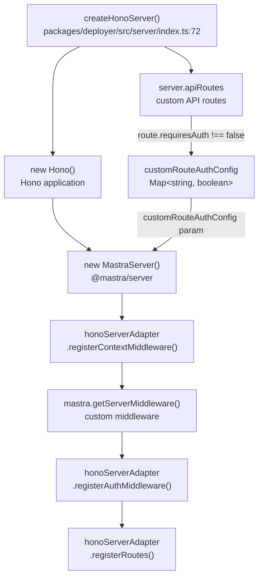

Sources: [packages/deployer/src/server/index.ts:72-248]()

### Request Flow with Authentication

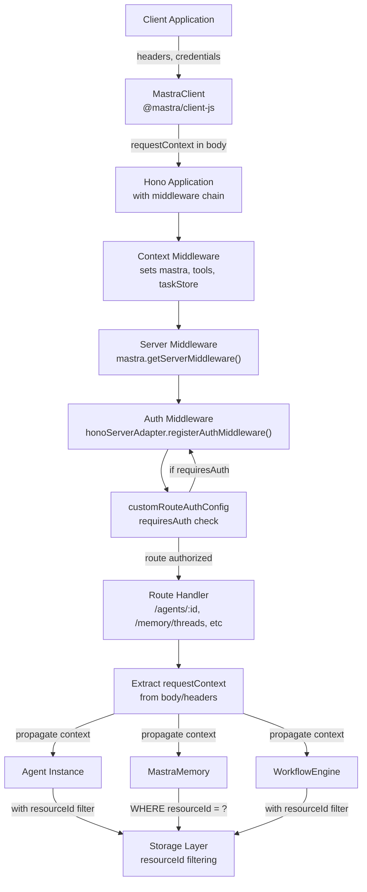

Sources: [packages/deployer/src/server/index.ts:72-248](), [client-sdks/client-js/src/types.ts:50-78]()

---

### Client Authentication Configuration

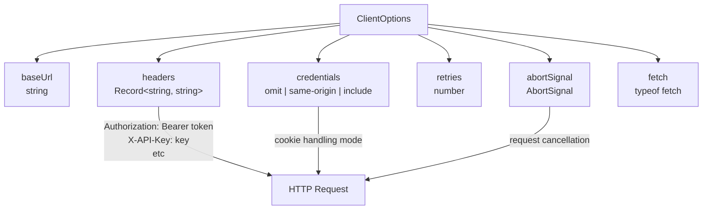

Sources: [client-sdks/client-js/src/types.ts:50-69]()

---

## Client-Side Authentication

### ClientOptions Configuration

The `MastraClient` constructor accepts authentication configuration through `ClientOptions`:

| Field         | Type                                   | Purpose                                              |
| ------------- | -------------------------------------- | ---------------------------------------------------- |
| `baseUrl`     | `string`                               | Base URL for API requests                            |
| `headers`     | `Record<string, string>`               | Custom headers (e.g., Authorization token, API keys) |
| `credentials` | `'omit' \| 'same-origin' \| 'include'` | Credential/cookie handling mode                      |
| `abortSignal` | `AbortSignal`                          | Signal for request cancellation                      |
| `fetch`       | `typeof fetch`                         | Custom fetch implementation (e.g., for Tauri)        |

Sources: [client-sdks/client-js/src/types.ts:50-69]()

### Example: Authenticated Client Setup

```typescript
import { MastraClient } from '@mastra/client-js'

const client = new MastraClient({
  baseUrl: 'https://api.example.com',
  headers: {
    Authorization: 'Bearer your-jwt-token',
    'X-API-Key': 'your-api-key',
    'X-Tenant-ID': 'tenant-123',
  },
  credentials: 'include', // Include cookies in requests
})
```

---

## RequestContext Propagation

### Flow Through the System

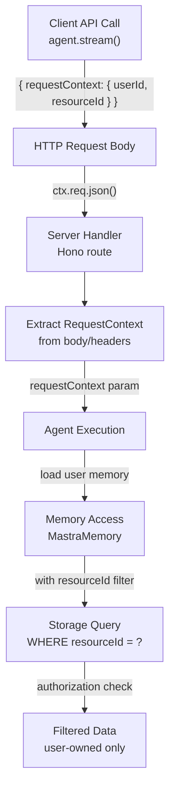

Sources: [client-sdks/client-js/src/types.ts:24](), [packages/server/src/server/handlers/memory.ts:1-100]()

### RequestContext in API Methods

Most client methods accept an optional `requestContext` parameter:

**Agent execution:**

```typescript
await client.agents.stream('agent-id', {
  messages: [...],
  requestContext: {
    userId: 'user-123',
    tenantId: 'tenant-456',
    permissions: ['read', 'write']
  }
});
```

**Memory operations:**

```typescript
await client.memory.createThread({
  agentId: 'my-agent',
  resourceId: 'user-123',
  requestContext: {
    userId: 'user-123',
    tenantId: 'tenant-456',
  },
})
```

**Workflow execution:**

```typescript
const run = await client.workflows.createRun('workflow-id');
await run.start({
  inputData: { ... },
  requestContext: {
    userId: 'user-123',
    orgId: 'org-456'
  }
});
```

Sources: [client-sdks/client-js/src/types.ts:133-166](), [client-sdks/client-js/src/types.ts:296-329]()

---

## Thread Ownership Validation

### Thread Access Control Flow

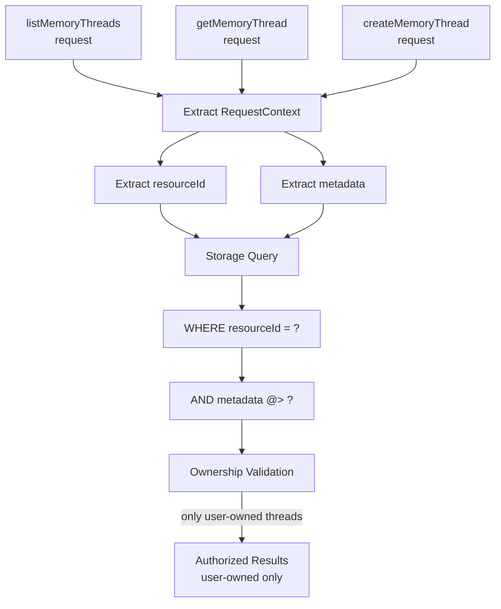

Sources: [client-sdks/client-js/src/types.ts:306-329](), [packages/server/src/server/handlers/memory.ts:1-200]()

### Thread Filtering Parameters

When listing threads, the system filters by:

| Parameter        | Type                      | Purpose                          | Required                  |
| ---------------- | ------------------------- | -------------------------------- | ------------------------- |
| `resourceId`     | `string`                  | Primary owner/tenant identifier  | Optional, but recommended |
| `metadata`       | `Record<string, unknown>` | Additional filtering (AND logic) | Optional                  |
| `agentId`        | `string`                  | Agent-specific thread filtering  | Optional                  |
| `requestContext` | `RequestContext`          | Authentication context           | Optional                  |

Sources: [client-sdks/client-js/src/types.ts:306-329]()

---

## Multi-Tenancy Support

### Tenant Isolation Architecture

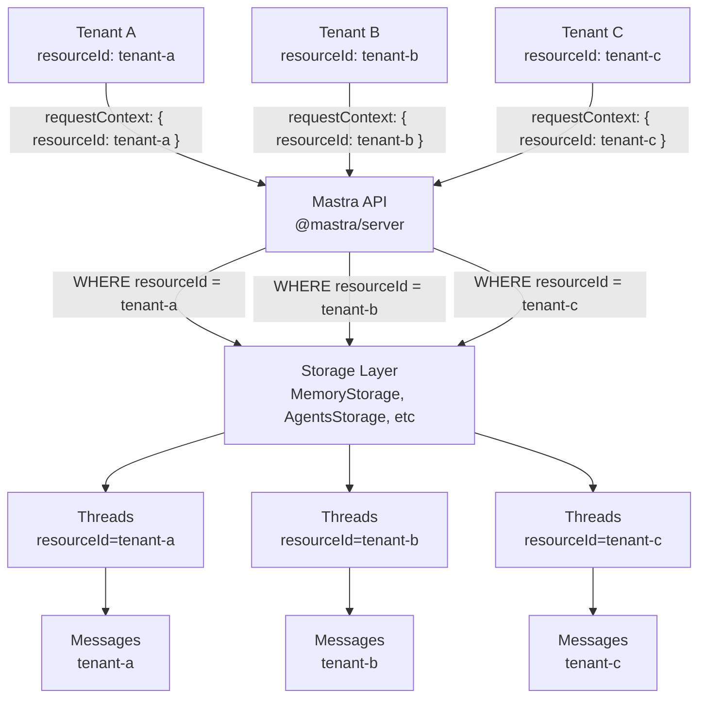

Sources: [client-sdks/client-js/src/types.ts:306-329]()

### Metadata-Based Filtering

The `metadata` field enables fine-grained multi-tenant access control:

```typescript
// List threads for specific project within tenant
await client.memory.listThreads({
  resourceId: 'user-123',
  metadata: {
    projectId: 'project-456',
    environment: 'production',
    region: 'us-west',
  },
  requestContext: { userId: 'user-123' },
})
```

- Threads must match **all** specified metadata key-value pairs (AND logic)
- Metadata provides hierarchical or multi-dimensional tenant isolation
- Example use cases: per-project isolation, environment separation, feature flags

Sources: [client-sdks/client-js/src/types.ts:306-329]()

---

## Storage-Level Authorization

### Authorization Enforcement Points

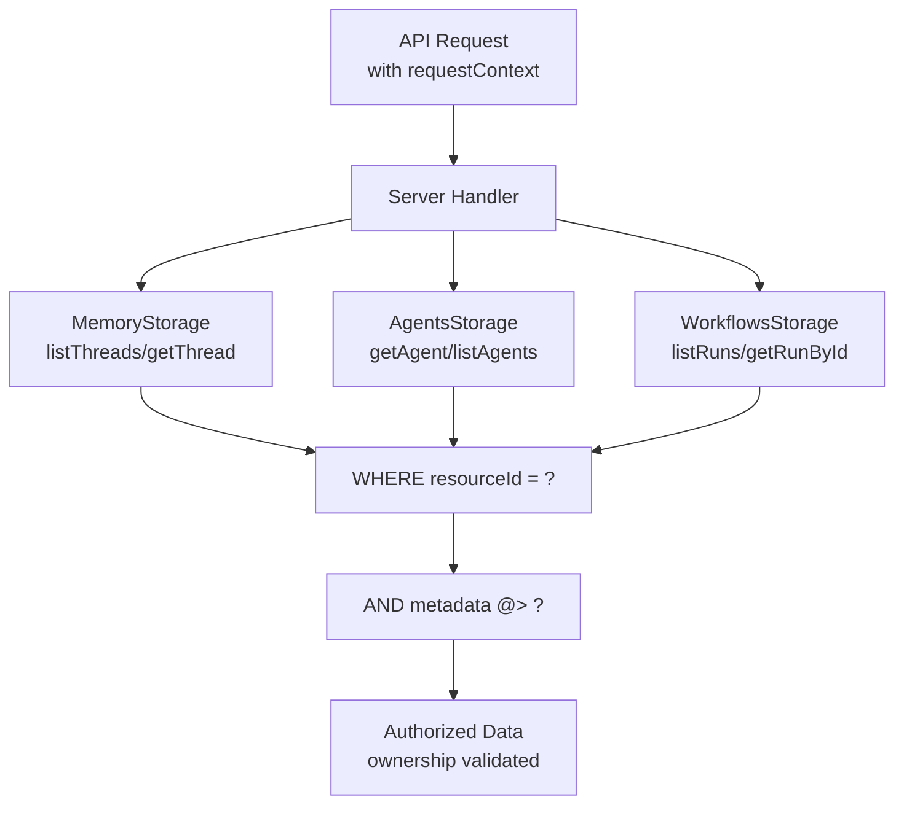

### Memory Storage Interface Methods

The `MemoryStorage` interface defines methods that enforce ownership:

| Method                                        | Authorization              | Purpose                         |
| --------------------------------------------- | -------------------------- | ------------------------------- |
| `listThreads({ resourceId, metadata })`       | Filters by `resourceId`    | List threads owned by resource  |
| `getThread({ threadId, resourceId })`         | Validates thread ownership | Get thread if owned by resource |
| `createThread({ resourceId, ... })`           | Sets owner                 | Create thread owned by resource |
| `listMessages({ threadId, resourceId })`      | Validates thread ownership | List messages in owned thread   |
| `saveMessages({ threadId, resourceId, ... })` | Validates thread ownership | Save messages to owned thread   |

Sources: [client-sdks/client-js/src/types.ts:306-329](), [packages/server/src/server/handlers/memory.ts:1-300]()

---

## Agent and Workflow Authorization

### Agent Execution with RequestContext

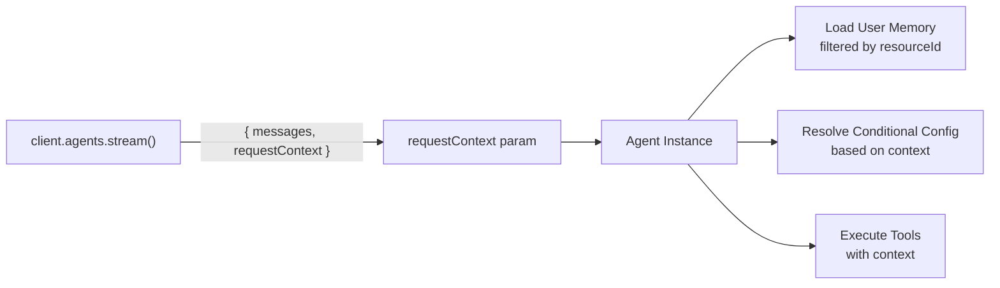

When executing agents, `requestContext` is propagated throughout:

```typescript
const stream = await client.agents.stream('agent-id', {
  messages: [...],
  requestContext: {
    userId: 'user-123',
    permissions: ['read', 'write'],
    orgId: 'org-456'
  }
});
```

The agent uses the context to:

1. Load user-specific memory (filtered by `resourceId`)
2. Resolve conditional configurations (model, instructions, tools) based on context
3. Pass context to tools for authorization checks
4. Store results with appropriate ownership

Sources: [client-sdks/client-js/src/types.ts:133-166]()

### Workflow Execution with RequestContext

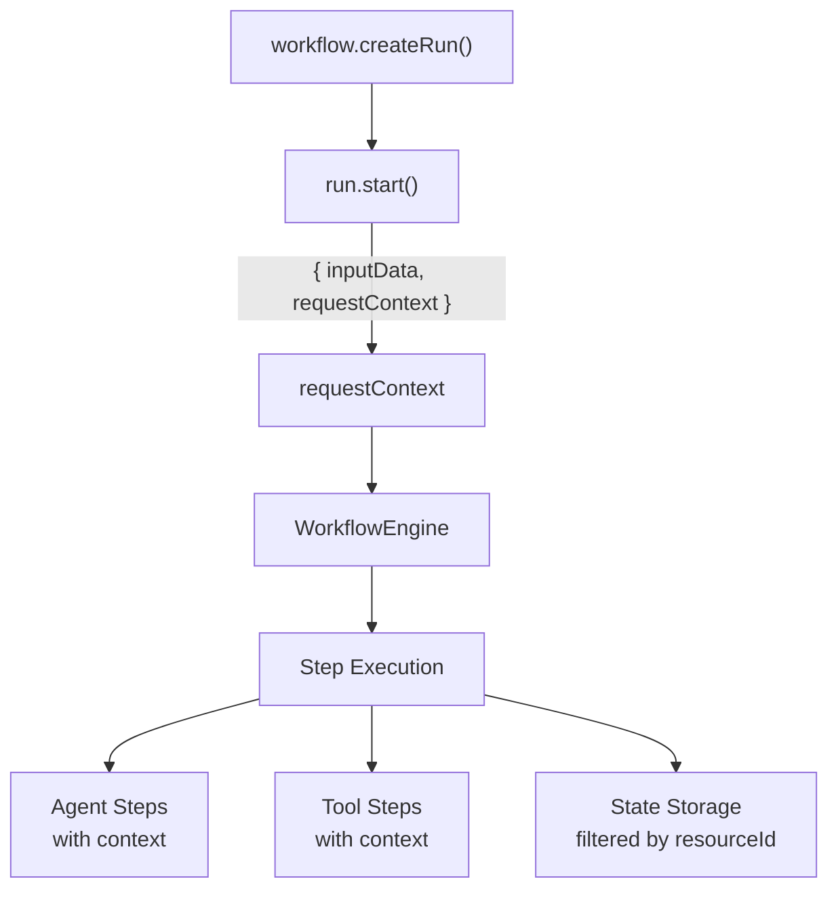

Workflows propagate `requestContext` to all steps:

```typescript
const run = await client.workflows.createRun('workflow-id')
await run.start({
  inputData: { query: 'test' },
  requestContext: {
    userId: 'user-123',
    orgId: 'org-456',
  },
})
```

The workflow:

1. Propagates context to all workflow steps
2. Filters workflow state/results by resource ownership
3. Passes context to nested agents and tools
4. Stores run data with appropriate `resourceId`

Sources: [client-sdks/client-js/src/types.ts:24](), Architecture diagrams

---

## Authentication Provider Integration

### Supported Auth Providers

Mastra includes dedicated authentication provider packages:

| Package                    | Provider      | Use Case                      |
| -------------------------- | ------------- | ----------------------------- |
| `@mastra/auth-auth0`       | Auth0         | Enterprise SSO, OAuth         |
| `@mastra/auth-better-auth` | Better Auth   | Open-source auth              |
| `@mastra/auth-clerk`       | Clerk         | User management, social login |
| `@mastra/auth-firebase`    | Firebase Auth | Google ecosystem              |
| `@mastra/auth-supabase`    | Supabase Auth | PostgreSQL-based auth         |
| `@mastra/auth-workos`      | WorkOS        | Enterprise B2B auth           |

Sources: [pnpm-lock.yaml:114-343]()

### Auth Provider Implementation

#### Auth Provider Interfaces

**@mastra/core/auth Interface Diagram**

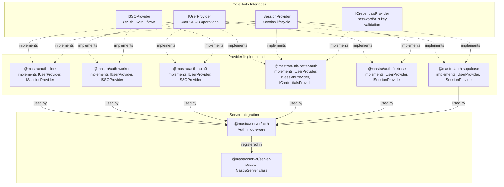

Sources: [packages/core/package.json:34-43](), [auth/\*/package.json:1-90](), [packages/server/package.json:64-73]()

### Integration Architecture

**Auth Middleware Request Flow**

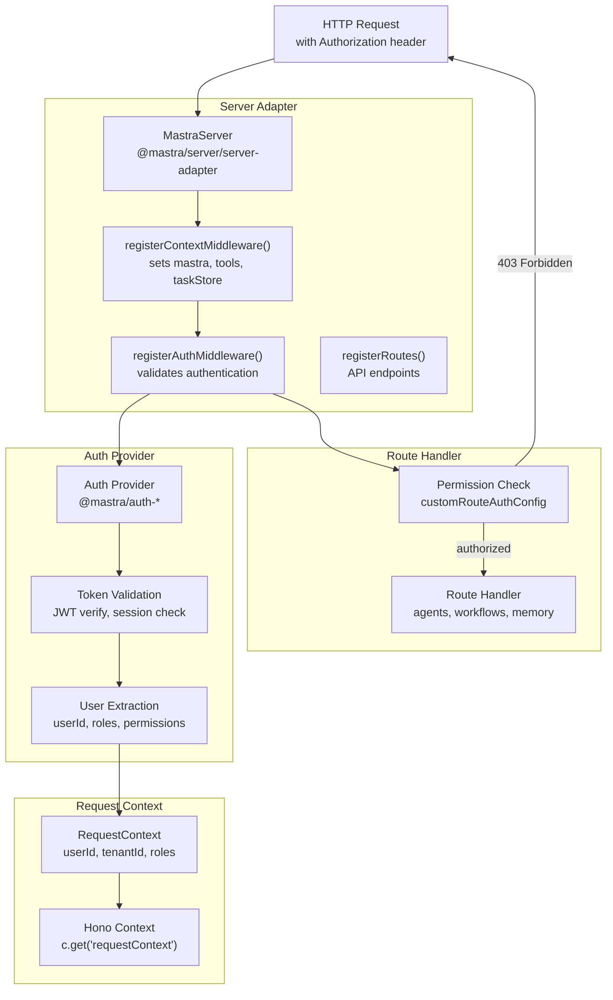

Sources: [packages/server/package.json:44-73](), [packages/deployer/src/server/index.ts:124-248]()

### Server-Side Auth Module

The `@mastra/server` package provides authentication integration through its exports:

```typescript
// Server adapter with built-in auth middleware registration
import { MastraServer } from '@mastra/server/server-adapter'

// Auth utilities for custom implementations
import { auth } from '@mastra/server/auth'
```

The `MastraServer` adapter handles:

- **Context middleware registration**: Sets `mastra`, `tools`, `taskStore`, `requestContext` in Hono context
- **Auth middleware registration**: Validates authentication based on `customRouteAuthConfig`
- **Route registration**: Registers all agent, workflow, memory, and custom API routes
- **Per-route auth control**: Routes can opt-in/out via `requiresAuth` property

Sources: [packages/server/package.json:44-73](), [packages/deployer/src/server/index.ts:124-248]()

### Custom Route Authentication

Custom API routes can control authentication via the `requiresAuth` property:

```typescript
const server = {
  apiRoutes: [
    {
      path: '/public/status',
      method: 'GET',
      requiresAuth: false, // Public endpoint
      handler: async (c) => {
        return c.json({ status: 'ok' })
      },
    },
    {
      path: '/private/data',
      method: 'GET',
      requiresAuth: true, // Default - requires auth
      handler: async (c) => {
        const mastra = c.get('mastra')
        const requestContext = c.get('requestContext')
        // Access authenticated user data
        return c.json({ data: 'secret' })
      },
    },
  ],
}
```

The server builds a `customRouteAuthConfig` map during initialization:

| Route Config                 | Default Behavior        | Override      |
| ---------------------------- | ----------------------- | ------------- |
| `requiresAuth` not specified | Requires authentication | —             |
| `requiresAuth: true`         | Requires authentication | —             |
| `requiresAuth: false`        | Public access           | No auth check |

Sources: [packages/deployer/src/server/index.ts:96-106](), [packages/deployer/src/server/index.ts:218-239]()

---

## Enterprise Edition RBAC/ACL

### Overview

Mastra Enterprise Edition provides role-based access control (RBAC) and access control lists (ACL) through the `@mastra/core/auth/ee` export. This system enables fine-grained permission management for multi-tenant applications.

**Enterprise Auth Exports**

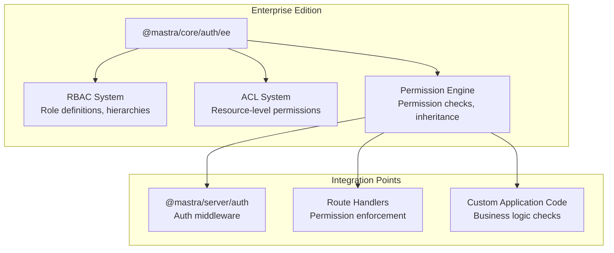

Sources: [packages/core/package.json:34-43]()

### RBAC Implementation

The RBAC system defines roles and their associated permissions:

| Component          | Purpose                         | Example                                            |
| ------------------ | ------------------------------- | -------------------------------------------------- |
| **Roles**          | Group users by permission level | `admin`, `editor`, `viewer`                        |
| **Permissions**    | Granular action rights          | `agents:read`, `agents:write`, `workflows:execute` |
| **Role Hierarchy** | Inheritance of permissions      | `admin` inherits all `editor` permissions          |
| **Dynamic Roles**  | Runtime role assignment         | User context-based role resolution                 |

### ACL Implementation

Access Control Lists provide resource-level permissions:

| Feature                  | Description                           | Use Case                                 |
| ------------------------ | ------------------------------------- | ---------------------------------------- |
| **Resource Permissions** | Per-resource access rules             | Specific agent or workflow access        |
| **Owner Rights**         | Creator has full permissions          | User owns their created resources        |
| **Group Permissions**    | Team-based access                     | Project team can access shared resources |
| **Inheritance**          | Parent resource permissions flow down | Workspace permissions apply to children  |

### Permission Enforcement

**Permission Check Flow**

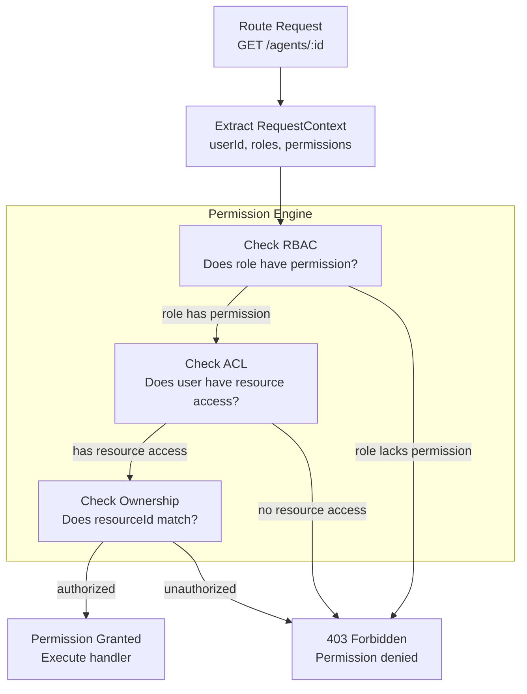

Sources: [packages/core/package.json:34-43](), [packages/server/package.json:64-73]()

### Usage Example

```typescript
import { checkPermission } from '@mastra/core/auth/ee'

// In a route handler
const hasPermission = await checkPermission({
  userId: requestContext.userId,
  action: 'agents:write',
  resourceId: 'agent-123',
  requestContext,
})

if (!hasPermission) {
  throw new ForbiddenError('Insufficient permissions')
}
```

---

## Route Permission Enforcement

### Custom Route Authentication

Custom API routes can control authentication and authorization via configuration:

**Route Auth Configuration**

```typescript
const server = {
  apiRoutes: [
    {
      path: '/public/status',
      method: 'GET',
      requiresAuth: false, // Public endpoint - no auth required
      handler: async (c) => {
        return c.json({ status: 'ok' })
      },
    },
    {
      path: '/private/data',
      method: 'GET',
      requiresAuth: true, // Protected endpoint - auth required (default)
      permissions: ['data:read'], // Enterprise: RBAC permissions
      handler: async (c) => {
        const mastra = c.get('mastra')
        const requestContext = c.get('requestContext')
        // Access authenticated user data
        return c.json({ data: 'secret' })
      },
    },
    {
      path: '/admin/config',
      method: 'POST',
      requiresAuth: true,
      permissions: ['admin:config:write'], // Enterprise: Admin-only
      handler: async (c) => {
        // Admin-only operation
        return c.json({ success: true })
      },
    },
  ],
}
```

Sources: [packages/deployer/src/server/index.ts:96-106]()

### Built-in Route Permissions

Mastra's built-in API routes have default permission requirements:

| Route Pattern                       | Default Permission  | Customizable     |
| ----------------------------------- | ------------------- | ---------------- |
| `GET /agents`                       | `agents:read`       | Yes (Enterprise) |
| `POST /agents/:id/stream`           | `agents:execute`    | Yes (Enterprise) |
| `GET /workflows`                    | `workflows:read`    | Yes (Enterprise) |
| `POST /workflows/:id/runs`          | `workflows:execute` | Yes (Enterprise) |
| `GET /memory/threads`               | `memory:read`       | Yes (Enterprise) |
| `POST /memory/threads/:id/messages` | `memory:write`      | Yes (Enterprise) |

### Permission Configuration Map

The server builds a `customRouteAuthConfig` map during initialization:

**Route Auth Config Building**

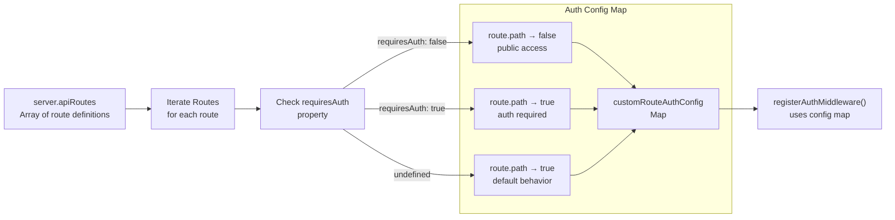

Sources: [packages/deployer/src/server/index.ts:96-106](), [packages/deployer/src/server/index.ts:218-239]()

### Permission Check Implementation

| Route Config                                     | Auth Middleware Behavior | Permission Engine (EE)                   |
| ------------------------------------------------ | ------------------------ | ---------------------------------------- |
| `requiresAuth: false`                            | Skip auth check          | Skip permission check                    |
| `requiresAuth: true`                             | Validate token/session   | Check RBAC permissions if configured     |
| `requiresAuth: true` + `permissions: ['action']` | Validate token/session   | Check user has specific permissions (EE) |

---

## Auth Provider Bundling

### Build-Time Bundling

When deploying a Mastra application with `mastra build`, the CLI automatically detects and bundles configured auth providers. This ensures all required auth dependencies are included in the build output.

**Auth Provider Bundling Flow**

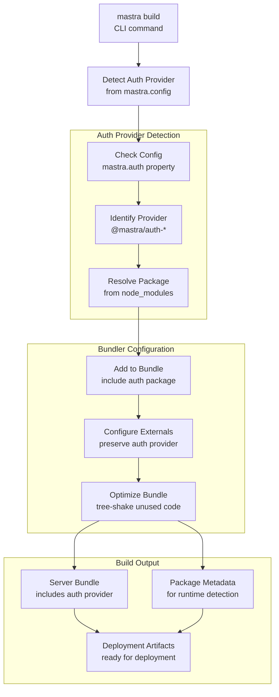

Sources: [packages/cli/CHANGELOG.md:7](), [packages/cli/CHANGELOG.md:47]()

### Package Metadata Generation

The build command writes package metadata so the Studio can detect installed Mastra packages at runtime. This enables CMS features like agent creation, cloning, and editing in the deployed application.

**Metadata Generation Process**

| Build Step                 | Purpose                          | Output                          |
| -------------------------- | -------------------------------- | ------------------------------- |
| **Detect Auth Provider**   | Identify configured auth package | Auth provider package name      |
| **Write Package Metadata** | Enable runtime package detection | `.mastra/package-metadata.json` |
| **Bundle Auth Provider**   | Include auth code in output      | Auth provider in `dist/`        |
| **Configure Platform**     | Platform-specific auth setup     | Platform deployment config      |

### Supported Auth Providers

All auth provider packages are automatically bundled when detected:

| Package                    | Provider      | Bundling Support |
| -------------------------- | ------------- | ---------------- |
| `@mastra/auth-auth0`       | Auth0         | ✅ Automatic     |
| `@mastra/auth-better-auth` | Better Auth   | ✅ Automatic     |
| `@mastra/auth-clerk`       | Clerk         | ✅ Automatic     |
| `@mastra/auth-cloud`       | Mastra Cloud  | ✅ Automatic     |
| `@mastra/auth-firebase`    | Firebase Auth | ✅ Automatic     |
| `@mastra/auth-studio`      | Studio Auth   | ✅ Automatic     |
| `@mastra/auth-supabase`    | Supabase Auth | ✅ Automatic     |
| `@mastra/auth-workos`      | WorkOS        | ✅ Automatic     |

Sources: [pnpm-lock.yaml:118-430](), [packages/cli/CHANGELOG.md:7]()

### Platform-Specific Bundling

Different deployment platforms handle auth providers differently:

**Cloudflare Workers:**

- Auth providers bundled as browser-compatible modules
- Uses worker-safe HTTP clients
- Secrets managed via Cloudflare secrets

**Vercel Functions:**

- Auth providers bundled as serverless function dependencies
- Uses Node.js-compatible modules
- Secrets via Vercel environment variables

**Netlify Functions:**

- Auth providers bundled with Netlify Functions
- Standard Node.js environment
- Secrets via Netlify environment variables

**Generic Node.js:**

- Full Node.js auth provider support
- Standard npm/pnpm dependency resolution
- Environment variable-based secrets

Sources: [deployers/cloudflare/package.json:1-90](), [deployers/vercel/package.json:1-67](), [deployers/netlify/package.json:1-67]()

---

## Security Best Practices

### Resource ID Validation

**Always validate that:**

1. The authenticated user's ID matches the `resourceId` being accessed
2. API tokens have permissions for the requested operations
3. `resourceId` is present in requests that access user-specific data

**Example validation logic:**

```typescript
// Pseudocode for server-side validation
const userId = extractUserIdFromToken(request.headers.authorization)
const resourceId = request.body.resourceId

if (userId !== resourceId && !hasAdminPermission(userId)) {
  throw new UnauthorizedError('Cannot access resources of other users')
}
```

### Thread Ownership Best Practices

1. **Always provide `resourceId` when creating threads:**

   ```typescript
   await client.memory.createThread({
     agentId: 'agent-id',
     resourceId: 'user-123', // Required
     requestContext: { userId: 'user-123' },
   })
   ```

2. **Filter threads by `resourceId` when listing:**

   ```typescript
   await client.memory.listThreads({
     resourceId: 'user-123', // Recommended
     requestContext: { userId: 'user-123' },
   })
   ```

3. **Validate thread ownership on access:**
   - Server should verify that the authenticated user owns the thread
   - Use storage-level filtering to prevent unauthorized access

Sources: [client-sdks/client-js/src/types.ts:296-329]()

### Metadata Security

**Do NOT store sensitive information in `metadata`:**

- Metadata is used for filtering, not authorization
- It may be logged or exposed in traces
- Sensitive data should be stored in encrypted fields in the storage layer

**Safe metadata examples:**

- `projectId`, `environment`, `region`
- Non-sensitive classification tags
- Feature flags

**Unsafe metadata examples:**

- Passwords, tokens, API keys
- Personal identifiable information (PII)
- Authorization roles (use `requestContext` instead)

---

## Summary

Mastra's authentication and authorization model provides:

1. **Client Authentication**: HTTP headers and credentials configuration via `ClientOptions`
2. **RequestContext Propagation**: Context flows from client → server → agents/workflows/tools → storage
3. **Resource Isolation**: `resourceId` ensures data segregation at the storage level
4. **Multi-Tenancy**: Metadata filtering enables fine-grained, hierarchical access control
5. **Storage Enforcement**: Authorization checks happen at the storage layer, preventing unauthorized access
6. **Provider Integration**: Dedicated packages for popular authentication providers (Auth0, Clerk, Firebase, etc.)

For information about using `RequestContext` for conditional configuration, see [RequestContext and Dynamic Configuration](#2.2).

For details about storage architecture and the storage domain pattern, see [Storage Domain Architecture](#7.3).

Sources: [client-sdks/client-js/src/types.ts:24](), [client-sdks/client-js/src/types.ts:50-69](), [client-sdks/client-js/src/types.ts:133-166](), [client-sdks/client-js/src/types.ts:296-329](), [packages/server/package.json:64-73](), [packages/server/src/server/handlers/memory.ts:1-300](), [pnpm-lock.yaml:114-343](), Architecture diagrams
