# Server and API Layer

<details>
<summary>Relevant source files</summary>

The following files were used as context for generating this wiki page:

- [client-sdks/client-js/src/client.ts](client-sdks/client-js/src/client.ts)
- [client-sdks/client-js/src/resources/agent.test.ts](client-sdks/client-js/src/resources/agent.test.ts)
- [client-sdks/client-js/src/resources/agent.ts](client-sdks/client-js/src/resources/agent.ts)
- [client-sdks/client-js/src/resources/agent.vnext.test.ts](client-sdks/client-js/src/resources/agent.vnext.test.ts)
- [client-sdks/client-js/src/resources/index.ts](client-sdks/client-js/src/resources/index.ts)
- [client-sdks/client-js/src/types.ts](client-sdks/client-js/src/types.ts)
- [deployers/cloudflare/src/index.ts](deployers/cloudflare/src/index.ts)
- [deployers/netlify/src/index.ts](deployers/netlify/src/index.ts)
- [deployers/vercel/src/index.ts](deployers/vercel/src/index.ts)
- [docs/src/content/en/docs/deployment/studio.mdx](docs/src/content/en/docs/deployment/studio.mdx)
- [e2e-tests/create-mastra/create-mastra.test.ts](e2e-tests/create-mastra/create-mastra.test.ts)
- [e2e-tests/monorepo/monorepo.test.ts](e2e-tests/monorepo/monorepo.test.ts)
- [e2e-tests/monorepo/template/apps/custom/src/mastra/index.ts](e2e-tests/monorepo/template/apps/custom/src/mastra/index.ts)
- [packages/cli/src/commands/build/BuildBundler.ts](packages/cli/src/commands/build/BuildBundler.ts)
- [packages/cli/src/commands/build/build.ts](packages/cli/src/commands/build/build.ts)
- [packages/cli/src/commands/dev/DevBundler.ts](packages/cli/src/commands/dev/DevBundler.ts)
- [packages/cli/src/commands/dev/dev.ts](packages/cli/src/commands/dev/dev.ts)
- [packages/cli/src/commands/studio/studio.test.ts](packages/cli/src/commands/studio/studio.test.ts)
- [packages/cli/src/commands/studio/studio.ts](packages/cli/src/commands/studio/studio.ts)
- [packages/core/src/agent/**tests**/dynamic-model-fallback.test.ts](packages/core/src/agent/__tests__/dynamic-model-fallback.test.ts)
- [packages/core/src/bundler/index.ts](packages/core/src/bundler/index.ts)
- [packages/core/src/memory/mock.ts](packages/core/src/memory/mock.ts)
- [packages/core/src/storage/mock.test.ts](packages/core/src/storage/mock.test.ts)
- [packages/core/src/stream/aisdk/v5/transform.test.ts](packages/core/src/stream/aisdk/v5/transform.test.ts)
- [packages/core/src/stream/aisdk/v5/transform.ts](packages/core/src/stream/aisdk/v5/transform.ts)
- [packages/deployer/src/build/analyze.ts](packages/deployer/src/build/analyze.ts)
- [packages/deployer/src/build/analyze/**snapshots**/analyzeEntry.test.ts.snap](packages/deployer/src/build/analyze/__snapshots__/analyzeEntry.test.ts.snap)
- [packages/deployer/src/build/analyze/analyzeEntry.test.ts](packages/deployer/src/build/analyze/analyzeEntry.test.ts)
- [packages/deployer/src/build/analyze/analyzeEntry.ts](packages/deployer/src/build/analyze/analyzeEntry.ts)
- [packages/deployer/src/build/analyze/bundleExternals.test.ts](packages/deployer/src/build/analyze/bundleExternals.test.ts)
- [packages/deployer/src/build/analyze/bundleExternals.ts](packages/deployer/src/build/analyze/bundleExternals.ts)
- [packages/deployer/src/build/bundler.ts](packages/deployer/src/build/bundler.ts)
- [packages/deployer/src/build/utils.test.ts](packages/deployer/src/build/utils.test.ts)
- [packages/deployer/src/build/utils.ts](packages/deployer/src/build/utils.ts)
- [packages/deployer/src/build/watcher.test.ts](packages/deployer/src/build/watcher.test.ts)
- [packages/deployer/src/build/watcher.ts](packages/deployer/src/build/watcher.ts)
- [packages/deployer/src/bundler/index.ts](packages/deployer/src/bundler/index.ts)
- [packages/deployer/src/server/**tests**/option-studio-base.test.ts](packages/deployer/src/server/__tests__/option-studio-base.test.ts)
- [packages/deployer/src/server/index.ts](packages/deployer/src/server/index.ts)
- [packages/playground/e2e/tests/auth/infrastructure.spec.ts](packages/playground/e2e/tests/auth/infrastructure.spec.ts)
- [packages/playground/e2e/tests/auth/viewer-role.spec.ts](packages/playground/e2e/tests/auth/viewer-role.spec.ts)
- [packages/playground/index.html](packages/playground/index.html)
- [packages/playground/src/App.tsx](packages/playground/src/App.tsx)
- [packages/playground/src/components/ui/app-sidebar.tsx](packages/playground/src/components/ui/app-sidebar.tsx)
- [packages/server/src/server/handlers.ts](packages/server/src/server/handlers.ts)
- [packages/server/src/server/handlers/agent.test.ts](packages/server/src/server/handlers/agent.test.ts)
- [packages/server/src/server/handlers/agents.ts](packages/server/src/server/handlers/agents.ts)
- [packages/server/src/server/handlers/memory.test.ts](packages/server/src/server/handlers/memory.test.ts)
- [packages/server/src/server/handlers/memory.ts](packages/server/src/server/handlers/memory.ts)
- [packages/server/src/server/handlers/utils.test.ts](packages/server/src/server/handlers/utils.test.ts)
- [packages/server/src/server/handlers/utils.ts](packages/server/src/server/handlers/utils.ts)
- [packages/server/src/server/handlers/vector.test.ts](packages/server/src/server/handlers/vector.test.ts)
- [packages/server/src/server/schemas/memory.test.ts](packages/server/src/server/schemas/memory.test.ts)
- [packages/server/src/server/schemas/memory.ts](packages/server/src/server/schemas/memory.ts)

</details>

## Purpose and Scope

This document describes the HTTP server architecture and API layer that exposes Mastra's agent, workflow, tool, and memory capabilities over HTTP. It covers server initialization, middleware registration, route organization, streaming mechanisms, and API design patterns. For information about client-side SDK usage, see [JavaScript Client SDK](#10.1). For deployment and bundling, see [Platform Deployers](#8.5).

**Sources:** [packages/deployer/src/server/index.ts:1-509]()

## Server Architecture and Initialization

### Hono Framework Foundation

Mastra's server layer uses the [Hono](https://hono.dev) framework, a lightweight web framework optimized for edge runtimes. The server is initialized through two primary functions: `createHonoServer` for creating the Hono application instance, and `createNodeServer` for starting a Node.js HTTP server.

**Title:** Server Initialization Flow

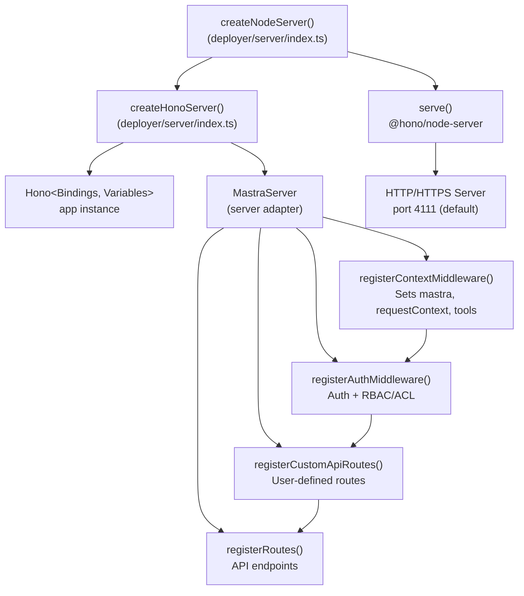

**Sources:** [packages/deployer/src/server/index.ts:72-453]()

### Middleware Registration Order

Middleware registration follows a strict order to ensure proper request processing. The order is critical because each layer depends on context established by previous layers.

**Title:** Middleware Stack Registration Order

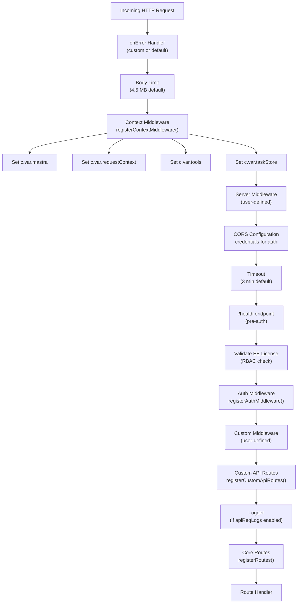

**Sources:** [packages/deployer/src/server/index.ts:122-260]()

### Server Configuration Options

The server is configured through the Mastra `server` configuration object, which controls CORS, timeouts, body limits, HTTPS, and build options.

| Configuration Key   | Type              | Default       | Description                                  |
| ------------------- | ----------------- | ------------- | -------------------------------------------- |
| `port`              | `number`          | `4111`        | HTTP server port                             |
| `host`              | `string`          | `'localhost'` | Bind hostname                                |
| `timeout`           | `number`          | `180000`      | Request timeout in milliseconds (3 minutes)  |
| `bodySizeLimit`     | `number`          | `4718592`     | Maximum request body size in bytes (4.5 MB)  |
| `cors`              | `object \| false` | CORS enabled  | CORS configuration or disabled               |
| `https`             | `{key, cert}`     | `undefined`   | HTTPS configuration with key and certificate |
| `apiPrefix`         | `string`          | `'/api'`      | Prefix for all API routes                    |
| `studioBase`        | `string`          | `'/'`         | Base path for Studio UI                      |
| `middleware`        | `array`           | `[]`          | Custom middleware array                      |
| `auth`              | `object`          | `undefined`   | Authentication provider configuration        |
| `build.swaggerUI`   | `boolean`         | `false`       | Enable Swagger UI at `/swagger-ui`           |
| `build.openAPIDocs` | `boolean`         | `false`       | Expose OpenAPI spec at `/api/openapi.json`   |
| `build.apiReqLogs`  | `boolean`         | `false`       | Enable request logging                       |

**Sources:** [packages/deployer/src/server/index.ts:132-193]()

## Route Organization and Structure

### Route Definition Pattern

Routes in Mastra follow a standardized pattern using the `createRoute` helper, which provides type-safe route definitions with automatic schema validation and OpenAPI documentation generation.

**Title:** Route Definition Components

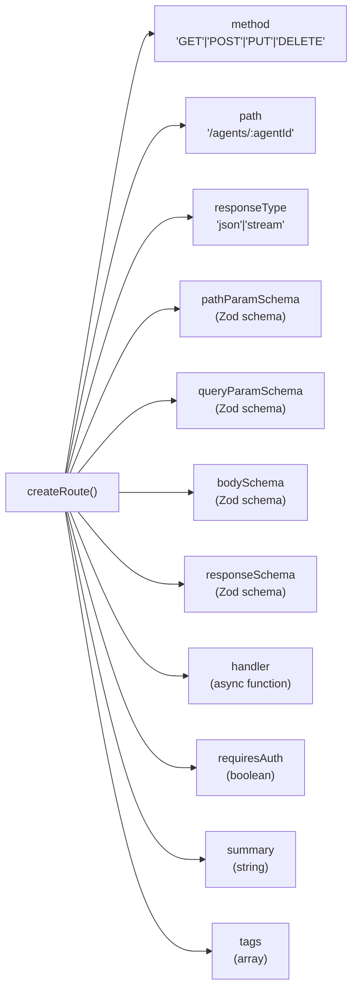

**Sources:** [packages/server/src/server/handlers/agents.ts:47-59](), [packages/server/src/server/handlers/workflows.ts:90-114]()

### Core API Route Categories

Routes are organized by domain into separate handler modules. Each module exports route constants that are registered with the server.

**Title:** API Route Categories and Modules

```mermaid
graph TB
    ServerAdapter["MastraServer<br/>registerRoutes()"]

    ServerAdapter --> AgentRoutes["Agent Routes<br/>handlers/agents.ts"]
    ServerAdapter --> WorkflowRoutes["Workflow Routes<br/>handlers/workflows.ts"]
    ServerAdapter --> ToolRoutes["Tool Routes<br/>handlers/tools.ts"]
    ServerAdapter --> MemoryRoutes["Memory Routes<br/>handlers/memory.ts"]
    ServerAdapter --> VectorRoutes["Vector Routes<br/>handlers/vector.ts"]
    ServerAdapter --> MCPRoutes["MCP Routes<br/>handlers/mcp.ts"]
    ServerAdapter --> ObsRoutes["Observability Routes<br/>handlers/observability.ts"]
    ServerAdapter --> ScoreRoutes["Score Routes<br/>handlers/scores.ts"]
    ServerAdapter --> A2ARoutes["A2A Routes<br/>handlers/a2a.ts"]
    ServerAdapter --> VoiceRoutes["Voice Routes<br/>handlers/voice.ts"]
    ServerAdapter --> BuilderRoutes["Agent Builder Routes<br/>handlers/agent-builder.ts"]
    ServerAdapter --> WorkspaceRoutes["Workspace Routes<br/>handlers/workspace.ts"]
    ServerAdapter --> LogRoutes["Log Routes<br/>handlers/logs.ts"]

    AgentRoutes --> ListAgents["GET /agents"]
    AgentRoutes --> GetAgent["GET /agents/:agentId"]
    AgentRoutes --> GenerateAgent["POST /agents/:agentId/generate"]
    AgentRoutes --> StreamAgent["POST /agents/:agentId/stream"]

    WorkflowRoutes --> ListWorkflows["GET /workflows"]
    WorkflowRoutes --> GetWorkflow["GET /workflows/:workflowId"]
    WorkflowRoutes --> CreateRun["POST /workflows/:workflowId/create-run"]
    WorkflowRoutes --> StreamWorkflow["POST /workflows/:workflowId/stream"]
```

**Sources:** [packages/server/src/server/handlers.ts:1-14]()

## Agent API Endpoints

### Agent Endpoint Mapping

The agent API provides endpoints for listing agents, retrieving agent details, executing agent generations, and streaming responses.

| Endpoint                                 | Method | Path                                         | Purpose                                             |
| ---------------------------------------- | ------ | -------------------------------------------- | --------------------------------------------------- |
| `LIST_AGENTS_ROUTE`                      | GET    | `/agents`                                    | List all available agents with their configurations |
| `GET_AGENT_BY_ID_ROUTE`                  | GET    | `/agents/:agentId`                           | Get detailed information about a specific agent     |
| `GENERATE_AGENT_ROUTE`                   | POST   | `/agents/:agentId/generate`                  | Execute agent with blocking response                |
| `STREAM_GENERATE_ROUTE`                  | POST   | `/agents/:agentId/stream`                    | Execute agent with streaming response (vNext)       |
| `STREAM_GENERATE_LEGACY_ROUTE`           | POST   | `/agents/:agentId/stream-legacy`             | Execute agent with streaming response (legacy)      |
| `UPDATE_AGENT_MODEL_ROUTE`               | PATCH  | `/agents/:agentId/model`                     | Update agent's model configuration                  |
| `REORDER_AGENT_MODEL_LIST_ROUTE`         | PATCH  | `/agents/:agentId/model-list/reorder`        | Reorder model fallback list                         |
| `UPDATE_AGENT_MODEL_IN_MODEL_LIST_ROUTE` | PATCH  | `/agents/:agentId/model-list/:modelConfigId` | Update specific model config in list                |
| `ENHANCE_INSTRUCTIONS_ROUTE`             | POST   | `/agents/:agentId/instructions/enhance`      | Enhance agent instructions using LLM                |
| `CLONE_AGENT_ROUTE`                      | POST   | `/agents/:agentId/clone`                     | Clone agent to stored agent                         |

**Sources:** [packages/server/src/server/handlers/agents.ts:1-50]()

### Agent Serialization

When listing or retrieving agents, the server serializes agent configurations into a portable format. The serialization process extracts tools, workflows, skills, processors, and model configurations.

**Title:** Agent Serialization Process

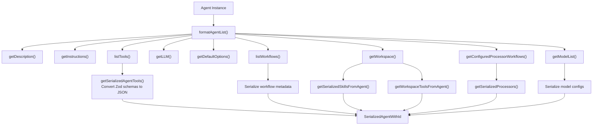

**Sources:** [packages/server/src/server/handlers/agents.ts:429-560]()

### Request Context Handling

Agent endpoints support `requestContext` query parameters for dynamic configuration. The context is used for multi-tenant scenarios, A/B testing, and per-request model selection.

**Sources:** [packages/server/src/server/handlers/agents.ts:1-50](), [client-sdks/client-js/src/types.ts:51-70]()

## Workflow API Endpoints

### Workflow Endpoint Mapping

Workflow endpoints manage workflow execution lifecycle including run creation, starting, streaming, resuming, and observing.

| Endpoint                          | Method | Path                                   | Purpose                                      |
| --------------------------------- | ------ | -------------------------------------- | -------------------------------------------- |
| `LIST_WORKFLOWS_ROUTE`            | GET    | `/workflows`                           | List all available workflows                 |
| `GET_WORKFLOW_BY_ID_ROUTE`        | GET    | `/workflows/:workflowId`               | Get workflow details and step graph          |
| `LIST_WORKFLOW_RUNS_ROUTE`        | GET    | `/workflows/:workflowId/runs`          | List workflow execution runs with pagination |
| `GET_WORKFLOW_RUN_BY_ID_ROUTE`    | GET    | `/workflows/:workflowId/runs/:runId`   | Get workflow run state and results           |
| `DELETE_WORKFLOW_RUN_BY_ID_ROUTE` | DELETE | `/workflows/:workflowId/runs/:runId`   | Delete a workflow run                        |
| `CREATE_WORKFLOW_RUN_ROUTE`       | POST   | `/workflows/:workflowId/create-run`    | Create a new workflow run instance           |
| `START_ASYNC_WORKFLOW_ROUTE`      | POST   | `/workflows/:workflowId/start-async`   | Start workflow without streaming             |
| `STREAM_WORKFLOW_ROUTE`           | POST   | `/workflows/:workflowId/stream`        | Stream workflow execution events             |
| `START_WORKFLOW_RUN_ROUTE`        | POST   | `/workflows/:workflowId/start`         | Start a created run instance                 |
| `RESUME_ASYNC_WORKFLOW_ROUTE`     | POST   | `/workflows/:workflowId/resume-async`  | Resume suspended workflow without streaming  |
| `RESUME_WORKFLOW_ROUTE`           | POST   | `/workflows/:workflowId/resume`        | Resume suspended workflow                    |
| `RESUME_STREAM_WORKFLOW_ROUTE`    | POST   | `/workflows/:workflowId/resume-stream` | Resume with streaming                        |
| `OBSERVE_STREAM_WORKFLOW_ROUTE`   | POST   | `/workflows/:workflowId/observe`       | Observe existing run with streaming          |
| `CANCEL_WORKFLOW_RUN_ROUTE`       | POST   | `/workflows/:workflowId/cancel`        | Cancel running workflow                      |

**Sources:** [packages/server/src/server/handlers/workflows.ts:90-600]()

### Workflow Run Lifecycle

Workflow execution follows a multi-phase lifecycle with support for long-running operations, suspension, and resumption.

**Title:** Workflow Run Lifecycle

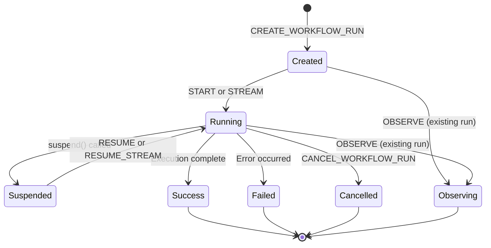

**Sources:** [packages/server/src/server/handlers/workflows.ts:310-600]()

### Workflow State Field Selection

The `GET_WORKFLOW_RUN_BY_ID_ROUTE` endpoint supports field selection to reduce payload size. Clients can request only specific fields using the `fields` query parameter.

Available fields: `result`, `error`, `payload`, `steps`, `activeStepsPath`, `serializedStepGraph`. Metadata fields (`runId`, `workflowName`, `resourceId`, `createdAt`, `updatedAt`) and `status` are always included.

**Sources:** [packages/server/src/server/handlers/workflows.ts:215-264]()

## Streaming Architecture

### Server-Sent Events (SSE) Format

Mastra uses Server-Sent Events (SSE) for real-time streaming of agent and workflow execution. Each event is formatted as `data: <JSON>\
\
` with a final `data: [DONE]\
\
` marker.

**Title:** SSE Stream Processing Flow

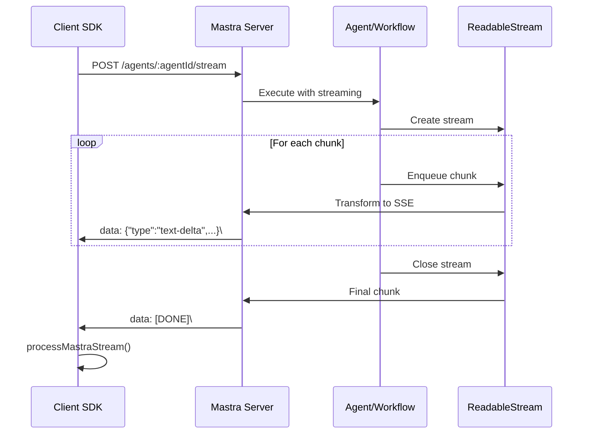

**Sources:** [packages/deployer/src/server/index.ts:346-394](), [client-sdks/client-js/src/utils/process-mastra-stream.ts:1-77]()

### Chunk Types and Structure

Streaming responses emit typed chunks representing different stages of execution. The `ChunkType` discriminated union includes:

| Chunk Type        | Purpose                      | Key Payload Fields               |
| ----------------- | ---------------------------- | -------------------------------- |
| `text-delta`      | Text generation progress     | `text`, `id`                     |
| `text-start`      | Text generation start        | `id`                             |
| `tool-call`       | Tool invocation              | `toolCallId`, `toolName`, `args` |
| `tool-result`     | Tool execution result        | `toolCallId`, `result`           |
| `step-start`      | Workflow step start          | `messageId`                      |
| `step-finish`     | Workflow step complete       | `stepResult`, `isContinued`      |
| `finish`          | Execution complete           | `stepResult.reason`, `usage`     |
| `reasoning-delta` | Reasoning content (e.g., o1) | `text`                           |
| `file`            | File attachment              | `data`, `mimeType`               |
| `source`          | Source citation              | `source`                         |
| `message`         | Generic message              | `text`                           |
| `data`            | Custom data                  | `data` array                     |

**Sources:** [packages/core/src/stream/index.ts:1-60](), [client-sdks/client-js/src/resources/agent.ts:376-719]()

### Server-Side Stream Transformation

The server transforms workflow and agent streams into SSE format using `TransformStream`. For workflows, the server also caches stream chunks for observation replay.

**Title:** Server-Side Stream Pipeline

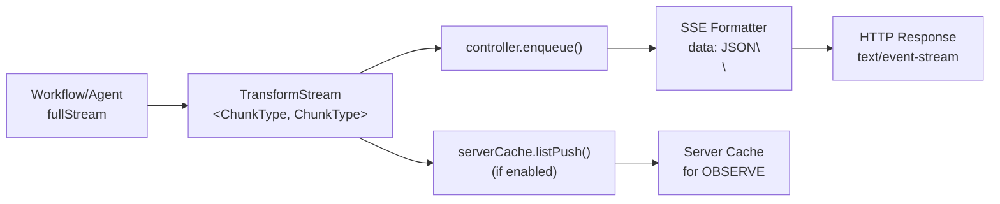

**Sources:** [packages/server/src/server/handlers/workflows.ts:346-394]()

### Client-Side Stream Consumption

Clients consume SSE streams using the `processMastraStream` utility, which parses SSE messages and invokes callbacks for each chunk.

**Sources:** [client-sdks/client-js/src/utils/process-mastra-stream.ts:4-76]()

## Memory and Storage API Endpoints

### Memory Thread Management

Memory endpoints provide CRUD operations for conversation threads and messages, supporting both agent-scoped and storage-direct access.

| Endpoint                   | Method | Path                                         | Purpose                                            |
| -------------------------- | ------ | -------------------------------------------- | -------------------------------------------------- |
| `LIST_MEMORY_THREADS`      | GET    | `/memory/threads`                            | List threads with filtering by resourceId/metadata |
| `CREATE_MEMORY_THREAD`     | POST   | `/memory/threads`                            | Create new conversation thread                     |
| `GET_MEMORY_THREAD`        | GET    | `/memory/threads/:threadId`                  | Get thread details                                 |
| `UPDATE_MEMORY_THREAD`     | PATCH  | `/memory/threads/:threadId`                  | Update thread title/metadata                       |
| `DELETE_MEMORY_THREAD`     | DELETE | `/memory/threads/:threadId`                  | Delete thread                                      |
| `CLONE_MEMORY_THREAD`      | POST   | `/memory/threads/:threadId/clone`            | Clone thread with messages                         |
| `LIST_THREAD_MESSAGES`     | GET    | `/memory/threads/:threadId/messages`         | List messages in thread                            |
| `SAVE_MESSAGES`            | POST   | `/memory/save-messages`                      | Save messages to memory                            |
| `GET_MEMORY_CONFIG`        | GET    | `/memory/config`                             | Get agent memory configuration                     |
| `GET_MEMORY_STATUS`        | GET    | `/memory/status`                             | Get memory system status                           |
| `GET_OBSERVATIONAL_MEMORY` | GET    | `/memory/observational-memory`               | Get OM records                                     |
| `AWAIT_BUFFER_STATUS`      | POST   | `/memory/observational-memory/buffer-status` | Block until OM buffer completes                    |
| `MEMORY_SEARCH`            | POST   | `/memory/search`                             | Search messages by query                           |

**Sources:** [client-sdks/client-js/src/client.ts:160-338]()

## Authentication and Authorization

### Auth Provider System

Mastra supports pluggable authentication providers through the `server.auth` configuration. The system distinguishes between authentication (verifying identity) and authorization (enforcing permissions).

**Title:** Auth Provider Architecture

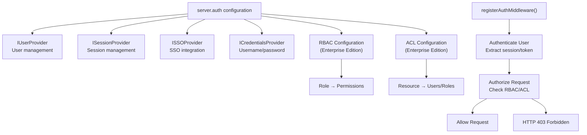

**Sources:** [packages/deployer/src/server/index.ts:226-231]()

### Route-Level Authentication

Routes can specify authentication requirements using the `requiresAuth` field in route definitions. By default, routes require authentication unless explicitly set to `false`.

**Sources:** [packages/deployer/src/server/index.ts:111-120]()

### CORS Configuration for Authentication

When authentication is enabled, CORS configuration automatically enables credentials mode and adjusts the origin policy. The `credentials: true` option is required for cookie-based authentication (e.g., Better Auth sessions).

**Sources:** [packages/deployer/src/server/index.ts:162-193]()

## Error Handling

### HTTPException Pattern

Handlers use `HTTPException` for standardized error responses. The exception includes a status code and message, which are automatically converted to HTTP responses.

```typescript
// Example from workflow handler
if (!workflowId) {
  throw new HTTPException(400, { message: 'Workflow ID is required' })
}

if (!workflow) {
  throw new HTTPException(404, { message: 'Workflow not found' })
}
```

**Sources:** [packages/server/src/server/handlers/workflows.ts:130-137]()

### Custom Error Handlers

The server supports custom error handlers via `server.onError`. If not provided, a default error handler formats errors for development vs. production environments.

**Title:** Error Handling Flow

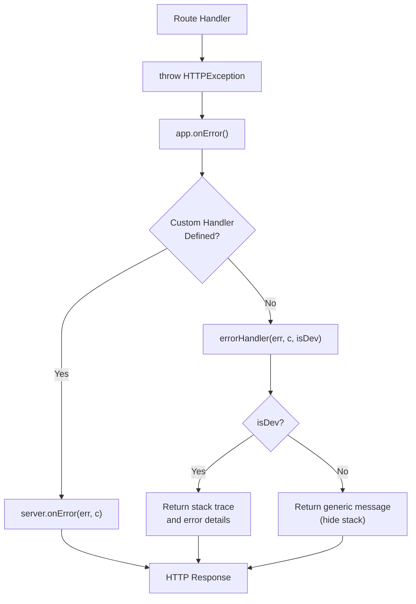

**Sources:** [packages/deployer/src/server/index.ts:122-129]()

### Validation Errors

Route handlers automatically validate path parameters, query parameters, and request bodies against Zod schemas. Validation failures return 400 Bad Request with detailed error messages.

**Sources:** [packages/server/src/server/handlers/workflows.ts:90-114]()

## Request Context and Multi-Tenancy

### Request Context Flow

The `RequestContext` object flows through the entire request lifecycle, enabling per-request configuration of agents, models, tools, and memory.

**Title:** RequestContext Propagation

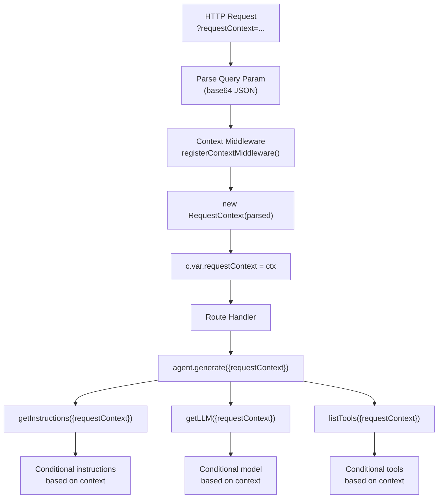

**Sources:** [client-sdks/client-js/src/types.ts:51-70](), [packages/server/src/server/handlers/agents.ts:625-706]()

### Effective Resource ID Resolution

For multi-tenant deployments, the server resolves `resourceId` from request context with precedence: context key > client-provided value. This prevents tenants from accessing other tenants' data.

**Sources:** [packages/server/src/server/handlers/utils.ts:1-100]()

## Studio UI Integration

### Studio Serving

The server serves the Mastra Studio UI when `options.studio` is true. The Studio is a built Vite SPA with dynamic configuration injection.

**Title:** Studio Serving Architecture

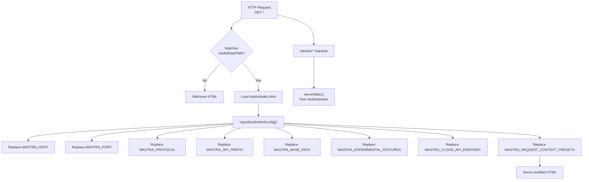

**Sources:** [packages/deployer/src/server/index.ts:296-431]()

### Hot Reload for Development

In development mode (`options.isDev`), the server provides SSE-based hot reload for the Studio UI.

| Endpoint                   | Purpose                                   |
| -------------------------- | ----------------------------------------- |
| `GET /refresh-events`      | SSE stream for refresh notifications      |
| `POST /__refresh`          | Trigger refresh for all connected clients |
| `GET /__hot-reload-status` | Check if hot reload is enabled            |

**Sources:** [packages/deployer/src/server/index.ts:297-327]()

## OpenAPI Documentation

### Swagger UI and OpenAPI Spec

When `server.build.swaggerUI` is enabled, the server exposes Swagger UI at `/swagger-ui`. The OpenAPI specification is served at `/api/openapi.json` when `server.build.openAPIDocs` is enabled.

Route definitions using `createRoute` automatically contribute to the OpenAPI spec through the `describeRoute` middleware.

**Sources:** [packages/deployer/src/server/index.ts:96-108](), [packages/deployer/src/server/index.ts:262-281]()

## Tool Bundling and Registration

### Dynamic Tool Registration

Tools discovered by the CLI bundler are passed to `createHonoServer` via `options.tools` and registered with the Mastra instance before route registration.

**Title:** Tool Bundling and Registration

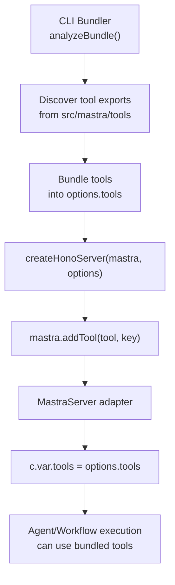

**Sources:** [packages/deployer/src/server/index.ts:78-88]()
