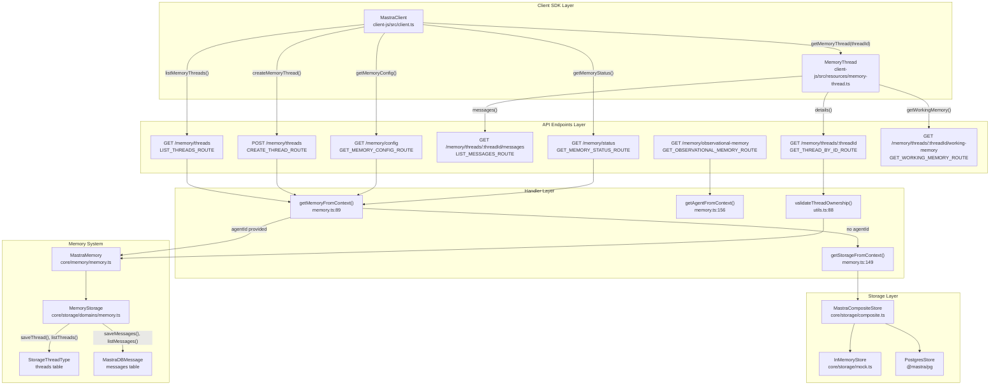
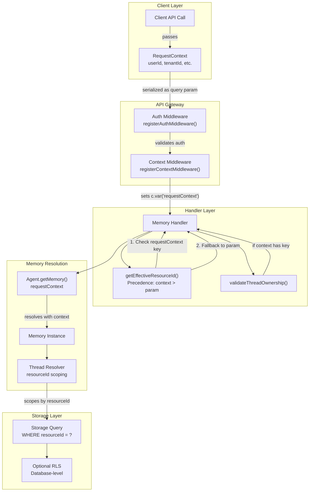

# Memory and Storage API Endpoints

<details>
<summary>Relevant source files</summary>

The following files were used as context for generating this wiki page:

- [client-sdks/client-js/src/client.ts](client-sdks/client-js/src/client.ts)
- [client-sdks/client-js/src/resources/agent.test.ts](client-sdks/client-js/src/resources/agent.test.ts)
- [client-sdks/client-js/src/resources/agent.ts](client-sdks/client-js/src/resources/agent.ts)
- [client-sdks/client-js/src/resources/agent.vnext.test.ts](client-sdks/client-js/src/resources/agent.vnext.test.ts)
- [client-sdks/client-js/src/resources/index.ts](client-sdks/client-js/src/resources/index.ts)
- [client-sdks/client-js/src/types.ts](client-sdks/client-js/src/types.ts)
- [e2e-tests/create-mastra/create-mastra.test.ts](e2e-tests/create-mastra/create-mastra.test.ts)
- [packages/core/src/agent/**tests**/dynamic-model-fallback.test.ts](packages/core/src/agent/__tests__/dynamic-model-fallback.test.ts)
- [packages/core/src/memory/mock.ts](packages/core/src/memory/mock.ts)
- [packages/core/src/storage/mock.test.ts](packages/core/src/storage/mock.test.ts)
- [packages/core/src/stream/aisdk/v5/transform.test.ts](packages/core/src/stream/aisdk/v5/transform.test.ts)
- [packages/core/src/stream/aisdk/v5/transform.ts](packages/core/src/stream/aisdk/v5/transform.ts)
- [packages/server/src/server/handlers.ts](packages/server/src/server/handlers.ts)
- [packages/server/src/server/handlers/agent.test.ts](packages/server/src/server/handlers/agent.test.ts)
- [packages/server/src/server/handlers/agents.ts](packages/server/src/server/handlers/agents.ts)
- [packages/server/src/server/handlers/memory.test.ts](packages/server/src/server/handlers/memory.test.ts)
- [packages/server/src/server/handlers/memory.ts](packages/server/src/server/handlers/memory.ts)
- [packages/server/src/server/handlers/utils.test.ts](packages/server/src/server/handlers/utils.test.ts)
- [packages/server/src/server/handlers/utils.ts](packages/server/src/server/handlers/utils.ts)
- [packages/server/src/server/handlers/vector.test.ts](packages/server/src/server/handlers/vector.test.ts)
- [packages/server/src/server/schemas/memory.test.ts](packages/server/src/server/schemas/memory.test.ts)
- [packages/server/src/server/schemas/memory.ts](packages/server/src/server/schemas/memory.ts)

</details>

This document describes the REST API endpoints for memory and storage operations exposed by the Mastra server. These endpoints provide access to thread management, message storage, memory configuration, and observational memory features.

**Scope**: This page covers the HTTP API layer for memory and storage operations. For the underlying memory system architecture, see [Memory System Architecture](#7.1). For storage domain implementation details, see [Storage Domain Architecture](#7.3). For server setup and middleware configuration, see [Server Architecture and Setup](#9.1).

## Overview

The memory and storage API endpoints are organized into several functional groups:

| Endpoint Group       | Base Path                                   | Purpose                                           | Handler Route                                                                             |
| -------------------- | ------------------------------------------- | ------------------------------------------------- | ----------------------------------------------------------------------------------------- |
| Thread Management    | `/memory/threads`                           | Create, list, update, delete conversation threads | `LIST_THREADS_ROUTE`, `CREATE_THREAD_ROUTE`, `UPDATE_THREAD_ROUTE`, `DELETE_THREAD_ROUTE` |
| Message Operations   | `/memory/threads/{threadId}/messages`       | Store and retrieve messages within threads        | `LIST_MESSAGES_ROUTE`, `SAVE_MESSAGES_ROUTE`, `DELETE_MESSAGES_ROUTE`                     |
| Memory Configuration | `/memory/config`                            | Query memory system settings                      | `GET_MEMORY_CONFIG_ROUTE`                                                                 |
| Memory Status        | `/memory/status`                            | Monitor memory system state                       | `GET_MEMORY_STATUS_ROUTE`                                                                 |
| Observational Memory | `/memory/observational-memory`              | Access compressed long-term observations          | `GET_OBSERVATIONAL_MEMORY_ROUTE`, `AWAIT_BUFFER_STATUS_ROUTE`                             |
| Working Memory       | `/memory/threads/{threadId}/working-memory` | Manage structured persistent data                 | `GET_WORKING_MEMORY_ROUTE`, `UPDATE_WORKING_MEMORY_ROUTE`                                 |

**Authentication**: All memory endpoints require authentication by default. The `requiresAuth: true` flag is set on route definitions. See [Authentication and Authorization](#9.6) for details on auth middleware configuration.

**Sources**: [packages/server/src/server/handlers/memory.ts:307-1200](), [client-sdks/client-js/src/client.ts:201-378](), [client-sdks/client-js/src/resources/memory-thread.ts:1-161]()

## Memory API Architecture

The following diagram shows how memory API endpoints map to storage layers and client SDK resources:



**Sources**: [packages/server/src/server/handlers/memory.ts:89-206](), [packages/server/src/server/handlers/utils.ts:62-108](), [client-sdks/client-js/src/client.ts:201-378](), [client-sdks/client-js/src/resources/memory-thread.ts:1-161]()

## Thread Management Endpoints

Thread management endpoints handle conversation thread lifecycle operations. Threads are scoped containers that organize messages and memory state.

### List Threads

**Endpoint**: `GET /memory/threads`

**Handler**: `LIST_THREADS_ROUTE` defined in [packages/server/src/server/handlers/memory.ts:657-765]()

Lists memory threads with optional filtering by `resourceId`, `metadata`, and `agentId`.

**Query Parameters**:

| Parameter        | Type            | Required | Description                                                         | Schema                   |
| ---------------- | --------------- | -------- | ------------------------------------------------------------------- | ------------------------ |
| `resourceId`     | string          | No       | Filter by resource identifier                                       | `listThreadsQuerySchema` |
| `metadata`       | string (JSON)   | No       | Filter by metadata key-value pairs (AND logic)                      | Parsed from JSON string  |
| `agentId`        | string          | No       | Agent identifier for memory resolution                              |                          |
| `page`           | number          | No       | Page number (0-indexed), default: 0                                 |                          |
| `perPage`        | number          | No       | Items per page, default: 100                                        |                          |
| `orderBy`        | object (JSON)   | No       | `{ field: 'createdAt' \| 'updatedAt', direction: 'ASC' \| 'DESC' }` | `storageOrderBySchema`   |
| `requestContext` | string (base64) | No       | Base64-encoded request context                                      |                          |

**Response**: `ListMemoryThreadsResponse` from [client-sdks/client-js/src/types.ts:336-340]()

```typescript
{
  threads: StorageThreadType[];
  total: number;
  page: number;
  perPage: number | false;
  hasMore: boolean;
}
```

**StorageThreadType Structure** from [packages/core/src/memory/types.ts]():

```typescript
{
  id: string;
  resourceId: string;
  title?: string;
  metadata?: Record<string, any>;
  workingMemory?: string;
  createdAt: Date;
  updatedAt: Date;
}
```

**Handler Flow**:

1. Handler calls `getMemoryFromContext()` [packages/server/src/server/handlers/memory.ts:89-143]()
2. If `agentId` provided, resolves agent and gets `agent.getMemory({ requestContext })`
3. If no `agentId` provided, falls back to `mastra.getStorage()` [packages/server/src/server/handlers/memory.ts:149-151]()
4. Calls `memory.listThreads()` or `storage.getStore('memory').listThreads()` with filter
5. Returns paginated response with `ListMemoryThreadsResponse` schema

**Metadata Filtering**: The `metadata` parameter is parsed from JSON and applies AND logic. All specified key-value pairs must match for a thread to be included.

**Sources**: [packages/server/src/server/handlers/memory.ts:657-765](), [packages/server/src/server/schemas/memory.ts:204-249](), [client-sdks/client-js/src/client.ts:201-237](), [client-sdks/client-js/src/types.ts:316-340]()

### Create Thread

**Endpoint**: `POST /memory/threads?agentId={agentId}`

Creates a new memory thread for the specified agent and resource.

**Request Body**: `CreateMemoryThreadParams`

```typescript
{
  title?: string;
  metadata?: Record<string, any>;
  resourceId: string;  // Required
  threadId?: string;   // Optional custom ID
  agentId: string;     // Required (also in query param)
  requestContext?: RequestContext | Record<string, any>;
}
```

**Response**: `CreateMemoryThreadResponse` (StorageThreadType)

```typescript
{
  id: string;
  resourceId: string;
  title?: string;
  metadata?: Record<string, any>;
  createdAt: Date;
  updatedAt: Date;
}
```

**Behavior**:

- If `threadId` is not provided, generates a unique identifier
- Associates thread with specified `resourceId` for multi-user scoping
- Stores `metadata` for flexible filtering and categorization
- Title generation may be automatic if agent has `generateTitle` configured in memory options

**Sources**: [client-sdks/client-js/src/client.ts:214-219](), [client-sdks/client-js/src/types.ts:298-308]()

### Get Thread Details

**Endpoint**: `GET /memory/threads/{threadId}`

Retrieves detailed information about a specific thread.

**Query Parameters**:

| Parameter        | Type            | Required | Description                            |
| ---------------- | --------------- | -------- | -------------------------------------- |
| `agentId`        | string          | No       | Agent identifier for memory resolution |
| `requestContext` | string (base64) | No       | Base64-encoded request context         |

**Response**: `StorageThreadType`

**Sources**: [client-sdks/client-js/src/resources/memory-thread.ts:23-34]()

### Update Thread

**Endpoint**: `PATCH /memory/threads/{threadId}`

Updates thread title and metadata.

**Request Body**: `UpdateMemoryThreadParams`

```typescript
{
  title: string;
  metadata: Record<string, any>;
  resourceId: string;
  requestContext?: RequestContext | Record<string, any>;
}
```

**Response**: Updated `StorageThreadType`

**Sources**: [client-sdks/client-js/src/resources/memory-thread.ts:36-53](), [client-sdks/client-js/src/types.ts:353-359]()

### Delete Thread

**Endpoint**: `DELETE /memory/threads/{threadId}`

Deletes a thread and all associated messages.

**Query Parameters**:

| Parameter        | Type            | Required | Description                              |
| ---------------- | --------------- | -------- | ---------------------------------------- |
| `agentId`        | string          | No       | Agent identifier                         |
| `networkId`      | string          | No       | Network identifier (for network threads) |
| `requestContext` | string (base64) | No       | Base64-encoded request context           |

**Response**:

```typescript
{
  success: boolean
  message: string
}
```

**Sources**: [client-sdks/client-js/src/client.ts:255-267](), [client-sdks/client-js/src/resources/memory-thread.ts:55-68]()

### Clone Thread

**Endpoint**: `POST /memory/threads/{threadId}/clone`

Creates a copy of a thread with optional message filtering.

**Request Body**: `CloneMemoryThreadParams`

```typescript
{
  newThreadId?: string;
  resourceId?: string;
  title?: string;
  metadata?: Record<string, any>;
  options?: {
    messageLimit?: number;
    messageFilter?: {
      startDate?: Date;
      endDate?: Date;
      messageIds?: string[];
    };
  };
  requestContext?: RequestContext | Record<string, any>;
}
```

**Response**: `CloneMemoryThreadResponse`

```typescript
{
  thread: StorageThreadType;
  clonedMessages: MastraDBMessage[];
}
```

**Use Cases**:

- Create conversation branches
- Copy conversations across resources
- Extract specific message ranges for archival

**Sources**: [client-sdks/client-js/src/resources/memory-thread.ts:70-84](), [client-sdks/client-js/src/types.ts:366-385]()

## Message Operations Endpoints

Message operations manage the storage and retrieval of conversation messages within threads.

### List Thread Messages

**Endpoint**: `GET /memory/threads/{threadId}/messages`

Retrieves messages for a specific thread.

**Query Parameters**:

| Parameter        | Type            | Required | Description                              |
| ---------------- | --------------- | -------- | ---------------------------------------- |
| `agentId`        | string          | No       | Agent identifier for memory resolution   |
| `networkId`      | string          | No       | Network identifier (for network threads) |
| `requestContext` | string (base64) | No       | Base64-encoded request context           |

**Additional Parameters** (via `StorageListMessagesInput`):

- Pagination, filtering, and ordering options
- See [Thread Management and Message Storage](#7.2) for details

**Response**: `ListMemoryThreadMessagesResponse`

```typescript
{
  messages: MastraDBMessage[];
}
```

**Routing Behavior**:

- If `networkId` provided: routes to `/memory/network/threads/{threadId}/messages`
- If `agentId` provided: routes to `/memory/threads/{threadId}/messages?agentId={agentId}`
- Otherwise: uses storage directly at `/memory/threads/{threadId}/messages`

**Sources**: [client-sdks/client-js/src/client.ts:240-253](), [client-sdks/client-js/src/resources/memory-thread.ts:86-96]()

### Save Messages to Memory

**Endpoint**: `POST /memory/save-messages?agentId={agentId}`

Saves one or more messages to a thread's message history.

**Request Body**: `SaveMessageToMemoryParams`

```typescript
{
  messages: (MastraMessageV1 | MastraDBMessage)[];
  agentId: string;
  requestContext?: RequestContext | Record<string, any>;
}
```

**Response**: `SaveMessageToMemoryResponse`

```typescript
{
  messages: (MastraMessageV1 | MastraDBMessage)[];
}
```

**Message Format**: Supports both `MastraMessageV1` (AISDKv4 format) and `MastraDBMessage` (storage format). See [MessageList Format Conversion](#7.2) for details on format handling.

**Sources**: [client-sdks/client-js/src/client.ts:274-282](), [client-sdks/client-js/src/types.ts:283-296]()

### Clear Thread Messages

**Endpoint**: `DELETE /memory/threads/{threadId}/messages`

Deletes all messages in a thread without deleting the thread itself.

**Query Parameters**:

| Parameter        | Type            | Required | Description                    |
| ---------------- | --------------- | -------- | ------------------------------ |
| `agentId`        | string          | No       | Agent identifier               |
| `requestContext` | string (base64) | No       | Base64-encoded request context |

**Response**:

```typescript
{
  success: boolean
  message: string
}
```

**Sources**: [client-sdks/client-js/src/resources/memory-thread.ts:98-111]()

### Search Messages

**Endpoint**: `POST /memory/threads/{threadId}/search`

Performs semantic or keyword search across messages in a thread.

**Request Body**:

```typescript
{
  query: string;
  agentId?: string;
  requestContext?: RequestContext | Record<string, any>;
  topK?: number;           // Number of results
  includeContext?: boolean; // Include surrounding messages
}
```

**Response**: `MemorySearchResponse`

```typescript
{
  results: MemorySearchResult[];
  count: number;
  query: string;
  searchType?: string;
  searchScope?: 'thread' | 'resource';
}
```

**MemorySearchResult Structure**:

```typescript
{
  id: string;
  role: string;
  content: string;
  createdAt: string;
  threadId?: string;
  threadTitle?: string;
  context?: {
    before?: Array<{ id, role, content, createdAt }>;
    after?: Array<{ id, role, content, createdAt }>;
  };
}
```

**Search Behavior**:

- If agent has `semanticRecall` configured, performs vector similarity search
- Otherwise, falls back to keyword/text search
- Context messages help understand conversation flow around matches

**Sources**: [client-sdks/client-js/src/resources/memory-thread.ts:113-126](), [client-sdks/client-js/src/types.ts:577-606]()

## Memory Configuration Endpoints

Memory configuration endpoints provide access to memory system settings for agents.

### Get Memory Config

**Endpoint**: `GET /memory/config?agentId={agentId}`

**Handler**: `GET_MEMORY_CONFIG_ROUTE` defined in [packages/server/src/server/handlers/memory.ts:385-435]()

Retrieves the memory configuration for a specific agent, including observational memory settings.

**Query Parameters**:

| Parameter        | Type            | Required | Description                    | Schema                       |
| ---------------- | --------------- | -------- | ------------------------------ | ---------------------------- |
| `agentId`        | string          | Yes      | Agent identifier               | `getMemoryConfigQuerySchema` |
| `requestContext` | string (base64) | No       | Base64-encoded request context |                              |

**Response**: `GetMemoryConfigResponse` from [client-sdks/client-js/src/types.ts:345-347]()

```typescript
{
  config: MemoryConfig | null // null if memory not configured
}
```

**MemoryConfig Structure** (when not null):

```typescript
{
  // Basic configuration
  lastMessages?: number | false;
  readOnly?: boolean;

  // Semantic recall configuration
  semanticRecall?: boolean | {
    topK: number;
    messageRange: number | { before: number; after: number };
    scope?: 'thread' | 'resource';
    threshold?: number;
    indexName?: string;
  };

  // Title generation configuration
  generateTitle?: boolean | {
    model: string;
    instructions?: string;
  };

  // Working memory configuration
  workingMemory?: {
    enabled: boolean;
    scope: 'thread' | 'resource';
    template?: string;
    schema?: any;
  };

  // Observational memory configuration (populated by handler)
  observationalMemory?: {
    enabled: boolean;
    scope?: 'thread' | 'resource';
    shareTokenBudget?: boolean;
    messageTokens?: number | { min: number; max: number };
    observationTokens?: number | { min: number; max: number };
    observationModel?: string;
    reflectionModel?: string;
  };
}
```

**Handler Implementation**:

1. Handler calls `getMemoryFromContext(mastra, agentId, requestContext)` [packages/server/src/server/handlers/memory.ts:396]()
2. Returns `{ config: null }` if memory not configured [packages/server/src/server/handlers/memory.ts:402]()
3. Gets merged config via `memory.getMergedThreadConfig({})` [packages/server/src/server/handlers/memory.ts:406]()
4. Calls `getOMConfigFromAgent(agent, requestContext)` to detect observational memory [packages/server/src/server/handlers/memory.ts:212-265]()
5. Returns merged config with OM info [packages/server/src/server/handlers/memory.ts:426-430]()

**Observational Memory Detection**: The handler inspects the agent's processor workflow to detect if `ObservationalMemoryProcessor` is configured. It calls `agent.resolveProcessorById('observational-memory', requestContext)` and extracts configuration from the processor's `getResolvedConfig()` method.

**Sources**: [packages/server/src/server/handlers/memory.ts:385-435](), [packages/server/src/server/handlers/memory.ts:212-265](), [packages/server/src/server/schemas/memory.ts:387-422](), [client-sdks/client-js/src/client.ts:244-248](), [client-sdks/client-js/src/types.ts:345-347]()

## Memory Status Endpoints

Status endpoints provide runtime information about memory system state.

### Get Memory Status

**Endpoint**: `GET /memory/status?agentId={agentId}`

**Handler**: `GET_MEMORY_STATUS_ROUTE` defined in [packages/server/src/server/handlers/memory.ts:307-383]()

Retrieves current memory system status including observational memory runtime state.

**Query Parameters**:

| Parameter        | Type            | Required | Description                            | Schema                       |
| ---------------- | --------------- | -------- | -------------------------------------- | ---------------------------- |
| `agentId`        | string          | Yes      | Agent identifier                       | `getMemoryStatusQuerySchema` |
| `resourceId`     | string          | No       | Resource identifier for OM lookup      |                              |
| `threadId`       | string          | No       | Thread identifier for thread-scoped OM |                              |
| `requestContext` | string (base64) | No       | Base64-encoded request context         |                              |

**Response**: `GetMemoryStatusResponse` from [packages/server/src/server/schemas/memory.ts:425-453]()

```typescript
{
  result: boolean;  // true if memory initialized, false otherwise
  observationalMemory?: {
    enabled: boolean;
    hasRecord?: boolean;
    originType?: string;
    lastObservedAt?: Date;
    tokenCount?: number;
    observationTokenCount?: number;
    isObserving?: boolean;
    isReflecting?: boolean;
  };
}
```

**Handler Implementation**:

1. Calls `getMemoryFromContext(mastra, agentId, requestContext)` [packages/server/src/server/handlers/memory.ts:319]()
2. If memory exists, calls `getAgentFromContext()` [packages/server/src/server/handlers/memory.ts:323]()
3. Calls `getOMConfigFromAgent(agent, requestContext)` to check OM configuration [packages/server/src/server/handlers/memory.ts:338]()
4. If OM enabled and `resourceId` provided, queries runtime OM status via `getOMStatus()` [packages/server/src/server/handlers/memory.ts:268-301]()
5. Returns `{ result: true, observationalMemory }` if memory initialized

**Observational Memory Status**: The `getOMStatus()` function queries the `memoryStorage.getObservationalMemory(threadId, resourceId)` to get the current OM record and runtime state:

- `hasRecord`: Whether an OM record exists
- `isObserving`: Whether observation generation is currently in progress
- `isReflecting`: Whether reflection generation is currently in progress
- `tokenCount`: Total message tokens observed
- `lastObservedAt`: Timestamp of last observation generation

**Use Case**: Clients can poll this endpoint to check if observational memory buffering is complete before proceeding with operations that depend on up-to-date OM state.

**Sources**: [packages/server/src/server/handlers/memory.ts:307-383](), [packages/server/src/server/handlers/memory.ts:268-301](), [packages/server/src/server/schemas/memory.ts:425-453](), [client-sdks/client-js/src/client.ts:331-344]()

### Get Observational Memory

**Endpoint**: `GET /memory/observational-memory?agentId={agentId}`

Retrieves observational memory data (compressed long-term observations and reflections).

**Query Parameters**:

| Parameter        | Type            | Required | Description                                  |
| ---------------- | --------------- | -------- | -------------------------------------------- |
| `agentId`        | string          | Yes      | Agent identifier                             |
| `resourceId`     | string          | No       | Resource identifier (for resource-scoped OM) |
| `threadId`       | string          | No       | Thread identifier (for thread-scoped OM)     |
| `requestContext` | string (base64) | No       | Base64-encoded request context               |

**Response**: `GetObservationalMemoryResponse`

```typescript
{
  current?: ObservationalMemoryRecord;
  history: ObservationalMemoryRecord[];
}
```

**ObservationalMemoryRecord Structure**:

```typescript
{
  id: string;
  resourceId?: string;
  threadId?: string;
  observation?: string;        // Compressed summary (5-40x compression)
  reflection?: string;         // Further condensed reflection
  messageTokens: number;
  observationTokens: number;
  messageRange: {
    start: string;  // Message ID
    end: string;    // Message ID
  };
  suggestedContinuation?: string;
  currentTask?: string;
  createdAt: Date;
  updatedAt: Date;
}
```

**Memory Compression**: Observational memory compresses message history at 5-40x ratio. See [Observational Memory System](#7.9) for compression pipeline details.

**Sources**: [client-sdks/client-js/src/client.ts:310-318](), [client-sdks/client-js/src/types.ts]()

### Await Buffer Status

**Endpoint**: `POST /memory/observational-memory/buffer-status`

**Handler**: `AWAIT_BUFFER_STATUS_ROUTE` defined in [packages/server/src/server/handlers/memory.ts:502-583]()

Blocks until any in-flight observational memory buffering completes, then returns the updated record. This is a **blocking endpoint** that uses `memory.awaitBufferCompletion()` to wait for async buffer operations.

**Request Body**: `AwaitBufferStatusParams` from [packages/server/src/server/schemas/memory.ts:556-564]()

```typescript
{
  agentId: string;
  resourceId?: string;
  threadId?: string;
  requestContext?: RequestContext | Record<string, any>;
}
```

**Response**: `AwaitBufferStatusResponse` from [packages/server/src/server/schemas/memory.ts:566-574]()

```typescript
{
  record: ObservationalMemoryRecord | null
  completed: boolean
}
```

**ObservationalMemoryRecord Structure**:

```typescript
{
  id: string;
  resourceId?: string;
  threadId?: string;
  observation?: string;
  reflection?: string;
  totalTokensObserved: number;
  observationTokenCount: number;
  messageRange: {
    start: string;  // Message ID
    end: string;
  };
  suggestedContinuation?: string;
  currentTask?: string;
  lastObservedAt?: Date;
  createdAt: Date;
  updatedAt: Date;
  originType: string;  // 'OBSERVATION' or 'REFLECTION'
  isObserving?: boolean;
  isReflecting?: boolean;
}
```

**Handler Implementation**:

1. Gets memory via `getMemoryFromContext(mastra, agentId, requestContext)` [packages/server/src/server/handlers/memory.ts:521]()
2. Determines effective `resourceId` via `getEffectiveResourceId()` [packages/server/src/server/handlers/memory.ts:532]()
3. Calls `memory.awaitBufferCompletion(resourceId, threadId)` to block until buffering completes [packages/server/src/server/handlers/memory.ts:543]()
4. Returns the updated OM record [packages/server/src/server/handlers/memory.ts:545-548]()

**Use Case**: This endpoint is critical for ensuring observational memory is fully processed before operations that depend on up-to-date OM state. When `bufferTokens` and `bufferActivation` are configured, observations are pre-computed asynchronously at token intervals (e.g., 20% of budget). This endpoint ensures the buffer completes before proceeding.

**Async Buffering Flow**:

- At 20% token budget: Starts async observation generation (non-blocking)
- At 100% token budget: Activates OM (compresses message window)
- `awaitBufferCompletion()`: Blocks until any in-flight generation completes

**Sources**: [packages/server/src/server/handlers/memory.ts:502-583](), [packages/server/src/server/schemas/memory.ts:556-574](), [client-sdks/client-js/src/client.ts:366-378]()

## Working Memory Endpoints

Working memory endpoints manage structured, persistent data scoped to threads or resources.

### Get Working Memory

**Endpoint**: `GET /memory/threads/{threadId}/working-memory`

Retrieves working memory state for a thread.

**Query Parameters**:

| Parameter        | Type            | Required | Description                    |
| ---------------- | --------------- | -------- | ------------------------------ |
| `agentId`        | string          | Yes      | Agent identifier               |
| `requestContext` | string (base64) | No       | Base64-encoded request context |

**Response**:

```typescript
{
  workingMemory: Record<string, any> // Structured data
  scope: 'thread' | 'resource'
}
```

**Working Memory Format**:

- Markdown format: Free-form text organized by sections
- JSON Schema format: Validated structured data conforming to agent's schema

**Sources**: [client-sdks/client-js/src/resources/memory-thread.ts:128-141]()

### Update Working Memory

**Endpoint**: `PUT /memory/threads/{threadId}/working-memory`

Updates working memory state.

**Request Body**:

```typescript
{
  workingMemory: Record<string, any>;
  agentId: string;
  requestContext?: RequestContext | Record<string, any>;
}
```

**Response**: Updated working memory state

**Update Behavior**:

- Markdown format: Replaces entire content
- JSON Schema format: Validates against schema before persistence
- Scope inheritance: Uses agent's `workingMemory.scope` configuration (`thread` or `resource`)

**Sources**: [client-sdks/client-js/src/resources/memory-thread.ts:143-159]()

## Request Context and Resource Scoping

The following diagram illustrates how `requestContext` and `resourceId` flow through memory API calls to enforce ownership and multi-tenancy:



**Sources**: [packages/server/src/server/handlers/utils.ts](), [packages/server/src/server/server-adapter/auth.ts]()

### Resource ID Resolution

Memory API handlers use a two-tier resolution strategy for `resourceId`:

1. **Context Key Priority**: If `requestContext` contains a configured key (e.g., `userId`, `tenantId`), that value takes precedence
2. **Parameter Fallback**: If no context key is configured, uses client-provided `resourceId` parameter

**Configuration Example**:

```typescript
// Server configuration
const mastra = new Mastra({
  server: {
    requestContextKey: 'userId', // Use userId from context as resourceId
  },
})
```

**Handler Implementation**: The `getEffectiveResourceId()` function in [packages/server/src/server/handlers/utils.ts:62-87]() implements the two-tier resolution:

```typescript
export function getEffectiveResourceId(
  requestContext: RequestContext | undefined,
  clientResourceId: string | undefined
): string | undefined {
  // 1. Check if requestContext has the reserved MASTRA_RESOURCE_ID_KEY
  if (requestContext) {
    const contextResourceId = requestContext.get(MASTRA_RESOURCE_ID_KEY)
    if (contextResourceId) {
      return contextResourceId
    }
  }

  // 2. Fallback to client-provided resourceId parameter
  return clientResourceId
}
```

The reserved key `MASTRA_RESOURCE_ID_KEY` is defined in [packages/core/src/request-context/constants.ts:4]() as `__MASTRA_RESOURCE_ID__`. This prevents clients from spoofing the resource ID by passing it in the request body or query params.

**Sources**: [packages/server/src/server/handlers/utils.ts:62-87](), [packages/core/src/request-context/constants.ts:1-6]()

### Thread Ownership Validation

For operations on existing threads (update, delete, get), the server validates ownership via `validateThreadOwnership()` defined in [packages/server/src/server/handlers/utils.ts:88-108]():

```typescript
export async function validateThreadOwnership({
  thread,
  requestContext,
}: {
  thread: StorageThreadType | null
  requestContext?: RequestContext
}): Promise<void> {
  if (!thread) {
    throw new HTTPException(404, { message: 'Thread not found' })
  }

  // If requestContext has MASTRA_RESOURCE_ID_KEY set, validate ownership
  const effectiveResourceId = requestContext?.get(MASTRA_RESOURCE_ID_KEY)

  if (effectiveResourceId && thread.resourceId !== effectiveResourceId) {
    throw new HTTPException(403, {
      message: 'Access denied: thread belongs to different resource',
    })
  }
}
```

**Enforcement Points**: This validation is called by thread operations:

- `UPDATE_THREAD_ROUTE` [packages/server/src/server/handlers/memory.ts:767-835]()
- `DELETE_THREAD_ROUTE` [packages/server/src/server/handlers/memory.ts:837-884]()
- `GET_THREAD_BY_ID_ROUTE` [packages/server/src/server/handlers/memory.ts:586-655]()

**Security Model**: The validation ensures:

1. Users cannot access threads belonging to other resources/tenants
2. Even if a client knows a thread ID, they must own the resource to access it
3. The check only applies if `MASTRA_RESOURCE_ID_KEY` is set in `requestContext` (i.e., auth middleware populated it)

**Sources**: [packages/server/src/server/handlers/utils.ts:88-108](), [packages/server/src/server/handlers/memory.ts:586-884](), [packages/core/src/request-context/constants.ts:4]()

## Client SDK Integration

The client SDK provides two primary interfaces for memory operations:

### MastraClient Methods

Top-level methods on `MastraClient` for cross-thread operations:

```typescript
const client = new MastraClient({ baseUrl: '...' })

// List all threads for a resource
const threads = await client.listMemoryThreads({
  resourceId: 'user-123',
  metadata: { category: 'support' },
  page: 0,
  perPage: 20,
})

// Create a new thread
const thread = await client.createMemoryThread({
  agentId: 'support-agent',
  resourceId: 'user-123',
  title: 'Support Request',
  metadata: { category: 'support' },
})

// Get memory configuration
const config = await client.getMemoryConfig({
  agentId: 'support-agent',
})

// Get memory status
const status = await client.getMemoryStatus(
  'support-agent',
  undefined, // requestContext
  { resourceId: 'user-123' }
)
```

**Sources**: [client-sdks/client-js/src/client.ts:160-337]()

### MemoryThread Resource

Thread-specific operations via the `MemoryThread` resource defined in [client-sdks/client-js/src/resources/memory-thread.ts:15-161]():

```typescript
// Get thread instance
const thread = client.getMemoryThread({
  threadId: 'thread-456',
  agentId: 'support-agent',
})

// Get thread details via GET /memory/threads/:threadId
const details = await thread.details()
// Calls: this.request(`/memory/threads/${this.threadId}?agentId=...`)

// Update thread via PATCH /memory/threads/:threadId
await thread.update({
  title: 'Updated Title',
  metadata: { status: 'resolved' },
})
// Calls: this.request(`/memory/threads/${this.threadId}?agentId=...`, { method: 'PATCH' })

// List messages via GET /memory/threads/:threadId/messages
const messages = await thread.messages({
  page: 0,
  perPage: 50,
})
// Calls: this.request(`/memory/threads/${this.threadId}/messages?agentId=...&page=0&perPage=50`)

// Search messages via POST /memory/threads/:threadId/search
const results = await thread.search({
  query: 'billing issue',
  topK: 5,
  includeContext: true,
})
// Calls: this.request(`/memory/threads/${this.threadId}/search?agentId=...`, { method: 'POST', body: ... })

// Clone thread via POST /memory/threads/:threadId/clone
const cloned = await thread.cloneThread({
  newThreadId: 'thread-789',
  title: 'Cloned Thread',
  options: {
    messageLimit: 100,
  },
})
// Returns: { thread: StorageThreadType, clonedMessages: MastraDBMessage[] }

// Working memory operations
const workingMem = await thread.getWorkingMemory()
// Calls: GET /memory/threads/:threadId/working-memory?agentId=...

await thread.updateWorkingMemory({
  preferences: { language: 'en' },
  context: { lastTopic: 'billing' },
})
// Calls: PUT /memory/threads/:threadId/working-memory?agentId=...

// Delete thread via DELETE /memory/threads/:threadId
await thread.delete()
// Returns: { success: boolean, message: string }
```

**Base Resource Pattern**: All methods inherit from `BaseResource` which provides:

- Automatic request construction with base URL and auth headers
- Retry logic with exponential backoff (configurable via `retries`, `backoffMs`, `maxBackoffMs`)
- Error handling via `getErrorFromUnknown()`
- Request context serialization

**Sources**: [client-sdks/client-js/src/resources/memory-thread.ts:15-161](), [client-sdks/client-js/src/resources/base.ts:14-101]()

## Error Handling

Memory API endpoints return standard HTTP status codes:

| Status Code | Meaning               | Common Causes                                            |
| ----------- | --------------------- | -------------------------------------------------------- |
| 200         | Success               | Operation completed successfully                         |
| 400         | Bad Request           | Missing required parameters, invalid data format         |
| 403         | Forbidden             | Thread ownership validation failed, context key mismatch |
| 404         | Not Found             | Thread or agent not found                                |
| 500         | Internal Server Error | Storage connection failure, database error               |

**Error Response Format**:

```typescript
{
  error: string;        // Error message
  code?: string;        // Error code (if applicable)
  details?: unknown;    // Additional error context
}
```

**HTTPException Usage**: Server handlers use `HTTPException` for structured error responses:

```typescript
import { HTTPException } from '../http-exception'

if (!threadId) {
  throw new HTTPException(400, {
    message: 'Thread ID is required',
  })
}

if (thread.resourceId !== effectiveResourceId) {
  throw new HTTPException(403, {
    message: 'Access denied: thread belongs to different resource',
  })
}
```

**Sources**: [packages/server/src/server/http-exception.ts](), [packages/server/src/server/handlers/error.ts]()

## Pagination and Filtering

Memory list endpoints support consistent pagination patterns:

### Pagination Parameters

| Parameter | Type   | Default | Description              |
| --------- | ------ | ------- | ------------------------ |
| `page`    | number | 0       | Zero-indexed page number |
| `perPage` | number | 100     | Items per page           |

**Legacy Support**: Some endpoints also accept `offset` and `limit` for backward compatibility:

- `offset = page * perPage`
- `limit = perPage`

### Filtering Parameters

**Thread Filtering**:

- `resourceId`: Filter by resource identifier
- `metadata`: JSON object for AND-based metadata matching
- `orderBy`: Sort field (`createdAt`, `updatedAt`)
- `sortDirection`: Sort order (`ASC`, `DESC`)

**Message Filtering** (via `StorageListMessagesInput`):

- Date range: `startDate`, `endDate`
- Role filtering: `roles` array
- Message IDs: `messageIds` array

**Response Structure**:

```typescript
{
  data: T[];           // Array of results
  total: number;       // Total count (across all pages)
  page: number;        // Current page
  perPage: number;     // Items per page
  hasMore: boolean;    // Whether more pages exist
}
```

**Sources**: [client-sdks/client-js/src/types.ts:309-332](), [packages/core/src/storage/types.ts]()

## Request Context Serialization

The `requestContext` parameter is serialized as a base64-encoded JSON string in query parameters:

**Client-Side Encoding**:

```typescript
// From client-sdks/client-js/src/utils/index.ts
export function base64RequestContext(
  requestContext: Record<string, any> | undefined
): string | undefined {
  if (!requestContext) return undefined

  const json = JSON.stringify(requestContext)
  return Buffer.from(json).toString('base64')
}

// Used in query string
export function requestContextQueryString(
  requestContext: RequestContext | Record<string, any> | undefined,
  prefix: string = '?'
): string {
  const parsed = parseClientRequestContext(requestContext)
  const encoded = base64RequestContext(parsed)

  return encoded ? `${prefix}requestContext=${encoded}` : ''
}
```

**Server-Side Decoding**:

Server middleware automatically decodes the base64 `requestContext` query parameter and creates a `RequestContext` instance available via `c.var('requestContext')`.

**Sources**: [client-sdks/client-js/src/utils/index.ts:1-50](), [packages/server/src/server/server-adapter/context.ts]()
