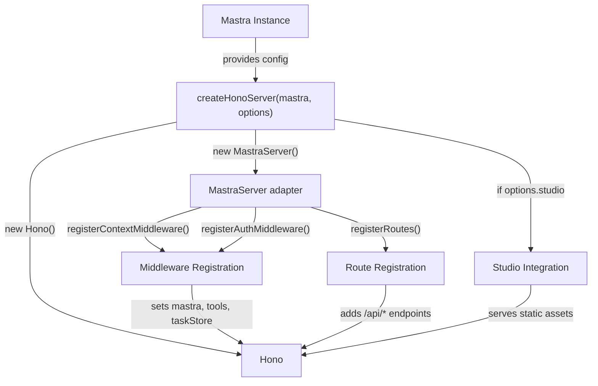
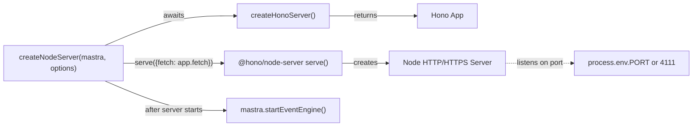
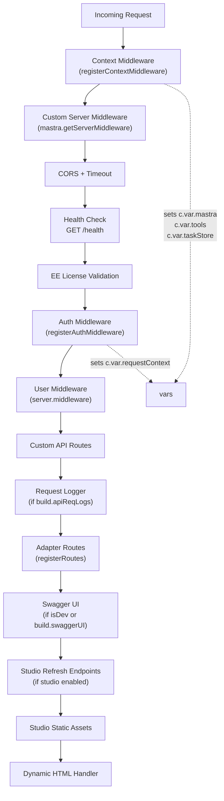
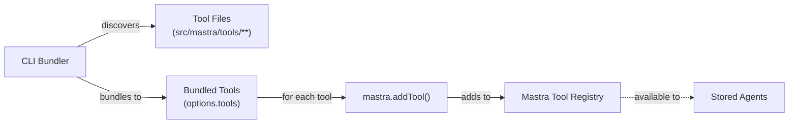
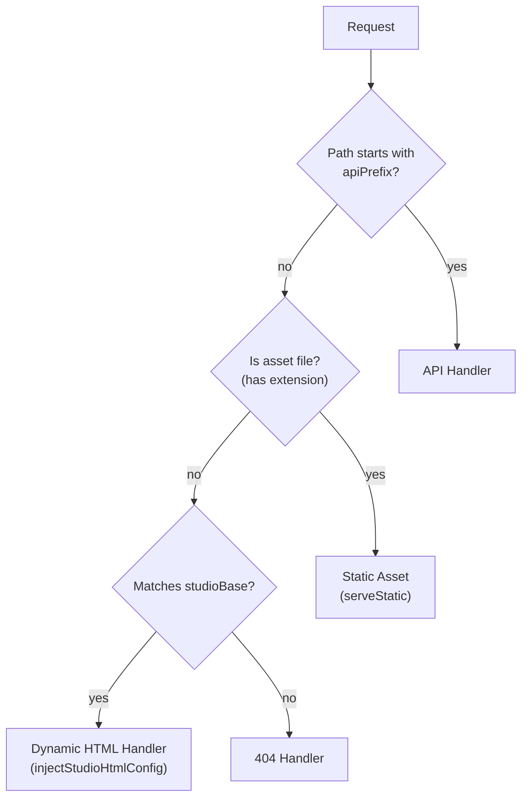
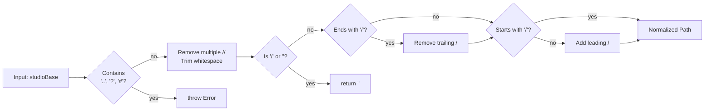
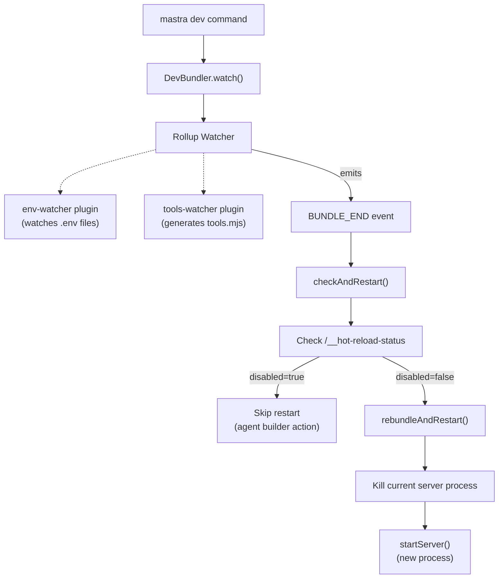
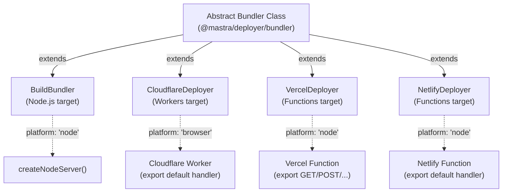
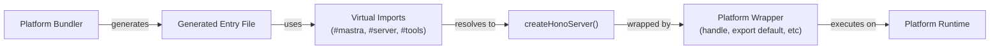

# Server Architecture and Setup

<details>
<summary>Relevant source files</summary>

The following files were used as context for generating this wiki page:

- [deployers/cloudflare/src/index.ts](deployers/cloudflare/src/index.ts)
- [deployers/netlify/src/index.ts](deployers/netlify/src/index.ts)
- [deployers/vercel/src/index.ts](deployers/vercel/src/index.ts)
- [docs/src/content/en/docs/deployment/studio.mdx](docs/src/content/en/docs/deployment/studio.mdx)
- [e2e-tests/monorepo/monorepo.test.ts](e2e-tests/monorepo/monorepo.test.ts)
- [e2e-tests/monorepo/template/apps/custom/src/mastra/index.ts](e2e-tests/monorepo/template/apps/custom/src/mastra/index.ts)
- [packages/cli/src/commands/build/BuildBundler.ts](packages/cli/src/commands/build/BuildBundler.ts)
- [packages/cli/src/commands/build/build.ts](packages/cli/src/commands/build/build.ts)
- [packages/cli/src/commands/dev/DevBundler.ts](packages/cli/src/commands/dev/DevBundler.ts)
- [packages/cli/src/commands/dev/dev.ts](packages/cli/src/commands/dev/dev.ts)
- [packages/cli/src/commands/studio/studio.test.ts](packages/cli/src/commands/studio/studio.test.ts)
- [packages/cli/src/commands/studio/studio.ts](packages/cli/src/commands/studio/studio.ts)
- [packages/core/src/bundler/index.ts](packages/core/src/bundler/index.ts)
- [packages/deployer/src/build/analyze.ts](packages/deployer/src/build/analyze.ts)
- [packages/deployer/src/build/analyze/**snapshots**/analyzeEntry.test.ts.snap](packages/deployer/src/build/analyze/__snapshots__/analyzeEntry.test.ts.snap)
- [packages/deployer/src/build/analyze/analyzeEntry.test.ts](packages/deployer/src/build/analyze/analyzeEntry.test.ts)
- [packages/deployer/src/build/analyze/analyzeEntry.ts](packages/deployer/src/build/analyze/analyzeEntry.ts)
- [packages/deployer/src/build/analyze/bundleExternals.test.ts](packages/deployer/src/build/analyze/bundleExternals.test.ts)
- [packages/deployer/src/build/analyze/bundleExternals.ts](packages/deployer/src/build/analyze/bundleExternals.ts)
- [packages/deployer/src/build/bundler.ts](packages/deployer/src/build/bundler.ts)
- [packages/deployer/src/build/utils.test.ts](packages/deployer/src/build/utils.test.ts)
- [packages/deployer/src/build/utils.ts](packages/deployer/src/build/utils.ts)
- [packages/deployer/src/build/watcher.test.ts](packages/deployer/src/build/watcher.test.ts)
- [packages/deployer/src/build/watcher.ts](packages/deployer/src/build/watcher.ts)
- [packages/deployer/src/bundler/index.ts](packages/deployer/src/bundler/index.ts)
- [packages/deployer/src/server/**tests**/option-studio-base.test.ts](packages/deployer/src/server/__tests__/option-studio-base.test.ts)
- [packages/deployer/src/server/index.ts](packages/deployer/src/server/index.ts)
- [packages/playground/e2e/tests/auth/infrastructure.spec.ts](packages/playground/e2e/tests/auth/infrastructure.spec.ts)
- [packages/playground/e2e/tests/auth/viewer-role.spec.ts](packages/playground/e2e/tests/auth/viewer-role.spec.ts)
- [packages/playground/index.html](packages/playground/index.html)
- [packages/playground/src/App.tsx](packages/playground/src/App.tsx)
- [packages/playground/src/components/ui/app-sidebar.tsx](packages/playground/src/components/ui/app-sidebar.tsx)

</details>

This page documents the Mastra server architecture, covering how HTTP servers are created, configured, and deployed. It explains the layered approach to server initialization, middleware registration, and platform-specific deployment patterns.

For information about specific API endpoints exposed by the server, see [Agent API Endpoints](#9.2), [Workflow API Endpoints](#9.3), and [Memory and Storage API Endpoints](#9.4). For authentication and authorization middleware, see [Authentication and Authorization](#9.6). For streaming protocols, see [Streaming Architecture and SSE](#9.5).

## Server Creation Architecture

Mastra uses a two-tier server creation pattern: `createHonoServer` creates and configures a Hono application instance, while `createNodeServer` wraps it with Node.js HTTP server capabilities.

### Hono Server Creation Flow



**Sources:** [packages/deployer/src/server/index.ts:73-469]()

### Node Server Wrapper



**Sources:** [packages/deployer/src/server/index.ts:471-525]()

## Server Configuration

The `Mastra` instance provides server configuration through `mastra.getServer()`, which returns a `ServerConfig` object with various options:

| Configuration   | Type              | Default             | Description                                 |
| --------------- | ----------------- | ------------------- | ------------------------------------------- |
| `port`          | `number`          | `4111`              | HTTP server port                            |
| `host`          | `string`          | `'localhost'`       | Server hostname                             |
| `apiPrefix`     | `string`          | `'/api'`            | Base path for API routes                    |
| `studioBase`    | `string`          | `'/'`               | Base path for Studio UI                     |
| `timeout`       | `number`          | `180000`            | Request timeout in milliseconds             |
| `bodySizeLimit` | `number`          | `4.5 * 1024 * 1024` | Maximum request body size (4.5MB)           |
| `cors`          | `object \| false` | CORS config         | CORS configuration or disabled              |
| `middleware`    | `Middleware[]`    | `[]`                | Custom middleware functions                 |
| `apiRoutes`     | `CustomRoute[]`   | `[]`                | User-defined API routes                     |
| `auth`          | `AuthConfig`      | `undefined`         | Authentication configuration                |
| `https`         | `{key, cert}`     | `undefined`         | HTTPS certificate options                   |
| `build`         | `BuildConfig`     | `{}`                | Build-time options (OpenAPI, Swagger, logs) |

**Sources:** [packages/deployer/src/server/index.ts:94-96](), [packages/deployer/src/server/index.ts:473-486]()

## Middleware Pipeline

The middleware registration follows a strict order to ensure proper request processing:



**Sources:** [packages/deployer/src/server/index.ts:154-269](), [packages/deployer/src/server/index.ts:236-261]()

### Context Middleware Registration

The `MastraServer.registerContextMiddleware()` method sets up essential context variables available to all downstream handlers:

```typescript
// Pseudocode representation
registerContextMiddleware() {
  app.use('*', async (c, next) => {
    c.set('mastra', this.mastra);
    c.set('tools', this.tools);
    c.set('taskStore', this.taskStore);
    c.set('requestContext', new RequestContext());
    await next();
  });
}
```

**Sources:** [packages/deployer/src/server/index.ts:154]()

### CORS Configuration

CORS middleware is configured based on whether authentication is enabled:

| Condition     | Origin Setting                                         | Credentials |
| ------------- | ------------------------------------------------------ | ----------- |
| Auth enabled  | `(origin) => origin \|\| undefined` or user-configured | `true`      |
| Auth disabled | `'*'` or user-configured                               | `false`     |
| Disabled      | CORS middleware skipped                                | N/A         |

When authentication uses cookie-based sessions, credentials must be enabled and origin cannot be `'*'`, so the server reflects the request origin by default unless explicitly configured.

**Sources:** [packages/deployer/src/server/index.ts:166-202]()

## Tool Registration and Discovery

The server automatically registers bundled tools with the Mastra instance to bridge CLI-discovered tools with runtime execution:



The `getToolExports()` helper extracts `Tool` instances from bundled modules:

```typescript
// Simplified from packages/deployer/src/server/index.ts:52-71
function getToolExports(tools: Record<string, Function>[]) {
  return tools.reduce((acc, toolModule) => {
    Object.entries(toolModule).forEach(([key, tool]) => {
      if (tool instanceof Tool) {
        acc[key] = tool
      }
    })
    return acc
  }, {})
}
```

**Sources:** [packages/deployer/src/server/index.ts:52-89]()

## Studio Integration

Studio can be served in two modes: alongside the API server or as a standalone service.

### Integrated Studio Mode

When `options.studio` is `true`, Studio assets are served from the same HTTP server:



**Sources:** [packages/deployer/src/server/index.ts:305-466]()

### Studio Configuration Injection

Studio's `index.html` uses placeholders that are replaced at runtime with server configuration:

```html
<!-- From packages/playground/index.html -->
<script>
  window.MASTRA_SERVER_HOST = '%%MASTRA_SERVER_HOST%%'
  window.MASTRA_SERVER_PORT = '%%MASTRA_SERVER_PORT%%'
  window.MASTRA_API_PREFIX = '%%MASTRA_API_PREFIX%%'
  window.MASTRA_STUDIO_BASE_PATH = '%%MASTRA_STUDIO_BASE_PATH%%'
  // ... more config
</script>
```

The `injectStudioHtmlConfig()` utility replaces these placeholders:

| Placeholder               | Source                                             | Example               |
| ------------------------- | -------------------------------------------------- | --------------------- |
| `MASTRA_SERVER_HOST`      | `serverOptions?.host` or `process.env.MASTRA_HOST` | `'localhost'`         |
| `MASTRA_SERVER_PORT`      | `serverOptions?.port` or `process.env.PORT`        | `'4111'`              |
| `MASTRA_SERVER_PROTOCOL`  | HTTPS enabled check                                | `'http'` or `'https'` |
| `MASTRA_API_PREFIX`       | `serverOptions?.apiPrefix`                         | `'/api'`              |
| `MASTRA_STUDIO_BASE_PATH` | `normalizeStudioBase(serverOptions?.studioBase)`   | `''` or `'/admin'`    |

**Sources:** [packages/deployer/src/server/index.ts:392-443](), [packages/deployer/src/build/utils.ts:249-267]()

### Base Path Normalization

The `normalizeStudioBase()` function ensures consistent base path handling:



**Sources:** [packages/deployer/src/build/utils.ts:186-213]()

## Development Server Architecture

The development server uses a hot-reload mechanism that rebundles code on file changes:



The hot reload disable mechanism prevents restarts during agent builder actions (like template installation) by checking the `/__hot-reload-status` endpoint.

**Sources:** [packages/cli/src/commands/dev/dev.ts:266-294](), [packages/cli/src/commands/dev/DevBundler.ts:57-160]()

### Environment Variable Loading

The `DevBundler` loads environment variables from multiple sources in order of precedence:

1. Custom file specified via `--env` flag
2. `.env.development`
3. `.env.local`
4. `.env`

Environment variables are loaded via `loadEnvVars()` and passed to the server process.

**Sources:** [packages/cli/src/commands/dev/DevBundler.ts:23-44](), [packages/core/src/bundler/index.ts:25-38]()

## Platform Deployers

Mastra supports multiple deployment targets through platform-specific deployer classes that extend the base `Bundler` class:



**Sources:** [packages/deployer/src/bundler/index.ts:28-464](), [packages/cli/src/commands/build/BuildBundler.ts:9-101]()

### Platform-Specific Entry Points

Each deployer generates a platform-specific entry file:

**BuildBundler (Node.js)**

```javascript
import { mastra } from '#mastra';
import { createNodeServer, getToolExports } from '#server';
import { tools } from '#tools';

await createNodeServer(mastra, {
  tools: getToolExports(tools),
  studio: ${this.studio}
});
```

**CloudflareDeployer**

```javascript
export default {
  fetch: async (request, env, context) => {
    const { mastra } = await import('#mastra')
    const { createHonoServer, getToolExports } = await import('#server')
    const app = await createHonoServer(mastra(), {
      tools: getToolExports(tools),
    })
    return app.fetch(request, env, context)
  },
}
```

**VercelDeployer**

```javascript
import { handle } from 'hono/vercel'
import { mastra } from '#mastra'
import { createHonoServer } from '#server'

const app = await createHonoServer(mastra, { tools })

export const GET = handle(app)
export const POST = handle(app)
// ... other HTTP methods
```

**Sources:** [packages/cli/src/commands/build/BuildBundler.ts:77-95](), [deployers/cloudflare/src/index.ts:182-203](), [deployers/vercel/src/index.ts:47-68]()

### Platform Adapter Pattern



Each platform adapter:

1. Extends `Bundler` base class
2. Sets appropriate `platform` value (`'node'`, `'browser'`, or `'neutral'`)
3. Implements `getEntry()` to generate platform-specific wrapper code
4. Configures bundler plugins for platform requirements (e.g., stubs for unavailable modules)

**Sources:** [deployers/cloudflare/src/index.ts:25-276](), [deployers/vercel/src/index.ts:10-164](), [deployers/netlify/src/index.ts:7-105]()

## HTTPS Configuration

The server supports HTTPS via certificate configuration:

| Source                                            | Priority    | Format                       |
| ------------------------------------------------- | ----------- | ---------------------------- |
| `server.https.{key, cert}` in config              | 1 (highest) | Buffer or string             |
| `MASTRA_HTTPS_KEY` + `MASTRA_HTTPS_CERT` env vars | 2           | Base64-encoded strings       |
| `--https` flag in dev command                     | 3 (lowest)  | Auto-generated via `devcert` |

When HTTPS is enabled, the server uses `https.createServer()` instead of the default HTTP server.

**Sources:** [packages/deployer/src/server/index.ts:476-482](), [packages/cli/src/commands/dev/dev.ts:419-436]()

## Custom Route Configuration

Custom API routes can be registered through `server.apiRoutes`:

```typescript
interface CustomRoute {
  path: string
  method: 'GET' | 'POST' | 'PUT' | 'DELETE' | 'PATCH' | 'ALL'
  handler: (c: Context) => Response | Promise<Response>
  middleware?: Middleware | Middleware[]
  requiresAuth?: boolean // default: true
  openapi?: OpenAPIRouteConfig // optional OpenAPI spec
}
```

Routes with `openapi` config are automatically wrapped with `hono-openapi`'s `describeRoute()` middleware for OpenAPI documentation generation.

**Sources:** [packages/deployer/src/server/index.ts:96-122]()

### Route Authentication Control

Custom routes require authentication by default. To create a public route:

```typescript
const publicRoute: CustomRoute = {
  path: '/public/health',
  method: 'GET',
  handler: (c) => c.json({ status: 'ok' }),
  requiresAuth: false, // Explicitly disable auth requirement
}
```

**Sources:** [packages/deployer/src/server/index.ts:113-122]()

## Error Handling

The server error handler can be customized via `server.onError`:

```typescript
const mastra = new Mastra({
  server: {
    onError: (err, c) => {
      console.error('Server error:', err)
      return c.json({ error: 'Custom error message' }, 500)
    },
  },
})
```

If not provided, the default error handler formats errors based on environment (detailed stack traces in development, sanitized messages in production).

**Sources:** [packages/deployer/src/server/index.ts:124-131]()

## Body Size Limits

Request body size is limited to prevent memory exhaustion:

```typescript
const bodyLimitOptions = {
  maxSize: server?.bodySizeLimit ?? 4.5 * 1024 * 1024, // 4.5MB default
  onError: () => ({ error: 'Request body too large' }),
}
```

This limit applies to all request bodies (JSON, form data, etc.). Adjust via `server.bodySizeLimit` in Mastra config for larger file uploads.

**Sources:** [packages/deployer/src/server/index.ts:133-137]()
