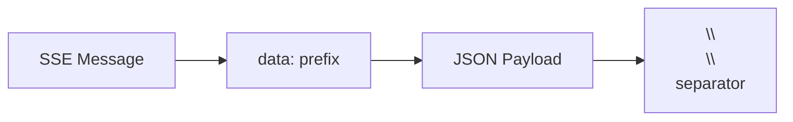
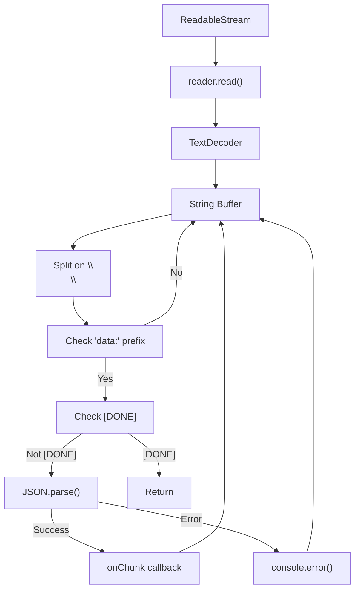
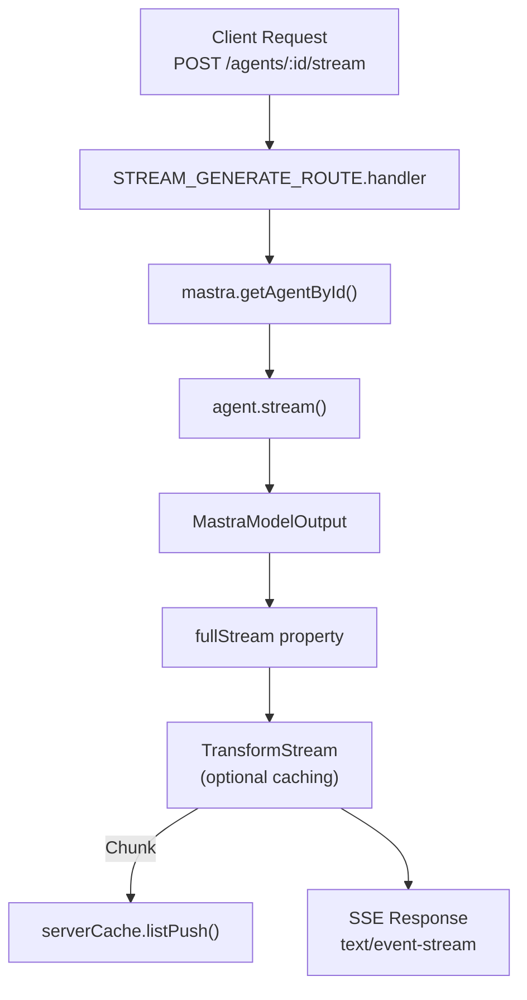
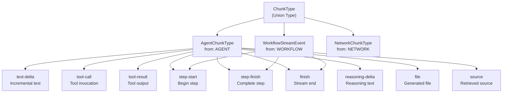
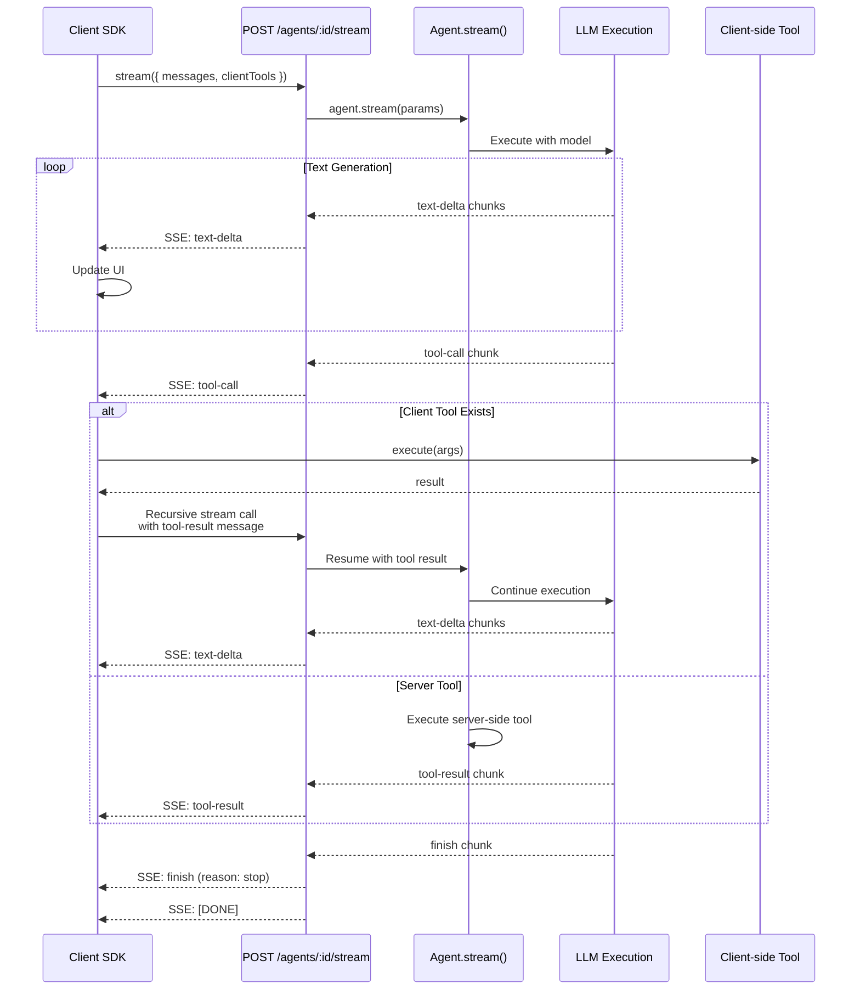
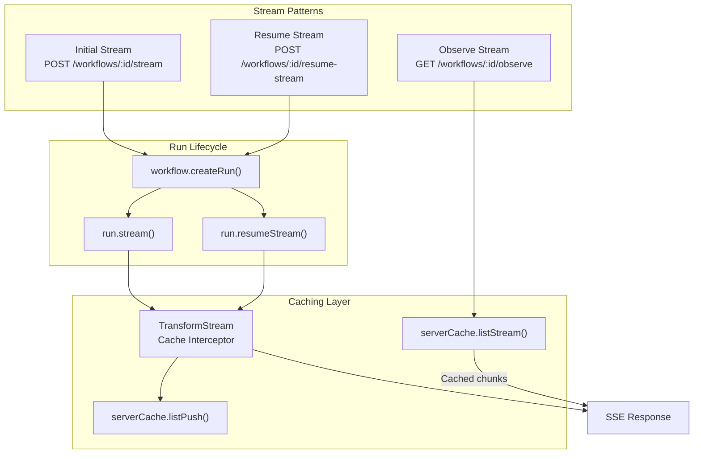
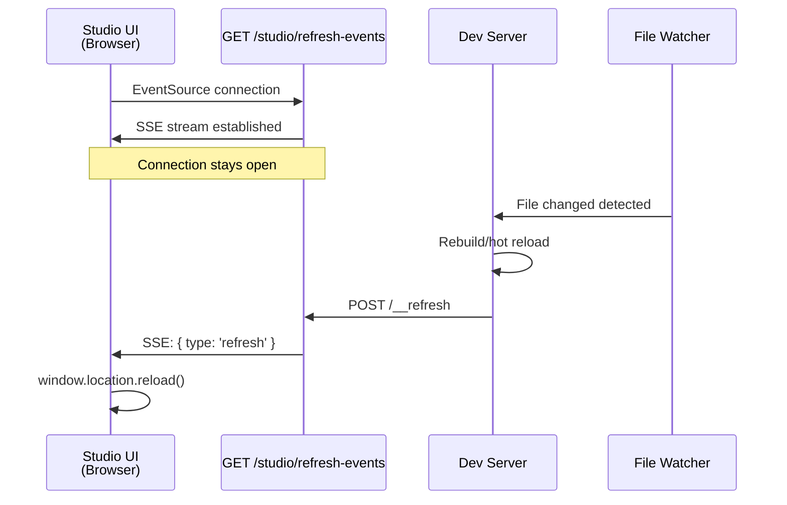
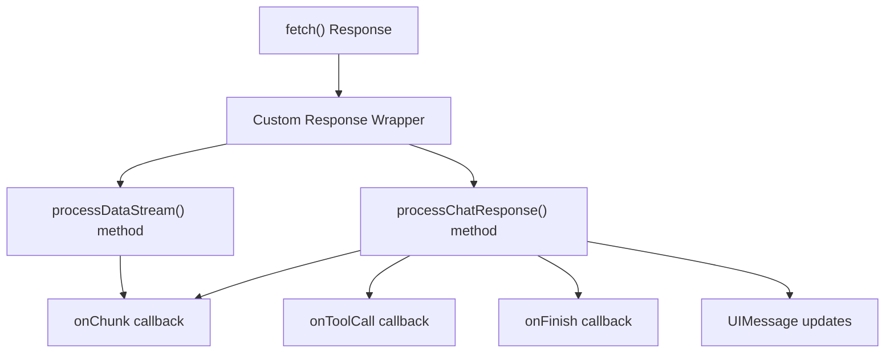

# Streaming Architecture and SSE

<details>
<summary>Relevant source files</summary>

The following files were used as context for generating this wiki page:

- [client-sdks/client-js/src/client.ts](client-sdks/client-js/src/client.ts)
- [client-sdks/client-js/src/resources/agent.test.ts](client-sdks/client-js/src/resources/agent.test.ts)
- [client-sdks/client-js/src/resources/agent.ts](client-sdks/client-js/src/resources/agent.ts)
- [client-sdks/client-js/src/resources/agent.vnext.test.ts](client-sdks/client-js/src/resources/agent.vnext.test.ts)
- [client-sdks/client-js/src/resources/index.ts](client-sdks/client-js/src/resources/index.ts)
- [client-sdks/client-js/src/types.ts](client-sdks/client-js/src/types.ts)
- [deployers/cloudflare/src/index.ts](deployers/cloudflare/src/index.ts)
- [deployers/netlify/src/index.ts](deployers/netlify/src/index.ts)
- [deployers/vercel/src/index.ts](deployers/vercel/src/index.ts)
- [docs/src/content/en/docs/deployment/studio.mdx](docs/src/content/en/docs/deployment/studio.mdx)
- [e2e-tests/create-mastra/create-mastra.test.ts](e2e-tests/create-mastra/create-mastra.test.ts)
- [e2e-tests/monorepo/monorepo.test.ts](e2e-tests/monorepo/monorepo.test.ts)
- [e2e-tests/monorepo/template/apps/custom/src/mastra/index.ts](e2e-tests/monorepo/template/apps/custom/src/mastra/index.ts)
- [packages/cli/src/commands/build/BuildBundler.ts](packages/cli/src/commands/build/BuildBundler.ts)
- [packages/cli/src/commands/build/build.ts](packages/cli/src/commands/build/build.ts)
- [packages/cli/src/commands/dev/DevBundler.ts](packages/cli/src/commands/dev/DevBundler.ts)
- [packages/cli/src/commands/dev/dev.ts](packages/cli/src/commands/dev/dev.ts)
- [packages/cli/src/commands/studio/studio.test.ts](packages/cli/src/commands/studio/studio.test.ts)
- [packages/cli/src/commands/studio/studio.ts](packages/cli/src/commands/studio/studio.ts)
- [packages/core/src/agent/**tests**/dynamic-model-fallback.test.ts](packages/core/src/agent/__tests__/dynamic-model-fallback.test.ts)
- [packages/core/src/bundler/index.ts](packages/core/src/bundler/index.ts)
- [packages/core/src/memory/mock.ts](packages/core/src/memory/mock.ts)
- [packages/core/src/storage/mock.test.ts](packages/core/src/storage/mock.test.ts)
- [packages/core/src/stream/aisdk/v5/transform.test.ts](packages/core/src/stream/aisdk/v5/transform.test.ts)
- [packages/core/src/stream/aisdk/v5/transform.ts](packages/core/src/stream/aisdk/v5/transform.ts)
- [packages/deployer/src/build/analyze.ts](packages/deployer/src/build/analyze.ts)
- [packages/deployer/src/build/analyze/**snapshots**/analyzeEntry.test.ts.snap](packages/deployer/src/build/analyze/__snapshots__/analyzeEntry.test.ts.snap)
- [packages/deployer/src/build/analyze/analyzeEntry.test.ts](packages/deployer/src/build/analyze/analyzeEntry.test.ts)
- [packages/deployer/src/build/analyze/analyzeEntry.ts](packages/deployer/src/build/analyze/analyzeEntry.ts)
- [packages/deployer/src/build/analyze/bundleExternals.test.ts](packages/deployer/src/build/analyze/bundleExternals.test.ts)
- [packages/deployer/src/build/analyze/bundleExternals.ts](packages/deployer/src/build/analyze/bundleExternals.ts)
- [packages/deployer/src/build/bundler.ts](packages/deployer/src/build/bundler.ts)
- [packages/deployer/src/build/utils.test.ts](packages/deployer/src/build/utils.test.ts)
- [packages/deployer/src/build/utils.ts](packages/deployer/src/build/utils.ts)
- [packages/deployer/src/build/watcher.test.ts](packages/deployer/src/build/watcher.test.ts)
- [packages/deployer/src/build/watcher.ts](packages/deployer/src/build/watcher.ts)
- [packages/deployer/src/bundler/index.ts](packages/deployer/src/bundler/index.ts)
- [packages/deployer/src/server/**tests**/option-studio-base.test.ts](packages/deployer/src/server/__tests__/option-studio-base.test.ts)
- [packages/deployer/src/server/index.ts](packages/deployer/src/server/index.ts)
- [packages/playground/e2e/tests/auth/infrastructure.spec.ts](packages/playground/e2e/tests/auth/infrastructure.spec.ts)
- [packages/playground/e2e/tests/auth/viewer-role.spec.ts](packages/playground/e2e/tests/auth/viewer-role.spec.ts)
- [packages/playground/index.html](packages/playground/index.html)
- [packages/playground/src/App.tsx](packages/playground/src/App.tsx)
- [packages/playground/src/components/ui/app-sidebar.tsx](packages/playground/src/components/ui/app-sidebar.tsx)
- [packages/server/src/server/handlers.ts](packages/server/src/server/handlers.ts)
- [packages/server/src/server/handlers/agent.test.ts](packages/server/src/server/handlers/agent.test.ts)
- [packages/server/src/server/handlers/agents.ts](packages/server/src/server/handlers/agents.ts)
- [packages/server/src/server/handlers/memory.test.ts](packages/server/src/server/handlers/memory.test.ts)
- [packages/server/src/server/handlers/memory.ts](packages/server/src/server/handlers/memory.ts)
- [packages/server/src/server/handlers/utils.test.ts](packages/server/src/server/handlers/utils.test.ts)
- [packages/server/src/server/handlers/utils.ts](packages/server/src/server/handlers/utils.ts)
- [packages/server/src/server/handlers/vector.test.ts](packages/server/src/server/handlers/vector.test.ts)
- [packages/server/src/server/schemas/memory.test.ts](packages/server/src/server/schemas/memory.test.ts)
- [packages/server/src/server/schemas/memory.ts](packages/server/src/server/schemas/memory.ts)

</details>

## Purpose and Scope

This document describes Mastra's streaming architecture, which enables real-time, incremental responses from AI agents and workflow executions. The architecture uses Server-Sent Events (SSE) as the transport protocol for streaming data from the server to clients. This covers the server-side streaming implementation in the Hono API server, the client-side SSE parser, and the integration points for agents, workflows, and development tools.

For information about the broader API architecture, see [Server and API Layer](#9). For agent execution details, see [Agent System](#3). For workflow execution, see [Workflow System](#4).

---

## SSE Protocol Overview

Mastra uses Server-Sent Events (SSE) for streaming responses because it provides a simple, text-based protocol with automatic reconnection support and works over standard HTTP. The implementation follows the W3C EventSource specification with JSON payloads.

### Message Format



**SSE Message Structure:**

| Component | Format      | Example                                 |
| --------- | ----------- | --------------------------------------- |
| Prefix    | `data: `    | Required SSE field marker               |
| Payload   | JSON string | `{"type":"text-delta","payload":{...}}` |
| Separator | `\          |

\
`| Double newline marks message boundary |
| Terminator |`data: [DONE]\
\
` | Signals stream completion |

**Sources:** [client-sdks/client-js/src/utils/process-mastra-stream.ts:23-45]()

---

## Client-Side SSE Parser

The client SDK provides a robust SSE parser that handles chunked data, incomplete messages, and parsing errors gracefully.



**Parser Implementation:**

The `processMastraStream` function implements the SSE parser with three key features:

1. **Buffering:** Incomplete messages are buffered across multiple `reader.read()` calls
2. **Error Recovery:** JSON parsing errors are logged but don't terminate the stream
3. **Termination:** The `[DONE]` marker signals stream completion

```typescript
// Simplified parser logic
async function processMastraStream({ stream, onChunk }) {
  const reader = stream.getReader()
  const decoder = new TextDecoder()
  let buffer = ''

  while (true) {
    const { done, value } = await reader.read()
    if (done) break

    buffer += decoder.decode(value, { stream: true })
    const lines =
      buffer.split(
        '\
\
'
      )
    buffer = lines.pop() || '' // Keep incomplete line

    for (const line of lines) {
      if (line.startsWith('data: ')) {
        const data = line.slice(6)
        if (data === '[DONE]') return

        try {
          const json = JSON.parse(data)
          await onChunk(json)
        } catch (error) {
          console.error('JSON parse error:', error)
          continue // Continue processing other messages
        }
      }
    }
  }
}
```

**Sources:** [client-sdks/client-js/src/utils/process-mastra-stream.ts:4-76](), [client-sdks/client-js/src/utils/process-mastra-stream.test.ts:7-200]()

---

## Server-Side Streaming Implementation

The server uses Hono's `ReadableStream` support to create SSE responses. Streams are generated from agent execution or workflow runs and can be cached for later retrieval.



**Server Streaming Pattern:**

The server returns `ReadableStream` objects directly from route handlers, which Hono automatically converts to SSE format:

```typescript
// Agent streaming route
export const STREAM_GENERATE_ROUTE = createRoute({
  method: 'POST',
  path: '/agents/:agentId/stream',
  responseType: 'stream',
  handler: async ({ mastra, agentId, ...params }) => {
    const agent = mastra.getAgentById(agentId)
    const result = agent.stream(params)

    // Return the stream directly
    return result.fullStream
  },
})
```

**Workflow Streaming with Caching:**

Workflow streams can be cached in memory for later retrieval via the observe endpoint:

```typescript
// Workflow stream endpoint
handler: async ({ mastra, workflowId, runId, ...params }) => {
  const { workflow } = await listWorkflowsFromSystem({ mastra, workflowId })
  const serverCache = mastra.getServerCache()

  const run = await workflow.createRun({ runId })
  const result = run.stream(params)

  // Cache chunks as they flow through
  return result.fullStream.pipeThrough(
    new TransformStream<ChunkType, ChunkType>({
      transform(chunk, controller) {
        if (serverCache) {
          serverCache.listPush(runId, chunk).catch(() => {})
        }
        controller.enqueue(chunk)
      },
    })
  )
}
```

**Sources:** [packages/server/src/server/handlers/agents.ts:1-1500](), [packages/server/src/server/handlers/workflows.ts:346-393]()

---

## Chunk Types and Format

Mastra streams different types of chunks depending on the source (agent, workflow, network) and the data being transmitted.



**Common Chunk Structure:**

All chunks include these base fields:

| Field     | Type      | Description                               |
| --------- | --------- | ----------------------------------------- |
| `type`    | string    | Discriminator for chunk type              |
| `runId`   | string    | Execution run identifier                  |
| `from`    | ChunkFrom | Source: `AGENT`, `WORKFLOW`, or `NETWORK` |
| `payload` | object    | Type-specific data                        |

**Example Chunks:**

```typescript
// Text delta chunk (incremental text generation)
{
  type: 'text-delta',
  runId: 'run-123',
  from: 'AGENT',
  payload: { id: 'msg-1', text: 'Hello' }
}

// Tool call chunk (agent invoking a tool)
{
  type: 'tool-call',
  runId: 'run-123',
  from: 'AGENT',
  payload: {
    toolCallId: 'call-1',
    toolName: 'weatherTool',
    args: { location: 'NYC' }
  }
}

// Finish chunk (stream completion)
{
  type: 'finish',
  runId: 'run-123',
  from: 'AGENT',
  payload: {
    stepResult: { reason: 'stop' },
    usage: { totalTokens: 150 }
  }
}
```

**Sources:** [packages/core/src/stream/index.ts:1-59](), [client-sdks/client-js/src/types.ts:571-576]()

---

## Agent Streaming Flow

Agent streaming enables real-time responses with incremental text generation and client-side tool execution.



**Client-Side Tool Execution During Streaming:**

When the server streams a `tool-call` chunk with `finishReason: 'tool-calls'`, the client SDK:

1. **Checks for Client Tool:** Looks up the tool in `clientTools` parameter
2. **Executes Tool:** Calls `tool.execute()` with the arguments from the chunk
3. **Builds Tool Result Message:** Creates a message with the tool result
4. **Makes Recursive Request:** Calls `agent.stream()` again with the updated messages
5. **Continues Streaming:** The new stream continues from where the previous one stopped

```typescript
// Simplified client-side tool execution logic
async function executeToolCallAndRespond({ response, params, respondFn }) {
  if (response.finishReason === 'tool-calls') {
    const toolCalls = response.toolCalls

    for (const toolCall of toolCalls) {
      const clientTool = params.clientTools?.[toolCall.payload.toolName]

      if (clientTool && clientTool.execute) {
        // Execute client-side tool
        const result = await clientTool.execute(toolCall.payload.args, {
          requestContext,
          agent: { messages, toolCallId, suspend, threadId, resourceId },
        })

        // Build updated messages with tool result
        const updatedMessages = [
          ...response.messages,
          {
            role: 'tool',
            content: [
              {
                type: 'tool-result',
                toolCallId: toolCall.payload.toolCallId,
                toolName: toolCall.payload.toolName,
                result,
              },
            ],
          },
        ]

        // Recursive call to continue streaming
        return respondFn(updatedMessages, params)
      }
    }
  }

  return response
}
```

**Sources:** [client-sdks/client-js/src/resources/agent.ts:43-109](), [client-sdks/client-js/src/resources/agent.test.ts:130-155](), [client-sdks/client-js/src/resources/agent.vnext.test.ts:70-129]()

---

## Workflow Streaming Architecture

Workflow streaming supports three distinct patterns: initial execution streaming, resume streaming, and observation of cached streams.



**Stream Endpoint (Initial Execution):**

```typescript
export const STREAM_WORKFLOW_ROUTE = createRoute({
  method: 'POST',
  path: '/workflows/:workflowId/stream',
  responseType: 'stream',
  handler: async ({ mastra, workflowId, runId, ...params }) => {
    const { workflow } = await listWorkflowsFromSystem({ mastra, workflowId })
    const serverCache = mastra.getServerCache()

    const run = await workflow.createRun({ runId })
    const result = run.stream(params)

    // Cache chunks for later observation
    return result.fullStream.pipeThrough(
      new TransformStream<ChunkType, ChunkType>({
        transform(chunk, controller) {
          if (serverCache) {
            serverCache.listPush(runId, chunk).catch(() => {})
          }
          controller.enqueue(chunk)
        },
      })
    )
  },
})
```

**Resume Stream (Suspended Workflows):**

Workflows can suspend execution (e.g., for human approval) and be resumed later:

```typescript
export const RESUME_STREAM_WORKFLOW_ROUTE = createRoute({
  method: 'POST',
  path: '/workflows/:workflowId/resume-stream',
  responseType: 'stream',
  handler: async ({ mastra, workflowId, runId, ...params }) => {
    const { workflow } = await listWorkflowsFromSystem({ mastra, workflowId })
    const run = await workflow.getWorkflowRunById(runId)

    if (!run) {
      throw new HTTPException(404, { message: 'Workflow run not found' })
    }

    const _run = await workflow.createRun({ runId })
    return _run.resumeStream(params).fullStream.pipeThrough(
      new TransformStream<ChunkType, ChunkType>({
        transform(chunk, controller) {
          // Cache for observation
          serverCache?.listPush(runId, chunk).catch(() => {})
          controller.enqueue(chunk)
        },
      })
    )
  },
})
```

**Observe Stream (Replay Cached Events):**

The observe endpoint streams previously cached chunks without re-executing the workflow:

```typescript
export const OBSERVE_STREAM_WORKFLOW_ROUTE = createRoute({
  method: 'GET',
  path: '/workflows/:workflowId/observe',
  responseType: 'stream',
  handler: async ({ mastra, runId }) => {
    const serverCache = mastra.getServerCache()
    if (!serverCache) {
      throw new HTTPException(503, { message: 'Server cache not available' })
    }

    // Retrieve cached chunks and stream them
    return serverCache.listStream(runId)
  },
})
```

**Record Streams for Batch Processing:**

Workflows can also stream records (e.g., for batch operations) using a custom record separator:

```typescript
// Client-side record stream creation
static createRecordStream(records: Iterable<any> | AsyncIterable<any>): ReadableStream {
  const RECORD_SEPARATOR = '\x1E';
  const encoder = new TextEncoder();

  return new ReadableStream({
    async start(controller) {
      try {
        for await (const record of records) {
          const json = JSON.stringify(record) + RECORD_SEPARATOR;
          controller.enqueue(encoder.encode(json));
        }
        controller.close();
      } catch (err) {
        controller.error(err);
      }
    }
  });
}
```

**Sources:** [packages/server/src/server/handlers/workflows.ts:346-520](), [client-sdks/client-js/src/resources/workflow.ts:184-206](), [packages/server/src/server/handlers/workflows.test.ts:570-670]()

---

## Hot Reload SSE for Development

The development server uses SSE to notify the Studio UI of code changes, enabling automatic refresh without manual page reloads.



**Server-Side Hot Reload Endpoints:**

```typescript
// SSE endpoint for refresh notifications
app.get(`${studioBasePath}/refresh-events`, handleClientsRefresh)

// Trigger refresh for all clients
app.post(`${studioBasePath}/__refresh`, handleTriggerClientsRefresh)

// Check if hot reload is enabled
app.get(`${studioBasePath}/__hot-reload-status`, (c: Context) => {
  return c.json({
    disabled: isHotReloadDisabled(),
    timestamp: new Date().toISOString(),
  })
})
```

**Client Registry Pattern:**

The server maintains a registry of connected SSE clients using a `Set` stored in Hono's context variables:

```typescript
type Variables = HonoVariables & {
  clients: Set<{ controller: ReadableStreamDefaultController }>
}

// Register new client on connection
export const handleClientsRefresh = (c: Context<{ Variables: Variables }>) => {
  const stream = new ReadableStream({
    start(controller) {
      const clients = c.get('clients') || new Set()
      clients.add({ controller })
      c.set('clients', clients)
    },
  })

  return c.newResponse(stream, {
    headers: { 'Content-Type': 'text/event-stream' },
  })
}

// Trigger refresh for all connected clients
export const handleTriggerClientsRefresh = (
  c: Context<{ Variables: Variables }>
) => {
  const clients = c.get('clients') || new Set()
  const encoder = new TextEncoder()

  for (const client of clients) {
    try {
      client.controller.enqueue(
        encoder.encode(`data: ${JSON.stringify({ type: 'refresh' })}\
\
`)
      )
    } catch (error) {
      clients.delete(client) // Remove disconnected clients
    }
  }

  return c.json({ message: 'Refresh triggered' })
}
```

**Hot Reload Disable Flag:**

Hot reload can be disabled via environment variable for production-like testing:

```typescript
export const isHotReloadDisabled = () => {
  return process.env.MASTRA_DISABLE_HOT_RELOAD === 'true'
}
```

**Sources:** [packages/deployer/src/server/index.ts:285-315](), [packages/deployer/src/server/handlers/client.ts:1-100]()

---

## Client SDK Response Wrapper

The client SDK wraps SSE responses in a custom `Response` object that provides convenience methods for processing streams.



**Response Wrapper Implementation:**

The client SDK enhances the native `Response` object with streaming convenience methods:

```typescript
// Agent.stream() returns enhanced Response
async stream(messages: MessageListInput, options?: StreamParams): Promise<Response> {
  const response = await fetch(`/agents/${agentId}/stream`, {
    method: 'POST',
    body: JSON.stringify(processedParams)
  });

  // Add convenience methods to Response
  return Object.assign(response, {
    processDataStream: async ({ onChunk }) => {
      await processMastraStream({
        stream: response.body,
        onChunk
      });
    },

    processChatResponse: async ({ update, onToolCall, onFinish }) => {
      // Process stream and update UI message
      await this.processChatResponse({
        stream: response.body,
        update,
        onToolCall,
        onFinish,
        lastMessage
      });
    }
  });
}
```

**AI SDK v5 Compatibility:**

The client SDK provides compatibility with AI SDK v5's `processDataStream` for framework integration:

```typescript
// Usage with React or other frameworks
const response = await agent.stream(messages)

await response.processDataStream({
  onChunk: async (chunk) => {
    if (chunk.type === 'text-delta') {
      updateMessage(chunk.payload.text)
    }
  },
  onToolCall: async ({ toolCall }) => {
    return await executeToolLocally(toolCall)
  },
  onFinish: ({ message, finishReason, usage }) => {
    console.log('Stream finished:', finishReason)
  },
})
```

**Chat UI Integration:**

The `processChatResponse` method provides a higher-level API for chat UIs:

```typescript
// Automatic UIMessage updates
await response.processChatResponse({
  update: ({ message, data, replaceLastMessage }) => {
    if (replaceLastMessage) {
      messages[messages.length - 1] = message
    } else {
      messages.push(message)
    }
    setMessages([...messages])
  },
  onToolCall: async ({ toolCall }) => {
    return handleToolCall(toolCall)
  },
  onFinish: ({ message, finishReason, usage }) => {
    trackUsage(usage)
  },
})
```

**Sources:** [client-sdks/client-js/src/resources/agent.ts:371-850](), [packages/core/src/stream/aisdk/v5/compat.ts:1-100]()

---

## Error Handling and Recovery

The streaming architecture implements multiple layers of error handling to ensure resilient operation.

### JSON Parsing Errors

**Problem:** Network issues or bugs can cause malformed JSON in SSE messages.

**Solution:** Parse errors are logged but don't terminate the stream:

```typescript
try {
  json = JSON.parse(data)
} catch (error) {
  console.error('❌ JSON parse error:', error, 'Data:', data)
  continue // Skip this message, continue processing
}
```

### Stream Lock Issues

**Problem:** WritableStream can become locked during recursive tool execution, causing errors.

**Solution:** Proper stream lifecycle management ensures locks are released:

```typescript
// Create new stream for recursive calls
const response = await executeToolCallAndRespond({
  response,
  params,
  respondFn: this.stream.bind(this),
})

// Each recursive call gets its own stream
// Previous streams are closed before new ones are created
```

### Incomplete Message Buffering

**Problem:** SSE messages can be split across multiple TCP packets.

**Solution:** Buffer incomplete messages until the separator is found:

```typescript
let buffer = ''

while (true) {
  const { done, value } = await reader.read()
  if (done) break

  buffer += decoder.decode(value, { stream: true })
  const lines =
    buffer.split(
      '\
\
'
    )
  buffer = lines.pop() || '' // Keep incomplete message in buffer

  // Process complete messages
  for (const line of lines) {
    processLine(line)
  }
}
```

### Network Disconnections

**Problem:** Long-running streams can be interrupted by network issues.

**Solution:** Client SDK provides retry mechanism (inherited from BaseResource):

```typescript
// BaseResource implements exponential backoff
async request(path: string, options?: RequestOptions) {
  let lastError: Error;

  for (let i = 0; i < this.retries; i++) {
    try {
      return await fetch(url, options);
    } catch (error) {
      lastError = error;
      const delay = Math.min(
        this.backoffMs * Math.pow(2, i),
        this.maxBackoffMs
      );
      await sleep(delay);
    }
  }

  throw lastError;
}
```

**Sources:** [client-sdks/client-js/src/utils/process-mastra-stream.ts:34-46](), [client-sdks/client-js/src/resources/agent.vnext.test.ts:70-129](), [client-sdks/client-js/src/resources/base.ts:1-200]()

---

## Performance Considerations

### Stream Caching Strategy

**Memory vs Storage Trade-off:**

The workflow caching system uses in-memory caching for recent runs:

```typescript
// Cache chunks during streaming
serverCache.listPush(runId, chunk).catch(() => {
  // Silent failure - caching is opportunistic
})

// Later retrieval for observation
const cachedStream = await serverCache.listStream(runId)
```

**Recommendation:** Configure cache TTL based on expected observation patterns. Short-lived runs (< 1 minute) benefit from in-memory caching. Longer runs should persist to storage.

### Transform Stream Performance

**Zero-Copy Optimization:**

Transform streams intercept chunks without copying data:

```typescript
return stream.pipeThrough(
  new TransformStream<ChunkType, ChunkType>({
    transform(chunk, controller) {
      // Cache asynchronously (non-blocking)
      serverCache.listPush(runId, chunk).catch(() => {})

      // Enqueue original chunk (zero-copy)
      controller.enqueue(chunk)
    },
  })
)
```

### Chunk Batching

**Text Delta Coalescing:**

Multiple text-delta chunks can be coalesced for better UI performance:

```typescript
let textBuffer = ''
let timeoutId: NodeJS.Timeout

onChunk: async (chunk) => {
  if (chunk.type === 'text-delta') {
    textBuffer += chunk.payload.text

    clearTimeout(timeoutId)
    timeoutId = setTimeout(() => {
      updateUI(textBuffer)
      textBuffer = ''
    }, 16) // ~60fps
  }
}
```

**Sources:** [packages/server/src/server/handlers/workflows.ts:378-390](), [client-sdks/client-js/src/resources/agent.ts:471-484]()

---

## Testing Streaming Implementations

### Unit Tests for SSE Parser

The test suite covers edge cases including incomplete messages, parsing errors, and the `[DONE]` marker:

```typescript
describe('processMastraStream', () => {
  it('should handle incomplete SSE messages across chunks', async () => {
    // Split SSE message across multiple chunks
    const chunks = [
      'data: {"type":"message","runId":"run-123"',
      ',"from":"AGENT","payload":{"text":"complete message"}}\
\
',
    ]

    const stream = createChunkedMockStream(chunks)
    await processMastraStream({ stream, onChunk: mockOnChunk })

    expect(mockOnChunk).toHaveBeenCalledWith({
      type: 'message',
      runId: 'run-123',
      from: 'AGENT',
      payload: { text: 'complete message' },
    })
  })

  it('should handle JSON parsing errors gracefully', async () => {
    const invalidJson =
      'data: {invalid json}\
\
'
    const validChunk = {
      type: 'message',
      runId: 'run-123',
      from: 'AGENT',
      payload: { text: 'valid message' },
    }
    const sseData =
      invalidJson +
      `data: ${JSON.stringify(validChunk)}\
\
`

    const stream = createMockStream(sseData)
    await processMastraStream({ stream, onChunk: mockOnChunk })

    // Should have called onChunk only for valid message
    expect(mockOnChunk).toHaveBeenCalledTimes(1)
    expect(mockOnChunk).toHaveBeenCalledWith(validChunk)
  })
})
```

**Sources:** [client-sdks/client-js/src/utils/process-mastra-stream.test.ts:7-200]()

### E2E Tests for Agent Streaming

End-to-end tests verify the full client-server streaming flow:

```typescript
it('stream: executes client tool and triggers recursive call', async () => {
  // First cycle: emit tool-call
  const firstCycle = [
    { type: 'step-start', payload: { messageId: 'm1' } },
    {
      type: 'tool-call',
      payload: { toolCallId, toolName: 'weatherTool', args },
    },
    { type: 'finish', payload: { stepResult: { reason: 'tool-calls' } } },
  ]

  // Second cycle: emit completion after tool execution
  const secondCycle = [
    { type: 'step-start', payload: { messageId: 'm2' } },
    { type: 'text-delta', payload: { text: 'Tool handled' } },
    { type: 'finish', payload: { stepResult: { reason: 'stop' } } },
  ]

  fetch
    .mockResolvedValueOnce(sseResponse(firstCycle))
    .mockResolvedValueOnce(sseResponse(secondCycle))

  const executeSpy = vi.fn(async () => ({ ok: true }))
  const weatherTool = createTool({
    id: 'weatherTool',
    execute: executeSpy,
  })

  const resp = await agent.stream('weather?', { clientTools: { weatherTool } })
  await resp.processDataStream({ onChunk: () => {} })

  // Client tool executed once
  expect(executeSpy).toHaveBeenCalledTimes(1)

  // Two fetch calls made (initial + recursive)
  expect(fetch).toHaveBeenCalledTimes(2)
})
```

**Sources:** [client-sdks/client-js/src/resources/agent.vnext.test.ts:70-129](), [e2e-tests/create-mastra/create-mastra.test.ts:95-150]()
