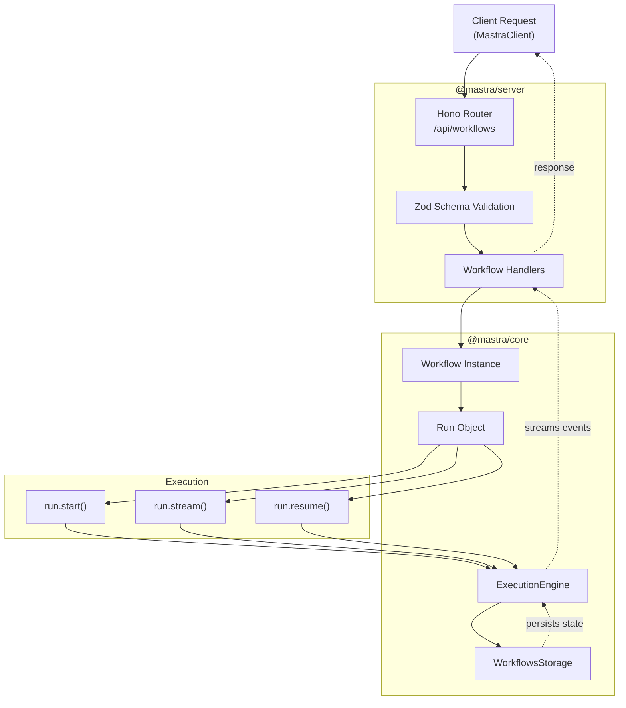
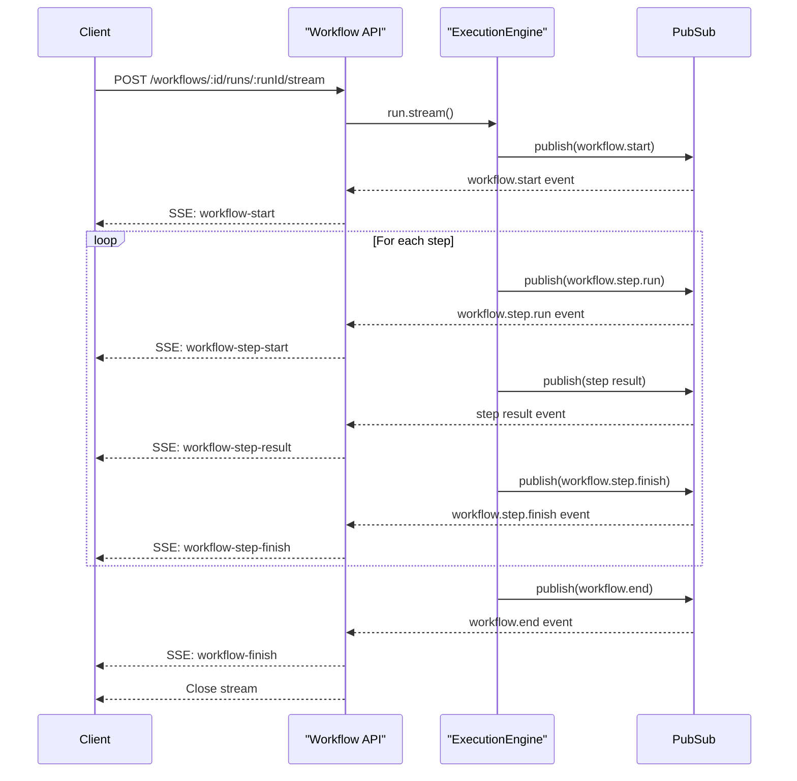
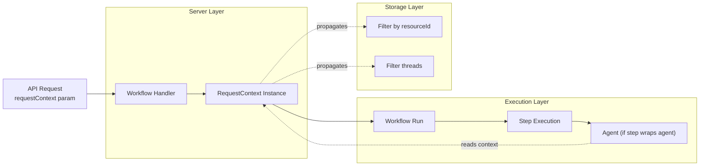
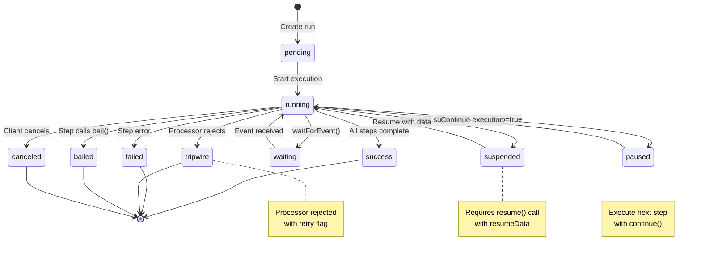
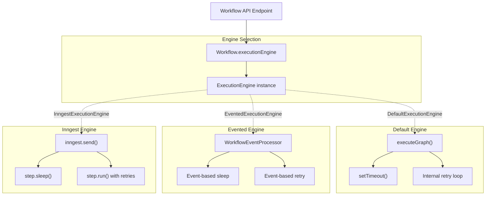

# Workflow API Endpoints

<details>
<summary>Relevant source files</summary>

The following files were used as context for generating this wiki page:

- [client-sdks/client-js/src/client.ts](client-sdks/client-js/src/client.ts)
- [client-sdks/client-js/src/resources/agent.test.ts](client-sdks/client-js/src/resources/agent.test.ts)
- [client-sdks/client-js/src/resources/agent.ts](client-sdks/client-js/src/resources/agent.ts)
- [client-sdks/client-js/src/resources/agent.vnext.test.ts](client-sdks/client-js/src/resources/agent.vnext.test.ts)
- [client-sdks/client-js/src/resources/index.ts](client-sdks/client-js/src/resources/index.ts)
- [client-sdks/client-js/src/types.ts](client-sdks/client-js/src/types.ts)
- [e2e-tests/create-mastra/create-mastra.test.ts](e2e-tests/create-mastra/create-mastra.test.ts)
- [packages/core/src/agent/**tests**/dynamic-model-fallback.test.ts](packages/core/src/agent/__tests__/dynamic-model-fallback.test.ts)
- [packages/core/src/memory/mock.ts](packages/core/src/memory/mock.ts)
- [packages/core/src/storage/mock.test.ts](packages/core/src/storage/mock.test.ts)
- [packages/core/src/stream/aisdk/v5/transform.test.ts](packages/core/src/stream/aisdk/v5/transform.test.ts)
- [packages/core/src/stream/aisdk/v5/transform.ts](packages/core/src/stream/aisdk/v5/transform.ts)
- [packages/server/src/server/handlers.ts](packages/server/src/server/handlers.ts)
- [packages/server/src/server/handlers/agent.test.ts](packages/server/src/server/handlers/agent.test.ts)
- [packages/server/src/server/handlers/agents.ts](packages/server/src/server/handlers/agents.ts)
- [packages/server/src/server/handlers/memory.test.ts](packages/server/src/server/handlers/memory.test.ts)
- [packages/server/src/server/handlers/memory.ts](packages/server/src/server/handlers/memory.ts)
- [packages/server/src/server/handlers/utils.test.ts](packages/server/src/server/handlers/utils.test.ts)
- [packages/server/src/server/handlers/utils.ts](packages/server/src/server/handlers/utils.ts)
- [packages/server/src/server/handlers/vector.test.ts](packages/server/src/server/handlers/vector.test.ts)
- [packages/server/src/server/schemas/memory.test.ts](packages/server/src/server/schemas/memory.test.ts)
- [packages/server/src/server/schemas/memory.ts](packages/server/src/server/schemas/memory.ts)

</details>

This document describes the HTTP API endpoints exposed by `@mastra/server` for workflow operations. These endpoints enable creating, executing, monitoring, and managing workflow runs via HTTP, including streaming execution, suspend/resume patterns, and time-travel debugging.

For information about workflow execution engines and their implementations, see [Execution Engines](#4.2). For details on workflow state management and persistence, see [Workflow State Management and Persistence](#4.3). For client-side workflow operations, see [Workflow Client Operations](#10.3).

## Architecture Overview

The workflow API layer provides RESTful endpoints that interact with the core workflow system, execution engines, and storage domains. All endpoints are registered under the `/api/workflows` prefix (configurable via `apiPrefix` option).

**Workflow API Request Flow**



**Sources:**

- [packages/server/src/server/handlers/workflows.ts:1-100]()
- [packages/core/src/workflows/workflow.ts:1-50]()
- [client-sdks/client-js/src/resources/workflow.ts:1-50]()

## Endpoint Reference

### List Workflows

**GET** `/workflows`

Retrieves metadata for all registered workflows in the Mastra instance.

**Query Parameters:**

- `requestContext` (string, optional): Base64-encoded request context for conditional configuration resolution

**Response Schema:**

```typescript
Record<
  string,
  {
    name: string
    description?: string
    steps: Record<string, SerializedStep>
    allSteps: Record<string, SerializedStep>
    stepGraph: SerializedStepFlowEntry[]
    inputSchema: string // JSON schema
    outputSchema: string // JSON schema
    stateSchema: string // JSON schema
    requestContextSchema?: string
    isProcessorWorkflow?: boolean
  }
>
```

**Sources:**

- [packages/server/src/server/handlers/workflows.ts:1-100]()
- [client-sdks/client-js/src/types.ts:211-247]()

### Get Workflow by ID

**GET** `/workflows/:workflowId`

Retrieves detailed metadata for a specific workflow, including its step graph, schemas, and configuration.

**Path Parameters:**

- `workflowId` (string, required): Unique identifier of the workflow

**Query Parameters:**

- `requestContext` (string, optional): Base64-encoded request context

**Response:** Same as individual workflow object from List Workflows

**Sources:**

- [packages/server/src/server/handlers/workflows.ts:1-100]()
- [client-sdks/client-js/src/types.ts:211-247]()

### List Workflow Runs

**GET** `/workflows/:workflowId/runs`

Lists historical workflow run records with optional filtering by date range, status, and resource ID.

**Path Parameters:**

- `workflowId` (string, required): Workflow identifier

**Query Parameters:**

- `page` (number, optional): Zero-indexed page number (default: 0)
- `perPage` (number | false, optional): Items per page or `false` for all (default: 100)
- `fromDate` (ISO 8601 string, optional): Filter runs created on or after this date
- `toDate` (ISO 8601 string, optional): Filter runs created on or before this date
- `status` (WorkflowRunStatus, optional): Filter by run status
- `resourceId` (string, optional): Filter by resource ID
- `requestContext` (string, optional): Base64-encoded request context

**Response Schema:**

```typescript
{
  runs: WorkflowRun[];  // Array of workflow run records
  total: number;        // Total count of runs matching filter
}
```

**Sources:**

- [client-sdks/client-js/src/types.ts:194-208]()
- [packages/core/src/storage/types.ts:136-154]()

### Get Workflow Run by ID

**GET** `/workflows/:workflowId/runs/:runId`

Retrieves the complete state of a specific workflow run, including step results, status, and metadata.

**Path Parameters:**

- `workflowId` (string, required): Workflow identifier
- `runId` (string, required): Unique run identifier

**Query Parameters:**

- `fields` (string[], optional): Filter which fields to include in response (e.g., `result`, `error`, `steps`, `activeStepsPath`, `serializedStepGraph`)
- `requestContext` (string, optional): Base64-encoded request context

**Response Schema:**

```typescript
{
  runId: string;
  workflowName: string;
  resourceId?: string;
  createdAt: Date;
  updatedAt: Date;
  status: WorkflowRunStatus;
  initialState?: Record<string, any>;
  activeStepsPath?: Record<string, number[]>;
  serializedStepGraph?: SerializedStepFlowEntry[];
  steps?: Record<string, StepResult>;
  result?: Record<string, any>;
  payload?: Record<string, any>;
  error?: SerializedError;
  isFromInMemory?: boolean;
}
```

**Sources:**

- [packages/core/src/workflows/types.ts:259-303]()
- [client-sdks/client-js/src/types.ts:209]()

### Create and Execute Workflow Run

**POST** `/workflows/:workflowId/runs`

Creates a new workflow run and executes it synchronously (non-streaming). Returns when workflow reaches terminal state (success, failed, suspended, tripwire).

**Path Parameters:**

- `workflowId` (string, required): Workflow identifier

**Request Body:**

```typescript
{
  inputData: Record<string, any>;      // Workflow input matching inputSchema
  runId?: string;                       // Optional custom run ID (default: UUID)
  resourceId?: string;                  // Optional resource ID for multi-tenancy
  initialState?: Record<string, any>;   // Initial workflow state
  requestContext?: Record<string, any>; // Request context for conditional config
  tracingOptions?: TracingOptions;      // Distributed tracing configuration
}
```

**Response:** Full `WorkflowResult` object with status, steps, and result

**Sources:**

- [packages/core/src/workflows/workflow.ts:1500-1600]()
- [packages/core/src/workflows/types.ts:613-699]()

### Stream Workflow Run

**POST** `/workflows/:workflowId/runs/:runId/stream`

Executes a workflow run with Server-Sent Events (SSE) streaming. Streams step execution events in real-time.

**Path Parameters:**

- `workflowId` (string, required): Workflow identifier
- `runId` (string, required): Run identifier (from previously created run)

**Request Body:**

```typescript
{
  inputData?: Record<string, any>;      // Input data (if not provided at creation)
  requestContext?: Record<string, any>; // Request context
  tracingOptions?: TracingOptions;      // Tracing configuration
}
```

**Response:** SSE stream with events:



**Event Types:**

- `workflow-start`: Workflow execution started
- `workflow-step-start`: Step execution started
- `workflow-step-result`: Step completed with output
- `workflow-step-finish`: Step finalized with metadata
- `workflow-step-suspended`: Step suspended (awaiting resume)
- `workflow-finish`: Workflow completed
- `workflow-error`: Workflow failed

**Sources:**

- [packages/core/src/workflows/workflow.ts:1600-1700]()
- [packages/core/src/stream/types.ts:1-100]()
- [packages/server/src/server/handlers/workflows.ts:200-300]()

### Resume Suspended Workflow

**POST** `/workflows/:workflowId/runs/:runId/resume`

Resumes a suspended workflow run by providing resume data. Used for human-in-the-loop (HITL) patterns and tool approval flows.

**Path Parameters:**

- `workflowId` (string, required): Workflow identifier
- `runId` (string, required): Run identifier of suspended workflow

**Request Body:**

```typescript
{
  resumeData: any;                      // Data to pass to suspended step
  step?: string;                        // Step ID to resume (optional)
  label?: string;                       // Resume label (alternative to step)
  requestContext?: Record<string, any>; // Request context
  tracingOptions?: TracingOptions;      // Tracing configuration
}
```

**Resume Targeting:**

- If `step` is provided: Resumes the specified step by ID
- If `label` is provided: Resumes the step that called `suspend()` with matching `resumeLabel`
- If neither is provided: Resumes the first suspended step

**Response:** Full `WorkflowResult` after resumption

**Sources:**

- [packages/core/src/workflows/workflow.ts:1800-1900]()
- [packages/core/src/workflows/types.ts:13-15]()

### Time Travel Debugging

**POST** `/workflows/:workflowId/time-travel`

Executes workflow from a specific step using historical context. Useful for debugging and testing step modifications.

**Path Parameters:**

- `workflowId` (string, required): Workflow identifier

**Request Body:**

```typescript
{
  step: string | string[];              // Step ID(s) to execute
  inputData?: Record<string, any>;      // Optional input data override
  resumeData?: Record<string, any>;     // Optional resume data
  initialState?: Record<string, any>;   // Optional state override
  context?: TimeTravelContext;          // Historical step context
  nestedStepsContext?: Record<string, TimeTravelContext>; // Nested workflow context
  requestContext?: Record<string, any>; // Request context
  tracingOptions?: TracingOptions;      // Tracing configuration
  perStep?: boolean;                    // Execute one step at a time
}
```

**Response:** Execution result starting from specified step(s)

**Sources:**

- [client-sdks/client-js/src/types.ts:605-615]()
- [packages/core/src/workflows/types.ts:161-176]()
- [packages/core/src/workflows/utils.ts:180-250]()

## Request Context and Multi-Tenancy

All workflow endpoints support `requestContext` for conditional configuration and multi-tenancy. The request context is passed through the execution pipeline and can be used by:

1. **Conditional Configuration:** Resolve agent instructions, tools, and settings based on runtime context
2. **Resource Isolation:** Filter runs and threads by `resourceId`
3. **A/B Testing:** Select model variants based on context rules

**Request Context Propagation:**



**Reserved Keys:**

- `MASTRA_RESOURCE_ID_KEY`: Resource identifier for multi-tenancy
- `MASTRA_THREAD_ID_KEY`: Thread identifier for conversational memory

**Sources:**

- [packages/core/src/request-context/index.ts:1-100]()
- [packages/server/src/server/handlers/workflows.ts:100-200]()

## Workflow Run State Schema

The workflow run state persisted in storage contains the following structure:

| Field                 | Type                       | Description                                                                                                                   |
| --------------------- | -------------------------- | ----------------------------------------------------------------------------------------------------------------------------- |
| `runId`               | string                     | Unique run identifier                                                                                                         |
| `status`              | WorkflowRunStatus          | Current status: `running`, `success`, `failed`, `tripwire`, `suspended`, `waiting`, `pending`, `canceled`, `bailed`, `paused` |
| `result`              | Record<string, any>        | Final workflow output (when status is `success`)                                                                              |
| `error`               | SerializedError            | Error details (when status is `failed` or `tripwire`)                                                                         |
| `tripwire`            | StepTripwireInfo           | Tripwire metadata (when status is `tripwire`)                                                                                 |
| `requestContext`      | Record<string, any>        | Request context passed to workflow                                                                                            |
| `value`               | Record<string, string>     | Internal execution values                                                                                                     |
| `context`             | Record<string, StepResult> | All step results keyed by step ID                                                                                             |
| `serializedStepGraph` | SerializedStepFlowEntry[]  | Workflow graph structure                                                                                                      |
| `activePaths`         | number[]                   | Currently executing paths in graph                                                                                            |
| `activeStepsPath`     | Record<string, number[]>   | Active paths per step                                                                                                         |
| `suspendedPaths`      | Record<string, number[]>   | Suspended execution paths                                                                                                     |
| `resumeLabels`        | Record<string, object>     | Resume label to step mapping                                                                                                  |
| `waitingPaths`        | Record<string, number[]>   | Paths waiting for events                                                                                                      |
| `timestamp`           | number                     | Last update timestamp                                                                                                         |

**Sources:**

- [packages/core/src/workflows/types.ts:312-336]()

## Workflow Run Lifecycle States



**Status Descriptions:**

| Status      | Description                       | Terminal | Resumable |
| ----------- | --------------------------------- | -------- | --------- |
| `pending`   | Run created but not started       | No       | Yes       |
| `running`   | Actively executing steps          | No       | No        |
| `success`   | All steps completed successfully  | Yes      | No        |
| `failed`    | Step threw unhandled error        | Yes      | No        |
| `tripwire`  | Processor rejected execution      | Yes      | No        |
| `suspended` | Step explicitly suspended         | No       | Yes       |
| `waiting`   | Waiting for external event        | No       | Yes       |
| `paused`    | Execution paused at step boundary | No       | Yes       |
| `bailed`    | Step called bail() to exit early  | Yes      | No        |
| `canceled`  | Client canceled execution         | Yes      | No        |

**Sources:**

- [packages/core/src/workflows/types.ts:245-255]()
- [packages/core/src/workflows/workflow.ts:1000-1100]()

## Error Handling and Status Codes

**HTTP Status Codes:**

| Code | Condition             | Example                                                |
| ---- | --------------------- | ------------------------------------------------------ |
| 200  | Successful operation  | Workflow completed successfully                        |
| 400  | Invalid request       | Missing required field, invalid schema                 |
| 404  | Resource not found    | Workflow ID or run ID doesn't exist                    |
| 409  | Conflict              | Run ID already exists, cannot resume non-suspended run |
| 500  | Internal server error | Storage failure, execution engine crash                |

**Error Response Schema:**

```typescript
{
  error: {
    message: string;
    code?: string;
    details?: any;
  }
}
```

**Common Error Scenarios:**

1. **Workflow Not Found:** Returns 404 when workflow ID doesn't exist in registry
2. **Run Not Found:** Returns 404 when run ID doesn't exist in storage
3. **Invalid Input:** Returns 400 when input data fails schema validation
4. **Resume Invalid State:** Returns 409 when trying to resume non-suspended workflow
5. **Storage Unavailable:** Returns 500 when persistence layer fails

**Sources:**

- [packages/server/src/server/http-exception.ts:1-50]()
- [packages/core/src/error/index.ts:1-100]()

## Pagination and Field Filtering

**Pagination Parameters:**

All list endpoints support consistent pagination:

```typescript
{
  page: number // Zero-indexed page number (default: 0)
  perPage: number | false // Items per page, or false for all (default varies by endpoint)
}
```

**Pagination Response:**

```typescript
{
  total: number // Total count of items
  page: number // Current page number
  perPage: number | false // Items per page
  hasMore: boolean // Whether more pages exist
  // ... actual data array
}
```

**Field Filtering:**

The `GET /workflows/:workflowId/runs/:runId` endpoint supports field filtering to reduce payload size:

```typescript
// Query parameter
?fields=result,error,steps

// Returns only specified fields plus always-included metadata:
// - runId, workflowName, resourceId, createdAt, updatedAt, status
```

**Available Fields:**

- `result`: Final workflow output
- `error`: Error details
- `payload`: Input data
- `steps`: All step results
- `activeStepsPath`: Active execution paths
- `serializedStepGraph`: Workflow structure

**Sources:**

- [packages/core/src/storage/types.ts:52-61]()
- [packages/core/src/workflows/types.ts:306-310]()

## Integration with Execution Engines

Workflow API endpoints work with all execution engine implementations:

**Engine Compatibility Matrix:**

| Engine                 | Sync Execution | Stream Execution | Resume | Time Travel | Durability      |
| ---------------------- | -------------- | ---------------- | ------ | ----------- | --------------- |
| DefaultExecutionEngine | ✓              | ✓                | ✓      | ✓           | Storage-based   |
| EventedExecutionEngine | ✓              | ✓                | ✓      | ✓           | Event-driven    |
| InngestExecutionEngine | ✓              | ✓                | ✓      | ✓           | Platform-native |

**Engine-Specific Behavior:**



**Sources:**

- [packages/core/src/workflows/execution-engine.ts:1-100]()
- [packages/core/src/workflows/default.ts:1-100]()
- [workflows/inngest/src/execution-engine.ts:1-100]()

## Example Usage Patterns

**Pattern 1: Synchronous Execution**

```typescript
// Create and execute run synchronously
POST /workflows/data-pipeline/runs
{
  "inputData": { "userId": "123", "action": "process" },
  "resourceId": "tenant-abc"
}

// Returns when workflow completes
// Status: 200 OK
{
  "status": "success",
  "result": { "processed": true },
  "steps": { ... }
}
```

**Pattern 2: Streaming with Real-Time Updates**

```typescript
// 1. Create run first
POST /workflows/report-generation/runs
{ "runId": "report-001", "inputData": { "reportId": "R123" } }

// 2. Stream execution
POST /workflows/report-generation/runs/report-001/stream
{
  "requestContext": { "userId": "user-456" }
}

// Receives SSE stream:
// data: {"type":"workflow-step-start","payload":{"id":"fetch-data"}}
// data: {"type":"workflow-step-result","payload":{"id":"fetch-data","output":{...}}}
// data: {"type":"workflow-step-start","payload":{"id":"generate-charts"}}
// ...
```

**Pattern 3: Human-in-the-Loop Approval**

```typescript
// 1. Start workflow that suspends for approval
POST /workflows/content-moderation/runs
{ "inputData": { "content": "..." } }

// Returns:
{
  "status": "suspended",
  "steps": {
    "review-content": {
      "status": "suspended",
      "suspendPayload": { "content": "...", "reason": "needs-review" }
    }
  }
}

// 2. Later, resume with approval decision
POST /workflows/content-moderation/runs/:runId/resume
{
  "resumeData": { "approved": true, "reviewer": "admin-1" },
  "step": "review-content"
}

// Returns final result after resumption
```

**Pattern 4: Time Travel Debugging**

```typescript
// Debug a failed step by replaying from historical state
POST /workflows/payment-flow/time-travel
{
  "step": "process-payment",
  "context": {
    "validate-input": {
      "status": "success",
      "output": { "amount": 100, "currency": "USD" }
    }
  },
  "inputData": { "amount": 100, "userId": "test-123" }
}

// Executes only process-payment step with historical context
```

**Sources:**

- [client-sdks/client-js/src/resources/workflow.ts:1-300]()
- [packages/core/src/workflows/workflow.test.ts:1-500]()
