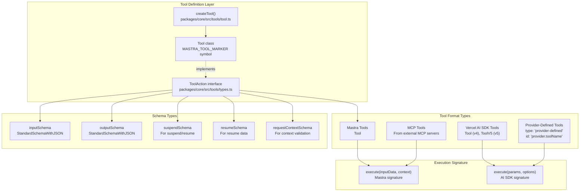
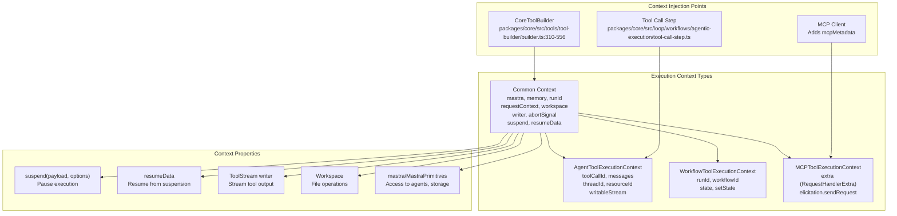
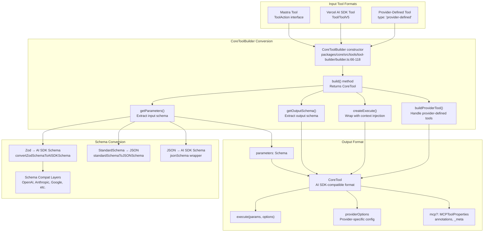
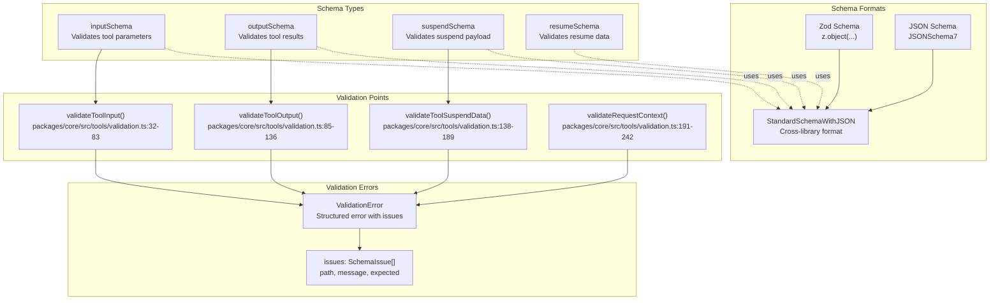
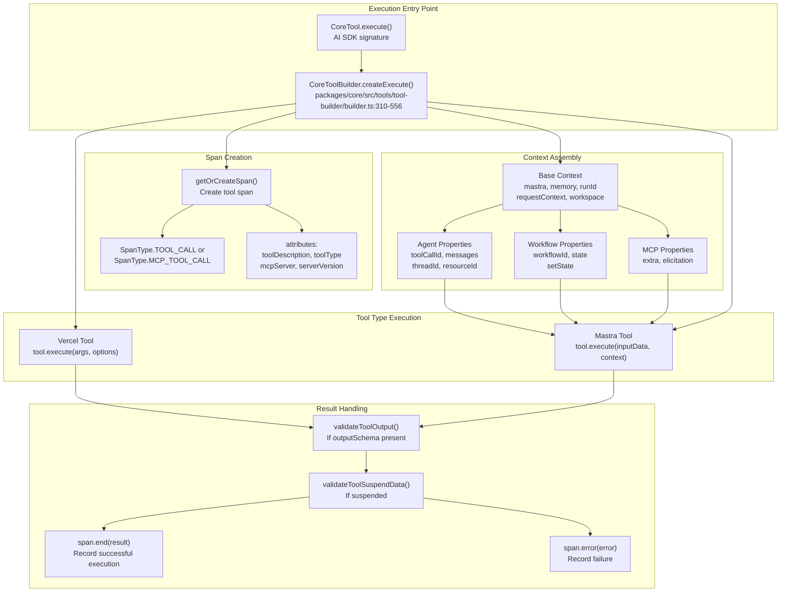
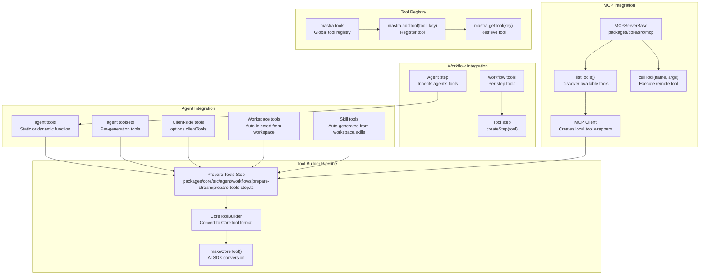
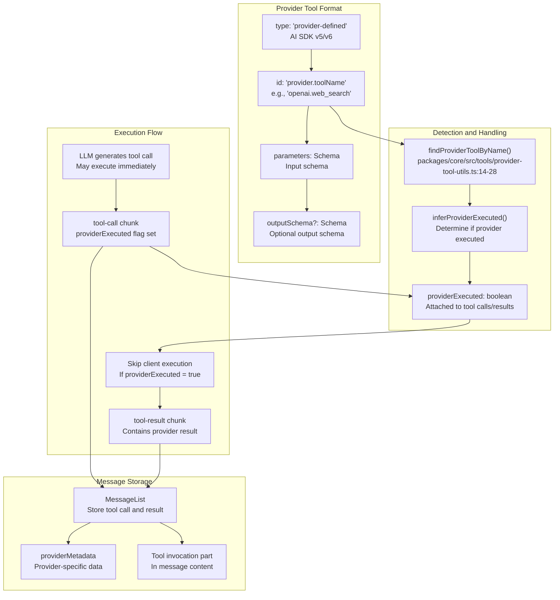
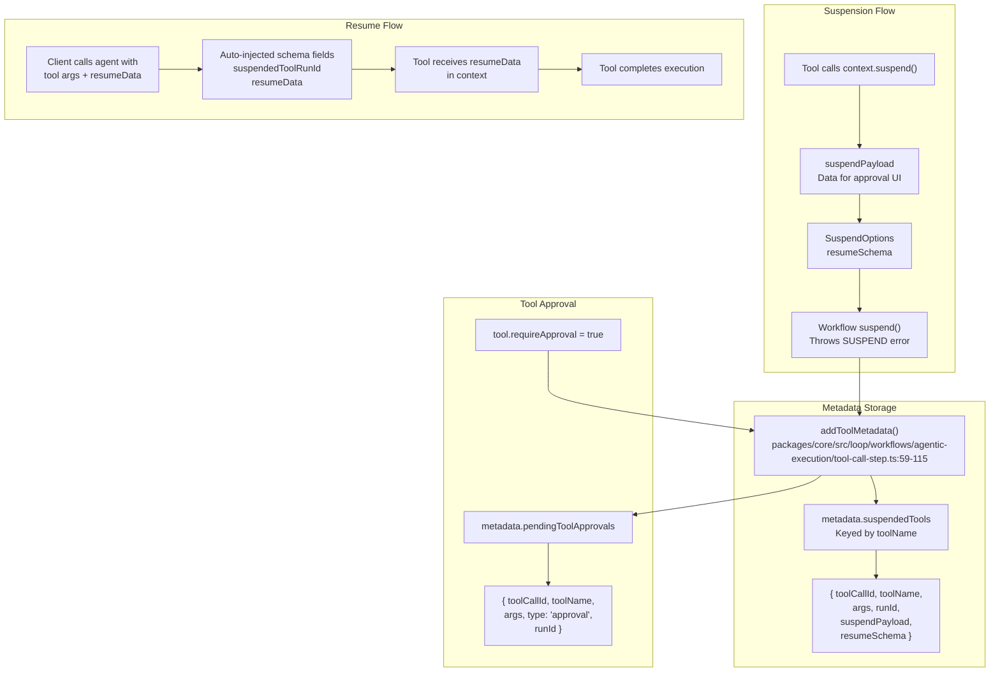
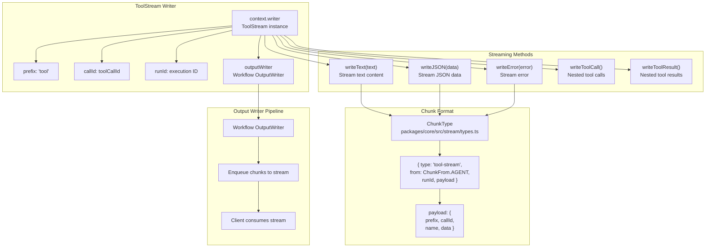
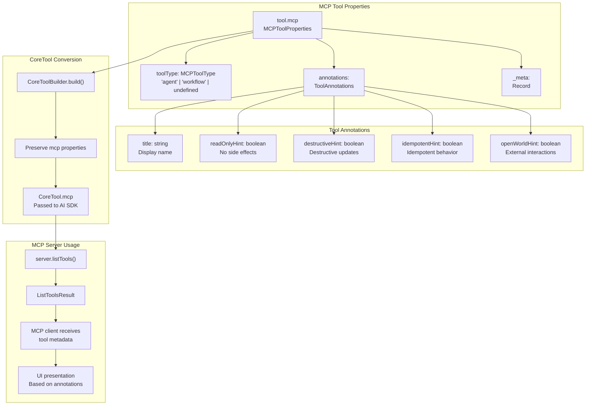

# Tool System

<details>
<summary>Relevant source files</summary>

The following files were used as context for generating this wiki page:

- [examples/bird-checker-with-express/src/index.ts](examples/bird-checker-with-express/src/index.ts)
- [examples/bird-checker-with-nextjs-and-eval/src/lib/mastra/actions.ts](examples/bird-checker-with-nextjs-and-eval/src/lib/mastra/actions.ts)
- [packages/core/src/action/index.ts](packages/core/src/action/index.ts)
- [packages/core/src/agent/**tests**/utils.test.ts](packages/core/src/agent/__tests__/utils.test.ts)
- [packages/core/src/agent/agent-legacy.ts](packages/core/src/agent/agent-legacy.ts)
- [packages/core/src/agent/agent.test.ts](packages/core/src/agent/agent.test.ts)
- [packages/core/src/agent/agent.ts](packages/core/src/agent/agent.ts)
- [packages/core/src/agent/agent.types.ts](packages/core/src/agent/agent.types.ts)
- [packages/core/src/agent/index.ts](packages/core/src/agent/index.ts)
- [packages/core/src/agent/trip-wire.ts](packages/core/src/agent/trip-wire.ts)
- [packages/core/src/agent/types.ts](packages/core/src/agent/types.ts)
- [packages/core/src/agent/utils.ts](packages/core/src/agent/utils.ts)
- [packages/core/src/agent/workflows/prepare-stream/index.ts](packages/core/src/agent/workflows/prepare-stream/index.ts)
- [packages/core/src/agent/workflows/prepare-stream/map-results-step.ts](packages/core/src/agent/workflows/prepare-stream/map-results-step.ts)
- [packages/core/src/agent/workflows/prepare-stream/prepare-memory-step.ts](packages/core/src/agent/workflows/prepare-stream/prepare-memory-step.ts)
- [packages/core/src/agent/workflows/prepare-stream/prepare-tools-step.ts](packages/core/src/agent/workflows/prepare-stream/prepare-tools-step.ts)
- [packages/core/src/agent/workflows/prepare-stream/stream-step.ts](packages/core/src/agent/workflows/prepare-stream/stream-step.ts)
- [packages/core/src/llm/index.ts](packages/core/src/llm/index.ts)
- [packages/core/src/llm/model/model.loop.ts](packages/core/src/llm/model/model.loop.ts)
- [packages/core/src/llm/model/model.loop.types.ts](packages/core/src/llm/model/model.loop.types.ts)
- [packages/core/src/llm/model/model.test.ts](packages/core/src/llm/model/model.test.ts)
- [packages/core/src/llm/model/model.ts](packages/core/src/llm/model/model.ts)
- [packages/core/src/loop/**snapshots**/loop.test.ts.snap](packages/core/src/loop/__snapshots__/loop.test.ts.snap)
- [packages/core/src/loop/index.ts](packages/core/src/loop/index.ts)
- [packages/core/src/loop/loop.test.ts](packages/core/src/loop/loop.test.ts)
- [packages/core/src/loop/loop.ts](packages/core/src/loop/loop.ts)
- [packages/core/src/loop/test-utils/fullStream.ts](packages/core/src/loop/test-utils/fullStream.ts)
- [packages/core/src/loop/test-utils/generateText.ts](packages/core/src/loop/test-utils/generateText.ts)
- [packages/core/src/loop/test-utils/options.ts](packages/core/src/loop/test-utils/options.ts)
- [packages/core/src/loop/test-utils/resultObject.ts](packages/core/src/loop/test-utils/resultObject.ts)
- [packages/core/src/loop/test-utils/streamObject.ts](packages/core/src/loop/test-utils/streamObject.ts)
- [packages/core/src/loop/test-utils/textStream.ts](packages/core/src/loop/test-utils/textStream.ts)
- [packages/core/src/loop/test-utils/tools.ts](packages/core/src/loop/test-utils/tools.ts)
- [packages/core/src/loop/test-utils/utils.ts](packages/core/src/loop/test-utils/utils.ts)
- [packages/core/src/loop/types.ts](packages/core/src/loop/types.ts)
- [packages/core/src/loop/workflows/agentic-execution/llm-execution-step.test.ts](packages/core/src/loop/workflows/agentic-execution/llm-execution-step.test.ts)
- [packages/core/src/loop/workflows/agentic-execution/llm-execution-step.ts](packages/core/src/loop/workflows/agentic-execution/llm-execution-step.ts)
- [packages/core/src/loop/workflows/agentic-execution/tool-call-step.test.ts](packages/core/src/loop/workflows/agentic-execution/tool-call-step.test.ts)
- [packages/core/src/loop/workflows/agentic-execution/tool-call-step.ts](packages/core/src/loop/workflows/agentic-execution/tool-call-step.ts)
- [packages/core/src/mastra/index.ts](packages/core/src/mastra/index.ts)
- [packages/core/src/observability/types/tracing.ts](packages/core/src/observability/types/tracing.ts)
- [packages/core/src/stream/aisdk/v5/compat/prepare-tools.test.ts](packages/core/src/stream/aisdk/v5/compat/prepare-tools.test.ts)
- [packages/core/src/stream/aisdk/v5/compat/prepare-tools.ts](packages/core/src/stream/aisdk/v5/compat/prepare-tools.ts)
- [packages/core/src/stream/aisdk/v5/execute.ts](packages/core/src/stream/aisdk/v5/execute.ts)
- [packages/core/src/stream/aisdk/v5/output-helpers.ts](packages/core/src/stream/aisdk/v5/output-helpers.ts)
- [packages/core/src/stream/base/output.ts](packages/core/src/stream/base/output.ts)
- [packages/core/src/stream/types.ts](packages/core/src/stream/types.ts)
- [packages/core/src/tools/index.ts](packages/core/src/tools/index.ts)
- [packages/core/src/tools/provider-tool-utils.test.ts](packages/core/src/tools/provider-tool-utils.test.ts)
- [packages/core/src/tools/provider-tool-utils.ts](packages/core/src/tools/provider-tool-utils.ts)
- [packages/core/src/tools/tool-builder/builder.test.ts](packages/core/src/tools/tool-builder/builder.test.ts)
- [packages/core/src/tools/tool-builder/builder.ts](packages/core/src/tools/tool-builder/builder.ts)
- [packages/core/src/tools/tool.ts](packages/core/src/tools/tool.ts)
- [packages/core/src/tools/toolchecks.test.ts](packages/core/src/tools/toolchecks.test.ts)
- [packages/core/src/tools/toolchecks.ts](packages/core/src/tools/toolchecks.ts)
- [packages/core/src/tools/types.ts](packages/core/src/tools/types.ts)

</details>

The Tool System provides a unified interface for defining, converting, and executing functions that agents and workflows can call. It handles schema validation, context injection, observability tracing, and format conversion between Mastra tools, Vercel AI SDK tools, and provider-defined tools. For model provider integration, see [Model Provider System](#5). For agent execution that calls tools, see [Agent System](#3).

## Tool Definition and Types

Tools in Mastra are defined using the `Tool` class or the `createTool` helper function. A tool consists of an identifier, description, input/output schemas, and an execute function.



**Tool Format Types**

| Format                    | Signature                     | Use Case                                    |
| ------------------------- | ----------------------------- | ------------------------------------------- |
| **Mastra Tool**           | `execute(inputData, context)` | User-defined tools with full Mastra context |
| **Vercel AI SDK Tool**    | `execute(params, options)`    | AI SDK v4/v5 compatibility                  |
| **Provider-Defined Tool** | `execute(params, options)`    | Native LLM tools like `openai.web_search`   |
| **MCP Tool**              | `execute(inputData, context)` | Tools from Model Context Protocol servers   |

Sources: [packages/core/src/tools/tool.ts:1-450](), [packages/core/src/tools/types.ts:1-350]()

## Tool Execution Context

Tools receive different execution contexts based on their invocation source. The `ToolExecutionContext` type is a discriminated union that provides appropriate properties for each execution environment.



**Agent Context Properties**

- `toolCallId`: Unique identifier for this tool invocation
- `messages`: Full conversation history for context-aware tools
- `threadId`/`resourceId`: Memory identifiers for stateful operations
- `writableStream`: Original AI SDK WritableStream for streaming responses

**Workflow Context Properties**

- `runId`: Workflow execution identifier
- `workflowId`: Workflow definition identifier
- `state`: Current workflow state (read)
- `setState`: Function to update workflow state

**MCP Context Properties**

- `extra`: MCP protocol context from the server
- `elicitation.sendRequest`: Handler for interactive user input during execution

Sources: [packages/core/src/tools/types.ts:32-105](), [packages/core/src/tools/tool-builder/builder.ts:400-456]()

## CoreToolBuilder: Format Conversion

The `CoreToolBuilder` class converts between different tool formats and creates the AI SDK-compatible `CoreTool` format. It acts as an adapter layer between Mastra's tool system and the AI SDK's expectations.



**Conversion Flow**

1. **Construction**: `CoreToolBuilder` receives original tool and options
2. **Schema Extraction**: `getParameters()` and `getOutputSchema()` extract schemas
3. **Schema Conversion**: Convert Zod/StandardSchema/JSONSchema to AI SDK Schema format
4. **Execution Wrapping**: `createExecute()` wraps tool execution with:
   - Observability spans (TOOL_CALL or MCP_TOOL_CALL)
   - Input/output validation
   - Context injection (mastra, memory, workspace, etc.)
   - Error handling and logging
5. **Output**: Returns `CoreTool` with AI SDK-compatible signature

Sources: [packages/core/src/tools/tool-builder/builder.ts:61-556]()

## Schema Validation System

Tools support four types of schemas for comprehensive validation and type safety. All schemas use `StandardSchemaWithJSON` for cross-library compatibility.



**Validation Lifecycle**

| Stage                | Function                    | Purpose                                      |
| -------------------- | --------------------------- | -------------------------------------------- |
| **Before Execution** | `validateToolInput()`       | Validate tool parameters before execute()    |
| **After Execution**  | `validateToolOutput()`      | Validate tool result before returning to LLM |
| **On Suspend**       | `validateToolSuspendData()` | Validate suspension payload                  |
| **Context Check**    | `validateRequestContext()`  | Validate requestContext against schema       |

**Auto-Resume Schema Injection**

For tools that call agents or workflows, `CoreToolBuilder` automatically extends the input schema with suspend/resume fields:

```typescript
// Original schema
z.object({ query: z.string() })

// Extended schema for agent/workflow tools
z.object({
  query: z.string(),
  suspendedToolRunId: z.string().nullable().optional(),
  resumeData: z.any().optional(),
})
```

This allows suspended tools to be automatically resumed when the LLM calls them again with resume data.

Sources: [packages/core/src/tools/validation.ts:1-242](), [packages/core/src/tools/tool-builder/builder.ts:78-117]()

## Tool Execution and Observability

Tool execution is wrapped with observability spans, context injection, and error handling. The execution flow varies based on tool format (Mastra vs Vercel AI SDK).



**Span Types and Attributes**

**Regular Tool Call:**

- `type`: `SpanType.TOOL_CALL`
- `name`: `"tool: '<toolName>'"`
- `attributes`: `{ toolDescription, toolType }`

**MCP Tool Call:**

- `type`: `SpanType.MCP_TOOL_CALL`
- `name`: `"mcp_tool: '<toolName>' on '<serverName>'"`
- `attributes`: `{ mcpServer, serverVersion, toolDescription }`

**Context Injection Logic**

The builder determines execution context based on presence of properties:

```typescript
// Agent execution: has toolCallId and messages
const isAgentExecution =
  (options.toolCallId && options.messages) ||
  (agentName && threadId && !workflowId)

// Workflow execution: has workflow properties
const isWorkflowExecution = !isAgentExecution && (workflow || workflowId)

// MCP execution: has MCP context
const isMCPExecution = options.mcp !== undefined
```

Sources: [packages/core/src/tools/tool-builder/builder.ts:333-556](), [packages/core/src/observability/types/tracing.ts:1-500]()

## Tool Integration Points

Tools integrate with multiple Mastra subsystems, each providing different capabilities and constraints.



**Tool Source Hierarchy**

Tools are collected from multiple sources and merged in priority order:

1. **Client tools** (highest priority): Tools passed in `generate()`/`stream()` options
2. **Toolsets**: Integration toolsets (per-generation)
3. **Workspace tools**: Auto-generated from workspace configuration
4. **Skill tools**: Auto-generated from `workspace.skills`
5. **Agent tools**: Static tools from agent constructor
6. **Workflow tools**: Generated from `agent.workflows`

**MCP Tool Discovery**

MCP servers expose tools via the Model Context Protocol:

1. `MCPServerBase.listTools()` returns available tools with schemas
2. MCP client creates local `Tool` instances with `execute()` wrappers
3. Wrappers call `server.callTool(name, args)` over MCP transport
4. `mcpMetadata` property identifies tools as MCP-originated for tracing

Sources: [packages/core/src/agent/workflows/prepare-stream/prepare-tools-step.ts:1-324](), [packages/core/src/tools/tool-builder/builder.ts:61-556](), [packages/core/src/mcp/types.ts:1-200]()

## Provider-Defined Tools

Provider-defined tools are native LLM tools executed server-side by the model provider. These tools have special handling for execution and result processing.



**Provider Tool Identification**

Provider tools are identified by their `id` format:

- **Format**: `"provider.toolName"` (contains a dot separator)
- **Examples**:
  - `"openai.web_search"`: OpenAI web search
  - `"anthropic.computer_use"`: Anthropic computer use
  - `"google.code_execution"`: Google code execution

**Execution Determination**

The `inferProviderExecuted()` function determines if a tool was executed by the provider:

1. Check explicit `providerExecuted` flag on chunk
2. If undefined, check if tool definition has `execute` function
3. If tool has no `execute`, assume provider-executed
4. Otherwise, assume client-executed

**Tool Call Step Handling**

The tool call step skips execution for provider-executed tools:

```typescript
// In tool-call-step.ts
if (providerExecuted) {
  // Provider already executed, just record the result
  return { result: alreadyExecutedResult }
}
// Otherwise, execute client-side
const result = await tool.execute(args, context)
```

Sources: [packages/core/src/tools/provider-tool-utils.ts:1-50](), [packages/core/src/loop/workflows/agentic-execution/llm-execution-step.ts:475-496](), [packages/core/src/loop/workflows/agentic-execution/tool-call-step.ts:47-175]()

## Suspend and Resume Mechanism

Tools can suspend execution to request human approval or additional input, then resume later with the provided data. This enables human-in-the-loop workflows.



**Suspension Types**

| Type                | Trigger                 | Metadata Key           | Use Case                                           |
| ------------------- | ----------------------- | ---------------------- | -------------------------------------------------- |
| **Tool Suspension** | Tool calls `suspend()`  | `suspendedTools`       | Tool needs additional input mid-execution          |
| **Tool Approval**   | `requireApproval: true` | `pendingToolApprovals` | Tool needs explicit user approval before execution |

**Resume Schema Auto-Injection**

For tools that may suspend (agents, workflows), `CoreToolBuilder` extends the input schema:

```typescript
// packages/core/src/tools/tool-builder/builder.ts:78-117
if (tool.id?.startsWith('agent-') || tool.id?.startsWith('workflow-')) {
  tool.inputSchema = baseSchema.extend({
    suspendedToolRunId: z.string().nullable().optional(),
    resumeData: z.any().optional(),
  })
}
```

**Resume Flow**

1. Tool suspends with payload: `await context.suspend({ needsConfirmation: true })`
2. Payload stored in `metadata.suspendedTools[toolName]`
3. Client displays suspension UI to user
4. User provides resume data
5. Client calls agent with: `{ ...toolArgs, suspendedToolRunId, resumeData }`
6. Tool receives `context.resumeData` and completes execution

Sources: [packages/core/src/loop/workflows/agentic-execution/tool-call-step.ts:59-200](), [packages/core/src/tools/tool-builder/builder.ts:78-117](), [packages/core/src/workflows/types.ts:150-180]()

## Tool Streaming and Output

Tools can stream partial results during execution using the `ToolStream` writer. This enables real-time feedback for long-running operations.



**ToolStream API**

**Basic Streaming:**

```typescript
await context.writer.writeText('Processing...')
await context.writer.writeJSON({ progress: 50 })
```

**Nested Tool Calls:**

```typescript
await context.writer.writeToolCall({
  toolName: 'subTool',
  toolCallId: 'call-123',
  args: { query: 'test' },
})

await context.writer.writeToolResult({
  toolName: 'subTool',
  toolCallId: 'call-123',
  result: { data: 'response' },
})
```

**Chunk Format**

All tool stream chunks have this structure:

```typescript
{
  type: 'tool-stream',
  from: ChunkFrom.AGENT,
  runId: string,
  payload: {
    prefix: 'tool',
    callId: string,    // Tool call ID
    name: string,      // Tool name
    data: unknown      // Stream data
  }
}
```

Sources: [packages/core/src/tools/stream.ts:1-150](), [packages/core/src/stream/types.ts:270-320]()

## MCP Tool Properties and Annotations

Tools can include MCP-specific properties for Model Context Protocol integration. These properties control how tools are presented in MCP clients and provide behavior hints.



**Annotation Examples**

**Read-only Tool (e.g., search):**

```typescript
mcp: {
  annotations: {
    title: 'Search Database',
    readOnlyHint: true,
    destructiveHint: false,
    idempotentHint: true,
    openWorldHint: false
  }
}
```

**Destructive Tool (e.g., delete):**

```typescript
mcp: {
  annotations: {
    title: 'Delete File',
    readOnlyHint: false,
    destructiveHint: true,
    idempotentHint: false,
    openWorldHint: false
  }
}
```

**External API Tool (e.g., web search):**

```typescript
mcp: {
  annotations: {
    title: 'Web Search',
    readOnlyHint: true,
    destructiveHint: false,
    idempotentHint: false,
    openWorldHint: true  // Interacts with external world
  }
}
```

**Tool Type Classification**

The `toolType` field categorizes tools in the MCP playground:

- `'agent'`: Tool invokes a Mastra agent
- `'workflow'`: Tool invokes a Mastra workflow
- `undefined`: Regular function tool

Sources: [packages/core/src/tools/types.ts:110-186](), [packages/core/src/tools/tool.ts:145-167]()
