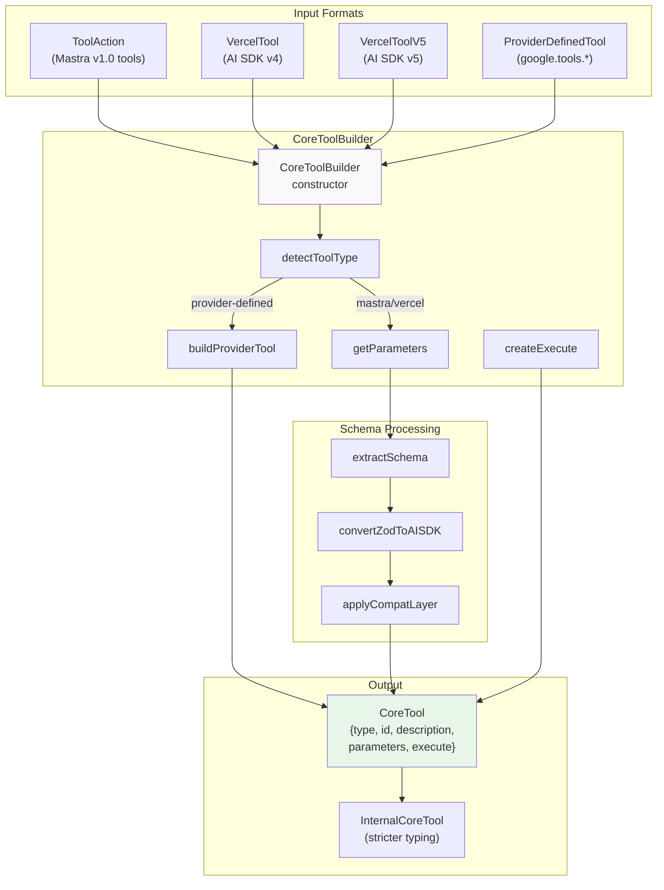
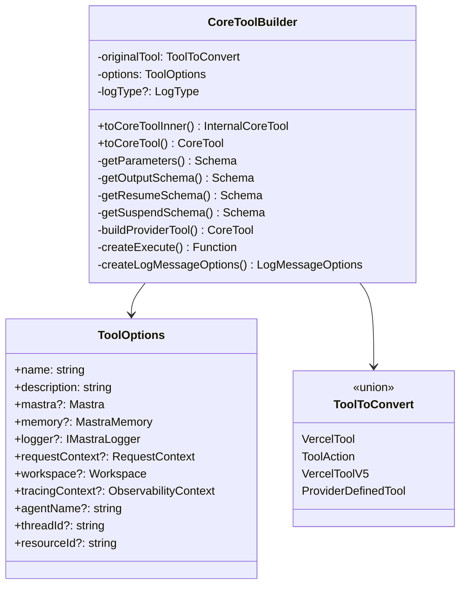
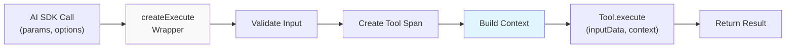
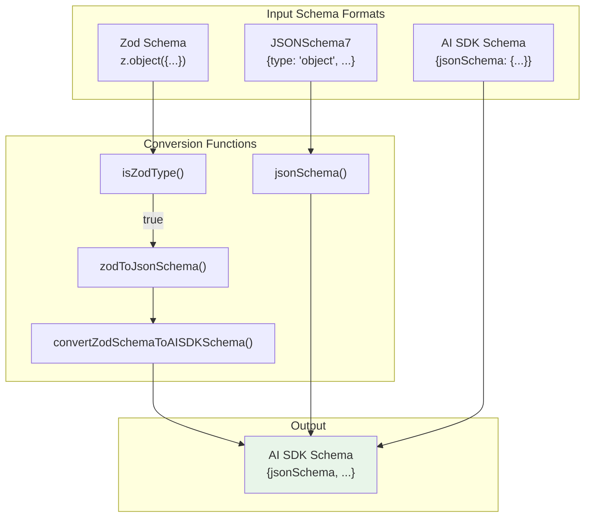
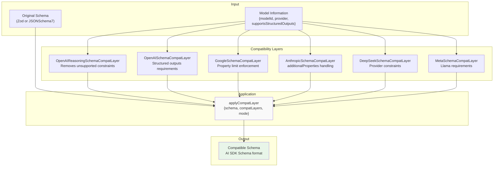
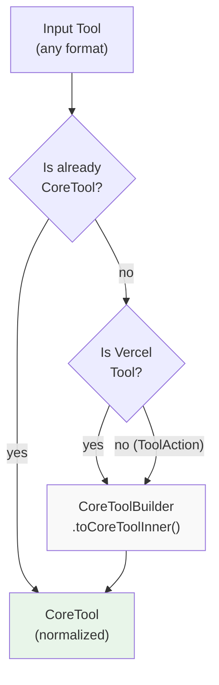
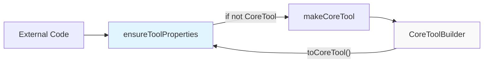
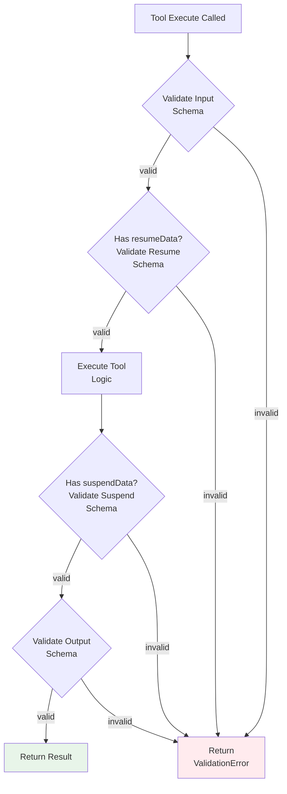

# Tool Builder and Schema Conversion

<details>
<summary>Relevant source files</summary>

The following files were used as context for generating this wiki page:

- [examples/bird-checker-with-express/src/index.ts](examples/bird-checker-with-express/src/index.ts)
- [examples/bird-checker-with-nextjs-and-eval/src/lib/mastra/actions.ts](examples/bird-checker-with-nextjs-and-eval/src/lib/mastra/actions.ts)
- [packages/core/src/action/index.ts](packages/core/src/action/index.ts)
- [packages/core/src/agent/**tests**/utils.test.ts](packages/core/src/agent/__tests__/utils.test.ts)
- [packages/core/src/agent/agent-legacy.ts](packages/core/src/agent/agent-legacy.ts)
- [packages/core/src/agent/agent.test.ts](packages/core/src/agent/agent.test.ts)
- [packages/core/src/agent/agent.ts](packages/core/src/agent/agent.ts)
- [packages/core/src/agent/agent.types.ts](packages/core/src/agent/agent.types.ts)
- [packages/core/src/agent/index.ts](packages/core/src/agent/index.ts)
- [packages/core/src/agent/trip-wire.ts](packages/core/src/agent/trip-wire.ts)
- [packages/core/src/agent/types.ts](packages/core/src/agent/types.ts)
- [packages/core/src/agent/utils.ts](packages/core/src/agent/utils.ts)
- [packages/core/src/agent/workflows/prepare-stream/index.ts](packages/core/src/agent/workflows/prepare-stream/index.ts)
- [packages/core/src/agent/workflows/prepare-stream/map-results-step.ts](packages/core/src/agent/workflows/prepare-stream/map-results-step.ts)
- [packages/core/src/agent/workflows/prepare-stream/prepare-memory-step.ts](packages/core/src/agent/workflows/prepare-stream/prepare-memory-step.ts)
- [packages/core/src/agent/workflows/prepare-stream/prepare-tools-step.ts](packages/core/src/agent/workflows/prepare-stream/prepare-tools-step.ts)
- [packages/core/src/agent/workflows/prepare-stream/stream-step.ts](packages/core/src/agent/workflows/prepare-stream/stream-step.ts)
- [packages/core/src/llm/index.ts](packages/core/src/llm/index.ts)
- [packages/core/src/llm/model/model.loop.ts](packages/core/src/llm/model/model.loop.ts)
- [packages/core/src/llm/model/model.loop.types.ts](packages/core/src/llm/model/model.loop.types.ts)
- [packages/core/src/llm/model/model.test.ts](packages/core/src/llm/model/model.test.ts)
- [packages/core/src/llm/model/model.ts](packages/core/src/llm/model/model.ts)
- [packages/core/src/loop/**snapshots**/loop.test.ts.snap](packages/core/src/loop/__snapshots__/loop.test.ts.snap)
- [packages/core/src/loop/index.ts](packages/core/src/loop/index.ts)
- [packages/core/src/loop/loop.test.ts](packages/core/src/loop/loop.test.ts)
- [packages/core/src/loop/loop.ts](packages/core/src/loop/loop.ts)
- [packages/core/src/loop/test-utils/fullStream.ts](packages/core/src/loop/test-utils/fullStream.ts)
- [packages/core/src/loop/test-utils/generateText.ts](packages/core/src/loop/test-utils/generateText.ts)
- [packages/core/src/loop/test-utils/options.ts](packages/core/src/loop/test-utils/options.ts)
- [packages/core/src/loop/test-utils/resultObject.ts](packages/core/src/loop/test-utils/resultObject.ts)
- [packages/core/src/loop/test-utils/streamObject.ts](packages/core/src/loop/test-utils/streamObject.ts)
- [packages/core/src/loop/test-utils/textStream.ts](packages/core/src/loop/test-utils/textStream.ts)
- [packages/core/src/loop/test-utils/tools.ts](packages/core/src/loop/test-utils/tools.ts)
- [packages/core/src/loop/test-utils/utils.ts](packages/core/src/loop/test-utils/utils.ts)
- [packages/core/src/loop/types.ts](packages/core/src/loop/types.ts)
- [packages/core/src/loop/workflows/agentic-execution/llm-execution-step.test.ts](packages/core/src/loop/workflows/agentic-execution/llm-execution-step.test.ts)
- [packages/core/src/loop/workflows/agentic-execution/llm-execution-step.ts](packages/core/src/loop/workflows/agentic-execution/llm-execution-step.ts)
- [packages/core/src/loop/workflows/agentic-execution/tool-call-step.test.ts](packages/core/src/loop/workflows/agentic-execution/tool-call-step.test.ts)
- [packages/core/src/loop/workflows/agentic-execution/tool-call-step.ts](packages/core/src/loop/workflows/agentic-execution/tool-call-step.ts)
- [packages/core/src/mastra/index.ts](packages/core/src/mastra/index.ts)
- [packages/core/src/observability/types/tracing.ts](packages/core/src/observability/types/tracing.ts)
- [packages/core/src/stream/aisdk/v5/compat/prepare-tools.test.ts](packages/core/src/stream/aisdk/v5/compat/prepare-tools.test.ts)
- [packages/core/src/stream/aisdk/v5/compat/prepare-tools.ts](packages/core/src/stream/aisdk/v5/compat/prepare-tools.ts)
- [packages/core/src/stream/aisdk/v5/execute.ts](packages/core/src/stream/aisdk/v5/execute.ts)
- [packages/core/src/stream/aisdk/v5/output-helpers.ts](packages/core/src/stream/aisdk/v5/output-helpers.ts)
- [packages/core/src/stream/base/output.ts](packages/core/src/stream/base/output.ts)
- [packages/core/src/stream/types.ts](packages/core/src/stream/types.ts)
- [packages/core/src/tools/index.ts](packages/core/src/tools/index.ts)
- [packages/core/src/tools/provider-tool-utils.test.ts](packages/core/src/tools/provider-tool-utils.test.ts)
- [packages/core/src/tools/provider-tool-utils.ts](packages/core/src/tools/provider-tool-utils.ts)
- [packages/core/src/tools/tool-builder/builder.test.ts](packages/core/src/tools/tool-builder/builder.test.ts)
- [packages/core/src/tools/tool-builder/builder.ts](packages/core/src/tools/tool-builder/builder.ts)
- [packages/core/src/tools/tool.ts](packages/core/src/tools/tool.ts)
- [packages/core/src/tools/toolchecks.test.ts](packages/core/src/tools/toolchecks.test.ts)
- [packages/core/src/tools/toolchecks.ts](packages/core/src/tools/toolchecks.ts)
- [packages/core/src/tools/types.ts](packages/core/src/tools/types.ts)

</details>

This document covers the tool builder system that normalizes tools from multiple formats into a unified AI SDK-compatible format. The `CoreToolBuilder` class and related utilities handle schema conversion, provider compatibility, and execution context transformation.

For information about tool definition and execution contexts, see [Tool Definition and Execution Context](#6.1). For general tool system overview, see [Tool System](#6).

## Purpose and Scope

The tool builder system serves as an adapter layer between Mastra's tool definitions and the AI SDK's expected tool format. It handles:

- Converting between tool formats (Mastra `ToolAction`, AI SDK `VercelTool`, `ProviderDefinedTool`)
- Transforming schemas (Zod, JSONSchema7 → AI SDK `Schema`)
- Applying provider-specific compatibility layers
- Bridging execution signatures from AI SDK format to Mastra format
- Normalizing tool properties for consistent behavior

Sources: [packages/core/src/tools/tool-builder/builder.ts:1-580]()

## Tool Conversion Pipeline



**Tool Conversion Flow**

The pipeline accepts multiple input formats and produces a normalized `CoreTool` compatible with the AI SDK. The `CoreToolBuilder` class handles format detection, schema extraction, compatibility transformations, and execution wrapper creation.

Sources: [packages/core/src/tools/tool-builder/builder.ts:44-224](), [packages/core/src/tools/types.ts:189-226]()

## CoreToolBuilder Architecture

### Class Structure

The `CoreToolBuilder` class is the central adapter for tool conversion:



Sources: [packages/core/src/tools/tool-builder/builder.ts:44-82]()

### Key Methods

#### getParameters()

Extracts and normalizes input schemas from different tool formats:

```typescript
// Handles both 'parameters' (v4) and 'inputSchema' (v5)
// Resolves function-based schemas
```

This method handles format variations:

- AI SDK v4: `tool.parameters`
- AI SDK v5: `tool.inputSchema`
- Function-based schemas: Invokes the function to get the schema
- Defaults to `z.object({})` if no schema provided

Sources: [packages/core/src/tools/tool-builder/builder.ts:84-111]()

#### buildProviderTool()

Handles provider-defined tools (e.g., `google.tools.googleSearch()`):

The method:

1. Identifies tools with `type: 'provider-defined'` or `type: 'provider'`
2. Validates the ID format (`provider.toolName`)
3. Extracts parameters from either `parameters` or `inputSchema`
4. Converts Zod schemas to AI SDK Schema format
5. Preserves provider-specific properties (`args`, `toModelOutput`)

Sources: [packages/core/src/tools/tool-builder/builder.ts:157-224]()

#### createExecute()

Creates the execution wrapper that bridges AI SDK format to Mastra format:



**Execution Wrapper Flow**

The wrapper performs signature transformation, validation, observability span creation, and context assembly before invoking the tool's execute method.

Sources: [packages/core/src/tools/tool-builder/builder.ts:245-459]()

### Context Transformation

The execution wrapper builds different context structures based on the execution environment:

| Environment  | Context Properties                                                                         | Identification                                                  |
| ------------ | ------------------------------------------------------------------------------------------ | --------------------------------------------------------------- |
| **Agent**    | `agent: { toolCallId, messages, suspend, resumeData, threadId, resourceId, outputWriter }` | Has `toolCallId` and `messages`, or `agentName` with `threadId` |
| **Workflow** | `workflow: { runId, workflowId, state, setState, suspend, resumeData }`                    | Has `workflow` or `workflowId` properties                       |
| **MCP**      | `mcp: { extra, elicitation }`                                                              | Has `execOptions.mcp`                                           |
| **Direct**   | Base context only                                                                          | None of the above                                               |

All contexts include base properties:

- `mastra`: Wrapped Mastra instance with tracing context
- `requestContext`: Request context (execution-time or build-time)
- `workspace`: Workspace for file operations (execution-time or build-time)
- `writer`: ToolStream for streaming output
- `abortSignal`: For cancellation support
- Observability context properties

Sources: [packages/core/src/tools/tool-builder/builder.ts:306-416]()

## Schema Conversion Process

### Schema Type Support

The system handles multiple schema formats:



**Schema Conversion Pipeline**

Different schema formats are normalized to AI SDK's `Schema` type through format detection and appropriate conversion functions.

Sources: [packages/core/src/tools/tool-builder/builder.ts:182-204]()

### Schema Processing Example

For provider-defined tools:

```typescript
// 1. Extract schema (may be Zod or AI SDK Schema)
let parameters = tool.parameters || tool.inputSchema

// 2. Handle function-based schemas
if (typeof parameters === 'function') {
  parameters = parameters()
}

// 3. Convert to AI SDK Schema if needed
if (parameters && !('jsonSchema' in parameters)) {
  // It's a Zod schema, convert it
  processedParameters = convertZodSchemaToAISDKSchema(parameters)
} else {
  // Already AI SDK Schema format
  processedParameters = parameters
}
```

The same process applies to `outputSchema` fields.

Sources: [packages/core/src/tools/tool-builder/builder.ts:166-204]()

## Provider Compatibility Layers

### Compatibility System Architecture

Schema compatibility layers adapt tool schemas for provider-specific requirements:



**Compatibility Layer Pipeline**

Multiple provider-specific compatibility layers are applied to schemas to ensure they meet each provider's requirements and constraints.

Sources: [packages/core/src/tools/tool-builder/builder.ts:1-11](), [packages/core/src/agent/agent.ts:1-11]()

### Provider-Specific Requirements

Each compatibility layer handles different provider constraints:

| Provider               | Compatibility Layer                | Transformations                                                                       |
| ---------------------- | ---------------------------------- | ------------------------------------------------------------------------------------- |
| **OpenAI**             | `OpenAISchemaCompatLayer`          | Enforces structured output format requirements, handles `additionalProperties: false` |
| **OpenAI (Reasoning)** | `OpenAIReasoningSchemaCompatLayer` | Removes constraints unsupported by reasoning models (o1, o3)                          |
| **Google**             | `GoogleSchemaCompatLayer`          | Enforces property count limits, validates schema depth                                |
| **Anthropic**          | `AnthropicSchemaCompatLayer`       | Manages `additionalProperties` handling, ensures compatible schema structure          |
| **DeepSeek**           | `DeepSeekSchemaCompatLayer`        | Applies DeepSeek-specific constraints and requirements                                |
| **Meta (Llama)**       | `MetaSchemaCompatLayer`            | Ensures compatibility with Llama model requirements                                   |

Sources: Referenced from imports in [packages/core/src/tools/tool-builder/builder.ts:1-11]()

### Compatibility Layer Usage

The `_applySchemaCompat` method applies compatibility layers during tool conversion:

```typescript
private _applySchemaCompat(schema: ZodSchema | JSONSchema7): Schema {
  const model = this.#model;
  const schemaCompatLayers = [];

  if (model) {
    const modelInfo = {
      modelId: model.modelId,
      supportsStructuredOutputs: model.supportsStructuredOutputs ?? false,
      provider: model.provider,
    };

    // Add all compatibility layers
    schemaCompatLayers.push(
      new OpenAIReasoningSchemaCompatLayer(modelInfo),
      new OpenAISchemaCompatLayer(modelInfo),
      new GoogleSchemaCompatLayer(modelInfo),
      new AnthropicSchemaCompatLayer(modelInfo),
      new DeepSeekSchemaCompatLayer(modelInfo),
      new MetaSchemaCompatLayer(modelInfo),
    );
  }

  return applyCompatLayer({
    schema: schema,
    compatLayers: schemaCompatLayers,
    mode: 'aiSdkSchema',
  });
}
```

This pattern is used in both the LLM model classes and the tool builder to ensure consistent schema handling across the system.

Sources: [packages/core/src/llm/model/model.ts:91-117]()

## Tool Normalization with ensureToolProperties

### The ensureToolProperties Function

The `ensureToolProperties` utility normalizes tools from any supported format into the `CoreTool` structure:



**ensureToolProperties Flow**

The function performs format detection and applies appropriate normalization based on the tool type.

Sources: [packages/core/src/utils.ts:367-382]()

### Usage in Tool Registration

Tools are normalized during registration with agents and workflows:

```typescript
// In agent tool preparation
const convertedTools: InternalCoreTool[] = []
for (const [toolName, tool] of Object.entries(tools)) {
  const coreTool = ensureToolProperties(tool, {
    name: toolName,
    description: tool.description,
    logger: this.logger,
    mastra: this.#mastra,
    // ... other options
  })
  convertedTools.push(coreTool)
}
```

This ensures all tools, regardless of their original format, have a consistent structure when passed to the AI SDK.

Sources: [packages/core/src/agent/workflows/prepare-stream/prepare-tools-step.ts:1-150]()

## makeCoreTool Utility

### Function Signature

The `makeCoreTool` function provides a lower-level tool conversion interface:

```typescript
export function makeCoreTool(
  tool: ToolToConvert,
  options: ToolOptions,
  logType?: 'tool' | 'toolset' | 'client-tool'
): CoreTool
```

It wraps `CoreToolBuilder` for convenience:

```typescript
return new CoreToolBuilder({
  originalTool: tool,
  options,
  logType,
}).toCoreTool()
```

Sources: [packages/core/src/utils.ts:349-356]()

### Relationship to ensureToolProperties



**Utility Function Relationship**

`ensureToolProperties` is the high-level function that uses `makeCoreTool`, which in turn uses `CoreToolBuilder` for the actual conversion.

Sources: [packages/core/src/utils.ts:349-382]()

## Tool Validation Integration

### Validation During Execution

The `createExecute` wrapper integrates validation at multiple points:



**Validation Points in Tool Execution**

Input, resume data, suspend data, and output are all validated against their respective schemas during tool execution.

Sources: [packages/core/src/tools/tool-builder/builder.ts:418-459]()

### Validation Functions

The tool builder uses validation functions from the validation module:

| Function                           | Purpose                                         | Returns                                                  |
| ---------------------------------- | ----------------------------------------------- | -------------------------------------------------------- |
| `validateToolInput()`              | Validates input against inputSchema             | `{ error, message, validationErrors }` or validated data |
| `validateToolOutput()`             | Validates output against outputSchema           | `{ error, message, validationErrors }` or validated data |
| `validateToolSuspendData()`        | Validates suspend payload against suspendSchema | `{ error, message, validationErrors }` or validated data |
| `validateToolInput()` (for resume) | Validates resumeData against resumeSchema       | `{ error, message, validationErrors }` or validated data |

All validation functions log warnings rather than throwing errors, allowing execution to continue with user-friendly error messages.

Sources: [packages/core/src/tools/tool-builder/builder.ts:421-440](), [packages/core/src/tools/validation.ts:1-200]()

## Auto-Resume Tool Extensions

### Suspend/Resume Schema Extension

For tools that support suspend/resume, the tool builder automatically extends the input schema:

```typescript
if (
  autoResumeSuspendedTools ||
  tool.id?.startsWith('agent-') ||
  tool.id?.startsWith('workflow-')
) {
  let schema = this.originalTool.inputSchema
  if (typeof schema === 'function') {
    schema = schema()
  }
  if (!schema) {
    schema = z.object({})
  }

  if (isZodObject(schema)) {
    this.originalTool.inputSchema = schema.extend({
      suspendedToolRunId: z
        .string()
        .describe('The runId of the suspended tool')
        .nullable()
        .optional()
        .default(''),
      resumeData: z
        .any()
        .describe(
          'The resumeData object created from the resumeSchema of suspended tool'
        )
        .optional(),
    })
  }
}
```

This extension allows agents and workflows to automatically resume suspended tool executions by passing the `suspendedToolRunId` and `resumeData` fields.

Sources: [packages/core/src/tools/tool-builder/builder.ts:59-81]()

### Resume Data Handling

During execution, the wrapper checks for resume data and validates it:

```typescript
const resumeData = execOptions.resumeData

if (resumeData) {
  const resumeValidation = validateToolInput(
    resumeSchema,
    resumeData,
    options.name
  )
  if (resumeValidation.error) {
    logger?.warn(resumeValidation.error.message)
    toolSpan?.end({
      output: resumeValidation.error,
      attributes: { success: false },
    })
    return resumeValidation.error as any
  }
}
```

The validated resume data is then passed to the tool execution context, allowing the tool to continue from where it was suspended.

Sources: [packages/core/src/tools/tool-builder/builder.ts:418-427]()

## Key Files Reference

| File                                                                     | Primary Purpose                                               |
| ------------------------------------------------------------------------ | ------------------------------------------------------------- |
| `packages/core/src/tools/tool-builder/builder.ts`                        | CoreToolBuilder class implementation                          |
| `packages/core/src/tools/types.ts`                                       | Type definitions for CoreTool, ToolAction, execution contexts |
| `packages/core/src/utils.ts`                                             | makeCoreTool and ensureToolProperties utilities               |
| `packages/core/src/tools/validation.ts`                                  | Schema validation functions                                   |
| `packages/core/src/tools/tool.ts`                                        | Tool class with validation integration                        |
| `packages/core/src/agent/workflows/prepare-stream/prepare-tools-step.ts` | Tool preparation in agent execution pipeline                  |

Sources: All files listed in table above
