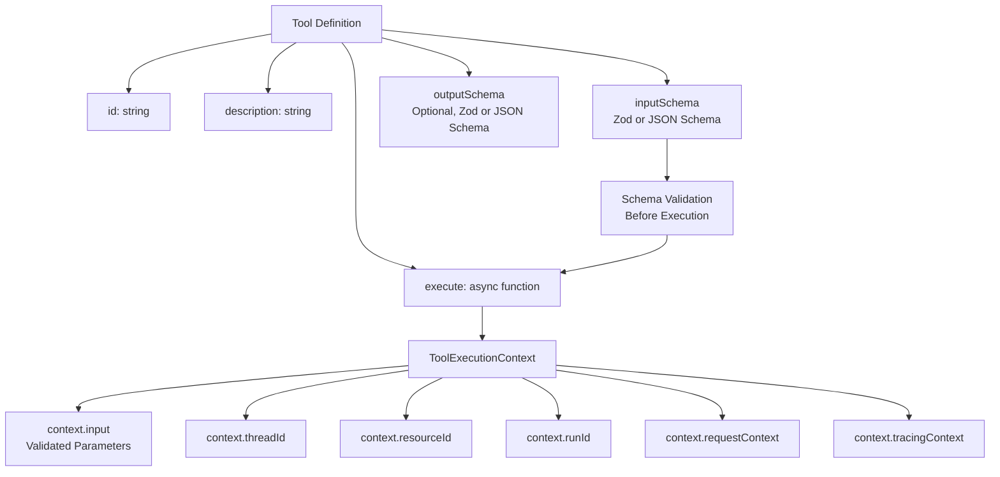
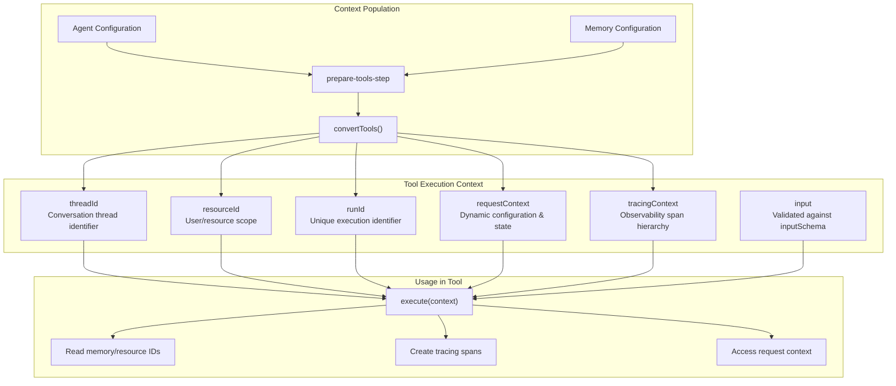
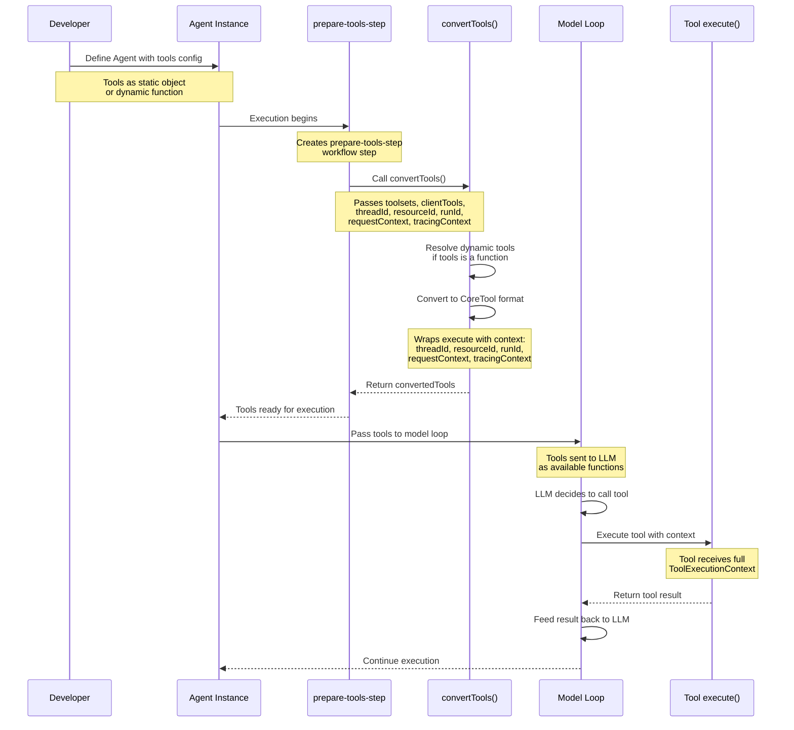
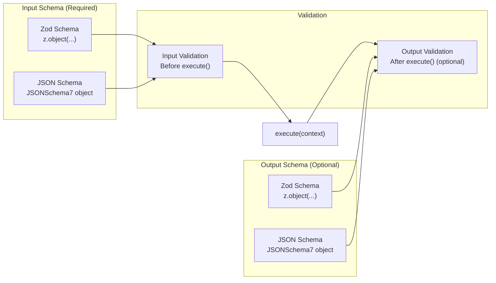
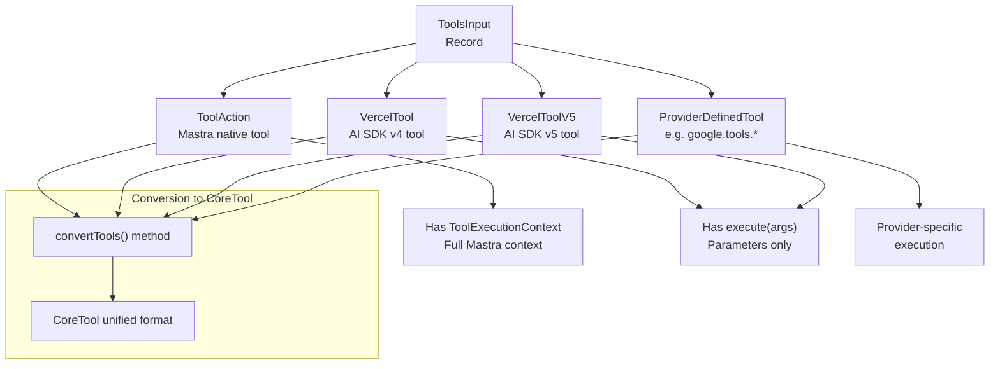
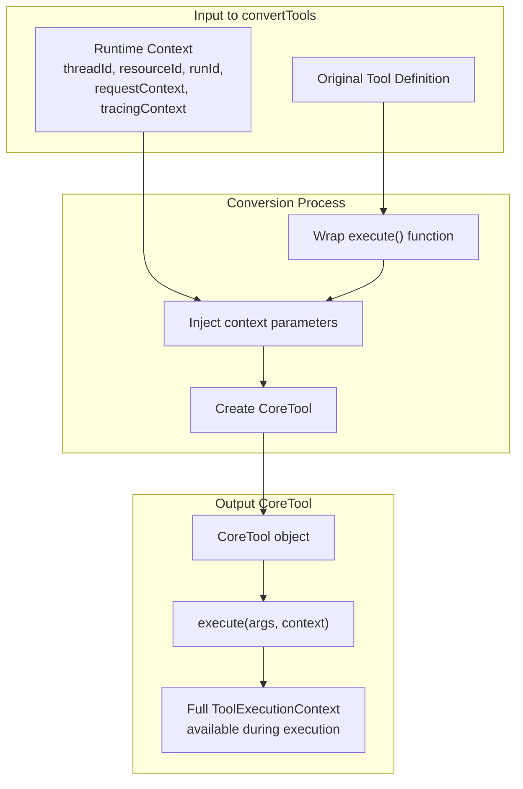

# Tool Definition and Execution Context

<details>
<summary>Relevant source files</summary>

The following files were used as context for generating this wiki page:

- [examples/bird-checker-with-express/src/index.ts](examples/bird-checker-with-express/src/index.ts)
- [examples/bird-checker-with-nextjs-and-eval/src/lib/mastra/actions.ts](examples/bird-checker-with-nextjs-and-eval/src/lib/mastra/actions.ts)
- [packages/core/src/action/index.ts](packages/core/src/action/index.ts)
- [packages/core/src/agent/**tests**/utils.test.ts](packages/core/src/agent/__tests__/utils.test.ts)
- [packages/core/src/agent/agent-legacy.ts](packages/core/src/agent/agent-legacy.ts)
- [packages/core/src/agent/agent.test.ts](packages/core/src/agent/agent.test.ts)
- [packages/core/src/agent/agent.ts](packages/core/src/agent/agent.ts)
- [packages/core/src/agent/agent.types.ts](packages/core/src/agent/agent.types.ts)
- [packages/core/src/agent/index.ts](packages/core/src/agent/index.ts)
- [packages/core/src/agent/trip-wire.ts](packages/core/src/agent/trip-wire.ts)
- [packages/core/src/agent/types.ts](packages/core/src/agent/types.ts)
- [packages/core/src/agent/utils.ts](packages/core/src/agent/utils.ts)
- [packages/core/src/agent/workflows/prepare-stream/index.ts](packages/core/src/agent/workflows/prepare-stream/index.ts)
- [packages/core/src/agent/workflows/prepare-stream/map-results-step.ts](packages/core/src/agent/workflows/prepare-stream/map-results-step.ts)
- [packages/core/src/agent/workflows/prepare-stream/prepare-memory-step.ts](packages/core/src/agent/workflows/prepare-stream/prepare-memory-step.ts)
- [packages/core/src/agent/workflows/prepare-stream/prepare-tools-step.ts](packages/core/src/agent/workflows/prepare-stream/prepare-tools-step.ts)
- [packages/core/src/agent/workflows/prepare-stream/stream-step.ts](packages/core/src/agent/workflows/prepare-stream/stream-step.ts)
- [packages/core/src/llm/index.ts](packages/core/src/llm/index.ts)
- [packages/core/src/llm/model/model.test.ts](packages/core/src/llm/model/model.test.ts)
- [packages/core/src/llm/model/model.ts](packages/core/src/llm/model/model.ts)
- [packages/core/src/mastra/index.ts](packages/core/src/mastra/index.ts)
- [packages/core/src/observability/types/tracing.ts](packages/core/src/observability/types/tracing.ts)
- [packages/core/src/stream/aisdk/v5/execute.ts](packages/core/src/stream/aisdk/v5/execute.ts)
- [packages/core/src/tools/tool-builder/builder.test.ts](packages/core/src/tools/tool-builder/builder.test.ts)
- [packages/core/src/tools/tool-builder/builder.ts](packages/core/src/tools/tool-builder/builder.ts)
- [packages/core/src/tools/tool.ts](packages/core/src/tools/tool.ts)
- [packages/core/src/tools/types.ts](packages/core/src/tools/types.ts)

</details>

This page documents how tools are defined, registered, and executed within the Mastra framework. It covers the tool schema definition process, the execution context available to tools during runtime, and the lifecycle of tool invocation from registration through execution.

For information about tool integration with agents, see [Agent System](#3). For details on the tool builder patterns and schema conversion, see [Tool Builder and Schema Conversion](#6.2).

---

## Tool Definition Structure

Tools in Mastra are defined using the `createTool` function, which accepts a configuration object specifying the tool's identifier, description, input/output schemas, and execution function. The tool definition establishes both the interface contract (what parameters it accepts and what it returns) and the implementation (how it executes).

### Tool Configuration Components



**Sources:** [packages/core/src/agent/workflows/prepare-stream/schema.ts:37-49](), [packages/core/src/agent/types.ts:51-54]()

The tool definition creates a strongly-typed interface that ensures:

- Input parameters are validated against the schema before execution
- Output can optionally be validated for consistency
- Execution context provides runtime information (thread, resource, run IDs)
- Type safety is maintained throughout the tool call chain

### Accepted Tool Types

Mastra accepts three categories of tools, allowing integration with different ecosystems:

| Tool Type                  | Description                                                 | Key Characteristic                                                   |
| -------------------------- | ----------------------------------------------------------- | -------------------------------------------------------------------- |
| **Mastra ToolAction**      | Native Mastra tools created with `createTool`               | Includes `ToolExecutionContext` with full Mastra runtime information |
| **Vercel AI SDK Tools**    | Tools from AI SDK v4/v5 (`tool()` function)                 | Compatible with AI SDK tool format                                   |
| **Provider-Defined Tools** | Native provider tools (e.g., `google.tools.googleSearch()`) | Provider-specific tool implementations                               |

**Sources:** [packages/core/src/agent/types.ts:51-54]()

---

## Tool Execution Context

During tool execution, the `execute` function receives a context object that provides access to runtime information and enables interaction with the broader Mastra system. This context is constructed during the tool preparation phase and remains available throughout execution.

### ToolExecutionContext Structure



**Sources:** [packages/core/src/agent/workflows/prepare-stream/prepare-tools-step.ts:24-78]()

### Context Properties

The execution context provides the following properties to tool implementations:

- **`context.input`**: The validated tool input parameters, typed according to the `inputSchema`. Schema validation occurs before the tool executes.

- **`context.threadId`**: The conversation thread identifier when memory is enabled. Allows tools to persist state or retrieve conversation history.

- **`context.resourceId`**: The resource scope identifier (typically user ID) when memory is enabled. Enables multi-tenant tool execution.

- **`context.runId`**: A unique identifier for this specific agent execution run. Useful for logging, tracing, and correlating operations.

- **`context.requestContext`**: A `RequestContext` instance containing dynamic configuration and state. Tools can read custom values injected by the application.

- **`context.tracingContext`**: Provides access to the current tracing span for creating child spans and recording observability data.

**Sources:** [packages/core/src/agent/workflows/prepare-stream/prepare-tools-step.ts:59-71]()

---

## Tool Lifecycle: Registration to Execution

The tool lifecycle spans from definition and registration through preparation and execution. Understanding this flow clarifies how tools integrate into agent execution and how context propagates through each phase.

### Complete Tool Lifecycle



**Sources:** [packages/core/src/agent/workflows/prepare-stream/prepare-tools-step.ts:24-78](), [packages/core/src/agent/workflows/prepare-stream/map-results-step.ts:59-71]()

### Phase Breakdown

**1. Registration Phase**

Tools are registered with an agent via the `tools` configuration parameter in the agent constructor. Tools can be provided as:

- Static object: `tools: { myTool: createTool(...) }`
- Dynamic function: `tools: ({ requestContext }) => { ... }`

[packages/core/src/agent/agent.ts:152]()

**2. Preparation Phase**

During agent execution, the `prepare-tools-step` workflow step prepares tools for the model loop:

- Resolves dynamic tool functions using the current `requestContext`
- Merges toolsets and client-side tools
- Injects memory and resource context (threadId, resourceId)
- Calls `convertTools()` to create the final tool set

[packages/core/src/agent/workflows/prepare-stream/prepare-tools-step.ts:35-78]()

**3. Conversion Phase**

The `convertTools()` method transforms tools into the `CoreTool` format expected by the model loop:

- Wraps the tool's `execute` function with context injection
- Attaches threadId, resourceId, runId, requestContext, tracingContext
- Converts schemas to the format required by the AI SDK

[packages/core/src/agent/workflows/prepare-stream/prepare-tools-step.ts:59-71]()

**4. Execution Phase**

When the LLM decides to call a tool:

- The model loop invokes the tool's wrapped `execute` function
- The tool receives the complete `ToolExecutionContext`
- The tool executes and returns a result
- The result is converted to model output format via `toModelOutput` if defined
- The result is fed back to the LLM for continued processing

[packages/core/src/stream/aisdk/v5/execute.ts:23-196]()

---

## Tool Schema Definition

Tool schemas define the input and output contracts for tool execution. Schemas can be specified using Zod schemas or JSON Schema format, providing both runtime validation and TypeScript type inference.

### Schema Options



**Sources:** [packages/core/src/agent/workflows/prepare-stream/schema.ts:37-49]()

### Schema Validation Behavior

**Input Schema Validation**

Input schemas are always validated before tool execution. If validation fails, the tool does not execute, and an error is returned to the model loop. This ensures tools never receive malformed input.

**Output Schema Validation**

Output schemas are optional and primarily serve documentation purposes. When provided, they inform the LLM about the expected return structure but do not enforce validation by default in Mastra's tool system.

**Sources:** [packages/core/src/agent/workflows/prepare-stream/schema.ts:37-49]()

---

## Tool Types and Compatibility

Mastra's tool system supports multiple tool formats through a unified interface, enabling integration with different AI frameworks and provider-specific tools.

### Tool Type Hierarchy



**Sources:** [packages/core/src/agent/types.ts:51-54](), [packages/core/src/agent/workflows/prepare-stream/schema.ts:37-49]()

### Mastra ToolAction

Native Mastra tools created via `createTool` provide the richest execution context:

```typescript
// Example structure (not actual code)
createTool({
  id: 'example-tool',
  description: 'Example tool with full context',
  inputSchema: z.object({ query: z.string() }),
  outputSchema: z.object({ result: z.string() }),
  execute: async (context) => {
    // Access full ToolExecutionContext
    const {
      input,
      threadId,
      resourceId,
      runId,
      requestContext,
      tracingContext,
    } = context
    // Implementation...
  },
})
```

**Sources:** [packages/core/src/agent/types.ts:51-54]()

### Server-Side vs Client-Side Tools

Tools can be designated as client-side or server-side based on where they execute:

| Tool Category         | Execution Location               | Use Case                                        |
| --------------------- | -------------------------------- | ----------------------------------------------- |
| **Server-Side Tools** | Agent runtime environment        | Database access, API calls, file operations     |
| **Client Tools**      | Client application (browser/app) | User interactions, UI updates, client-only APIs |

Client tools are registered via the `clientTools` parameter and are included in the tool set but marked for client-side execution. The agent streams tool calls to the client, which executes them and returns results.

**Sources:** [packages/core/src/agent/types.ts:213](), [packages/core/src/agent/workflows/prepare-stream/prepare-tools-step.ts:52]()

---

## Context Injection During Tool Conversion

The `convertTools()` method wraps each tool's execution function to inject the runtime context. This transformation happens transparently during the tool preparation phase.

### Context Injection Flow



**Sources:** [packages/core/src/agent/workflows/prepare-stream/prepare-tools-step.ts:59-71]()

The conversion process ensures that every tool, regardless of its original format, receives the complete execution context when invoked by the model loop. This includes memory identifiers, tracing context, and request-scoped configuration.

**Sources:** [packages/core/src/agent/workflows/prepare-stream/prepare-tools-step.ts:24-78]()

---

## Tool Execution in Model Loop

Once tools are prepared and converted, they become available to the LLM during execution. The model loop handles tool invocation based on LLM decisions, executing tools and feeding results back into the conversation.

### Tool Invocation Sequence

```mermaid
sequenceDiagram
    participant LLM as Language Model
    participant Loop as Model Loop
    participant ToolWrapper as Wrapped Tool Execute
    participant CoreTool as Tool Implementation
    participant Tracing as Tracing System

    LLM->>Loop: Generate response with tool call
    Note over LLM,Loop: LLM decides to call tool<br/>with specific arguments

    Loop->>Loop: Validate tool exists
    Loop->>Loop: Validate arguments against schema

    Loop->>Tracing: Create tool execution span
    Note over Tracing: Span includes tool name,<br/>arguments, runId, threadId

    Loop->>ToolWrapper: execute(args, context)
    Note over ToolWrapper: Context injection happens here

    ToolWrapper->>CoreTool: Call implementation with context
    Note over CoreTool: Tool receives:<br/>input, threadId, resourceId,<br/>runId, requestContext,<br/>tracingContext

    CoreTool-->>ToolWrapper: Return result
    ToolWrapper->>ToolWrapper: Apply toModelOutput<br/>if defined
    ToolWrapper-->>Loop: Return formatted result

    Loop->>Tracing: End tool execution span
    Note over Tracing: Records result, errors,<br/>execution time

    Loop->>LLM: Feed tool result back
    Note over Loop,LLM: Result added to conversation<br/>as tool-result message

    LLM->>Loop: Continue generation
```

**Sources:** [packages/core/src/stream/aisdk/v5/execute.ts:48-196](), [packages/core/src/agent/workflows/prepare-stream/stream-step.ts:54-105]()

### Tool Result Formatting

After a tool executes, its result may be transformed via the `toModelOutput` function (if defined) before being sent to the LLM. This allows tools to return structured data internally while presenting a different format to the model.

**Sources:** [packages/core/src/agent/workflows/prepare-stream/schema.ts:46]()
