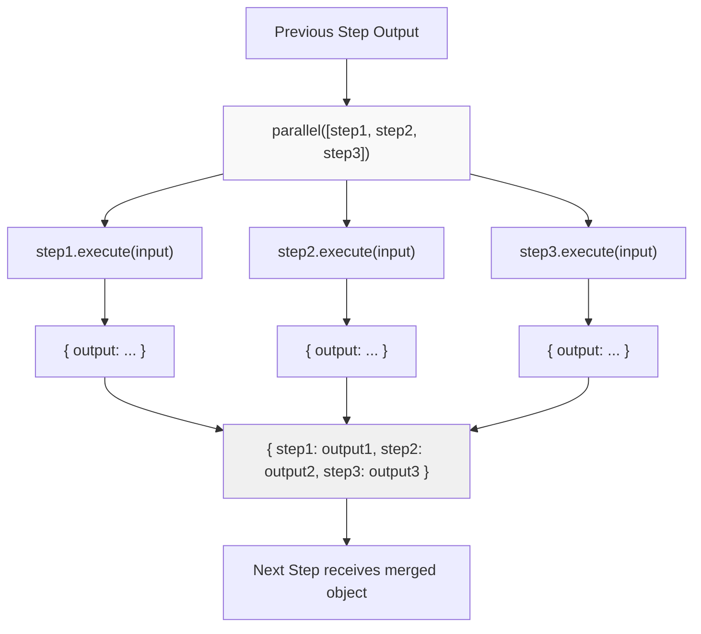
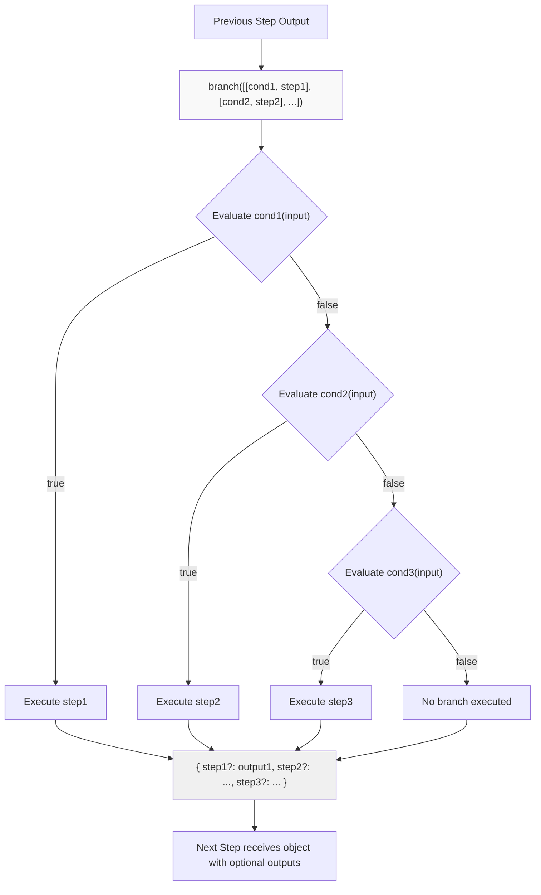
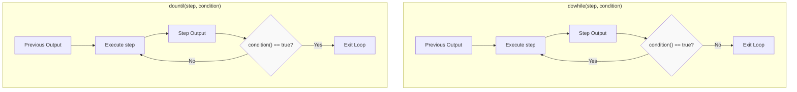
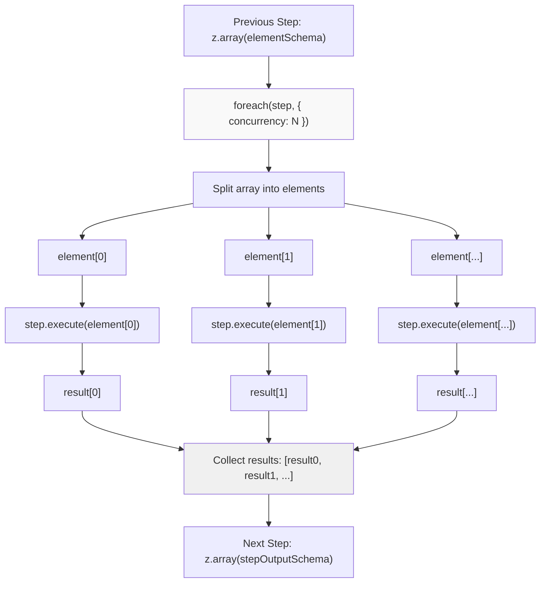
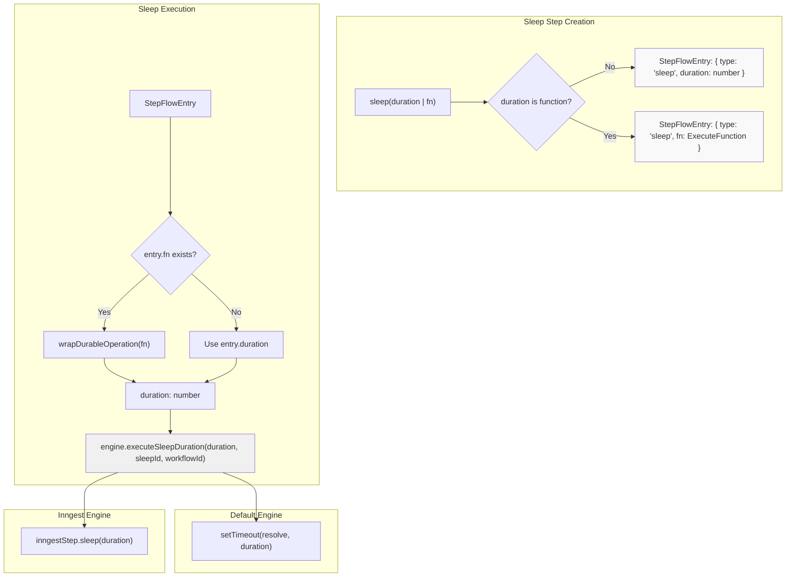
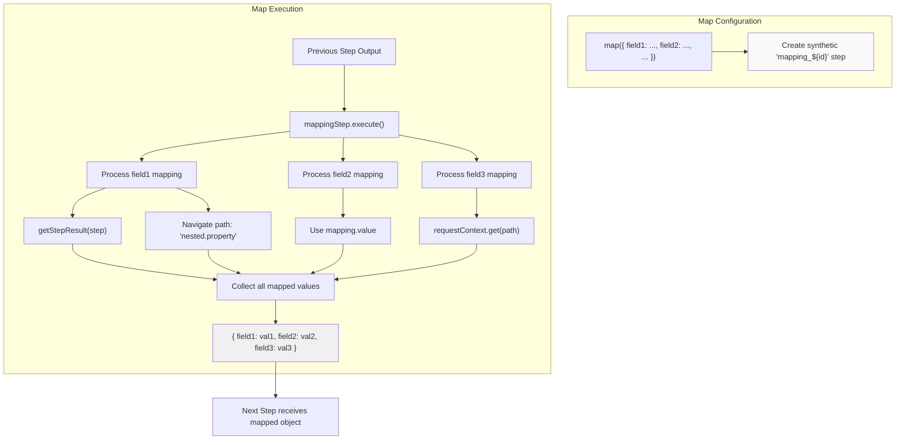
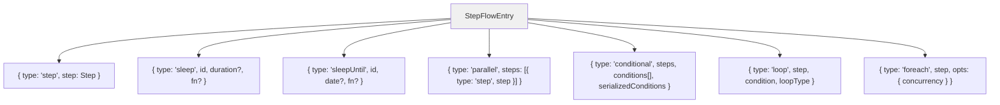
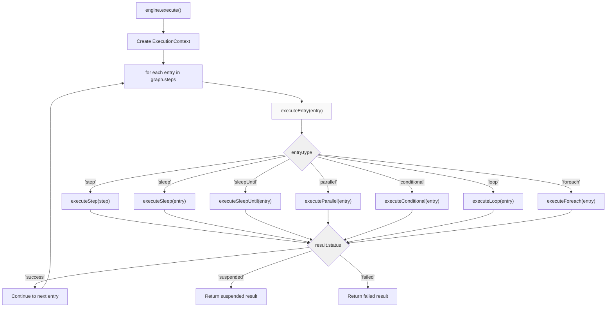

# Control Flow Patterns

<details>
<summary>Relevant source files</summary>

The following files were used as context for generating this wiki page:

- [packages/core/src/workflows/default.ts](packages/core/src/workflows/default.ts)
- [packages/core/src/workflows/evented/evented-workflow.test.ts](packages/core/src/workflows/evented/evented-workflow.test.ts)
- [packages/core/src/workflows/evented/execution-engine.ts](packages/core/src/workflows/evented/execution-engine.ts)
- [packages/core/src/workflows/evented/step-executor.test.ts](packages/core/src/workflows/evented/step-executor.test.ts)
- [packages/core/src/workflows/evented/step-executor.ts](packages/core/src/workflows/evented/step-executor.ts)
- [packages/core/src/workflows/evented/workflow-event-processor/index.ts](packages/core/src/workflows/evented/workflow-event-processor/index.ts)
- [packages/core/src/workflows/evented/workflow.ts](packages/core/src/workflows/evented/workflow.ts)
- [packages/core/src/workflows/execution-engine.ts](packages/core/src/workflows/execution-engine.ts)
- [packages/core/src/workflows/step.ts](packages/core/src/workflows/step.ts)
- [packages/core/src/workflows/types.ts](packages/core/src/workflows/types.ts)
- [packages/core/src/workflows/utils.ts](packages/core/src/workflows/utils.ts)
- [packages/core/src/workflows/workflow.test.ts](packages/core/src/workflows/workflow.test.ts)
- [packages/core/src/workflows/workflow.ts](packages/core/src/workflows/workflow.ts)
- [workflows/inngest/src/execution-engine.ts](workflows/inngest/src/execution-engine.ts)
- [workflows/inngest/src/index.test.ts](workflows/inngest/src/index.test.ts)
- [workflows/inngest/src/index.ts](workflows/inngest/src/index.ts)
- [workflows/inngest/src/run.ts](workflows/inngest/src/run.ts)
- [workflows/inngest/src/workflow.ts](workflows/inngest/src/workflow.ts)

</details>

This document describes the control flow patterns available in Mastra workflows for orchestrating multi-step execution. These patterns enable sequential, parallel, conditional, and iterative logic composition using a fluent API.

For information about workflow state management, see [Workflow State Management and Persistence](#4.3). For suspend/resume mechanics, see [Suspend and Resume Mechanism](#4.4). For workflow definition and step creation, see [Workflow Definition and Step Composition](#4.1).

## Overview of Control Flow Patterns

Workflows in Mastra support seven primary control flow patterns, implemented as chainable methods on the `Workflow` class:

| Pattern        | Method                    | Purpose                                      | Output Schema                          |
| -------------- | ------------------------- | -------------------------------------------- | -------------------------------------- |
| Sequential     | `.then(step)`             | Execute step after previous completes        | Step's output schema                   |
| Parallel       | `.parallel([steps])`      | Execute multiple steps concurrently          | Object with all step outputs           |
| Conditional    | `.branch([[cond, step]])` | Execute first step whose condition is true   | Union of all branch outputs (optional) |
| Do-While Loop  | `.dowhile(step, cond)`    | Execute step, repeat while condition is true | Final iteration output                 |
| Do-Until Loop  | `.dountil(step, cond)`    | Execute step, repeat until condition is true | Final iteration output                 |
| ForEach        | `.foreach(step, opts?)`   | Execute step for each array element          | Array of step outputs                  |
| Data Transform | `.map(config)`            | Transform data between steps                 | Mapped object schema                   |

Each pattern is internally represented as a `StepFlowEntry` variant stored in the workflow's execution graph, which the execution engine traverses at runtime.

**Sources:** [packages/core/src/workflows/workflow.ts:511-967](), [packages/core/src/workflows/types.ts:290-373]()

## Sequential Execution with `.then()`

The `.then()` method chains steps sequentially, where each step receives the previous step's output as input:

```typescript
const workflow = createWorkflow({
  id: 'sequential-workflow',
  inputSchema: z.object({ value: z.string() }),
  outputSchema: z.object({ result: z.string() }),
  steps: [step1, step2, step3],
})
  .then(step1) // receives workflow input
  .then(step2) // receives step1 output
  .then(step3) // receives step2 output
  .commit()
```

The method signature enforces type safety by ensuring each step's `inputSchema` matches the previous step's `outputSchema`:

```typescript
then<TStepId, TStepState, TStepInputSchema, TSchemaOut>(
  step: Step<
    TStepId,
    SubsetOf<TStepState, TState>,
    z.TypeOf<TPrevSchema> extends z.TypeOf<TStepInputSchema> ? TStepInputSchema : never,
    TSchemaOut,
    any,
    any,
    TEngineType
  >
): Workflow<TEngineType, TSteps, TWorkflowId, TState, TInput, TOutput, TSchemaOut>
```

Internally, `.then()` creates a `StepFlowEntry` of type `'step'` and adds it to the workflow's execution graph:

```typescript
this.stepFlow.push({ type: 'step', step: step as any })
this.serializedStepFlow.push({
  type: 'step',
  step: {
    id: step.id,
    description: step.description,
    component: (step as SerializedStep).component,
    serializedStepFlow: (step as SerializedStep).serializedStepFlow,
    canSuspend: Boolean(step.suspendSchema || step.resumeSchema),
  },
})
```

**Sources:** [packages/core/src/workflows/workflow.ts:511-540](), [packages/core/src/workflows/types.ts:291]()

## Parallel Execution with `.parallel()`

The `.parallel()` method executes multiple steps concurrently with the same input, returning an object containing all step outputs:

```typescript
const workflow = createWorkflow({
  id: 'parallel-workflow',
  inputSchema: z.object({ data: z.string() }),
  outputSchema: z.object({}),
  steps: [analyzeStep, validateStep, enrichStep],
})
  .then(prepareStep)
  .parallel([analyzeStep, validateStep, enrichStep])
  .commit()
```

### Parallel Execution Diagram



The output schema transforms into a `z.ZodObject` with each step's output as a property:

```typescript
parallel<TParallelSteps>(steps: TParallelSteps): Workflow<
  TEngineType,
  TSteps,
  TWorkflowId,
  TState,
  TInput,
  TOutput,
  z.ZodObject<{
    [K in keyof StepsRecord<TParallelSteps>]: StepsRecord<TParallelSteps>[K]['outputSchema'];
  }>
>
```

The execution engine processes parallel steps via `executeParallel()` in [packages/core/src/workflows/handlers/control-flow.ts:59-273](), which iterates through steps but does not wait for each to complete before starting the next (concurrent execution within the event loop).

**Sources:** [packages/core/src/workflows/workflow.ts:756-803](), [packages/core/src/workflows/types.ts:294-297](), [packages/core/src/workflows/handlers/control-flow.ts:28-273]()

## Conditional Branching with `.branch()`

The `.branch()` method evaluates conditions sequentially and executes the first step whose condition returns `true`:

```typescript
const workflow = createWorkflow({
  id: 'conditional-workflow',
  inputSchema: z.object({ score: z.number() }),
  outputSchema: z.object({}),
  steps: [highScoreStep, mediumScoreStep, lowScoreStep],
})
  .then(scoreStep)
  .branch([
    [async ({ inputData }) => inputData.score > 80, highScoreStep],
    [async ({ inputData }) => inputData.score > 50, mediumScoreStep],
    [
      async () => true, // default case
      lowScoreStep,
    ],
  ])
  .commit()
```

### Conditional Branching Diagram



The output schema becomes an object with all step outputs marked as optional, since only one branch executes:

```typescript
branch<TBranchSteps>(steps: TBranchSteps): Workflow<
  TEngineType,
  TSteps,
  TWorkflowId,
  TState,
  TInput,
  TOutput,
  z.ZodObject<{
    [K in keyof StepsRecord<ExtractedSteps[]>]: z.ZodOptional<StepsRecord<ExtractedSteps[]>[K]['outputSchema']>;
  }>
>
```

Conditions are `ConditionFunction` instances that receive execution context but cannot call `setState` or `suspend`:

```typescript
export type ConditionFunction<TState, TStepInput, TResumeSchema, TSuspendSchema, EngineType> = (
  params: ConditionFunctionParams<TState, TStepInput, TResumeSchema, TSuspendSchema, EngineType>,
) => Promise<boolean>;

export type ConditionFunctionParams<...> = Omit<
  ExecuteFunctionParams<...>,
  'setState' | 'suspend'
>;
```

The execution engine evaluates conditions via `executeConditional()` in [packages/core/src/workflows/handlers/control-flow.ts:275-452](), which stores both the condition functions and serialized string representations for debugging.

**Sources:** [packages/core/src/workflows/workflow.ts:807-862](), [packages/core/src/workflows/types.ts:298-303](), [packages/core/src/workflows/step.ts:62-64](), [packages/core/src/workflows/handlers/control-flow.ts:275-452]()

## Loop Patterns: `.dowhile()` and `.dountil()`

Loop patterns execute a step repeatedly based on a condition evaluated after each iteration:

### Do-While Loop

Repeats the step **while** the condition is `true`:

```typescript
const workflow = createWorkflow({
  id: 'retry-workflow',
  inputSchema: z.object({ attempts: z.number() }),
  outputSchema: z.object({ success: z.boolean() }),
  steps: [retryStep],
})
  .dowhile(retryStep, async ({ state, iterationCount }) => {
    return state.attempts < 3 && iterationCount < 10
  })
  .commit()
```

### Do-Until Loop

Repeats the step **until** the condition is `true`:

```typescript
const workflow = createWorkflow({
  id: 'polling-workflow',
  inputSchema: z.object({ jobId: z.string() }),
  outputSchema: z.object({ status: z.string() }),
  steps: [pollStep],
})
  .dountil(pollStep, async ({ inputData }) => {
    return inputData.status === 'completed'
  })
  .commit()
```

### Loop Execution Flow



Loop conditions are `LoopConditionFunction` instances that receive an `iterationCount` parameter:

```typescript
export type LoopConditionFunction<
  TState,
  TStepInput,
  TResumeSchema,
  TSuspendSchema,
  EngineType,
> = (
  params: ConditionFunctionParams<
    TState,
    TStepInput,
    TResumeSchema,
    TSuspendSchema,
    EngineType
  > & {
    iterationCount: number
  }
) => Promise<boolean>
```

Both methods store the loop type (`'dowhile'` | `'dountil'`) in the `StepFlowEntry`:

```typescript
this.stepFlow.push({
  type: 'loop',
  step: step as any,
  condition,
  loopType: 'dowhile', // or 'dountil'
  serializedCondition: { id: `${step.id}-condition`, fn: condition.toString() },
})
```

The execution engine processes loops via `executeLoop()` in [packages/core/src/workflows/handlers/control-flow.ts:454-670](), which maintains an iteration counter and evaluates the condition after each execution.

**Sources:** [packages/core/src/workflows/workflow.ts:864-928](), [packages/core/src/workflows/types.ts:305-310](), [packages/core/src/workflows/step.ts:66-70](), [packages/core/src/workflows/handlers/control-flow.ts:454-670]()

## ForEach Iteration with `.foreach()`

The `.foreach()` method executes a step for each element in an array from the previous step's output:

```typescript
const workflow = createWorkflow({
  id: 'batch-workflow',
  inputSchema: z.object({ items: z.array(z.string()) }),
  outputSchema: z.object({ results: z.array(z.string()) }),
  steps: [fetchItemsStep, processItemStep],
})
  .then(fetchItemsStep) // returns { items: string[] }
  .foreach(processItemStep, { concurrency: 3 })
  .commit()
```

The previous step must return an array type, enforced by the type constraint:

```typescript
foreach<
  TPrevIsArray extends TPrevSchema extends z.ZodArray<any> ? true : false,
  TStepState,
  TStepInputSchema extends TPrevSchema extends z.ZodArray<infer TElement> ? TElement : never,
  TStepId,
  TSchemaOut
>(
  step: TPrevIsArray extends true
    ? Step<TStepId, SubsetOf<TStepState, TState>, TStepInputSchema, TSchemaOut, any, any, TEngineType>
    : 'Previous step must return an array type',
  opts?: { concurrency: number }
): Workflow<
  TEngineType,
  TSteps,
  TWorkflowId,
  TState,
  TInput,
  TOutput,
  z.ZodArray<TSchemaOut>
>
```

### ForEach Execution Architecture



The `concurrency` option controls how many elements are processed simultaneously. The execution engine processes foreach via `executeForeach()` in [packages/core/src/workflows/handlers/control-flow.ts:672-893](), which:

1. Validates the input is an array
2. Creates a loop that processes `concurrency` items at a time
3. Collects all outputs into a result array
4. Handles suspended steps within foreach iterations

For Inngest workflows, nested workflow steps in foreach are detected via `isNestedWorkflowStep()` and invoked using `inngestStep.invoke()` for proper durability guarantees.

**Sources:** [packages/core/src/workflows/workflow.ts:930-967](), [packages/core/src/workflows/types.ts:312-317](), [packages/core/src/workflows/handlers/control-flow.ts:672-893]()

## Sleep Operations: `.sleep()` and `.sleepUntil()`

Sleep operations pause workflow execution for a duration or until a specific time:

### Fixed Duration Sleep

```typescript
const workflow = createWorkflow({
  id: 'delayed-workflow',
  inputSchema: z.object({}),
  outputSchema: z.object({}),
  steps: [step1, step2],
})
  .then(step1)
  .sleep(5000) // pause for 5 seconds
  .then(step2)
  .commit()
```

### Dynamic Duration Sleep

```typescript
const workflow = createWorkflow({
  id: 'dynamic-delay-workflow',
  inputSchema: z.object({ delay: z.number() }),
  outputSchema: z.object({}),
  steps: [step1, step2],
})
  .then(step1)
  .sleep(async ({ inputData }) => {
    return inputData.delay * 1000 // convert to milliseconds
  })
  .then(step2)
  .commit()
```

### Sleep Until Specific Time

```typescript
const workflow = createWorkflow({
  id: 'scheduled-workflow',
  inputSchema: z.object({}),
  outputSchema: z.object({}),
  steps: [step1, step2],
})
  .then(step1)
  .sleepUntil(new Date('2025-01-01T00:00:00Z'))
  .then(step2)
  .commit()
```

### Sleep Implementation Architecture



Sleep operations create a synthetic step with a generated ID (`sleep_${id}`) but empty input/output schemas:

```typescript
this.steps[id] = createStep({
  id,
  inputSchema: z.object({}),
  outputSchema: z.object({}),
  execute: async () => {
    return {}
  },
})
```

The execution engine provides two hooks for platform-specific sleep implementation:

```typescript
// Default engine: uses setTimeout
async executeSleepDuration(duration: number, _sleepId: string, _workflowId: string): Promise<void> {
  await new Promise(resolve => setTimeout(resolve, duration < 0 ? 0 : duration));
}

// Inngest engine: uses inngestStep.sleep for durability
async executeSleepDuration(duration: number, sleepId: string, workflowId: string): Promise<void> {
  await this.inngestStep.sleep(`workflow.${workflowId}.sleep.${sleepId}`, duration);
}
```

**Sources:** [packages/core/src/workflows/workflow.ts:547-599](), [packages/core/src/workflows/types.ts:292-293,340-345](), [packages/core/src/workflows/handlers/sleep.ts:48-133,135-217](), [packages/core/src/workflows/default.ts:128-142]()

## Data Transformation with `.map()`

The `.map()` method transforms data between steps by extracting values from previous steps, initial data, request context, or static values:

### Mapping from Step Outputs

```typescript
const workflow = createWorkflow({
  id: 'mapping-workflow',
  inputSchema: z.object({ userId: z.string() }),
  outputSchema: z.object({}),
  steps: [fetchUserStep, fetchPrefsStep, processStep],
})
  .then(fetchUserStep) // returns { name: string, email: string }
  .then(fetchPrefsStep) // returns { theme: string, lang: string }
  .map({
    userName: { step: fetchUserStep, path: 'name' },
    userEmail: { step: fetchUserStep, path: 'email' },
    userTheme: { step: fetchPrefsStep, path: 'theme' },
    lang: { step: fetchPrefsStep, path: 'lang' },
  })
  .then(processStep)
  .commit()
```

### Mapping Configuration Types

```typescript
.map({
  // Extract from step output
  field1: { step: stepInstance, path: 'some.nested.path' },

  // Static value
  field2: { value: 'constant', schema: z.string() },

  // From workflow initial data
  field3: { initData: workflow, path: 'inputField' },

  // From request context
  field4: { requestContextPath: 'userId', schema: z.string() },

  // Dynamic function
  field5: {
    fn: async ({ inputData, state, getStepResult }) => {
      return computeValue(inputData, state);
    },
    schema: z.number()
  },
})
```

### Map Transformation Diagram



The `.map()` method can also accept a function directly for custom transformations:

```typescript
.map(async ({ inputData, state, getStepResult, getInitData, requestContext }) => {
  const prevStepOutput = getStepResult(previousStep);
  const initialInput = getInitData();

  return {
    computedField: prevStepOutput.value * 2,
    stateValue: state.someValue,
    userId: requestContext.get('userId'),
  };
})
```

Internally, `.map()` creates a synthetic step with `z.any()` input/output schemas and an execute function that resolves each mapping configuration:

```typescript
const mappingStep: any = createStep({
  id:
    stepOptions?.id || `mapping_${this.#mastra?.generateId() || randomUUID()}`,
  inputSchema: z.any(),
  outputSchema: z.any(),
  execute: async (ctx) => {
    const { getStepResult, getInitData, requestContext } = ctx
    const result: Record<string, any> = {}

    for (const [key, mapping] of Object.entries(mappingConfig)) {
      // ... resolve mapping type and extract value
      result[key] = value
    }
    return result
  },
})
```

**Sources:** [packages/core/src/workflows/workflow.ts:624-753](), [packages/core/src/workflows/types.ts:135-138]()

## Control Flow Execution Architecture

### StepFlowEntry Type Hierarchy

All control flow patterns are represented as variants of the `StepFlowEntry` discriminated union:



### Execution Engine Processing

The `DefaultExecutionEngine` traverses the workflow's step graph and delegates to specialized handlers:



Each handler is implemented in separate modules for maintainability:

| Handler              | File                                                             | Entry Types     |
| -------------------- | ---------------------------------------------------------------- | --------------- |
| `executeStep`        | [packages/core/src/workflows/handlers/step.ts:61-273]()          | `'step'`        |
| `executeSleep`       | [packages/core/src/workflows/handlers/sleep.ts:48-133]()         | `'sleep'`       |
| `executeSleepUntil`  | [packages/core/src/workflows/handlers/sleep.ts:135-217]()        | `'sleepUntil'`  |
| `executeParallel`    | [packages/core/src/workflows/handlers/control-flow.ts:59-273]()  | `'parallel'`    |
| `executeConditional` | [packages/core/src/workflows/handlers/control-flow.ts:275-452]() | `'conditional'` |
| `executeLoop`        | [packages/core/src/workflows/handlers/control-flow.ts:454-670]() | `'loop'`        |
| `executeForeach`     | [packages/core/src/workflows/handlers/control-flow.ts:672-893]() | `'foreach'`     |

The execution engine provides hooks that platform-specific engines (like Inngest) can override:

```typescript
abstract class ExecutionEngine {
  // Sleep hooks
  abstract executeSleepDuration(duration: number, sleepId: string, workflowId: string): Promise<void>;
  abstract executeSleepUntilDate(date: Date, sleepUntilId: string, workflowId: string): Promise<void>;

  // Condition evaluation (for durability)
  abstract evaluateCondition(
    conditionFn: ConditionFunction,
    index: number,
    context: ConditionFunctionParams,
    operationId: string,
  ): Promise<number | null>;

  // Durable operation wrapper
  abstract wrapDurableOperation<T>(operationId: string, operationFn: () => Promise<T>): Promise<T>;

  // Nested workflow detection and execution
  abstract isNestedWorkflowStep(step: Step): boolean;
  abstract executeWorkflowStep(params: { ... }): Promise<StepResult | null>;
}
```

**Sources:** [packages/core/src/workflows/default.ts:424-718](), [packages/core/src/workflows/handlers/entry.ts:42-222](), [packages/core/src/workflows/types.ts:290-373](), [packages/core/src/workflows/execution-engine.ts:12-90]()

### Control Flow State Management

Each control flow pattern interacts with the workflow's mutable context differently:

| Pattern     | State Modifications                 | Suspend Support | Resume Behavior                       |
| ----------- | ----------------------------------- | --------------- | ------------------------------------- |
| Sequential  | Normal `setState`                   | Yes             | Resume at suspended step              |
| Parallel    | Each branch can call `setState`     | Yes             | Resume suspended branches only        |
| Conditional | Executed branch can call `setState` | Yes             | Resume suspended branch               |
| Loop        | Each iteration can call `setState`  | Yes             | Resume at suspended iteration         |
| ForEach     | Each element can call `setState`    | Yes             | Resume at suspended element           |
| Sleep       | No state modification               | No              | N/A (completes immediately on resume) |
| Map         | No state modification               | No              | N/A (pure transformation)             |

The execution context tracks active paths for each step to support mid-control-flow suspension:

```typescript
export type ExecutionContext = {
  workflowId: string
  runId: string
  executionPath: number[]
  activeStepsPath: Record<string, number[]>
  suspendedPaths: Record<string, number[]>
  resumeLabels: Record<string, { stepId: string; foreachIndex?: number }>
  state: Record<string, any>
  // ...
}
```

When a step within a control flow pattern suspends, the execution path is stored in `suspendedPaths` and `activeStepsPath`, allowing the workflow to resume from that exact position in the control structure.

**Sources:** [packages/core/src/workflows/types.ts:542-563](), [packages/core/src/workflows/default.ts:406-421]()
