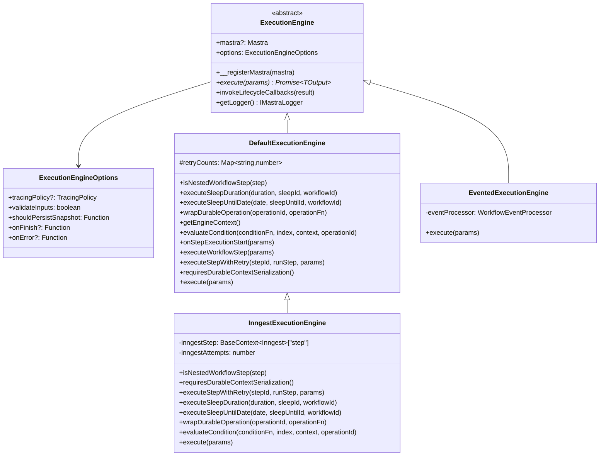
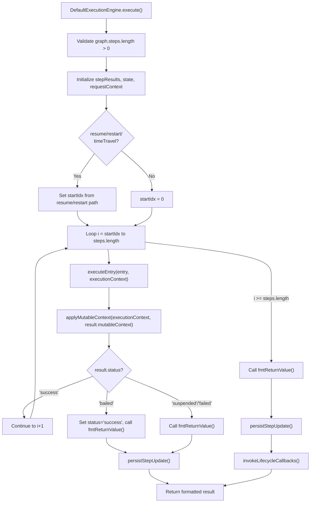
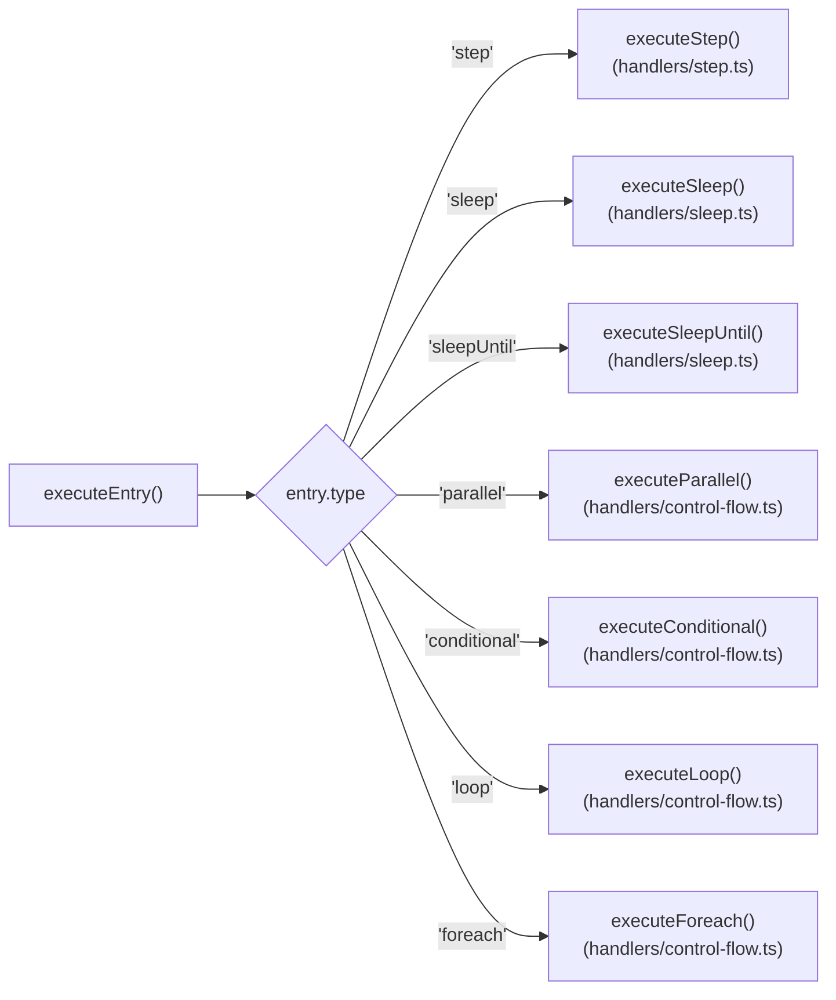
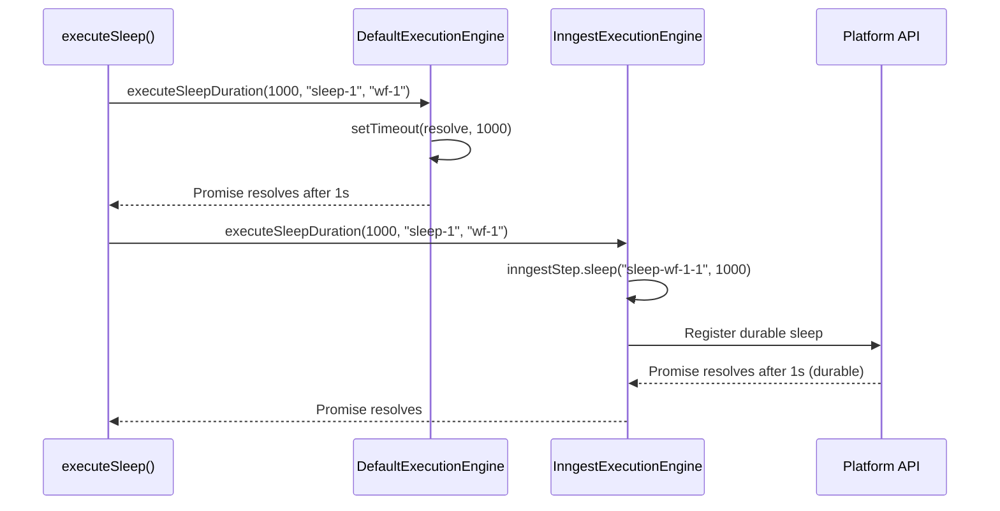
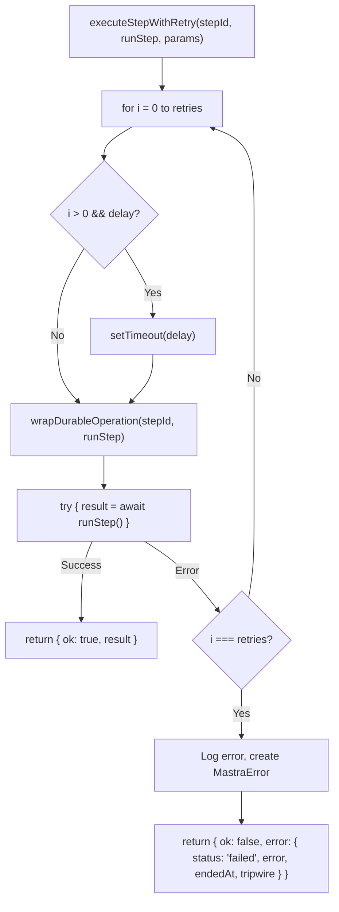
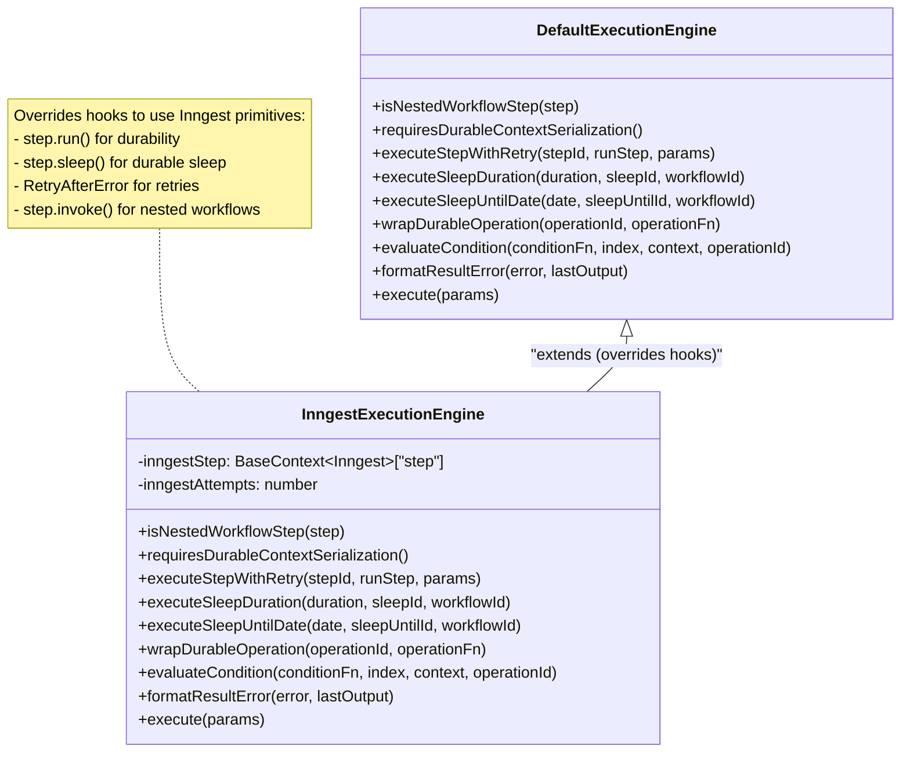
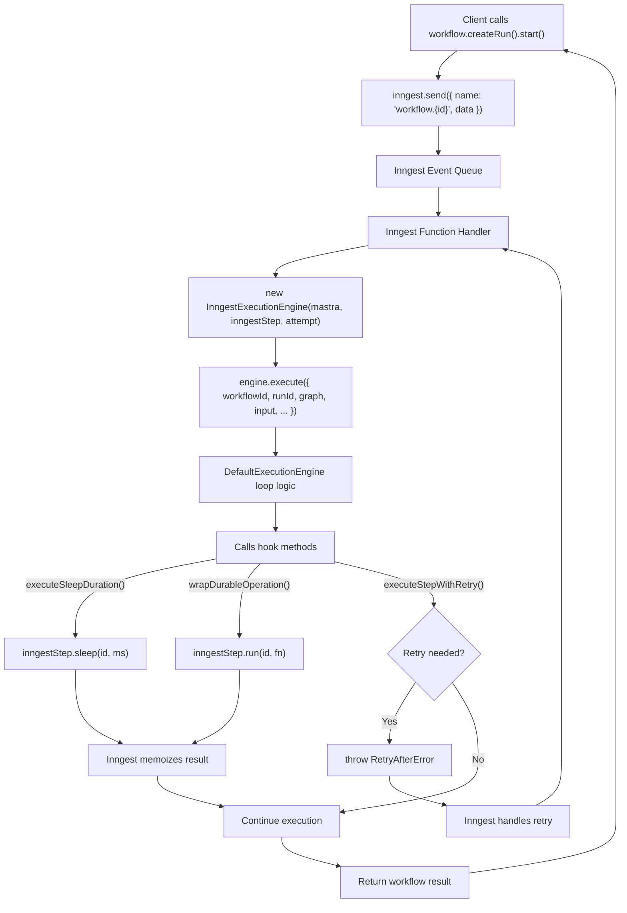
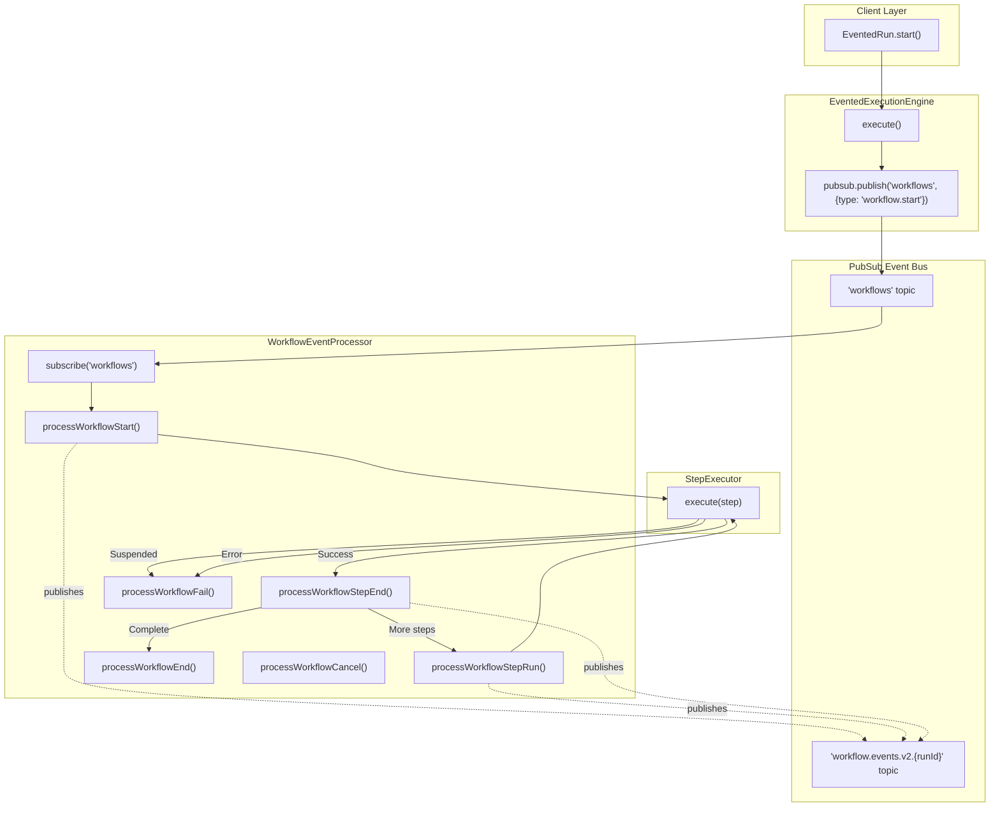
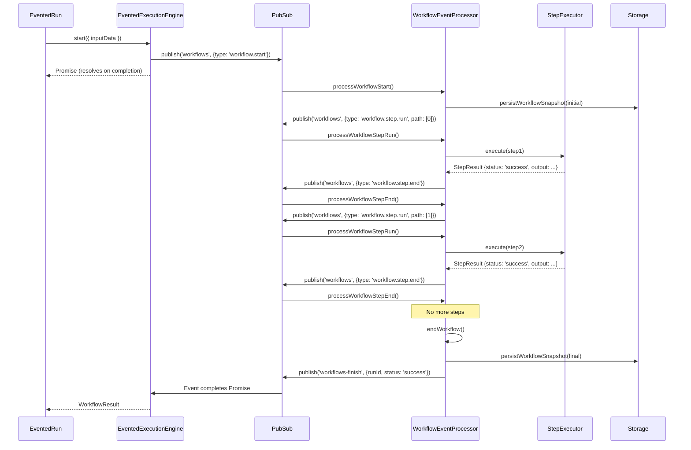

# Execution Engines

<details>
<summary>Relevant source files</summary>

The following files were used as context for generating this wiki page:

- [packages/core/src/workflows/default.ts](packages/core/src/workflows/default.ts)
- [packages/core/src/workflows/evented/evented-workflow.test.ts](packages/core/src/workflows/evented/evented-workflow.test.ts)
- [packages/core/src/workflows/evented/execution-engine.ts](packages/core/src/workflows/evented/execution-engine.ts)
- [packages/core/src/workflows/evented/step-executor.test.ts](packages/core/src/workflows/evented/step-executor.test.ts)
- [packages/core/src/workflows/evented/step-executor.ts](packages/core/src/workflows/evented/step-executor.ts)
- [packages/core/src/workflows/evented/workflow-event-processor/index.ts](packages/core/src/workflows/evented/workflow-event-processor/index.ts)
- [packages/core/src/workflows/evented/workflow.ts](packages/core/src/workflows/evented/workflow.ts)
- [packages/core/src/workflows/execution-engine.ts](packages/core/src/workflows/execution-engine.ts)
- [packages/core/src/workflows/step.ts](packages/core/src/workflows/step.ts)
- [packages/core/src/workflows/types.ts](packages/core/src/workflows/types.ts)
- [packages/core/src/workflows/utils.ts](packages/core/src/workflows/utils.ts)
- [packages/core/src/workflows/workflow.test.ts](packages/core/src/workflows/workflow.test.ts)
- [packages/core/src/workflows/workflow.ts](packages/core/src/workflows/workflow.ts)
- [workflows/inngest/src/execution-engine.ts](workflows/inngest/src/execution-engine.ts)
- [workflows/inngest/src/index.test.ts](workflows/inngest/src/index.test.ts)
- [workflows/inngest/src/index.ts](workflows/inngest/src/index.ts)
- [workflows/inngest/src/run.ts](workflows/inngest/src/run.ts)
- [workflows/inngest/src/workflow.ts](workflows/inngest/src/workflow.ts)

</details>

Execution engines orchestrate workflow runs by managing step execution order, state persistence, control flow patterns, and platform-specific durability primitives. Mastra provides three execution engines: `DefaultExecutionEngine` for in-memory execution, `InngestExecutionEngine` for durable serverless execution, and `EventedExecutionEngine` for event-driven distributed execution.

The engine abstraction uses a hook pattern that allows subclasses to override specific behaviors while inheriting common execution logic. This enables engines to integrate with platform-specific primitives (like Inngest's `step.run()` or sleep APIs) without duplicating workflow orchestration code.

## ExecutionEngine Base Class

The `ExecutionEngine` abstract class defines the interface all engines implement and provides lifecycle callback management. Engines must implement the `execute()` method to orchestrate workflow runs.

### Class Hierarchy



**Sources:** [packages/core/src/workflows/execution-engine.ts:1-178](), [packages/core/src/workflows/default.ts:52-1148](), [workflows/inngest/src/execution-engine.ts:20-287](), [packages/core/src/workflows/evented/execution-engine.ts:19-218]()

### Execute Method Signature

The `execute()` method orchestrates a complete workflow run:

| Parameter             | Type                         | Description                            |
| --------------------- | ---------------------------- | -------------------------------------- |
| `workflowId`          | `string`                     | Unique workflow identifier             |
| `runId`               | `string`                     | Unique run identifier                  |
| `resourceId`          | `string?`                    | Optional resource scoping identifier   |
| `disableScorers`      | `boolean?`                   | Disable evaluation scorers             |
| `graph`               | `ExecutionGraph`             | Execution graph with step flow entries |
| `serializedStepGraph` | `SerializedStepFlowEntry[]`  | Serialized version for persistence     |
| `input`               | `TInput?`                    | Initial workflow input data            |
| `initialState`        | `TState?`                    | Initial workflow state                 |
| `restart`             | `RestartExecutionParams?`    | Restart from specific paths            |
| `timeTravel`          | `TimeTravelExecutionParams?` | Time-travel debugging parameters       |
| `resume`              | `object?`                    | Resume from suspended state            |
| `pubsub`              | `PubSub`                     | Event bus for streaming                |
| `requestContext`      | `RequestContext`             | Per-request context map                |
| `workflowSpan`        | `Span?`                      | Observability span                     |
| `retryConfig`         | `object?`                    | Retry attempts and delay               |
| `abortController`     | `AbortController`            | Cancellation control                   |
| `outputWriter`        | `OutputWriter?`              | Stream output writer                   |
| `format`              | `'legacy'\|'vnext'?`         | Streaming format                       |
| `outputOptions`       | `object?`                    | Output formatting options              |
| `perStep`             | `boolean?`                   | Execute single step and pause          |

**Sources:** [packages/core/src/workflows/execution-engine.ts:142-177]()

### Lifecycle Callbacks

Engines invoke `onFinish` and `onError` callbacks when workflows complete or fail. These callbacks run server-side without requiring client-side streaming.

```typescript
export interface ExecutionEngineOptions {
  onFinish?: (result: WorkflowFinishCallbackResult) => Promise<void> | void
  onError?: (errorInfo: WorkflowErrorCallbackInfo) => Promise<void> | void
}

export interface WorkflowFinishCallbackResult {
  status: WorkflowRunStatus
  result?: any
  error?: SerializedError
  steps: Record<string, StepResult<any, any, any, any>>
  tripwire?: StepTripwireInfo
}

export interface WorkflowErrorCallbackInfo {
  status: 'failed' | 'tripwire'
  error?: SerializedError
  steps: Record<string, StepResult<any, any, any, any>>
  tripwire?: StepTripwireInfo
}
```

The `invokeLifecycleCallbacks()` method calls these callbacks and catches errors to prevent propagation:

- `onFinish` is called for all terminal states (success, failed, suspended, tripwire)
- `onError` is called only for failure states (failed, tripwire)
- Errors thrown in callbacks are logged but do not affect workflow execution

**Sources:** [packages/core/src/workflows/execution-engine.ts:46-134](), [packages/core/src/workflows/types.ts:340-421]()

## DefaultExecutionEngine (In-Memory)

The `DefaultExecutionEngine` executes workflows synchronously in-memory within a single process. It implements the core execution logic and provides hook methods that subclasses can override to integrate with platform-specific primitives.

### Execution Flow

The `DefaultExecutionEngine.execute()` method coordinates workflow execution through the following flow:



The `executeEntry()` handler delegates to specialized handlers in `packages/core/src/workflows/handlers/`:



**Sources:** [packages/core/src/workflows/default.ts:611-1148](), [packages/core/src/workflows/handlers/entry.ts:23-290]()

### Execution Hook Pattern

The `DefaultExecutionEngine` defines hook methods that subclasses can override to customize behavior for platform-specific primitives. This pattern enables `InngestExecutionEngine` to use Inngest's `step.run()` and sleep APIs while inheriting the core execution logic.

#### Hook Methods

| Hook Method                                             | Purpose                             | Default Behavior                  |
| ------------------------------------------------------- | ----------------------------------- | --------------------------------- |
| `isNestedWorkflowStep(step)`                            | Detect nested workflows             | Returns `false`                   |
| `executeSleepDuration(duration, sleepId, workflowId)`   | Execute sleep for duration          | `setTimeout(resolve, duration)`   |
| `executeSleepUntilDate(date, sleepUntilId, workflowId)` | Execute sleep until date            | `setTimeout(resolve, date - now)` |
| `wrapDurableOperation(operationId, operationFn)`        | Wrap operation for durability       | Directly calls `operationFn()`    |
| `getEngineContext()`                                    | Provide engine context to steps     | Returns `{}`                      |
| `evaluateCondition(conditionFn, ...)`                   | Evaluate condition with durability  | Wraps in `wrapDurableOperation()` |
| `onStepExecutionStart(params)`                          | Handle step start                   | Emits event, returns timestamp    |
| `executeWorkflowStep(params)`                           | Execute nested workflow             | Returns `null` (use default)      |
| `executeStepWithRetry(stepId, runStep, params)`         | Execute with retry logic            | Loops with delay between attempts |
| `requiresDurableContextSerialization()`                 | Whether to serialize requestContext | Returns `false`                   |
| `formatResultError(error, lastOutput)`                  | Format error for result             | Returns `SerializedError`         |

**Sources:** [packages/core/src/workflows/default.ts:89-471]()

#### Hook Usage Example: Sleep Execution

The default engine uses `setTimeout`, while Inngest uses platform-specific sleep primitives:



**Sources:** [packages/core/src/workflows/default.ts:107-121](), [workflows/inngest/src/execution-engine.ts:140-154]()

### Step Execution with Retry

The `executeStepWithRetry()` hook wraps step execution with retry logic:



The default implementation loops internally. Subclasses can override to use platform-specific retry mechanisms. For example, `InngestExecutionEngine` throws `RetryAfterError` to delegate retries to Inngest.

**Sources:** [packages/core/src/workflows/default.ts:378-471](), [workflows/inngest/src/execution-engine.ts:91-137]()

### Context Serialization

The engine provides methods to serialize `RequestContext` for durable execution:

```typescript
// Serialize Map to plain object
serializeRequestContext(requestContext: RequestContext): Record<string, any> {
  const obj: Record<string, any> = {};
  requestContext.forEach((value, key) => {
    obj[key] = value;
  });
  return obj;
}

// Deserialize object back to Map
protected deserializeRequestContext(obj: Record<string, any>): RequestContext {
  return new Map(Object.entries(obj)) as unknown as RequestContext;
}
```

The `requiresDurableContextSerialization()` hook determines whether serialization is needed:

- Default engine: Returns `false` (passes by reference)
- Inngest engine: Returns `true` (required for memoization across replays)

**Sources:** [packages/core/src/workflows/default.ts:566-590]()

### Control Flow Implementation

Control flow patterns are implemented in separate handler modules under `packages/core/src/workflows/handlers/`:

| Pattern         | Handler Function       | Implementation                                                          |
| --------------- | ---------------------- | ----------------------------------------------------------------------- |
| **Sequential**  | `executeEntry()`       | Loop through `graph.steps` array sequentially                           |
| **Parallel**    | `executeParallel()`    | Execute steps with `Promise.all()`, merge results                       |
| **Conditional** | `executeConditional()` | Evaluate conditions via `evaluateCondition()` hook, execute first match |
| **Loop**        | `executeLoop()`        | Repeatedly execute step while condition is truthy                       |
| **ForEach**     | `executeForeach()`     | Map over input array with concurrency control                           |
| **Sleep**       | `executeSleep()`       | Call `executeSleepDuration()` hook                                      |
| **SleepUntil**  | `executeSleepUntil()`  | Call `executeSleepUntilDate()` hook or evaluate dynamic function        |

**Sources:** [packages/core/src/workflows/handlers/entry.ts:23-290](), [packages/core/src/workflows/handlers/control-flow.ts:1-658](), [packages/core/src/workflows/handlers/sleep.ts:1-202]()

### State Persistence

The `persistStepUpdate()` handler persists workflow snapshots to storage:

```typescript
await this.mastra
  ?.getStorage()
  ?.getStore('workflows')
  ?.persistWorkflowSnapshot({
    workflowName: params.workflowId,
    runId: params.runId,
    resourceId: params.resourceId,
    snapshot: {
      runId: params.runId,
      status: params.workflowStatus,
      value: params.executionContext.state,
      context: params.stepResults,
      activePaths: [],
      activeStepsPath: params.executionContext.activeStepsPath,
      serializedStepGraph: params.serializedStepGraph,
      suspendedPaths: params.executionContext.suspendedPaths,
      resumeLabels: params.executionContext.resumeLabels,
      waitingPaths: params.executionContext.waitingPaths,
      result: params.result,
      error: params.error,
      timestamp: Date.now(),
    },
  })
```

Persistence occurs:

- After each step completes (if `shouldPersistSnapshot()` returns `true`)
- When a step suspends
- When a step fails
- When the workflow completes or errors

**Sources:** [packages/core/src/workflows/handlers/entry.ts:242-289]()

## InngestExecutionEngine (Durable)

The `InngestExecutionEngine` extends `DefaultExecutionEngine` and overrides hooks to use Inngest's durable primitives. It wraps the default execution logic inside Inngest functions that survive process restarts and provide built-in retry handling.

### Architecture and Hook Overrides



#### Hook Overrides

The `InngestExecutionEngine` overrides key hooks to integrate with Inngest:

| Hook                                    | Override Behavior                                      |
| --------------------------------------- | ------------------------------------------------------ |
| `isNestedWorkflowStep()`                | Returns `true` if step is `InngestWorkflow` instance   |
| `requiresDurableContextSerialization()` | Returns `true` (needed for memoization)                |
| `executeStepWithRetry()`                | Throws `RetryAfterError` instead of looping internally |
| `executeSleepDuration()`                | Uses `inngestStep.sleep(id, duration)`                 |
| `executeSleepUntilDate()`               | Uses `inngestStep.sleepUntil(id, date)`                |
| `wrapDurableOperation()`                | Wraps in `inngestStep.run(id, fn)` for memoization     |
| `evaluateCondition()`                   | Wraps condition in `inngestStep.run()` for durability  |
| `formatResultError()`                   | Includes stack trace in serialized error               |

**Sources:** [workflows/inngest/src/execution-engine.ts:20-287]()

### Execution Model

The engine wraps default execution inside an Inngest function handler:



Key differences from default engine:

- All operations wrapped in `inngestStep.run()` for memoization
- Sleep uses `inngestStep.sleep()` for durable sleep
- Retries throw `RetryAfterError` to delegate to Inngest
- Nested workflows use `inngestStep.invoke()` instead of direct execution

**Sources:** [workflows/inngest/src/execution-engine.ts:253-287]()

### Retry Handling

The `InngestExecutionEngine` overrides `executeStepWithRetry()` to use Inngest's retry mechanism:

```typescript
async executeStepWithRetry<T>(
  stepId: string,
  runStep: () => Promise<T>,
  params: { retries: number; delay: number; ... }
): Promise<{ ok: true; result: T } | { ok: false; error: ... }> {
  const operationId = `retry-${stepId}`;
  try {
    const result = await this.wrapDurableOperation(operationId, runStep);
    return { ok: true, result };
  } catch (e) {
    // Check if this is a TripWire - don't retry those
    if (e instanceof TripWire) {
      return {
        ok: false,
        error: {
          status: 'failed',
          error: getErrorFromUnknown(e),
          endedAt: Date.now(),
          tripwire: { reason: e.message, ... }
        }
      };
    }

    // For other errors, check if we've exceeded retries
    const attempt = this.inngestAttempts;
    if (attempt < params.retries) {
      // Throw RetryAfterError to trigger Inngest retry
      throw new RetryAfterError(`Retrying step ${stepId}`, params.delay);
    }

    // Retries exhausted
    return { ok: false, error: { status: 'failed', error: ... } };
  }
}
```

This delegates retry scheduling to Inngest rather than handling it in-process.

**Sources:** [workflows/inngest/src/execution-engine.ts:91-137]()

### Registration and Flow Control

Workflows are registered via `serve()` which creates Inngest functions:

```typescript
export function serve({
  mastra,
  inngest,
  functions = [],
  registerOptions,
}: {
  mastra: Mastra
  inngest: Inngest
  functions?: InngestFunction.Like[]
  registerOptions?: RegisterOptions
}): ReturnType<typeof inngestServe>
```

Workflows can specify flow control configuration:

```typescript
export type InngestFlowControlConfig = Pick<
  InngestCreateFunctionConfig,
  'concurrency' | 'rateLimit' | 'throttle' | 'debounce' | 'priority'
>
```

**Sources:** [workflows/inngest/src/serve.ts:18-137](), [workflows/inngest/src/types.ts:8-49]()

### Nested Workflow Invocation

The engine detects nested `InngestWorkflow` instances and uses `inngestStep.invoke()` instead of direct execution:

```typescript
isNestedWorkflowStep(step: Step<any, any, any>): boolean {
  return step instanceof InngestWorkflow;
}

async executeWorkflowStep(params: {
  step: Step;
  inputData: any;
  // ...
}): Promise<StepResult | null> {
  if (!(params.step instanceof InngestWorkflow)) {
    return null; // Use default execution
  }

  // Use Inngest's native workflow invocation
  const result = await this.inngestStep.invoke(
    `invoke-workflow-${params.step.id}`,
    {
      function: params.step.function,
      data: { inputData: params.inputData, initialState: params.state },
    }
  );

  return {
    status: 'success',
    output: result.output,
    payload: params.inputData,
    startedAt: params.startedAt,
    endedAt: Date.now(),
  };
}
```

This enables nested workflows to run as independent Inngest functions with separate retry and durability semantics.

**Sources:** [workflows/inngest/src/execution-engine.ts:59-89](), [workflows/inngest/src/execution-engine.ts:156-223]()

## EventedExecutionEngine (Event-Driven)

The `EventedExecutionEngine` orchestrates workflows through PubSub events. Instead of executing steps directly, the engine publishes events that trigger step execution in separate event handlers. This enables distributed execution and automatic crash recovery.

### Architecture



**Sources:** [packages/core/src/workflows/evented/execution-engine.ts:19-218](), [packages/core/src/workflows/evented/workflow-event-processor/index.ts:1-652]()

### Event Types and Flow

The `WorkflowEventProcessor` handles these event types:

| Event Type          | Trigger                       | Handler                    |
| ------------------- | ----------------------------- | -------------------------- |
| `workflow.start`    | `EventedRun.start()`          | `processWorkflowStart()`   |
| `workflow.step.run` | Step ready to execute         | `processWorkflowStepRun()` |
| `workflow.step.end` | Step completed                | `processWorkflowStepEnd()` |
| `workflow.fail`     | Step failed or workflow error | `processWorkflowFail()`    |
| `workflow.end`      | Workflow completed            | `processWorkflowEnd()`     |
| `workflow.resume`   | Resume suspended workflow     | `processWorkflowResume()`  |
| `workflow.cancel`   | Cancel workflow               | `processWorkflowCancel()`  |

**Sources:** [packages/core/src/workflows/evented/workflow-event-processor/index.ts:156-651]()

### Event Processing Example



**Sources:** [packages/core/src/workflows/evented/workflow-event-processor/index.ts:243-651]()

### Crash Recovery and Cancellation

The event-driven model provides automatic crash recovery. If a process crashes mid-execution, the next event in the queue triggers continuation from the last persisted snapshot.

The processor tracks abort controllers and parent-child relationships for cancellation propagation:

```typescript
class WorkflowEventProcessor {
  private abortControllers: Map<string, AbortController> = new Map()
  private parentChildRelationships: Map<string, string> = new Map()

  private cancelRunAndChildren(runId: string): void {
    // Abort controller for this run
    const controller = this.abortControllers.get(runId)
    if (controller) {
      controller.abort()
    }

    // Recursively cancel child workflows
    for (const [
      childRunId,
      parentRunId,
    ] of this.parentChildRelationships.entries()) {
      if (parentRunId === runId) {
        this.cancelRunAndChildren(childRunId)
      }
    }
  }
}
```

When `workflow.cancel` event is published, the processor cancels the run and all nested child workflows.

**Sources:** [packages/core/src/workflows/evented/workflow-event-processor/index.ts:64-119](), [packages/core/src/workflows/evented/workflow-event-processor/index.ts:156-186]()

### Control Flow Implementation

Control flow patterns in the evented engine use specialized handler functions:

| Pattern         | Handler                        | Approach                                                            |
| --------------- | ------------------------------ | ------------------------------------------------------------------- |
| **Parallel**    | `processWorkflowParallel()`    | Execute steps with `Promise.all()`, merge results into single event |
| **Conditional** | `processWorkflowConditional()` | Evaluate conditions, publish `workflow.step.run` for first match    |
| **Loop**        | `processWorkflowLoop()`        | Execute step, evaluate condition, publish repeat or end event       |
| **ForEach**     | `processWorkflowForEach()`     | Map over input array with concurrency limit, merge results          |
| **Sleep**       | `processWorkflowSleep()`       | `setTimeout()`, then publish `workflow.step.end`                    |
| **SleepUntil**  | `processWorkflowSleepUntil()`  | `setTimeout(date - now)`, then publish `workflow.step.end`          |

**Sources:** [packages/core/src/workflows/evented/workflow-event-processor/parallel.ts:1-206](), [packages/core/src/workflows/evented/workflow-event-processor/loop.ts:1-221](), [packages/core/src/workflows/evented/workflow-event-processor/sleep.ts:1-144]()

## Comparison and Selection

### Engine Comparison Matrix

| Feature                   | DefaultExecutionEngine  | InngestExecutionEngine        | EventedExecutionEngine        |
| ------------------------- | ----------------------- | ----------------------------- | ----------------------------- |
| **Execution Model**       | In-memory loop          | Inngest function with hooks   | Event-driven PubSub           |
| **Durability**            | Process-bound           | Survives restarts (Inngest)   | Survives restarts (PubSub)    |
| **State Persistence**     | Optional (configurable) | Automatic (Inngest + Storage) | Automatic (Storage)           |
| **Retry Handling**        | Internal loop           | Delegates to Inngest          | Internal loop                 |
| **Nested Workflows**      | Direct execution        | `inngestStep.invoke()`        | Nested event streams          |
| **Sleep Primitives**      | `setTimeout()`          | `inngestStep.sleep()`         | `setTimeout()`                |
| **Scalability**           | Single process          | Horizontal (Inngest workers)  | Horizontal (PubSub consumers) |
| **External Dependencies** | None                    | Inngest platform              | PubSub implementation         |
| **Crash Recovery**        | No                      | Yes (Inngest)                 | Yes (PubSub + Storage)        |
| **Cancellation**          | AbortController         | Inngest cancellation          | PubSub + AbortController tree |
| **Flow Control Config**   | N/A                     | Concurrency, rate limit, etc. | N/A                           |
| **Best For**              | Simple workflows, dev   | Production, long-running      | Distributed, event-driven     |

### Usage Examples

**DefaultExecutionEngine (implicit):**

```typescript
import { createWorkflow } from '@mastra/core/workflows'

const workflow = createWorkflow({
  id: 'my-workflow',
  inputSchema: z.object({ input: z.string() }),
  outputSchema: z.object({ result: z.string() }),
  // No executionEngine specified - uses DefaultExecutionEngine
})

const mastra = new Mastra({
  workflows: { 'my-workflow': workflow },
})
```

**InngestExecutionEngine:**

```typescript
import { Inngest } from 'inngest'
import { init, serve as inngestServe } from '@mastra/inngest'

const inngest = new Inngest({ id: 'my-app' })
const { createWorkflow, createStep } = init(inngest)

const workflow = createWorkflow({
  id: 'my-workflow',
  inputSchema: z.object({ input: z.string() }),
  outputSchema: z.object({ result: z.string() }),
  steps: [
    /* ... */
  ],
  // Optional flow control
  concurrency: { limit: 10 },
  rateLimit: { limit: 100, period: '1m' },
})

const mastra = new Mastra({
  workflows: { 'my-workflow': workflow },
  server: {
    apiRoutes: [
      {
        path: '/inngest/api',
        method: 'ALL',
        createHandler: async ({ mastra }) => inngestServe({ mastra, inngest }),
      },
    ],
  },
})
```

**EventedExecutionEngine:**

```typescript
import { createWorkflow } from '@mastra/core/workflows/evented'
import { EventEmitterPubSub } from '@mastra/core/events'

const workflow = createWorkflow({
  id: 'my-workflow',
  inputSchema: z.object({ input: z.string() }),
  outputSchema: z.object({ result: z.string() }),
  mastra, // Required for evented workflows
})

const mastra = new Mastra({
  workflows: { 'my-workflow': workflow },
  pubsub: new EventEmitterPubSub(),
})

await mastra.startEventEngine() // Start event processor
```

**Sources:** [packages/core/src/workflows/workflow.ts:2117-2150](), [workflows/inngest/src/index.ts:202-230](), [packages/core/src/workflows/evented/workflow.ts:636-665]()

## Custom Execution Engines

You can implement custom execution engines by extending the `ExecutionEngine` abstract class:

```typescript
import { ExecutionEngine, type ExecutionGraph } from '@mastra/core/workflows'

class MyCustomEngine extends ExecutionEngine {
  async execute<TState, TInput, TOutput>(params: {
    workflowId: string
    runId: string
    graph: ExecutionGraph
    input?: TInput
    initialState?: TState
    // ... other params
  }): Promise<TOutput> {
    // 1. Validate execution graph
    if (params.graph.steps.length === 0) {
      throw new Error('Empty workflow graph')
    }

    // 2. Initialize state and step results
    const stepResults: Record<string, StepResult> = {
      input: params.input,
    }

    // 3. Execute steps according to your orchestration logic
    for (const entry of params.graph.steps) {
      // Your step execution logic here
      // - Handle different entry types (step, parallel, conditional, etc.)
      // - Manage state and context
      // - Emit events for monitoring
      // - Persist snapshots
    }

    // 4. Return workflow result
    return {
      status: 'success',
      steps: stepResults,
      result: finalOutput,
    } as TOutput
  }
}

// Use custom engine
const workflow = createWorkflow({
  id: 'custom-workflow',
  executionEngine: new MyCustomEngine({
    mastra,
    options: {
      validateInputs: true,
      shouldPersistSnapshot: () => true,
    },
  }),
  // ... workflow configuration
})
```

Key responsibilities of a custom execution engine:

1. **Step Execution**: Coordinate execution of workflow steps in the correct order
2. **State Management**: Track and update workflow state throughout execution
3. **Control Flow**: Implement parallel, conditional, loop, and other control flow patterns
4. **Event Emission**: Emit events for monitoring and streaming (via `emitter` parameter)
5. **State Persistence**: Save workflow snapshots for resume capability
6. **Error Handling**: Catch and process step failures, convert to appropriate result types
7. **Tracing**: Create and manage AI spans for observability (via `workflowAISpan` parameter)
8. **Abort Handling**: Respect abort signals for cancellation (via `abortController` parameter)

**Sources:** [packages/core/src/workflows/execution-engine.ts:29-84](), [packages/core/src/workflows/default.ts:60-410]()
