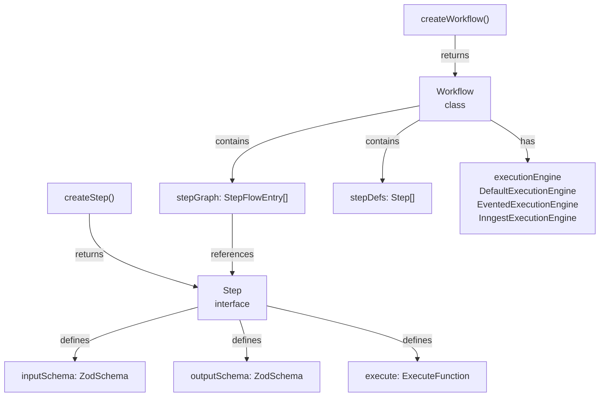
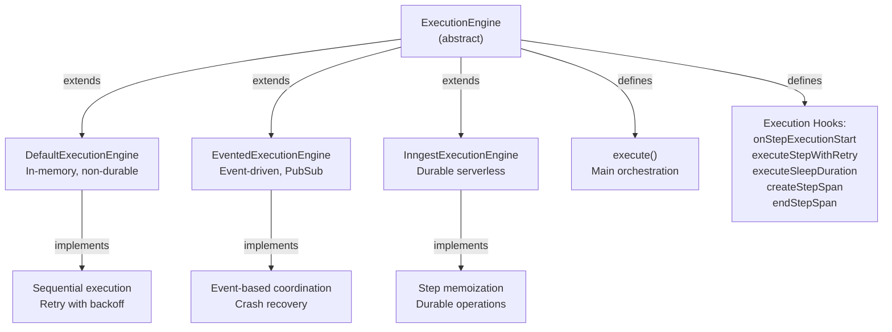
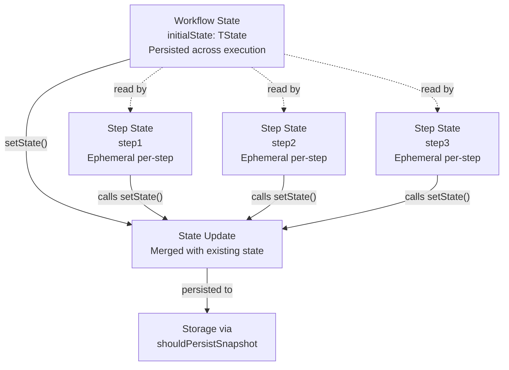
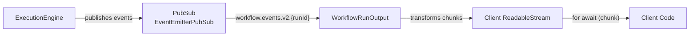

# Workflow System

<details>
<summary>Relevant source files</summary>

The following files were used as context for generating this wiki page:

- [packages/core/src/workflows/default.ts](packages/core/src/workflows/default.ts)
- [packages/core/src/workflows/evented/evented-workflow.test.ts](packages/core/src/workflows/evented/evented-workflow.test.ts)
- [packages/core/src/workflows/evented/execution-engine.ts](packages/core/src/workflows/evented/execution-engine.ts)
- [packages/core/src/workflows/evented/step-executor.test.ts](packages/core/src/workflows/evented/step-executor.test.ts)
- [packages/core/src/workflows/evented/step-executor.ts](packages/core/src/workflows/evented/step-executor.ts)
- [packages/core/src/workflows/evented/workflow-event-processor/index.ts](packages/core/src/workflows/evented/workflow-event-processor/index.ts)
- [packages/core/src/workflows/evented/workflow.ts](packages/core/src/workflows/evented/workflow.ts)
- [packages/core/src/workflows/execution-engine.ts](packages/core/src/workflows/execution-engine.ts)
- [packages/core/src/workflows/step.ts](packages/core/src/workflows/step.ts)
- [packages/core/src/workflows/types.ts](packages/core/src/workflows/types.ts)
- [packages/core/src/workflows/utils.ts](packages/core/src/workflows/utils.ts)
- [packages/core/src/workflows/workflow.test.ts](packages/core/src/workflows/workflow.test.ts)
- [packages/core/src/workflows/workflow.ts](packages/core/src/workflows/workflow.ts)
- [workflows/inngest/src/execution-engine.ts](workflows/inngest/src/execution-engine.ts)
- [workflows/inngest/src/index.test.ts](workflows/inngest/src/index.test.ts)
- [workflows/inngest/src/index.ts](workflows/inngest/src/index.ts)
- [workflows/inngest/src/run.ts](workflows/inngest/src/run.ts)
- [workflows/inngest/src/workflow.ts](workflows/inngest/src/workflow.ts)

</details>

## Purpose and Scope

The Workflow System provides multi-step orchestration capabilities for executing sequences of operations involving agents, tools, and custom logic. Workflows define directed acyclic graphs (DAGs) of steps with support for control flow patterns (sequential, parallel, conditional, iteration), state management, suspend/resume mechanisms, and streaming execution. This document covers workflow definition, execution engines, state management, and control flow patterns.

For information about individual Agent execution within workflows, see [Agent System](#3). For tool integration, see [Tool System](#6). For workflow deployment and HTTP APIs, see [Server and API Layer](#9).

**Sources:** [packages/core/src/workflows/workflow.ts:1-1130](), [packages/core/src/workflows/types.ts:1-789]()

---

## Workflow and Step Definition

### Core Components

Workflows are created using `createWorkflow` and composed of steps created with `createStep`. The `Workflow` class manages the step graph and execution lifecycle, while individual `Step` objects define units of work with typed inputs, outputs, and execution logic.



**Sources:** [packages/core/src/workflows/workflow.ts:1168-1397](), [packages/core/src/workflows/step.ts:144-172]()

### Step Creation Patterns

The `createStep` function supports multiple input patterns through TypeScript overloads, enabling flexible step composition from different primitives:

| Input Type        | Output Type                                  | Example Usage                   |
| ----------------- | -------------------------------------------- | ------------------------------- |
| `StepParams`      | `Step`                                       | Custom logic with typed schemas |
| `Agent`           | `Step<{ prompt: string }, { text: string }>` | Agent execution                 |
| `Agent` + options | `Step<{ prompt: string }, TOutput>`          | Agent with structured output    |
| `Tool`            | `Step<TInput, TOutput>`                      | Tool execution                  |
| `Processor`       | `Step<ProcessorInput, ProcessorOutput>`      | Processor wrapper               |

```typescript
// StepParams pattern (custom logic)
const customStep = createStep({
  id: 'custom-step',
  inputSchema: z.object({ value: z.string() }),
  outputSchema: z.object({ result: z.string() }),
  execute: async ({ inputData }) => ({ result: inputData.value }),
})

// Agent pattern
const agentStep = createStep(myAgent)

// Agent with structured output
const structuredStep = createStep(myAgent, {
  structuredOutput: { schema: z.object({ answer: z.string() }) },
})

// Tool pattern
const toolStep = createStep(myTool)
```

**Sources:** [packages/core/src/workflows/workflow.ts:146-308](), [packages/core/src/workflows/workflow.ts:314-570]()

### Workflow Configuration Schema

The `WorkflowConfig` interface defines all configuration options for workflow initialization:

```typescript
interface WorkflowConfig<TWorkflowId, TState, TInput, TOutput, TSteps> {
  id: TWorkflowId // Unique workflow identifier
  description?: string // Human-readable description
  inputSchema: SchemaWithValidation<TInput> // Workflow input schema
  outputSchema: SchemaWithValidation<TOutput> // Workflow output schema
  stateSchema?: SchemaWithValidation<TState> // Workflow state schema
  requestContextSchema?: SchemaWithValidation // Request context validation
  executionEngine?: ExecutionEngine // Custom execution engine
  steps?: TSteps // Step definitions array
  retryConfig?: { attempts?: number; delay?: number }
  options?: WorkflowOptions // Lifecycle callbacks, validation
  type?: 'default' | 'processor' // Workflow categorization
}
```

**Sources:** [packages/core/src/workflows/types.ts:718-747]()

---

## Execution Engines

### ExecutionEngine Abstract Class

All workflow execution flows through the `ExecutionEngine` abstract class, which defines hooks for customizing execution behavior. Subclasses override methods to implement different execution strategies:



**Sources:** [packages/core/src/workflows/execution-engine.ts:18-177](), [packages/core/src/workflows/default.ts:52-603]()

### DefaultExecutionEngine

The `DefaultExecutionEngine` provides in-memory, non-durable workflow execution with synchronous retry logic. It executes the workflow graph sequentially, handling retries internally without external orchestration:

**Key Methods:**

- `execute()` - Main orchestration loop [packages/core/src/workflows/default.ts:609-1069]()
- `executeStepWithRetry()` - Internal retry loop with exponential backoff [packages/core/src/workflows/default.ts:388-471]()
- `executeSleepDuration()` - JavaScript `setTimeout` for delays [packages/core/src/workflows/default.ts:107-109]()
- `fmtReturnValue()` - Format final workflow result [packages/core/src/workflows/default.ts:487-557]()

**Execution Flow:**

1. Validate workflow input against `inputSchema`
2. Initialize execution context and step results
3. Traverse step graph sequentially
4. Execute each step via `executeEntry()`
5. Handle retries with configurable delay
6. Format and return final result

**Sources:** [packages/core/src/workflows/default.ts:52-1069]()

### EventedExecutionEngine

The `EventedExecutionEngine` uses event-driven architecture with PubSub for distributed execution. Workflow state is persisted via snapshots, enabling crash recovery and distributed coordination:

**Key Components:**

- `EventedExecutionEngine` - Publishes workflow start/resume events [workflows/evented/src/execution-engine.ts:19-224]()
- `WorkflowEventProcessor` - Processes workflow events and coordinates execution [packages/core/src/workflows/evented/workflow-event-processor/index.ts:63-697]()
- `StepExecutor` - Executes individual steps [packages/core/src/workflows/evented/step-executor.ts:20-279]()

**Event Types:**

- `workflow.start` - Begin new workflow execution
- `workflow.resume` - Resume suspended workflow
- `workflow.step` - Execute next step
- `workflow.end` - Workflow completed successfully
- `workflow.fail` - Workflow execution failed
- `workflow.suspend` - Workflow suspended for input

**Snapshot Persistence:**
Workflow state is saved to storage after each step via `shouldPersistSnapshot` callback, enabling recovery from crashes or restarts.

**Sources:** [packages/core/src/workflows/evented/execution-engine.ts:19-224](), [packages/core/src/workflows/evented/workflow-event-processor/index.ts:25-697]()

### InngestExecutionEngine

The `InngestExecutionEngine` provides durable serverless execution using Inngest's step memoization. Completed steps are cached and return cached results on workflow replay, ensuring fault tolerance across function invocations:

**Durability Features:**

- **Step Memoization** - Completed steps skip re-execution on replay
- **Durable Operations** - Sleep, sleep-until, and dynamic functions wrapped in `inngestStep.run()`
- **Nested Workflow Invocation** - Child workflows via `inngestStep.invoke()` [workflows/inngest/src/execution-engine.ts:210-310]()
- **Result Polling** - Parent workflows poll child completion via Inngest API

**Span Durability:**
Tracing spans are created and ended via durable operations to maintain observability across replays:

```typescript
// Create span durably
await createStepSpan({
  parentSpan,
  stepId,
  operationId: `${stepId}-span-create`,
  options: { name, type, input },
})

// End span durably
await endStepSpan({
  span,
  operationId: `${stepId}-span-end`,
  endOptions: { output },
})
```

**Sources:** [workflows/inngest/src/execution-engine.ts:8-701](), [workflows/inngest/src/workflow.ts:1-1036]()

---

## Step Execution Context

### ExecuteFunctionParams Interface

Every step's `execute` function receives a comprehensive context object (`ExecuteFunctionParams`) with workflow state, dependencies, and control flow utilities:

```typescript
interface ExecuteFunctionParams<TState, TInput, TOutput, TResume, TSuspend> {
  // Identifiers
  runId: string
  workflowId: string
  resourceId?: string

  // Dependencies
  mastra: Mastra
  requestContext: RequestContext
  tracingContext: TracingContext

  // Data
  inputData: TInput
  state: TState
  resumeData?: TResume
  suspendData?: TSuspend
  retryCount: number

  // State Management
  setState(state: TState): Promise<void>

  // Control Flow
  suspend: (suspendPayload: TSuspend, options?: SuspendOptions) => InnerOutput
  bail(result: TOutput): InnerOutput
  abort(): void

  // Querying
  getInitData<T>(): T
  getStepResult<TStep>(step: TStep): OutputType

  // Streaming
  writer: ToolStream
  outputWriter?: OutputWriter
  abortSignal: AbortSignal

  // Engine-specific
  engine: EngineType
}
```

**Sources:** [packages/core/src/workflows/step.ts:23-67]()

### Step Result Types

Step execution produces discriminated union types representing different terminal states:

| Status      | Type            | Fields                                                  |
| ----------- | --------------- | ------------------------------------------------------- |
| `success`   | `StepSuccess`   | `output`, `payload`, `startedAt`, `endedAt`             |
| `failed`    | `StepFailure`   | `error`, `payload`, `startedAt`, `endedAt`, `tripwire?` |
| `suspended` | `StepSuspended` | `suspendPayload`, `payload`, `startedAt`, `suspendedAt` |
| `running`   | `StepRunning`   | `payload`, `startedAt`                                  |
| `waiting`   | `StepWaiting`   | `payload`, `startedAt`                                  |
| `paused`    | `StepPaused`    | `payload`, `startedAt`                                  |

**TripWire Support:**
When a step fails due to processor rejection, the `StepFailure` includes `tripwire` metadata with rejection reason, retry flag, and processor ID:

```typescript
interface StepTripwireInfo {
  reason: string
  retry?: boolean
  metadata?: Record<string, unknown>
  processorId?: string
}
```

**Sources:** [packages/core/src/workflows/types.ts:53-160]()

---

## Workflow State Management

### State Architecture

Workflows maintain two distinct state layers: **workflow state** (shared across all steps) and **step state** (per-step ephemeral data):



**Sources:** [packages/core/src/workflows/types.ts:36-39](), [packages/core/src/workflows/workflow.ts:1672-1684]()

### State Schema Validation

Workflows can define `stateSchema` to enforce type safety on state mutations:

```typescript
const workflow = createWorkflow({
  id: 'stateful-workflow',
  inputSchema: z.object({ input: z.string() }),
  outputSchema: z.object({ output: z.string() }),
  stateSchema: z.object({
    counter: z.number(),
    accumulated: z.array(z.string()),
  }),
  steps: [step1, step2],
})

// In step execution
const step1 = createStep({
  id: 'step1',
  stateSchema: z.object({ counter: z.number() }), // Subset of workflow state
  execute: async ({ state, setState }) => {
    await setState({ counter: state.counter + 1 })
    return { result: 'done' }
  },
})
```

**State Subset Validation:**
Step `stateSchema` must be a subset of workflow `stateSchema`, enforced via the `SubsetOf` utility type:

**Sources:** [packages/core/src/workflows/types.ts:758-778](), [packages/core/src/workflows/workflow.ts:1402-1453]()

### Persistence Strategy

State persistence is controlled by the `shouldPersistSnapshot` callback in `WorkflowOptions`:

```typescript
const workflow = createWorkflow({
  id: 'my-workflow',
  options: {
    shouldPersistSnapshot: ({ stepResults, workflowStatus }) => {
      // Persist on every step completion
      return true

      // Or persist only on terminal states
      return ['success', 'failed', 'suspended'].includes(workflowStatus)
    },
  },
})
```

**Default Behavior:**
If not specified, defaults to persisting on every step completion in `DefaultExecutionEngine` [packages/core/src/workflows/default.ts:939-963]().

**Sources:** [packages/core/src/workflows/types.ts:400-421]()

---

## Control Flow Patterns

### Sequential Execution (then)

The `then()` method chains steps sequentially, where each step receives the previous step's output as input:

```typescript
workflow
  .then(step1) // Executes first
  .then(step2) // Receives step1's output
  .then(step3) // Receives step2's output
  .commit()
```

**Data Mapping:**
Use `map()` to transform data between steps:

```typescript
workflow
  .then(step1)
  .map({
    targetField: { step: step1, path: 'sourceField' },
  })
  .then(step2)
  .commit()
```

**Sources:** [packages/core/src/workflows/workflow.ts:1455-1508](), [packages/core/src/workflows/workflow.ts:1510-1580]()

### Parallel Execution

The `parallel()` method executes multiple steps concurrently and aggregates results:

```typescript
workflow
  .then(startStep)
  .parallel([step1, step2, step3])
  .then(aggregateStep) // Receives { step1: output1, step2: output2, step3: output3 }
  .commit()
```

**Execution Semantics:**

- All steps execute concurrently
- Results aggregated into object keyed by step ID
- Failure in any step fails the entire parallel block

**Sources:** [packages/core/src/workflows/workflow.ts:1582-1641]()

### Conditional Branching (branch)

The `branch()` method executes one step based on conditional functions:

```typescript
workflow
  .then(setupStep)
  .branch([
    { condition: async ({ inputData }) => inputData.type === 'A', step: stepA },
    { condition: async ({ inputData }) => inputData.type === 'B', step: stepB },
  ])
  .then(finalStep)
  .commit()
```

**Evaluation Order:**
Conditions evaluated sequentially; first truthy condition's step executes. If no conditions match, workflow continues without executing any branch step.

**Sources:** [packages/core/src/workflows/workflow.ts:1643-1723]()

### Iteration (foreach)

The `foreach()` method iterates over array elements, executing a step for each item:

```typescript
workflow
  .then(prepareItems) // Returns { items: [1, 2, 3] }
  .foreach(processItem, {
    concurrency: 2, // Process 2 items at a time
    map: { items: { step: prepareItems, path: 'items' } },
  })
  .then(aggregateResults) // Receives array of outputs
  .commit()
```

**Concurrency Control:**
The `concurrency` option limits parallel execution. Default is unlimited concurrency.

**Sources:** [packages/core/src/workflows/workflow.ts:1725-1814]()

### Sleep and Delays

#### Static Sleep

The `sleep()` method pauses execution for a fixed duration:

```typescript
workflow
  .then(sendEmail)
  .sleep(5000) // Wait 5 seconds
  .then(checkDelivery)
  .commit()
```

#### Dynamic Sleep

Provide a function to compute sleep duration at runtime:

```typescript
workflow
  .then(sendEmail)
  .sleep(async ({ state }) => state.retryDelay * 1000)
  .then(checkDelivery)
  .commit()
```

#### Sleep Until

The `sleepUntil()` method pauses until a specific date/time:

```typescript
workflow
  .then(scheduleTask)
  .sleepUntil(new Date('2024-12-31T23:59:59Z'))
  .then(executeTask)
  .commit()
```

**Sources:** [packages/core/src/workflows/workflow.ts:1816-1877](), [packages/core/src/workflows/workflow.ts:1879-1930]()

### Loop Constructs

#### Do-While Loop

Executes step at least once, then repeats while condition is true:

```typescript
workflow
  .then(initialize)
  .dowhile(retryStep, async ({ iterationCount, getStepResult }) => {
    const lastResult = getStepResult(retryStep)
    return lastResult.success === false && iterationCount < 3
  })
  .commit()
```

#### Do-Until Loop

Executes step at least once, then repeats until condition becomes true:

```typescript
workflow
  .then(initialize)
  .dountil(pollStep, async ({ getStepResult }) => {
    const result = getStepResult(pollStep)
    return result.status === 'complete'
  })
  .commit()
```

**Sources:** [packages/core/src/workflows/workflow.ts:1932-2002](), [packages/core/src/workflows/workflow.ts:2004-2064]()

---

## Suspend and Resume Mechanism

### Suspension API

Steps can suspend workflow execution to wait for external input using the `suspend()` function:

```typescript
const approvalStep = createStep({
  id: 'approval',
  execute: async ({ suspend, resumeData }) => {
    if (!resumeData) {
      // First invocation - suspend and wait for approval
      await suspend(
        { taskId: 'task-123' }, // Suspend payload
        { resumeLabel: 'approval-required' } // Optional label
      )
    }
    // Second invocation - resumeData contains approval decision
    return { approved: resumeData.approved }
  },
})
```

**Suspension Behavior:**

1. When `suspend()` is called, step execution halts and workflow enters `suspended` state
2. Workflow state is persisted via `shouldPersistSnapshot`
3. Client receives `suspended` status with `suspendPayload`
4. External system processes suspend payload and provides resume data
5. Workflow resumes from suspended step with `resumeData`

**Sources:** [packages/core/src/workflows/step.ts:13-20](), [packages/core/src/workflows/workflow.test.ts:171-312]()

### Resume Patterns

#### Resume by Step

Resume execution by specifying the suspended step:

```typescript
const run = await workflow.createRun({ runId: 'run-123' })

// Initial execution
const result1 = await run.start({ inputData: {} })
// result1.status === 'suspended'

// Resume by step reference
await run.resume({
  step: approvalStep,
  resumeData: { approved: true },
})

// Continue streaming
const { stream, getWorkflowState } = run.streamLegacy()
const result2 = await getWorkflowState()
// result2.status === 'success'
```

#### Resume by Label

Resume using the label specified in `suspend()` call:

```typescript
await suspend({ taskId: 'task-123' }, { resumeLabel: 'approval-required' })

// Resume by label
await run.resume({
  label: 'approval-required',
  resumeData: { approved: true },
})
```

**Multiple Suspend Points:**
Labels enable resuming specific suspend points when a step suspends multiple times:

```typescript
const multiSuspendStep = createStep({
  id: 'multi',
  execute: async ({ suspend, resumeData }) => {
    if (!resumeData?.step1) {
      await suspend({}, { resumeLabel: 'step1' })
    }
    if (!resumeData?.step2) {
      await suspend({}, { resumeLabel: 'step2' })
    }
    return { done: true }
  },
})
```

**Sources:** [packages/core/src/workflows/workflow.test.ts:314-455](), [packages/core/src/workflows/workflow.ts:2338-2476]()

### Suspend Payload Metadata

Internal workflow metadata is attached to suspend payloads via `__workflow_meta` field, which is stripped before exposing to step execution code:

```typescript
// Internal suspend payload structure
{
  userPayload: { taskId: 'task-123' },
  __workflow_meta: {
    path: ['parentStep', 'childStep'],  // Nested workflow path
    // ... other metadata
  }
}

// Exposed to step execute function (metadata stripped)
suspendData: { taskId: 'task-123' }
```

**Sources:** [packages/core/src/workflows/evented/step-executor.ts:96-114]()

---

## Workflow Streaming and Events

### WorkflowRunOutput and Stream Format

Workflow execution produces a stream of events via `WorkflowRunOutput` class, which wraps ReadableStreams and provides chunk transformation:



**Stream Formats:**

- `legacy` - Compatible with older clients, includes agent-specific events [packages/core/src/stream/RunOutput.ts:78-178]()
- `vnext` - New unified format with workflow-specific event types [packages/core/src/stream/RunOutput.ts:180-270]()

**Sources:** [packages/core/src/stream/RunOutput.ts:29-270]()

### Workflow Event Types

The `vnext` stream format emits strongly-typed `WorkflowStreamEvent` discriminated unions:

| Event Type                | Payload                                  | Description               |
| ------------------------- | ---------------------------------------- | ------------------------- |
| `workflow-run-start`      | `{ runId }`                              | Workflow execution begins |
| `workflow-step-start`     | `{ id, payload, startedAt, stepCallId }` | Step execution starts     |
| `workflow-step-result`    | `{ id, output, status, endedAt }`        | Step completes            |
| `workflow-step-finish`    | `{ id, metadata, stepCallId }`           | Step finalized            |
| `workflow-step-suspended` | `{ id, suspendPayload, suspendedAt }`    | Step suspended            |
| `workflow-step-resumed`   | `{ id, resumePayload, resumedAt }`       | Step resumed              |
| `workflow-run-finish`     | `{ runId, status, result?, error? }`     | Workflow execution ends   |

**Event Streaming Example:**

```typescript
const run = await workflow.createRun()
const { stream, getWorkflowState } = run.streamLegacy({ inputData: {} })

for await (const event of stream) {
  switch (event.type) {
    case 'workflow-step-start':
      console.log(`Step ${event.payload.id} started`)
      break
    case 'workflow-step-result':
      console.log(`Step ${event.payload.id} output:`, event.payload.output)
      break
    case 'workflow-step-suspended':
      console.log(
        `Step ${event.payload.id} suspended:`,
        event.payload.suspendPayload
      )
      // Trigger external approval flow
      await handleApproval(event.payload.suspendPayload)
      break
  }
}

const finalResult = await getWorkflowState()
```

**Sources:** [packages/core/src/stream/types.ts:88-218](), [packages/core/src/workflows/workflow.test.ts:38-169]()

### Real-Time Agent Streaming

When agent steps execute, their LLM streaming chunks are forwarded through the workflow stream:

**Legacy Format:**

```typescript
// Agent step generates these events
{ type: 'tool-call-streaming-start', name: 'agent-id', args: {...} }
{ type: 'tool-call-delta', name: 'agent-id', argsTextDelta: 'Hello' }
{ type: 'tool-call-delta', name: 'agent-id', argsTextDelta: ' world' }
{ type: 'tool-call-streaming-finish', name: 'agent-id' }
```

**VNext Format:**
Agent chunks are wrapped in generic chunk envelope and streamed directly:

```typescript
{ type: 'text-delta', textDelta: 'Hello' }
{ type: 'text-delta', textDelta: ' world' }
{ type: 'finish', finishReason: 'stop', usage: {...} }
```

**Sources:** [packages/core/src/workflows/workflow.ts:456-489]()

---

## Workflow Runs and Execution

### Run Class

The `Run` class encapsulates a single workflow execution instance, managing run state, resumption, and result streaming:

```typescript
class Run<TEngineType, TSteps, TState, TInput, TOutput> {
  workflowId: string
  runId: string
  resourceId?: string

  // Execution methods
  start(params: {
    inputData: TInput
    initialState?: TState
    perStep?: boolean
  }): Promise<WorkflowResult>
  streamLegacy(params?: { inputData?: TInput }): {
    stream: AsyncIterable
    getWorkflowState: () => Promise<WorkflowResult>
  }

  // Resumption
  resume(
    params: { step: Step; resumeData: any } | { label: string; resumeData: any }
  ): Promise<void>

  // Time travel (restart from checkpoint)
  restart(params?: {
    steps: string[]
    inputData?: any
  }): Promise<WorkflowResult>

  // State queries
  getRunInfo(): Promise<WorkflowRunState>
}
```

**Sources:** [packages/core/src/workflows/workflow.ts:2162-2735]()

### Creating and Executing Runs

```typescript
// Create workflow
const workflow = createWorkflow({
  id: 'my-workflow',
  inputSchema: z.object({ query: z.string() }),
  outputSchema: z.object({ answer: z.string() }),
})

workflow.then(step1).then(step2).commit()

// Create run instance
const run = await workflow.createRun({
  runId: 'run-123', // Optional, auto-generated if not provided
  resourceId: 'user-456', // Optional, for multi-tenant scenarios
})

// Execute synchronously
const result = await run.start({
  inputData: { query: 'What is the capital of France?' },
})

// Or stream execution
const { stream, getWorkflowState } = run.streamLegacy({
  inputData: { query: 'What is the capital of France?' },
})

for await (const event of stream) {
  // Handle events
}

const finalResult = await getWorkflowState()
```

**Sources:** [packages/core/src/workflows/workflow.ts:2162-2221](), [packages/core/src/workflows/workflow.ts:2223-2289]()

### Per-Step Execution

The `perStep` option pauses execution after each step, returning intermediate state:

```typescript
const run = await workflow.createRun()

// Execute first step only
const result1 = await run.start({
  inputData: {},
  perStep: true,
})

// result1.status === 'paused'
// result1.steps contains only step1 result

// Continue from paused state (auto-resumes)
const result2 = await run.start({ perStep: true })

// result2.status === 'paused'
// result2.steps contains step1 + step2 results
```

**Use Cases:**

- Step-by-step debugging in development
- UI-driven workflows with user confirmation between steps
- Incremental processing with intermediate result inspection

**Sources:** [packages/core/src/workflows/workflow.test.ts:226-310]()

### Time Travel and Restart

The `restart()` method re-executes workflow from a specific step using cached previous results:

```typescript
// Initial execution
const result1 = await run.start({ inputData: { value: 'initial' } })

// Restart from step2, preserving step1 result
const result2 = await run.restart({
  steps: ['step2'], // Start from step2
  inputData: { value: 'modified' }, // Override input if needed
})
```

**Restart Behavior:**

1. Loads workflow snapshot from storage
2. Extracts step results up to restart point
3. Constructs execution path to resume
4. Re-executes from specified step with cached previous results

**Limitations:**

- Not supported in `InngestExecutionEngine` (throws error)
- Requires workflow state to be persisted via `shouldPersistSnapshot`

**Sources:** [packages/core/src/workflows/workflow.ts:2551-2683](), [packages/core/src/workflows/utils.ts:278-379]()

---

## Workflow Storage and Persistence

### WorkflowRunState Schema

Workflow execution state is persisted as `WorkflowRunState` snapshots in storage:

```typescript
interface WorkflowRunState {
  runId: string
  status: WorkflowRunStatus
  result?: Record<string, any>
  error?: SerializedError
  requestContext?: Record<string, any>
  value: Record<string, string>
  context: Record<string, StepResult> // Step results keyed by step ID
  serializedStepGraph: SerializedStepFlowEntry[]
  activePaths: number[]
  activeStepsPath: Record<string, number[]>
  suspendedPaths: Record<string, number[]>
  resumeLabels: Record<string, { stepId: string; foreachIndex?: number }>
  waitingPaths: Record<string, number[]>
  timestamp: number
  tripwire?: StepTripwireInfo
}
```

**Storage Operations:**

| Method                   | Purpose                                  |
| ------------------------ | ---------------------------------------- |
| `saveWorkflowSnapshot()` | Persist current workflow state           |
| `loadWorkflowSnapshot()` | Retrieve workflow state for resumption   |
| `listWorkflowRuns()`     | Query workflow runs by status/timestamps |

**Sources:** [packages/core/src/workflows/types.ts:312-336](), [packages/core/src/storage/storage.ts:153-175]()

### Snapshot Persistence Logic

Snapshots are saved conditionally based on `shouldPersistSnapshot` callback:

```typescript
// In DefaultExecutionEngine.executeEntry()
const shouldPersist = this.options.shouldPersistSnapshot({
  stepResults,
  workflowStatus: lastResult.status as WorkflowRunStatus,
})

if (shouldPersist && storage) {
  await storage.saveWorkflowSnapshot({
    workflowName: executionContext.workflowId,
    runId: executionContext.runId,
    snapshot: {
      runId: executionContext.runId,
      status: lastResult.status,
      context: stepResults,
      // ... other fields
    },
  })
}
```

**Default Persistence Strategy:**

- Persists after every step completion
- Persists on terminal states (success, failed, suspended)
- Skips persistence for transient states (running, waiting)

**Sources:** [packages/core/src/workflows/default.ts:939-963]()

---

## Advanced Patterns

### Nested Workflows

Workflows can be composed hierarchically by using workflows as steps:

```typescript
const childWorkflow = createWorkflow({
  id: 'child',
  inputSchema: z.object({ data: z.string() }),
  outputSchema: z.object({ result: z.string() }),
})
childWorkflow.then(processStep).commit()

const parentWorkflow = createWorkflow({
  id: 'parent',
  inputSchema: z.object({ input: z.string() }),
  outputSchema: z.object({ output: z.string() }),
})

parentWorkflow
  .then(prepareStep)
  .then(childWorkflow as any) // Nested workflow as step
  .then(finalizeStep)
  .commit()
```

**Execution Behavior:**

- **DefaultEngine:** Executes child workflow inline, inheriting parent's execution context
- **InngestEngine:** Invokes child workflow via `inngestStep.invoke()`, polling for completion [workflows/inngest/src/execution-engine.ts:210-310]()

**Sources:** [packages/core/src/workflows/default.ts:96-98](), [workflows/inngest/src/execution-engine.ts:210-310]()

### Processor Workflows

Processors can be wrapped as workflow steps, enabling complex agent input/output transformation pipelines:

```typescript
const myProcessor: Processor = {
  id: 'my-processor',
  processInput: async ({ messages, messageList }) => {
    // Transform messages before agent
    return modifiedMessages
  },
}

const processorStep = createStep(myProcessor)

const workflow = createWorkflow({
  id: 'processor-workflow',
  inputSchema: ProcessorStepInputSchema,
  outputSchema: ProcessorStepOutputSchema,
})

workflow.then(processorStep).commit()
```

**Processor Step Input Schema:**
The `ProcessorStepInputSchema` accepts phase-specific inputs for all processor lifecycle phases (input, inputStep, outputStream, outputResult, outputStep).

**Sources:** [packages/core/src/workflows/workflow.ts:572-1020](), [packages/core/src/processors/step-schema.ts:1-302]()

### Dynamic Bail and Abort

Steps can exit workflow early using `bail()` or `abort()`:

```typescript
const validationStep = createStep({
  id: 'validate',
  execute: async ({ inputData, bail, abort }) => {
    if (!inputData.isValid) {
      // Bail with result - workflow ends successfully with this output
      return bail({ error: 'Validation failed' })
    }

    if (inputData.shouldCancel) {
      // Abort - workflow ends with 'canceled' status
      abort()
    }

    return { validated: true }
  },
})
```

**Semantics:**

- `bail()`: Terminates workflow successfully, using bail result as final output
- `abort()`: Terminates workflow with canceled status, no result

**Sources:** [workflows/inngest/src/index.test.ts:56-160]()

---

## Error Handling and Retries

### Step-Level Retry Configuration

Individual steps can specify retry attempts:

```typescript
const unstableStep = createStep({
  id: 'unstable',
  retries: 3, // Retry up to 3 times on failure
  execute: async ({ retryCount }) => {
    console.log(`Attempt ${retryCount + 1}`)
    // May fail and be retried
  },
})
```

**Retry Behavior:**

- **DefaultEngine:** Synchronous retry loop with exponential backoff [packages/core/src/workflows/default.ts:388-471]()
- **InngestEngine:** Throws `RetryAfterError` to trigger Inngest's external retry mechanism [workflows/inngest/src/execution-engine.ts:385-431]()

### Workflow-Level Retry Configuration

Configure default retry behavior for all steps:

```typescript
const workflow = createWorkflow({
  id: 'my-workflow',
  retryConfig: {
    attempts: 3,
    delay: 1000, // 1 second between retries
  },
})
```

**Sources:** [packages/core/src/workflows/types.ts:740-743](), [packages/core/src/workflows/default.ts:413-420]()

### TripWire Error Handling

When a processor rejects input via `TripWire`, the workflow fails with `tripwire` status:

```typescript
// In processor
throw new TripWire('Invalid input format', {
  retry: false,
  metadata: { field: 'email' }
}, 'email-validator');

// Workflow result
{
  status: 'tripwire',
  tripwire: {
    reason: 'Invalid input format',
    retry: false,
    metadata: { field: 'email' },
    processorId: 'email-validator'
  }
}
```

**TripWire vs Regular Errors:**

- Regular errors: `status === 'failed'`, `error` field populated
- TripWire errors: `status === 'tripwire'`, `tripwire` field populated

**Sources:** [packages/core/src/workflows/types.ts:68-73](), [packages/core/src/workflows/default.ts:522-537]()

---

## Lifecycle Callbacks

### onFinish Callback

The `onFinish` callback is invoked for all terminal workflow states (success, failed, suspended, tripwire):

```typescript
const workflow = createWorkflow({
  id: 'my-workflow',
  options: {
    onFinish: async (result) => {
      console.log('Workflow finished:', result.status)
      console.log('Steps:', Object.keys(result.steps))

      if (result.status === 'success') {
        await logSuccess(result.result)
      }

      if (result.status === 'suspended') {
        await notifyPendingApproval(result.runId)
      }
    },
  },
})
```

**Callback Parameters:**

```typescript
interface WorkflowFinishCallbackResult {
  status: WorkflowRunStatus
  result?: any
  error?: SerializedError
  steps: Record<string, StepResult>
  tripwire?: StepTripwireInfo
  runId: string
  workflowId: string
  resourceId?: string
  getInitData: () => any
  mastra?: Mastra
  requestContext: RequestContext
  logger: IMastraLogger
  state: Record<string, any>
}
```

**Sources:** [packages/core/src/workflows/types.ts:341-368]()

### onError Callback

The `onError` callback is invoked only for failure states (failed or tripwire):

```typescript
const workflow = createWorkflow({
  id: 'my-workflow',
  options: {
    onError: async (errorInfo) => {
      console.error('Workflow failed:', errorInfo.status)

      if (errorInfo.status === 'tripwire') {
        await handleTripwire(errorInfo.tripwire)
      } else {
        await logError(errorInfo.error)
      }

      await notifyOnCall(errorInfo.workflowId, errorInfo.runId)
    },
  },
})
```

**Error Propagation:**
Errors thrown in `onFinish` or `onError` are caught and logged, not propagated to the workflow execution.

**Sources:** [packages/core/src/workflows/types.ts:370-398](), [packages/core/src/workflows/execution-engine.ts:73-134]()
