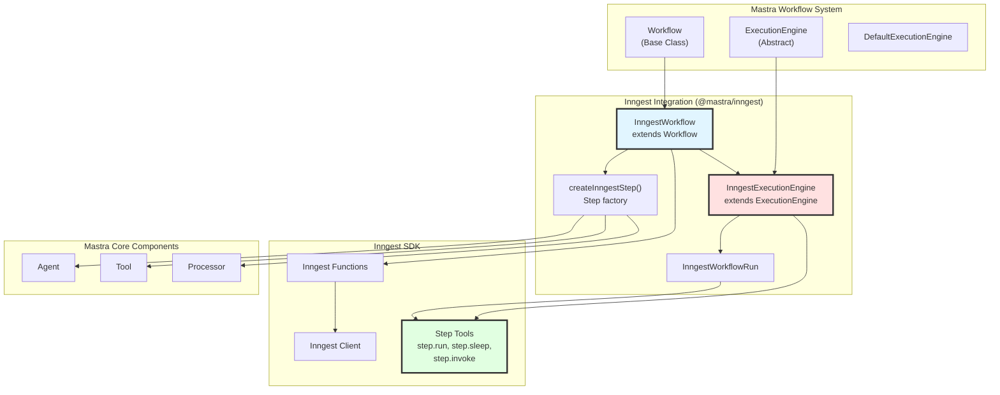
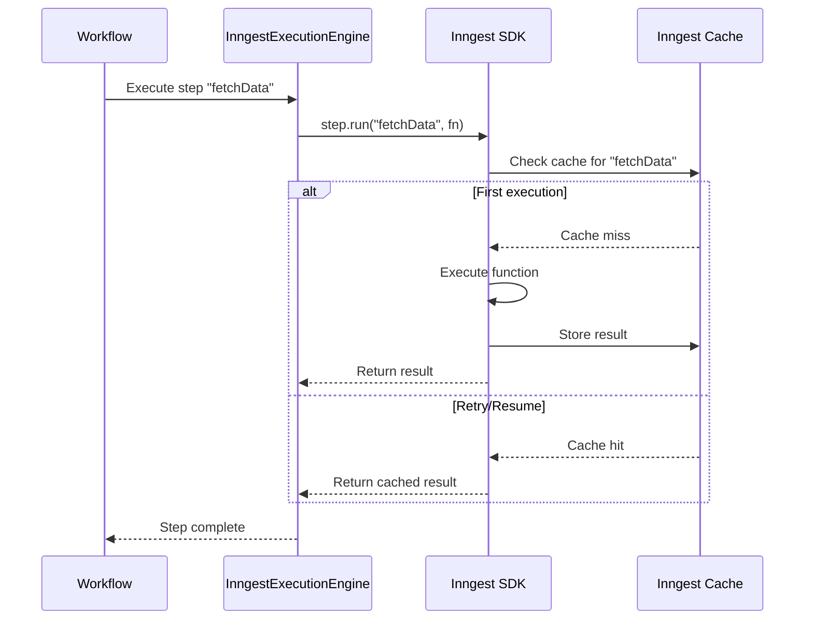
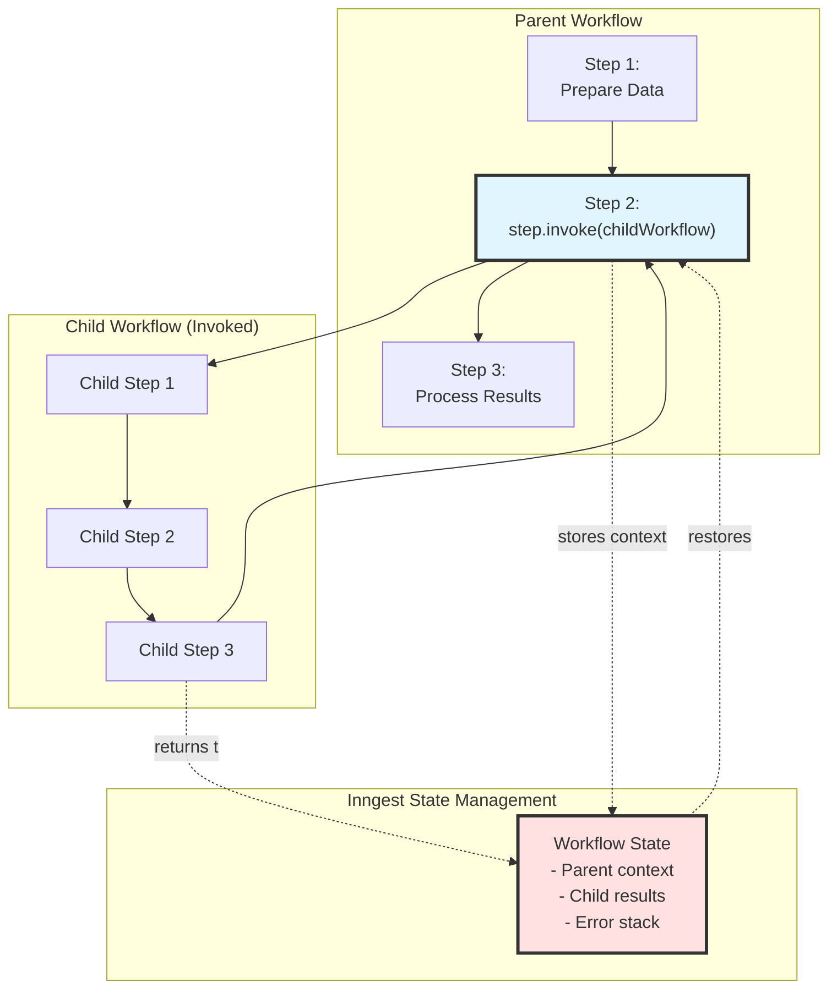
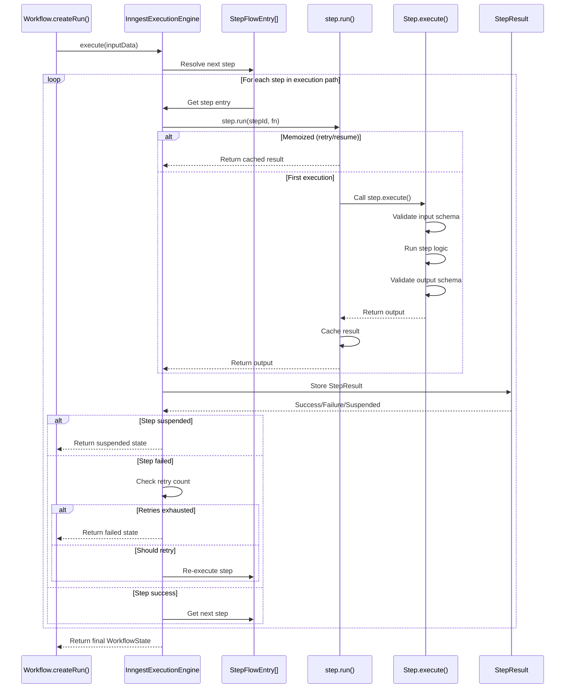
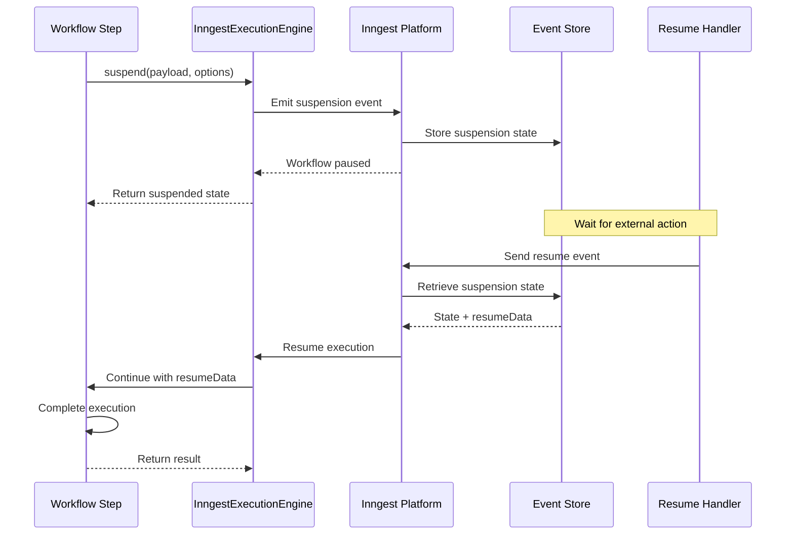
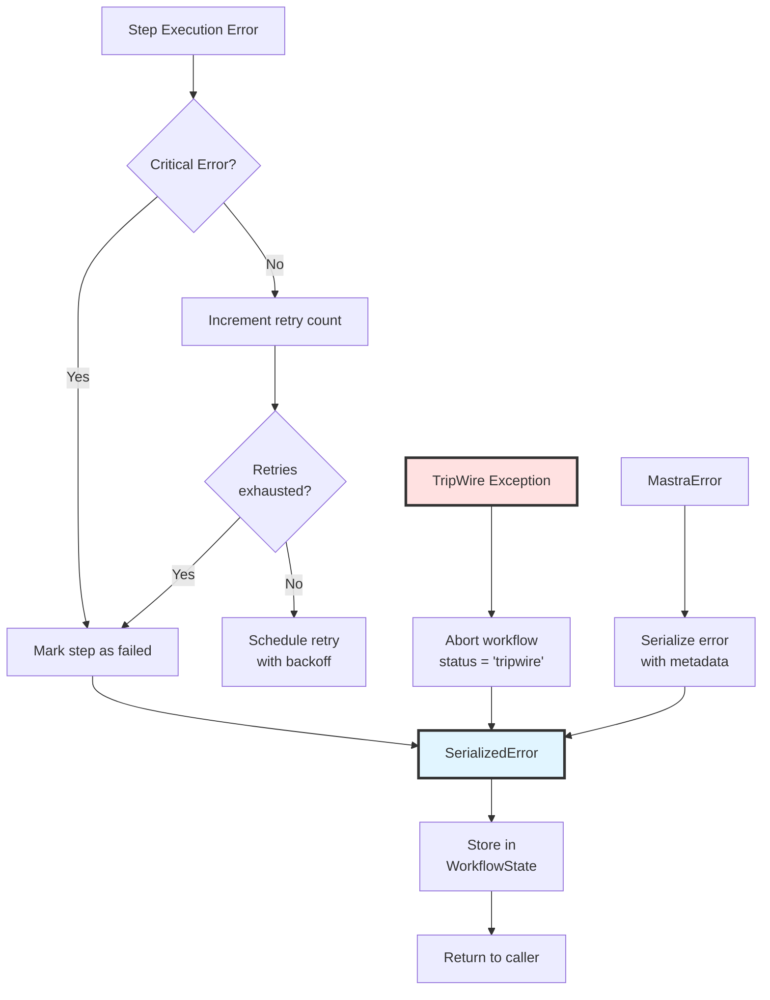
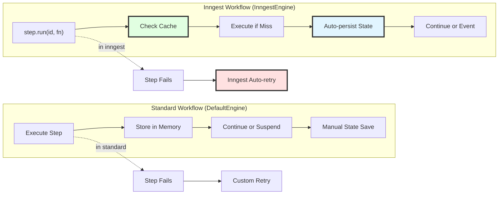

# Inngest Durability Integration

<details>
<summary>Relevant source files</summary>

The following files were used as context for generating this wiki page:

- [packages/core/src/workflows/default.ts](packages/core/src/workflows/default.ts)
- [packages/core/src/workflows/evented/evented-workflow.test.ts](packages/core/src/workflows/evented/evented-workflow.test.ts)
- [packages/core/src/workflows/evented/execution-engine.ts](packages/core/src/workflows/evented/execution-engine.ts)
- [packages/core/src/workflows/evented/step-executor.test.ts](packages/core/src/workflows/evented/step-executor.test.ts)
- [packages/core/src/workflows/evented/step-executor.ts](packages/core/src/workflows/evented/step-executor.ts)
- [packages/core/src/workflows/evented/workflow-event-processor/index.ts](packages/core/src/workflows/evented/workflow-event-processor/index.ts)
- [packages/core/src/workflows/evented/workflow.ts](packages/core/src/workflows/evented/workflow.ts)
- [packages/core/src/workflows/execution-engine.ts](packages/core/src/workflows/execution-engine.ts)
- [packages/core/src/workflows/step.ts](packages/core/src/workflows/step.ts)
- [packages/core/src/workflows/types.ts](packages/core/src/workflows/types.ts)
- [packages/core/src/workflows/utils.ts](packages/core/src/workflows/utils.ts)
- [packages/core/src/workflows/workflow.test.ts](packages/core/src/workflows/workflow.test.ts)
- [packages/core/src/workflows/workflow.ts](packages/core/src/workflows/workflow.ts)
- [workflows/inngest/src/execution-engine.ts](workflows/inngest/src/execution-engine.ts)
- [workflows/inngest/src/index.test.ts](workflows/inngest/src/index.test.ts)
- [workflows/inngest/src/index.ts](workflows/inngest/src/index.ts)
- [workflows/inngest/src/run.ts](workflows/inngest/src/run.ts)
- [workflows/inngest/src/workflow.ts](workflows/inngest/src/workflow.ts)

</details>

## Overview

The Inngest Durability Integration provides durable, resilient workflow execution by leveraging the Inngest platform's built-in primitives for automatic memoization, retries, and state persistence. This integration extends the standard Mastra workflow system (see [4.1](#4.1) for workflow definition and [4.2](#4.2) for execution engines) with Inngest-specific capabilities that ensure workflows can survive failures and resume from the last successful step.

**Key capabilities:**

- **Automatic memoization**: Steps executed via `step.run()` are cached and never re-executed on retry
- **Durable sleep**: `step.sleep()` and `step.sleepUntil()` primitives for time-based orchestration
- **Nested workflows**: Invoke child workflows with `step.invoke()` for composition
- **Built-in retries**: Failed steps automatically retry with exponential backoff
- **State persistence**: Workflow state is managed by Inngest infrastructure

**Sources:** [workflows/inngest/src/index.ts:1-30](), [workflows/inngest/package.json:1-84]()

---

## Architecture Overview

The Inngest integration introduces specialized workflow and execution components that wrap Inngest SDK primitives while maintaining compatibility with Mastra's standard workflow API.



**Sources:** [workflows/inngest/src/index.ts:1-150](), [workflows/inngest/src/workflow.ts](), [workflows/inngest/src/execution-engine.ts]()

---

## Core Classes and Functions

### InngestWorkflow Class

`InngestWorkflow` extends the base `Workflow` class to integrate with Inngest's execution model. It wraps the standard workflow graph in an Inngest function that can be registered with the Inngest SDK.

| Property       | Type                    | Description                               |
| -------------- | ----------------------- | ----------------------------------------- |
| `id`           | `string`                | Unique workflow identifier                |
| `inputSchema`  | `z.ZodTypeAny`          | Zod schema for workflow input validation  |
| `outputSchema` | `z.ZodTypeAny`          | Zod schema for workflow output validation |
| `steps`        | `Step[]`                | Array of workflow steps                   |
| `config`       | `InngestWorkflowConfig` | Inngest-specific configuration            |

**Key methods:**

- `createRun()` - Creates an `InngestWorkflowRun` instance for execution
- `commit()` - Finalizes workflow graph construction
- `toInngestFunction()` - Converts workflow to Inngest function definition

**Sources:** [workflows/inngest/src/workflow.ts](), [workflows/inngest/src/types.ts:1-50]()

### InngestExecutionEngine Class

`InngestExecutionEngine` implements the execution engine interface using Inngest's durable primitives instead of in-memory execution.

**Key differences from `DefaultExecutionEngine`:**

| Aspect            | DefaultExecutionEngine | InngestExecutionEngine                    |
| ----------------- | ---------------------- | ----------------------------------------- |
| Execution model   | In-memory, synchronous | Durable, asynchronous via Inngest         |
| State persistence | Manual via storage     | Automatic via Inngest SDK                 |
| Step caching      | None                   | Automatic via `step.run()` memoization    |
| Retry handling    | Custom retry logic     | Built-in Inngest retries                  |
| Sleep/wait        | Uses setTimeout        | Uses `step.sleep()` / `step.sleepUntil()` |

**Sources:** [workflows/inngest/src/execution-engine.ts](), [packages/core/src/workflows/default.ts:1-100]()

---

## Creating Inngest Workflows

### Workflow Factory Functions

The package provides two factory functions for creating Inngest workflows:

#### createInngestWorkflow()

Creates a new `InngestWorkflow` instance with Inngest-specific configuration.

```typescript
// Basic workflow creation
const workflow = createInngestWorkflow({
  id: 'example-workflow',
  inputSchema: z.object({ input: z.string() }),
  outputSchema: z.object({ result: z.string() }),
  steps: [step1, step2],
  config: {
    client: inngestClient,
    name: 'Example Workflow',
    retries: 3,
  },
})
```

**Configuration fields:**

| Field                | Type           | Required | Description                              |
| -------------------- | -------------- | -------- | ---------------------------------------- |
| `id`                 | `string`       | Yes      | Unique workflow identifier               |
| `inputSchema`        | `z.ZodTypeAny` | Yes      | Input validation schema                  |
| `outputSchema`       | `z.ZodTypeAny` | Yes      | Output validation schema                 |
| `steps`              | `Step[]`       | Yes      | Workflow steps to execute                |
| `config.client`      | `Inngest`      | Yes      | Inngest client instance                  |
| `config.name`        | `string`       | No       | Display name for Inngest UI              |
| `config.retries`     | `number`       | No       | Number of automatic retries (default: 3) |
| `config.concurrency` | `object`       | No       | Concurrency limits                       |

**Sources:** [workflows/inngest/src/index.ts:200-250](), [workflows/inngest/src/types.ts]()

#### createInngestStep()

Creates workflow steps that are compatible with Inngest's memoization system. This function has multiple overloads for different input types.

**Creating steps from StepParams:**

```typescript
const step1 = createInngestStep({
  id: 'process-data',
  inputSchema: z.object({ data: z.string() }),
  outputSchema: z.object({ result: z.string() }),
  execute: async ({ inputData }) => {
    return { result: inputData.data.toUpperCase() }
  },
})
```

**Creating steps from Agents:**

```typescript
// Default text output
const agentStep = createInngestStep(myAgent)

// Structured output
const structuredAgentStep = createInngestStep(myAgent, {
  structuredOutput: {
    schema: z.object({ answer: z.string(), confidence: z.number() }),
  },
})
```

**Creating steps from Tools:**

```typescript
const toolStep = createInngestStep(myTool, {
  retries: 5,
  metadata: { priority: 'high' },
})
```

**Creating steps from Processors:**

```typescript
const processorStep = createInngestStep(myProcessor)
```

**Sources:** [workflows/inngest/src/index.ts:50-300](), [packages/core/src/workflows/workflow.ts:146-309]()

---

## Durable Primitives

Inngest provides several built-in primitives that make workflow execution durable and resilient. The `InngestExecutionEngine` wraps these primitives to integrate them with Mastra's workflow system.

### step.run() - Memoization

The `step.run()` primitive ensures that each step's execution is cached. If a workflow fails and retries, previously completed steps are not re-executed; their cached results are returned immediately.



**How memoization works:**

1. Each step execution is wrapped in `step.run(stepId, executeFn)`
2. Inngest generates a unique key based on the step ID and workflow run ID
3. On first execution, the function runs and the result is cached
4. On retry or resume, the cached result is returned without re-executing
5. Cache is scoped to the specific workflow run instance

**Sources:** [workflows/inngest/src/execution-engine.ts](), [workflows/inngest/src/index.test.ts:100-200]()

### step.sleep() and step.sleepUntil()

Durable sleep primitives allow workflows to pause execution for a specified duration or until a specific timestamp, without consuming resources during the wait period.

**step.sleep() - Duration-based wait:**

```typescript
// Sleep for 5 minutes
await step.sleep('wait-5-min', '5m')

// Sleep for 1 hour
await step.sleep('wait-1-hour', '1h')

// Sleep for 30 seconds
await step.sleep('wait-30-sec', '30s')
```

**step.sleepUntil() - Timestamp-based wait:**

```typescript
// Sleep until specific date/time
const targetTime = new Date('2024-12-31T23:59:59Z')
await step.sleepUntil('wait-until-new-year', targetTime)

// Sleep until relative time
const inOneHour = new Date(Date.now() + 60 * 60 * 1000)
await step.sleepUntil('wait-one-hour', inOneHour)
```

**Duration format:** Inngest accepts durations as strings with units: `s` (seconds), `m` (minutes), `h` (hours), `d` (days).

**Use cases:**

- Rate limiting between API calls
- Scheduled task execution
- Waiting for external event windows
- Time-based orchestration flows

**Sources:** [workflows/inngest/src/execution-engine.ts](), [packages/core/src/workflows/handlers/sleep.ts]()

### step.invoke() - Nested Workflows

The `step.invoke()` primitive enables calling child workflows from parent workflows, with automatic state management and error propagation.



**Nested workflow invocation:**

```typescript
// In parent workflow step
execute: async ({ step }) => {
  const childResult = await step.invoke('run-child-workflow', {
    function: childWorkflowFunction,
    data: { input: 'from parent' },
  })

  return { parentResult: childResult }
}
```

**Context propagation:**

- `requestContext` is automatically passed to child workflows
- `tracingContext` maintains parent-child span relationships
- Errors in child workflows bubble up to parent with full stack trace

**Sources:** [workflows/inngest/src/execution-engine.ts](), [workflows/inngest/src/index.test.ts:300-450]()

---

## Step Execution Model

### Execution Flow with Memoization

The `InngestExecutionEngine` modifies the standard step execution flow to integrate with Inngest's memoization system.



**Sources:** [workflows/inngest/src/execution-engine.ts](), [packages/core/src/workflows/default.ts:50-200]()

### State Management

The `InngestExecutionEngine` delegates state persistence to Inngest, but maintains a compatible state model for interoperability with Mastra's storage system.

| State Component     | Storage Location                 | Purpose                            |
| ------------------- | -------------------------------- | ---------------------------------- |
| Step results        | Inngest cache (via `step.run()`) | Memoization and idempotency        |
| Workflow metadata   | Inngest workflow state           | Run ID, timestamps, status         |
| Execution graph     | Passed as workflow input         | Step dependencies and flow control |
| Request context     | Propagated through execution     | Multi-tenancy and auth             |
| Suspend/resume data | Inngest event payload            | Human-in-the-loop workflows        |

**Sources:** [workflows/inngest/src/execution-engine.ts](), [workflows/inngest/src/run.ts]()

---

## Workflow Lifecycle

### Registration and Deployment

Inngest workflows must be registered with the Inngest platform before they can be triggered. The `serveInngest()` function handles this registration.

```typescript
// 1. Create Inngest client
const inngest = new Inngest({
  id: 'my-app',
  eventKey: process.env.INNGEST_EVENT_KEY,
})

// 2. Create workflows
const workflow1 = createInngestWorkflow({
  /*...*/
})
const workflow2 = createInngestWorkflow({
  /*...*/
})

// 3. Convert to Inngest functions
const functions = [workflow1.toInngestFunction(), workflow2.toInngestFunction()]

// 4. Serve via HTTP endpoint
import { serve } from 'inngest/next'

export const { GET, POST, PUT } = serve({
  client: inngest,
  functions,
})
```

**Deployment targets:**

- **Next.js**: API routes or App Router route handlers
- **Express**: Middleware integration
- **Hono**: Handler integration (via Mastra server adapters)
- **Serverless**: Vercel, Netlify, Cloudflare Workers

**Sources:** [workflows/inngest/src/serve.ts](), [workflows/inngest/src/index.test.ts:500-600]()

### Triggering Workflows

Inngest workflows are triggered by sending events to the Inngest platform, which then invokes the registered function.

**Trigger methods:**

```typescript
// 1. Via Inngest SDK
await inngest.send({
  name: 'workflow/run',
  data: {
    workflowId: 'example-workflow',
    input: { message: 'hello' }
  }
});

// 2. Via Mastra workflow API
const run = await workflow.createRun();
const result = await run.execute({
  inputData: { message: 'hello' },
  requestContext: { userId: '123' }
});

// 3. Via HTTP (Inngest Cloud UI or API)
POST https://api.inngest.com/v1/events
{
  "name": "workflow/run",
  "data": {
    "workflowId": "example-workflow",
    "input": { "message": "hello" }
  }
}
```

**Sources:** [workflows/inngest/src/run.ts](), [workflows/inngest/src/index.test.ts:50-150]()

---

## Suspend and Resume

The Inngest integration supports Mastra's suspend/resume pattern for human-in-the-loop workflows, but implements it using Inngest's event-driven model rather than in-memory suspension.

### Suspension Flow



**Implementation:**

```typescript
// Step with suspend
const step = createInngestStep({
  id: 'wait-approval',
  execute: async ({ suspend, resumeData }) => {
    if (!resumeData) {
      // First execution - suspend and wait
      await suspend(
        { reason: 'awaiting approval' },
        {
          resumeLabel: 'approval-received',
        }
      )
    }

    // Resumed execution - process approval
    return { approved: resumeData.approved }
  },
})

// Resume the workflow
await workflow.resume({
  runId: 'run-123',
  resumeData: { approved: true },
  label: 'approval-received',
})
```

**Key differences from default engine:**

- Suspension is event-driven, not in-memory
- Resume events trigger new Inngest function invocations
- State is automatically persisted by Inngest
- No need for manual state polling

**Sources:** [workflows/inngest/src/execution-engine.ts](), [workflows/inngest/src/run.ts](), [workflows/inngest/src/index.test.ts:200-350]()

---

## Error Handling and Retries

### Automatic Retry Logic

Inngest provides built-in retry logic that the `InngestExecutionEngine` leverages for resilient execution.

**Retry configuration:**

```typescript
const workflow = createInngestWorkflow({
  id: 'resilient-workflow',
  // ... other config
  config: {
    client: inngest,
    retries: 5, // Retry failed steps up to 5 times
    concurrency: {
      limit: 10, // Max parallel executions
    },
  },
})
```

**Retry behavior:**

| Attempt | Backoff | Total Delay |
| ------- | ------- | ----------- |
| 1       | 1s      | 1s          |
| 2       | 2s      | 3s          |
| 3       | 4s      | 7s          |
| 4       | 8s      | 15s         |
| 5       | 16s     | 31s         |

**Retry strategy:**

- Exponential backoff with jitter
- Idempotent execution via memoization
- Per-step retry limits
- Preserves error context across retries

**Sources:** [workflows/inngest/src/execution-engine.ts](), [workflows/inngest/src/types.ts]()

### Error Propagation

Errors are captured at multiple levels and propagated with full context.



**Error types:**

| Error Type        | Retry Behavior            | Status Code             |
| ----------------- | ------------------------- | ----------------------- |
| `MastraError`     | Retries based on category | `status === 'failed'`   |
| `TripWire`        | No retry, abort workflow  | `status === 'tripwire'` |
| Network errors    | Auto-retry with backoff   | `status === 'failed'`   |
| Validation errors | No retry (invalid input)  | `status === 'failed'`   |

**Sources:** [workflows/inngest/src/execution-engine.ts](), [packages/core/src/error/index.ts]()

---

## Comparison with Default Execution Engine

| Feature                 | DefaultExecutionEngine      | InngestExecutionEngine             |
| ----------------------- | --------------------------- | ---------------------------------- |
| **Execution Model**     | In-memory, synchronous      | Distributed, durable               |
| **State Persistence**   | Manual (WorkflowsStorage)   | Automatic (Inngest SDK)            |
| **Step Memoization**    | None                        | Automatic via `step.run()`         |
| **Retry Logic**         | Custom per-step retries     | Built-in exponential backoff       |
| **Sleep/Wait**          | `setTimeout()` (in-process) | `step.sleep()` (durable)           |
| **Nested Workflows**    | Direct function call        | `step.invoke()` with isolation     |
| **Suspend/Resume**      | In-memory PubSub            | Event-driven via Inngest           |
| **Concurrency Control** | None                        | Built-in limits and queuing        |
| **Observability**       | Manual tracing              | Inngest dashboard + Mastra tracing |
| **Deployment**          | Any Node.js runtime         | HTTP endpoint required             |
| **Scalability**         | Limited by instance         | Horizontal via Inngest cloud       |

**When to use InngestExecutionEngine:**

- Long-running workflows (hours to days)
- Workflows with external dependencies that may fail
- Need for automatic retries and error recovery
- Human-in-the-loop patterns with long wait times
- Multi-step workflows that must be resilient to infrastructure failures

**When to use DefaultExecutionEngine:**

- Short-lived workflows (seconds to minutes)
- Local development and testing
- Simple sequential flows without failure scenarios
- No need for persistence or replay
- Workflows that must complete in a single request/response cycle

**Sources:** [workflows/inngest/src/execution-engine.ts](), [packages/core/src/workflows/default.ts:1-300](), [packages/core/src/workflows/execution-engine.ts]()

---

## Testing Inngest Workflows

The `@mastra/inngest` package includes testing utilities for local development without requiring a live Inngest environment.

### Test Setup

```typescript
import { createInngestWorkflow, createInngestStep } from '@mastra/inngest'
import { Inngest } from 'inngest'
import { describe, it, expect } from 'vitest'

describe('Inngest Workflow Tests', () => {
  const inngest = new Inngest({
    id: 'test-app',
    eventKey: 'test-key',
    isDev: true, // Enable dev mode for testing
  })

  it('should execute workflow with memoization', async () => {
    const step1 = createInngestStep({
      id: 'step1',
      inputSchema: z.object({ value: z.number() }),
      outputSchema: z.object({ result: z.number() }),
      execute: async ({ inputData }) => {
        return { result: inputData.value * 2 }
      },
    })

    const workflow = createInngestWorkflow({
      id: 'test-workflow',
      inputSchema: z.object({ value: z.number() }),
      outputSchema: z.object({ result: z.number() }),
      steps: [step1],
      config: { client: inngest },
    })

    workflow.then(step1).commit()

    const run = await workflow.createRun()
    const result = await run.execute({
      inputData: { value: 5 },
    })

    expect(result.result).toBe(10)
  })
})
```

**Testing patterns:**

1. Use `isDev: true` in Inngest client for local execution
2. Mock external dependencies in step implementations
3. Test suspend/resume by invoking `run.resume()` manually
4. Verify memoization by checking step execution counts
5. Use snapshot testing for complex workflow outputs

**Sources:** [workflows/inngest/src/index.test.ts:1-100](), [workflows/inngest/src/index.test.ts:500-700]()

---

## Integration with Mastra Server

Inngest workflows can be served alongside standard Mastra endpoints using the server adapters.

### Hono Integration Example

```typescript
import { Mastra } from '@mastra/core'
import { createMastraServer } from '@mastra/server'
import { serve } from 'inngest/hono'
import { Hono } from 'hono'

// Create Mastra instance
const mastra = new Mastra({
  workflows: {
    standard: standardWorkflow,
    inngest: inngestWorkflow,
  },
})

// Create Hono app
const app = new Hono()

// Mount Mastra server routes
const mastraServer = createMastraServer({ mastra })
app.route('/api/mastra', mastraServer)

// Mount Inngest routes
const inngestFunctions = [inngestWorkflow.toInngestFunction()]

app.route(
  '/api/inngest',
  serve({
    client: inngest,
    functions: inngestFunctions,
  })
)

export default app
```

**Route structure:**

- `/api/mastra/*` - Standard Mastra APIs (agents, workflows, memory)
- `/api/inngest` - Inngest webhook endpoint for function execution
- `/api/inngest/inspect` - Inngest dev server inspector (dev mode only)

**Sources:** [workflows/inngest/src/serve.ts](), [packages/server/package.json:1-125](), [server-adapters/hono/]()

---

## Type Safety and Engine Types

The Inngest integration maintains full TypeScript type safety through the engine type system.

### Engine Type Parameter

The `InngestEngineType` constant identifies workflows using the Inngest execution engine.

```typescript
export const InngestEngineType = 'inngest' as const
export type InngestEngineType = typeof InngestEngineType

// InngestWorkflow extends Workflow with engine type
class InngestWorkflow<
  TId extends string,
  TState,
  TInput,
  TOutput,
  TResume,
  TSuspend,
  TRequestContext,
> extends Workflow<
  TId,
  TState,
  TInput,
  TOutput,
  TResume,
  TSuspend,
  InngestEngineType, // Engine type discriminator
  TRequestContext
> {
  // ...
}
```

**Type inference:**

- Step input/output types are inferred from schemas
- Workflow result type matches output schema
- Engine-specific methods are type-checked
- Incompatible engine operations are compile-time errors

**Sources:** [workflows/inngest/src/types.ts:1-100](), [packages/core/src/workflows/types.ts:20-40]()

---

## Best Practices

### Workflow Design

1. **Granular steps**: Break workflows into small, focused steps for better memoization
2. **Idempotency**: Design steps to be safely re-executable with same inputs
3. **Error handling**: Use try-catch within steps for graceful degradation
4. **Timeouts**: Set appropriate timeouts for long-running operations
5. **Logging**: Use structured logging for observability

### Performance Optimization

1. **Minimize step count**: Each `step.run()` call has overhead
2. **Batch operations**: Group related operations in single steps
3. **Parallel execution**: Use `.parallel()` for independent steps
4. **Conditional logic**: Use `.conditional()` to skip unnecessary steps
5. **Cache strategy**: Leverage memoization for expensive operations

### Deployment Considerations

1. **Environment variables**: Store Inngest credentials securely
2. **Endpoint security**: Protect webhook endpoints with authentication
3. **Monitoring**: Set up alerts for failed workflow runs
4. **Version management**: Use workflow versioning for breaking changes
5. **Testing**: Test workflows in staging before production deployment

**Sources:** [workflows/inngest/src/index.ts:1-500](), [workflows/inngest/src/execution-engine.ts]()

---

## Key Differences Summary



**Sources:** [workflows/inngest/src/execution-engine.ts](), [packages/core/src/workflows/default.ts](), [packages/core/src/workflows/execution-engine.ts]()
