# Suspend and Resume Mechanism

<details>
<summary>Relevant source files</summary>

The following files were used as context for generating this wiki page:

- [packages/core/src/workflows/default.ts](packages/core/src/workflows/default.ts)
- [packages/core/src/workflows/evented/evented-workflow.test.ts](packages/core/src/workflows/evented/evented-workflow.test.ts)
- [packages/core/src/workflows/evented/execution-engine.ts](packages/core/src/workflows/evented/execution-engine.ts)
- [packages/core/src/workflows/evented/step-executor.test.ts](packages/core/src/workflows/evented/step-executor.test.ts)
- [packages/core/src/workflows/evented/step-executor.ts](packages/core/src/workflows/evented/step-executor.ts)
- [packages/core/src/workflows/evented/workflow-event-processor/index.ts](packages/core/src/workflows/evented/workflow-event-processor/index.ts)
- [packages/core/src/workflows/evented/workflow.ts](packages/core/src/workflows/evented/workflow.ts)
- [packages/core/src/workflows/execution-engine.ts](packages/core/src/workflows/execution-engine.ts)
- [packages/core/src/workflows/step.ts](packages/core/src/workflows/step.ts)
- [packages/core/src/workflows/types.ts](packages/core/src/workflows/types.ts)
- [packages/core/src/workflows/utils.ts](packages/core/src/workflows/utils.ts)
- [packages/core/src/workflows/workflow.test.ts](packages/core/src/workflows/workflow.test.ts)
- [packages/core/src/workflows/workflow.ts](packages/core/src/workflows/workflow.ts)
- [workflows/inngest/src/execution-engine.ts](workflows/inngest/src/execution-engine.ts)
- [workflows/inngest/src/index.test.ts](workflows/inngest/src/index.test.ts)
- [workflows/inngest/src/index.ts](workflows/inngest/src/index.ts)
- [workflows/inngest/src/run.ts](workflows/inngest/src/run.ts)
- [workflows/inngest/src/workflow.ts](workflows/inngest/src/workflow.ts)

</details>

## Purpose and Scope

This document describes the suspend and resume mechanism in Mastra workflows, which allows workflow execution to pause at any step and later continue from that point with new data. This enables human-in-the-loop workflows, external event integration, and long-running processes that require user input or approval.

For information about workflow execution in general, see [Workflow System](#4). For control flow patterns like loops and conditionals, see [Control Flow Patterns](#4.5). For workflow state management beyond suspend/resume, see [Workflow State Management and Persistence](#4.3).

---

## Suspend and Resume Lifecycle

The suspend and resume mechanism follows a specific lifecycle where a running workflow can pause execution, persist its state, and later continue from the exact point of suspension.

### Lifecycle Diagram

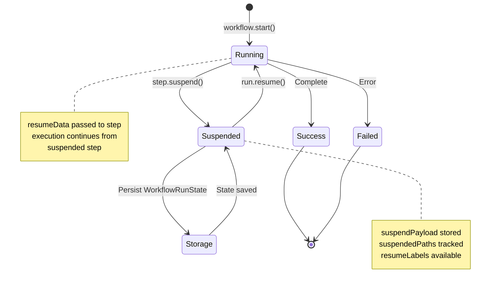

**Sources:** [packages/core/src/workflows/types.ts:106-114](), [packages/core/src/workflows/types.ts:260-270]()

---

## Step Suspend Function

Steps can suspend workflow execution by calling the `suspend` function provided in their execution context. The suspend function is typed to enforce schema validation when a `suspendSchema` is defined.

### Suspend Function Signature

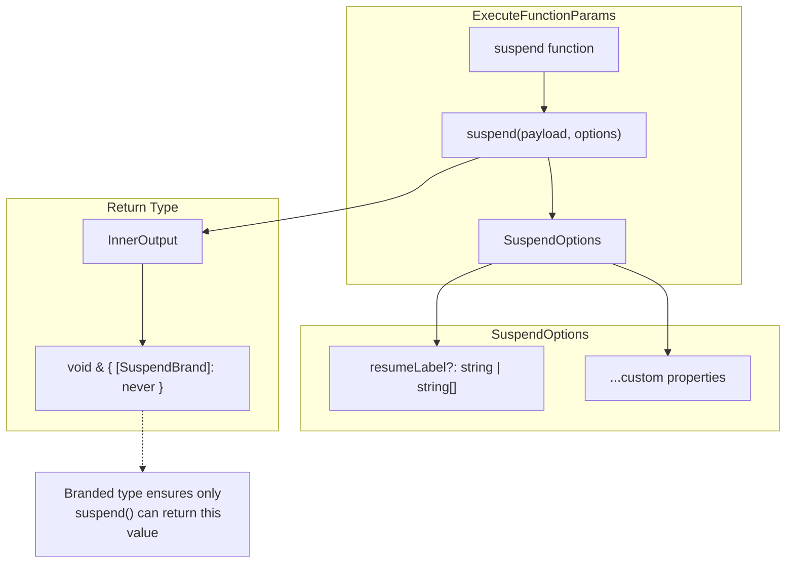

**Type Definition:**

| Component        | Type                                                           | Purpose                               |
| ---------------- | -------------------------------------------------------------- | ------------------------------------- |
| `suspend`        | `(payload: TSuspend, options?: SuspendOptions) => InnerOutput` | Function to pause execution           |
| `TSuspend`       | Inferred from `suspendSchema`                                  | Type-safe suspend payload             |
| `SuspendOptions` | `{ resumeLabel?: string \| string[], ...custom }`              | Suspend configuration                 |
| `InnerOutput`    | `void & { readonly [SuspendBrand]: never }`                    | Branded type preventing misuse        |
| `resumeLabel`    | `string \| string[]`                                           | Named resume points for multi-suspend |

**Sources:** [packages/core/src/workflows/step.ts:13-22](), [packages/core/src/workflows/step.ts:48-50]()

### Suspend Execution Example

When a step calls `suspend()`, the execution engine detects the special return value and triggers the suspend process:

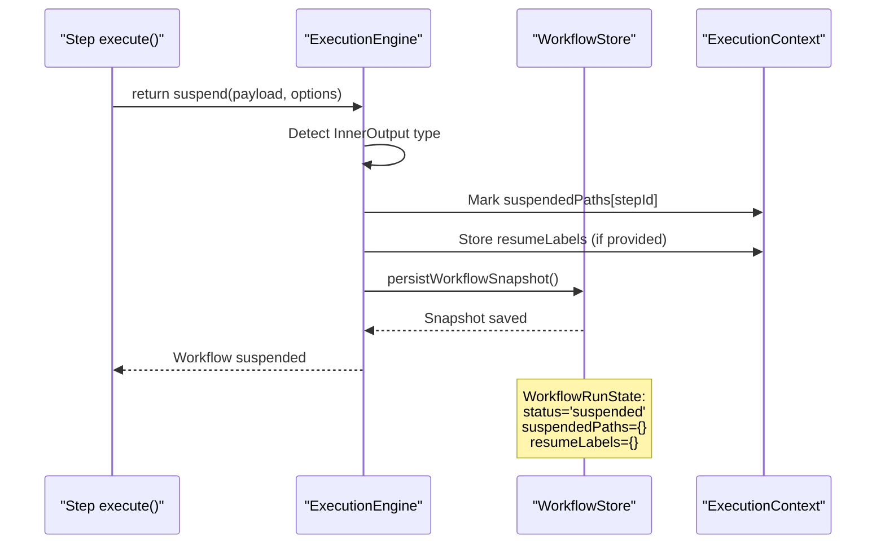

**Sources:** [packages/core/src/workflows/workflow.ts:546-579](), [packages/core/src/workflows/default.ts:414-473]()

---

## Suspend Data Flow

The suspend mechanism captures the current workflow state and persists it for later resumption. The data flows through validation, serialization, and storage layers.

### Suspend State Capture

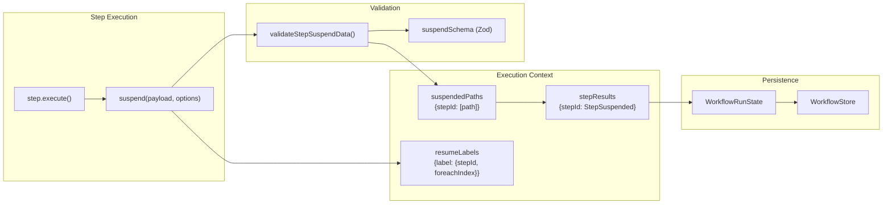

**Suspend Data Structure:**

| Field            | Type                                     | Description                            |
| ---------------- | ---------------------------------------- | -------------------------------------- |
| `suspendPayload` | `TSuspend`                               | User data to persist during suspension |
| `suspendedPaths` | `Record<string, number[]>`               | Execution paths that are suspended     |
| `resumeLabels`   | `Record<string, {stepId, foreachIndex}>` | Named resume points                    |
| `status`         | `'suspended'`                            | Workflow run status                    |
| `context`        | `Record<string, StepResult>`             | All step results including suspended   |

**Sources:** [packages/core/src/workflows/types.ts:814-837](), [packages/core/src/workflows/utils.ts:94-131]()

### StepSuspended Result

When a step suspends, its result is stored with status `'suspended'`:

```typescript
{
  status: 'suspended',
  payload: any,              // Input data that was passed to the step
  suspendPayload: TSuspend,  // Data provided in suspend() call
  suspendOutput?: TOutput,   // Optional output snapshot
  startedAt: number,         // Timestamp when step started
  suspendedAt: number,       // Timestamp when suspend() was called
  metadata?: StepMetadata    // Optional custom metadata
}
```

**Sources:** [packages/core/src/workflows/types.ts:106-114]()

---

## Resume Mechanism

Resuming a suspended workflow loads the persisted state from storage and continues execution from the suspended step, passing the `resumeData` to the step's execute function.

### Resume Data Flow

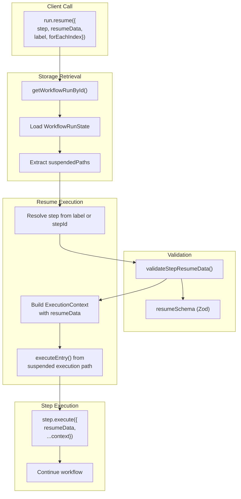

**Sources:** [packages/core/src/workflows/workflow.ts:1485-1583](), [packages/core/src/workflows/utils.ts:63-92]()

### Resume API Methods

The `Run` instance provides methods for resuming suspended workflows:

| Method           | Signature                                                 | Purpose                        |
| ---------------- | --------------------------------------------------------- | ------------------------------ |
| `resume()`       | `resume(options: ResumeOptions): Promise<WorkflowResult>` | Resume and wait for completion |
| `resumeStream()` | `resumeStream(options: ResumeOptions): WorkflowRunOutput` | Resume with streaming output   |

**ResumeOptions:**

```typescript
{
  step?: Step | string,        // Step to resume (or use label)
  label?: string,              // Resume label (alternative to step)
  resumeData?: TResume,        // Data to pass to resumed step
  forEachIndex?: number        // Index when resuming foreach loops
}
```

**Sources:** [packages/core/src/workflows/workflow.ts:1485-1583]()

---

## Schema Validation

Suspend and resume operations support Zod schema validation to ensure type safety and data integrity across suspension boundaries.

### Validation Flow

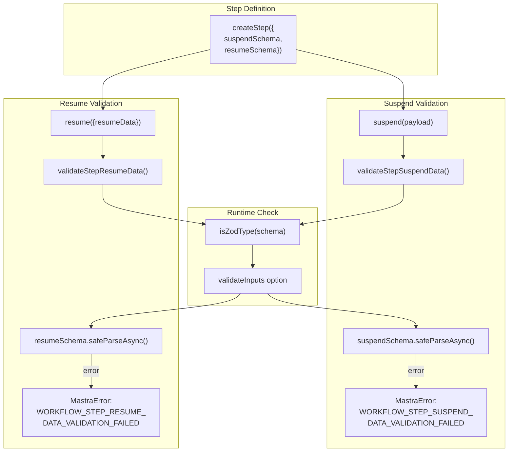

**Validation Error Format:**

When validation fails, a `MastraError` is thrown with detailed path information:

```
Step suspend data validation failed:
- field.path: expected string, received number
- nested.field: required
```

**Sources:** [packages/core/src/workflows/utils.ts:94-131](), [packages/core/src/workflows/utils.ts:63-92]()

### Schema Definition Example

```typescript
const approvalStep = createStep({
  id: 'approval',
  inputSchema: z.object({ request: z.string() }),
  outputSchema: z.object({ approved: z.boolean() }),
  suspendSchema: z.object({
    requestId: z.string(),
    timestamp: z.number(),
  }),
  resumeSchema: z.object({
    approved: z.boolean(),
    approverEmail: z.string(),
  }),
  execute: async ({ suspend, resumeData }) => {
    if (!resumeData) {
      // First execution - suspend for approval
      return suspend({
        requestId: generateId(),
        timestamp: Date.now(),
      })
    }
    // Resumed - process approval
    return { approved: resumeData.approved }
  },
})
```

**Sources:** [packages/core/src/workflows/step.ts:144-171]()

---

## State Persistence

When a workflow suspends, its complete state is persisted to storage, enabling resume operations even after server restarts.

### WorkflowRunState Structure

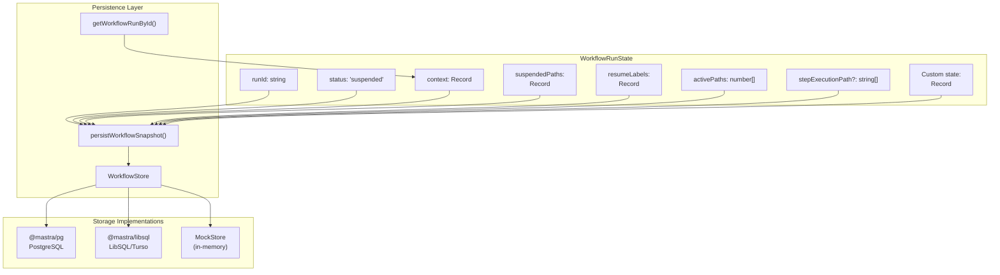

**Key State Fields:**

| Field               | Purpose                                    | Example                                                |
| ------------------- | ------------------------------------------ | ------------------------------------------------------ |
| `suspendedPaths`    | Tracks which execution paths are suspended | `{ "step1": [0, 1] }`                                  |
| `resumeLabels`      | Maps labels to suspended steps             | `{ "approval": { stepId: "step1", foreachIndex: 0 } }` |
| `context`           | All step results including suspended ones  | `{ "step1": { status: "suspended", ... } }`            |
| `stepExecutionPath` | Linear path of executed steps              | `["input", "step1", "step2"]`                          |
| `activePaths`       | Current execution indices in step graph    | `[2, 1]`                                               |

**Sources:** [packages/core/src/workflows/types.ts:328-353](), [packages/core/src/workflows/workflow.ts:1713-1789]()

### Snapshot Persistence Trigger

Snapshots are persisted based on the `shouldPersistSnapshot` option:

```typescript
createWorkflow({
  // ...
  options: {
    shouldPersistSnapshot: ({ stepResults, workflowStatus }) => {
      // Persist on suspend, fail, or every 10 steps
      return (
        workflowStatus === 'suspended' ||
        workflowStatus === 'failed' ||
        Object.keys(stepResults).length % 10 === 0
      )
    },
  },
})
```

**Sources:** [packages/core/src/workflows/types.ts:419-440]()

---

## Execution Engine Implementations

Different execution engines handle suspend and resume with varying levels of durability and features.

### Engine Comparison

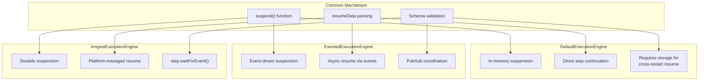

**Sources:** [packages/core/src/workflows/default.ts:53-185](), [packages/core/src/workflows/evented/execution-engine.ts:19-149](), [workflows/inngest/src/execution-engine.ts:21-184]()

### DefaultExecutionEngine Suspend Flow

The default engine uses a straightforward in-memory approach with optional storage persistence:

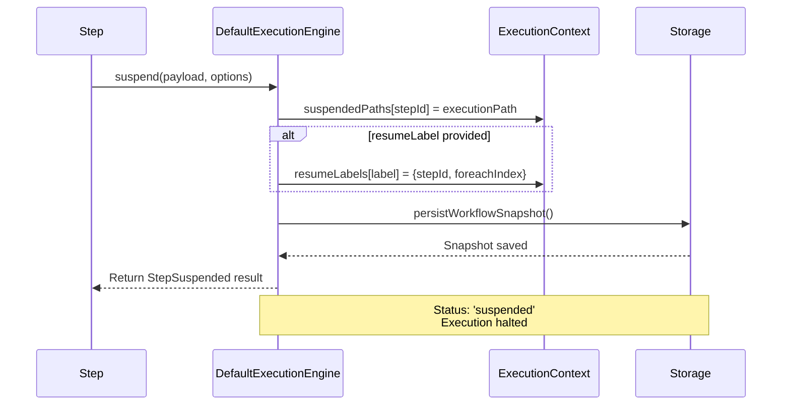

**Sources:** [packages/core/src/workflows/default.ts:662-840]()

### InngestExecutionEngine Suspend Flow

Inngest provides durable suspension with platform-level support:

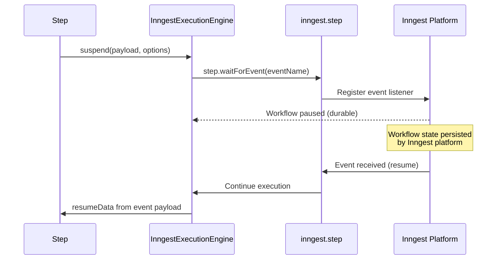

**Sources:** [workflows/inngest/src/execution-engine.ts:185-298]()

---

## Resume Labels

Resume labels enable workflows with multiple suspension points to resume at specific locations without knowing the exact step ID.

### Resume Label Mechanism

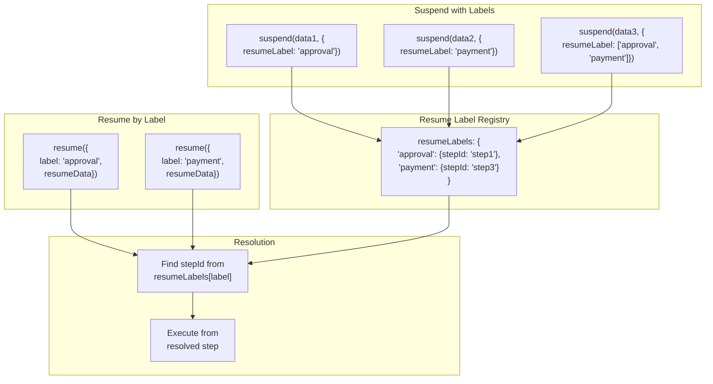

**Use Case Example:**

```typescript
// Multi-stage approval workflow
const step1 = createStep({
  id: 'request-approval',
  execute: async ({ suspend, resumeData }) => {
    if (!resumeData) {
      return suspend(
        { timestamp: Date.now() },
        {
          resumeLabel: 'approval-needed',
        }
      )
    }
    return { approved: resumeData.approved }
  },
})

// Later, resume by label without knowing step ID
await run.resume({
  label: 'approval-needed',
  resumeData: { approved: true },
})
```

**Sources:** [packages/core/src/workflows/workflow.ts:1485-1583](), [packages/core/src/workflows/types.ts:814-837]()

---

## Parallel Step Suspension

When parallel steps suspend, the workflow tracks multiple suspended paths and requires all to be resumed before continuing.

### Parallel Suspend Pattern

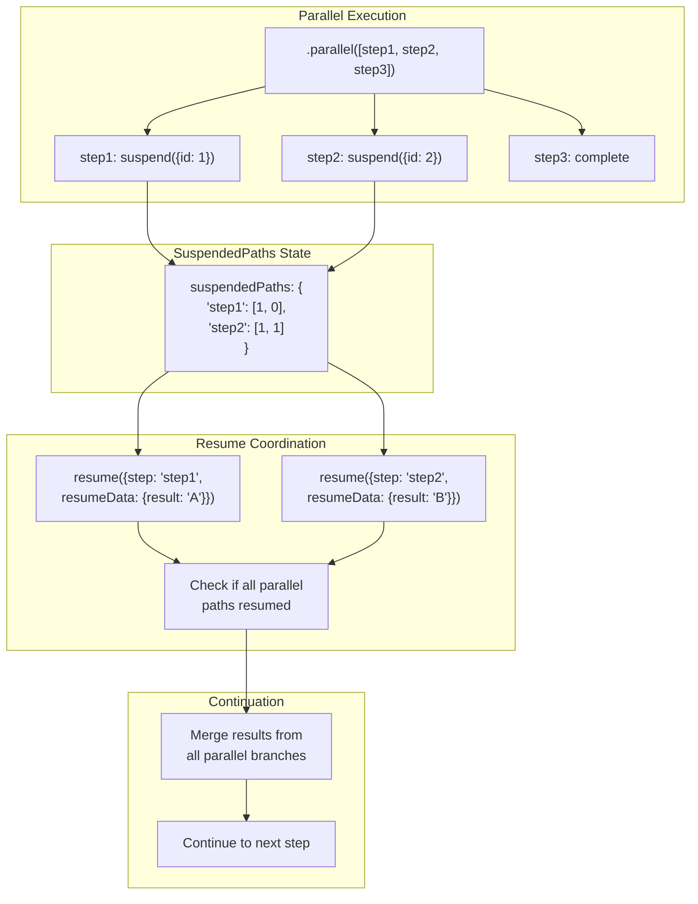

**Parallel Suspended Result:**

When parallel steps suspend, the workflow result includes a `suspended` field with all suspended paths:

```typescript
{
  status: 'suspended',
  steps: {
    step1: { status: 'suspended', suspendPayload: {id: 1}, ... },
    step2: { status: 'suspended', suspendPayload: {id: 2}, ... },
    step3: { status: 'success', output: {...}, ... }
  },
  suspended: [
    ['step1'],
    ['step2']
  ],
  suspendPayload: {
    step1: {id: 1},
    step2: {id: 2}
  }
}
```

**Sources:** [packages/core/src/workflows/types.ts:688-706](), [packages/core/src/workflows/default.ts:589-603]()

---

## Code Entities Reference

### Core Classes and Functions

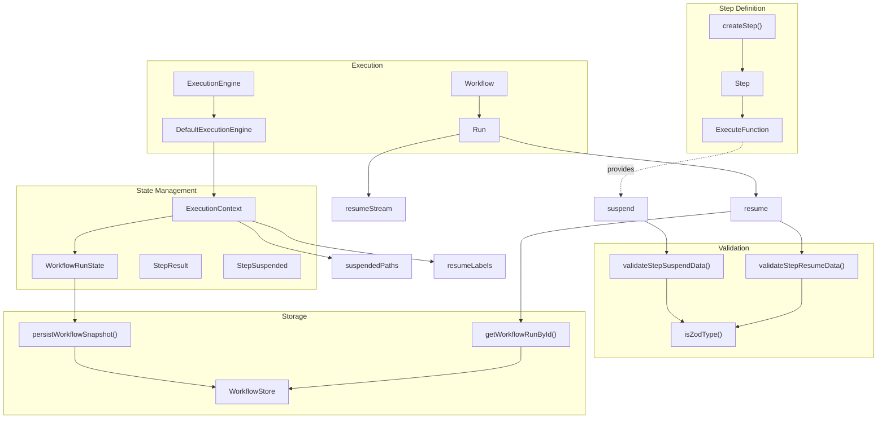

**Key Files:**

| File                                              | Key Exports                                                |
| ------------------------------------------------- | ---------------------------------------------------------- |
| `packages/core/src/workflows/step.ts`             | `Step`, `ExecuteFunction`, `SuspendOptions`, `InnerOutput` |
| `packages/core/src/workflows/workflow.ts`         | `createStep()`, `createWorkflow()`, `Workflow`, `Run`      |
| `packages/core/src/workflows/types.ts`            | `StepSuspended`, `WorkflowRunState`, `ExecutionContext`    |
| `packages/core/src/workflows/utils.ts`            | `validateStepSuspendData()`, `validateStepResumeData()`    |
| `packages/core/src/workflows/default.ts`          | `DefaultExecutionEngine`                                   |
| `packages/core/src/workflows/execution-engine.ts` | `ExecutionEngine` (base class)                             |

**Sources:** [packages/core/src/workflows/step.ts:1-188](), [packages/core/src/workflows/workflow.ts:1-2362](), [packages/core/src/workflows/types.ts:1-880](), [packages/core/src/workflows/utils.ts:1-476]()

---

## Advanced Features

### ForEach Loop Suspension

Workflows can suspend within `foreach` loops, requiring the `forEachIndex` parameter to resume the correct iteration:

```typescript
const workflow = createWorkflow({...})
  .foreach(processItems, itemsArray, { concurrency: 3 })
  .commit();

// Step suspends during iteration 2
const result = await run.start({ inputData });
// result.status === 'suspended'

// Resume specific iteration
await run.resume({
  step: processItems,
  forEachIndex: 2,
  resumeData: { processed: true }
});
```

**Sources:** [packages/core/src/workflows/workflow.ts:1485-1583]()

### Nested Workflow Suspension

When a nested workflow suspends, the parent workflow also enters a suspended state. Resume must target the nested workflow step:

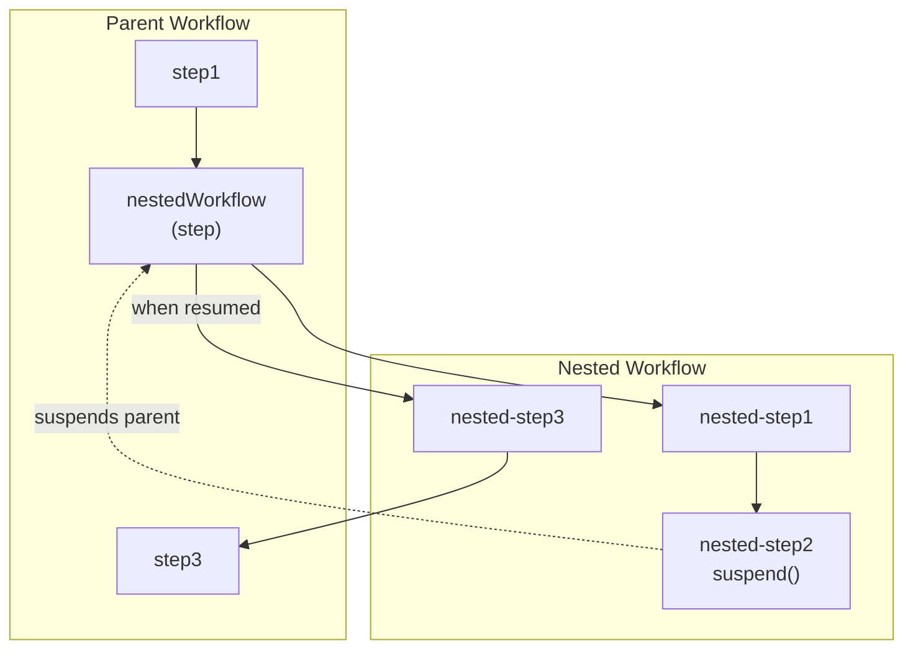

**Resume Nested Workflow:**

```typescript
// Parent workflow includes nested workflow as a step
const parentWorkflow = createWorkflow({...})
  .then(nestedWorkflow)  // nestedWorkflow is another workflow
  .commit();

// Resume the nested workflow's suspended step
await run.resume({
  step: 'nested-step2',  // Step ID within nested workflow
  resumeData: { value: 123 }
});
```

**Sources:** [packages/core/src/workflows/evented/workflow-event-processor/index.ts:156-396]()

### Workflow Metadata in Suspend Payload

Internal workflow metadata is automatically added to suspend payloads for coordination but filtered out when exposed to user code:

```typescript
{
  suspendPayload: {
    // User data
    requestId: '123',
    timestamp: 1234567890,

    // Internal metadata (filtered before exposure)
    __workflow_meta: {
      path: ['nestedStep1', 'nestedStep2'],
      runId: 'nested-run-id'
    }
  }
}
```

**Filtering occurs in:**

- Step execution context preparation
- Resume data extraction
- Workflow result formatting

**Sources:** [packages/core/src/workflows/evented/step-executor.ts:105-120](), [packages/core/src/workflows/default.ts:592-597]()

---

## API Quick Reference

### Suspend API

```typescript
// In step execute function
execute: async ({ suspend, resumeData, ...context }) => {
  if (!resumeData) {
    // First execution - suspend
    return suspend(
      { requestId: '123', timestamp: Date.now() },
      { resumeLabel: 'approval' }
    )
  }

  // Resumed execution
  return { approved: resumeData.approved }
}
```

### Resume API

```typescript
// Resume by step ID
await run.resume({
  step: 'approval-step',
  resumeData: { approved: true },
})

// Resume by label
await run.resume({
  label: 'approval',
  resumeData: { approved: true },
})

// Resume specific foreach iteration
await run.resume({
  step: 'process-item',
  forEachIndex: 2,
  resumeData: { result: 'processed' },
})

// Resume with streaming
const stream = run.resumeStream({
  step: 'approval-step',
  resumeData: { approved: true },
})

for await (const event of stream.fullStream) {
  console.log(event)
}

const result = await stream.result
```

### Schema Definition

```typescript
createStep({
  id: 'approval',
  suspendSchema: z.object({
    requestId: z.string(),
    timestamp: z.number(),
    metadata: z.record(z.any()).optional(),
  }),
  resumeSchema: z.object({
    approved: z.boolean(),
    approverEmail: z.string().email(),
    comments: z.string().optional(),
  }),
  execute: async ({ suspend, resumeData }) => {
    // Typed suspend and resumeData based on schemas
  },
})
```

**Sources:** [packages/core/src/workflows/step.ts:13-171](), [packages/core/src/workflows/workflow.ts:1485-1583]()
