# Workflow Definition and Step Composition

<details>
<summary>Relevant source files</summary>

The following files were used as context for generating this wiki page:

- [packages/core/src/workflows/default.ts](packages/core/src/workflows/default.ts)
- [packages/core/src/workflows/evented/evented-workflow.test.ts](packages/core/src/workflows/evented/evented-workflow.test.ts)
- [packages/core/src/workflows/evented/execution-engine.ts](packages/core/src/workflows/evented/execution-engine.ts)
- [packages/core/src/workflows/evented/step-executor.test.ts](packages/core/src/workflows/evented/step-executor.test.ts)
- [packages/core/src/workflows/evented/step-executor.ts](packages/core/src/workflows/evented/step-executor.ts)
- [packages/core/src/workflows/evented/workflow-event-processor/index.ts](packages/core/src/workflows/evented/workflow-event-processor/index.ts)
- [packages/core/src/workflows/evented/workflow.ts](packages/core/src/workflows/evented/workflow.ts)
- [packages/core/src/workflows/execution-engine.ts](packages/core/src/workflows/execution-engine.ts)
- [packages/core/src/workflows/step.ts](packages/core/src/workflows/step.ts)
- [packages/core/src/workflows/types.ts](packages/core/src/workflows/types.ts)
- [packages/core/src/workflows/utils.ts](packages/core/src/workflows/utils.ts)
- [packages/core/src/workflows/workflow.test.ts](packages/core/src/workflows/workflow.test.ts)
- [packages/core/src/workflows/workflow.ts](packages/core/src/workflows/workflow.ts)
- [workflows/inngest/src/execution-engine.ts](workflows/inngest/src/execution-engine.ts)
- [workflows/inngest/src/index.test.ts](workflows/inngest/src/index.test.ts)
- [workflows/inngest/src/index.ts](workflows/inngest/src/index.ts)
- [workflows/inngest/src/run.ts](workflows/inngest/src/run.ts)
- [workflows/inngest/src/workflow.ts](workflows/inngest/src/workflow.ts)

</details>

This document covers the core APIs for defining workflows and composing steps in Mastra. It explains the `createWorkflow()` and `createStep()` functions, the fluent composition methods (`.then()`, `.parallel()`, `.branch()`, etc.), and how workflow execution graphs are constructed. For information about workflow execution and runtime behavior, see [Execution Engines](#4.2). For details on state management and persistence, see [Workflow State Management and Persistence](#4.3).

## Overview

Mastra workflows are created using a builder pattern that combines:

1. **Workflow configuration** via `createWorkflow()` with schemas for input, output, and state
2. **Step creation** via `createStep()` supporting multiple step types (explicit params, agents, tools, processors)
3. **Fluent composition** via methods like `.then()`, `.parallel()`, `.branch()`, `.loop()`, `.foreach()`
4. **Graph finalization** via `.commit()` which validates and locks the execution graph

The workflow system is engine-agnostic, supporting three execution engines (Default, Evented, Inngest) through a consistent API.

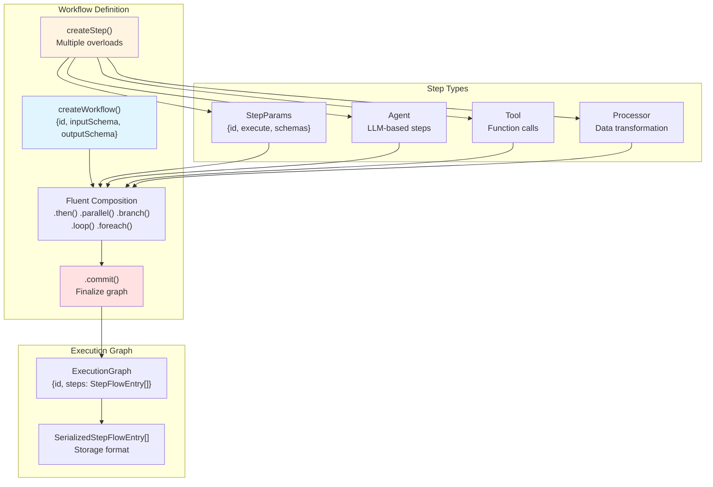

**Sources:** [packages/core/src/workflows/workflow.ts:1266-1485](), [packages/core/src/workflows/types.ts:742-771](), [packages/core/src/workflows/execution-engine.ts:18-25]()

## Workflow Creation with createWorkflow

The `createWorkflow()` function is the entry point for defining workflows. It accepts a `WorkflowConfig` object and returns a `Workflow` instance with methods for step composition.

### Basic Workflow Definition

```typescript
// packages/core/src/workflows/workflow.ts - Simplified example structure
const workflow = createWorkflow({
  id: 'my-workflow',
  description: 'Processes user data',
  inputSchema: z.object({ userId: z.string() }),
  outputSchema: z.object({ result: z.string() }),
  stateSchema: z.object({ progress: z.number() }),
  requestContextSchema: z.object({ tenantId: z.string() }),
  options: { validateInputs: true },
})
```

### WorkflowConfig Parameters

| Parameter              | Type                                    | Required | Description                                                  |
| ---------------------- | --------------------------------------- | -------- | ------------------------------------------------------------ |
| `id`                   | `string`                                | Yes      | Unique workflow identifier                                   |
| `description`          | `string`                                | No       | Human-readable description                                   |
| `inputSchema`          | `SchemaWithValidation<TInput>`          | Yes      | Zod schema for workflow input validation                     |
| `outputSchema`         | `SchemaWithValidation<TOutput>`         | Yes      | Zod schema defining output structure                         |
| `stateSchema`          | `SchemaWithValidation<TState>`          | No       | Zod schema for workflow state (accessible via `setState()`)  |
| `requestContextSchema` | `SchemaWithValidation<TRequestContext>` | No       | Zod schema for request context validation                    |
| `executionEngine`      | `ExecutionEngine`                       | No       | Custom execution engine (defaults to DefaultExecutionEngine) |
| `steps`                | `TSteps[]`                              | No       | Array of steps (for type inference, not used at runtime)     |
| `retryConfig`          | `{attempts, delay}`                     | No       | Default retry configuration for steps                        |
| `options`              | `WorkflowOptions`                       | No       | See WorkflowOptions table below                              |
| `type`                 | `'default' \| 'processor'`              | No       | Workflow type ('processor' for agent processor workflows)    |

### WorkflowOptions

| Option                  | Type                           | Description                                                                     |
| ----------------------- | ------------------------------ | ------------------------------------------------------------------------------- |
| `tracingPolicy`         | `TracingPolicy`                | Control span creation (e.g., disable tracing)                                   |
| `validateInputs`        | `boolean`                      | Enable/disable input validation (default: true)                                 |
| `shouldPersistSnapshot` | `(params) => boolean`          | Custom logic for deciding when to persist workflow snapshots                    |
| `onFinish`              | `(result) => Promise<void>`    | Callback invoked when workflow completes (success, failed, suspended, tripwire) |
| `onError`               | `(errorInfo) => Promise<void>` | Callback invoked only for failed or tripwire status                             |

**Sources:** [packages/core/src/workflows/types.ts:742-771](), [packages/core/src/workflows/types.ts:419-440](), [packages/core/src/workflows/workflow.ts:1266-1321]()

## Step Creation with createStep

The `createStep()` function has multiple overloads to support different step types. All overloads return a `Step` object with an `execute` function and schemas.

### Step Creation Patterns

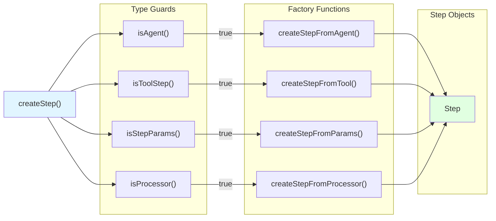

### 1. Explicit StepParams

The most direct way to create a step with full control over input/output schemas and execution logic.

```typescript
// Example from test suite
const step = createStep({
  id: 'process-data',
  description: 'Processes user data',
  inputSchema: z.object({ userId: z.string() }),
  outputSchema: z.object({ result: z.string() }),
  stateSchema: z.object({ counter: z.number() }),
  resumeSchema: z.object({ resumeAt: z.number() }),
  suspendSchema: z.object({ waitFor: z.string() }),
  requestContextSchema: z.object({ tenantId: z.string() }),
  retries: 3,
  scorers: dynamicScorers,
  metadata: { version: '1.0' },
  execute: async ({ inputData, state, setState, suspend }) => {
    // Step logic here
    return { result: 'processed' }
  },
})
```

**StepParams Fields:**

| Field                  | Type                             | Required | Description                                     |
| ---------------------- | -------------------------------- | -------- | ----------------------------------------------- |
| `id`                   | `string`                         | Yes      | Unique step identifier                          |
| `description`          | `string`                         | No       | Human-readable description                      |
| `inputSchema`          | `z.ZodTypeAny`                   | Yes      | Input validation schema                         |
| `outputSchema`         | `z.ZodTypeAny`                   | Yes      | Output structure schema                         |
| `stateSchema`          | `z.ZodTypeAny`                   | No       | State schema (must be subset of workflow state) |
| `resumeSchema`         | `z.ZodTypeAny`                   | No       | Resume data schema (for suspend/resume)         |
| `suspendSchema`        | `z.ZodTypeAny`                   | No       | Suspend payload schema                          |
| `requestContextSchema` | `z.ZodTypeAny`                   | No       | Request context validation schema               |
| `retries`              | `number`                         | No       | Number of retry attempts on failure             |
| `scorers`              | `DynamicArgument<MastraScorers>` | No       | Evaluation scorers for this step                |
| `metadata`             | `StepMetadata`                   | No       | Arbitrary metadata (Record<string, any>)        |
| `execute`              | `ExecuteFunction`                | Yes      | Async function containing step logic            |

**Sources:** [packages/core/src/workflows/workflow.ts:163-190](), [packages/core/src/workflows/types.ts:555-588](), [packages/core/src/workflows/workflow.ts:321-353]()

### 2. Agent Steps

Wraps an `Agent` instance to use LLM-based processing as a workflow step. Supports both text output (default) and structured output via schemas.

```typescript
// Text output (default)
const agentStep1 = createStep(myAgent)
// Output schema: { text: string }

// Structured output
const agentStep2 = createStep(myAgent, {
  structuredOutput: {
    schema: z.object({
      name: z.string(),
      age: z.number(),
    }),
  },
  retries: 2,
  scorers: dynamicScorers,
  metadata: { modelVersion: 'gpt-4' },
})
```

**Agent Step Behavior:**

- Input schema is always `{ prompt: string }`
- Internally calls `agent.stream()` or `agent.streamLegacy()` based on model specification version
- Handles tripwire detection (processor-triggered workflow aborts)
- Streams text deltas to workflow events in legacy mode
- Captures structured output via `onFinish` callback

**Sources:** [packages/core/src/workflows/workflow.ts:194-215](), [packages/core/src/workflows/workflow.ts:355-526]()

### 3. Tool Steps

Wraps a `Tool` instance to execute specific operations with suspend/resume support.

```typescript
// Example tool step
const toolStep = createStep(myTool, {
  retries: 3,
  scorers: evaluationScorers,
  metadata: { priority: 'high' },
})
```

**Tool Step Behavior:**

- Preserves tool's `inputSchema`, `outputSchema`, `suspendSchema`, `resumeSchema`
- Provides workflow context in second argument: `{ mastra, requestContext, workflow: { runId, suspend, state, setState } }`
- Supports suspend/resume for long-running operations or human-in-the-loop scenarios
- Component type set to `'TOOL'`

**Sources:** [packages/core/src/workflows/workflow.ts:217-231](), [packages/core/src/workflows/workflow.ts:528-579]()

### 4. Processor Steps

Wraps a `Processor` instance to transform agent inputs or outputs within a workflow.

```typescript
// Processor step for data transformation
const processorStep = createStep(myProcessor)
// ID is automatically prefixed: 'processor:myProcessorId'
```

**Processor Step Behavior:**

- Input schema: `ProcessorStepInputSchema` (discriminated union by phase)
- Output schema: `ProcessorStepOutputSchema`
- Supports phases: `input`, `inputStep`, `outputStream`, `outputResult`, `outputStep`
- Creates processor spans for observability
- Integrates with ProcessorRunner for phase execution
- Enables TripWire abort via `abort()` function

**Sources:** [packages/core/src/workflows/workflow.ts:236-253](), [packages/core/src/workflows/workflow.ts:581-1115]()

## Step Structure and Execute Function

All step types share a common `Step` interface structure.

### Step Interface

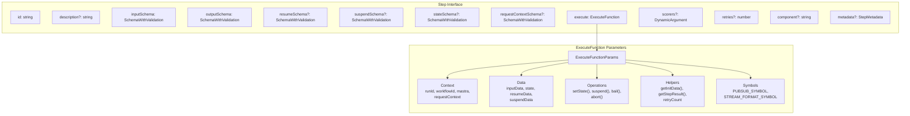

### ExecuteFunction Parameters

The `execute` function receives a single parameter object with the following fields:

| Field                        | Type                              | Description                                        |
| ---------------------------- | --------------------------------- | -------------------------------------------------- |
| `runId`                      | `string`                          | Unique workflow run identifier                     |
| `resourceId`                 | `string`                          | Optional resource/user identifier                  |
| `workflowId`                 | `string`                          | Workflow identifier                                |
| `mastra`                     | `Mastra`                          | Mastra instance for accessing other components     |
| `requestContext`             | `RequestContext<TRequestContext>` | Request-scoped key-value store                     |
| `inputData`                  | `TStepInput`                      | Validated input data from previous step            |
| `state`                      | `TState`                          | Current workflow state                             |
| `setState(state)`            | `(TState) => Promise<void>`       | Update workflow state                              |
| `resumeData`                 | `TResume`                         | Data passed to resume suspended workflow           |
| `suspendData`                | `TSuspend`                        | Suspend payload from previous suspension           |
| `suspend(payload, options?)` | Function                          | Suspend workflow execution                         |
| `bail(result)`               | `(TStepOutput) => InnerOutput`    | Exit workflow early with result                    |
| `abort()`                    | `() => void`                      | Cancel workflow execution                          |
| `retryCount`                 | `number`                          | Current retry attempt (0-indexed)                  |
| `getInitData<T>()`           | `() => T`                         | Get workflow input data                            |
| `getStepResult(step)`        | Function                          | Get output from previous step by ID or Step object |
| `abortSignal`                | `AbortSignal`                     | Signal for cancellation monitoring                 |
| `writer`                     | `ToolStream`                      | Stream writer for real-time output                 |
| `outputWriter`               | `OutputWriter`                    | Write chunks to workflow event stream              |
| `engine`                     | `EngineType`                      | Engine-specific context (e.g., Inngest step)       |
| `[PUBSUB_SYMBOL]`            | `PubSub`                          | Internal PubSub for workflow events                |
| `[STREAM_FORMAT_SYMBOL]`     | `'legacy' \| 'vnext'`             | Stream format version                              |

**Sources:** [packages/core/src/workflows/step.ts:23-66](), [packages/core/src/workflows/step.ts:144-171]()

## Fluent Composition API

After creating a workflow with `createWorkflow()`, use fluent methods to build the execution graph. All methods return the workflow instance for chaining.

### Sequential Composition with .then()

Chains steps sequentially, where each step receives the previous step's output as input.

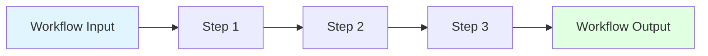

```typescript
// Example from workflow.ts
workflow
  .then(step1) // Receives workflow input
  .then(step2) // Receives step1.output
  .then(step3) // Receives step2.output
  .commit()
```

**Type Safety:** The `.then()` method enforces that the next step's input schema matches the previous step's output schema.

**Sources:** [packages/core/src/workflows/workflow.ts:1513-1565]()

### Parallel Composition with .parallel()

Executes multiple steps concurrently. The output is an object keyed by step ID.

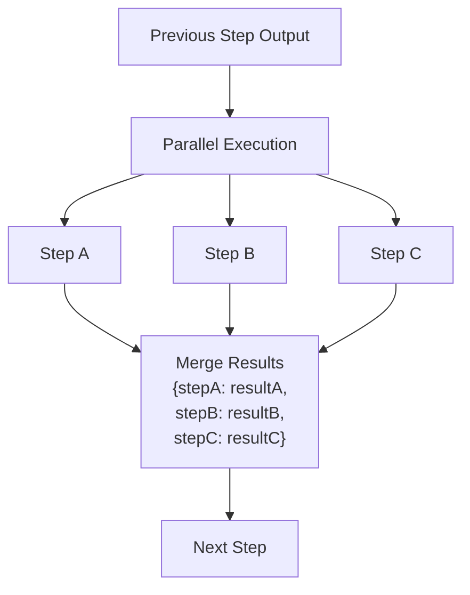

```typescript
// Example usage
workflow
  .then(fetchData)
  .parallel([processA, processB, processC])
  .then(combineResults) // Receives { processA: {...}, processB: {...}, processC: {...} }
  .commit()
```

**Output Structure:** `{ [stepId]: stepOutput }`

**Sources:** [packages/core/src/workflows/workflow.ts:1589-1643]()

### Conditional Composition with .branch()

Executes one of multiple branches based on condition functions evaluated in order.

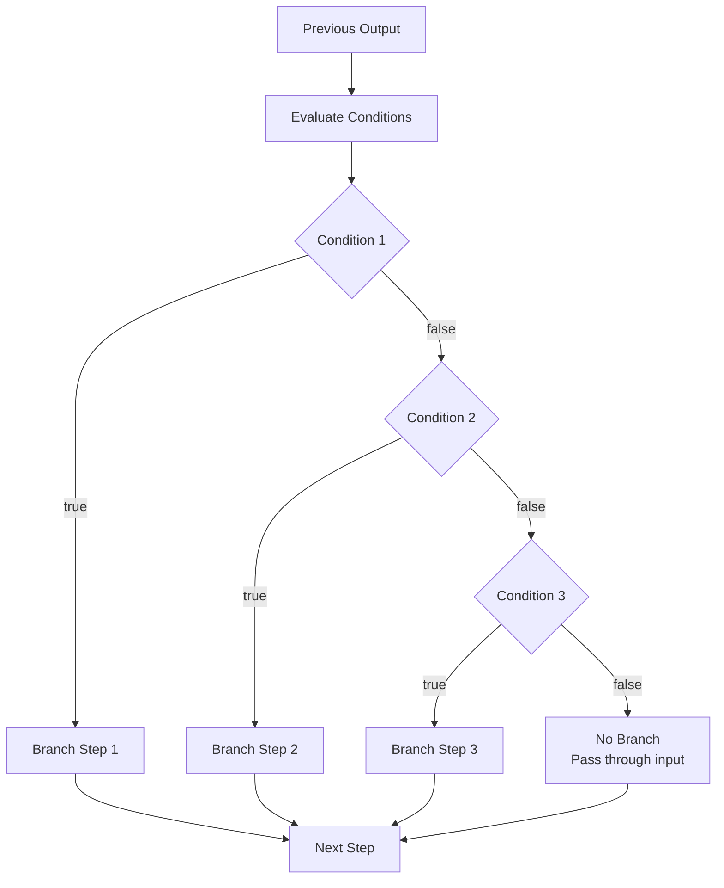

```typescript
// Example usage
workflow
  .then(analyzeRequest)
  .branch([
    {
      condition: async ({ inputData }) => inputData.priority === 'urgent',
      step: urgentProcessing,
    },
    {
      condition: async ({ inputData }) => inputData.priority === 'normal',
      step: normalProcessing,
    },
    {
      condition: async ({ inputData }) => true, // Default case
      step: defaultProcessing,
    },
  ])
  .commit()
```

**Condition Evaluation:**

- Conditions are functions: `async (params: ConditionFunctionParams) => Promise<boolean>`
- First condition that returns `true` has its step executed
- If no condition matches, the previous output passes through unchanged
- Conditions receive same context as execute functions but without `setState` and `suspend`

**Sources:** [packages/core/src/workflows/workflow.ts:1667-1737]()

### Loop Composition with .loop()

Repeatedly executes a step based on a loop condition. Supports `.doWhile()` and `.doUntil()` patterns.

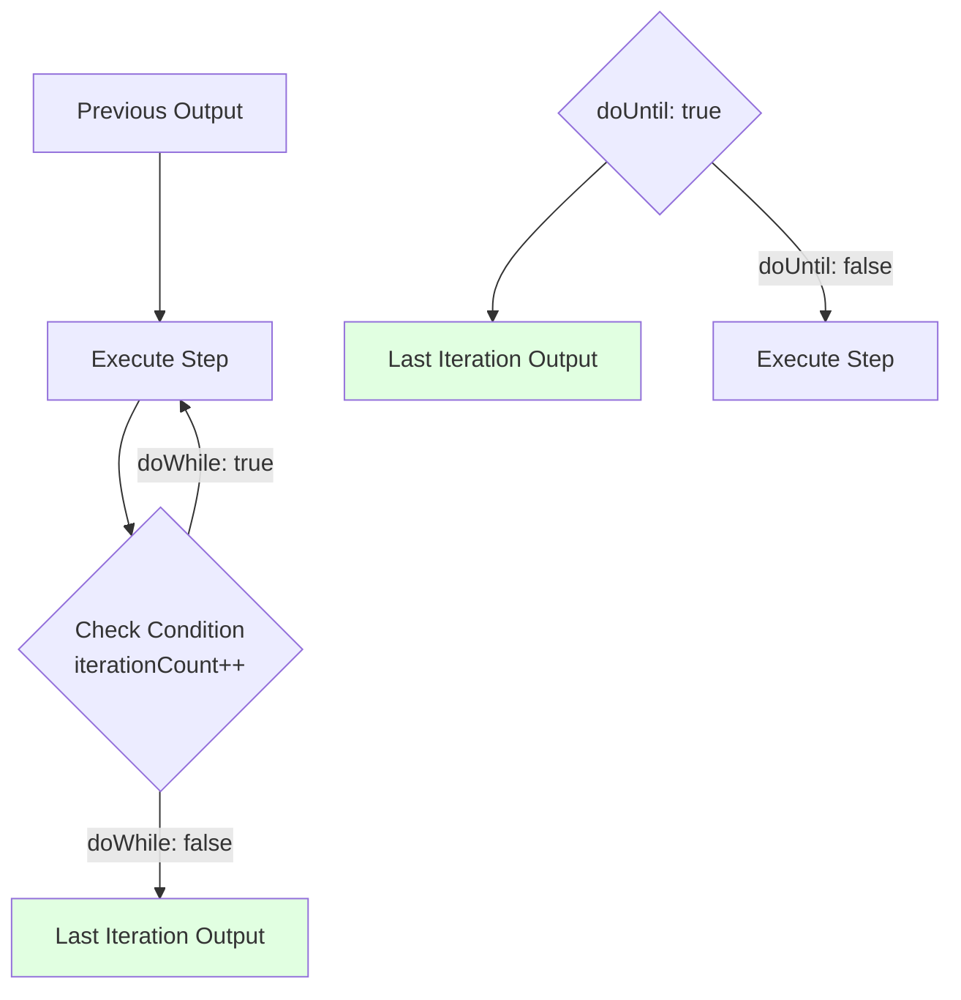

```typescript
// Example: doWhile pattern
workflow
  .then(initialize)
  .loop(processItem)
  .doWhile(async ({ inputData, iterationCount }) => {
    return iterationCount < inputData.maxIterations
  })
  .then(finalize)
  .commit()

// Example: doUntil pattern
workflow
  .then(initialize)
  .loop(checkStatus)
  .doUntil(async ({ inputData }) => {
    return inputData.status === 'complete'
  })
  .commit()
```

**Loop Condition Parameters:**

- All standard `ConditionFunctionParams`
- Additional `iterationCount: number` (starts at 0)

**Loop Behavior:**

- `.doWhile()`: Condition checked **after** each iteration, continues if `true`
- `.doUntil()`: Condition checked **after** each iteration, continues if `false`
- Loop output is the output from the final iteration
- Must call either `.doWhile()` or `.doUntil()` before continuing the chain

**Sources:** [packages/core/src/workflows/workflow.ts:1761-1810](), [packages/core/src/workflows/workflow.ts:1934-1971](), [packages/core/src/workflows/workflow.ts:1976-2013]()

### ForEach Composition with .foreach()

Iterates over an array, executing a step for each element with optional concurrency control.

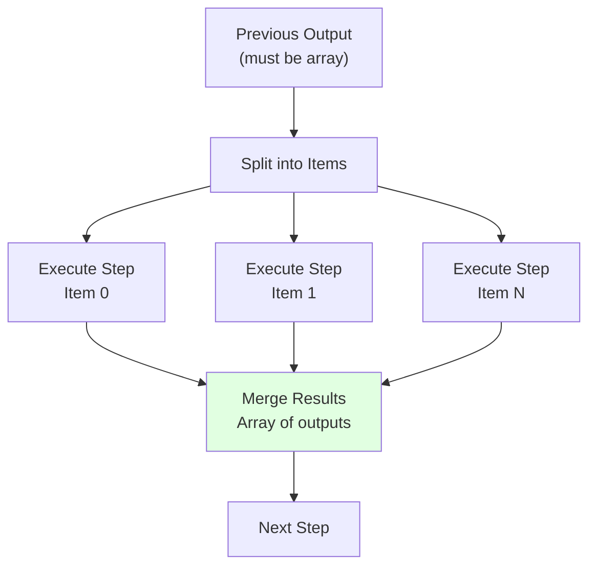

```typescript
// Example: Process array with concurrency limit
workflow
  .then(fetchUserIds) // Returns { userIds: string[] }
  .foreach(
    processUser, // Executed for each userIds[i]
    { concurrency: 5 } // Process 5 items in parallel
  )
  .then(aggregateResults) // Receives array of processUser outputs
  .commit()
```

**ForEach Options:**

| Option        | Type     | Default    | Description                 |
| ------------- | -------- | ---------- | --------------------------- |
| `concurrency` | `number` | `Infinity` | Maximum parallel executions |

**ForEach Behavior:**

- Previous step output must be an array
- Step is executed once per array element with the element as input
- Output is an array of step outputs in the same order
- Concurrency limit prevents resource exhaustion

**Sources:** [packages/core/src/workflows/workflow.ts:1835-1893]()

### Sleep and Wait Operations

Special operations for time-based workflow control.

```typescript
// Fixed duration sleep
workflow
  .then(step1)
  .sleep(5000) // Sleep for 5 seconds
  .then(step2)
  .commit()

// Dynamic duration based on previous output
workflow
  .then(calculateDelay)
  .sleep(async ({ inputData }) => inputData.delayMs)
  .then(step2)
  .commit()

// Sleep until specific date
workflow
  .then(step1)
  .sleepUntil(new Date('2024-12-31T23:59:59Z'))
  .then(step2)
  .commit()

// Dynamic date
workflow
  .then(calculateWakeTime)
  .sleepUntil(async ({ inputData }) => new Date(inputData.wakeAt))
  .then(step2)
  .commit()

// Wait for external event (evented engine only)
workflow
  .then(step1)
  .waitForEvent('user.action', { timeout: 60000 })
  .then(step2)
  .commit()
```

**Sleep Functions:**

- `.sleep(duration)` - Sleep for fixed milliseconds
- `.sleep(fn)` - Sleep for dynamic duration from function
- `.sleepUntil(date)` - Sleep until fixed date
- `.sleepUntil(fn)` - Sleep until dynamic date from function
- `.waitForEvent(name, options)` - Wait for event (evented engine only)

**Sources:** [packages/core/src/workflows/workflow.ts:1917-1929](), [packages/core/src/workflows/workflow.ts:2018-2088]()

## Commit and Execution Graph

The `.commit()` method finalizes the workflow definition and builds the execution graph.

### Commit Process

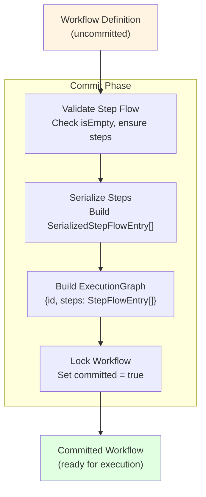

```typescript
// Commit locks the workflow
const workflow = createWorkflow({...})
  .then(step1)
  .parallel([step2a, step2b])
  .then(step3)
  .commit();  // Workflow is now committed

// Further composition attempts throw error
workflow.then(step4);  // Error: Cannot modify committed workflow
```

**Commit Validation:**

1. Checks that `stepGraph` is not empty
2. Validates all steps have required schemas
3. Builds `SerializedStepFlowEntry[]` for persistence
4. Constructs `ExecutionGraph` with `StepFlowEntry[]` for runtime
5. Sets `committed` flag to prevent further modifications

**Sources:** [packages/core/src/workflows/workflow.ts:2093-2148]()

### ExecutionGraph Structure

The execution graph is the runtime representation of the workflow.

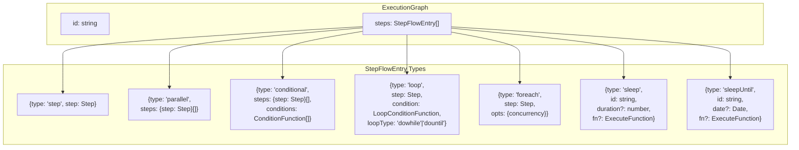

**StepFlowEntry Discriminated Union:**

| Type          | Fields                                                                               | Description                     |
| ------------- | ------------------------------------------------------------------------------------ | ------------------------------- |
| `step`        | `step: Step`                                                                         | Single sequential step          |
| `parallel`    | `steps: {step: Step}[]`                                                              | Parallel execution group        |
| `conditional` | `steps: {step: Step}[]`, `conditions: ConditionFunction[]`, `serializedConditions`   | Conditional branching           |
| `loop`        | `step: Step`, `condition: LoopConditionFunction`, `loopType: 'dowhile' \| 'dountil'` | Loop iteration                  |
| `foreach`     | `step: Step`, `opts: {concurrency: number}`                                          | Array iteration                 |
| `sleep`       | `id: string`, `duration?: number`, `fn?: ExecuteFunction`                            | Fixed or dynamic duration sleep |
| `sleepUntil`  | `id: string`, `date?: Date`, `fn?: ExecuteFunction`                                  | Fixed or dynamic date sleep     |

**Sources:** [packages/core/src/workflows/types.ts:460-487](), [packages/core/src/workflows/execution-engine.ts:18-25]()

### SerializedStepFlowEntry

For persistence and API transport, workflows are serialized to `SerializedStepFlowEntry[]` which strips function references.

```typescript
// Functions are serialized as strings
type SerializedStepFlowEntry =
  | { type: 'step'; step: SerializedStep }
  | { type: 'parallel'; steps: { step: SerializedStep }[] }
  | {
      type: 'conditional'
      steps: { step: SerializedStep }[]
      serializedConditions: { id: string; fn: string }[]
    }
  | {
      type: 'loop'
      step: SerializedStep
      serializedCondition: { id: string; fn: string }
      loopType: 'dowhile' | 'dountil'
    }
  | { type: 'foreach'; step: SerializedStep; opts: { concurrency: number } }
  | { type: 'sleep'; id: string; duration?: number; fn?: string }
  | { type: 'sleepUntil'; id: string; date?: Date; fn?: string }
```

**SerializedStep Structure:**

```typescript
type SerializedStep = {
  id: string
  description?: string
  metadata?: StepMetadata
  component?: string // 'AGENT' | 'TOOL' | 'PROCESSOR' | etc.
  serializedStepFlow?: SerializedStepFlowEntry[] // For nested workflows
  mapConfig?: string // Serialized variable mapping
  canSuspend?: boolean // Whether step supports suspend/resume
}
```

**Sources:** [packages/core/src/workflows/types.ts:499-543](), [packages/core/src/workflows/types.ts:489-497]()

## Engine Type Parameter

Workflows are generic over an `EngineType` parameter that provides engine-specific context to steps.

### Engine Type Hierarchy

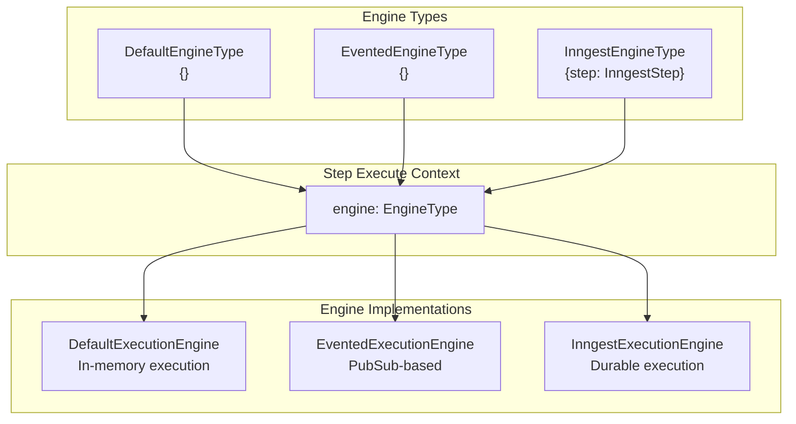

### Default Engine (packages/core)

```typescript
// DefaultEngineType is empty object
type DefaultEngineType = {}

// No special engine context
const step = createStep({
  id: 'my-step',
  execute: async ({ engine }) => {
    // engine is {} for default engine
    return { result: 'done' }
  },
  inputSchema: z.object({}),
  outputSchema: z.object({ result: z.string() }),
})
```

### Inngest Engine (workflows/inngest)

```typescript
// InngestEngineType provides Inngest step primitives
type InngestEngineType = {
  step: Inngest['step']
}

// Access Inngest step.run, step.invoke, etc.
const step = createStep({
  id: 'my-step',
  execute: async ({ engine }) => {
    // Use Inngest durable primitives
    const result = await engine.step.run('operation-id', async () => {
      return performWork()
    })
    return { result }
  },
  inputSchema: z.object({}),
  outputSchema: z.object({ result: z.string() }),
})
```

**Inngest Engine Context:**

- `engine.step.run(id, fn)` - Durable memoized execution
- `engine.step.invoke(id, fn)` - Invoke nested workflows
- `engine.step.sleep(id, duration)` - Durable sleep
- `engine.step.sleepUntil(id, date)` - Durable sleep until date
- `engine.step.waitForEvent(id, event, opts)` - Wait for external event

**Sources:** [workflows/inngest/src/types.ts:1-50](), [workflows/inngest/src/execution-engine.ts:21-34]()

## Workflow and Step Schemas

### Schema Validation Flow

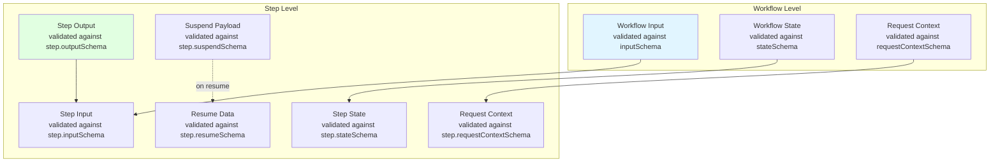

### State Schema Constraints

Step state schemas must be a subset of the workflow state schema:

```typescript
// Workflow state schema
const workflow = createWorkflow({
  id: 'my-workflow',
  stateSchema: z.object({
    counter: z.number(),
    total: z.number(),
    metadata: z.string(),
  }),
  // ...
})

// Valid step state schema (subset)
const step1 = createStep({
  id: 'step1',
  stateSchema: z.object({
    counter: z.number(),
  }),
  execute: async ({ state, setState }) => {
    // state has type { counter: number }
    await setState({ counter: state.counter + 1 })
  },
  // ...
})

// Invalid step state schema (not a subset)
const step2 = createStep({
  id: 'step2',
  stateSchema: z.object({
    counter: z.number(),
    extraField: z.string(), // Error: extraField not in workflow state
  }),
  // ...
})
```

The `SubsetOf<TStepState, TState>` utility type enforces this at compile time.

**Sources:** [packages/core/src/workflows/types.ts:776-802](), [packages/core/src/workflows/utils.ts:132-161]()

## Variable Mapping (Advanced)

The `mapVariable()` helper creates references to previous step outputs for advanced composition patterns.

```typescript
// Map entire previous step output
const ref1 = mapVariable({ step: previousStep, path: '.' })

// Map specific field from step output
const ref2 = mapVariable({ step: previousStep, path: 'result.userId' })

// Map from workflow input
const ref3 = mapVariable({ initData: workflow, path: 'config.apiKey' })

// Use in step composition (implementation-specific)
workflow
  .then(fetchUser)
  .then(processUser) // Can reference fetchUser.output via mapVariable
  .commit()
```

**Type Safety:** The `path` parameter is typed as `PathsToStringProps<TSchema>` to ensure only valid paths are referenced.

**Sources:** [packages/core/src/workflows/workflow.ts:102-124](), [packages/core/src/workflows/types.ts:204-237]()

## Complete Example

```typescript
import { z } from 'zod'
import { createWorkflow, createStep, Agent, createTool } from '@mastra/core'

// Define schemas
const inputSchema = z.object({
  userId: z.string(),
  priority: z.enum(['urgent', 'normal', 'low']),
})

const stateSchema = z.object({
  processedCount: z.number(),
})

const outputSchema = z.object({
  status: z.string(),
  results: z.array(
    z.object({
      id: z.string(),
      data: z.unknown(),
    })
  ),
})

// Create steps
const fetchUserData = createStep({
  id: 'fetch-user',
  inputSchema: z.object({ userId: z.string() }),
  outputSchema: z.object({ data: z.array(z.string()) }),
  execute: async ({ inputData }) => {
    // Fetch user data
    return { data: ['item1', 'item2', 'item3'] }
  },
})

const processItem = createStep({
  id: 'process-item',
  inputSchema: z.string(),
  outputSchema: z.object({ id: z.string(), data: z.unknown() }),
  execute: async ({ inputData, state, setState }) => {
    // Process single item and update state
    await setState({
      processedCount: state.processedCount + 1,
    })
    return { id: inputData, data: { processed: true } }
  },
})

const urgentNotification = createTool({
  id: 'urgent-notify',
  inputSchema: z.object({ results: z.array(z.unknown()) }),
  outputSchema: z.object({ status: z.string() }),
  execute: async (input) => {
    // Send urgent notification
    return { status: 'notified' }
  },
})

// Create workflow
const workflow = createWorkflow({
  id: 'user-data-processor',
  description: 'Processes user data with priority handling',
  inputSchema,
  outputSchema,
  stateSchema,
  options: {
    validateInputs: true,
    onFinish: async (result) => {
      console.log('Workflow completed:', result.status)
    },
  },
})
  // Fetch user data
  .then(fetchUserData)

  // Process each item in parallel (max 3 concurrent)
  .foreach(processItem, { concurrency: 3 })

  // Branch based on priority
  .branch([
    {
      condition: async ({ getInitData }) => {
        const input = getInitData()
        return input.priority === 'urgent'
      },
      step: createStep(urgentNotification),
    },
    {
      condition: async ({ getInitData }) => {
        const input = getInitData()
        return input.priority === 'normal'
      },
      step: createStep({
        id: 'normal-notify',
        inputSchema: z.object({ results: z.array(z.unknown()) }),
        outputSchema: z.object({ status: z.string() }),
        execute: async () => ({ status: 'queued' }),
      }),
    },
  ])

  // Finalize
  .commit()

// Execute workflow
const run = await workflow.createRun()
const result = await run.start({
  inputData: { userId: 'user-123', priority: 'urgent' },
  initialState: { processedCount: 0 },
})

console.log(result.status) // 'success'
console.log(result.result) // { status: 'notified', results: [...] }
console.log(result.steps) // Detailed step results
```

**Sources:** [packages/core/src/workflows/workflow.test.ts:217-284](), [workflows/inngest/src/index.test.ts:221-284]()
