# Workflow State Management and Persistence

<details>
<summary>Relevant source files</summary>

The following files were used as context for generating this wiki page:

- [packages/core/src/workflows/default.ts](packages/core/src/workflows/default.ts)
- [packages/core/src/workflows/evented/evented-workflow.test.ts](packages/core/src/workflows/evented/evented-workflow.test.ts)
- [packages/core/src/workflows/evented/execution-engine.ts](packages/core/src/workflows/evented/execution-engine.ts)
- [packages/core/src/workflows/evented/step-executor.test.ts](packages/core/src/workflows/evented/step-executor.test.ts)
- [packages/core/src/workflows/evented/step-executor.ts](packages/core/src/workflows/evented/step-executor.ts)
- [packages/core/src/workflows/evented/workflow-event-processor/index.ts](packages/core/src/workflows/evented/workflow-event-processor/index.ts)
- [packages/core/src/workflows/evented/workflow.ts](packages/core/src/workflows/evented/workflow.ts)
- [packages/core/src/workflows/execution-engine.ts](packages/core/src/workflows/execution-engine.ts)
- [packages/core/src/workflows/step.ts](packages/core/src/workflows/step.ts)
- [packages/core/src/workflows/types.ts](packages/core/src/workflows/types.ts)
- [packages/core/src/workflows/utils.ts](packages/core/src/workflows/utils.ts)
- [packages/core/src/workflows/workflow.test.ts](packages/core/src/workflows/workflow.test.ts)
- [packages/core/src/workflows/workflow.ts](packages/core/src/workflows/workflow.ts)
- [workflows/inngest/src/execution-engine.ts](workflows/inngest/src/execution-engine.ts)
- [workflows/inngest/src/index.test.ts](workflows/inngest/src/index.test.ts)
- [workflows/inngest/src/index.ts](workflows/inngest/src/index.ts)
- [workflows/inngest/src/run.ts](workflows/inngest/src/run.ts)
- [workflows/inngest/src/workflow.ts](workflows/inngest/src/workflow.ts)

</details>

This document describes how workflow execution state is structured, managed, and persisted across workflow runs. It covers the `ExecutionContext` and `MutableContext` types, state update mechanisms, step result tracking, and storage integration.

For information about workflow execution engines, see [Execution Engines](#4.2). For suspend/resume mechanisms that rely on persisted state, see [Suspend and Resume Mechanism](#4.4).

---

## State Architecture Overview

Workflow execution state is managed through two complementary structures:

| Structure          | Mutability                 | Purpose                                                                              |
| ------------------ | -------------------------- | ------------------------------------------------------------------------------------ |
| `ExecutionContext` | Immutable during execution | Contains complete execution state including paths, configuration, and workflow state |
| `MutableContext`   | Mutable via steps          | Subset of fields that steps can modify: `state`, `suspendedPaths`, `resumeLabels`    |

The separation ensures that most execution state remains stable while allowing controlled modifications through the `setState()` and `suspend()` APIs.

**Sources:** [packages/core/src/workflows/types.ts:783-830]()

---

## ExecutionContext Structure

```mermaid
graph TB
    subgraph ExecutionContext["ExecutionContext"]
        WorkflowId["workflowId: string"]
        RunId["runId: string"]
        ExecPath["executionPath: number[]"]
        StepExecPath["stepExecutionPath?: string[]"]
        ActiveStepsPath["activeStepsPath: Record&lt;string, number[]&gt;"]
        ForeachIndex["foreachIndex?: number"]
        SuspendedPaths["suspendedPaths: Record&lt;string, number[]&gt;"]
        ResumeLabels["resumeLabels: Record&lt;string, {stepId, foreachIndex}&gt;"]
        WaitingPaths["waitingPaths?: Record&lt;string, number[]&gt;"]
        RetryConfig["retryConfig: {attempts, delay}"]
        Format["format?: 'legacy' | 'vnext'"]
        State["state: Record&lt;string, any&gt;"]
        TracingIds["tracingIds?: {traceId, workflowSpanId}"]
    end

    subgraph MutableSubset["MutableContext (Subset)"]
        MState["state"]
        MSuspended["suspendedPaths"]
        MResume["resumeLabels"]
    end

    State -.->|"extracted to"| MState
    SuspendedPaths -.->|"extracted to"| MSuspended
    ResumeLabels -.->|"extracted to"| MResume

    MutableSubset -.->|"buildMutableContext()"| ExecutionContext
    ExecutionContext -.->|"applyMutableContext()"| MutableSubset
```

**ExecutionContext Fields:**

- **`workflowId`** / **`runId`**: Unique identifiers for workflow definition and run instance
- **`executionPath`**: Array indices tracking current position in the step graph (e.g., `[0]` for first step, `[2, 1]` for second branch of third parallel step)
- **`stepExecutionPath`**: Array of step IDs in execution order for optimization and debugging (e.g., `['step1', 'step2']`)
- **`activeStepsPath`**: Maps step IDs to their execution paths for path-based operations
- **`foreachIndex`**: Current iteration index when executing within a foreach loop
- **`suspendedPaths`**: Maps step IDs to execution paths where suspension occurred
- **`resumeLabels`**: Maps user-defined labels to step locations for labeled resume operations
- **`waitingPaths`**: Maps step IDs to paths waiting for external events
- **`retryConfig`**: Workflow-level retry settings (`attempts`, `delay`)
- **`format`**: Stream format for events (`legacy` or `vnext`)
- **`state`**: User-defined workflow state object accessible via `setState()`
- **`tracingIds`**: Trace/span IDs for observability in durable execution engines

**Sources:** [packages/core/src/workflows/types.ts:807-838]()

---

## MutableContext and State Updates

### setState() Mechanism

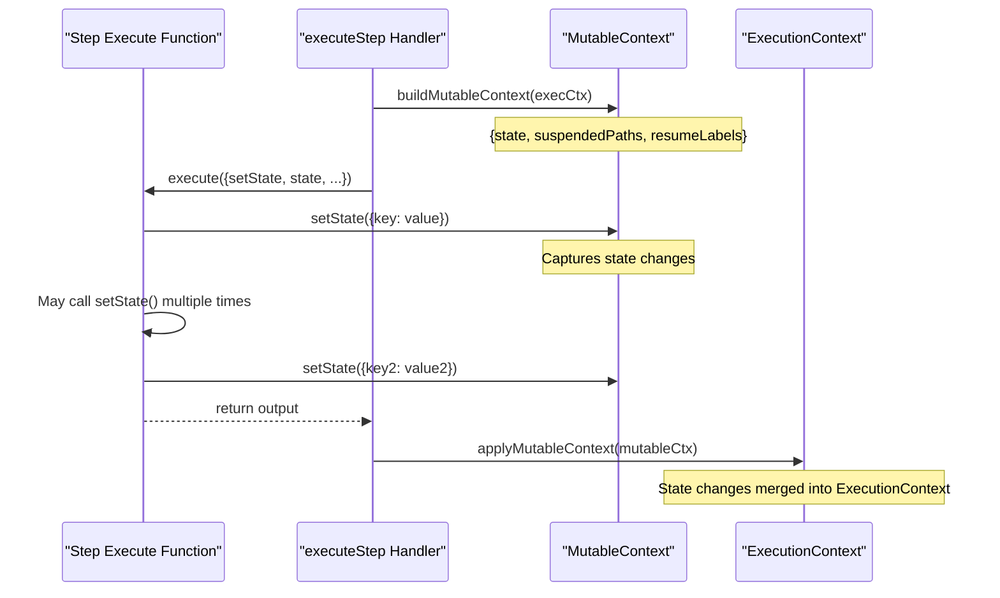

The `setState()` function provided to step execution allows steps to update workflow state. Changes are accumulated in `MutableContext` and applied atomically after step completion.

**setState Implementation:**

The `DefaultExecutionEngine.buildMutableContext()` method extracts mutable fields from `ExecutionContext`:

```typescript
buildMutableContext(executionContext: ExecutionContext): MutableContext {
  return {
    state: executionContext.state,
    suspendedPaths: executionContext.suspendedPaths,
    resumeLabels: executionContext.resumeLabels,
  };
}
```

After step completion, changes are merged back via `applyMutableContext()`:

```typescript
applyMutableContext(executionContext: ExecutionContext, mutableContext: MutableContext): void {
  Object.assign(executionContext.state, mutableContext.state);
  Object.assign(executionContext.suspendedPaths, mutableContext.suspendedPaths);
  Object.assign(executionContext.resumeLabels, mutableContext.resumeLabels);
}
```

State updates are **not visible** to the current step but are available to subsequent steps. This ensures consistent behavior across different execution engines.

**Sources:** [packages/core/src/workflows/default.ts:645-660](), [packages/core/src/workflows/step.ts:24-67](), [packages/core/src/workflows/types.ts:844-855]()

---

## Step Result Tracking

### StepResult Types

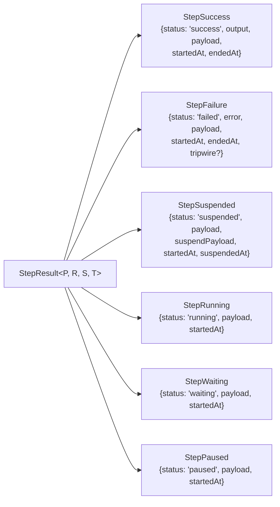

All step executions produce a `StepResult` that is stored in `stepResults: Record<string, StepResult>`. This map accumulates as the workflow executes:

```typescript
stepResults['input'] = { status: 'success', output: inputData, ... }
stepResults['step1'] = { status: 'success', output: {...}, payload: {...}, ... }
stepResults['step2'] = { status: 'running', payload: {...}, ... }
stepResults['__state'] = { status: 'success', output: workflowState, ... }
```

The `stepResults` map serves multiple purposes:

- **State restoration**: Used when resuming suspended workflows
- **Time travel**: Provides historical state for re-execution from arbitrary points
- **Result retrieval**: Enables `getStepResult()` to access previous step outputs
- **Persistence**: Serialized to storage for durable workflows
- **State tracking**: Special `__state` key holds current workflow state for retrieval

### Special stepResults Keys

| Key       | Purpose                 | Content                                           |
| --------- | ----------------------- | ------------------------------------------------- |
| `input`   | Initial workflow input  | `{ status: 'success', output: inputData }`        |
| `__state` | Current workflow state  | `{ status: 'success', output: state }`            |
| `stepId`  | Individual step results | `StepResult` with status, output, payload, timing |

The `__state` key is managed by the execution engine and updated after each `setState()` call via `persistStepUpdate()`.

**Sources:** [packages/core/src/workflows/types.ts:68-154](), [packages/core/src/workflows/step.ts:173-188](), [packages/core/src/workflows/handlers/entry.ts:200-250]()

---

## WorkflowRunState and Persistence

### Storage Schema

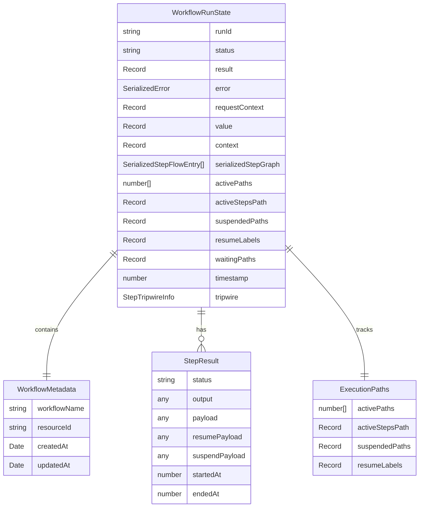

### WorkflowRunState Structure

The `WorkflowRunState` type represents the complete snapshot of a workflow run persisted to storage. It is the internal format used by execution engines:

```typescript
interface WorkflowRunState {
  runId: string
  status: WorkflowRunStatus
  result?: Record<string, any>
  error?: SerializedError
  requestContext?: Record<string, any>
  value: Record<string, string>
  context: { input?: Record<string, any> } & Record<
    string,
    SerializedStepResult
  >
  serializedStepGraph: SerializedStepFlowEntry[]
  activePaths: number[]
  activeStepsPath: Record<string, number[]>
  suspendedPaths: Record<string, number[]>
  resumeLabels: Record<string, { stepId: string; foreachIndex?: number }>
  waitingPaths: Record<string, number[]>
  timestamp: number
  tripwire?: StepTripwireInfo
  stepExecutionPath?: string[]
}
```

**Key Fields:**

- **`context`**: Contains all `stepResults` including special `input` and `__state` keys. Serialized step errors are stored as `SerializedStepResult` objects.
- **`stepExecutionPath`**: Ordered array of executed step IDs (e.g., `['step1', 'step2']`) for optimization and debugging
- **`activePaths`** / **`activeStepsPath`**: Track current execution position in the step graph
- **`suspendedPaths`**: Paths where workflow is suspended, keyed by step ID
- **`resumeLabels`**: User-defined labels for resume operations

### WorkflowState (API Response Format)

The `WorkflowState` type combines metadata with execution state for API responses and provides a cleaner interface than `WorkflowRunState`:

| Field                 | Type                         | Purpose                                           |
| --------------------- | ---------------------------- | ------------------------------------------------- |
| `runId`               | `string`                     | Unique run identifier                             |
| `workflowName`        | `string`                     | Workflow definition ID                            |
| `resourceId`          | `string?`                    | Tenant/user identifier for multi-tenant scenarios |
| `createdAt`           | `Date`                       | Run creation timestamp                            |
| `updatedAt`           | `Date`                       | Last update timestamp                             |
| `status`              | `WorkflowRunStatus`          | Current execution status                          |
| `initialState`        | `Record?`                    | Initial workflow state                            |
| `stepExecutionPath`   | `string[]?`                  | Ordered step IDs executed                         |
| `steps`               | `Record?`                    | Step results (optional, excluded for performance) |
| `result`              | `Record?`                    | Final workflow output                             |
| `error`               | `SerializedError?`           | Failure details                                   |
| `activeStepsPath`     | `Record?`                    | Path tracking (optional)                          |
| `serializedStepGraph` | `SerializedStepFlowEntry[]?` | Graph structure (optional)                        |

**Field Filtering:** The `getWorkflowRunById()` method supports a `fields` parameter of type `WorkflowStateField[]` to reduce payload size by excluding expensive fields like `steps`, `activeStepsPath`, or `serializedStepGraph`.

**Sources:** [packages/core/src/workflows/types.ts:328-353](), [packages/core/src/workflows/types.ts:273-327](), [packages/core/src/workflows/workflow.ts:1800-1900]()

---

## State Serialization for Durability

### RequestContext Serialization

Durable execution engines (Inngest) require serialization of `RequestContext` because step memoization replays from cached results:

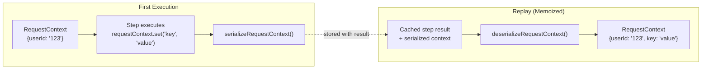

**Default Engine:** `requiresDurableContextSerialization()` returns `false` - passes `RequestContext` by reference.

**Inngest Engine:** `requiresDurableContextSerialization()` returns `true` - serializes context with each step result.

```typescript
// DefaultExecutionEngine implementation
serializeRequestContext(requestContext: RequestContext): Record<string, any> {
  const obj: Record<string, any> = {};
  requestContext.forEach((value, key) => {
    obj[key] = value;
  });
  return obj;
}

deserializeRequestContext(obj: Record<string, any>): RequestContext {
  return new Map(Object.entries(obj)) as unknown as RequestContext;
}
```

**Sources:** [packages/core/src/workflows/default.ts:563-590](), [workflows/inngest/src/execution-engine.ts:65-71]()

---

## Snapshot Persistence

### Persistence Triggers

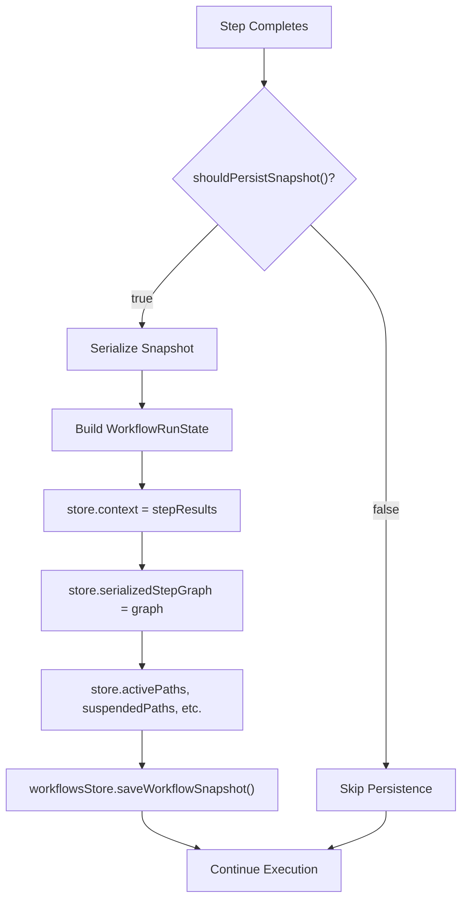

### shouldPersistSnapshot Configuration

Workflows can customize when snapshots are saved via the `shouldPersistSnapshot` option:

```typescript
const workflow = createWorkflow({
  id: 'my-workflow',
  options: {
    shouldPersistSnapshot: ({ stepResults, workflowStatus }) => {
      // Default: persist on terminal states
      return ['success', 'failed', 'suspended', 'tripwire'].includes(
        workflowStatus
      )
    },
  },
})
```

**Default Behavior:** Snapshots are saved when workflow reaches a terminal state (`success`, `failed`, `suspended`, `tripwire`).

**Custom Logic:** Users can persist more frequently (e.g., after each step) or less frequently (e.g., only on failure).

### Snapshot Storage

Snapshots are saved via the storage adapter's `persistWorkflowSnapshot()` method:

```typescript
await workflowsStore.persistWorkflowSnapshot({
  workflowName: workflow.id,
  runId: run.runId,
  resourceId: run.resourceId,
  snapshot: {
    runId: executionContext.runId,
    status: workflowStatus,
    context: stepResults,
    serializedStepGraph: serializedStepGraph,
    activePaths: executionContext.activePaths,
    activeStepsPath: executionContext.activeStepsPath,
    suspendedPaths: executionContext.suspendedPaths,
    resumeLabels: executionContext.resumeLabels,
    waitingPaths: executionContext.waitingPaths,
    stepExecutionPath: executionContext.stepExecutionPath,
    value: {},
    timestamp: Date.now(),
  },
})
```

The `persistWorkflowSnapshot()` method is called by execution engines when `shouldPersistSnapshot()` returns true. Storage adapters implement this method to persist the snapshot:

- **PostgreSQL**: Inserts into `workflow_snapshot` table with `REPLICA IDENTITY FULL` for atomic updates
- **LibSQL**: Stores in `workflow_snapshot` table with upsert semantics
- **Mock Store**: Maintains in-memory map for testing

**Sources:** [packages/core/src/workflows/execution-engine.ts:30-46](), [packages/core/src/workflows/types.ts:419-440](), [packages/core/src/workflows/handlers/entry.ts:300-350]()

---

## State Restoration

### Resume Flow

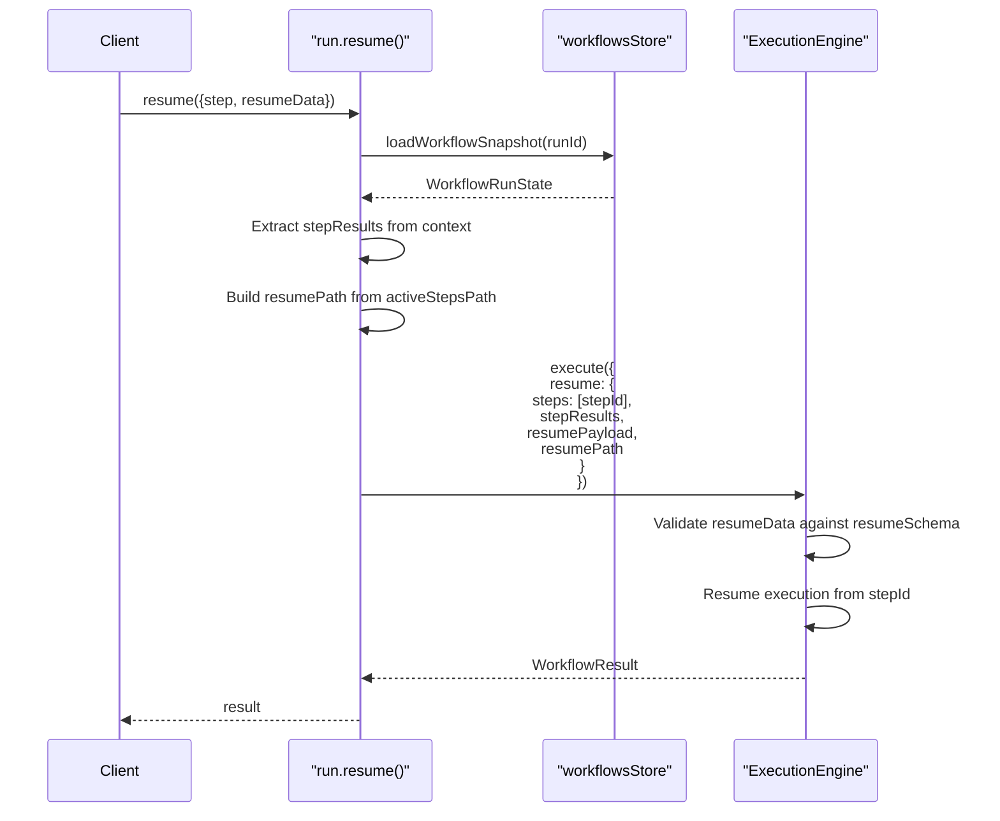

**Resume Parameters:**

- **`steps`**: Array of step IDs to resume (usually single step)
- **`stepResults`**: Complete step result map from snapshot
- **`resumePayload`**: User-provided data for resumption
- **`resumePath`**: Execution path to resume from

### Time Travel Flow

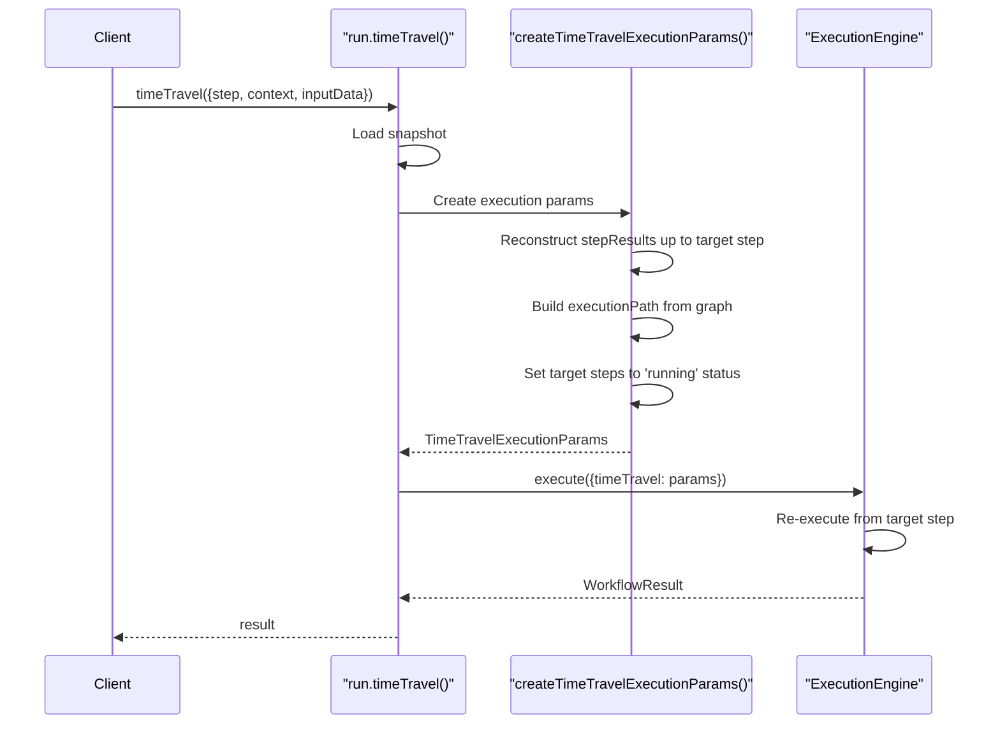

**Time Travel Parameters:**

- **`executionPath`**: Path to target step in graph
- **`inputData`**: New input data for target step (overrides history)
- **`stepResults`**: Historical results for steps before target
- **`steps`**: Step IDs to re-execute
- **`state`**: Workflow state at time travel point
- **`resumeData`**: Optional resume data if target was suspended

**Sources:** [packages/core/src/workflows/utils.ts:255-380](), [packages/core/src/workflows/workflow.ts:2100-2250](), [workflows/inngest/src/run.ts:200-350]()

---

## Engine-Specific State Management

### Default Engine

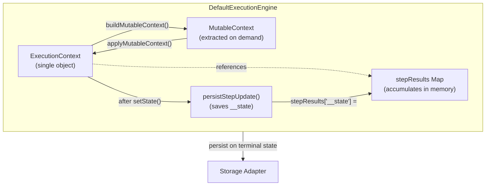

- **State Location:** Single `ExecutionContext` object maintained throughout execution
- **State Updates:** Applied via `applyMutableContext()` after step completion, then saved to `stepResults['__state']` via `persistStepUpdate()`
- **Persistence:** Saves snapshot only when `shouldPersistSnapshot` returns true (default: terminal states)
- **RequestContext:** Passed by reference (no serialization needed)
- **Step Execution Path:** Tracked in `executionContext.stepExecutionPath` for optimization

**Key Methods:**

- `buildMutableContext(executionContext)`: Extracts `{state, suspendedPaths, resumeLabels}`
- `applyMutableContext(executionContext, mutableContext)`: Merges changes back into `ExecutionContext`
- `persistStepUpdate(params)`: Saves current state to `stepResults['__state']`

**Sources:** [packages/core/src/workflows/default.ts:645-660](), [packages/core/src/workflows/default.ts:662-1200](), [packages/core/src/workflows/handlers/entry.ts:200-250]()

### Evented Engine

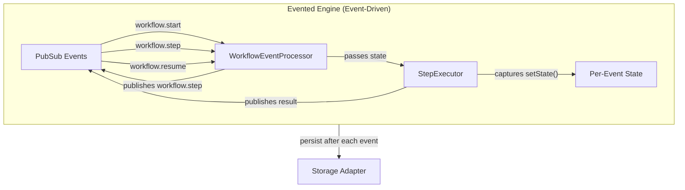

- **State Location:** Passed as event payloads, reconstructed per event
- **State Updates:** Captured in step executor, propagated via events
- **Persistence:** Saves snapshot after each step completion
- **RequestContext:** Serialized in event payloads

**Sources:** [packages/core/src/workflows/evented/execution-engine.ts:19-200](), [packages/core/src/workflows/evented/workflow-event-processor/index.ts:63-120](), [packages/core/src/workflows/evented/step-executor.ts:59-180]()

### Inngest Engine

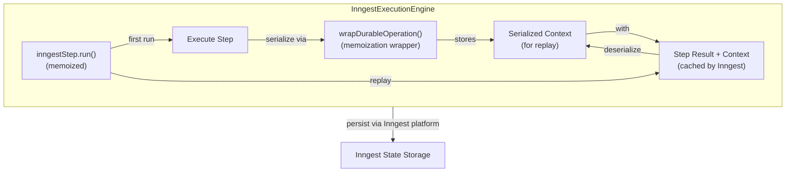

- **State Location:** Serialized with each step result for Inngest memoization via `inngestStep.run()`
- **State Updates:** Serialized/deserialized across step boundaries using `serializeRequestContext()` and `deserializeRequestContext()`
- **Persistence:** Managed by Inngest platform automatically, no explicit `persistWorkflowSnapshot()` calls needed
- **RequestContext:** Always serialized (required for replay across function invocations)
- **Durability:** All operations wrapped in `wrapDurableOperation()` which calls `inngestStep.run()` for replay safety

**Key Methods:**

- `wrapDurableOperation(operationId, fn)`: Wraps operations in `inngestStep.run()` for memoization (line 150-200)
- `serializeRequestContext(requestContext)`: Converts `RequestContext` Map to plain object (inherited from DefaultExecutionEngine)
- `deserializeRequestContext(obj)`: Reconstructs `RequestContext` from serialized object (inherited from DefaultExecutionEngine)
- `requiresDurableContextSerialization()`: Returns `true` to enable context serialization (line 69-71)
- `createStepSpan()`: Memoizes span creation for idempotent tracing across replays (line 250-300)
- `isNestedWorkflowStep(step)`: Detects `InngestWorkflow` instances for special handling (line 60-62)

**Sources:** [workflows/inngest/src/execution-engine.ts:21-200](), [workflows/inngest/src/execution-engine.ts:250-350](), [workflows/inngest/src/workflow.ts:28-180](), [packages/core/src/workflows/default.ts:616-639]()

---

## State vs StepResults vs Context

### Terminology Disambiguation

| Term                    | Scope              | Content                                                                   | Access                                           |
| ----------------------- | ------------------ | ------------------------------------------------------------------------- | ------------------------------------------------ |
| **`state`**             | Workflow-level     | User-defined key-value pairs set via `setState()`                         | Read: `state` param, Write: `setState()`         |
| **`stepResults`**       | Internal execution | Map of step IDs to `StepResult` objects (status, output, payload, timing) | Read: `getStepResult()`, Write: automatic        |
| **`context`** (storage) | Persisted snapshot | Synonym for `stepResults` when saved to storage                           | Read: `snapshot.context`, Write: via persistence |
| **`requestContext`**    | Per-request        | Request-scoped data (user ID, tenant ID, etc.)                            | Read/Write: `requestContext.get/set()`           |

**Example:**

```typescript
const workflow = createWorkflow({
  stateSchema: z.object({ counter: z.number() }),
})

const step1 = createStep({
  id: 'increment',
  execute: async ({ state, setState, getStepResult }) => {
    // state: workflow-level state
    const current = state.counter || 0

    // setState: update workflow state
    await setState({ counter: current + 1 })

    // getStepResult: access previous step outputs
    const prevOutput = getStepResult('previousStep')

    return { newValue: current + 1 }
  },
})
```

After execution, `stepResults['increment']` contains:

```typescript
{
  status: 'success',
  output: { newValue: 1 },
  payload: { /* input to step */ },
  startedAt: 1234567890,
  endedAt: 1234567891
}
```

While workflow `state` contains:

```typescript
{
  counter: 1
}
```

**Sources:** [packages/core/src/workflows/step.ts:23-67](), [packages/core/src/workflows/types.ts:312-336]()
