# Workflow Streaming and Events

<details>
<summary>Relevant source files</summary>

The following files were used as context for generating this wiki page:

- [packages/core/src/workflows/default.ts](packages/core/src/workflows/default.ts)
- [packages/core/src/workflows/evented/evented-workflow.test.ts](packages/core/src/workflows/evented/evented-workflow.test.ts)
- [packages/core/src/workflows/evented/execution-engine.ts](packages/core/src/workflows/evented/execution-engine.ts)
- [packages/core/src/workflows/evented/step-executor.test.ts](packages/core/src/workflows/evented/step-executor.test.ts)
- [packages/core/src/workflows/evented/step-executor.ts](packages/core/src/workflows/evented/step-executor.ts)
- [packages/core/src/workflows/evented/workflow-event-processor/index.ts](packages/core/src/workflows/evented/workflow-event-processor/index.ts)
- [packages/core/src/workflows/evented/workflow.ts](packages/core/src/workflows/evented/workflow.ts)
- [packages/core/src/workflows/execution-engine.ts](packages/core/src/workflows/execution-engine.ts)
- [packages/core/src/workflows/step.ts](packages/core/src/workflows/step.ts)
- [packages/core/src/workflows/types.ts](packages/core/src/workflows/types.ts)
- [packages/core/src/workflows/utils.ts](packages/core/src/workflows/utils.ts)
- [packages/core/src/workflows/workflow.test.ts](packages/core/src/workflows/workflow.test.ts)
- [packages/core/src/workflows/workflow.ts](packages/core/src/workflows/workflow.ts)
- [workflows/inngest/src/execution-engine.ts](workflows/inngest/src/execution-engine.ts)
- [workflows/inngest/src/index.test.ts](workflows/inngest/src/index.test.ts)
- [workflows/inngest/src/index.ts](workflows/inngest/src/index.ts)
- [workflows/inngest/src/run.ts](workflows/inngest/src/run.ts)
- [workflows/inngest/src/workflow.ts](workflows/inngest/src/workflow.ts)

</details>

This page documents how workflows publish execution events in real-time and how clients consume them via streaming APIs. It covers the event publishing architecture, stream formats, chunk types, and engine-specific streaming behavior.

For workflow execution fundamentals, see [Workflow Definition and Step Composition](#4.1). For workflow state persistence, see [Workflow State Management and Persistence](#4.3). For client-side consumption of workflow streams, see [Client SDK and UI Components](#10).

---

## Event Publishing Architecture

Workflows publish execution events through a `PubSub` abstraction that enables real-time observability of workflow progress. All workflow engines use this common event infrastructure, though they differ in how they integrate it.

### PubSub System Overview

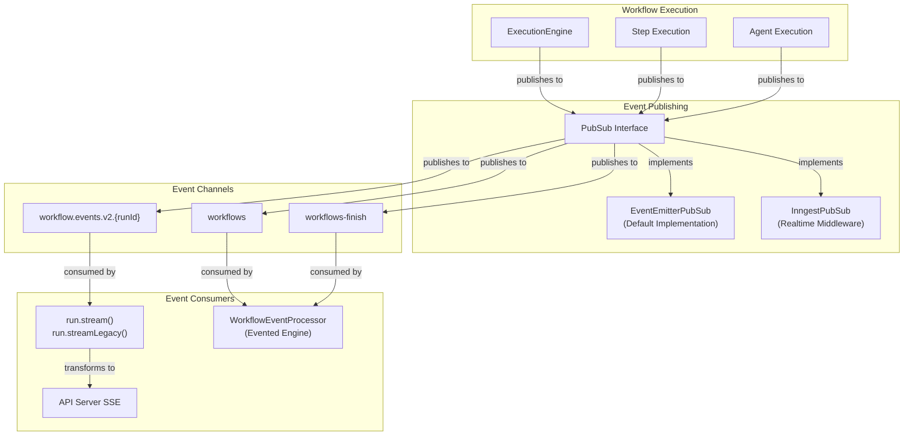

**Key Components:**

- **`PubSub` Interface**: Abstract publish/subscribe system defined in [packages/core/src/events/pubsub.ts:1-50]()
- **`EventEmitterPubSub`**: Default Node.js EventEmitter-based implementation in [packages/core/src/events/event-emitter.ts:1-100]()
- **`InngestPubSub`**: Inngest realtime middleware integration in [workflows/inngest/src/pubsub.ts:1-150]()
- **Event Channels**: Topic-based routing for different event types and workflows

**Sources:** [packages/core/src/events/pubsub.ts:1-50](), [packages/core/src/events/event-emitter.ts:1-100](), [workflows/inngest/src/pubsub.ts:1-150]()

### Event Symbols and Workflow Context

Workflows pass the PubSub instance and stream format to steps via special symbols that prevent naming collisions:

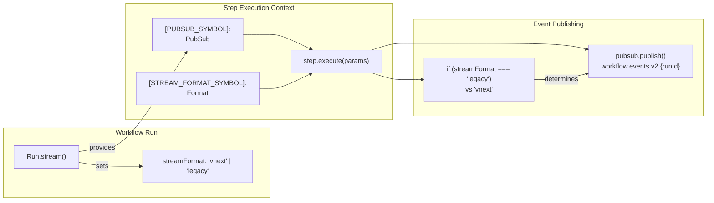

**Key Symbols:**

- **`PUBSUB_SYMBOL`**: Unique symbol for passing PubSub instance to steps [packages/core/src/workflows/constants.ts:1-10]()
- **`STREAM_FORMAT_SYMBOL`**: Unique symbol for passing format preference [packages/core/src/workflows/constants.ts:1-10]()

These symbols are used in step execution context to access the PubSub instance and determine which event format to emit.

**Sources:** [packages/core/src/workflows/constants.ts:1-10](), [packages/core/src/workflows/workflow.ts:408-418](), [workflows/inngest/src/index.ts:323-333]()

---

## Stream Formats

Workflows support two stream formats: `legacy` (v1/v2 compatibility) and `vnext` (modern structured format). The format is determined at stream creation time.

### Format Comparison

| Feature             | Legacy Format                                                                                                                                | VNext Format                                                                                                                                                       |
| ------------------- | -------------------------------------------------------------------------------------------------------------------------------------------- | ------------------------------------------------------------------------------------------------------------------------------------------------------------------ |
| **Event Types**     | `tool-call-streaming-start`<br/>`tool-call-delta`<br/>`tool-call-streaming-finish`<br/>`step-result`<br/>`step-suspended`<br/>`step-waiting` | `workflow-step-start`<br/>`workflow-step-finish`<br/>`workflow-step-error`<br/>`workflow-step-suspend`<br/>`text-delta`<br/>`tool-call`<br/>`data-*` custom chunks |
| **Structure**       | Flat event with `type` and `data`                                                                                                            | Typed chunk objects with discriminated unions                                                                                                                      |
| **Agent Streaming** | Wrapped in tool-call events                                                                                                                  | Direct stream forwarding via `forwardAgentStreamChunk`                                                                                                             |
| **Custom Data**     | Not supported                                                                                                                                | `data-*` prefix for custom chunks                                                                                                                                  |
| **Type Safety**     | Weak (string types)                                                                                                                          | Strong (`ChunkType` discriminated union)                                                                                                                           |

**Sources:** [packages/core/src/workflows/types.ts:241-260](), [packages/core/src/stream/types.ts:1-100]()

### Legacy Format Events

Legacy format is used when `streamFormat === 'legacy'` and emits events compatible with older agent streaming APIs:

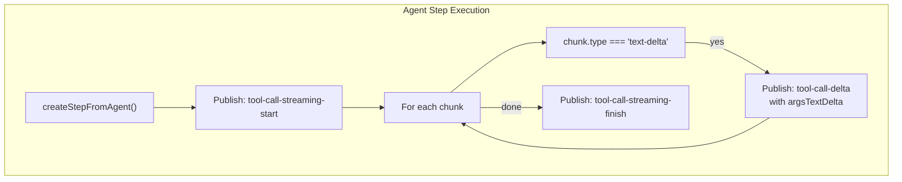

**Event Structure:**

- **`tool-call-streaming-start`**: Emitted when agent begins streaming [packages/core/src/workflows/workflow.ts:482-486]()
- **`tool-call-delta`**: Emitted for each text delta chunk with `argsTextDelta` field [packages/core/src/workflows/workflow.ts:492-497]()
- **`tool-call-streaming-finish`**: Emitted when agent stream completes [packages/core/src/workflows/workflow.ts:500-504]()

**Sources:** [packages/core/src/workflows/workflow.ts:481-504](), [workflows/inngest/src/index.ts:400-419]()

### VNext Format Events

VNext format is the default and provides structured chunk types that align with the AI SDK streaming model:

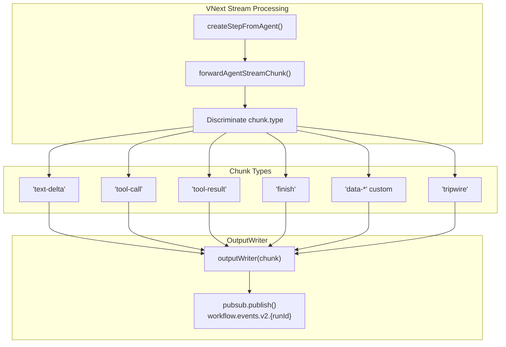

**Chunk Forwarding:**

The `forwardAgentStreamChunk` utility transforms AI SDK chunks into workflow stream events:

- **Text Deltas**: Forward directly with `type: 'text-delta'`
- **Tool Calls**: Forward with `type: 'tool-call'` including tool name and arguments
- **Tool Results**: Forward with `type: 'tool-result'` including result data
- **Custom Data**: Forward any `data-*` chunks for client-side processing
- **Tripwire**: Special abort signal forwarded as-is

**Sources:** [packages/core/src/workflows/stream-utils.ts:1-100](), [packages/core/src/workflows/workflow.ts:505-513]()

---

## Event Types and Chunk Types

### Workflow-Level Events

Workflow execution engines publish lifecycle events to the `workflows` channel for coordination:

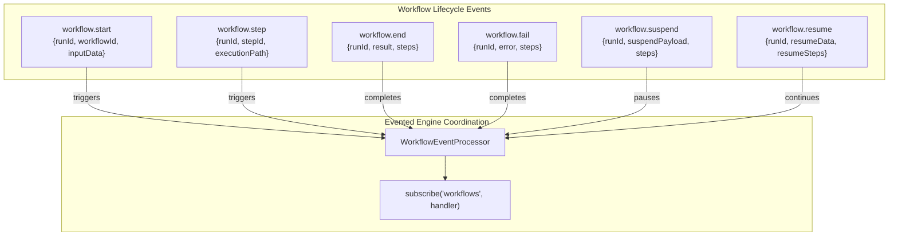

**Event Types:**

- **`workflow.start`**: Published when workflow execution begins [packages/core/src/workflows/evented/execution-engine.ts:133-143]()
- **`workflow.step`**: Published for each step execution [packages/core/src/workflows/evented/workflow-event-processor/index.ts:150-200]()
- **`workflow.end`**: Published on successful completion [packages/core/src/workflows/evented/workflow-event-processor/index.ts:137-148]()
- **`workflow.fail`**: Published on error [packages/core/src/workflows/evented/workflow-event-processor/index.ts:129-151]()
- **`workflow.suspend`**: Published when workflow suspends [packages/core/src/workflows/evented/workflow-event-processor/index.ts:189-208]()
- **`workflow.resume`**: Published when resuming execution [packages/core/src/workflows/evented/execution-engine.ts:144-158]()

**Sources:** [packages/core/src/events/types.ts:1-50](), [packages/core/src/workflows/evented/execution-engine.ts:120-180](), [packages/core/src/workflows/evented/workflow-event-processor/index.ts:129-208]()

### Step-Level Stream Events

Individual step execution publishes fine-grained events to the `workflow.events.v2.{runId}` channel:

| Event Type              | Published By             | Data Structure                  | Purpose                     |
| ----------------------- | ------------------------ | ------------------------------- | --------------------------- |
| `workflow-step-start`   | `DefaultExecutionEngine` | `{id, stepCallId, ...stepInfo}` | Step begins execution       |
| `workflow-step-finish`  | Step handlers            | `{stepId, output, status}`      | Step completes successfully |
| `workflow-step-error`   | Step handlers            | `{stepId, error}`               | Step fails with error       |
| `workflow-step-suspend` | Suspend handler          | `{stepId, suspendPayload}`      | Step suspends execution     |
| `text-delta`            | Agent streams            | `{textDelta}`                   | Incremental text output     |
| `tool-call`             | Agent streams            | `{toolCallId, toolName, args}`  | Agent invokes a tool        |
| `tool-result`           | Agent streams            | `{toolCallId, result}`          | Tool execution result       |
| `data-*`                | Custom processors        | `{type, ...data}`               | Custom application data     |

**Sources:** [packages/core/src/workflows/types.ts:241-260](), [packages/core/src/stream/types.ts:1-100](), [packages/core/src/workflows/default.ts:186-202]()

### ChunkType Discriminated Union

The `ChunkType` type defines all possible stream chunk shapes as a discriminated union:

```typescript
type ChunkType =
  | { type: 'text-delta'; textDelta: string }
  | { type: 'tool-call'; toolCallId: string; toolName: string; args: any }
  | { type: 'tool-result'; toolCallId: string; result: any }
  | { type: 'finish'; finishReason: string; usage?: TokenUsage }
  | { type: 'error'; error: Error }
  | { type: 'tripwire'; payload: TripwireInfo }
  | { type: `data-${string}`; [key: string]: any }
  | WorkflowStreamEvent
```

This type ensures type-safe event handling in TypeScript clients.

**Sources:** [packages/core/src/stream/types.ts:1-100](), [packages/core/src/workflows/types.ts:14]()

---

## Engine-Specific Streaming Behavior

Different workflow engines implement streaming with varying architectures based on their execution models.

### Default Engine Streaming

The `DefaultExecutionEngine` publishes events directly during synchronous step execution:

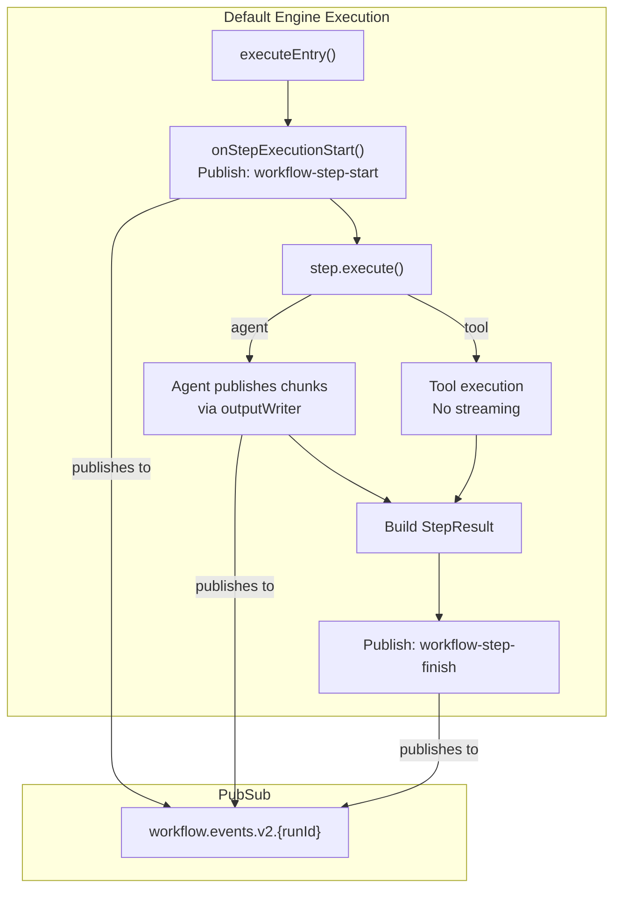

**Key Characteristics:**

- **Synchronous Publishing**: Events published inline during execution
- **Direct PubSub Access**: Steps receive PubSub via `PUBSUB_SYMBOL`
- **OutputWriter Abstraction**: Generic writer interface for streaming chunks
- **No Coordination Layer**: No separate event processor needed

**Sources:** [packages/core/src/workflows/default.ts:175-203](), [packages/core/src/workflows/handlers/step.ts:1-200]()

### Evented Engine Streaming

The `EventedExecutionEngine` uses a separate `WorkflowEventProcessor` to coordinate execution via events:

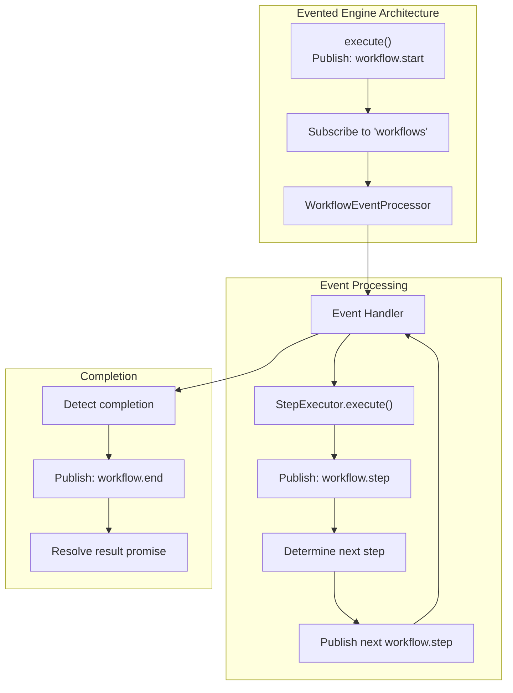

**Key Characteristics:**

- **Event-Driven Coordination**: Workflow steps triggered by events, not direct calls
- **Asynchronous Execution**: Steps can execute in parallel, coordinated by event processor
- **Separate Processor**: `WorkflowEventProcessor` manages execution graph traversal
- **Channels**: Uses `workflows` for coordination, `workflows-finish` for completion

**Sources:** [packages/core/src/workflows/evented/execution-engine.ts:1-185](), [packages/core/src/workflows/evented/workflow-event-processor/index.ts:1-100]()

### Inngest Engine Streaming

The `InngestExecutionEngine` integrates with Inngest's realtime middleware for streaming:

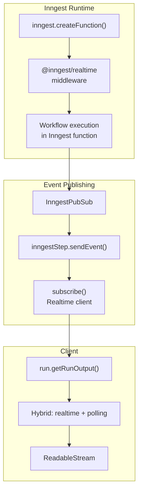

**Key Characteristics:**

- **Inngest Realtime Middleware**: Uses `@inngest/realtime` for SSE streaming
- **Durable Execution**: Events published from durable Inngest functions
- **Hybrid Approach**: Combines realtime subscription with polling fallback [workflows/inngest/src/run.ts:125-200]()
- **API Integration**: Queries Inngest API for run status and results

**Sources:** [workflows/inngest/src/pubsub.ts:1-150](), [workflows/inngest/src/run.ts:1-300](), [workflows/inngest/src/execution-engine.ts:1-500]()

---

## Client Consumption Patterns

### Run Stream APIs

The `Run` class provides multiple streaming APIs for consuming workflow events:

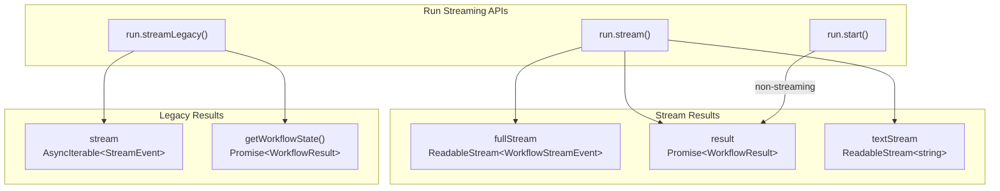

**Modern API (`run.stream()`):**

Returns a `WorkflowRunOutput` object with multiple access patterns:

- **`fullStream`**: Complete stream of all events including workflow lifecycle and chunk data
- **`result`**: Promise that resolves to final `WorkflowResult` when execution completes
- **`textStream`**: Filtered stream containing only text deltas (for simple text output scenarios)

**Legacy API (`run.streamLegacy()`):**

Returns object with:

- **`stream`**: AsyncIterable of events (legacy format)
- **`getWorkflowState()`**: Promise for final result

**Sources:** [packages/core/src/stream/RunOutput.ts:1-200](), [packages/core/src/workflows/workflow.ts:1900-2100]()

### Server-Sent Events (SSE) Integration

The API server exposes workflow streams via SSE for browser and HTTP client consumption:

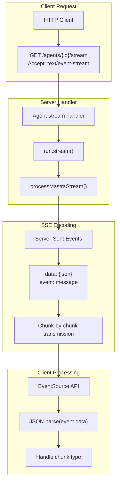

**SSE Format:**

Each chunk is transmitted as an SSE message:

```
event: message
data: {"type":"text-delta","textDelta":"Hello"}

event: message
data: {"type":"finish","finishReason":"stop"}
```

**Processing Utility:**

The `processMastraStream` utility in the client SDK handles SSE parsing and type discrimination.

**Sources:** [packages/core/src/stream/MastraWorkflowStream.ts:1-200](), [packages/server/src/routes/agents.ts:1-300]()

### Consuming Streams in Workflows

Workflows can consume streams from nested agent or workflow executions:

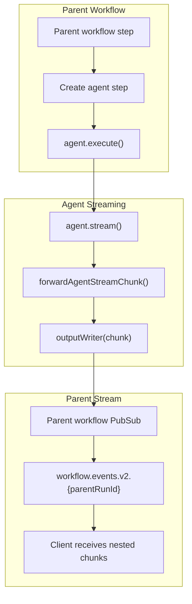

**Nested Streaming:**

When an agent step executes within a workflow, its stream chunks are forwarded to the parent workflow's event stream via the `outputWriter` function. This enables clients to receive real-time updates from nested executions.

**Sources:** [packages/core/src/workflows/workflow.ts:407-430](), [packages/core/src/workflows/stream-utils.ts:1-50]()

---

## Real-Time Updates and State Synchronization

### Streaming vs Polling

Different engines offer different guarantees for real-time updates:

| Engine      | Real-Time Mechanism       | Fallback    | Latency   |
| ----------- | ------------------------- | ----------- | --------- |
| **Default** | In-memory PubSub          | N/A         | Instant   |
| **Evented** | Event-driven PubSub       | N/A         | <100ms    |
| **Inngest** | Realtime middleware + SSE | Polling API | 100-500ms |

**Default/Evented Engines:**

Use `EventEmitterPubSub` which broadcasts events to all subscribers in-process. Suitable for single-server deployments or when clients connect to the same server instance executing the workflow.

**Inngest Engine:**

Uses `@inngest/realtime` middleware to publish events from durable Inngest functions to connected SSE clients. Includes polling fallback for resilience [workflows/inngest/src/run.ts:125-200]().

**Sources:** [packages/core/src/events/event-emitter.ts:1-100](), [workflows/inngest/src/pubsub.ts:1-150](), [workflows/inngest/src/run.ts:125-200]()

### Custom Event Types

Processors and steps can publish custom events using the `data-*` prefix:

```typescript
// In a processor
await writer.custom({
  type: 'data-progress',
  progress: 0.5,
  message: 'Processing documents...',
})

// In a step
await outputWriter({
  type: 'data-metric',
  metric: 'tokens_processed',
  value: 1500,
})
```

Clients can discriminate these custom chunks by checking the `type` field prefix:

```typescript
for await (const chunk of stream.fullStream) {
  if (chunk.type.startsWith('data-')) {
    // Handle custom application data
    console.log('Custom event:', chunk)
  }
}
```

**Sources:** [packages/core/src/stream/types.ts:1-100](), [packages/core/src/processors/types.ts:1-100]()

### Performance Considerations

**Event Volume:**

- **High-Frequency Events**: Text deltas from LLM streaming can generate 10-100+ events per second
- **Backpressure**: Node.js streams handle backpressure automatically via the Streams API
- **Filtering**: Use `textStream` for text-only scenarios to reduce processing overhead

**Memory Usage:**

- **Event Retention**: In-memory PubSub stores no history; events are ephemeral
- **Long-Running Workflows**: EventEmitter subscribers are removed when streams close
- **Inngest**: Events not stored in memory; transmitted via SSE only

**Network Optimization:**

- **SSE Compression**: HTTP/2 enables header compression for SSE
- **Batching**: Not implemented; each chunk sent immediately for low latency
- **Reconnection**: EventSource API handles automatic reconnection on disconnect

**Sources:** [packages/core/src/events/event-emitter.ts:1-100](), [packages/core/src/stream/RunOutput.ts:1-200]()

---

## Summary

Workflow streaming in Mastra provides real-time visibility into execution progress through a flexible event publishing system:

- **PubSub Abstraction**: Common interface across engines with multiple implementations
- **Dual Stream Formats**: Legacy format for compatibility, VNext format for structured typing
- **Engine Integration**: Each engine integrates PubSub differently based on execution model
- **Rich Event Types**: Comprehensive chunk types for workflow lifecycle, step execution, and agent streaming
- **Client APIs**: Multiple consumption patterns from simple awaitable results to low-level stream processing
- **Custom Events**: Extensible with `data-*` prefixed custom chunks for application-specific data

The streaming system balances real-time responsiveness with type safety and supports diverse deployment scenarios from single-server to distributed durable execution.

**Sources:** [packages/core/src/workflows/workflow.ts:1-2500](), [packages/core/src/workflows/types.ts:1-850](), [packages/core/src/stream/types.ts:1-100](), [packages/core/src/events/pubsub.ts:1-50]()
