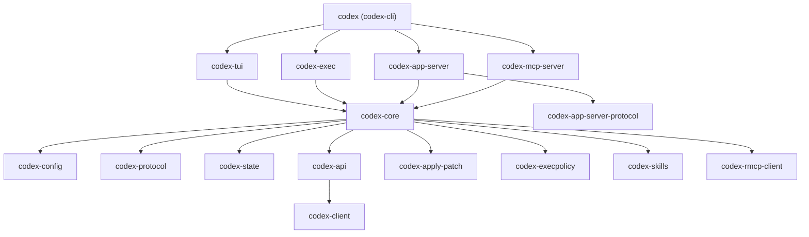
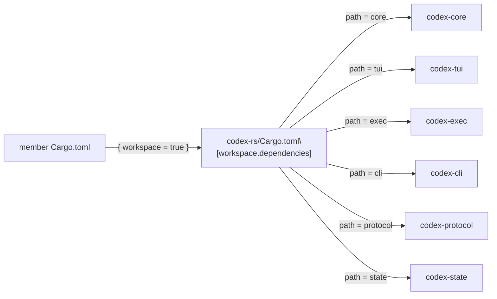
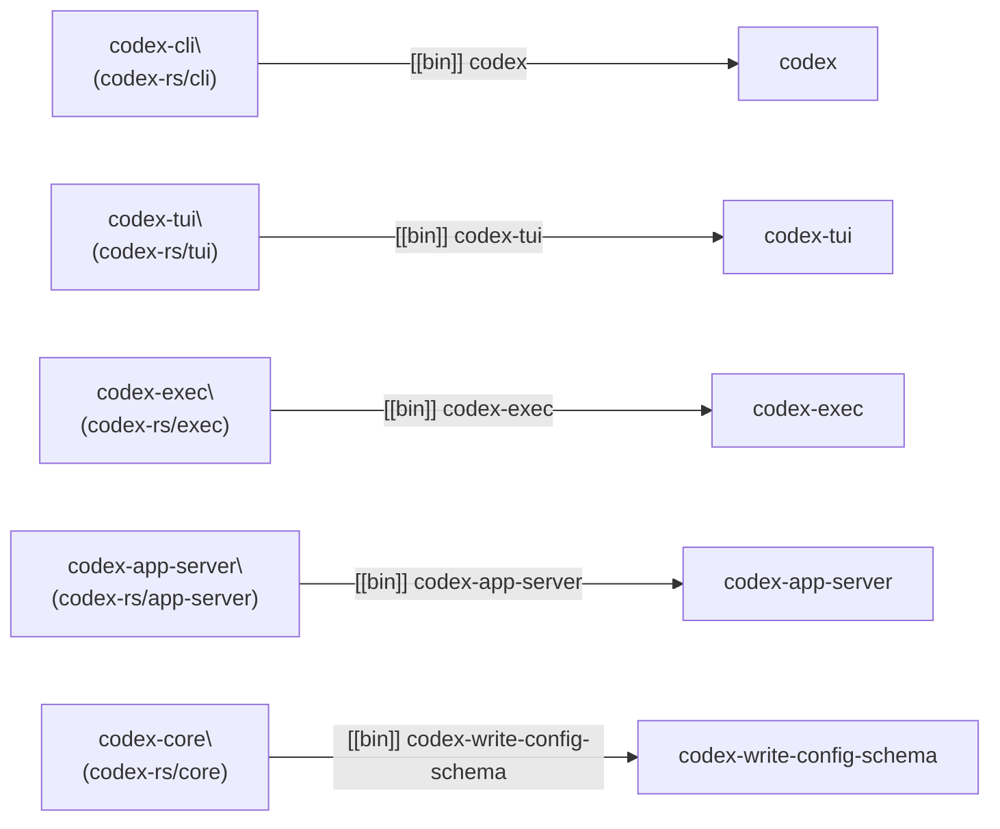

# Cargo Workspace Structure

<details>
<summary>Relevant source files</summary>

The following files were used as context for generating this wiki page:

- [codex-rs/Cargo.lock](codex-rs/Cargo.lock)
- [codex-rs/Cargo.toml](codex-rs/Cargo.toml)
- [codex-rs/README.md](codex-rs/README.md)
- [codex-rs/cli/Cargo.toml](codex-rs/cli/Cargo.toml)
- [codex-rs/cli/src/main.rs](codex-rs/cli/src/main.rs)
- [codex-rs/config.md](codex-rs/config.md)
- [codex-rs/core/Cargo.toml](codex-rs/core/Cargo.toml)
- [codex-rs/core/src/flags.rs](codex-rs/core/src/flags.rs)
- [codex-rs/core/src/lib.rs](codex-rs/core/src/lib.rs)
- [codex-rs/core/src/model_provider_info.rs](codex-rs/core/src/model_provider_info.rs)
- [codex-rs/exec/Cargo.toml](codex-rs/exec/Cargo.toml)
- [codex-rs/exec/src/cli.rs](codex-rs/exec/src/cli.rs)
- [codex-rs/exec/src/lib.rs](codex-rs/exec/src/lib.rs)
- [codex-rs/tui/Cargo.toml](codex-rs/tui/Cargo.toml)
- [codex-rs/tui/src/cli.rs](codex-rs/tui/src/cli.rs)
- [codex-rs/tui/src/lib.rs](codex-rs/tui/src/lib.rs)

</details>

This page covers the layout of the Rust Cargo workspace located at `codex-rs/`, including crate membership, how shared dependencies are declared, build profiles, and workspace-wide lint configuration. For information about the CI pipeline that builds and tests this workspace, see [CI Pipeline](#7.2). For the release pipeline that produces binaries, see [Release Pipeline](#7.3). For an overview of how the individual crates relate to each other at a system level, see [Architecture Overview](#1.3).

---

## Workspace Root

The workspace is defined in [codex-rs/Cargo.toml:1-388](). It uses Cargo's `resolver = "2"` for feature resolution and sets a single shared `[workspace.package]` block that all member crates inherit via `.workspace = true` in their own manifests.

| Field      | Value                                                        |
| ---------- | ------------------------------------------------------------ |
| `resolver` | `"2"`                                                        |
| `version`  | `"0.0.0"` (all crates share the same in-development version) |
| `edition`  | `"2024"`                                                     |
| `license`  | `"Apache-2.0"`                                               |

[codex-rs/Cargo.toml:72-79]()

---

## Crate Membership

The workspace contains 68 member crates declared in [codex-rs/Cargo.toml:2-71](). They are organized into several functional groups.

### Crate Groups

**Core logic and protocol**

| Path in workspace | Crate name       | Role                               |
| ----------------- | ---------------- | ---------------------------------- |
| `core`            | `codex-core`     | Central business logic library     |
| `config`          | `codex-config`   | Configuration loading and merging  |
| `protocol`        | `codex-protocol` | Op/Event protocol types            |
| `state`           | `codex-state`    | SQLite-backed session/thread state |

**User interfaces**

| Path in workspace        | Crate name                     | Role                                         |
| ------------------------ | ------------------------------ | -------------------------------------------- |
| `tui`                    | `codex-tui`                    | Ratatui-based interactive TUI                |
| `exec`                   | `codex-exec`                   | Headless/non-interactive execution           |
| `cli`                    | `codex-cli`                    | Multitool CLI entry point (`codex` binary)   |
| `app-server`             | `codex-app-server`             | App server for IDE integration               |
| `app-server-protocol`    | `codex-app-server-protocol`    | JSON-RPC protocol types for the app server   |
| `app-server-test-client` | `codex-app-server-test-client` | Test helper for app server integration tests |

**API and networking**

| Path in workspace     | Crate name                  | Role                                        |
| --------------------- | --------------------------- | ------------------------------------------- |
| `codex-api`           | `codex-api`                 | OpenAI API client (responses/SSE/WebSocket) |
| `codex-client`        | `codex-client`              | Lower-level HTTP client utilities           |
| `backend-client`      | `codex-backend-client`      | Backend service client                      |
| `responses-api-proxy` | `codex-responses-api-proxy` | Local proxy for the responses API           |
| `network-proxy`       | `codex-network-proxy`       | Network proxy configuration                 |
| `rmcp-client`         | `codex-rmcp-client`         | MCP client connector                        |

**MCP server**

| Path in workspace | Crate name         | Role                                |
| ----------------- | ------------------ | ----------------------------------- |
| `mcp-server`      | `codex-mcp-server` | Exposes Codex as an MCP tool server |

**Tool execution and sandboxing**

| Path in workspace   | Crate name                | Role                                   |
| ------------------- | ------------------------- | -------------------------------------- |
| `apply-patch`       | `codex-apply-patch`       | Patch application logic                |
| `execpolicy`        | `codex-execpolicy`        | Exec approval policy evaluation        |
| `execpolicy-legacy` | (internal)                | Backward-compatible legacy exec policy |
| `linux-sandbox`     | `codex-linux-sandbox`     | Landlock/seccomp sandboxing on Linux   |
| `process-hardening` | `codex-process-hardening` | Hardened process spawning              |
| `shell-command`     | `codex-shell-command`     | Shell command construction             |
| `shell-escalation`  | `codex-shell-escalation`  | Shell privilege escalation helpers     |

**Authentication**

| Path in workspace | Crate name            | Role                       |
| ----------------- | --------------------- | -------------------------- |
| `login`           | `codex-login`         | Login flow orchestration   |
| `secrets`         | `codex-secrets`       | Secrets access abstraction |
| `keyring-store`   | `codex-keyring-store` | OS keyring storage         |

**Cloud and alternate LLM providers**

| Path in workspace    | Crate name                                | Role                                   |
| -------------------- | ----------------------------------------- | -------------------------------------- |
| `cloud-requirements` | `codex-cloud-requirements`                | Managed config for Business/Enterprise |
| `cloud-tasks`        | `codex-cloud-tasks` (path reference only) | Cloud task browsing and apply          |
| `cloud-tasks-client` | (internal)                                | Client for cloud tasks API             |
| `lmstudio`           | `codex-lmstudio`                          | LM Studio integration                  |
| `ollama`             | `codex-ollama`                            | Ollama integration                     |

**Skills and agent features**

| Path in workspace | Crate name          | Role                           |
| ----------------- | ------------------- | ------------------------------ |
| `skills`          | `codex-skills`      | Skill loading and injection    |
| `hooks`           | `codex-hooks`       | Hook execution on agent events |
| `file-search`     | `codex-file-search` | File search tool               |

**Observability and package management**

| Path in workspace | Crate name              | Role                             |
| ----------------- | ----------------------- | -------------------------------- |
| `otel`            | `codex-otel`            | OpenTelemetry integration        |
| `feedback`        | `codex-feedback`        | User feedback submission         |
| `artifacts`       | `codex-artifacts`       | Artifact handling and management |
| `package-manager` | `codex-package-manager` | Package manager integration      |

**Utilities (under `utils/`)**

| Path in workspace        | Crate name                     |
| ------------------------ | ------------------------------ |
| `utils/absolute-path`    | `codex-utils-absolute-path`    |
| `utils/approval-presets` | `codex-utils-approval-presets` |
| `utils/cache`            | `codex-utils-cache`            |
| `utils/cargo-bin`        | `codex-utils-cargo-bin`        |
| `utils/cli`              | `codex-utils-cli`              |
| `utils/elapsed`          | `codex-utils-elapsed`          |
| `utils/fuzzy-match`      | `codex-utils-fuzzy-match`      |
| `utils/git`              | `codex-git`                    |
| `utils/home-dir`         | `codex-utils-home-dir`         |
| `utils/image`            | `codex-utils-image`            |
| `utils/json-to-toml`     | `codex-utils-json-to-toml`     |
| `utils/oss`              | `codex-utils-oss`              |
| `utils/pty`              | `codex-utils-pty`              |
| `utils/readiness`        | `codex-utils-readiness`        |
| `utils/rustls-provider`  | `codex-utils-rustls-provider`  |
| `utils/sandbox-summary`  | `codex-utils-sandbox-summary`  |
| `utils/sleep-inhibitor`  | `codex-utils-sleep-inhibitor`  |
| `utils/stream-parser`    | `codex-utils-stream-parser`    |
| `utils/string`           | `codex-utils-string`           |

**Macros and test support**

| Path in workspace               | Crate name                      |
| ------------------------------- | ------------------------------- |
| `codex-experimental-api-macros` | `codex-experimental-api-macros` |
| `test-macros`                   | `codex-test-macros`             |
| `core/tests/common`             | `core_test_support`             |
| `app-server/tests/common`       | `app_test_support`              |
| `mcp-server/tests/common`       | `mcp_test_support`              |

**Miscellaneous**

| Path in workspace              | Crate name           | Role                                 |
| ------------------------------ | -------------------- | ------------------------------------ |
| `ansi-escape`                  | `codex-ansi-escape`  | ANSI escape sequence helpers for TUI |
| `async-utils`                  | `codex-async-utils`  | Async utility helpers                |
| `arg0`                         | `codex-arg0`         | `argv[0]`-based dispatch             |
| `stdio-to-uds`                 | `codex-stdio-to-uds` | Relay stdio to a Unix domain socket  |
| `debug-client`                 | (internal)           | Debug tooling                        |
| `codex-backend-openapi-models` | (internal)           | Generated OpenAPI model types        |

Sources: [codex-rs/Cargo.toml:2-69]()

---

## Dependency Graph (Key Crates)

The following diagram shows how the primary user-facing crates depend on the core library and the protocol layer.

**Primary crate dependency graph**



Sources: [codex-rs/core/Cargo.toml:19-115](), [codex-rs/tui/Cargo.toml:27-107](), [codex-rs/cli/Cargo.toml:18-55](), [codex-rs/exec/Cargo.toml:18-49]()

---

## Workspace Path Mappings

The `[workspace.dependencies]` table declares canonical path references so that individual crates can use `{ workspace = true }` instead of repeating the path and version. This is the single source of truth for all internal crate paths and all external dependency versions.

**Workspace dependency declaration pattern**



In a member crate's `Cargo.toml`, a dependency is declared as:

```toml
codex-core = { workspace = true }
```

and the actual path is resolved from the workspace root entry:

```toml
codex-core = { path = "core" }
```

[codex-rs/Cargo.toml:81-148]()

---

## Selected External Dependencies

The following notable external dependencies are pinned at the workspace level. All feature flags that appear here apply as defaults unless a member crate overrides them.

| Crate                  | Version            | Notes                                       |
| ---------------------- | ------------------ | ------------------------------------------- |
| `tokio`                | `"1"`              | Async runtime; features specified per-crate |
| `serde` / `serde_json` | `"1"`              | Serialization                               |
| `clap`                 | `"4"`              | CLI argument parsing                        |
| `ratatui`              | `"0.29.0"`         | TUI framework (custom fork; see below)      |
| `crossterm`            | `"0.28.1"`         | Terminal backend (custom fork; see below)   |
| `sqlx`                 | `"0.8.6"`          | SQLite via `runtime-tokio-rustls`           |
| `rmcp`                 | `"0.15.0"`         | MCP SDK                                     |
| `reqwest`              | `"0.12"`           | HTTP client                                 |
| `tokio-tungstenite`    | `"0.28.0"`         | WebSocket (custom fork; see below)          |
| `axum`                 | `"0.8"`            | HTTP server (app server)                    |
| `tracing`              | `"0.1.44"`         | Structured logging/tracing                  |
| `anyhow` / `thiserror` | `"1"` / `"2.0.17"` | Error handling                              |
| `landlock`             | `"0.4.4"`          | Linux sandbox                               |
| `seccompiler`          | `"0.5.0"`          | Linux seccomp                               |

Sources: [codex-rs/Cargo.toml:155-318]()

### Patched Crates

Several upstream crates are replaced with custom forks via the `[patch.crates-io]` section. These patches persist until the fixes are merged upstream.

| Crate               | Fork                                                             |
| ------------------- | ---------------------------------------------------------------- |
| `crossterm`         | `github.com/nornagon/crossterm` (branch `nornagon/color-query`)  |
| `ratatui`           | `github.com/nornagon/ratatui` (branch `nornagon-v0.29.0-patch`)  |
| `tokio-tungstenite` | `github.com/openai-oss-forks/tokio-tungstenite` (rev `132f5b39`) |
| `tungstenite`       | `github.com/openai-oss-forks/tungstenite-rs` (rev `9200079d`)    |

An additional patch entry exists for the SSH variant of the tungstenite repository to ensure consistency when dependencies are resolved via different protocols.

Sources: [codex-rs/Cargo.toml:382-395]()

---

## Build Profiles

Two profiles are defined beyond Cargo defaults.

### `release`

Configured for maximum binary size reduction, which is important because the binary is bundled with the npm package.

```toml
[profile.release]
lto = "fat"
split-debuginfo = "off"
strip = "symbols"
codegen-units = 1
```

- `lto = "fat"`: enables full link-time optimization across all crates, producing the smallest and fastest binary at the cost of longer link times.
- `strip = "symbols"`: removes all debug symbols from the output binary.
- `codegen-units = 1`: forces a single code generation unit; required to avoid a specific miscompilation issue tracked in issue #1411.

Sources: [codex-rs/Cargo.toml:367-376]()

### `ci-test`

A reduced-overhead profile for CI test runs.

```toml
[profile.ci-test]
debug = 1
inherits = "test"
opt-level = 0
```

- Inherits from the built-in `test` profile.
- `debug = 1` reduces debug symbol verbosity compared to full `debug = 2`.
- `opt-level = 0` disables optimizations entirely to keep compile times short.

Sources: [codex-rs/Cargo.toml:377-380]()

---

## Workspace-Wide Clippy Lints

All lints are declared under `[workspace.lints.clippy]` and set to `"deny"`. Individual crates opt in with `[lints] workspace = true` in their own `Cargo.toml`.

The lints fall into two broad categories:

**Anti-panic lints**

| Lint          | Effect              |
| ------------- | ------------------- |
| `expect_used` | Bans `.expect(...)` |
| `unwrap_used` | Bans `.unwrap()`    |

**Code quality / redundancy lints**

| Lint                    | Example of what it catches                                   |
| ----------------------- | ------------------------------------------------------------ |
| `manual_clamp`          | `if x < min { min } else if x > max { max } ...`             |
| `manual_map`            | `match opt { Some(x) => Some(f(x)), None => None }`          |
| `needless_borrow`       | Unnecessary `&` on already-borrowed values                   |
| `redundant_clone`       | `.clone()` on a value already owned                          |
| `uninlined_format_args` | `format!("{}", x)` instead of `format!("{x}")`               |
| `unnecessary_to_owned`  | `.to_owned()` on a `&str` passed to a function taking `&str` |

Sources: [codex-rs/Cargo.toml:319-356]()

**Per-crate opt-in pattern**

```toml
# In any member crate's Cargo.toml
[lints]
workspace = true
```

This is present in every primary crate, e.g. [codex-rs/core/Cargo.toml:16-17](), [codex-rs/tui/Cargo.toml:23-24](), [codex-rs/cli/Cargo.toml:15-16](), [codex-rs/exec/Cargo.toml:14-15]().

---

## `cargo-shear` Ignored Packages

`cargo-shear` is a tool that detects unused workspace dependencies. Several entries are listed as false positives and explicitly ignored:

| Package                 | Reason                                            |
| ----------------------- | ------------------------------------------------- |
| `icu_provider`          | Indirect dependency required at runtime           |
| `openssl-sys`           | Platform-specific (musl); not visible to the tool |
| `codex-utils-readiness` | Conditionally used                                |
| `codex-secrets`         | Conditionally used                                |

Sources: [codex-rs/Cargo.toml:359-365]()

---

## Crate-to-Binary Mapping

Several crates produce standalone binaries in addition to (or instead of) a library.

**Crate/binary mapping**



The primary user-facing binary is `codex`, produced by the `codex-cli` crate. In production, all other modes (TUI, exec, app-server, MCP server) are reached via subcommands dispatched from this single binary. See [CLI Entry Points and Multitool Dispatch](#4.3) for details.

Sources: [codex-rs/cli/Cargo.toml:8-9](), [codex-rs/tui/Cargo.toml:8-9](), [codex-rs/exec/Cargo.toml:8-9](), [codex-rs/app-server/src/main.rs:1-61](), [codex-rs/core/Cargo.toml:12-14]()
