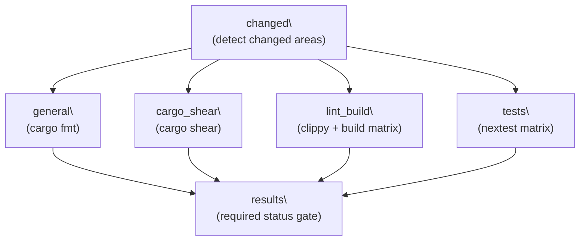
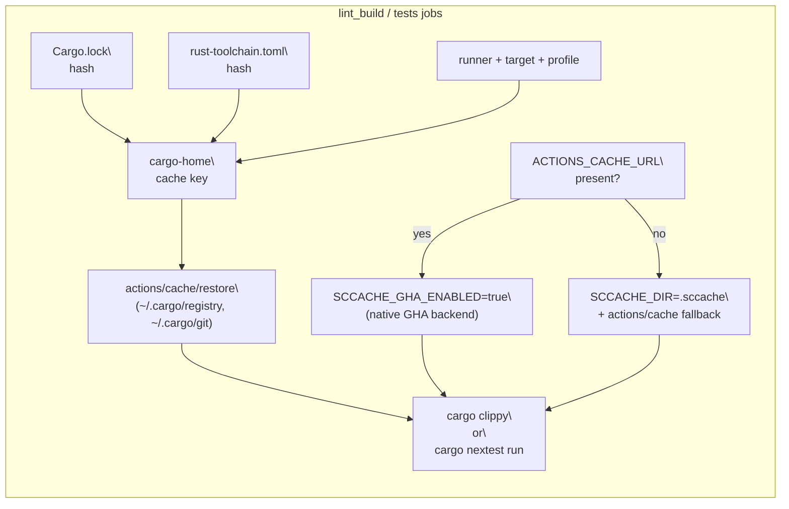
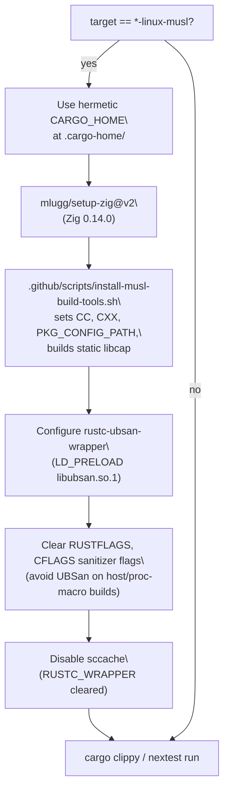

# CI Pipeline

<details>
<summary>Relevant source files</summary>

The following files were used as context for generating this wiki page:

- [.github/actions/windows-code-sign/action.yml](.github/actions/windows-code-sign/action.yml)
- [.github/scripts/install-musl-build-tools.sh](.github/scripts/install-musl-build-tools.sh)
- [.github/workflows/ci.yml](.github/workflows/ci.yml)
- [.github/workflows/rust-ci.yml](.github/workflows/rust-ci.yml)
- [.github/workflows/rust-release-windows.yml](.github/workflows/rust-release-windows.yml)
- [.github/workflows/rust-release.yml](.github/workflows/rust-release.yml)
- [.github/workflows/sdk.yml](.github/workflows/sdk.yml)
- [.github/workflows/shell-tool-mcp.yml](.github/workflows/shell-tool-mcp.yml)
- [.github/workflows/zstd](.github/workflows/zstd)
- [AGENTS.md](AGENTS.md)
- [codex-rs/.cargo/config.toml](codex-rs/.cargo/config.toml)
- [codex-rs/rust-toolchain.toml](codex-rs/rust-toolchain.toml)
- [codex-rs/scripts/setup-windows.ps1](codex-rs/scripts/setup-windows.ps1)
- [codex-rs/shell-escalation/README.md](codex-rs/shell-escalation/README.md)

</details>

This page documents the continuous integration workflows that run on pull requests and pushes to the `main` branch of the openai/codex repository. It covers the `rust-ci` GitHub Actions workflow ([`.github/workflows/rust-ci.yml`](.github/workflows/rust-ci.yml)()), the Node.js/TypeScript `ci` workflow ([`.github/workflows/ci.yml`](.github/workflows/ci.yml)()), and the shared caching and toolchain configuration that supports them.

For the release pipeline (tag-triggered, cross-platform builds, code signing, artifact publishing), see [Release Pipeline](#7.3). For the Cargo workspace structure itself, see [Cargo Workspace Structure](#7.1).

---

## Trigger Conditions

| Workflow  | File                            | Triggers                                              |
| --------- | ------------------------------- | ----------------------------------------------------- |
| `rust-ci` | `.github/workflows/rust-ci.yml` | `pull_request`, `push` to `main`, `workflow_dispatch` |
| `ci`      | `.github/workflows/ci.yml`      | `pull_request`, `push` to `main`                      |

The `rust-ci` workflow is the primary gating workflow for the Rust codebase. Both workflows run without concurrency limits, meaning parallel runs can coexist.

Sources: [`.github/workflows/rust-ci.yml:1-10`](.github/workflows/rust-ci.yml:1-10)(), [`.github/workflows/ci.yml:1-6`](.github/workflows/ci.yml:1-6)()

---

## rust-ci Workflow Overview

The `rust-ci` workflow is organized into five jobs with explicit dependency relationships. A single terminal `results` job aggregates all outcomes and is the only required status check.

**rust-ci job dependency diagram**



Sources: [`.github/workflows/rust-ci.yml:12-689`](.github/workflows/rust-ci.yml:12-689)()

---

## Change Detection (`changed` job)

The `changed` job always runs. It inspects the diff between the PR base and head (or defaults to running everything on non-PR events) and emits two boolean outputs:

| Output      | Condition                            |
| ----------- | ------------------------------------ |
| `codex`     | Any file under `codex-rs/**` changed |
| `workflows` | Any file under `.github/**` changed  |

Downstream jobs gate on `needs.changed.outputs.codex == 'true' || needs.changed.outputs.workflows == 'true' || github.event_name == 'push'`. This means push events to `main` always run the full suite, while pull requests that only modify files outside `codex-rs/` and `.github/` skip all Rust jobs.

On push or manual dispatch, the script forces both outputs to `true` by setting `files=("codex-rs/force" ".github/force")`.

Sources: [`.github/workflows/rust-ci.yml:13-50`](.github/workflows/rust-ci.yml:13-50)()

---

## Format and Unused-Dependency Jobs

### `general` — Formatting

Runs `cargo fmt` in check mode against the `codex-rs` workspace. Uses the `imports_granularity=Item` configuration to enforce per-item import grouping.

```
cargo fmt -- --config imports_granularity=Item --check
```

Toolchain: `dtolnay/rust-toolchain@1.93.0` with the `rustfmt` component.

### `cargo_shear` — Unused Dependencies

Runs [`cargo-shear`](https://github.com/nicolo-ribaudo/cargo-shear) at version `1.5.1` to detect dependencies declared in `Cargo.toml` files that are not actually used. Tool is installed via `taiki-e/install-action`.

Sources: [`.github/workflows/rust-ci.yml:52-84`](.github/workflows/rust-ci.yml:52-84)()

---

## Lint/Build Matrix (`lint_build` job)

### Platform Matrix

The `lint_build` job runs `cargo clippy` with `--all-features --tests` across the following matrix:

| Runner                                 | Target                       | Profile   |
| -------------------------------------- | ---------------------------- | --------- |
| `macos-15-xlarge`                      | `aarch64-apple-darwin`       | `dev`     |
| `macos-15-xlarge`                      | `x86_64-apple-darwin`        | `dev`     |
| `ubuntu-24.04` (codex-linux-x64)       | `x86_64-unknown-linux-musl`  | `dev`     |
| `ubuntu-24.04` (codex-linux-x64)       | `x86_64-unknown-linux-gnu`   | `dev`     |
| `ubuntu-24.04-arm` (codex-linux-arm64) | `aarch64-unknown-linux-musl` | `dev`     |
| `ubuntu-24.04-arm` (codex-linux-arm64) | `aarch64-unknown-linux-gnu`  | `dev`     |
| `windows-x64` (codex-windows-x64)      | `x86_64-pc-windows-msvc`     | `dev`     |
| `windows-arm64` (codex-windows-arm64)  | `aarch64-pc-windows-msvc`    | `dev`     |
| `macos-15-xlarge`                      | `aarch64-apple-darwin`       | `release` |
| `ubuntu-24.04` (codex-linux-x64)       | `x86_64-unknown-linux-musl`  | `release` |
| `ubuntu-24.04-arm` (codex-linux-arm64) | `aarch64-unknown-linux-musl` | `release` |
| `windows-x64` (codex-windows-x64)      | `x86_64-pc-windows-msvc`     | `release` |
| `windows-arm64` (codex-windows-arm64)  | `aarch64-pc-windows-msvc`    | `release` |

The `release` profile rows exist to catch release-only build errors and to pre-populate sccache so release builds are faster. CI uses `thin` LTO for the release profile (`CARGO_PROFILE_RELEASE_LTO=thin`) rather than `fat` LTO to keep feedback times manageable.

### Clippy Invocation

```
cargo clippy --target <target> --all-features --tests --profile <profile> --timings -- -D warnings
```

All warnings are treated as errors (`-D warnings`). Cargo build timings are uploaded as artifacts named `cargo-timings-rust-ci-clippy-<target>-<profile>`.

### Release Profile: `cargo-chef` Pre-warming

For `release`-profile matrix entries, `cargo-chef` (version `0.1.71`) is used to pre-warm the dependency cache before the clippy step:

1. `cargo chef prepare --recipe-path <RECIPE>` — captures the dependency graph.
2. `cargo chef cook --recipe-path <RECIPE> --target <target> --release --all-features` — compiles dependencies only.

This separates dependency compilation from workspace crate compilation, improving cache hit rates.

Sources: [`.github/workflows/rust-ci.yml:86-451`](.github/workflows/rust-ci.yml:86-451)()

---

## Test Matrix (`tests` job)

### Platform Matrix

Tests run on a narrower matrix than lint/build (musl targets excluded):

| Runner                                 | Target                      | Profile |
| -------------------------------------- | --------------------------- | ------- |
| `macos-15-xlarge`                      | `aarch64-apple-darwin`      | `dev`   |
| `ubuntu-24.04` (codex-linux-x64)       | `x86_64-unknown-linux-gnu`  | `dev`   |
| `ubuntu-24.04-arm` (codex-linux-arm64) | `aarch64-unknown-linux-gnu` | `dev`   |
| `windows-x64` (codex-windows-x64)      | `x86_64-pc-windows-msvc`    | `dev`   |
| `windows-arm64` (codex-windows-arm64)  | `aarch64-pc-windows-msvc`   | `dev`   |

### Test Runner: `cargo-nextest`

Tests are executed with `cargo-nextest` (version `0.9.103`) using the workspace-defined `ci-test` build profile:

```
cargo nextest run --all-features --no-fail-fast --target <target> --cargo-profile ci-test --timings
```

`RUST_BACKTRACE=1` and `NEXTEST_STATUS_LEVEL=leak` are set so that output from passing and leaking tests is shown.

### Special Setup for Tests

| Step                                                  | Purpose                                                          |
| ----------------------------------------------------- | ---------------------------------------------------------------- |
| `actions/setup-node` with `codex-rs/node-version.txt` | Required for `js_repl` integration tests                         |
| `facebook/install-dotslash@v2`                        | Required for some integration tests that resolve DotSlash files  |
| `sudo sysctl -w kernel.unprivileged_userns_clone=1`   | Enables bubblewrap sandboxing on Linux CI runners                |
| AppArmor restriction disable                          | Ubuntu 24.04+ gates unprivileged user namespaces behind AppArmor |

Sources: [`.github/workflows/rust-ci.yml:453-656`](.github/workflows/rust-ci.yml:453-656)()

---

## Results Gate (`results` job)

The `results` job runs with `if: always()` so it executes even when upstream jobs fail. It is the single required status check registered with the repository.

Logic:

- If neither `codex` nor `workflows` changed and the event is not a push, the job exits `0` immediately ("No relevant changes").
- Otherwise, it checks that `general`, `cargo_shear`, `lint_build`, and `tests` all have result `success`.

Sources: [`.github/workflows/rust-ci.yml:657-689`](.github/workflows/rust-ci.yml:657-689)()

---

## Caching Strategy

The pipeline uses two separate caching mechanisms:

### Cargo Home Cache

Caches the downloaded registry index, crate source archives, and compiled git dependencies. Keyed by runner, target, profile, `Cargo.lock` hash, and `rust-toolchain.toml` hash.

Cache paths:

- `~/.cargo/bin/`, `~/.cargo/registry/`, `~/.cargo/git/db/`
- `$GITHUB_WORKSPACE/.cargo-home/` (hermetic path used for musl builds)

### sccache

Used on non-Windows runners (`USE_SCCACHE` is `false` for Windows). Version `0.7.5`, installed via `taiki-e/install-action`.

When `ACTIONS_CACHE_URL` is available (i.e., the GitHub Actions cache backend), sccache uses `SCCACHE_GHA_ENABLED=true` to integrate directly with it. Otherwise it falls back to a local disk cache at `$GITHUB_WORKSPACE/.sccache/` with `actions/cache` as a secondary restore/save step.

Cache size limit: `SCCACHE_CACHE_SIZE=10G`.

sccache is disabled for musl targets (`RUSTC_WRAPPER=` cleared) because the musl UBSan wrapper wrapping approach is incompatible with sccache's `RUSTC_WRAPPER` mechanism.

**Caching layers diagram**



Sources: [`.github/workflows/rust-ci.yml:215-280`](.github/workflows/rust-ci.yml:215-280)(), [`.github/workflows/rust-ci.yml:524-582`](.github/workflows/rust-ci.yml:524-582)()

---

## musl Target Handling

Both `lint_build` and `tests` jobs apply special handling when the target is `x86_64-unknown-linux-musl` or `aarch64-unknown-linux-musl`.

**musl build setup flow**



The script [`.github/scripts/install-musl-build-tools.sh`](.github/scripts/install-musl-build-tools.sh:1-280)() performs the following:

1. Installs `musl-tools`, `clang`, `lld`, and other APT packages.
2. Downloads and statically compiles `libcap` (version `2.75`) against the musl toolchain, placing it at a known path for `PKG_CONFIG_PATH` resolution.
3. Generates `zigcc` and `zigcxx` wrapper scripts that invoke `zig cc`/`zig c++` with the correct `-target` triple while stripping incompatible flags (e.g. `--target`, `-fsanitize=undefined`, `-Wp,-U_FORTIFY_SOURCE`).
4. Exports `CC`, `CXX`, `TARGET_CC`, `TARGET_CXX`, `CARGO_TARGET_<TARGET>_LINKER`, and `CMAKE_*` variables into `$GITHUB_ENV`.

The `AWS_LC_SYS_NO_JITTER_ENTROPY=1` flag is set in the release workflow ([`.github/workflows/rust-release.yml:182-185`](.github/workflows/rust-release.yml:182-185)()) to avoid a problematic code path in `aws-lc-sys` on musl builders.

Sources: [`.github/scripts/install-musl-build-tools.sh:1-280`](.github/scripts/install-musl-build-tools.sh:1-280)(), [`.github/workflows/rust-ci.yml:204-373`](.github/workflows/rust-ci.yml:204-373)()

---

## Rust Toolchain

The pinned toolchain is declared in [`.github/workflows/rust-ci.yml`](.github/workflows/rust-ci.yml:199-202)() and mirrored in [`codex-rs/rust-toolchain.toml`](codex-rs/rust-toolchain.toml:1-4)():

| Setting                     | Value                           |
| --------------------------- | ------------------------------- |
| Channel                     | `1.93.0`                        |
| Components (toolchain.toml) | `clippy`, `rustfmt`, `rust-src` |
| Components (CI for lint)    | `clippy`                        |
| Components (CI for format)  | `rustfmt`                       |
| Action                      | `dtolnay/rust-toolchain@1.93.0` |

The `codex-rs/.cargo/config.toml` file configures platform-specific linker flags: a custom stack size on Windows (`/STACK:8388608`) and the `/arm64hazardfree` flag for `aarch64-pc-windows-msvc` to suppress a linker warning about a Cortex-A53 erratum that does not affect supported hardware.

Sources: [`codex-rs/rust-toolchain.toml:1-4`](codex-rs/rust-toolchain.toml:1-4)(), [`codex-rs/.cargo/config.toml:1-12`](codex-rs/.cargo/config.toml:1-12)()

---

## Node.js / TypeScript CI (`ci` workflow)

The `ci` workflow ([`.github/workflows/ci.yml`](.github/workflows/ci.yml:1-67)()) covers the Node.js and TypeScript portions of the repository. It runs on `ubuntu-latest` with a 10-minute timeout.

| Step                 | Tool / Command                    | Purpose                                                             |
| -------------------- | --------------------------------- | ------------------------------------------------------------------- |
| Install dependencies | `pnpm install --frozen-lockfile`  | Reproducible installs                                               |
| Stage npm package    | `scripts/stage_npm_packages.py`   | Validates that npm packaging works against a published Rust release |
| ASCII check          | `scripts/asciicheck.py README.md` | Ensures README files contain only ASCII and allowed Unicode         |
| README ToC check     | `scripts/readme_toc.py README.md` | Validates table of contents accuracy                                |
| Formatting           | `pnpm run format`                 | Runs Prettier in check mode                                         |

The npm staging step downloads a known release version (currently `0.74.0`) from GitHub Releases to validate the packaging pipeline without requiring a new Rust build.

Sources: [`.github/workflows/ci.yml:1-67`](.github/workflows/ci.yml:1-67)()

---

## Key Environment Variables

| Variable                       | Value / Behavior                            | Jobs                  |
| ------------------------------ | ------------------------------------------- | --------------------- |
| `CARGO_INCREMENTAL`            | `"0"`                                       | `lint_build`, `tests` |
| `USE_SCCACHE`                  | `true` for non-Windows, `false` for Windows | `lint_build`, `tests` |
| `SCCACHE_CACHE_SIZE`           | `10G`                                       | `lint_build`, `tests` |
| `CARGO_PROFILE_RELEASE_LTO`    | `thin` (CI), `fat` (release)                | `lint_build`          |
| `RUST_BACKTRACE`               | `1`                                         | `tests`               |
| `NEXTEST_STATUS_LEVEL`         | `leak`                                      | `tests`               |
| `AWS_LC_SYS_NO_JITTER_ENTROPY` | `1` (musl)                                  | release workflow      |
| `RUSTC_WRAPPER`                | `sccache` (when enabled)                    | `lint_build`, `tests` |

Sources: [`.github/workflows/rust-ci.yml:97-104`](.github/workflows/rust-ci.yml:97-104)(), [`.github/workflows/rust-ci.yml:462-466`](.github/workflows/rust-ci.yml:462-466)()
