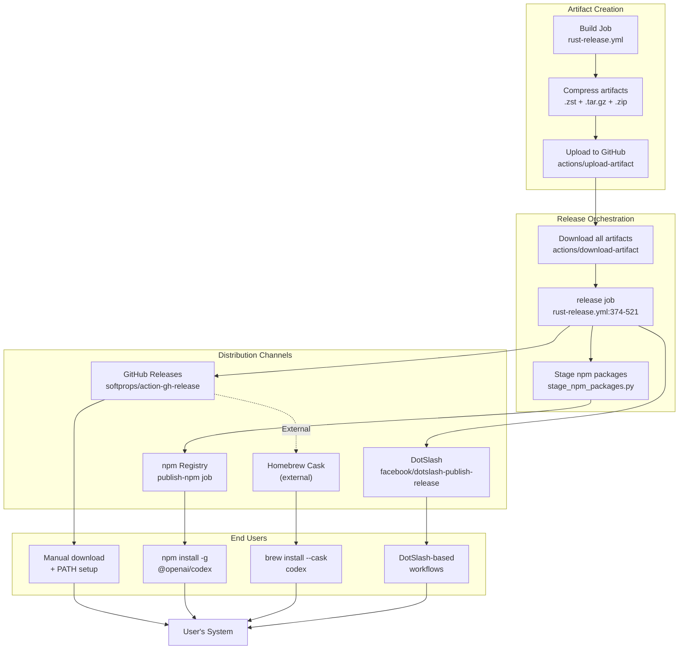
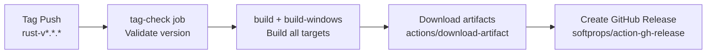
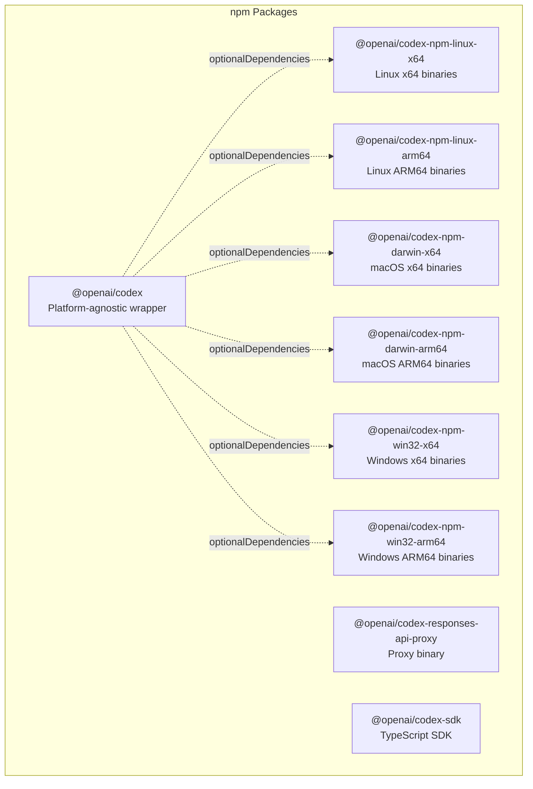
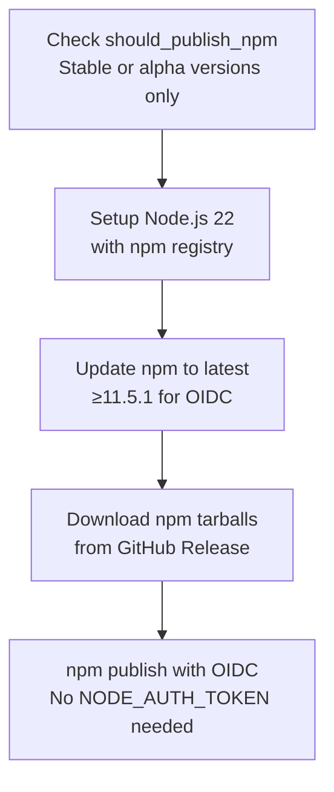
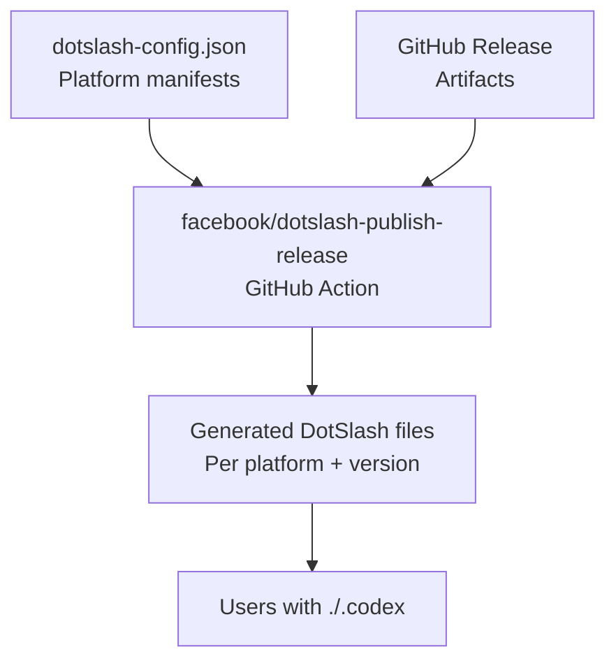
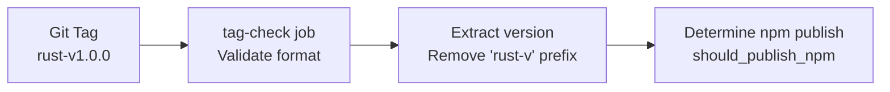
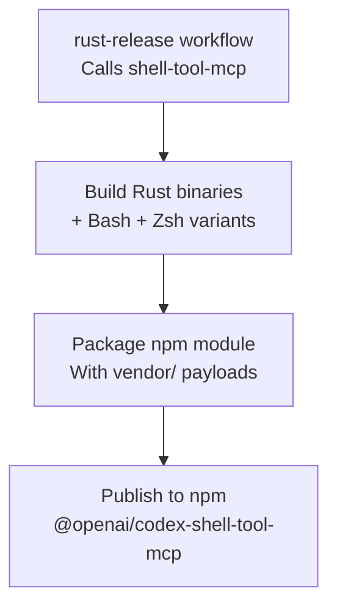

# Distribution Channels

<details>
<summary>Relevant source files</summary>

The following files were used as context for generating this wiki page:

- [.github/actions/windows-code-sign/action.yml](.github/actions/windows-code-sign/action.yml)
- [.github/scripts/install-musl-build-tools.sh](.github/scripts/install-musl-build-tools.sh)
- [.github/workflows/ci.yml](.github/workflows/ci.yml)
- [.github/workflows/rust-ci.yml](.github/workflows/rust-ci.yml)
- [.github/workflows/rust-release-windows.yml](.github/workflows/rust-release-windows.yml)
- [.github/workflows/rust-release.yml](.github/workflows/rust-release.yml)
- [.github/workflows/sdk.yml](.github/workflows/sdk.yml)
- [.github/workflows/shell-tool-mcp.yml](.github/workflows/shell-tool-mcp.yml)
- [.github/workflows/zstd](.github/workflows/zstd)
- [AGENTS.md](AGENTS.md)
- [README.md](README.md)
- [codex-rs/.cargo/config.toml](codex-rs/.cargo/config.toml)
- [codex-rs/rust-toolchain.toml](codex-rs/rust-toolchain.toml)
- [codex-rs/scripts/setup-windows.ps1](codex-rs/scripts/setup-windows.ps1)
- [codex-rs/shell-escalation/README.md](codex-rs/shell-escalation/README.md)

</details>

## Purpose and Scope

This document describes how Codex binaries and packages are distributed to end users after being built by the release pipeline. It covers the four primary distribution channels (GitHub Releases, npm Registry, Homebrew Cask, and DotSlash), how artifacts are staged and published to each channel, and the installation methods available to users.

For information about how artifacts are built and signed, see [Release Pipeline](#7.3). For the build system structure, see [Cargo Workspace Structure](#7.1).

---

## Distribution Architecture

The Codex release system distributes artifacts through multiple channels to support different user preferences and platform conventions. All channels source their artifacts from the same GitHub Actions release workflow.



**Sources:** [.github/workflows/rust-release.yml:374-521]()

---

## GitHub Releases

GitHub Releases serve as the primary distribution channel for direct binary downloads. All signed and compressed artifacts are attached to a GitHub Release created for each version tag.

### Release Creation

The `release` job creates a GitHub Release using the `softprops/action-gh-release` action:



The release includes:

- All platform-specific binaries (compressed as `.zst`, `.tar.gz`, and `.zip`)
- Signature files (`.sigstore` for Linux binaries)
- DMG images for macOS
- Configuration schema (`config-schema.json`)

Sources: [.github/workflows/rust-release.yml:491-501](), [.github/workflows/rust-release.yml:435-437]()

### Artifact Organization

Artifacts are organized by target triple in the `dist/` directory before upload:

| Target                       | Files                                                                                                            | Compression Formats       |
| ---------------------------- | ---------------------------------------------------------------------------------------------------------------- | ------------------------- |
| `aarch64-apple-darwin`       | `codex-aarch64-apple-darwin`, `codex-responses-api-proxy-aarch64-apple-darwin`, `codex-aarch64-apple-darwin.dmg` | `.zst`, `.tar.gz`         |
| `x86_64-apple-darwin`        | `codex-x86_64-apple-darwin`, `codex-responses-api-proxy-x86_64-apple-darwin`, `codex-x86_64-apple-darwin.dmg`    | `.zst`, `.tar.gz`         |
| `x86_64-unknown-linux-musl`  | `codex-x86_64-unknown-linux-musl`, `codex-responses-api-proxy-x86_64-unknown-linux-musl`, `*.sigstore`           | `.zst`, `.tar.gz`         |
| `aarch64-unknown-linux-musl` | `codex-aarch64-unknown-linux-musl`, `codex-responses-api-proxy-aarch64-unknown-linux-musl`, `*.sigstore`         | `.zst`, `.tar.gz`         |
| `x86_64-unknown-linux-gnu`   | `codex-x86_64-unknown-linux-gnu`, `codex-responses-api-proxy-x86_64-unknown-linux-gnu`, `*.sigstore`             | `.zst`, `.tar.gz`         |
| `aarch64-unknown-linux-gnu`  | `codex-aarch64-unknown-linux-gnu`, `codex-responses-api-proxy-aarch64-unknown-linux-gnu`, `*.sigstore`           | `.zst`, `.tar.gz`         |
| `x86_64-pc-windows-msvc`     | `codex-x86_64-pc-windows-msvc.exe`, `codex-responses-api-proxy-x86_64-pc-windows-msvc.exe`, sandbox helpers      | `.zst`, `.tar.gz`, `.zip` |
| `aarch64-pc-windows-msvc`    | `codex-aarch64-pc-windows-msvc.exe`, `codex-responses-api-proxy-aarch64-pc-windows-msvc.exe`, sandbox helpers    | `.zst`, `.tar.gz`, `.zip` |

Sources: [.github/workflows/rust-release.yml:296-312](), [.github/workflows/rust-release-windows.yml:184-194]()

### Compression Strategy

Multiple compression formats are provided for compatibility:

1. **Zstandard (`.zst`)** - High compression ratio, used by DotSlash and advanced users
2. **Gzip (`.tar.gz`)** - Universal compatibility, works on systems without `zstd`
3. **Zip (`.zip`)** - Windows-specific, bundled with sandbox helper binaries

The compression step preserves the original binaries on Windows but removes them on Unix to save artifact storage space:

Sources: [.github/workflows/rust-release.yml:314-348](), [.github/workflows/rust-release-windows.yml:198-259]()

### Pre-release vs Stable

The release is marked as a pre-release if the version contains a suffix (e.g., `-alpha`, `-beta`):

Sources: [.github/workflows/rust-release.yml:499-500]()

---

## npm Registry

The npm Registry hosts multiple packages that wrap the native Codex binaries with JavaScript tooling for easy installation via `npm` or `pnpm`.

### Published Packages

Three packages are published to the `@openai` scope:



Sources: [.github/workflows/rust-release.yml:481-489]()

### Staging Process

The `stage_npm_packages.py` script prepares npm tarballs from GitHub Release artifacts:

1. Downloads native binaries from the GitHub Release
2. Creates platform-specific npm packages with appropriate `package.json` metadata
3. Creates a main `@openai/codex` package with platform packages as `optionalDependencies`
4. Packages everything as `.tgz` tarballs

Sources: [.github/workflows/rust-release.yml:481-489]()

### Publishing Flow

The `publish-npm` job handles publication to the npm Registry:



**Version-based publishing:**

- Stable versions (e.g., `1.0.0`) → publish to `latest` tag
- Alpha versions (e.g., `1.0.0-alpha.1`) → publish to `alpha` tag
- Other version formats → skip publishing

Sources: [.github/workflows/rust-release.yml:447-464](), [.github/workflows/rust-release.yml:525-630]()

### OIDC Authentication

The npm publish process uses OpenID Connect (OIDC) Trusted Publishing instead of long-lived tokens:

- Requires npm CLI version ≥11.5.1
- Uses `id-token: write` permission
- Eliminates need for `NODE_AUTH_TOKEN` secret

Sources: [.github/workflows/rust-release.yml:531-545]()

### Tag Strategy

Platform-specific packages use composite tags to enable version + platform targeting:

| Package                          | Version         | npm Tag           |
| -------------------------------- | --------------- | ----------------- |
| `@openai/codex`                  | `1.0.0`         | `latest`          |
| `@openai/codex-npm-linux-x64`    | `1.0.0`         | `linux-x64`       |
| `@openai/codex-npm-darwin-arm64` | `1.0.0`         | `darwin-arm64`    |
| `@openai/codex`                  | `1.0.0-alpha.1` | `alpha`           |
| `@openai/codex-npm-linux-x64`    | `1.0.0-alpha.1` | `alpha-linux-x64` |

Sources: [.github/workflows/rust-release.yml:589-606]()

### Duplicate Version Handling

The publish script gracefully handles already-published versions by detecting error messages:

Sources: [.github/workflows/rust-release.yml:614-629]()

---

## Homebrew Cask

Homebrew is the de facto package manager for macOS. Codex is distributed as a Homebrew Cask, which allows users to install and update via `brew install --cask codex`.

### Homebrew Formula

The Homebrew cask formula is maintained externally in the Homebrew Cask repository. It references:

- GitHub Release URLs for DMG downloads
- SHA256 checksums for verification
- Installation instructions (copy binaries to appropriate locations)

**Note:** The Homebrew formula is updated manually by Homebrew maintainers or OpenAI contributors after each release. The release pipeline does not directly update Homebrew.

Sources: [README.md:1](), [README.md:25-27]()

### DMG Creation

macOS releases include a DMG (disk image) for both installation methods:

1. Binary is signed and notarized (see [Release Pipeline](#7.3))
2. DMG root directory is created with both `codex` and `codex-responses-api-proxy` binaries
3. `hdiutil create` packages the directory into a compressed DMG
4. DMG itself is signed and notarized

Sources: [.github/workflows/rust-release.yml:237-294]()

---

## DotSlash

DotSlash is a binary manager that uses declarative JSON configuration files to fetch and cache platform-specific executables. Codex publishes DotSlash configurations to enable version-controlled binary dependencies.

### DotSlash Configuration

The `.github/dotslash-config.json` file declares how to fetch Codex binaries for each platform:



Sources: [.github/workflows/rust-release.yml:502-507]()

### DotSlash Publish Action

The `facebook/dotslash-publish-release` action:

1. Reads platform configurations from `.github/dotslash-config.json`
2. Downloads artifacts from the GitHub Release
3. Generates platform-specific DotSlash files
4. Attaches them to the GitHub Release

This enables users to commit a DotSlash file (e.g., `./.codex`) to their repository that automatically fetches the correct Codex version and platform binary.

Sources: [.github/workflows/rust-release.yml:502-507]()

---

## Installation Methods

Users can install Codex through multiple methods depending on their platform and preferences:

### npm (Cross-platform)

```bash
npm install -g @openai/codex
```

**How it works:**

1. npm installs the platform-agnostic `@openai/codex` package
2. The package's `optionalDependencies` cause npm to fetch the appropriate platform-specific package
3. Post-install scripts ensure the `codex` binary is available in `PATH`

**Advantages:**

- Cross-platform
- Familiar for JavaScript/TypeScript developers
- Handles updates via `npm update -g @openai/codex`
- Works with private npm registries

Sources: [README.md:1](), [README.md:17-22]()

### Homebrew (macOS)

```bash
brew install --cask codex
```

**How it works:**

1. Homebrew downloads the DMG from GitHub Releases
2. Verifies SHA256 checksum
3. Mounts the DMG and copies binaries to `/usr/local/bin/` (or appropriate Homebrew prefix)
4. Updates symlinks

**Advantages:**

- Native macOS integration
- Automatic updates via `brew upgrade`
- Familiar to macOS developers

Sources: [README.md:1](), [README.md:24-27]()

### Direct Download (All platforms)

Users can manually download binaries from the [latest GitHub Release](https://github.com/openai/codex/releases/latest):

1. Download the appropriate archive for your platform:
   - macOS Apple Silicon: `codex-aarch64-apple-darwin.tar.gz`
   - macOS Intel: `codex-x86_64-apple-darwin.tar.gz`
   - Linux x64: `codex-x86_64-unknown-linux-musl.tar.gz`
   - Linux ARM64: `codex-aarch64-unknown-linux-musl.tar.gz`
   - Windows x64: `codex-x86_64-pc-windows-msvc.zip`
   - Windows ARM64: `codex-aarch64-pc-windows-msvc.zip`

2. Extract the archive:

   ```bash
   tar -xzf codex-*.tar.gz  # Linux/macOS
   # or
   unzip codex-*.zip        # Windows
   ```

3. Rename the binary (optional):

   ```bash
   mv codex-<target> codex
   ```

4. Add to PATH or move to a directory in PATH:
   ```bash
   sudo mv codex /usr/local/bin/  # macOS/Linux
   # or add to PATH in ~/.bashrc, ~/.zshrc, etc.
   ```

Sources: [README.md:31-45]()

### DotSlash (Developer workflows)

For repositories that want to pin a specific Codex version:

1. Add a `./.codex` DotSlash file from the release artifacts
2. Commit it to version control
3. Team members run `./codex` and DotSlash automatically fetches the correct binary

This ensures consistent tooling versions across development environments.

Sources: [.github/workflows/rust-release.yml:502-507]()

---

## Version Constraints and Publishing Logic

The release pipeline includes version-based conditional logic to control which releases are published to npm:

### Version Formats

| Version Format | Example         | Published to npm? | npm Tag  |
| -------------- | --------------- | ----------------- | -------- |
| Stable         | `1.0.0`         | ✅ Yes            | `latest` |
| Alpha          | `1.0.0-alpha.1` | ✅ Yes            | `alpha`  |
| Beta           | `1.0.0-beta.1`  | ❌ No             | N/A      |
| Other          | `1.0.0-rc.1`    | ❌ No             | N/A      |

**Rationale:**

- Stable versions are production-ready and should be widely available
- Alpha versions are published for early testers but marked with the `alpha` tag
- Beta and other pre-release formats are distributed only via GitHub Releases

Sources: [.github/workflows/rust-release.yml:447-464]()

### Version Extraction

Version numbers are extracted from Git tags in the format `rust-v*.*.*`:



Sources: [.github/workflows/rust-release.yml:439-445](), [.github/workflows/rust-release.yml:447-464]()

---

## Developer Website Integration

Stable releases (without version suffixes) trigger an additional deployment hook to update the OpenAI developer website:

The webhook deploys the latest `config.schema.json` to `developers.openai.com`, ensuring documentation stays synchronized with released versions.

Sources: [.github/workflows/rust-release.yml:509-520]()

---

## Shell Tool MCP Distribution

The `shell-tool-mcp` package follows a separate distribution workflow but integrates with the main release pipeline:



This workflow:

1. Builds `codex-exec-mcp-server` and `codex-execve-wrapper` for multiple targets
2. Builds patched Bash and Zsh binaries with exec-wrapper support
3. Packages everything into a single npm module with platform-specific vendor directories
4. Publishes to npm when the version is stable or alpha

Sources: [.github/workflows/rust-release.yml:365-372](), [.github/workflows/shell-tool-mcp.yml:1-677]()

---

## Distribution Channel Comparison

| Channel             | Platforms | Update Method          | Target Audience                                        |
| ------------------- | --------- | ---------------------- | ------------------------------------------------------ |
| **GitHub Releases** | All       | Manual download        | Advanced users, CI/CD, custom integrations             |
| **npm Registry**    | All       | `npm update -g`        | JavaScript/TypeScript developers, cross-platform teams |
| **Homebrew Cask**   | macOS     | `brew upgrade`         | macOS developers                                       |
| **DotSlash**        | All       | Automatic via DotSlash | Teams wanting version-controlled binaries              |

Sources: [README.md:1-61]()

---

## Summary

The Codex distribution system provides multiple channels to accommodate different user preferences:

- **GitHub Releases** serve as the source of truth for all artifacts
- **npm Registry** provides cross-platform installation with automatic platform detection
- **Homebrew Cask** offers native macOS integration
- **DotSlash** enables declarative binary management for development teams

All channels are populated automatically by the `rust-release.yml` workflow when a version tag is pushed, ensuring consistent availability across distribution methods.
