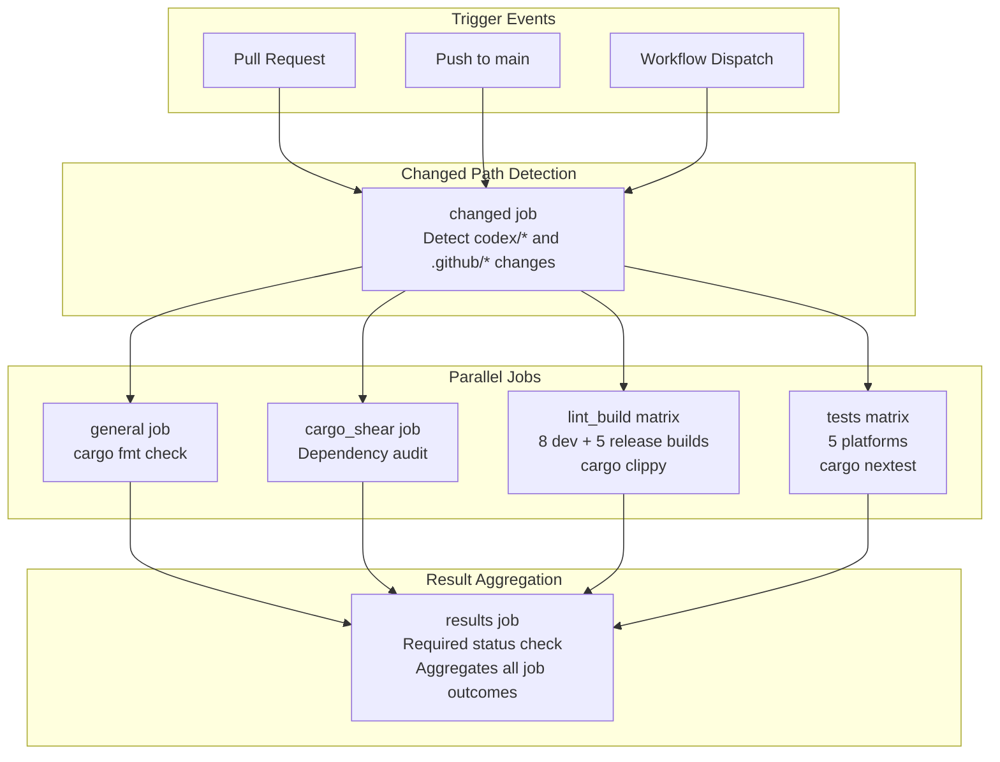
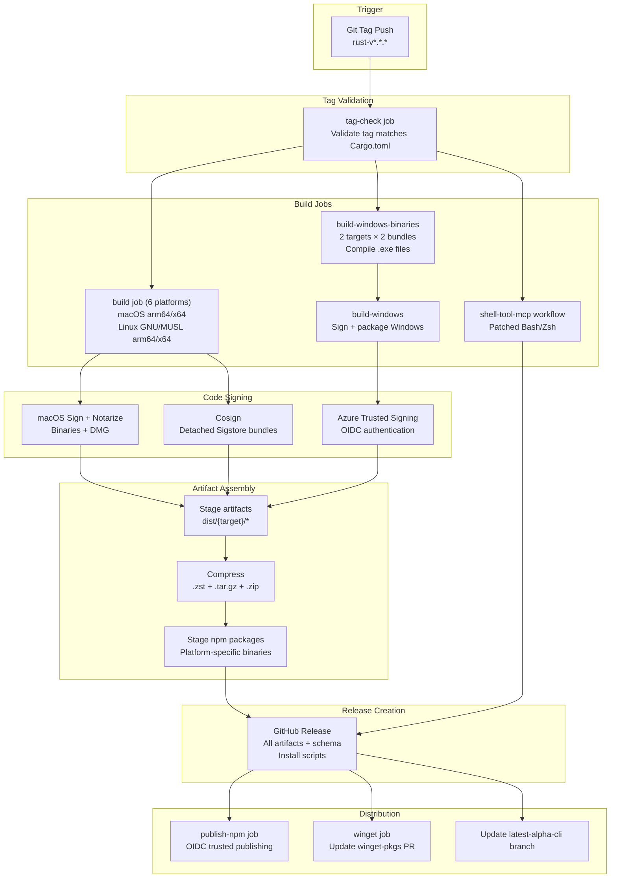
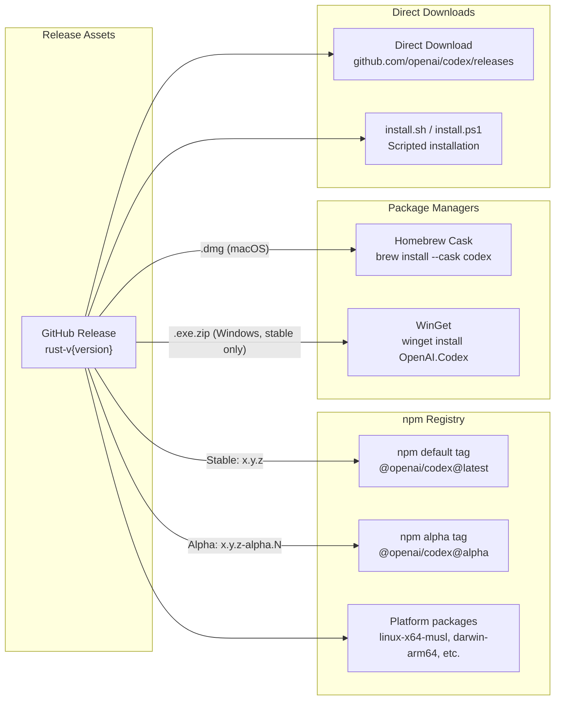
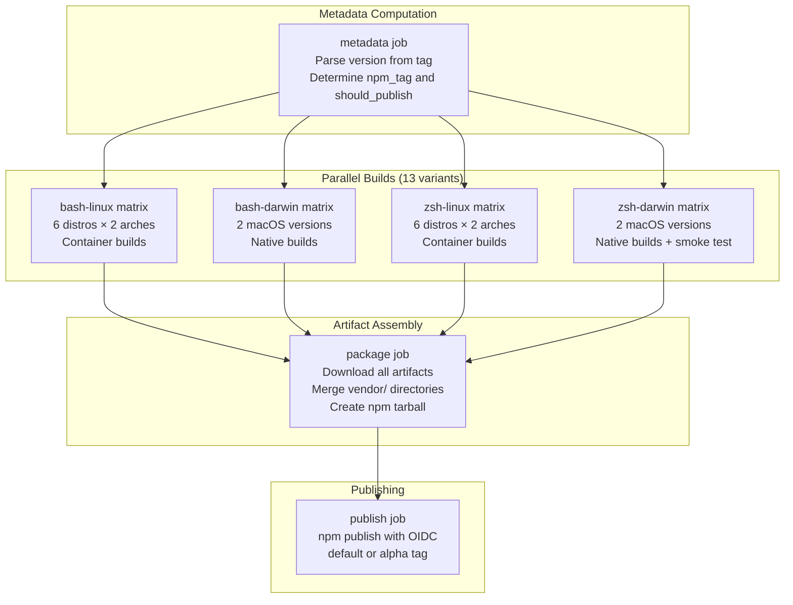

# Build and Distribution

<details>
<summary>Relevant source files</summary>

The following files were used as context for generating this wiki page:

- [.github/actions/windows-code-sign/action.yml](.github/actions/windows-code-sign/action.yml)
- [.github/scripts/install-musl-build-tools.sh](.github/scripts/install-musl-build-tools.sh)
- [.github/workflows/ci.yml](.github/workflows/ci.yml)
- [.github/workflows/rust-ci.yml](.github/workflows/rust-ci.yml)
- [.github/workflows/rust-release-windows.yml](.github/workflows/rust-release-windows.yml)
- [.github/workflows/rust-release.yml](.github/workflows/rust-release.yml)
- [.github/workflows/sdk.yml](.github/workflows/sdk.yml)
- [.github/workflows/shell-tool-mcp.yml](.github/workflows/shell-tool-mcp.yml)
- [.github/workflows/zstd](.github/workflows/zstd)
- [AGENTS.md](AGENTS.md)
- [codex-rs/.cargo/config.toml](codex-rs/.cargo/config.toml)
- [codex-rs/rust-toolchain.toml](codex-rs/rust-toolchain.toml)
- [codex-rs/scripts/setup-windows.ps1](codex-rs/scripts/setup-windows.ps1)
- [codex-rs/shell-escalation/README.md](codex-rs/shell-escalation/README.md)

</details>

This document describes the build system, CI/CD pipelines, and distribution infrastructure for Codex. It covers the Cargo workspace structure, platform build matrix, code signing procedures, artifact packaging, and distribution channels (npm, Homebrew, WinGet, GitHub Releases).

For information about development environment setup and local tooling, see [Development Setup](#8.1). For workspace organization and crate relationships, see [Repository Structure](#1.2).

---

## Overview

The Codex build and distribution system supports multiple execution modes and platforms through a layered pipeline:

1. **CI Pipeline** (`rust-ci.yml`): Runs on every pull request and push to `main`, performing lint/test checks across all supported platforms
2. **Release Pipeline** (`rust-release.yml`): Triggered by git tags matching `rust-v*.*.*`, builds release binaries with platform-specific code signing
3. **Shell Tool MCP Pipeline** (`shell-tool-mcp.yml`): Builds patched Bash and Zsh shells across 11 OS/distribution variants
4. **Distribution Channels**: Publishes to npm (default and alpha tags), Homebrew cask (macOS), WinGet (Windows), and GitHub Releases (all platforms)

**Build Targets**: The release pipeline builds for 8 platform triples:

- macOS: `aarch64-apple-darwin`, `x86_64-apple-darwin`
- Linux GNU: `x86_64-unknown-linux-gnu`, `aarch64-unknown-linux-gnu`
- Linux MUSL: `x86_64-unknown-linux-musl`, `aarch64-unknown-linux-musl`
- Windows: `x86_64-pc-windows-msvc`, `aarch64-pc-windows-msvc`

**Version Format**: Releases use semantic versioning (`x.y.z` for stable, `x.y.z-alpha.N` for pre-releases). The version format determines distribution behavior: stable releases publish to all channels with the `default` npm tag, alpha releases publish with the `alpha` npm tag and skip WinGet.

Sources: [.github/workflows/rust-release.yml:1-687](), [.github/workflows/rust-ci.yml:1-689]()

---

## Cargo Workspace Structure

The Codex project uses a Cargo workspace with multiple crates:

| Crate                         | Purpose                | Binary Outputs                |
| ----------------------------- | ---------------------- | ----------------------------- |
| `codex-rs`                    | Workspace root         | -                             |
| `codex-core`                  | Core agent engine      | -                             |
| `codex-tui`                   | Terminal UI            | -                             |
| `codex-cli`                   | CLI entry point        | `codex`                       |
| `codex-exec`                  | Execution mode         | -                             |
| `codex-app-server`            | IDE integration server | -                             |
| `codex-responses-api-proxy`   | API proxy              | `codex-responses-api-proxy`   |
| `codex-windows-sandbox-setup` | Windows sandbox helper | `codex-windows-sandbox-setup` |
| `codex-command-runner`        | Windows command runner | `codex-command-runner`        |

**Toolchain Management**: The workspace pins the Rust toolchain version in `rust-toolchain.toml`:

```toml
[toolchain]
channel = "1.93.0"
components = ["clippy", "rustfmt", "rust-src"]
```

**Platform-Specific Configuration**: The `.cargo/config.toml` file defines platform-specific linker flags:

- Windows MSVC targets use `/STACK:8388608` to increase stack size
- Windows ARM64 targets add `/arm64hazardfree` to suppress Cortex-A53 warnings
- Windows GNU targets use `-Wl,--stack,8388608`

**Build Profiles**: The workspace uses multiple build profiles:

- `dev`: Debug profile for local development
- `release`: Release profile with configurable LTO (`thin` for CI feedback, `fat` for production releases)
- `ci-test`: Custom profile for CI test runs

Sources: [codex-rs/rust-toolchain.toml:1-4](), [codex-rs/.cargo/config.toml:1-11]()

---

## CI Pipeline

### Workflow Triggers

The `rust-ci.yml` workflow runs on:

- All pull requests
- Pushes to `main` branch
- Manual workflow dispatch

**Changed Path Detection**: The CI pipeline includes a `changed` job that analyzes which files changed to skip unnecessary work:

```yaml
changed:
  outputs:
    codex: ${{ steps.detect.outputs.codex }}
    workflows: ${{ steps.detect.outputs.workflows }}
```

If only non-relevant files changed (e.g., root README), the CI jobs are skipped but the required status check still passes.

Sources: [.github/workflows/rust-ci.yml:12-49]()

### Build Matrix

The CI pipeline runs two job matrices:

**1. Lint and Build Matrix** (`lint_build` job):

| Runner             | Target                       | Profile   | Purpose                                  |
| ------------------ | ---------------------------- | --------- | ---------------------------------------- |
| `macos-15-xlarge`  | `aarch64-apple-darwin`       | `dev`     | macOS ARM debug build + clippy           |
| `macos-15-xlarge`  | `x86_64-apple-darwin`        | `dev`     | macOS x64 debug build + clippy           |
| `ubuntu-24.04`     | `x86_64-unknown-linux-musl`  | `dev`     | Linux MUSL x64 debug build + clippy      |
| `ubuntu-24.04`     | `x86_64-unknown-linux-gnu`   | `dev`     | Linux GNU x64 debug build + clippy       |
| `ubuntu-24.04-arm` | `aarch64-unknown-linux-musl` | `dev`     | Linux MUSL ARM debug build + clippy      |
| `ubuntu-24.04-arm` | `aarch64-unknown-linux-gnu`  | `dev`     | Linux GNU ARM debug build + clippy       |
| `windows-x64`      | `x86_64-pc-windows-msvc`     | `dev`     | Windows x64 debug build + clippy         |
| `windows-arm64`    | `aarch64-pc-windows-msvc`    | `dev`     | Windows ARM debug build + clippy         |
| `macos-15-xlarge`  | `aarch64-apple-darwin`       | `release` | macOS ARM release build (pre-warm cache) |
| `ubuntu-24.04`     | `x86_64-unknown-linux-musl`  | `release` | Linux MUSL x64 release build             |
| `ubuntu-24.04-arm` | `aarch64-unknown-linux-musl` | `release` | Linux MUSL ARM release build             |
| `windows-x64`      | `x86_64-pc-windows-msvc`     | `release` | Windows x64 release build                |
| `windows-arm64`    | `aarch64-pc-windows-msvc`    | `release` | Windows ARM release build                |

**2. Test Matrix** (`tests` job):

Runs `cargo nextest` tests on a subset of platforms:

- `macos-15-xlarge` / `aarch64-apple-darwin`
- `ubuntu-24.04` / `x86_64-unknown-linux-gnu`
- `ubuntu-24.04-arm` / `aarch64-unknown-linux-gnu`
- `windows-x64` / `x86_64-pc-windows-msvc`
- `windows-arm64` / `aarch64-pc-windows-msvc`

Sources: [.github/workflows/rust-ci.yml:86-182](), [.github/workflows/rust-ci.yml:453-498]()

### MUSL Cross-Compilation Setup

MUSL targets require special setup because they produce statically-linked binaries. The CI pipeline uses a hermetic build environment with Zig as the cross-compiler:

**Setup Steps** (from `install-musl-build-tools.sh`):

1. **Install Dependencies**: `musl-tools`, `pkg-config`, `libcap-dev`, `clang`, `libc++-dev`, `lld`, Zig 0.14.0
2. **Build libcap**: Cross-compile `libcap-2.75` with musl-gcc, install to isolated prefix
3. **Create Zig Wrapper Scripts**: Generate `zigcc` and `zigcxx` wrapper scripts that:
   - Strip incompatible flags (`--target`, `-I/usr/include`)
   - Forward `-target ${zig_target}` (e.g., `x86_64-linux-musl`)
   - Reorder include paths to prefer musl headers over glibc headers
4. **Configure Environment**: Set `CC`, `CXX`, `CARGO_TARGET_*_LINKER`, `PKG_CONFIG_*` variables

**UBSan Wrapper**: MUSL builds use a custom `rustc-ubsan-wrapper` script that preloads `libubsan.so.1` when available, enabling undefined behavior sanitization during host builds without linking UBSan into MUSL artifacts.

Sources: [.github/scripts/install-musl-build-tools.sh:1-280](), [.github/workflows/rust-ci.yml:281-373]()

### Caching Strategy

The CI pipeline uses three cache layers:

1. **Cargo Home Cache**: Caches `~/.cargo/bin`, `~/.cargo/registry`, `~/.cargo/git`
   - Key: `cargo-home-{runner}-{target}-{profile}-{lockfile_hash}-{toolchain_hash}`
   - Restore keys: Fallback to same runner/target/profile with older lockfile

2. **sccache Cache**: Caches compiled object files (non-Windows platforms)
   - Backend: GitHub Actions cache or local disk fallback
   - Key: `sccache-{runner}-{target}-{profile}-{lockfile_hash}-{run_id}`
   - Configuration: `SCCACHE_CACHE_SIZE=10G`, `CARGO_INCREMENTAL=0`

3. **APT Cache** (MUSL builds only): Caches apt packages for faster dependency installation

**Cache Saving**: Caches are saved only when the restore key didn't match, avoiding redundant uploads.

Sources: [.github/workflows/rust-ci.yml:226-280](), [.github/workflows/rust-ci.yml:244-268]()

### CI Workflow Diagram



Sources: [.github/workflows/rust-ci.yml:11-689]()

---

## Release Pipeline

### Tag-Based Release Workflow

The `rust-release.yml` workflow triggers on git tags matching the pattern `rust-v*.*.*`:

```bash
# Example: Trigger a release
git tag -a rust-v0.1.0 -m "Release 0.1.0"
git push origin rust-v0.1.0
```

**Tag Validation**: The `tag-check` job ensures:

1. The tag matches the regex `^rust-v[0-9]+\.[0-9]+\.[0-9]+(-(alpha|beta)(\.[0-9]+)?)?$`
2. The version in the tag matches the version in `codex-rs/Cargo.toml`

Sources: [.github/workflows/rust-release.yml:1-47]()

### Platform Build Matrix

The release pipeline builds binaries for 6 non-Windows platforms in the `build` job matrix:

| Runner             | Target                       | Output Binaries                      |
| ------------------ | ---------------------------- | ------------------------------------ |
| `macos-15-xlarge`  | `aarch64-apple-darwin`       | `codex`, `codex-responses-api-proxy` |
| `macos-15-xlarge`  | `x86_64-apple-darwin`        | `codex`, `codex-responses-api-proxy` |
| `ubuntu-24.04`     | `x86_64-unknown-linux-musl`  | `codex`, `codex-responses-api-proxy` |
| `ubuntu-24.04`     | `x86_64-unknown-linux-gnu`   | `codex`, `codex-responses-api-proxy` |
| `ubuntu-24.04-arm` | `aarch64-unknown-linux-musl` | `codex`, `codex-responses-api-proxy` |
| `ubuntu-24.04-arm` | `aarch64-unknown-linux-gnu`  | `codex`, `codex-responses-api-proxy` |

**LTO Configuration**: Releases use configurable link-time optimization:

- Alpha releases: `CARGO_PROFILE_RELEASE_LTO=thin` (faster builds, larger binaries)
- Stable releases: Currently also using `thin` due to timeout issues on ARM runners
- Environment variable: Set via `CARGO_PROFILE_RELEASE_LTO` in the workflow

Windows builds are handled separately by the `build-windows` job (see below).

Sources: [.github/workflows/rust-release.yml:48-366](), [.github/workflows/rust-release.yml:59-63]()

### Windows Build Pipeline

Windows builds use a two-stage process:

**Stage 1: Build Binaries** (`build-windows-binaries` job):

Builds two bundles per target to parallelize compilation:

| Target                    | Bundle    | Binaries                                                      |
| ------------------------- | --------- | ------------------------------------------------------------- |
| `x86_64-pc-windows-msvc`  | `primary` | `codex.exe`, `codex-responses-api-proxy.exe`                  |
| `x86_64-pc-windows-msvc`  | `helpers` | `codex-windows-sandbox-setup.exe`, `codex-command-runner.exe` |
| `aarch64-pc-windows-msvc` | `primary` | `codex.exe`, `codex-responses-api-proxy.exe`                  |
| `aarch64-pc-windows-msvc` | `helpers` | `codex-windows-sandbox-setup.exe`, `codex-command-runner.exe` |

**Stage 2: Sign and Package** (`build-windows` job):

1. Downloads prebuilt binaries from stage 1
2. Signs all four executables with Azure Trusted Signing
3. Stages artifacts and compresses them (`.zst`, `.tar.gz`, `.zip`)
4. Bundles sandbox helper binaries into the main `codex-{target}.exe.zip` for WinGet installation

Sources: [.github/workflows/rust-release-windows.yml:1-265]()

### Code Signing

#### macOS Code Signing

macOS binaries undergo a two-step signing process:

**Step 1: Sign Binaries**

- Uses Apple Developer certificates stored in GitHub secrets
- Signs `codex` and `codex-responses-api-proxy` binaries
- Uploads signed binaries to Apple's notarization service
- Waits for notarization approval

**Step 2: Create and Sign DMG**

- Builds a DMG containing the signed binaries
- Signs the DMG itself
- Notarizes the DMG

**Secrets Required**:

- `APPLE_CERTIFICATE_P12`: Developer ID certificate
- `APPLE_CERTIFICATE_PASSWORD`: Certificate password
- `APPLE_NOTARIZATION_KEY_P8`: App Store Connect API key
- `APPLE_NOTARIZATION_KEY_ID`: API key ID
- `APPLE_NOTARIZATION_ISSUER_ID`: Issuer ID

Sources: [.github/workflows/rust-release.yml:233-304]()

#### Linux Code Signing (Cosign)

Linux binaries use Cosign for detached Sigstore bundles:

```bash
# For each binary:
codex -> codex.sigstore (detached signature bundle)
codex-responses-api-proxy -> codex-responses-api-proxy.sigstore
```

The signing process uses GitHub Actions OIDC tokens (no secrets required) to generate cryptographically signed attestations.

Sources: [.github/workflows/rust-release.yml:226-232]()

#### Windows Code Signing (Azure Trusted Signing)

Windows executables are signed using Azure Trusted Signing via OIDC authentication:

**Credentials** (all stored as secrets):

- `AZURE_TRUSTED_SIGNING_CLIENT_ID`
- `AZURE_TRUSTED_SIGNING_TENANT_ID`
- `AZURE_TRUSTED_SIGNING_SUBSCRIPTION_ID`
- `AZURE_TRUSTED_SIGNING_ENDPOINT`
- `AZURE_TRUSTED_SIGNING_ACCOUNT_NAME`
- `AZURE_TRUSTED_SIGNING_CERTIFICATE_PROFILE_NAME`

**Signed Binaries**:

1. `codex.exe`
2. `codex-responses-api-proxy.exe`
3. `codex-windows-sandbox-setup.exe`
4. `codex-command-runner.exe`

Sources: [.github/actions/windows-code-sign/action.yml:1-58](), [.github/workflows/rust-release-windows.yml:173-183]()

### Artifact Packaging

After code signing, binaries are staged and compressed into multiple formats:

**Compression Formats**:

- `.zst`: Zstandard compression (space-efficient, requires `zstd` tool)
- `.tar.gz`: Gzip tarball (universal compatibility)
- `.zip`: Zip archive (Windows compatibility, used by WinGet)
- `.dmg`: macOS disk image (macOS only)

**Compression Strategy** (from `rust-release.yml:323-357`):

```bash
# For each binary:
for f in "$dest"/*; do
  # Skip existing archives and signature bundles
  # Create tar.gz for universal compatibility
  tar -C "$dest" -czf "$dest/${base}.tar.gz" "$base"
  # Create zstd and remove uncompressed (--rm flag)
  zstd -T0 -19 --rm "$dest/$base"
done
```

**Windows Bundling**: The main `codex-{target}.exe.zip` includes sandbox helper binaries for WinGet installations:

```
codex-x86_64-pc-windows-msvc.exe.zip:
  ├── codex-x86_64-pc-windows-msvc.exe
  ├── codex-command-runner.exe
  └── codex-windows-sandbox-setup.exe
```

Sources: [.github/workflows/rust-release.yml:323-357](), [.github/workflows/rust-release-windows.yml:198-259]()

### Release Creation

The `release` job aggregates all build artifacts and publishes them to GitHub Releases:

**Release Name and Tag**:

- Release name: Version number without `rust-v` prefix (e.g., `0.1.0`)
- Tag name: Full tag (e.g., `rust-v0.1.0`)

**Release Notes**: Extracted from the annotated tag's commit message

**Release Assets**:

- All platform binaries (compressed in multiple formats)
- Signature bundles (`.sigstore` for Linux, embedded in executables for macOS/Windows)
- DMG files (macOS)
- `config-schema.json`: JSON schema for `config.toml`
- `install.sh` and `install.ps1`: Installation scripts
- npm tarballs for `@openai/codex`, `@openai/codex-responses-api-proxy`, `@openai/codex-sdk`

**Prerelease Flag**: Releases with a version suffix (e.g., `-alpha`, `-beta`) are marked as prereleases.

Sources: [.github/workflows/rust-release.yml:383-535]()

### npm Package Staging

The release workflow stages npm packages using `scripts/stage_npm_packages.py`:

**Staged Packages**:

1. `@openai/codex`: Main CLI with platform-specific binaries
   - Base package: `codex-npm-{version}.tgz`
   - Platform packages: `codex-npm-{platform}-{arch}-{version}.tgz`
2. `@openai/codex-responses-api-proxy`: API proxy binary
3. `@openai/codex-sdk`: TypeScript SDK (no native binaries)

**Platform-Specific Binaries**: The main `@openai/codex` package uses npm's `optionalDependencies` mechanism to download platform-specific binaries post-install. Each platform gets its own npm package with a tag like `linux-x64-musl`, `darwin-arm64`, etc.

Sources: [.github/workflows/rust-release.yml:488-507]()

### Release Pipeline Diagram



Sources: [.github/workflows/rust-release.yml:1-687]()

---

## Distribution Channels

### npm Registry

The `publish-npm` job publishes packages to npm using OIDC trusted publishing (no manual token required):

**Publishing Criteria**:

- Stable releases (`x.y.z`): Publish to all channels with `default` npm tag
- Alpha releases (`x.y.z-alpha.N`): Publish with `alpha` npm tag
- Other versions: Skip publishing

**Published Packages**:

| Package                             | Tag Examples                                  | Purpose                    |
| ----------------------------------- | --------------------------------------------- | -------------------------- |
| `@openai/codex`                     | `default`, `alpha`                            | Main CLI (base package)    |
| `@openai/codex`                     | `linux-x64-musl`, `darwin-arm64`, `win32-x64` | Platform-specific binaries |
| `@openai/codex-responses-api-proxy` | `default`, `alpha`                            | API proxy                  |
| `@openai/codex-sdk`                 | `default`, `alpha`                            | TypeScript SDK             |

**npm Tag Logic** (from `rust-release.yml:586-644`):

```bash
# Platform-specific packages use prefixed tags
case "${filename}" in
  codex-npm-linux-*-${VERSION}.tgz)
    tag="${prefix}${platform}"  # e.g., "alpha-linux-x64-musl"
    ;;
  codex-npm-${VERSION}.tgz)
    tag="${NPM_TAG}"  # e.g., "alpha" or ""
    ;;
esac
```

**Idempotency**: The publish script detects already-published versions and skips them gracefully (non-error exit).

Sources: [.github/workflows/rust-release.yml:539-645]()

### Homebrew Cask (macOS)

Homebrew distribution is managed by the community `homebrew-cask` repository. The release workflow does **not** directly update the cask; instead, the GitHub Release triggers a Homebrew bot to create a pull request.

**Artifacts Used**:

- `.dmg` files from GitHub Releases
- macOS-only (both `aarch64-apple-darwin` and `x86_64-apple-darwin`)

Sources: [.github/workflows/rust-release.yml:1-687]()

### WinGet (Windows)

The `winget` job uses the `vedantmgoyal9/winget-releaser` action to automatically create/update a pull request in the `microsoft/winget-pkgs` repository:

**Publishing Criteria**: Stable releases only (versions without `-` suffix)

**WinGet Manifest**:

- Identifier: `OpenAI.Codex`
- Version: Extracted from release tag
- Installers: Both `codex-x86_64-pc-windows-msvc.exe.zip` and `codex-aarch64-pc-windows-msvc.exe.zip`
- Installer Regex: `^codex-(?:x86_64|aarch64)-pc-windows-msvc\.exe\.zip$`

**Authentication**: Uses a personal access token (`WINGET_PUBLISH_PAT`) from the `openai-oss-forks` account to create PRs.

Sources: [.github/workflows/rust-release.yml:646-668]()

### GitHub Releases (Direct Downloads)

All platforms publish artifacts to GitHub Releases:

**Artifact Organization**:

```
Release: 0.1.0 (rust-v0.1.0)
├── codex-aarch64-apple-darwin.dmg
├── codex-aarch64-apple-darwin.tar.gz
├── codex-aarch64-apple-darwin.zst
├── codex-x86_64-apple-darwin.dmg
├── codex-x86_64-apple-darwin.tar.gz
├── codex-x86_64-apple-darwin.zst
├── codex-x86_64-unknown-linux-gnu.tar.gz
├── codex-x86_64-unknown-linux-gnu.zst
├── codex-x86_64-unknown-linux-gnu.sigstore
├── codex-x86_64-unknown-linux-musl.tar.gz
├── codex-x86_64-unknown-linux-musl.zst
├── codex-x86_64-unknown-linux-musl.sigstore
├── (similar for aarch64-unknown-linux-gnu and aarch64-unknown-linux-musl)
├── codex-x86_64-pc-windows-msvc.exe.zip
├── codex-x86_64-pc-windows-msvc.exe.tar.gz
├── codex-x86_64-pc-windows-msvc.exe.zst
├── codex-aarch64-pc-windows-msvc.exe.zip
├── codex-aarch64-pc-windows-msvc.exe.tar.gz
├── codex-aarch64-pc-windows-msvc.exe.zst
├── config-schema.json
├── install.sh
├── install.ps1
└── (npm tarballs)
```

**Installation Scripts**:

- `install.sh`: Detects platform, downloads appropriate binary, extracts to `~/.codex/bin`
- `install.ps1`: PowerShell equivalent for Windows

Sources: [.github/workflows/rust-release.yml:500-515]()

### Distribution Channels Diagram



Sources: [.github/workflows/rust-release.yml:383-687]()

---

## Shell Tool MCP Build System

### Overview

The `shell-tool-mcp.yml` workflow builds patched versions of Bash and Zsh that support exec wrapping via the `EXEC_WRAPPER` environment variable. These patched shells are packaged as an npm module (`@openai/codex-shell-tool-mcp`) and used by Codex's shell escalation protocol.

**Purpose**: Enable interception of `execve(2)` calls within sandboxed shells to implement shell escalation (see [Shell Execution Tools](#5.2) and `codex-shell-escalation`).

Sources: [.github/workflows/shell-tool-mcp.yml:1-549](), [codex-rs/shell-escalation/README.md:1-28]()

### Build Matrix

The workflow builds patched shells across 11 OS/distribution variants:

**Bash Builds** (`bash-linux` and `bash-darwin` jobs):

| Runner             | Target                       | Variant        | Image/OS                        |
| ------------------ | ---------------------------- | -------------- | ------------------------------- |
| `ubuntu-24.04`     | `x86_64-unknown-linux-musl`  | `ubuntu-24.04` | `ubuntu:24.04`                  |
| `ubuntu-24.04`     | `x86_64-unknown-linux-musl`  | `ubuntu-22.04` | `ubuntu:22.04`                  |
| `ubuntu-24.04`     | `x86_64-unknown-linux-musl`  | `debian-12`    | `debian:12`                     |
| `ubuntu-24.04`     | `x86_64-unknown-linux-musl`  | `debian-11`    | `debian:11`                     |
| `ubuntu-24.04`     | `x86_64-unknown-linux-musl`  | `centos-9`     | `quay.io/centos/centos:stream9` |
| `ubuntu-24.04-arm` | `aarch64-unknown-linux-musl` | `ubuntu-24.04` | `arm64v8/ubuntu:24.04`          |
| `ubuntu-24.04-arm` | `aarch64-unknown-linux-musl` | `ubuntu-22.04` | `arm64v8/ubuntu:22.04`          |
| `ubuntu-24.04-arm` | `aarch64-unknown-linux-musl` | `ubuntu-20.04` | `arm64v8/ubuntu:20.04`          |
| `ubuntu-24.04-arm` | `aarch64-unknown-linux-musl` | `debian-12`    | `arm64v8/debian:12`             |
| `ubuntu-24.04-arm` | `aarch64-unknown-linux-musl` | `debian-11`    | `arm64v8/debian:11`             |
| `ubuntu-24.04-arm` | `aarch64-unknown-linux-musl` | `centos-9`     | `quay.io/centos/centos:stream9` |
| `macos-15-xlarge`  | `aarch64-apple-darwin`       | `macos-15`     | macOS 15                        |
| `macos-14`         | `aarch64-apple-darwin`       | `macos-14`     | macOS 14                        |

**Zsh Builds** (`zsh-linux` and `zsh-darwin` jobs): Same matrix as Bash

**Why Multiple Variants?**: Different Linux distributions ship different versions of system libraries (glibc, ncurses). Building on each distribution ensures compatibility with the target environment's dynamic linker and dependencies.

Sources: [.github/workflows/shell-tool-mcp.yml:70-206](), [.github/workflows/shell-tool-mcp.yml:208-410]()

### Patching Process

**Bash Patch** (from `shell-tool-mcp/patches/bash-exec-wrapper.patch`):

Modifies `execute_cmd.c` to check for the `EXEC_WRAPPER` environment variable before invoking `execve(2)`. If set, Bash execs the wrapper instead, passing the original command as arguments.

```bash
# Build patched Bash
git clone https://git.savannah.gnu.org/git/bash /tmp/bash
cd /tmp/bash
git checkout a8a1c2fac029404d3f42cd39f5a20f24b6e4fe4b
git apply "${GITHUB_WORKSPACE}/shell-tool-mcp/patches/bash-exec-wrapper.patch"
./configure --without-bash-malloc
make -j"${cores}"
```

**Zsh Patch** (from `shell-tool-mcp/patches/zsh-exec-wrapper.patch`):

Similar modification to Zsh's exec implementation.

```bash
# Build patched Zsh
git clone https://git.code.sf.net/p/zsh/code /tmp/zsh
cd /tmp/zsh
git checkout 77045ef899e53b9598bebc5a41db93a548a40ca6
git apply "${GITHUB_WORKSPACE}/shell-tool-mcp/patches/zsh-exec-wrapper.patch"
./Util/preconfig
./configure
make -j"${cores}"
```

**Smoke Test**: Zsh builds include a smoke test that verifies the wrapper intercepts `exec` calls:

```bash
CODEX_WRAPPER_LOG="$tmpdir/wrapper.log" \
EXEC_WRAPPER="$tmpdir/exec-wrapper" \
/tmp/zsh/Src/zsh -fc '/bin/echo smoke-zsh' > "$tmpdir/stdout.txt"

# Verify wrapper was invoked
grep -Fx "/bin/echo" "$tmpdir/wrapper.log"
```

Sources: [.github/workflows/shell-tool-mcp.yml:145-160](), [.github/workflows/shell-tool-mcp.yml:283-327](), [codex-rs/shell-escalation/README.md:18-28]()

### npm Packaging

The `package` job assembles all built shell binaries into a single npm package:

**Artifact Directory Structure**:

```
vendor/
├── x86_64-unknown-linux-musl/
│   ├── bash/
│   │   ├── ubuntu-24.04/bash
│   │   ├── ubuntu-22.04/bash
│   │   ├── debian-12/bash
│   │   └── ...
│   └── zsh/
│       ├── ubuntu-24.04/zsh
│       └── ...
├── aarch64-unknown-linux-musl/
│   ├── bash/
│   └── zsh/
└── aarch64-apple-darwin/
    ├── bash/
    └── zsh/
```

**Package Creation**:

1. Download all build artifacts
2. Merge `vendor/` directories from all jobs
3. Update `package.json` version field
4. Create npm tarball: `codex-shell-tool-mcp-npm-{version}.tgz`

**Publishing**: If `publish: true` and the version is releasable (stable or alpha), publish to npm with the appropriate tag.

Sources: [.github/workflows/shell-tool-mcp.yml:412-549]()

### Shell Tool MCP Workflow Diagram



Sources: [.github/workflows/shell-tool-mcp.yml:1-549]()

---

## Additional Build Infrastructure

### DotSlash Integration

The release pipeline uses DotSlash to wrap platform-specific tools:

**`.github/workflows/zstd`**: DotSlash wrapper for the `zstd` compression tool on Windows runners. The wrapper downloads `zstd.exe` from GitHub releases and provides a consistent interface across platforms.

**Usage in Workflows**:

```bash
# Compress artifacts
"${GITHUB_WORKSPACE}/.github/workflows/zstd" -T0 -19 "$dest/$base"
```

**DotSlash Publishing**: The `release` job publishes DotSlash metadata to enable automatic updates:

```yaml
- uses: facebook/dotslash-publish-release@v2
  with:
    tag: ${{ github.ref_name }}
    config: .github/dotslash-config.json
```

Sources: [.github/workflows/zstd:1-47](), [.github/workflows/rust-release.yml:516-522]()

### Developers Website Integration

Stable releases trigger a Vercel deploy hook to update `developers.openai.com`:

**Purpose**: Publish the latest `config.schema.json` to the developer documentation website.

**Criteria**: Only stable releases (no `-` in version) trigger the deploy hook.

Sources: [.github/workflows/rust-release.yml:523-535]()

### Branch Update Automation

The `update-branch` job force-pushes every release to the `latest-alpha-cli` branch:

**Purpose**: Provide a stable reference for alpha CLI installations that always points to the latest tagged release.

```bash
gh api \
  repos/${GITHUB_REPOSITORY}/git/refs/heads/latest-alpha-cli \
  -X PATCH \
  -f sha="${GITHUB_SHA}" \
  -F force=true
```

Sources: [.github/workflows/rust-release.yml:669-687]()
