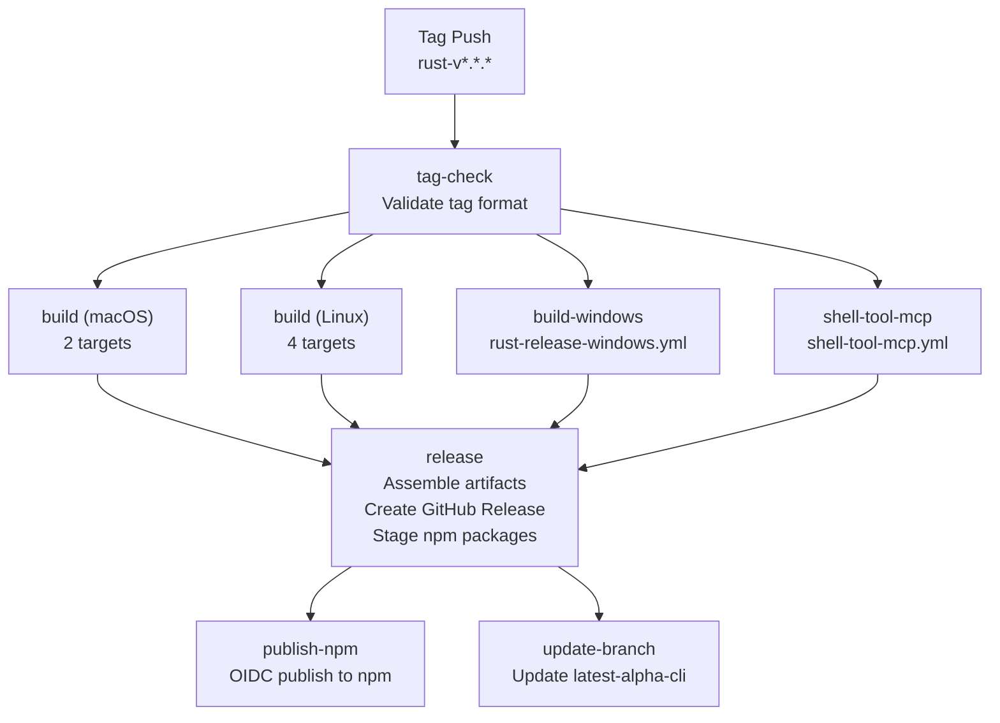
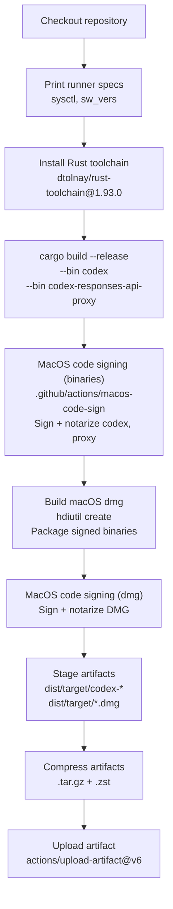
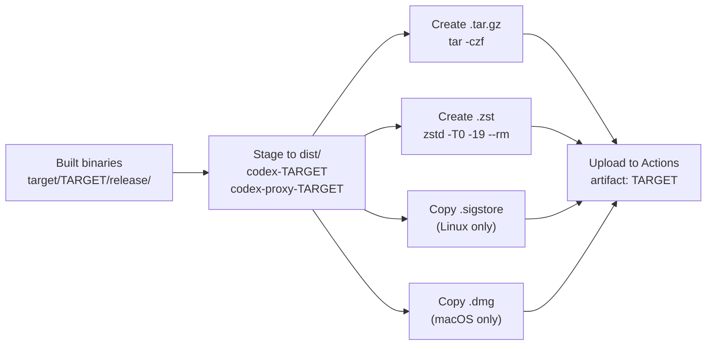
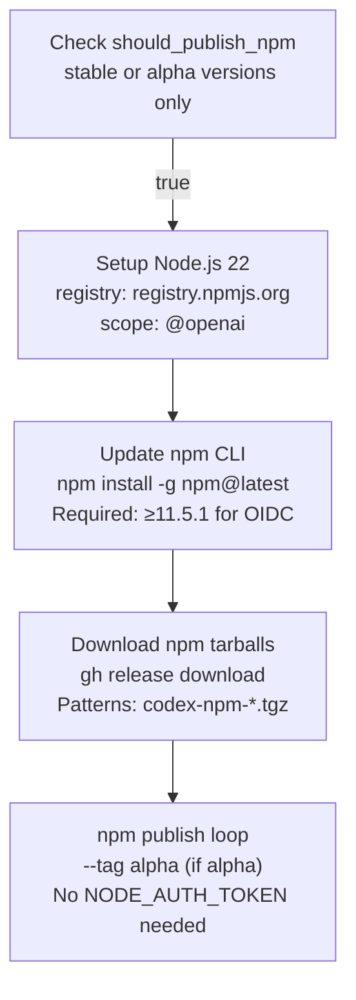

# Release Pipeline

<details>
<summary>Relevant source files</summary>

The following files were used as context for generating this wiki page:

- [.github/actions/windows-code-sign/action.yml](.github/actions/windows-code-sign/action.yml)
- [.github/scripts/install-musl-build-tools.sh](.github/scripts/install-musl-build-tools.sh)
- [.github/workflows/ci.yml](.github/workflows/ci.yml)
- [.github/workflows/rust-ci.yml](.github/workflows/rust-ci.yml)
- [.github/workflows/rust-release-windows.yml](.github/workflows/rust-release-windows.yml)
- [.github/workflows/rust-release.yml](.github/workflows/rust-release.yml)
- [.github/workflows/sdk.yml](.github/workflows/sdk.yml)
- [.github/workflows/shell-tool-mcp.yml](.github/workflows/shell-tool-mcp.yml)
- [.github/workflows/zstd](.github/workflows/zstd)
- [AGENTS.md](AGENTS.md)
- [codex-rs/.cargo/config.toml](codex-rs/.cargo/config.toml)
- [codex-rs/rust-toolchain.toml](codex-rs/rust-toolchain.toml)
- [codex-rs/scripts/setup-windows.ps1](codex-rs/scripts/setup-windows.ps1)
- [codex-rs/shell-escalation/README.md](codex-rs/shell-escalation/README.md)

</details>

## Purpose and Scope

This document describes the release pipeline defined in [.github/workflows/rust-release.yml]() that builds, signs, and publishes Codex binaries for all supported platforms. The pipeline is triggered by pushing a version tag and orchestrates multi-platform builds, platform-specific code signing, artifact compression, GitHub release creation, and npm package publishing.

For information about continuous integration testing, see [CI Pipeline](#7.2). For details on distribution channels (GitHub Releases, npm, Homebrew), see [Distribution Channels](#7.4). For the separate shell-tool-mcp build process, see [Shell Tool MCP Build System](#7.5).

---

## Release Trigger and Tag Validation

The release pipeline is triggered by pushing a Git tag that matches the pattern `rust-v*.*.*`:

```bash
git tag -a rust-v0.1.0 -m "Release 0.1.0"
git push origin rust-v0.1.0
```

The `tag-check` job validates that the tag format is correct and matches the version declared in [codex-rs/Cargo.toml](). Accepted tag formats:

- Stable releases: `rust-v1.2.3`
- Alpha pre-releases: `rust-v1.2.3-alpha.N`

[.github/workflows/rust-release.yml:19-46]() extracts the version from the tag, reads the version from `Cargo.toml`, and fails the workflow if they don't match. This prevents accidental releases with mismatched versions.

**Sources:** [.github/workflows/rust-release.yml:1-46]()

---

## Workflow Job Dependencies

**Diagram: Release Pipeline Job Graph**



The pipeline uses concurrent builds for all platforms, then gates the final release assembly on all builds completing successfully. The npm publish job is conditional on version format (stable or alpha only).

**Sources:** [.github/workflows/rust-release.yml:48-635]()

---

## Build Matrix Strategy

### Platform Coverage

The `build` job uses a matrix strategy to build binaries for 6 platform/libc combinations in parallel:

| Runner             | Target                       | libc   | LTO Mode    |
| ------------------ | ---------------------------- | ------ | ----------- |
| `macos-15-xlarge`  | `aarch64-apple-darwin`       | system | Conditional |
| `macos-15-xlarge`  | `x86_64-apple-darwin`        | system | Conditional |
| `ubuntu-24.04`     | `x86_64-unknown-linux-musl`  | musl   | Conditional |
| `ubuntu-24.04`     | `x86_64-unknown-linux-gnu`   | glibc  | Conditional |
| `ubuntu-24.04-arm` | `aarch64-unknown-linux-musl` | musl   | Conditional |
| `ubuntu-24.04-arm` | `aarch64-unknown-linux-gnu`  | glibc  | Conditional |

Windows builds are handled by a separate reusable workflow [.github/workflows/rust-release-windows.yml]() that builds 2 targets (`x86_64-pc-windows-msvc`, `aarch64-pc-windows-msvc`).

[.github/workflows/rust-release.yml:60]() sets `CARGO_PROFILE_RELEASE_LTO` based on whether the tag contains `-alpha`: alpha releases use `thin` LTO for faster builds, while stable releases use `fat` LTO for maximum optimization.

**Sources:** [.github/workflows/rust-release.yml:48-92](), [.github/workflows/rust-release.yml:358-363]()

---

## macOS Build Process

**Diagram: macOS Release Build Flow**



The macOS build process is notable for its two-stage signing:

1. **Binary Signing** [.github/workflows/rust-release.yml:224-235](): Uses the `macos-code-sign` action to sign and notarize `codex` and `codex-responses-api-proxy` binaries individually. This requires Apple Developer ID certificates and notarization credentials.

2. **DMG Creation** [.github/workflows/rust-release.yml:237-281](): After signing, `hdiutil create` packages the already-signed binaries into a DMG volume with volume name `Codex (target)`.

3. **DMG Signing** [.github/workflows/rust-release.yml:283-294](): The DMG itself is then signed and notarized. This double-signing ensures both the binaries inside and the DMG container are trusted.

The macOS builds run on `macos-15-xlarge` runners for both `aarch64-apple-darwin` and `x86_64-apple-darwin` targets.

**Sources:** [.github/workflows/rust-release.yml:66-69](), [.github/workflows/rust-release.yml:224-294]()

---

## Linux Build Process

### musl vs glibc Targets

Linux builds produce both musl and glibc variants for x64 and arm64 architectures. The musl builds require special toolchain setup:

**musl Build Configuration** [.github/workflows/rust-release.yml:130-204]():

1. **Hermetic Cargo Home**: Creates isolated `$GITHUB_WORKSPACE/.cargo-home` to avoid host toolchain pollution
2. **Zig Installation**: Uses Zig 0.14.0 as a C/C++ compiler that can cross-compile for musl targets
3. **musl Build Tools**: Runs [.github/scripts/install-musl-build-tools.sh]() to:
   - Install musl development packages via apt
   - Build libcap from source for the target architecture
   - Configure Zig wrapper scripts for CC/CXX that handle musl cross-compilation
4. **UBSan Wrapper**: Configures a rustc wrapper that preloads `libubsan.so.1` for undefined behavior sanitization
5. **Sanitizer Flag Clearing**: Removes sanitizer flags from CFLAGS/RUSTFLAGS to prevent host-specific instrumentation

The glibc builds run directly on `ubuntu-24.04` or `ubuntu-24.04-arm` runners without special toolchain configuration.

### Linux Code Signing

Linux binaries are signed using Cosign with keyless signing [.github/workflows/rust-release.yml:217-222]():

```yaml
- name: Cosign Linux artifacts
  uses: ./.github/actions/linux-code-sign
  with:
    target: ${{ matrix.target }}
    artifacts-dir: ${{ github.workspace }}/codex-rs/target/${{ matrix.target }}/release
```

This produces `.sigstore` bundles alongside each binary containing the signature and certificate chain. The bundles can be verified using `cosign verify-blob`.

**Sources:** [.github/workflows/rust-release.yml:110-222](), [.github/scripts/install-musl-build-tools.sh]()

---

## Windows Build Process

Windows builds are delegated to [.github/workflows/rust-release-windows.yml](), a reusable workflow that:

1. **Splits Build Phases** [.github/workflows/rust-release-windows.yml:24-120]():
   - `build-windows-binaries` job: Compiles binaries in two bundles:
     - `primary`: `codex.exe`, `codex-responses-api-proxy.exe`
     - `helpers`: `codex-windows-sandbox-setup.exe`, `codex-command-runner.exe`
   - Splitting allows parallel compilation of sandbox helpers

2. **Recombines for Signing** [.github/workflows/rust-release-windows.yml:121-183]():
   - `build-windows` job downloads both bundles
   - Signs all 4 binaries together using Azure Trusted Signing

3. **Azure Trusted Signing** [.github/actions/windows-code-sign/action.yml]():
   - Uses OIDC authentication (no long-lived credentials)
   - Applies Authenticode signatures via `azure/trusted-signing-action@v0`
   - Signs: `codex.exe`, `codex-responses-api-proxy.exe`, `codex-windows-sandbox-setup.exe`, `codex-command-runner.exe`

4. **Bundle Creation** [.github/workflows/rust-release-windows.yml:236-250]():
   - Creates a bundled ZIP for the main `codex-*.exe` that includes sandbox helper binaries
   - This ensures WinGet installations get all required executables in one package
   - Falls back to single-binary ZIP if helpers are missing

**Sources:** [.github/workflows/rust-release-windows.yml](), [.github/actions/windows-code-sign/action.yml]()

---

## Artifact Compression and Staging

After building and signing, each platform-specific build job stages and compresses artifacts:

**Diagram: Artifact Staging Process**



[.github/workflows/rust-release.yml:296-356]() implements the staging process:

1. **Staging Directory**: Copies binaries to `dist/$TARGET/` with target-suffixed names
   - Example: `codex-aarch64-apple-darwin`, `codex-responses-api-proxy-x86_64-unknown-linux-musl`
   - Linux: Also copies `.sigstore` signature bundles
   - macOS: Also copies `.dmg` files

2. **Dual Compression**: Creates both `.tar.gz` and `.zst` archives
   - `.tar.gz`: For environments without `zstd` tool
   - `.zst`: Smaller size, faster decompression (level 19, multi-threaded with `-T0`)
   - The `--rm` flag deletes original uncompressed binaries after creating `.zst`

3. **Windows Differences**: Uses `7z` for `.zip` creation and keeps `.exe` files uncompressed alongside archives

The compression step ensures artifacts uploaded to GitHub Actions are small while providing multiple format options for downstream users.

**Sources:** [.github/workflows/rust-release.yml:296-356]()

---

## Release Assembly and GitHub Release

The `release` job waits for all build jobs to complete, then assembles the final release:

**Release Assembly Steps** [.github/workflows/rust-release.yml:374-521]():

1. **Artifact Download**: Uses `actions/download-artifact@v7` to pull all platform artifacts into `dist/`

2. **Cleanup**: Removes temporary artifacts not intended for release:
   - `shell-tool-mcp*` directories (published separately as npm package)
   - `windows-binaries*` directories (intermediate build artifacts)
   - `cargo-timing.html` files from multiple targets (would conflict with duplicate names)

3. **Config Schema**: Copies [codex-rs/core/config.schema.json]() to `dist/config-schema.json` for download

4. **Version Extraction**: Strips `rust-v` prefix from tag name to get version string

5. **npm Settings Determination** [.github/workflows/rust-release.yml:447-464]():
   - Stable versions (`1.2.3`): `should_publish=true`, `npm_tag=` (default latest)
   - Alpha versions (`1.2.3-alpha.N`): `should_publish=true`, `npm_tag=alpha`
   - Other formats: `should_publish=false`

6. **npm Package Staging**: Runs [scripts/stage_npm_packages.py]() to:
   - Download release binaries from GitHub Release API
   - Create platform-specific npm packages (e.g., `@openai/codex-linux-x64`)
   - Create umbrella package `@openai/codex` with platform detection
   - Stage npm tarballs in workspace

7. **GitHub Release Creation** [.github/workflows/rust-release.yml:491-507]():
   - Uses `softprops/action-gh-release@v2`
   - Release name: Version string without `rust-v` prefix
   - Body: Git commit message of the tagged commit
   - Files: All contents of `dist/**`
   - `prerelease: true` if version contains `-` suffix

8. **DotSlash Publishing**: Uses `facebook/dotslash-publish-release@v2` to update DotSlash config for binary discovery

9. **Developer Website Deploy** [.github/workflows/rust-release.yml:509-520](): Triggers a Vercel deploy webhook for `developers.openai.com` to pick up the new config schema (stable releases only)

**Sources:** [.github/workflows/rust-release.yml:374-521]()

---

## npm Package Publishing via OIDC

The `publish-npm` job conditionally publishes to the npm registry using OpenID Connect (OIDC) authentication:

**npm OIDC Publishing Flow** [.github/workflows/rust-release.yml:522-615]():



Key aspects of the npm publishing process:

1. **OIDC Prerequisites**:
   - `permissions.id-token: write` in job definition
   - npm CLI version 11.5.1+ (provides `npm login --auth-type=oidc`)
   - No `NODE_AUTH_TOKEN` secret required

2. **Tarball Download** [.github/workflows/rust-release.yml:547-568]():
   - Downloads from GitHub Release using `gh release download`
   - Patterns match: `codex-npm-${version}.tgz`, `codex-npm-{linux,darwin,win32}-*-${version}.tgz`, `codex-responses-api-proxy-npm-${version}.tgz`, `codex-sdk-npm-${version}.tgz`

3. **Tag Selection** [.github/workflows/rust-release.yml:571-615]():
   - Main packages get `npm_tag` (empty for stable → latest, "alpha" for pre-releases)
   - Platform-specific packages get prefixed tags: `alpha-linux-x64`, `alpha-darwin-arm64`, etc.

4. **Publishing Loop**: Publishes each tarball with appropriate `--tag` flag

This OIDC-based publishing eliminates the need for long-lived npm tokens and provides per-publish audit trails via OpenID Connect identity tokens.

**Sources:** [.github/workflows/rust-release.yml:522-615]()

---

## Branch Update for Canary Builds

The `update-branch` job force-updates the `latest-alpha-cli` branch to point at the release commit [.github/workflows/rust-release.yml:617-634]():

```yaml
- name: Update latest-alpha-cli branch
  env:
    GH_TOKEN: ${{ secrets.GITHUB_TOKEN }}
  run: |
    gh api \
      repos/${GITHUB_REPOSITORY}/git/refs/heads/latest-alpha-cli \
      -X PATCH \
      -f sha="${GITHUB_SHA}" \
      -F force=true
```

This branch serves as a stable pointer for canary/development builds and can be used by automated deployment systems or testing infrastructure to track the latest released alpha version.

**Sources:** [.github/workflows/rust-release.yml:617-634]()

---

## Parallel Shell Tool MCP Build

The `shell-tool-mcp` job runs concurrently with platform builds by invoking the reusable [.github/workflows/shell-tool-mcp.yml]() workflow [.github/workflows/rust-release.yml:365-372]():

```yaml
shell-tool-mcp:
  name: shell-tool-mcp
  needs: tag-check
  uses: ./.github/workflows/shell-tool-mcp.yml
  with:
    release-tag: ${{ github.ref_name }}
    publish: true
  secrets: inherit
```

This workflow builds patched Bash and Zsh shells across many platform combinations — 11 Linux distro/arch combinations per shell (5 `x86_64-unknown-linux-musl` variants × Ubuntu/Debian/CentOS, 6 `aarch64-unknown-linux-musl` variants including Ubuntu 20.04) plus 2 macOS variants per shell (`macos-15` and `macos-14` on `aarch64-apple-darwin`). The resulting npm package (`@openai/codex-shell-tool-mcp`) is uploaded as a release artifact and conditionally published to npm.

For full details on the shell-tool-mcp build process, see [Shell Tool MCP Build System](#7.5).

**Sources:** [.github/workflows/rust-release.yml:365-372](), [.github/workflows/shell-tool-mcp.yml:70-166](), [.github/workflows/shell-tool-mcp.yml:208-332]()

---

## Code Signing Summary Table

| Platform    | Signing Method                       | Artifacts                                                                                                   | Verification               |
| ----------- | ------------------------------------ | ----------------------------------------------------------------------------------------------------------- | -------------------------- |
| **macOS**   | Apple Developer ID + Notarization    | `codex`, `codex-responses-api-proxy`, `.dmg`                                                                | `spctl --assess --verbose` |
| **Linux**   | Cosign keyless signing               | `.sigstore` bundles                                                                                         | `cosign verify-blob`       |
| **Windows** | Azure Trusted Signing (Authenticode) | `codex.exe`, `codex-responses-api-proxy.exe`, `codex-windows-sandbox-setup.exe`, `codex-command-runner.exe` | `signtool verify`          |

All signing processes use OIDC/ephemeral credentials to avoid storing long-lived secrets in GitHub Actions.

**Sources:** [.github/workflows/rust-release.yml:217-294](), [.github/workflows/rust-release-windows.yml:173-182](), [.github/actions/windows-code-sign/action.yml]()

---

## Build Performance and Caching

Unlike the CI pipeline which uses `sccache` and `cargo home` caching, the release pipeline does **not** use GitHub Actions cache to ensure reproducible builds from clean state. However, it does optimize build times through:

1. **LTO Tuning**: Alpha releases use `thin` LTO instead of `fat` LTO for ~30% faster compile times
2. **Parallel Builds**: All 6 Linux/macOS targets build concurrently
3. **Windows Split Building**: Primary binaries and sandbox helpers compile in parallel via matrix
4. **Cargo Timings**: Uploads `cargo-timing.html` reports for post-mortem analysis

[.github/workflows/rust-release.yml:208-214]() shows the build command:

```bash
cargo build --target ${{ matrix.target }} --release --timings \
  --bin codex --bin codex-responses-api-proxy
```

The `--timings` flag generates HTML reports showing dependency build order and duration, which are uploaded as artifacts for debugging slow builds.

**Sources:** [.github/workflows/rust-release.yml:60](), [.github/workflows/rust-release.yml:205-215]()
