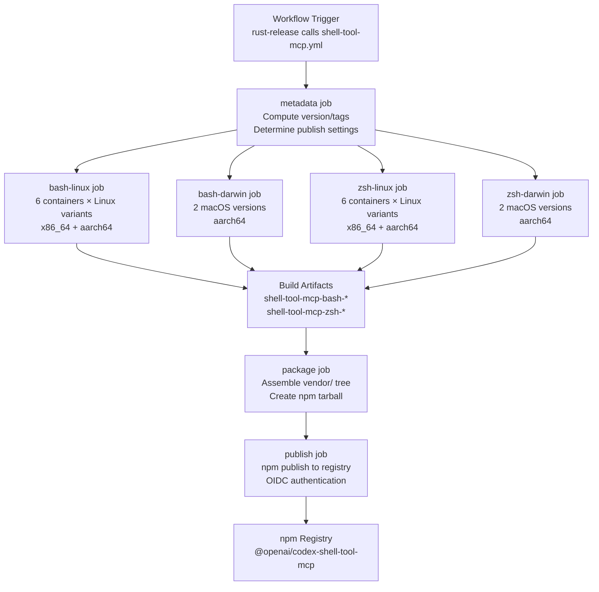
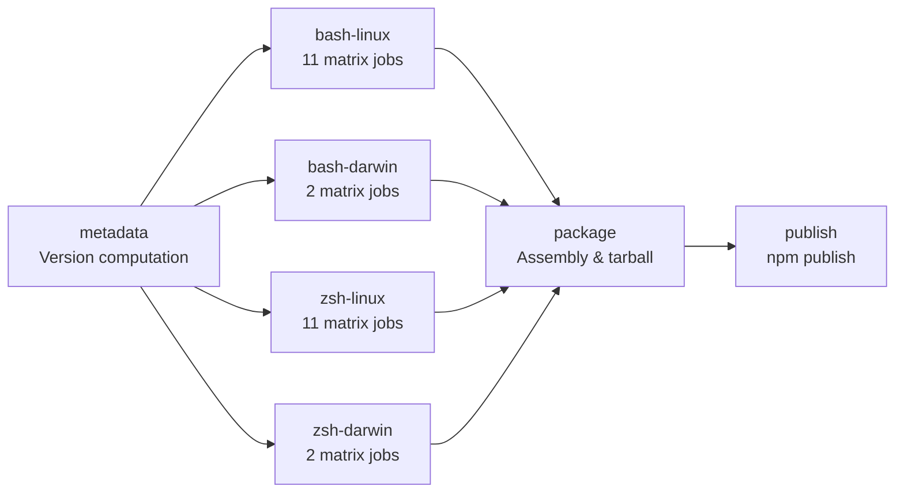
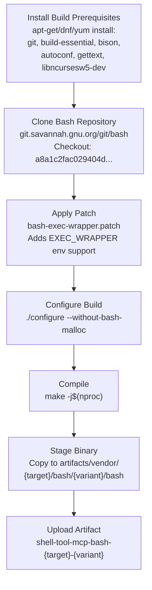
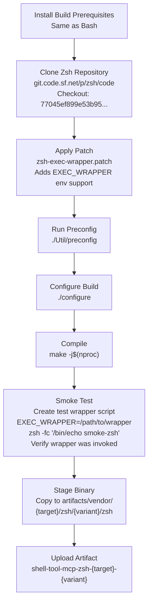
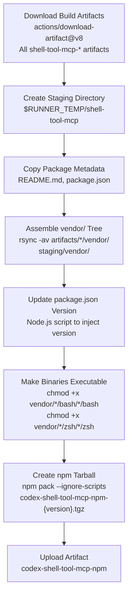
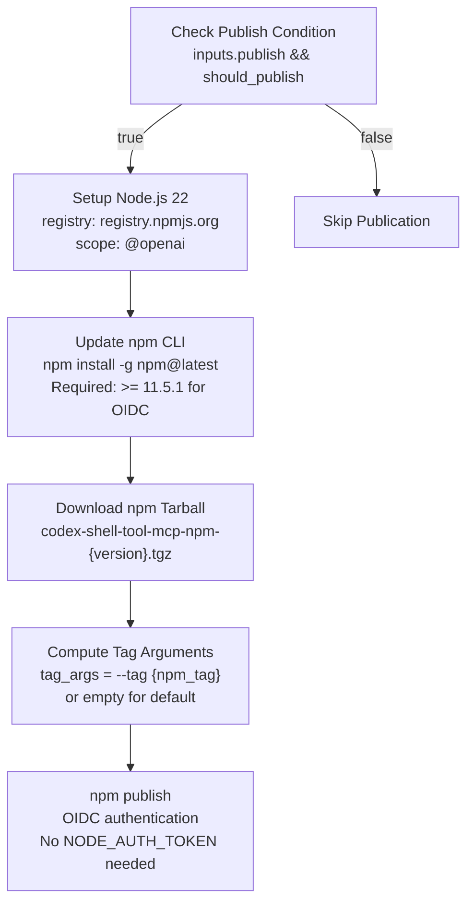
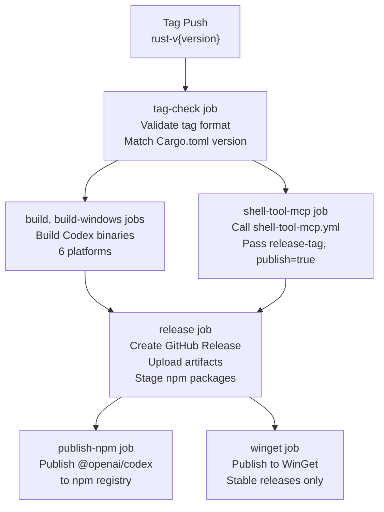
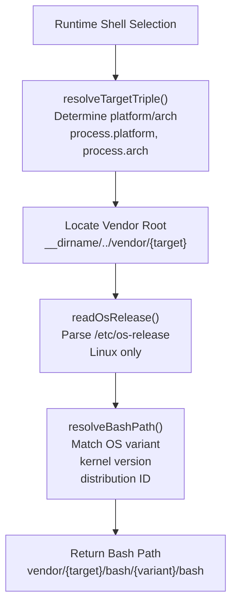

# Shell Tool MCP Build System

<details>
<summary>Relevant source files</summary>

The following files were used as context for generating this wiki page:

- [.github/actions/windows-code-sign/action.yml](.github/actions/windows-code-sign/action.yml)
- [.github/scripts/install-musl-build-tools.sh](.github/scripts/install-musl-build-tools.sh)
- [.github/workflows/ci.yml](.github/workflows/ci.yml)
- [.github/workflows/rust-ci.yml](.github/workflows/rust-ci.yml)
- [.github/workflows/rust-release-windows.yml](.github/workflows/rust-release-windows.yml)
- [.github/workflows/rust-release.yml](.github/workflows/rust-release.yml)
- [.github/workflows/sdk.yml](.github/workflows/sdk.yml)
- [.github/workflows/shell-tool-mcp-ci.yml](.github/workflows/shell-tool-mcp-ci.yml)
- [.github/workflows/shell-tool-mcp.yml](.github/workflows/shell-tool-mcp.yml)
- [.github/workflows/zstd](.github/workflows/zstd)
- [AGENTS.md](AGENTS.md)
- [CHANGELOG.md](CHANGELOG.md)
- [cliff.toml](cliff.toml)
- [codex-cli/package.json](codex-cli/package.json)
- [codex-rs/.cargo/config.toml](codex-rs/.cargo/config.toml)
- [codex-rs/responses-api-proxy/npm/package.json](codex-rs/responses-api-proxy/npm/package.json)
- [codex-rs/rust-toolchain.toml](codex-rs/rust-toolchain.toml)
- [codex-rs/scripts/setup-windows.ps1](codex-rs/scripts/setup-windows.ps1)
- [codex-rs/shell-escalation/README.md](codex-rs/shell-escalation/README.md)
- [package.json](package.json)
- [pnpm-workspace.yaml](pnpm-workspace.yaml)
- [sdk/typescript/.prettierignore](sdk/typescript/.prettierignore)
- [shell-tool-mcp/package.json](shell-tool-mcp/package.json)
- [shell-tool-mcp/src/index.ts](shell-tool-mcp/src/index.ts)

</details>

## Purpose and Scope

The Shell Tool MCP Build System is responsible for building and distributing patched versions of Bash and Zsh that support execution interception for Codex's shell tools. This system compiles customized shell binaries across 11 OS/distribution variants for both x86_64 and aarch64 architectures, packages them into an npm distribution, and publishes them to the npm registry. The patched shells enable the `EXEC_WRAPPER` mechanism used by Codex's shell escalation protocol to intercept and control command execution within sandboxed shell sessions.

For information about how Codex uses these patched shells at runtime, see [5.2](#5.2). For details on the shell escalation protocol itself, see the shell-escalation implementation in `codex-rs/shell-escalation/`.

**Sources:** [.github/workflows/shell-tool-mcp.yml:1-549](), [codex-rs/shell-escalation/README.md:1-32]()

---

## System Overview

The shell-tool-mcp system operates as a standalone workflow that builds patched shell binaries independently from the main Codex release pipeline, then integrates with the release workflow to coordinate versioning and publication. The system produces the `@openai/codex-shell-tool-mcp` npm package containing platform-specific binaries organized by target triple and OS variant.

### Build and Distribution Flow



**Sources:** [.github/workflows/shell-tool-mcp.yml:1-549](), [.github/workflows/rust-release.yml:374-381]()

---

## Workflow Architecture

The `shell-tool-mcp.yml` workflow is designed as a reusable workflow that accepts inputs for versioning and publishing control. It is called from the main `rust-release.yml` workflow.

### Workflow Inputs and Job Dependencies

| Input             | Type    | Description                                 | Default                      |
| ----------------- | ------- | ------------------------------------------- | ---------------------------- |
| `release-version` | string  | Version to publish (x.y.z or x.y.z-alpha.N) | Derived from GITHUB_REF_NAME |
| `release-tag`     | string  | Tag name for downloading release artifacts  | rust-v{version}              |
| `publish`         | boolean | Whether to publish to npm                   | true                         |

### Job Dependency Chain



The `metadata` job computes version strings and determines whether the version should be published based on version format. Stable releases (x.y.z) and alpha releases (x.y.z-alpha.N) are publishable; all other formats skip publication.

**Sources:** [.github/workflows/shell-tool-mcp.yml:4-68]()

---

## Build Matrix and Platforms

The workflow builds binaries across 11 OS/distribution variants, covering major Linux distributions and macOS versions. Each variant is built for both x86_64 and aarch64 architectures on Linux, while macOS builds are aarch64-only.

### Linux Build Matrix

| Variant      | Container Image               | Runner           | Target Triple              | Job Count |
| ------------ | ----------------------------- | ---------------- | -------------------------- | --------- |
| ubuntu-24.04 | ubuntu:24.04                  | ubuntu-24.04     | x86_64-unknown-linux-musl  | 1         |
| ubuntu-24.04 | arm64v8/ubuntu:24.04          | ubuntu-24.04-arm | aarch64-unknown-linux-musl | 1         |
| ubuntu-22.04 | ubuntu:22.04                  | ubuntu-24.04     | x86_64-unknown-linux-musl  | 1         |
| ubuntu-22.04 | arm64v8/ubuntu:22.04          | ubuntu-24.04-arm | aarch64-unknown-linux-musl | 1         |
| ubuntu-20.04 | arm64v8/ubuntu:20.04          | ubuntu-24.04-arm | aarch64-unknown-linux-musl | 1         |
| debian-12    | debian:12                     | ubuntu-24.04     | x86_64-unknown-linux-musl  | 1         |
| debian-12    | arm64v8/debian:12             | ubuntu-24.04-arm | aarch64-unknown-linux-musl | 1         |
| debian-11    | debian:11                     | ubuntu-24.04     | x86_64-unknown-linux-musl  | 1         |
| debian-11    | arm64v8/debian:11             | ubuntu-24.04-arm | aarch64-unknown-linux-musl | 1         |
| centos-9     | quay.io/centos/centos:stream9 | ubuntu-24.04     | x86_64-unknown-linux-musl  | 1         |
| centos-9     | quay.io/centos/centos:stream9 | ubuntu-24.04-arm | aarch64-unknown-linux-musl | 1         |

### macOS Build Matrix

| Variant  | Runner          | Target Triple        |
| -------- | --------------- | -------------------- |
| macos-15 | macos-15-xlarge | aarch64-apple-darwin |
| macos-14 | macos-14        | aarch64-apple-darwin |

**Sources:** [.github/workflows/shell-tool-mcp.yml:70-125](), [.github/workflows/shell-tool-mcp.yml:168-182](), [.github/workflows/shell-tool-mcp.yml:209-263](), [.github/workflows/shell-tool-mcp.yml:334-349]()

---

## Bash Build Process

The Bash build process clones upstream Bash from the GNU Savannah repository, applies a custom patch to add `EXEC_WRAPPER` support, configures the build, and compiles the binary.

### Bash Build Steps



### Patch Details

The Bash patch modifies `execute_cmd.c` to support the `EXEC_WRAPPER` environment variable. When set, Bash invokes the wrapper program (typically `codex-execve-wrapper`) before executing any external command, enabling shell escalation protocol integration.

The specific patch file is located at `shell-tool-mcp/patches/bash-exec-wrapper.patch` and applies cleanly to Bash commit `a8a1c2fac029404d3f42cd39f5a20f24b6e4fe4b`.

**Sources:** [.github/workflows/shell-tool-mcp.yml:126-165](), [.github/workflows/shell-tool-mcp.yml:183-206](), [codex-rs/shell-escalation/README.md:18-28]()

---

## Zsh Build Process

The Zsh build process is similar to Bash but includes an additional smoke test to verify the `EXEC_WRAPPER` functionality works correctly after compilation.

### Zsh Build and Test Flow



### Smoke Test Implementation

The smoke test creates a temporary wrapper script that logs all invocations to `CODEX_WRAPPER_LOG`, then executes a simple command through the patched zsh. The test verifies both that the command output is correct and that the wrapper was invoked by checking the log file.

**Sources:** [.github/workflows/shell-tool-mcp.yml:263-332](), [.github/workflows/shell-tool-mcp.yml:378-410]()

---

## Package Assembly and Structure

The `package` job downloads all build artifacts, assembles them into a unified directory structure, updates the `package.json` version, and creates an npm tarball.

### Vendor Directory Structure

```
vendor/
├── x86_64-unknown-linux-musl/
│   ├── bash/
│   │   ├── ubuntu-24.04/bash
│   │   ├── ubuntu-22.04/bash
│   │   ├── debian-12/bash
│   │   ├── debian-11/bash
│   │   └── centos-9/bash
│   └── zsh/
│       ├── ubuntu-24.04/zsh
│       ├── ubuntu-22.04/zsh
│       ├── debian-12/zsh
│       ├── debian-11/zsh
│       └── centos-9/zsh
├── aarch64-unknown-linux-musl/
│   ├── bash/
│   │   ├── ubuntu-24.04/bash
│   │   ├── ubuntu-22.04/bash
│   │   ├── ubuntu-20.04/bash
│   │   ├── debian-12/bash
│   │   ├── debian-11/bash
│   │   └── centos-9/bash
│   └── zsh/
│       └── [same variants]
└── aarch64-apple-darwin/
    ├── bash/
    │   ├── macos-15/bash
    │   └── macos-14/bash
    └── zsh/
        ├── macos-15/zsh
        └── macos-14/zsh
```

### Package Assembly Process



The Node.js version update script reads the existing `package.json`, modifies only the `version` field, and writes it back with consistent formatting (2-space indent, trailing newline).

**Sources:** [.github/workflows/shell-tool-mcp.yml:412-508]()

---

## Version Management and Publishing

The workflow supports two release channels: stable releases and alpha pre-releases. Version format determines both the npm tag and whether WinGet publication occurs.

### Version Format and Distribution

| Version Format | Example       | should_publish | npm_tag   | Distribution      |
| -------------- | ------------- | -------------- | --------- | ----------------- |
| Stable         | 1.2.3         | true           | (default) | npm (default tag) |
| Alpha          | 1.2.3-alpha.4 | true           | alpha     | npm (alpha tag)   |
| Other          | 1.2.3-beta.1  | false          | -         | Skipped           |

### Publishing Process



The workflow uses npm's OIDC trusted publishing feature, which eliminates the need for long-lived authentication tokens. The GitHub Actions OIDC token is automatically exchanged for npm registry credentials during publication.

**Sources:** [.github/workflows/shell-tool-mcp.yml:509-549](), [.github/workflows/shell-tool-mcp.yml:24-68]()

---

## Integration with Main Release Pipeline

The shell-tool-mcp workflow is invoked as a reusable workflow from the main `rust-release.yml` pipeline. The integration ensures shell binaries are built and published as part of every Codex release.

### Release Pipeline Integration



The shell-tool-mcp job runs in parallel with the main Codex binary builds. Both must complete successfully before the release job assembles the final distribution. The shell-tool-mcp artifacts are uploaded independently to npm and are not included in the GitHub Release assets.

**Sources:** [.github/workflows/rust-release.yml:374-381](), [.github/workflows/rust-release.yml:383-515]()

---

## Platform-Specific Considerations

### Linux Container Builds

Linux builds execute inside distribution-specific containers to ensure compatibility with each target environment. The workflow handles three major package manager ecosystems:

- **apt-based** (Ubuntu, Debian): `apt-get install git build-essential bison autoconf gettext libncursesw5-dev`
- **dnf-based** (CentOS Stream 9): `dnf install git gcc gcc-c++ make bison autoconf gettext ncurses-devel`
- **yum-based** (older CentOS): `yum install git gcc gcc-c++ make bison autoconf gettext ncurses-devel`

The container approach isolates the build environment from the runner's host system, ensuring the compiled binaries link against the expected libc version (musl for portability).

### macOS Native Builds

macOS builds run directly on the host runner without containers. The workflow checks for and installs `autoconf` via Homebrew if missing. macOS builds use the system's default compiler toolchain.

### Build Parallelism

All builds use `make -j` with core count detection:

- Linux: `nproc` or `getconf _NPROCESSORS_ONLN`
- macOS: `getconf _NPROCESSORS_ONLN`

**Sources:** [.github/workflows/shell-tool-mcp.yml:126-141](), [.github/workflows/shell-tool-mcp.yml:264-278](), [.github/workflows/shell-tool-mcp.yml:350-356]()

---

## Runtime Shell Selection

The `@openai/codex-shell-tool-mcp` package includes TypeScript utilities for selecting the appropriate shell binary at runtime based on platform and OS release information.

### Shell Selection Logic



The `resolveTargetTriple()` function maps Node.js platform/arch identifiers to Rust target triples. The `resolveBashPath()` function selects the most appropriate variant based on OS release information, falling back to the newest available variant if no exact match exists.

**Sources:** [shell-tool-mcp/src/index.ts:1-30](), [shell-tool-mcp/package.json:1-38]()

---

## CI and Testing

The shell-tool-mcp package has its own CI workflow that runs on pull requests and pushes affecting the shell-tool-mcp directory or workflow files.

### CI Job Structure

| Step         | Command                                                 | Purpose                      |
| ------------ | ------------------------------------------------------- | ---------------------------- |
| Setup        | `pnpm install --frozen-lockfile`                        | Install dependencies         |
| Format Check | `pnpm --filter @openai/codex-shell-tool-mcp run format` | Verify Prettier formatting   |
| Test         | `pnpm --filter @openai/codex-shell-tool-mcp test`       | Run Jest tests               |
| Build        | `pnpm --filter @openai/codex-shell-tool-mcp run build`  | Compile TypeScript with tsup |

The CI workflow uses Node.js 22 and runs on ubuntu-latest. It validates that the package builds correctly and passes all tests before allowing merge.

**Sources:** [.github/workflows/shell-tool-mcp-ci.yml:1-49]()

---

## Artifact Management

Build artifacts follow a consistent naming scheme to enable parallel builds and reliable download. Each job uploads its artifacts independently, and the package job downloads all artifacts in a single step.

### Artifact Naming Convention

| Job Type      | Artifact Name Pattern                    | Contents                                          |
| ------------- | ---------------------------------------- | ------------------------------------------------- |
| Bash Linux    | `shell-tool-mcp-bash-{target}-{variant}` | `artifacts/vendor/{target}/bash/{variant}/bash`   |
| Bash macOS    | `shell-tool-mcp-bash-{target}-{variant}` | `artifacts/vendor/{target}/bash/{variant}/bash`   |
| Zsh Linux     | `shell-tool-mcp-zsh-{target}-{variant}`  | `artifacts/vendor/{target}/zsh/{variant}/zsh`     |
| Zsh macOS     | `shell-tool-mcp-zsh-{target}-{variant}`  | `artifacts/vendor/{target}/zsh/{variant}/zsh`     |
| Final Package | `codex-shell-tool-mcp-npm`               | `dist/npm/codex-shell-tool-mcp-npm-{version}.tgz` |

All artifacts use GitHub Actions artifact storage with `if-no-files-found: error` to ensure upload failures are detected immediately.

**Sources:** [.github/workflows/shell-tool-mcp.yml:161-165](), [.github/workflows/shell-tool-mcp.yml:503-508]()
