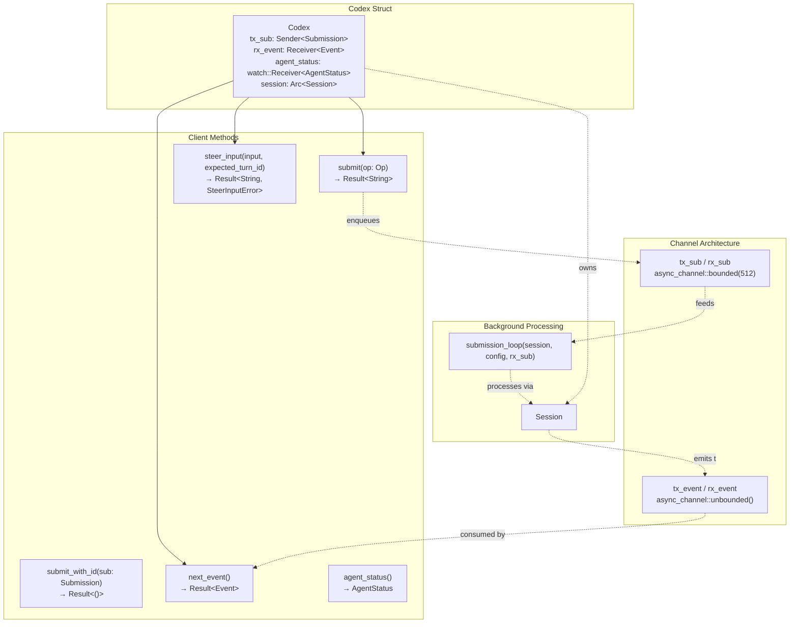
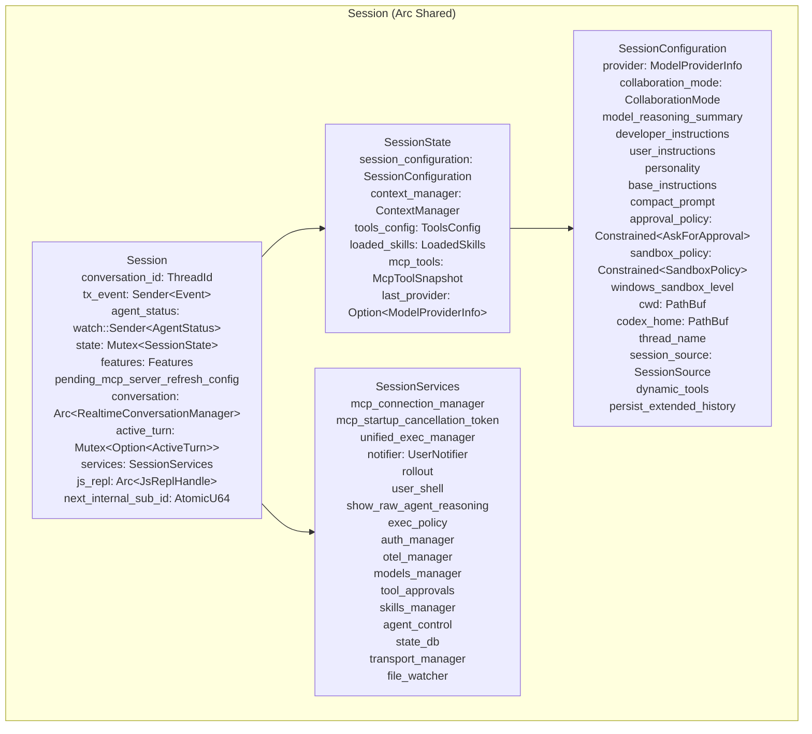
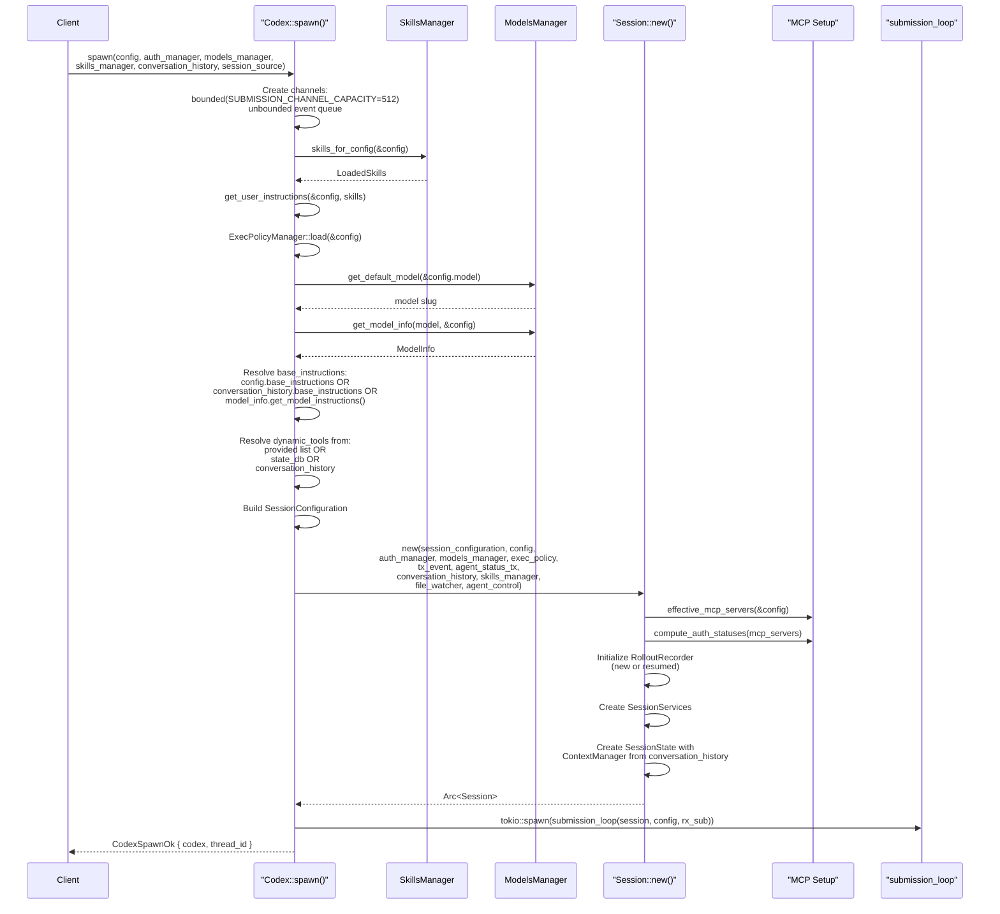
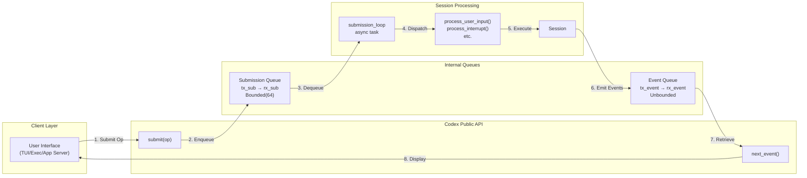
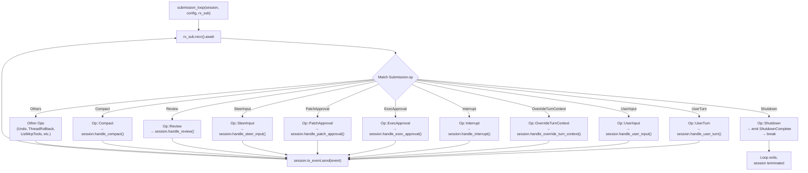
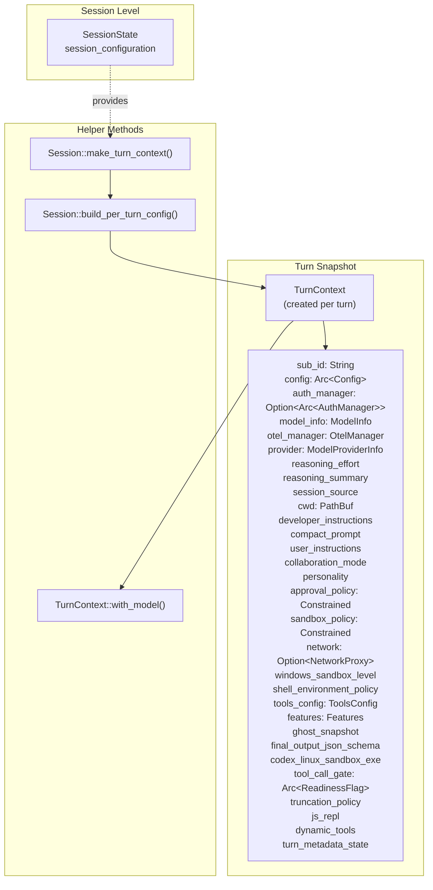
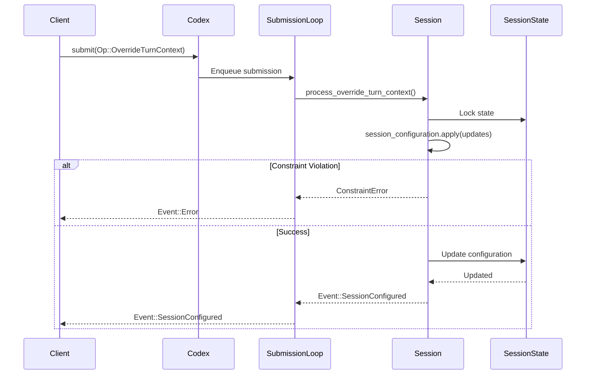
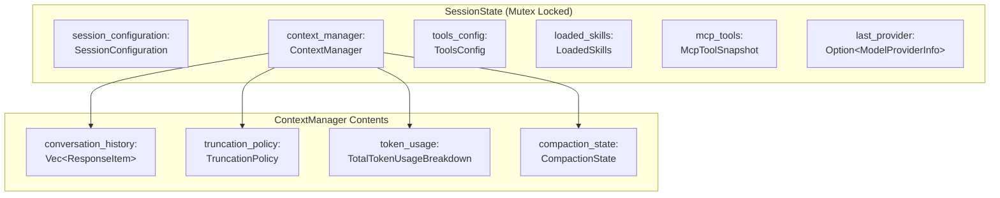
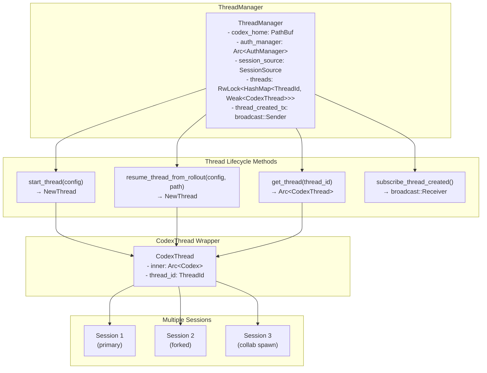

# Codex Interface and Session Lifecycle

<details>
<summary>Relevant source files</summary>

The following files were used as context for generating this wiki page:

- [codex-rs/codex-api/src/error.rs](codex-rs/codex-api/src/error.rs)
- [codex-rs/codex-api/src/rate_limits.rs](codex-rs/codex-api/src/rate_limits.rs)
- [codex-rs/core/src/api_bridge.rs](codex-rs/core/src/api_bridge.rs)
- [codex-rs/core/src/client.rs](codex-rs/core/src/client.rs)
- [codex-rs/core/src/client_common.rs](codex-rs/core/src/client_common.rs)
- [codex-rs/core/src/codex.rs](codex-rs/core/src/codex.rs)
- [codex-rs/core/src/error.rs](codex-rs/core/src/error.rs)
- [codex-rs/core/src/rollout/policy.rs](codex-rs/core/src/rollout/policy.rs)
- [codex-rs/exec/src/event_processor.rs](codex-rs/exec/src/event_processor.rs)
- [codex-rs/exec/src/event_processor_with_human_output.rs](codex-rs/exec/src/event_processor_with_human_output.rs)
- [codex-rs/mcp-server/src/codex_tool_runner.rs](codex-rs/mcp-server/src/codex_tool_runner.rs)
- [codex-rs/protocol/src/protocol.rs](codex-rs/protocol/src/protocol.rs)

</details>

This document describes the core interface for interacting with the Codex agent system and the complete lifecycle of a session from initialization through execution to shutdown. The `Codex` struct provides the public API for all user interfaces, while the `Session` manages the agent's execution context, state, and services.

For details on how specific user interfaces (TUI, exec, app-server) utilize this API, see [User Interfaces](#4). For information on the internal Op/Event protocol types, see [Protocol Layer (Op/Event System)](#2.1). For configuration layering and constraints applied during session initialization, see [Configuration System](#2.2).

## Core Components

### The Codex Public API

The `Codex` struct serves as the high-level interface to the Codex system, implementing a queue-pair pattern where clients submit operations and receive events asynchronously.

### Codex Public API Structure



**Key Responsibilities:**

- **Operation Submission**: `submit()` generates a UUIDv7 ID and enqueues `Submission` to `tx_sub` (capacity 512)
- **Event Consumption**: `next_event()` retrieves processed events from `rx_event`, blocking until available
- **Status Tracking**: `agent_status` is a `watch::Receiver<AgentStatus>` updated by the session loop
- **Steer Input**: `steer_input()` allows submitting input while a turn is in progress (used by TUI for steering)
- **Session Lifecycle**: Owns `Arc<Session>` which persists for the conversation thread

Sources: [codex-rs/core/src/codex.rs:274-280](), [codex-rs/core/src/codex.rs:470-520](), [codex-rs/core/src/codex.rs:293]()

### Session Architecture

The `Session` struct represents the core agent context, managing all state, services, and execution resources required for a single conversation thread.

### Session Structure



The `Session` coordinates all agent activities:

- **Conversation ID**: Unique `ThreadId` generated at spawn, used for rollout file naming and thread management
- **Event Channels**: `tx_event` emits events to clients; `agent_status` broadcasts status changes (Ready, Working, etc.)
- **Mutable State**: `Mutex<SessionState>` protects conversation history via `ContextManager`, tool configs, and loaded skills
- **Session Configuration**: Snapshot of settings including model, policies, working directory, captured at session creation
- **Session Services**: Shared infrastructure for MCP, process management, authentication, rollout persistence, and telemetry
- **Active Turn**: `Mutex<Option<ActiveTurn>>` tracks the currently executing turn for interruption and steering
- **Features**: Immutable `Features` set determines which tools and capabilities are enabled

Sources: [codex-rs/core/src/codex.rs:525-539](), [codex-rs/core/src/codex.rs:708-800](), [codex-rs/core/src/state.rs:1-100]()

## Session Initialization Flow

### Spawn Process

The `Codex::spawn()` method orchestrates the complete initialization sequence, creating channels, loading configuration, initializing services, and launching the background submission loop.

### Spawn Process

The `Codex::spawn()` method orchestrates session initialization:



**Initialization Stages:**

1. **Channel Creation**: `async_channel::bounded(512)` for submissions, `unbounded()` for events
2. **Skills Loading**: `skills_manager.skills_for_config()` loads enabled skills for the working directory
3. **User Instructions**: `get_user_instructions()` aggregates instructions from AGENTS.md and skill injections
4. **Exec Policy**: `ExecPolicyManager::load()` parses rules from config layers for auto-approval
5. **Model Resolution**: `models_manager.get_default_model()` and `get_model_info()` retrieve model metadata
6. **Base Instructions**: Priority: `config.base_instructions` → `conversation_history` → `model_info.get_model_instructions(config.personality)`
7. **Dynamic Tools**: Restored from provided list, state_db, or conversation_history metadata
8. **SessionConfiguration**: Immutable snapshot built with all resolved parameters
9. **Session Construction**: `Session::new()` initializes services (MCP, rollout, exec manager), loads history into `ContextManager`
10. **Submission Loop**: Spawned as `tokio::spawn(submission_loop)` to process operations asynchronously

Sources: [codex-rs/core/src/codex.rs:300-467](), [codex-rs/core/src/codex.rs:814-933]()

### SessionConfiguration Construction

The `SessionConfiguration` struct captures all immutable session parameters resolved at initialization time.

### SessionConfiguration Fields

| Field                        | Type                          | Source / Description                                                  |
| ---------------------------- | ----------------------------- | --------------------------------------------------------------------- |
| `provider`                   | `ModelProviderInfo`           | Resolved from `config.model_provider` (e.g., "openai", "openrouter")  |
| `collaboration_mode`         | `CollaborationMode`           | Contains `ModeKind::Default` with model + reasoning_effort + settings |
| `model_reasoning_summary`    | `ReasoningSummaryConfig`      | From `config.model_reasoning_summary` (controls summary generation)   |
| `developer_instructions`     | `Option<String>`              | From `config.developer_instructions` (supplements base instructions)  |
| `user_instructions`          | `Option<String>`              | Aggregated from AGENTS.md and skills via `get_user_instructions()`    |
| `personality`                | `Option<Personality>`         | From `config.personality` (e.g., Concise, Verbose)                    |
| `base_instructions`          | `String`                      | Priority: config override → conversation_history → model default      |
| `compact_prompt`             | `Option<String>`              | Custom summarization prompt (overrides default)                       |
| `approval_policy`            | `Constrained<AskForApproval>` | From config, enforces admin requirements (MDM/cloud policies)         |
| `sandbox_policy`             | `Constrained<SandboxPolicy>`  | From config, enforces admin requirements on execution policies        |
| `windows_sandbox_level`      | `WindowsSandboxLevel`         | Derived via `WindowsSandboxLevel::from_config(&config)`               |
| `cwd`                        | `PathBuf`                     | Absolute working directory (all relative paths resolved against this) |
| `codex_home`                 | `PathBuf`                     | Directory for rollout files, state DB, and Codex metadata             |
| `thread_name`                | `Option<String>`              | User-facing thread name (can be updated via `Op::SetThreadName`)      |
| `original_config_do_not_use` | `Arc<Config>`                 | Full config snapshot (used for per-turn config rebuilding)            |
| `session_source`             | `SessionSource`               | Origin: `Tui`, `VsCode`, `Exec`, `Mcp`, `SubAgent`, etc.              |
| `dynamic_tools`              | `Vec<DynamicToolSpec>`        | Tools explicitly registered at session start (persisted/restored)     |
| `persist_extended_history`   | `bool`                        | Whether to use extended rollout mode (includes all events)            |

The `Constrained<T>` wrapper validates `.set()` operations against requirements, preventing users from bypassing enterprise-imposed restrictions.

Sources: [codex-rs/core/src/codex.rs:708-800](), [codex-rs/core/src/codex.rs:401-420]()

## The Op/Event Communication Pattern

### Queue-Based Architecture

Codex uses a submission queue / event queue pattern to decouple client operations from agent execution, enabling asynchronous, non-blocking interaction.



**Operation Types (`Op`):**

- `UserTurn`: Submit user input with full turn context (cwd, approval policy, sandbox policy, model)
- `UserInput`: Legacy user input (uses session-level defaults)
- `OverrideTurnContext`: Update session-level defaults without enqueueing input
- `Interrupt`: Abort the currently executing turn
- `ExecApproval` / `PatchApproval`: Respond to approval requests
- `ResolveElicitation`: Respond to MCP OAuth prompts
- `UserInputAnswer`: Respond to `request_user_input` tool calls
- `DynamicToolResponse`: Respond to dynamic tool execution requests
- `Compact`: Trigger conversation summarization
- `Review`: Start a code review sub-agent
- `ThreadRollback`: Remove recent turns from history
- `Shutdown`: Terminate the session

**Event Types (`EventMsg`):**

- `SessionConfigured`: Initial session metadata (model, policies, session_id)
- `TurnStarted` / `TurnComplete`: Turn lifecycle boundaries
- `AgentMessage` / `AgentMessageDelta`: Model-generated text
- `AgentReasoning` / `AgentReasoningDelta`: Reasoning traces (when enabled)
- `ExecCommandBegin` / `ExecCommandEnd`: Shell execution lifecycle
- `PatchApplyBegin` / `PatchApplyEnd`: File modification lifecycle
- `ExecApprovalRequest` / `ApplyPatchApprovalRequest`: Approval prompts
- `TokenCount`: Token usage statistics
- `Error` / `Warning`: Error conditions and warnings
- `McpStartupUpdate` / `McpStartupComplete`: MCP server initialization
- `TurnAborted`: Turn interruption

Sources: [codex-rs/protocol/src/protocol.rs:68-309](), [codex-rs/core/src/codex.rs:418-460]()

### The Submission Loop

### Submission Loop

The `submission_loop` function is spawned as an async task and processes operations sequentially:



**Key Behaviors:**

- **Sequential Processing**: Operations dequeued from `rx_sub` are processed FIFO
- **Turn Isolation**: `handle_user_turn()` spawns a `RegularTask`, waits for `TurnComplete` before processing next `UserTurn`
- **Interruptibility**: `Op::Interrupt` sets the active turn's cancellation token, aborting at tool boundaries
- **Approval Routing**: `ExecApproval`/`PatchApproval` forward decisions to the active turn via `approval_tx` channels
- **Steer Input**: `Op::SteerInput` queues additional input to the active turn (TUI steering feature)
- **Graceful Shutdown**: `Op::Shutdown` emits `ShutdownComplete` event and exits the loop

The loop runs until `Op::Shutdown` or the `rx_sub` channel closes.

Sources: [codex-rs/core/src/codex.rs:1137-1404](), [codex-rs/core/src/codex.rs:1200-1247]()

## Session Configuration and Turn Context

### Per-Turn Configuration Snapshots

For each turn, the `Session` creates a `TurnContext` that captures a point-in-time snapshot of configuration parameters, ensuring consistent settings throughout the turn even if the session configuration is updated mid-execution.

### Per-Turn Configuration Snapshots

Each turn captures a `TurnContext` that freezes configuration at turn start:



**TurnContext Construction:**

`Session::make_turn_context()` builds each `TurnContext`:

1. **Per-Turn Config**: `build_per_turn_config()` clones the session config and applies turn-specific overrides (reasoning_effort, reasoning_summary, personality, web_search_mode)
2. **Model Info**: `models_manager.get_model_info()` fetches metadata for the effective model
3. **Tools Config**: `ToolsConfig::new()` computes available tools based on model capabilities and features
4. **Network Proxy**: Optional `NetworkProxy` from session services (for sandboxed MCP connections)
5. **Tool Call Gate**: `ReadinessFlag` used to pause tool execution until model streaming stabilizes
6. **Truncation Policy**: Derived from model info for context window management

**with_model() Method:**

`TurnContext::with_model()` creates a new context for a different model (used for model rerouting):

- Reconstructs `Config` with updated model slug
- Fetches new `ModelInfo` and adjusts reasoning effort to match supported levels
- Rebuilds `ToolsConfig` with the new model's capabilities
- Preserves other settings (approval policy, cwd, instructions)

This snapshot approach ensures:

- **Turn Consistency**: Tool calls see stable policies even if session config is updated mid-turn
- **Concurrent Overrides**: `Op::OverrideTurnContext` updates session defaults without affecting the active turn
- **Model Switching**: `with_model()` enables mid-turn rerouting to a different model

Sources: [codex-rs/core/src/codex.rs:542-705](), [codex-rs/core/src/codex.rs:870-896](), [codex-rs/core/src/codex.rs:586-660]()

### Configuration Update Flow

The session configuration can be updated dynamically via `Op::OverrideTurnContext` or implicitly through certain operations.



Constrained fields (`approval_policy`, `sandbox_policy`) are validated against administrative requirements before applying updates. If a constraint is violated (e.g., user attempts to set `Never` approval when requirements mandate `Ask`), the update is rejected with an error event.

Sources: [codex-rs/core/src/codex.rs:1304-1345]()

## Session Services

The `SessionServices` struct aggregates all infrastructure components required for agent execution, providing centralized access to shared resources.

### SessionServices

The `SessionServices` struct aggregates shared infrastructure:

| Service                          | Type                                | Purpose                                                                |
| -------------------------------- | ----------------------------------- | ---------------------------------------------------------------------- |
| `mcp_connection_manager`         | `Arc<RwLock<McpConnectionManager>>` | Manages MCP server connections and tool aggregation                    |
| `mcp_startup_cancellation_token` | `Mutex<CancellationToken>`          | Aborts MCP initialization on session shutdown                          |
| `unified_exec_manager`           | `UnifiedExecProcessManager`         | PTY session pool for `exec_command` / `write_stdin`                    |
| `notifier`                       | `UserNotifier`                      | Desktop notification backend (platform-specific)                       |
| `rollout`                        | `Mutex<Option<RolloutRecorder>>`    | Persists to `rollout.jsonl` or state DB                                |
| `user_shell`                     | `Arc<Shell>`                        | Default shell (bash, zsh, powershell, detected at spawn)               |
| `show_raw_agent_reasoning`       | `bool`                              | Whether to emit `AgentReasoningRawContent` events                      |
| `exec_policy`                    | `ExecPolicyManager`                 | Rule engine for auto-approval (based on exec_rules.toml)               |
| `auth_manager`                   | `Arc<AuthManager>`                  | OAuth token storage and refresh                                        |
| `otel_manager`                   | `OtelManager`                       | OpenTelemetry context (telemetry disabled by default)                  |
| `models_manager`                 | `Arc<ModelsManager>`                | Model metadata cache (capabilities, context windows, reasoning levels) |
| `tool_approvals`                 | `Mutex<ApprovalStore>`              | In-session approval memory (e.g., "always allow this command")         |
| `skills_manager`                 | `Arc<SkillsManager>`                | Skill discovery, loading, and injection coordination                   |
| `agent_control`                  | `AgentControl`                      | Sub-agent spawning for collaboration and review                        |
| `state_db`                       | `Option<state_db::StateDbHandle>`   | Optional SQLite handle (enabled via `Feature::Sqlite`)                 |
| `transport_manager`              | `TransportManager`                  | WebSocket connection pool with HTTP/SSE fallback                       |
| `file_watcher`                   | `Arc<FileWatcher>`                  | File system watcher for config/skill reload notifications              |

**Shared Lifecycle:**

These services are created once during `Session::new()` and shared across all turns:

- **MCP Connections**: Initialized at session start, reused for all `call_tool` invocations
- **Unified Exec**: Process IDs are session-scoped, allowing long-lived shells and `write_stdin` interactions
- **Approval Store**: User decisions persist within the session (cleared on `Op::Shutdown`)
- **Transport Manager**: WebSocket connections are reused for model streaming (sticky routing via `x-codex-turn-state`)

Sources: [codex-rs/core/src/state.rs:103-178](), [codex-rs/core/src/codex.rs:933-1035]()

## State Management

### SessionState Structure

The `SessionState` holds all mutable, turn-scoped data that evolves throughout the conversation.

### SessionState

The `SessionState` holds mutable conversation state:



**Key Fields:**

- **`session_configuration`**: Immutable snapshot of session settings (can be updated via `apply()` with constraint checking)
- **`context_manager`**: Manages `conversation_history` (Vec<ResponseItem>), token tracking, and compaction state
- **`tools_config`**: Current `ToolsConfig` derived from model capabilities + features + MCP servers
- **`loaded_skills`**: Skills loaded for the current working directory (updated on cwd change or `/skills` refresh)
- **`mcp_tools`**: Cached snapshot of MCP server tools (updated when servers are refreshed)
- **`last_provider`**: Tracks the previous turn's provider to detect switches that require MCP reinitialization

**ContextManager Responsibilities:**

- **History Management**: Appends `ResponseItem` entries (user messages, assistant messages, tool calls, tool outputs)
- **Token Tracking**: Maintains cumulative token usage and per-model breakdowns
- **Compaction**: Triggers automatic summarization when approaching context limits
- **Truncation**: Applies `TruncationPolicy` to fit history within model context windows

The `SessionState` is protected by `Mutex` and locked for brief periods during state updates.

Sources: [codex-rs/core/src/state.rs:181-247](), [codex-rs/core/src/context_manager.rs:1-100]()

### Active Turn Tracking

The `active_turn` field in `Session` tracks the currently executing turn, enabling interruption and status queries.

### Active Turn Tracking

The `active_turn` field enables interruption and steering:

```mermaid
stateDiagram-v2
    [*] --> Idle: Session created

    Idle --> TurnActive: Op::UserTurn processed

    state TurnActive {
        [*] --> BuildingTurnContext: create TurnContext
        BuildingTurnContext --> SpawningTask: spawn SessionTask
        SpawningTask --> StreamingModel: RegularTask::run()
        StreamingModel --> ExecutingTools: Model emits tool_calls
        ExecutingTools --> StreamingModel: Tool results appended
        ExecutingTools --> AwaitingApproval: ExecApprovalRequired
        AwaitingApproval --> ExecutingTools: Op::ExecApproval received
        StreamingModel --> SteeringInput: Op::SteerInput received
        SteeringInput --> StreamingModel: Input queued to model
        StreamingModel --> Complete: Model emits done
    }

    TurnActive --> Idle: TurnComplete event emitted

    TurnActive --> Interrupted: Op::Interrupt
    Interrupted --> Idle: TurnAborted event emitted
```

**ActiveTurn Contents:**

- **turn_id**: Submission ID for the user turn (used for correlation)
- **cancellation_token**: `CancellationToken` that aborts streaming and tool execution
- **tool_call_runtime**: `ToolCallRuntime` for parallel tool execution
- **approval_channels**: Pair of `(oneshot::Sender, oneshot::Receiver)` for approval prompts
- **steer_tx**: Channel for queuing additional input while turn is in progress

**Interruption Flow:**

When `Op::Interrupt` is received:

1. `submission_loop` calls `session.handle_interrupt()`
2. `handle_interrupt()` locks `active_turn`, extracts the cancellation token
3. Cancellation propagates to:
   - `ModelClientSession::stream()` → aborts HTTP/WebSocket request
   - `ToolCallRuntime` → cancels pending tool invocations
   - `UnifiedExecProcessManager` → terminates running processes
4. Turn task exits, emits `Event::TurnAborted`

Sources: [codex-rs/core/src/codex.rs:535](), [codex-rs/core/src/agent.rs:1-100](), [codex-rs/core/src/codex.rs:1200-1247]()

## Multiple Session Management via ThreadManager

While `Codex` manages a single session, the `ThreadManager` orchestrates multiple sessions, enabling fork, resume, and collaboration scenarios.



**ThreadManager Responsibilities:**

1. **Session Registry**: Maintains a weak reference map of `ThreadId → CodexThread`, allowing sessions to be garbage-collected when no longer referenced.
2. **Thread Creation**: Provides `start_thread()` and `resume_thread_from_rollout()` to spawn new sessions with appropriate configuration.
3. **Thread Lookup**: `get_thread()` retrieves an existing session by ID, returning an error if the thread has been dropped.
4. **Event Broadcasting**: Publishes thread creation events via `subscribe_thread_created()`, enabling clients (like codex-exec) to attach listeners to dynamically spawned threads.

**NewThread Result:**

All thread creation methods return a `NewThread` struct containing:

- `thread_id`: The unique `ThreadId` for the session
- `thread`: `Arc<CodexThread>` handle for submitting operations and retrieving events
- `session_configured`: Initial `SessionConfiguredEvent` with session metadata

This allows clients to immediately process the session configuration event without waiting for the async event queue.

Sources: [codex-rs/core/src/thread_manager.rs](), [codex-rs/core/src/codex_thread.rs]()

### Session Resumption

When resuming a session from a rollout file, the `ThreadManager` reconstructs the conversation history by:

1. **Loading Rollout**: Parse `rollout.jsonl` to extract persisted items
2. **Filtering Items**: Keep only items where `is_persisted_response_item()` returns true (messages, tool calls, reasoning)
3. **Building History**: Construct `InitialHistory::Resumed` with the parsed items
4. **Metadata Extraction**: Recover `SessionMeta` to restore base instructions and dynamic tools
5. **Configuration Merge**: Merge resumed metadata with current configuration (potentially different model/policies)
6. **State Reconstruction**: `Session::new()` initializes `SessionState.message_buffer` with the resumed history

The resumed session continues from the last turn, allowing users to add new input that builds on the existing conversation context.

Sources: [codex-rs/core/src/thread_manager.rs](), [codex-rs/core/src/rollout/mod.rs](), [codex-rs/core/src/rollout/policy.rs]()

## Entry Points by Interface

Different user interfaces invoke `Codex::spawn()` through various entry points:

| Interface  | Entry Point                               | Location                                                | Session Source                                           |
| ---------- | ----------------------------------------- | ------------------------------------------------------- | -------------------------------------------------------- |
| TUI        | `codex_tui::run_main()`                   | [codex-rs/tui/src/lib.rs:127-403]()                     | `SessionSource::Tui`                                     |
| Exec       | `codex_exec::run_main()`                  | [codex-rs/exec/src/lib.rs:91-710]()                     | `SessionSource::Exec`                                    |
| App Server | `MessageProcessor::handle_thread_start()` | [codex-rs/app-server/src/message_processor.rs]()        | `SessionSource::VsCode` / `SessionSource::Cursor` / etc. |
| MCP Server | `run_codex_tool_session()`                | [codex-rs/mcp-server/src/codex_tool_runner.rs:65-153]() | `SessionSource::Mcp`                                     |

Each interface:

1. Constructs a `Config` with appropriate overrides
2. Resolves `InitialHistory` (new, resumed, or forked)
3. Calls `ThreadManager::start_thread()` or `resume_thread_from_rollout()`
4. Enters an event loop calling `thread.next_event()` and processing events
5. Submits operations via `thread.submit()` in response to user actions

The `SessionSource` is used for telemetry, debugging, and applying interface-specific behavior (e.g., TUI uses interactive approval, Exec defaults to auto-approval).

Sources: [codex-rs/tui/src/lib.rs](), [codex-rs/exec/src/lib.rs](), [codex-rs/mcp-server/src/codex_tool_runner.rs]()
