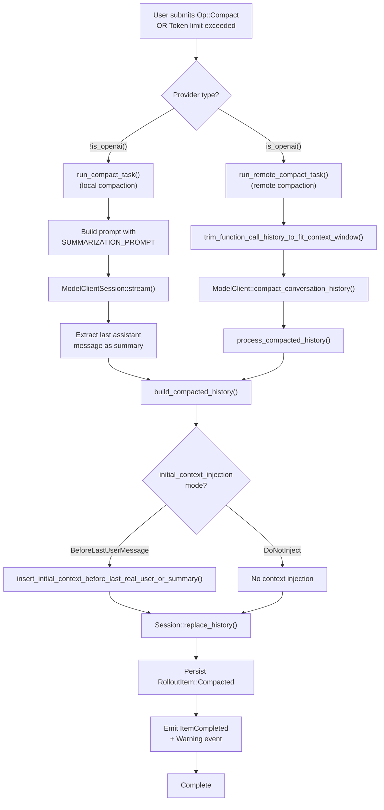
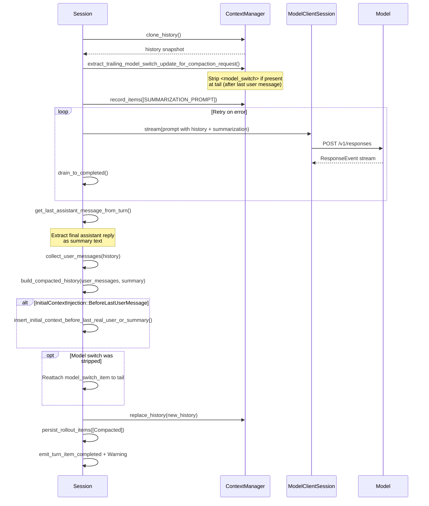
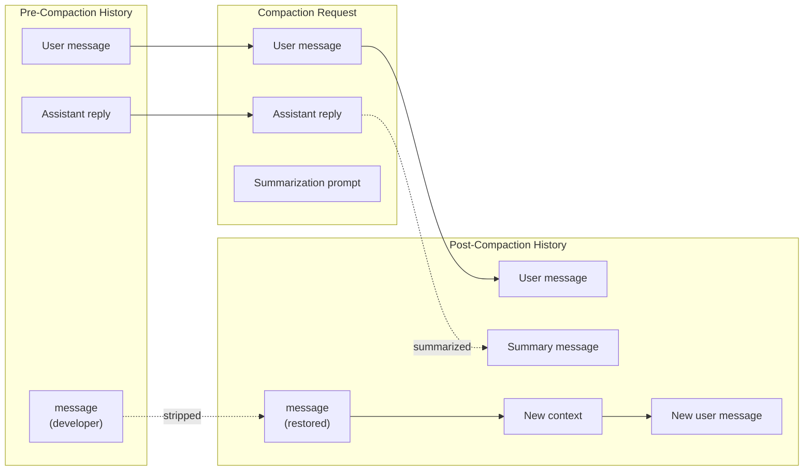

# History Compaction System

<details>
<summary>Relevant source files</summary>

The following files were used as context for generating this wiki page:

- [codex-rs/core/src/compact.rs](codex-rs/core/src/compact.rs)
- [codex-rs/core/src/compact_remote.rs](codex-rs/core/src/compact_remote.rs)
- [codex-rs/core/src/context_manager/history.rs](codex-rs/core/src/context_manager/history.rs)
- [codex-rs/core/src/context_manager/history_tests.rs](codex-rs/core/src/context_manager/history_tests.rs)
- [codex-rs/core/src/context_manager/mod.rs](codex-rs/core/src/context_manager/mod.rs)
- [codex-rs/core/src/context_manager/normalize.rs](codex-rs/core/src/context_manager/normalize.rs)
- [codex-rs/core/src/state/session.rs](codex-rs/core/src/state/session.rs)
- [codex-rs/core/src/state/turn.rs](codex-rs/core/src/state/turn.rs)
- [codex-rs/core/src/tasks/compact.rs](codex-rs/core/src/tasks/compact.rs)
- [codex-rs/core/src/tasks/mod.rs](codex-rs/core/src/tasks/mod.rs)
- [codex-rs/core/src/tasks/review.rs](codex-rs/core/src/tasks/review.rs)
- [codex-rs/core/src/truncate.rs](codex-rs/core/src/truncate.rs)
- [codex-rs/core/tests/suite/codex_delegate.rs](codex-rs/core/tests/suite/codex_delegate.rs)
- [codex-rs/core/tests/suite/compact.rs](codex-rs/core/tests/suite/compact.rs)
- [codex-rs/core/tests/suite/compact_remote.rs](codex-rs/core/tests/suite/compact_remote.rs)
- [codex-rs/core/tests/suite/compact_resume_fork.rs](codex-rs/core/tests/suite/compact_resume_fork.rs)
- [codex-rs/core/tests/suite/review.rs](codex-rs/core/tests/suite/review.rs)
- [codex-rs/tui/src/chatwidget/snapshots/codex_tui**chatwidget**tests\_\_image_generation_call_history_snapshot.snap](codex-rs/tui/src/chatwidget/snapshots/codex_tui__chatwidget__tests__image_generation_call_history_snapshot.snap)

</details>

## Purpose and Scope

The History Compaction System manages conversation history size by replacing older messages with summaries when context limits are approached. This system supports both manual user-triggered compaction (`Op::Compact`) and automatic compaction when token usage exceeds configured thresholds. The system provides two implementations: local compaction using a summarization prompt, and remote compaction using OpenAI's specialized `/v1/responses/compact` endpoint. A third related task, `ReviewTask`, spawns an isolated sub-agent for code review and feeds structured output back into the parent session.

For general history management, see page 3.5. For how compacted history is persisted and reloaded, see page 3.5.2.

---

## Compaction Types

The system supports two distinct compaction implementations, selected based on the model provider.

### Local vs Remote Compaction

| Aspect             | Local Compaction                               | Remote Compaction                               |
| ------------------ | ---------------------------------------------- | ----------------------------------------------- |
| **Provider**       | Non-OpenAI providers                           | OpenAI providers                                |
| **Implementation** | `compact.rs::run_compact_task()`               | `compact_remote.rs::run_remote_compact_task()`  |
| **Mechanism**      | Injects `SUMMARIZATION_PROMPT` as user message | POST to `/v1/responses/compact` endpoint        |
| **Output**         | Assistant reply used as summary                | Server returns compacted `ResponseItem` list    |
| **Selection**      | `!should_use_remote_compact_task()`            | `should_use_remote_compact_task()` returns true |

**Sources:** [codex-rs/core/src/compact.rs:50-52](), [codex-rs/core/src/compact_remote.rs:27-48](), [codex-rs/core/src/tasks/compact.rs:28-42]()

---

## Compaction Decision Flow



**Sources:** [codex-rs/core/src/tasks/compact.rs:15-45](), [codex-rs/core/src/compact.rs:91-279](), [codex-rs/core/src/compact_remote.rs:50-166]()

---

## Trigger Conditions

### Manual Compaction

Manual compaction is triggered by `Op::Compact` submission, typically from a user command like `/compact`.

**Flow:**

1. `ThreadManager` receives `Op::Compact`
2. Spawns `CompactTask` with empty input (no user message needed)
3. Emits `TurnStarted` event with turn-specific `turn_id`
4. Runs compaction inner logic
5. Emits warning: "Heads up: Long threads and multiple compactions can cause the model to be less accurate..."

**Sources:** [codex-rs/core/src/compact.rs:107-125](), [codex-rs/core/tests/suite/compact.rs:200-405]()

### Automatic Compaction (Mid-Turn)

Automatic compaction occurs when a model response reports token usage exceeding `model_auto_compact_token_limit`.

**Trigger location:** `regular_task.rs::auto_compact_if_needed()`

**Differences from manual:**

- Uses `InitialContextInjection::BeforeLastUserMessage` mode
- No `TurnStarted` event (compaction runs within existing turn)
- Compaction summary must remain last in history for model training

**Sources:** [codex-rs/core/tests/suite/compact.rs:631-752](), [codex-rs/core/src/compact.rs:91-105]()

---

## Local Compaction Process

### Summarization Prompt

The local compaction system uses a predefined prompt template to request summarization:

```
SUMMARIZATION_PROMPT = include_str!("../templates/compact/prompt.md")
SUMMARY_PREFIX = include_str!("../templates/compact/summary_prefix.md")
```

**Custom prompt support:** Configuration allows overriding via `config.compact_prompt`.

**Sources:** [codex-rs/core/src/compact.rs:31-32](), [codex-rs/core/tests/suite/compact.rs:408-496]()

### Execution Flow



**Sources:** [codex-rs/core/src/compact.rs:127-279](), [codex-rs/core/src/compact.rs:439-484]()

---

## Remote Compaction Process

Remote compaction delegates summarization to OpenAI's specialized endpoint, which returns a compacted history directly.

### Endpoint and Authentication

**Endpoint:** `POST /v1/responses/compact`

**Headers:**

- `authorization: Bearer <access_token>`
- `chatgpt-account-id: <account_id>` (from ChatGPT auth)

**Request body:**

```json
{
  "model": "gpt-4-...",
  "input": [
    /* history items */
  ],
  "instructions": "base instructions text"
}
```

**Response:**

```json
{
  "output": [
    { "type": "compaction", "encrypted_content": "..." }
    /* optional user messages */
  ]
}
```

**Sources:** [codex-rs/core/tests/suite/compact_remote.rs:72-187](), [codex-rs/core/src/compact_remote.rs:102-131]()

### History Trimming

Before sending the compact request, remote compaction trims function call history to fit the model context window:

**Function:** `trim_function_call_history_to_fit_context_window()`

**Logic:**

1. Estimate token count of history + base instructions
2. If exceeds context window, remove last item if it's Codex-generated
3. Repeat until under limit or no more eligible items

**Eligible for removal:** `FunctionCallOutput`, `CustomToolCallOutput`, developer messages

**Sources:** [codex-rs/core/src/compact_remote.rs:268-295](), [codex-rs/core/tests/suite/compact_remote.rs:249-362]()

### Processing Remote Output

The server-returned history is processed to clean stale context:

**Function:** `process_compacted_history()`

**Filtering rules:**

- **Drop:** All `developer` role messages (stale permissions/personality)
- **Drop:** `user` messages that aren't real user content (session prefix wrappers)
- **Keep:** `assistant` messages, `Compaction` items, real `UserMessage` items

**Context reinjection:** Fresh canonical context is reinjected from current session state.

**Sources:** [codex-rs/core/src/compact_remote.rs:168-225]()

---

## History Replacement Strategy

### Building Compacted History

The `build_compacted_history()` function constructs the replacement history from:

1. Initial context (may be empty)
2. Selected user messages (up to 20,000 tokens)
3. Summary message with `SUMMARY_PREFIX`

**User message selection:**

- Iterate user messages in reverse (newest first)
- Include messages that fit within token budget
- Truncate last message if it exceeds remaining budget

**Token budget:** `COMPACT_USER_MESSAGE_MAX_TOKENS = 20_000`

**Sources:** [codex-rs/core/src/compact.rs:371-437](), [codex-rs/core/tests/suite/compact.rs:709-749]()

### Summary Message Format

Summaries are always formatted as user messages with a special prefix:

```
SUMMARY_PREFIX = include_str!("../templates/compact/summary_prefix.md")

Example:
{SUMMARY_PREFIX}
{summary_text}
```

**Detection:** `is_summary_message()` checks for `SUMMARY_PREFIX` at start

**Sources:** [codex-rs/core/src/compact.rs:316-318](), [codex-rs/core/src/compact.rs:232-234]()

---

## Context Reinjection Modes

The `InitialContextInjection` enum controls where fresh context is reinjected after compaction.

### InitialContextInjection Enum

```rust
pub(crate) enum InitialContextInjection {
    BeforeLastUserMessage,  // Mid-turn auto-compaction
    DoNotInject,            // Pre-turn manual compaction
}
```

| Mode                    | Use Case                                 | Behavior                                                          | Rationale                                      |
| ----------------------- | ---------------------------------------- | ----------------------------------------------------------------- | ---------------------------------------------- |
| `DoNotInject`           | Manual `/compact` or pre-turn compaction | Clears `reference_context_item`, next turn reinjects full context | Allows context to be refreshed on next request |
| `BeforeLastUserMessage` | Mid-turn auto-compaction                 | Injects context before last real user message or summary          | Model expects compaction item to remain last   |

**Sources:** [codex-rs/core/src/compact.rs:35-48](), [codex-rs/core/src/compact.rs:238-261]()

### Context Insertion Logic

**Function:** `insert_initial_context_before_last_real_user_or_summary()`

**Placement rules:**

1. **Preferred:** Immediately before last real user message (non-summary)
2. **Fallback:** Before last summary message if no real user messages
3. **Fallback:** Before last compaction item if no user messages
4. **Fallback:** Append to end if no qualifying items

**Why:** Model training expects certain item orderings, especially for mid-turn compaction where the compaction item must remain at the tail.

**Sources:** [codex-rs/core/src/compact.rs:320-369]()

---

## Model Switch Handling

When a model switch occurs between turns, the system injects a `<model_switch>` developer message. Compaction must handle this carefully to keep prompts in-distribution.

### Model Switch Stripping

**Function:** `extract_trailing_model_switch_update_for_compaction_request()`

**Logic:**

1. Find last user turn boundary
2. Check if any developer message after that boundary starts with `<model_switch>\
`
3. If found, remove from history before compaction
4. Store removed item for later reattachment

**Reattachment:** After successful compaction, the model switch item is appended to the tail so the next regular sampling request includes it.

**Sources:** [codex-rs/core/src/compact.rs:66-89](), [codex-rs/core/tests/suite/compact.rs:1196-1386]()

### Model Switch Compaction Flow



**Sources:** [codex-rs/core/src/compact.rs:140-142](), [codex-rs/core/src/compact.rs:247-251](), [codex-rs/core/tests/suite/snapshots/all**suite**compact\_\_pre_turn_compaction_strips_incoming_model_switch_shapes.snap]()

---

## Review Task

The `ReviewTask` struct ([codex-rs/core/src/tasks/review.rs:32-38]()) implements the `SessionTask` trait and is registered with `TaskKind::Review`. It is triggered by `Op::Review` submissions and runs code review by spawning an isolated sub-codex session, collecting structured output, then feeding findings back into the parent session history.

Sources: [codex-rs/core/src/tasks/review.rs:32-80]()

### Sub-Agent Configuration

`start_review_conversation()` ([codex-rs/core/src/tasks/review.rs:82-122]()) builds a restricted config for the sub-agent:

| Config Setting      | Value                                  | Reason                     |
| ------------------- | -------------------------------------- | -------------------------- |
| `base_instructions` | `REVIEW_PROMPT`                        | Specialized review rubric  |
| `web_search_mode`   | `Disabled`                             | Prevent external requests  |
| `Feature::Collab`   | Disabled                               | Review-only scope          |
| `approval_policy`   | `AskForApproval::Never`                | Fully autonomous sub-agent |
| `model`             | `config.review_model` or session model | Configurable reviewer      |

The sub-agent is launched via `run_codex_thread_one_shot()`. If that fails, `None` is returned immediately and the review exits with no output.

Sources: [codex-rs/core/src/tasks/review.rs:82-122]()

### Event Processing and Filtering

`process_review_events()` ([codex-rs/core/src/tasks/review.rs:124-172]()) drains the sub-agent's event channel and selectively forwards events to the parent session:

**Suppressed events** (not forwarded):

- `AgentMessageContentDelta` — streaming content deltas
- `AgentMessageDelta` — legacy streaming events
- `ItemCompleted` for `TurnItem::AgentMessage` — prevents triggering legacy `AgentMessage` via `as_legacy_events()`

**Special handling for `AgentMessage`:** Only the _last_ received `AgentMessage` is forwarded; earlier ones are held in `prev_agent_message` and replaced. This ensures only the final non-streaming message surfaces.

On `TurnComplete`, the `last_agent_message` field is parsed as a `ReviewOutputEvent`. On `TurnAborted`, the function returns `None`.

Sources: [codex-rs/core/src/tasks/review.rs:124-172]()

### Review Output Parsing

`parse_review_output_event()` ([codex-rs/core/src/tasks/review.rs:179-194]()) attempts to deserialize the reviewer's text in order:

1. Direct `serde_json::from_str::<ReviewOutputEvent>(text)` on the full string
2. Find the first `{` and last `}`, extract the substring, retry deserialization
3. If both fail, return `ReviewOutputEvent { overall_explanation: text, ..Default::default() }`

This ensures structured JSON output is preferred but plain-text fallbacks always produce a valid `ReviewOutputEvent`.

Sources: [codex-rs/core/src/tasks/review.rs:179-194]()

### Review Exit and Rollout Recording

`exit_review_mode()` ([codex-rs/core/src/tasks/review.rs:198-265]()) is called on both normal completion and `abort()`:

1. Formats user-facing review output (findings block + explanation) using `format_review_findings_block()`
2. Records a `user`-role message into parent session history (id `review_rollout_user`)
3. Emits `EventMsg::ExitedReviewMode(ExitedReviewModeEvent { review_output })`
4. Records an `assistant`-role message with the rendered text (id `review_rollout_assistant`)
5. Calls `ensure_rollout_materialized()` to flush persistence

The assistant message uses `render_review_output_text()` which produces plain text (without `<user_action>` XML markup) for rollout storage.

Sources: [codex-rs/core/src/tasks/review.rs:198-265]()

### ReviewTask Lifecycle Diagram

```mermaid
sequenceDiagram
    participant Parent["Parent Session"]
    participant ReviewTask["ReviewTask::run()"]
    participant SubAgent["run_codex_thread_one_shot()"]
    participant Reviewer["Reviewer Model"]

    Parent->>ReviewTask: "Op::Review { review_request }"
    ReviewTask->>SubAgent: "spawn with REVIEW_PROMPT + restricted config"
    SubAgent->>Reviewer: "POST /v1/responses"
    Reviewer-->>SubAgent: "SSE event stream"
    SubAgent-->>ReviewTask: "Event channel (rx_event)"
    ReviewTask->>ReviewTask: "process_review_events() — filter streaming, hold AgentMessages"
    SubAgent-->>ReviewTask: "TurnComplete { last_agent_message }"
    ReviewTask->>ReviewTask: "parse_review_output_event(text)"
    ReviewTask->>Parent: "exit_review_mode(review_output)"
    Parent->>Parent: "record user + assistant messages into history"
    Parent-->>Parent: "emit ExitedReviewMode event"
```

Sources: [codex-rs/core/src/tasks/review.rs:46-79](), [codex-rs/core/tests/suite/review.rs:38-176]()

---

## Persistence and Rollout

### CompactedItem Structure

Compacted history is persisted as a `RolloutItem::Compacted`:

```rust
pub struct CompactedItem {
    pub message: String,                      // Summary text (local) or empty (remote)
    pub replacement_history: Option<Vec<ResponseItem>>,  // Full replacement history
}
```

**Local compaction:** `message` contains `{SUMMARY_PREFIX}\
{summary}`, `replacement_history` contains full compacted history including user messages + summary.

**Remote compaction:** `message` is empty, `replacement_history` contains server-returned compacted items after processing.

**Sources:** [codex-rs/core/src/compact.rs:266-270](), [codex-rs/core/src/compact_remote.rs:156-161]()

### Rollout Persistence

**Function:** `Session::persist_rollout_items()`

**Format:** JSONL with one `RolloutLine` per line:

```json
{"timestamp": "...", "item": {"Compacted": {"message": "...", "replacement_history": [...]}}}
```

**Loading:** When resuming a thread, `RolloutItem::Compacted` entries restore the compacted history state.

**Sources:** [codex-rs/core/src/compact.rs:266-270](), [codex-rs/core/tests/suite/compact.rs:366-405]()

---

## Event Emission

### Compaction Events

During compaction, the system emits several event types:

| Event                              | When                   | Purpose                                           |
| ---------------------------------- | ---------------------- | ------------------------------------------------- |
| `TurnStarted`                      | Manual compaction only | Indicates new compaction turn with `turn_id`      |
| `ItemStarted(ContextCompaction)`   | Start of compaction    | UI can show "Compacting..." indicator             |
| `ItemCompleted(ContextCompaction)` | End of compaction      | UI can hide indicator                             |
| `ContextCompacted` (legacy)        | After compaction       | Backward compatibility event                      |
| `Warning`                          | After compaction       | User warning about accuracy degradation           |
| `TokenCount`                       | After compaction       | Updated token usage (local) or estimated (remote) |

**Warning message:**

```
"Heads up: Long threads and multiple compactions can cause the model to be
less accurate. Start a new thread when possible to keep threads small and
targeted."
```

**Sources:** [codex-rs/core/src/compact.rs:112-117](), [codex-rs/core/src/compact.rs:272-277](), [codex-rs/core/tests/suite/compact.rs:557-628]()

### Event Lifecycle Consistency

Compaction items use the same `turn_id` for `ItemStarted` and `ItemCompleted` events, matching the parent turn's lifecycle.

**Assertion from tests:**

```rust
assert_eq!(compact_started_id, Some(turn_started_id.clone()));
assert_eq!(compact_completed_id, Some(turn_started_id));
```

**Sources:** [codex-rs/core/tests/suite/compact.rs:142-182]()

---

## Token Usage Updates

### Local Compaction Token Tracking

Local compaction emits two `TokenCount` events:

1. **API usage:** From `response.completed` event with `usage.total_tokens` (may be 0)
2. **Estimated usage:** After compaction, from `recompute_token_usage()` using local estimator

**Why two events:** API may not report compaction token usage, so local estimation ensures UI shows meaningful context size.

**Sources:** [codex-rs/core/tests/suite/compact.rs:499-554](), [codex-rs/core/src/compact.rs:264]()

### Remote Compaction Token Tracking

Remote compaction does not receive token usage from the `/compact` endpoint, so only estimated tokens are reported via `recompute_token_usage()`.

**Sources:** [codex-rs/core/src/compact_remote.rs:154]()

---

## Error Handling and Retries

### Local Compaction Errors

**Retry logic:** Up to `stream_max_retries()` attempts with exponential backoff

**Context window exceeded handling:**

1. If prompt too large for model, remove oldest history item
2. Increment `truncated_count`
3. Reset retry counter and try again
4. If history reduced to 1 item and still fails, emit error

**Notification:** If truncation occurred, emit background event describing how many items were removed.

**Sources:** [codex-rs/core/src/compact.rs:148-229]()

### Remote Compaction Errors

**Failure logging:** On compact failure, logs detailed breakdown:

- `last_api_response_total_tokens`
- `all_history_items_model_visible_bytes`
- `estimated_tokens_of_items_added_since_last_successful_api_response`
- `failing_compaction_request_model_visible_bytes`

**Error emission:** Wraps error with "Error running remote compact task" context.

**Sources:** [codex-rs/core/src/compact_remote.rs:119-129](), [codex-rs/core/src/compact_remote.rs:249-266]()

---

## Testing and Validation

### Test Coverage

The compaction system has extensive test coverage across multiple scenarios:

| Test File                | Focus Area                                                           |
| ------------------------ | -------------------------------------------------------------------- |
| `compact.rs`             | Local compaction, manual/auto triggers, custom prompts, token events |
| `compact_remote.rs`      | Remote compaction, endpoint calls, history trimming                  |
| `compact_resume_fork.rs` | Compaction + resume/fork interactions, history preservation          |
| `history_tests.rs`       | ContextManager history operations, token estimation                  |

**Snapshot tests:** Several tests validate exact request/history shapes using insta snapshots, ensuring compaction behavior is deterministic.

**Sources:** [codex-rs/core/tests/suite/compact.rs:1-2196](), [codex-rs/core/tests/suite/compact_remote.rs:1-1013](), [codex-rs/core/tests/suite/compact_resume_fork.rs:1-612]()

### Key Test Scenarios

1. **Manual compaction with custom prompt:** Verifies `config.compact_prompt` overrides default
2. **Multiple auto-compactions per task:** Tests repeated auto-compaction when token limit hit multiple times
3. **Model switch with compaction:** Validates `<model_switch>` stripping and restoration
4. **Remote compaction history trimming:** Ensures function call history fits context window
5. **Compact + resume + fork:** Validates history preservation across thread lifecycle operations

**Sources:** [codex-rs/core/tests/suite/compact.rs:408-496](), [codex-rs/core/tests/suite/compact.rs:631-752](), [codex-rs/core/tests/suite/compact_remote.rs:249-362](), [codex-rs/core/tests/suite/compact_resume_fork.rs:139-292]()
