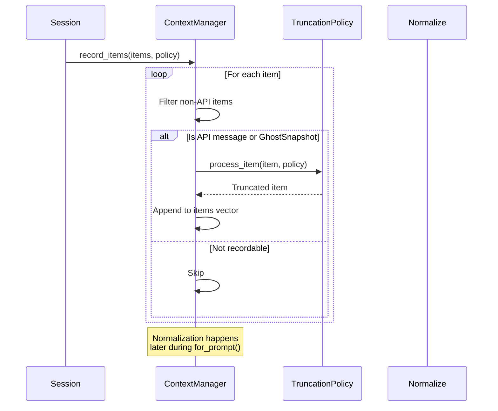
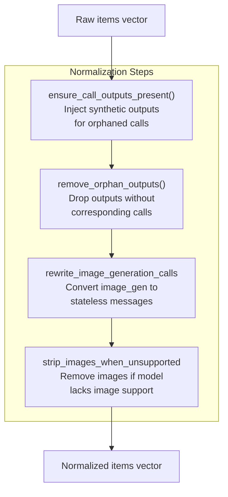
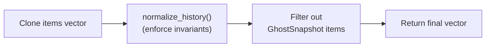
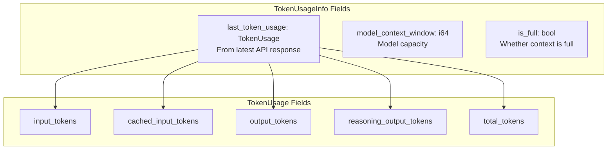
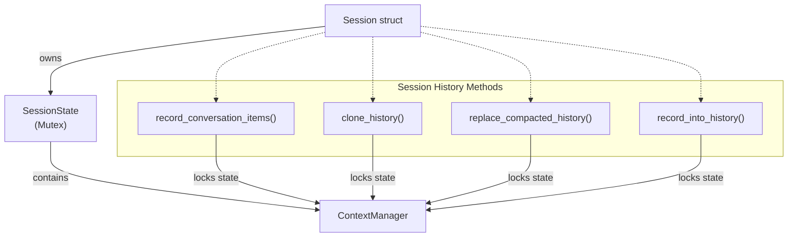
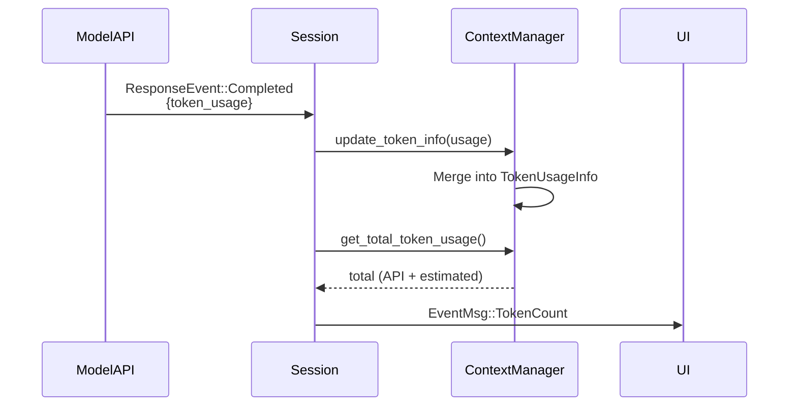
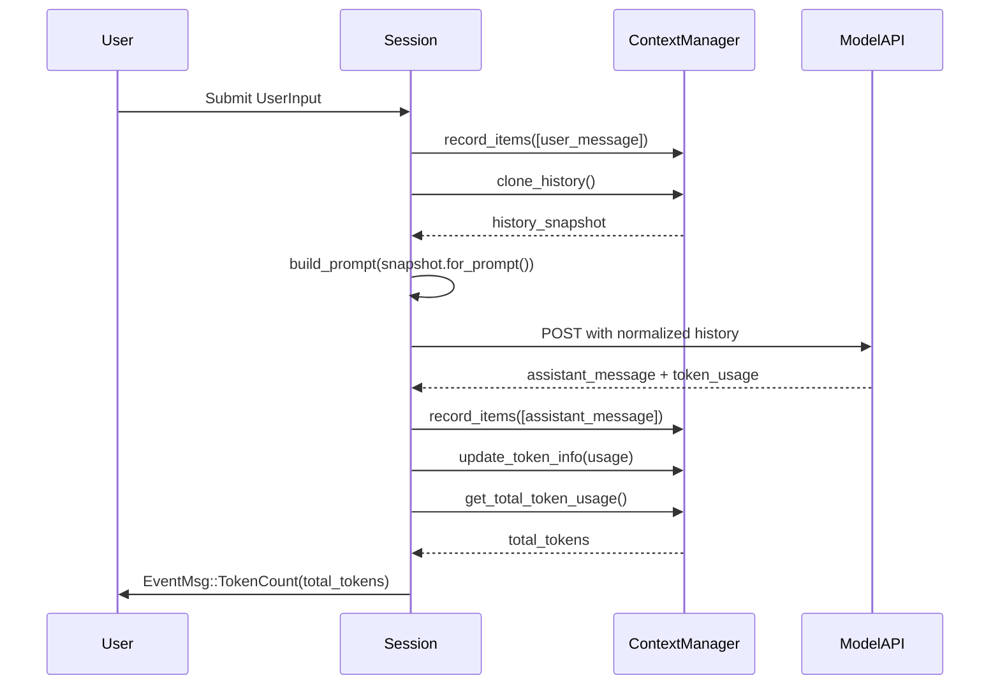

# Conversation History Management

<details>
<summary>Relevant source files</summary>

The following files were used as context for generating this wiki page:

- [codex-rs/core/src/compact.rs](codex-rs/core/src/compact.rs)
- [codex-rs/core/src/compact_remote.rs](codex-rs/core/src/compact_remote.rs)
- [codex-rs/core/src/context_manager/history.rs](codex-rs/core/src/context_manager/history.rs)
- [codex-rs/core/src/context_manager/history_tests.rs](codex-rs/core/src/context_manager/history_tests.rs)
- [codex-rs/core/src/context_manager/mod.rs](codex-rs/core/src/context_manager/mod.rs)
- [codex-rs/core/src/context_manager/normalize.rs](codex-rs/core/src/context_manager/normalize.rs)
- [codex-rs/core/src/state/session.rs](codex-rs/core/src/state/session.rs)
- [codex-rs/core/src/state/turn.rs](codex-rs/core/src/state/turn.rs)
- [codex-rs/core/src/tasks/compact.rs](codex-rs/core/src/tasks/compact.rs)
- [codex-rs/core/src/tasks/mod.rs](codex-rs/core/src/tasks/mod.rs)
- [codex-rs/core/src/tasks/review.rs](codex-rs/core/src/tasks/review.rs)
- [codex-rs/core/src/truncate.rs](codex-rs/core/src/truncate.rs)
- [codex-rs/core/tests/responses_headers.rs](codex-rs/core/tests/responses_headers.rs)
- [codex-rs/core/tests/suite/client.rs](codex-rs/core/tests/suite/client.rs)
- [codex-rs/core/tests/suite/codex_delegate.rs](codex-rs/core/tests/suite/codex_delegate.rs)
- [codex-rs/core/tests/suite/compact.rs](codex-rs/core/tests/suite/compact.rs)
- [codex-rs/core/tests/suite/compact_remote.rs](codex-rs/core/tests/suite/compact_remote.rs)
- [codex-rs/core/tests/suite/compact_resume_fork.rs](codex-rs/core/tests/suite/compact_resume_fork.rs)
- [codex-rs/core/tests/suite/prompt_caching.rs](codex-rs/core/tests/suite/prompt_caching.rs)
- [codex-rs/core/tests/suite/review.rs](codex-rs/core/tests/suite/review.rs)
- [codex-rs/tui/src/chatwidget/snapshots/codex_tui**chatwidget**tests\_\_image_generation_call_history_snapshot.snap](codex-rs/tui/src/chatwidget/snapshots/codex_tui__chatwidget__tests__image_generation_call_history_snapshot.snap)

</details>

This document describes how Codex maintains and manipulates the conversation history that forms the model's context window. It covers the `ContextManager` data structure, item recording and normalization, token estimation, and history lifecycle management.

For details on **summarizing and compacting** conversation history when context limits are approached, see [History Compaction System](#3.5.1). For information on **persisting history to disk** and replaying it during session resumption, see [Rollout Persistence and Replay](#3.5.2).

---

## Overview

The conversation history manager is responsible for:

- Storing `ResponseItem` entries (user messages, assistant messages, tool calls, tool outputs, reasoning items)
- Normalizing history to maintain invariants (e.g., every tool call has a corresponding output)
- Tracking token usage from API responses and estimating tokens for locally-added items
- Preparing history for prompt construction by filtering and transforming items
- Supporting history modification operations (removal, replacement, compaction)

The primary entry point is the `ContextManager` struct, which is owned by `SessionState` and manipulated by `Session` methods.

**Sources:** [codex-rs/core/src/context_manager/history.rs:29-44](), [codex-rs/core/src/state/session.rs:21-38]()

---

## ContextManager Structure

```mermaid
graph TB
    subgraph "ContextManager State"
        Items["items: Vec&lt;ResponseItem&gt;<br/>(oldest to newest)"]
        TokenInfo["token_info: Option&lt;TokenUsageInfo&gt;<br/>API-reported usage"]
        RefContext["reference_context_item:<br/>Option&lt;TurnContextItem&gt;<br/>Baseline for settings diffs"]
    end

    subgraph "Core Operations"
        Record["record_items()<br/>Add items with truncation"]
        Normalize["normalize_history()<br/>Ensure invariants"]
        ForPrompt["for_prompt()<br/>Prepare for API"]
        Estimate["estimate_token_count()<br/>Local estimation"]
    end

    subgraph "Modification Operations"
        RemoveFirst["remove_first_item()"]
        RemoveLast["remove_last_item()"]
        Replace["replace()"]
        DropTurns["drop_last_n_user_turns()"]
    end

    Items --> Record
    Items --> Normalize
    Items --> ForPrompt
    Items --> Estimate
    Items --> RemoveFirst
    Items --> RemoveLast
    Items --> Replace
    Items --> DropTurns

    TokenInfo --> Estimate
    RefContext -.-> "Used for<br/>settings diffing"
```

**ContextManager Fields**

| Field                    | Type                      | Purpose                                 |
| ------------------------ | ------------------------- | --------------------------------------- |
| `items`                  | `Vec<ResponseItem>`       | Ordered history from oldest to newest   |
| `token_info`             | `Option<TokenUsageInfo>`  | Last API-reported token usage           |
| `reference_context_item` | `Option<TurnContextItem>` | Baseline for detecting settings changes |

The `items` vector maintains chronological order. Items at index 0 are oldest; items at the end are most recent. This ordering is preserved across all operations.

**Sources:** [codex-rs/core/src/context_manager/history.rs:29-44](), [codex-rs/core/src/context_manager/history.rs:54-61]()

---

## Recording Items into History

Items flow into the history manager through the `record_items` method, which accepts any iterator of `ResponseItem` references and a `TruncationPolicy`:



### Item Filtering

Only items that contribute to model context are recorded:

- Messages with roles `"user"`, `"assistant"`, `"developer"`
- Function calls and outputs
- Custom tool calls and outputs
- Reasoning items
- Web search calls
- `GhostSnapshot` items (for undo support)

System messages and `ResponseItem::Other` are filtered out.

**Sources:** [codex-rs/core/src/context_manager/history.rs:88-104](), [codex-rs/core/src/context_manager/history.rs:381-417]()

### Truncation Policies

The `TruncationPolicy` enum controls how large content is truncated:

| Policy                        | Description                               |
| ----------------------------- | ----------------------------------------- |
| `TruncationPolicy::Bytes(n)`  | Limit content to `n` bytes                |
| `TruncationPolicy::Tokens(n)` | Limit content to approximately `n` tokens |

Tool outputs (`FunctionCallOutput`, `CustomToolCallOutput`) are truncated during recording to prevent excessive context usage. Messages are stored as-is but may be truncated during compaction.

**Sources:** [codex-rs/core/src/truncate.rs:12-16](), [codex-rs/core/src/context_manager/history.rs:354-390]()

---

## History Normalization

Before history is sent to the model API, `normalize_history` enforces several invariants:



### Invariant: Call/Output Pairing

Every `FunctionCall` must have a corresponding `FunctionCallOutput` with matching `call_id`. If a call is missing its output (e.g., due to interruption), a synthetic output with text `"aborted"` is inserted immediately after the call.

Conversely, if an output exists without a matching call (e.g., from partial rollout replay), the orphaned output is removed.

**Sources:** [codex-rs/core/src/context_manager/normalize.rs:14-127]()

### Image Stripping

When the model's `input_modalities` do not include `InputModality::Image`, all `InputImage` and `FunctionCallOutputContentItem::InputImage` entries are replaced with placeholder text: `"image content omitted because you do not support image input"`.

This ensures history remains valid even when switching between models with different capabilities.

**Sources:** [codex-rs/core/src/context_manager/normalize.rs:11-12](), [codex-rs/core/src/context_manager/normalize.rs:246-296]()

---

## Preparing History for Prompts

The `for_prompt` method transforms the internal history representation into the final vector sent to the model API:



**Key transformations:**

1. Normalization runs (described above)
2. `GhostSnapshot` items are filtered out (they support `/undo` but are not model-visible)
3. The resulting vector is consumed (the method takes `self` by value)

This separation ensures the raw history (accessible via `raw_items()`) preserves all recorded items, while `for_prompt()` produces a clean, model-compatible view.

**Sources:** [codex-rs/core/src/context_manager/history.rs:106-116](), [codex-rs/core/src/context_manager/history.rs:336-352]()

---

## Token Usage Tracking

Token usage is tracked using two mechanisms: **API-reported usage** and **local estimation**.

### TokenUsageInfo Structure



**Sources:** [codex-rs/core/src/context_manager/history.rs:63-69](), [codex-protocol/src/protocol.rs]() (TokenUsage, TokenUsageInfo)

### Token Calculation Strategy

The `get_total_token_usage` method combines API-reported tokens with estimated tokens for items added since the last API response:

```
total_tokens = last_api_response_total
             + estimated_tokens_for_reasoning (if server_reasoning_included=false)
             + estimated_tokens_for_items_after_last_model_item
```

**Items after last model-generated item** are identified by finding the last `ResponseItem` emitted by the model (assistant messages, reasoning, function calls) and summing estimated tokens for all subsequent items (user messages, tool outputs).

**Sources:** [codex-rs/core/src/context_manager/history.rs:275-306]()

### Local Token Estimation

Token estimation uses a byte-based heuristic:

```
approx_tokens = (byte_count + 3) / 4
```

This 4-bytes-per-token ratio is a conservative approximation. For structured items like tool outputs, estimation includes serialization overhead (JSON structure).

**Sources:** [codex-rs/core/src/context_manager/history.rs:419-497](), [codex-rs/core/src/truncate.rs:10]()

---

## History Modification Operations

### Removing Items

| Method                        | Description                                                        |
| ----------------------------- | ------------------------------------------------------------------ |
| `remove_first_item()`         | Remove oldest item; also remove its paired call/output counterpart |
| `remove_last_item()`          | Remove newest item; also remove its paired call/output counterpart |
| `drop_last_n_user_turns(u32)` | Remove the last N user messages and all items after each           |

These operations maintain call/output pairing by explicitly removing corresponding entries.

**Sources:** [codex-rs/core/src/context_manager/history.rs:148-168](), [codex-rs/core/src/context_manager/history.rs:206-235]()

### Replacing History

The `replace` method atomically replaces the entire `items` vector:

```rust
pub(crate) fn replace(&mut self, items: Vec<ResponseItem>)
```

This is used after compaction to swap in the summarized history. The new items are assumed to already be normalized.

**Sources:** [codex-rs/core/src/context_manager/history.rs:170-172]()

### Reference Context Item

The `reference_context_item` field stores the `TurnContextItem` from the most recent regular turn. This snapshot is used by prompt construction to detect settings changes (model, cwd, approval policy, sandbox policy) and emit model-visible update messages.

When history is replaced during compaction, the reference context item may be cleared (pre-turn compaction) or preserved (mid-turn compaction) depending on the `InitialContextInjection` strategy.

**Sources:** [codex-rs/core/src/context_manager/history.rs:35-43](), [codex-rs/core/src/context_manager/history.rs:71-77]()

---

## Integration with Session

The `Session` struct owns a `SessionState`, which owns the `ContextManager`. Session methods provide high-level history operations:



### Key Session Methods

**`record_conversation_items`** - Records items into history and persists them to rollout file:

```rust
pub(crate) async fn record_conversation_items(
    &self,
    turn_context: &TurnContext,
    items: &[ResponseItem],
)
```

**`clone_history`** - Returns a clone of the current `ContextManager`:

```rust
pub(crate) async fn clone_history(&self) -> ContextManager
```

This is used when building prompts (to avoid holding the session state lock during network I/O).

**`replace_compacted_history`** - Replaces history after compaction:

```rust
pub(crate) async fn replace_compacted_history(
    &self,
    new_history: Vec<ResponseItem>,
    reference_context_item: Option<TurnContextItem>,
    compacted_item: CompactedItem,
)
```

This atomically updates the history, reference context, and persists a `Compacted` rollout item.

**Sources:** [codex-rs/core/src/codex/session_history.rs]() (implied from session methods), [codex-rs/core/src/state/session.rs:59-90]()

---

## Token Usage Update Flow



After each API response completes, the `Session` calls `update_token_info` with the `TokenUsage` from the response. The `ContextManager` merges this with the existing `TokenUsageInfo`, creating a cumulative view of token consumption across the session.

The `get_total_token_usage` method is then called to compute the current total, which accounts for:

- The last API response's reported usage
- Estimated tokens for reasoning items (if server doesn't include them)
- Estimated tokens for locally-added items since the last API response

**Sources:** [codex-rs/core/src/context_manager/history.rs:237-247](), [codex-rs/core/src/context_manager/history.rs:288-306]()

---

## History Lifecycle Example



**Sources:** [codex-rs/core/src/tasks/regular.rs]() (RegularTask turn execution), [codex-rs/core/src/context_manager/history.rs:88-104](), [codex-rs/core/src/context_manager/history.rs:237-247]()

---

## Summary

The `ContextManager` provides a robust foundation for conversation history management with:

- **Ordered storage** of `ResponseItem` entries from oldest to newest
- **Automatic normalization** to maintain call/output pairing and model compatibility
- **Dual token tracking** combining API-reported usage with local estimation
- **Flexible modification** operations for compaction, rollback, and history replacement
- **Reference context tracking** for detecting settings changes across turns

This architecture enables Codex to maintain long-running conversations with automatic compaction ([History Compaction System](#3.5.1)), durable persistence ([Rollout Persistence and Replay](#3.5.2)), and precise token budget management.

**Sources:** [codex-rs/core/src/context_manager/history.rs:29-417](), [codex-rs/core/src/state/session.rs:21-90](), [codex-rs/core/src/compact.rs:1-443]()
