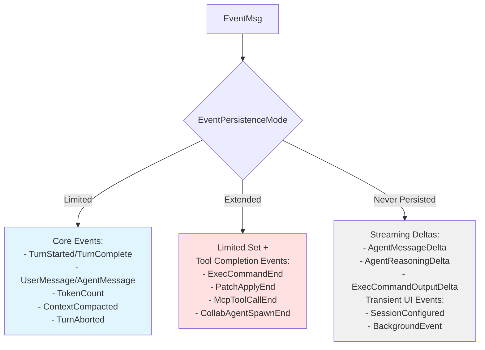
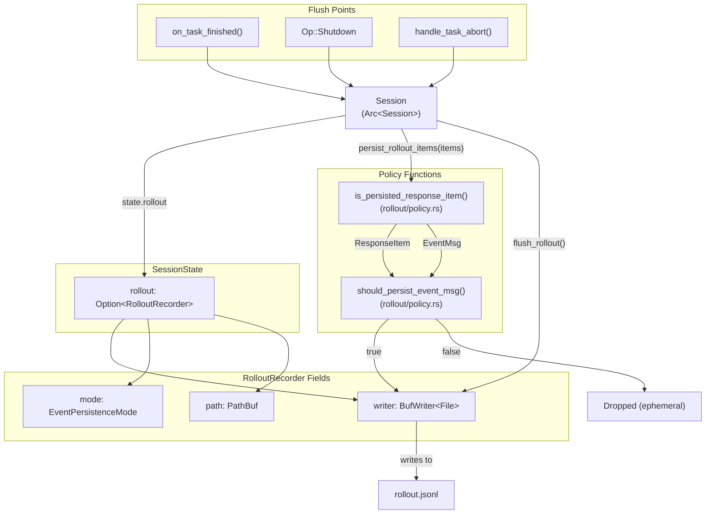
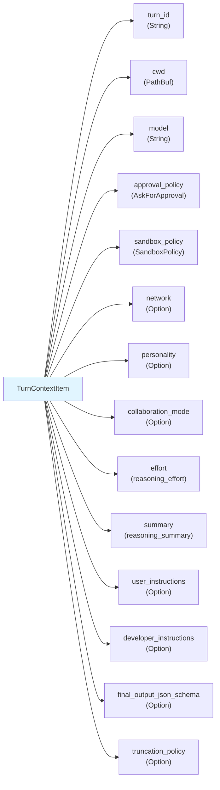
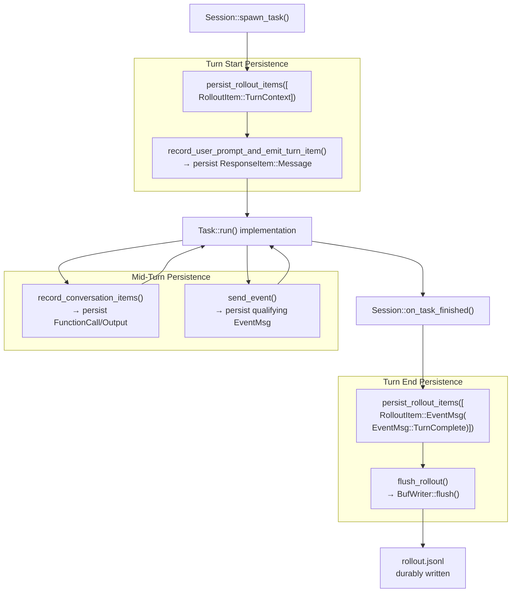

# Rollout Persistence and Replay

<details>
<summary>Relevant source files</summary>

The following files were used as context for generating this wiki page:

- [codex-rs/codex-api/src/error.rs](codex-rs/codex-api/src/error.rs)
- [codex-rs/codex-api/src/rate_limits.rs](codex-rs/codex-api/src/rate_limits.rs)
- [codex-rs/core/src/api_bridge.rs](codex-rs/core/src/api_bridge.rs)
- [codex-rs/core/src/client.rs](codex-rs/core/src/client.rs)
- [codex-rs/core/src/client_common.rs](codex-rs/core/src/client_common.rs)
- [codex-rs/core/src/codex.rs](codex-rs/core/src/codex.rs)
- [codex-rs/core/src/compact.rs](codex-rs/core/src/compact.rs)
- [codex-rs/core/src/compact_remote.rs](codex-rs/core/src/compact_remote.rs)
- [codex-rs/core/src/context_manager/history.rs](codex-rs/core/src/context_manager/history.rs)
- [codex-rs/core/src/context_manager/history_tests.rs](codex-rs/core/src/context_manager/history_tests.rs)
- [codex-rs/core/src/context_manager/mod.rs](codex-rs/core/src/context_manager/mod.rs)
- [codex-rs/core/src/context_manager/normalize.rs](codex-rs/core/src/context_manager/normalize.rs)
- [codex-rs/core/src/error.rs](codex-rs/core/src/error.rs)
- [codex-rs/core/src/rollout/policy.rs](codex-rs/core/src/rollout/policy.rs)
- [codex-rs/core/src/state/session.rs](codex-rs/core/src/state/session.rs)
- [codex-rs/core/src/state/turn.rs](codex-rs/core/src/state/turn.rs)
- [codex-rs/core/src/tasks/compact.rs](codex-rs/core/src/tasks/compact.rs)
- [codex-rs/core/src/tasks/mod.rs](codex-rs/core/src/tasks/mod.rs)
- [codex-rs/core/src/tasks/review.rs](codex-rs/core/src/tasks/review.rs)
- [codex-rs/core/src/truncate.rs](codex-rs/core/src/truncate.rs)
- [codex-rs/core/tests/suite/codex_delegate.rs](codex-rs/core/tests/suite/codex_delegate.rs)
- [codex-rs/core/tests/suite/compact.rs](codex-rs/core/tests/suite/compact.rs)
- [codex-rs/core/tests/suite/compact_remote.rs](codex-rs/core/tests/suite/compact_remote.rs)
- [codex-rs/core/tests/suite/compact_resume_fork.rs](codex-rs/core/tests/suite/compact_resume_fork.rs)
- [codex-rs/core/tests/suite/review.rs](codex-rs/core/tests/suite/review.rs)
- [codex-rs/exec/src/event_processor.rs](codex-rs/exec/src/event_processor.rs)
- [codex-rs/exec/src/event_processor_with_human_output.rs](codex-rs/exec/src/event_processor_with_human_output.rs)
- [codex-rs/mcp-server/src/codex_tool_runner.rs](codex-rs/mcp-server/src/codex_tool_runner.rs)
- [codex-rs/protocol/src/protocol.rs](codex-rs/protocol/src/protocol.rs)
- [codex-rs/tui/src/chatwidget/snapshots/codex_tui**chatwidget**tests\_\_image_generation_call_history_snapshot.snap](codex-rs/tui/src/chatwidget/snapshots/codex_tui__chatwidget__tests__image_generation_call_history_snapshot.snap)

</details>

## Purpose and Scope

This document describes Codex's rollout persistence system, which records conversation history and session metadata to disk in JSONL format. Rollout files enable thread resumption, allow inspection of conversation state for debugging, and provide a durable audit trail of agent interactions.

For information about how history is managed in memory and prepared for model consumption, see [Conversation History Management](#3.5). For details on how compaction generates special rollout entries, see [History Compaction System](#3.5.1).

---

## Rollout File Format

Codex persists conversation state to **rollout files**: newline-delimited JSON files where each line contains a `RolloutLine` wrapping a `RolloutItem`. These files are stored in the session directory at `~/.codex/sessions/<thread_id>/rollout.jsonl`.

### RolloutLine Structure

Each line in a rollout file follows this structure:

```
{"timestamp": "2024-01-15T10:30:45.123Z", "item": <RolloutItem>}
```

The `RolloutLine` type wraps a `RolloutItem` and adds a UTC timestamp for each persisted event.

**Sources:** [codex-rs/core/tests/suite/compact.rs:380-395]()

---

## RolloutItem Types

The `RolloutItem` enum defines what can be persisted to rollout files:

| Item Type      | Description                        | Example Use Case                                                  |
| -------------- | ---------------------------------- | ----------------------------------------------------------------- |
| `ResponseItem` | Raw model responses and tool calls | User messages, assistant replies, function calls, tool outputs    |
| `EventMsg`     | Protocol-level events              | `TurnStarted`, `TurnComplete`, `AgentMessage`, `ContextCompacted` |
| `TurnContext`  | Snapshot of turn configuration     | Model, CWD, permissions, policies captured at turn start          |
| `Compacted`    | Compaction metadata                | Summary message and replacement history after `/compact`          |
| `SessionMeta`  | Session-level metadata             | Session ID, initial configuration                                 |

**Sources:** [codex-rs/core/src/rollout/policy.rs:15-24]()

---

## Persistence Policies

Codex supports two persistence granularities controlled by `EventPersistenceMode`:



### Limited Mode (Default)

Limited mode persists only essential events needed for thread resumption and conversation replay. This keeps rollout files compact while preserving full conversation semantics.

**Persisted in Limited mode:**

- Turn lifecycle: `TurnStarted`, `TurnComplete`, `TurnAborted`
- Messages: `UserMessage`, `AgentMessage`, `AgentReasoning`
- History: `ContextCompacted`, `ThreadRolledBack`, `UndoCompleted`
- Token tracking: `TokenCount`
- Special items: `ItemCompleted` (for Plan items only)

**Sources:** [codex-rs/core/src/rollout/policy.rs:72-102]()

### Extended Mode

Extended mode additionally persists tool execution outcomes and error events. This provides more detailed audit trails but increases file size.

**Additional events in Extended mode:**

- Tool completions: `ExecCommandEnd`, `PatchApplyEnd`, `McpToolCallEnd`
- Collab events: `CollabAgentSpawnEnd`, `CollabAgentInteractionEnd`, `CollabWaitingEnd`
- Search: `WebSearchEnd`
- Errors: `Error` events

**Sources:** [codex-rs/core/src/rollout/policy.rs:79-123]()

---

## RolloutRecorder Architecture



### Key Components

**Session::state.rollout: Option\<RolloutRecorder\>**

- Lazily initialized on first write to `~/.codex/sessions/<thread_id>/rollout.jsonl`
- Wrapped in `Option` because not all sessions persist (e.g., ephemeral sub-agents)
- Lives in `SessionState` alongside `history: ContextManager`

**RolloutRecorder Fields**

- `writer: BufWriter<File>` - buffered writer for performance
- `mode: EventPersistenceMode` - from session config (`persist_extended_history`)
- `path: PathBuf` - absolute path to rollout.jsonl

**Persistence Decision Pipeline**

1. `Session::persist_rollout_items(&[RolloutItem])` receives items
2. For each item, calls `is_persisted_response_item(item, mode)` from [codex-rs/core/src/rollout/policy.rs:15-24]()
3. Filter function dispatches to type-specific checks:
   - `ResponseItem` → `should_persist_response_item(item)` [codex-rs/core/src/rollout/policy.rs:28-44]()
   - `EventMsg` → `should_persist_event_msg(ev, mode)` [codex-rs/core/src/rollout/policy.rs:71-125]()
4. Qualifying items are serialized to `RolloutLine { timestamp, item }` and written to buffer
5. Buffer is flushed at turn boundaries via `flush_rollout()`

**Automatic Flush Triggers**

- `Session::on_task_finished()` - after `TurnComplete` emission [codex-rs/core/src/tasks/mod.rs:196]()
- `Session::handle_task_abort()` - after `TurnAborted` write [codex-rs/core/src/tasks/mod.rs:222-230]()
- `Op::Shutdown` handling - on session termination

**Sources:** [codex-rs/core/src/rollout/policy.rs:1-125](), [codex-rs/core/src/tasks/mod.rs:196-298](), [codex-rs/core/src/state/session.rs:20-38]()

---

## ResponseItem Persistence

Not all `ResponseItem` variants are persisted. The system filters out ephemeral items that don't contribute to conversation semantics:

### Always Persisted

```rust
ResponseItem::Message { .. }           // User and assistant messages
ResponseItem::Reasoning { .. }         // Agent reasoning (encrypted or plain)
ResponseItem::LocalShellCall { .. }    // Shell command metadata
ResponseItem::FunctionCall { .. }      // Tool calls
ResponseItem::FunctionCallOutput { .. } // Tool outputs
ResponseItem::CustomToolCall { .. }    // Custom tool invocations
ResponseItem::CustomToolCallOutput { .. } // Custom tool results
ResponseItem::WebSearchCall { .. }     // Web search operations
ResponseItem::Compaction { .. }        // Compaction summaries
ResponseItem::GhostSnapshot { .. }     // Undo/rollback snapshots
```

### Never Persisted

```rust
ResponseItem::Other  // Catch-all for unrecognized items
```

Additionally, `Message` items with `role: "system"` are excluded as they represent ephemeral system prompts rather than conversation content.

**Sources:** [codex-rs/core/src/rollout/policy.rs:27-42](), [codex-rs/core/src/context_manager/history.rs:393-407]()

---

## TurnContext Snapshots

Each turn records a `TurnContext` item capturing the configuration state at turn start. This enables accurate replay and allows thread forking to restore exact turn conditions.

### TurnContextItem Fields



This snapshot is written to the rollout immediately after turn initialization, ensuring that every turn boundary is clearly marked in the log.

**Sources:** [codex-rs/core/tests/suite/resume_warning.rs:27-42](), [codex-rs/protocol/src/protocol.rs:TurnContextItem]()

---

## Compacted Item Format

When history compaction occurs (manual `/compact` or automatic mid-turn compaction), a special `Compacted` rollout item is written:

```json
{
  "item": {
    "Compacted": {
      "message": "<SUMMARY_PREFIX>\
Summary text...",
      "replacement_history": [
        {"Message": {"role": "user", "content": [...]}},
        {"Message": {"role": "user", "content": [{"text": "<SUMMARY_PREFIX>\
..."}]}},
        {"Compaction": {"encrypted_content": "..."}}
      ]
    }
  }
}
```

### Compaction Item Structure

| Field                 | Type                        | Description                                         |
| --------------------- | --------------------------- | --------------------------------------------------- |
| `message`             | `String`                    | Human-readable summary with `SUMMARY_PREFIX` header |
| `replacement_history` | `Option<Vec<ResponseItem>>` | Complete replacement history after compaction       |

**Local compaction** (using local LLM summarization) stores the summary text in `message` and the compacted history in `replacement_history`.

**Remote compaction** (using the `/v1/responses/compact` API) stores an empty `message` and the server-returned compacted history in `replacement_history`, which may include `Compaction` items with `encrypted_content`.

**Sources:** [codex-rs/core/src/compact.rs:266-270](), [codex-rs/core/src/compact_remote.rs:156-161](), [codex-rs/core/tests/suite/compact.rs:366-404]()

---

## Thread Resumption Flow

When resuming a thread, Codex loads and replays the rollout file to reconstruct session state:

```mermaid
sequenceDiagram
    participant Client
    participant ThreadManager
    participant CodexSpawn["Codex::spawn()"]
    participant SessionNew["Session::new()"]
    participant ReplayFn["replay_rollout_items()"]
    participant StateRebuild["State Reconstruction"]

    Client->>ThreadManager: resume_thread(thread_id)
    ThreadManager->>ThreadManager: Load rollout.jsonl from<br/>session_index(thread_id)
    ThreadManager->>ThreadManager: Parse Vec&lt;RolloutLine&gt;

    ThreadManager->>CodexSpawn: spawn(conversation_history:<br/>InitialHistory::Resumed)
    CodexSpawn->>SessionNew: new(InitialHistory)

    SessionNew->>ReplayFn: Process rollout items

    loop For each RolloutItem
        alt RolloutItem::ResponseItem
            ReplayFn->>StateRebuild: state.record_items([item],<br/>truncation_policy)
            Note over StateRebuild: ContextManager::record_items()
        end

        alt RolloutItem::Compacted
            ReplayFn->>StateRebuild: state.replace_history(<br/>replacement_history,<br/>reference_context_item)
            Note over StateRebuild: History replaced with summary
        end

        alt RolloutItem::TurnContext
            ReplayFn->>StateRebuild: state.set_reference_context_item(<br/>Some(turn_context))
            Note over StateRebuild: Latest turn config preserved
        end

        alt RolloutItem::SessionMeta
            ReplayFn->>StateRebuild: Restore base_instructions,<br/>dynamic_tools
            Note over StateRebuild: Session-level metadata
        end

        alt RolloutItem::EventMsg
            Note over ReplayFn: Most EventMsg variants ignored<br/>during replay (ephemeral UI state)
        end
    end

    ReplayFn->>StateRebuild: history.recompute_token_usage()
    StateRebuild-->>SessionNew: SessionState initialized
    SessionNew-->>CodexSpawn: Session created
    CodexSpawn-->>Client: CodexThread ready
```

### Resumption Implementation Details

**Entry Point: `Codex::spawn()`** [codex-rs/core/src/codex.rs:380-633]()

- Receives `InitialHistory::Resumed { conversation_id, items }` from `ThreadManager`
- Rollout items are pre-loaded from `session_index(thread_id)` path helper [codex-rs/core/src/rollout/mod.rs:43]()
- Items passed to `Session::new()` for replay

**Session Initialization: `Session::new()`** [codex-rs/core/src/codex.rs:587-609]()

- Creates `SessionState::new(session_configuration)`
- Replays rollout items to rebuild history and context

**Replay Logic: `replay_rollout_items()`** (implicit in spawn flow)

1. **ResponseItem replay**: `state.record_items(&[item], truncation_policy)` [codex-rs/core/src/state/session.rs:60-66]()
   - Delegates to `ContextManager::record_items()` [codex-rs/core/src/context_manager/history.rs:89-104]()
   - Rebuilds conversation history item by item

2. **Compacted item replay**: `state.replace_history(replacement_history, reference_context)` [codex-rs/core/src/state/session.rs:82-90]()
   - Replaces history with compacted summary
   - Sets `reference_context_item` from compaction metadata

3. **TurnContext replay**: `state.set_reference_context_item(Some(turn_context))` [codex-rs/core/src/state/session.rs:96-98]()
   - Preserves latest turn configuration for context diffing
   - Used to detect model switches and permission changes

4. **SessionMeta replay**: Restores `base_instructions`, `dynamic_tools` from persisted session metadata
   - Ensures thread-specific configuration is preserved across resume

5. **Token estimation**: `history.estimate_token_count(turn_context)` [codex-rs/core/src/context_manager/history.rs:124-131]()
   - Recalculates approximate token usage from reconstructed history
   - Uses byte-based heuristics (`approx_token_count()`)

**Validation During Resume**

- **Path existence**: Rollout file must exist at `~/.codex/sessions/<thread_id>/rollout.jsonl`
- **Parse errors**: Malformed lines are skipped with warnings
- **CWD mismatch**: Resume may warn if current directory differs from last recorded CWD

**Sources:** [codex-rs/core/src/codex.rs:380-633](), [codex-rs/core/src/state/session.rs:20-140](), [codex-rs/core/src/context_manager/history.rs:89-131](), [codex-rs/core/tests/suite/compact_resume_fork.rs:150-174]()

---

## Persistence at Turn Boundaries

Turn lifecycle events trigger explicit rollout flushes to ensure durability:



### Turn Lifecycle Persistence Points

**1. Turn Start** - `Session::spawn_task()` [codex-rs/core/src/tasks/mod.rs:142-219]()

- Calls `turn_context.to_turn_context_item()` to snapshot turn configuration
- Persists `RolloutItem::TurnContext` via `persist_rollout_items()`
- User input recorded via `record_user_prompt_and_emit_turn_item()` which persists `ResponseItem::Message`

**2. Mid-Turn Events** - during `Task::run()` execution

- Tool calls/outputs: `Session::record_conversation_items(&[ResponseItem])` [codex-rs/core/src/codex.rs:record_conversation_items]()
  - Each `ResponseItem` filtered by `should_persist_response_item()` [codex-rs/core/src/rollout/policy.rs:28-44]()
- Protocol events: `Session::send_event(EventMsg)` checks `should_persist_event_msg(ev, mode)` [codex-rs/core/src/rollout/policy.rs:71-125]()
  - `TurnStarted`, `AgentMessage`, `TokenCount`, etc. persisted based on mode

**3. Turn Completion** - `Session::on_task_finished()` [codex-rs/core/src/tasks/mod.rs:232-331]()

```rust
// Line 196: Flush rollout after task completes
sess.flush_rollout().await;

// Line 300: Emit TurnComplete (persisted in Limited mode)
sess.send_event(&turn_context, EventMsg::TurnComplete(event)).await;
```

**4. Turn Abortion** - `Session::handle_task_abort()` [codex-rs/core/src/tasks/mod.rs:333-373]()

```rust
// Line 365: Persist TurnAborted and flush
sess.send_event(
    turn_context,
    EventMsg::TurnAborted(TurnAbortedEvent { ... })
).await;
sess.flush_rollout().await;
```

**Flush Implementation** - `Session::flush_rollout()`

- Calls `BufWriter::flush()` on rollout file handle
- Ensures kernel write buffers are flushed to disk
- Guarantees rollout consistency at turn boundaries

**Critical Flush Points**

1. **After every turn** via `on_task_finished()`
2. **After abort** via `handle_task_abort()`
3. **On shutdown** when `Op::Shutdown` is processed
4. **After compaction** when `Compacted` item is written

This durability guarantee enables safe thread resumption even after unexpected process termination.

**Sources:** [codex-rs/core/src/tasks/mod.rs:142-373](), [codex-rs/core/src/rollout/policy.rs:28-125](), [codex-rs/core/src/codex.rs:record_conversation_items]()

---

## Rollout Items in Practice

### Example: Regular Turn Sequence

A typical user turn generates this rollout sequence:

```
1. TurnContext          # Model, CWD, policies at turn start
2. UserMessage          # User's input text
3. AgentReasoning       # Model's reasoning (if present)
4. AgentMessage         # Model's response text
5. FunctionCall         # Tool invocation (if any)
6. FunctionCallOutput   # Tool result
7. TokenCount           # Token usage update
8. TurnComplete         # Turn finished marker
```

**Sources:** [codex-rs/exec/src/event_processor_with_human_output.rs:254-283]()

### Example: Compaction Sequence

A manual `/compact` operation writes:

```
1. TurnContext          # Compaction turn config
2. ItemStarted          # ContextCompaction item start (not persisted)
3. ResponseItem(s)      # Compaction request/response
4. Compacted {          # Special compaction metadata
     message: "...",
     replacement_history: [...]
   }
5. ItemCompleted        # Plan items only (if present)
6. Warning              # Compaction warning message
7. TurnComplete         # Compaction turn finished
```

The `Compacted` item contains the full replacement history, enabling accurate replay after resume/fork.

**Sources:** [codex-rs/core/src/compact.rs:266-278](), [codex-rs/core/tests/suite/compact.rs:557-628]()

---

## Persistence Mode Configuration

Persistence mode is controlled via the `persist_extended_history` flag in `CodexSpawnArgs`:

```rust
pub(crate) struct CodexSpawnArgs {
    // ... other fields
    pub(crate) persist_extended_history: bool, // Controls EventPersistenceMode
}
```

**Mode Mapping** [codex-rs/core/src/rollout/policy.rs:5-10]()

- `persist_extended_history: false` → `EventPersistenceMode::Limited` (default)
- `persist_extended_history: true` → `EventPersistenceMode::Extended`

**Configuration Sources**

1. `ThreadManager::start_thread()` passes flag to `Codex::spawn()`
2. Flag typically set from `Config` or profile settings
3. Sub-agents may override (e.g., review sub-agents often disable persistence)

**Mode Selection Guide**

| Use Case                          | Mode              | Rationale                                   |
| --------------------------------- | ----------------- | ------------------------------------------- |
| Production interactive sessions   | Limited           | Balances resumability with file size        |
| CI/CD automation                  | Limited           | Keeps logs compact for artifact storage     |
| Debugging tool failures           | Extended          | Captures full tool output for diagnosis     |
| Compliance/audit trails           | Extended          | Records complete execution traces           |
| Sub-agent tasks (review, compact) | None (no rollout) | Ephemeral operations don't need persistence |

**Extended Mode Overhead**
Extended mode adds these event types to rollout files:

- `ExecCommandEnd` - full command output (can be large)
- `PatchApplyEnd` - patch application results
- `McpToolCallEnd` - MCP tool outputs
- `CollabAgentSpawnEnd`, `CollabAgentInteractionEnd` - collab lifecycle events
- `Error` events - full error details

This increases rollout size proportional to tool usage frequency.

**Sources:** [codex-rs/core/src/codex.rs:367](), [codex-rs/core/src/rollout/policy.rs:5-10](), [codex-rs/core/src/rollout/policy.rs:71-125]()

---

## Memory Management Considerations

Rollout files grow with conversation length. Key strategies to manage size:

1. **Compaction**: History compaction (see [History Compaction System](#3.5.1)) reduces rollout size by replacing long histories with summaries
2. **Truncation**: Tool outputs are truncated before persistence using `TruncationPolicy`
3. **Event filtering**: Streaming deltas and transient UI events are never persisted
4. **Ghost snapshots**: Undo markers (`GhostSnapshot` items) are preserved but excluded from model-visible history

Long-running threads naturally accumulate large rollout files. The compaction system mitigates this by periodically condensing history, with each compaction writing a `Compacted` item that supersedes earlier rollout entries.

**Sources:** [codex-rs/core/src/context_manager/history.rs:144-154](), [codex-rs/core/src/truncate.rs:88-95]()

---

## Rollout File Locations

Rollout files are stored in the thread-specific session directory:

```
~/.codex/sessions/
  ├── <thread_id_1>/
  │   ├── rollout.jsonl          # Main rollout file (RolloutLine JSONL)
  │   ├── config.toml            # Thread-specific config overrides
  │   └── ...
  ├── <thread_id_2>/
  │   ├── rollout.jsonl
  │   └── ...
```

**Path Resolution: `session_index()`** [codex-rs/core/src/rollout/mod.rs:43]()

- Returns `PathBuf` for `~/.codex/sessions/<thread_id>/rollout.jsonl`
- Used by both write (`RolloutRecorder`) and read (resume) paths
- Thread ID is a `Uuid` generated at session creation

**Fork Behavior**
When forking a thread via `InitialHistory::Forked`, the new thread:

1. Copies parent's rollout items into initial history
2. Creates new session directory with new `thread_id`
3. Writes fresh rollout file starting from forked state
4. Parent rollout remains unmodified

**Resume Behavior**
When resuming via `InitialHistory::Resumed`:

1. Loads existing rollout from `session_index(thread_id)`
2. Appends new entries to same file
3. Preserves full conversation history across sessions

**Sources:** [codex-rs/core/src/rollout/mod.rs:43](), [codex-rs/core/tests/suite/compact.rs:234](), [codex-rs/core/tests/suite/compact_resume_fork.rs:160-171]()

---

## Resumption Validation

When resuming a thread, Codex validates:

1. **Rollout path existence**: File must exist at expected location
2. **CWD consistency**: Current working directory matches last recorded CWD
3. **Model compatibility**: Warns if resumed model differs from current config model
4. **Parse errors**: Skips malformed lines with warnings

If CWD validation fails, resumption is aborted to prevent executing commands in the wrong directory context.

**Sources:** [codex-rs/core/tests/suite/compact_resume_fork.rs:160-171](), [codex-rs/core/tests/suite/resume_warning.rs:68-100]()
