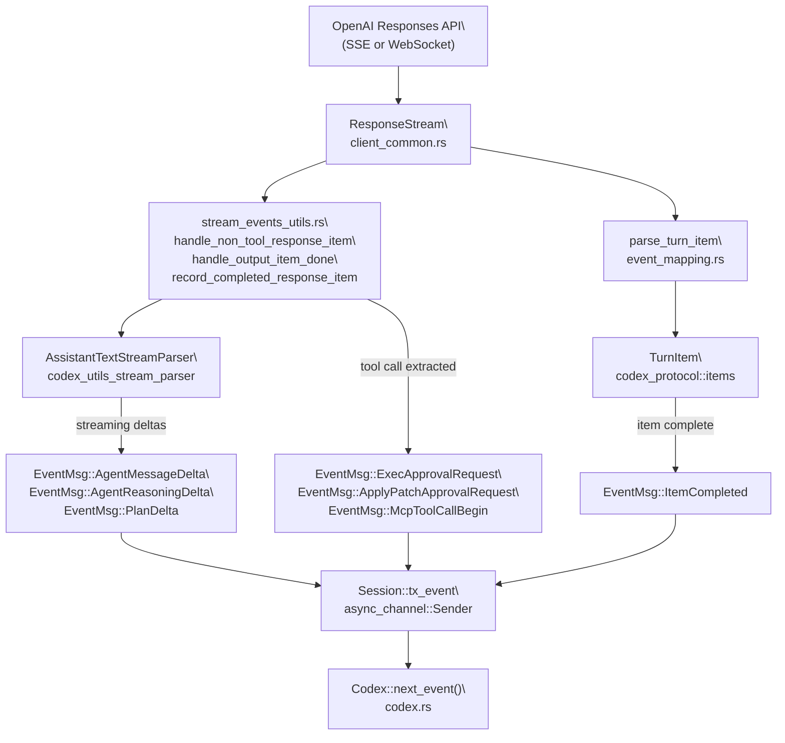
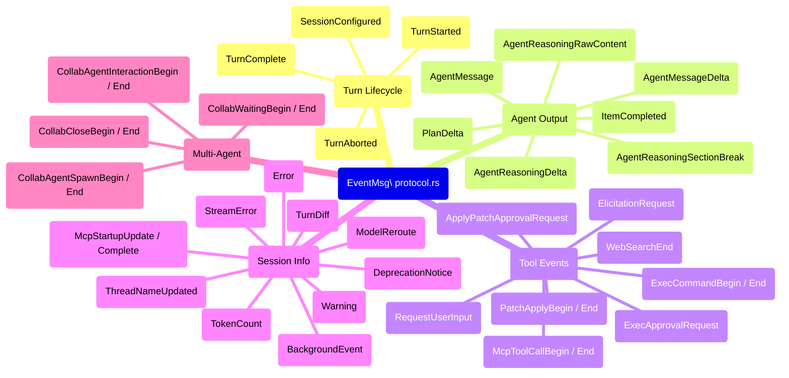
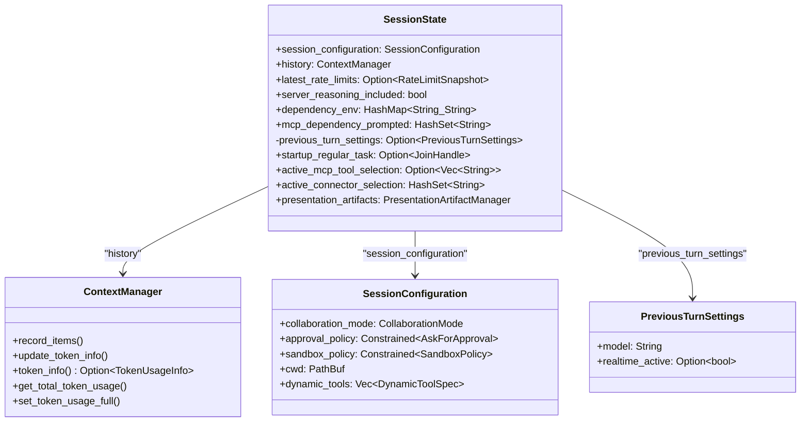

# Event Processing and State Management

<details>
<summary>Relevant source files</summary>

The following files were used as context for generating this wiki page:

- [codex-rs/codex-api/src/error.rs](codex-rs/codex-api/src/error.rs)
- [codex-rs/codex-api/src/rate_limits.rs](codex-rs/codex-api/src/rate_limits.rs)
- [codex-rs/core/src/api_bridge.rs](codex-rs/core/src/api_bridge.rs)
- [codex-rs/core/src/client.rs](codex-rs/core/src/client.rs)
- [codex-rs/core/src/client_common.rs](codex-rs/core/src/client_common.rs)
- [codex-rs/core/src/codex.rs](codex-rs/core/src/codex.rs)
- [codex-rs/core/src/error.rs](codex-rs/core/src/error.rs)
- [codex-rs/core/src/rollout/policy.rs](codex-rs/core/src/rollout/policy.rs)
- [codex-rs/exec/src/event_processor.rs](codex-rs/exec/src/event_processor.rs)
- [codex-rs/exec/src/event_processor_with_human_output.rs](codex-rs/exec/src/event_processor_with_human_output.rs)
- [codex-rs/mcp-server/src/codex_tool_runner.rs](codex-rs/mcp-server/src/codex_tool_runner.rs)
- [codex-rs/protocol/src/protocol.rs](codex-rs/protocol/src/protocol.rs)

</details>

This page covers how the core agent system maps raw API streaming events into protocol-level `EventMsg` variants, how `SessionState` accumulates and updates per-turn data (token usage, rate limits, MCP tool selection, conversation history), and how those updates flow from the end of each turn back into the session for subsequent turns.

For the `Op` submission side of the protocol (how messages get _in_ to the session), see [Protocol Layer (Submission/Event System)](#2.1). For conversation history representation and truncation, see [Conversation History Management](#3.5). For how `RegularTask` assembles the prompt before streaming begins, see [Turn Execution and Prompt Construction](#3.3).

---

## Event Processing Pipeline

When a turn runs, `ModelClientSession::stream()` returns a `ResponseStream` that yields raw `ResponseEvent` items from the OpenAI Responses API (over SSE or WebSocket). The turn runner—primarily `RegularTask`—consumes these events and maps them to two parallel outputs:

1. **`EventMsg` variants** emitted over the `Session::tx_event` channel to be received by callers via `Codex::next_event()`.
2. **`ResponseItem` records** stored in `ContextManager` (the history) for the next turn's prompt.

The key intermediate functions are in `codex-rs/core/src/stream_events_utils.rs` and `codex-rs/core/src/event_mapping.rs`.

**API Response-to-EventMsg Pipeline**



Sources: [codex-rs/core/src/codex.rs:43-48](), [codex-rs/core/src/client_common.rs:219-229](), [codex-rs/core/src/event_mapping.rs:1-10](), [codex-rs/core/src/lib.rs:65-66]()

### parse_turn_item

`parse_turn_item` (exported from `event_mapping.rs`) converts a low-level `ResponseEvent` from the API into a higher-level `TurnItem`. The `TurnItem` enum covers the meaningful content types the agent can produce:

| `TurnItem` variant | Source data                               |
| ------------------ | ----------------------------------------- |
| `AgentMessageItem` | Text output from the assistant            |
| `ReasoningItem`    | Encrypted or summarized reasoning blocks  |
| `UserMessageItem`  | User-role messages injected by the system |
| `WebSearchItem`    | Web search calls and their results        |
| `Plan(PlanItem)`   | Structured plan proposed by the model     |

After `parse_turn_item` produces a `TurnItem`, it is wrapped into an `EventMsg::ItemCompleted(ItemCompletedEvent { item, .. })` and emitted when the item is done.

Sources: [codex-rs/core/src/event_mapping.rs:1-10](), [codex-rs/core/src/lib.rs:158]()

### AssistantTextStreamParser

For streaming text output, `AssistantTextStreamParser` (from the `codex_utils_stream_parser` crate) accumulates `AssistantTextChunk` deltas. It also identifies `ProposedPlanSegment` blocks embedded in the streamed text. This drives two distinct delta event types:

- `EventMsg::AgentMessageDelta` — raw text delta for the UI to append.
- `EventMsg::PlanDelta` (`PlanDeltaEvent`) — emitted when a structured plan block is being streamed.

Sources: [codex-rs/core/src/codex.rs:104-108]()

---

## EventMsg Variant Taxonomy

`EventMsg` is the main discriminated union representing all observable state changes and notifications. It is defined in `codex-rs/protocol/src/protocol.rs` and consumed by every client (TUI, exec mode, app server, MCP server).

**EventMsg Variant Groups**



Sources: [codex-rs/protocol/src/protocol.rs:1-54](), [codex-rs/exec/src/event_processor_with_human_output.rs:1-56](), [codex-rs/mcp-server/src/codex_tool_runner.rs:215-340]()

Key event payloads:

| Event                      | Key payload fields                                   |
| -------------------------- | ---------------------------------------------------- |
| `SessionConfiguredEvent`   | `session_id`, `model`, `initial_messages`            |
| `TurnCompleteEvent`        | `last_agent_message: Option<String>`                 |
| `TurnAbortedEvent`         | `reason: TurnAbortReason`                            |
| `TokenCountEvent`          | `info: Option<TokenUsageInfo>`                       |
| `ExecApprovalRequestEvent` | `command`, `cwd`, `call_id`, `approval_id`, `reason` |
| `StreamErrorEvent`         | `message`, `additional_details`                      |
| `TurnDiffEvent`            | `changes: Vec<FileChange>`                           |
| `ModelRerouteEvent`        | `reason: ModelRerouteReason`, new model slug         |

---

## SessionState Structure

`SessionState` is the mutable, per-session data store. It is held inside `Session::state: Mutex<SessionState>`, meaning all mutations happen under lock.

**SessionState Fields and Relationships**



Sources: [codex-rs/core/src/state/session.rs:1-60]()

The `ContextManager` is where the actual conversation `ResponseItem` records live. `SessionState` delegates all history operations to it.

`PreviousTurnSettings` stores the model slug and realtime state used in the last regular turn. It is used to detect model switches (to trigger full-context reinjection) and realtive→text transitions across turns.

---

## Token Usage Tracking

Token usage data originates from the API response (in the SSE `response.completed` event or the WebSocket final frame). It flows through the following path:

1. Turn runner receives completion data containing a `TokenUsage` struct.
2. Calls `SessionState::update_token_info_from_usage(usage, model_context_window)`.
3. This delegates to `ContextManager::update_token_info()`, which stores a `TokenUsageInfo` snapshot.
4. When the turn runner emits `EventMsg::TokenCount(TokenCountEvent { info })`, it reads back the stored `TokenUsageInfo` to populate the event.

```
TokenUsage (API response payload)
  → SessionState::update_token_info_from_usage()
    → ContextManager::update_token_info()
      stored as Option<TokenUsageInfo>
  → SessionState::token_info()
    → EventMsg::TokenCount { info }
```

Additionally, `SessionState::set_token_usage_full(context_window)` is called when the context window is detected as saturated (which can trigger auto-compaction). `get_total_token_usage(server_reasoning_included)` reads back the cumulative total, adjusting for whether the server included encrypted reasoning tokens in the count.

The `server_reasoning_included: bool` field on `SessionState` is set when the model response contains `reasoning.encrypted_content`, ensuring reasoning tokens are not double-counted.

Sources: [codex-rs/core/src/state/session.rs:91-144]()

---

## Rate Limit Tracking

Rate limit headers from the API response (e.g., `x-ratelimit-remaining-requests`, `x-ratelimit-remaining-tokens`) are extracted and converted into a `RateLimitSnapshot`. The snapshot is merged into `SessionState::latest_rate_limits` using a field-by-field merge strategy:

```rust
// In session.rs
pub(crate) fn set_rate_limits(&mut self, snapshot: RateLimitSnapshot) {
    self.latest_rate_limits = Some(merge_rate_limit_fields(
        self.latest_rate_limits.as_ref(),
        snapshot,
    ));
}
```

The merge (`merge_rate_limit_fields`) preserves non-null fields from both the existing snapshot and the incoming one. This handles cases where rate limit headers for requests and tokens arrive on different responses.

`token_info_and_rate_limits()` returns both the token info and rate limits together, which is the access pattern used when building the `TokenCount` event or rendering rate limit status in the TUI footer.

Sources: [codex-rs/core/src/state/session.rs:116-127]()

---

## MCP Tool Selection State

`active_mcp_tool_selection` tracks which MCP tool names are currently selected for the session. This set grows over time as tools are mentioned by the model or selected by the user.

Two update paths exist:

| Method                                 | Behavior                                                                  |
| -------------------------------------- | ------------------------------------------------------------------------- |
| `merge_mcp_tool_selection(tool_names)` | Adds new tool names to the existing set; returns the full merged list     |
| `set_mcp_tool_selection(tool_names)`   | Replaces the selection (deduplicated); clears it if `tool_names` is empty |

The `active_mcp_tool_selection` is read back at each turn to filter which MCP tools are offered to the model in the prompt's tool list, rather than including all tools from all configured MCP servers.

`active_connector_selection: HashSet<String>` serves a similar purpose for app connectors.

`mcp_dependency_prompted: HashSet<String>` records which MCP dependency names have already been prompted for installation, so the user is not asked repeatedly within a session.

Sources: [codex-rs/core/src/state/session.rs:177-215]()

---

## Per-Turn State Update Sequence

The diagram below shows the order of state mutations across a single complete turn:

**Per-Turn SessionState Update Flow**

```mermaid
sequenceDiagram
    participant RL as "submission_loop\
codex.rs"
    participant RT as "RegularTask\
tasks/regular.rs"
    participant MCS as "ModelClientSession\
client.rs"
    participant SEU as "stream_events_utils.rs"
    participant SS as "SessionState\
state/session.rs"
    participant CM as "ContextManager\
context_manager.rs"

    RL->>SS: "lock(); read session_configuration, history"
    RL->>RT: "spawn task with TurnContext"
    RT->>MCS: "stream(prompt, ...)"
    loop "ResponseEvent stream"
        MCS-->>RT: "ResponseEvent"
        RT->>SEU: "handle_non_tool_response_item\
or handle_output_item_done"
        SEU-->>RL: "EventMsg via tx_event"
    end
    RT->>SEU: "record_completed_response_item"
    SEU->>SS: "lock(); record_items(response_items)"
    SS->>CM: "record_items()"
    RT->>SS: "lock(); update_token_info_from_usage(usage)"
    SS->>CM: "update_token_info()"
    RT->>SS: "lock(); set_rate_limits(snapshot)"
    RT->>SS: "lock(); set_previous_turn_settings(settings)"
    RT-->>RL: "EventMsg::TurnComplete via tx_event"
```

Sources: [codex-rs/core/src/codex.rs:43-55](), [codex-rs/core/src/state/session.rs:58-75](), [codex-rs/core/src/tasks/mod.rs:76-113]()

---

## Event Persistence Filtering

Not all events are written to the session's rollout JSONL file. The `EventPersistenceMode` enum in `codex-rs/core/src/rollout/policy.rs` controls which items are persisted:

| Persistence Mode    | Description                                                    |
| ------------------- | -------------------------------------------------------------- |
| `Limited` (default) | Only a curated subset of `EventMsg` variants                   |
| `Extended`          | A broader set, used when `persist_extended_history` is enabled |

`RolloutItem` wraps the persisted content:

```
RolloutItem::ResponseItem(ResponseItem)  — conversation data
RolloutItem::EventMsg(EventMsg)          — selected protocol events
RolloutItem::Compacted(CompactedItem)    — compaction markers
RolloutItem::TurnContext(TurnContextItem)— per-turn config snapshot
RolloutItem::SessionMeta(SessionMetaLine)— session header
```

All `ResponseItem` variants except `Other` are persisted:

```
ResponseItem::Message / Reasoning / LocalShellCall /
FunctionCall / FunctionCallOutput / CustomToolCall /
CustomToolCallOutput / WebSearchCall / GhostSnapshot /
Compaction → persisted
ResponseItem::Other → not persisted
```

`should_persist_response_item_for_memories` additionally excludes `developer`-role messages and reasoning/snapshot items, keeping only the content relevant to memory extraction.

Sources: [codex-rs/core/src/rollout/policy.rs:1-90]()

---

## AgentStatus Watch Channel

`Session` maintains a `watch::Sender<AgentStatus>` (`agent_status` field). This is a Tokio watch channel, meaning any watcher always sees the most recent value without buffering all updates.

`AgentStatus` is derived from `EventMsg` values via the `agent_status_from_event` function in `codex-rs/core/src/agent.rs`. When a significant event arrives (turn start, turn complete, abort, etc.), the watch is updated. The `Codex` struct exposes the `watch::Receiver<AgentStatus>` so callers such as the app server can poll agent state without subscribing to every event.

Initial value is `AgentStatus::PendingInit`, set when `Codex::spawn` creates the watch channel.

Sources: [codex-rs/core/src/codex.rs:489](), [codex-rs/core/src/codex.rs:583-585](), [codex-rs/core/src/codex.rs:14-16]()

---

## TurnContext Snapshot

`TurnContext` is assembled from `SessionState` at the start of each turn and passed to the running task. It is **not mutated** during the turn—it represents a frozen view of session settings for that turn's duration:

| `TurnContext` field         | Source                                                   |
| --------------------------- | -------------------------------------------------------- |
| `model_info: ModelInfo`     | Resolved from `SessionConfiguration::collaboration_mode` |
| `reasoning_effort`          | From collaboration mode or per-turn override             |
| `cwd: PathBuf`              | From session or per-turn `Op::UserTurn`                  |
| `approval_policy`           | From `SessionConfiguration` (constrained)                |
| `sandbox_policy`            | From `SessionConfiguration` (constrained)                |
| `tools_config: ToolsConfig` | Built from model info + features                         |
| `turn_metadata_state`       | Used to build `x-codex-turn-metadata` request header     |
| `features: Features`        | Invariant for session lifetime                           |
| `dynamic_tools`             | From session configuration                               |

`TurnContext::to_turn_context_item()` serializes the turn config into a `TurnContextItem` that is stored in the rollout file as `RolloutItem::TurnContext`, making per-turn settings reproducible during session replay.

`TurnContext::with_model(model, models_manager)` creates a new `TurnContext` with a different model slug and re-derived settings, used for mid-turn model rerouting.

Sources: [codex-rs/core/src/codex.rs:635-812]()
