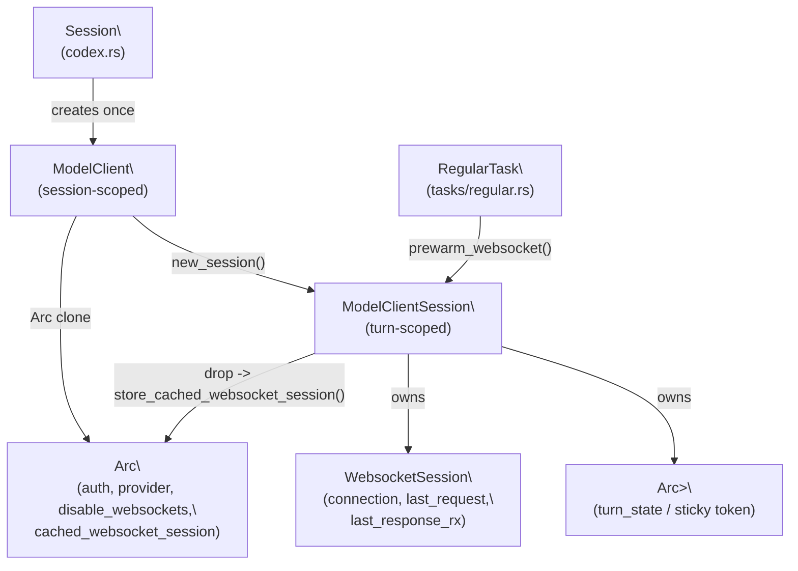
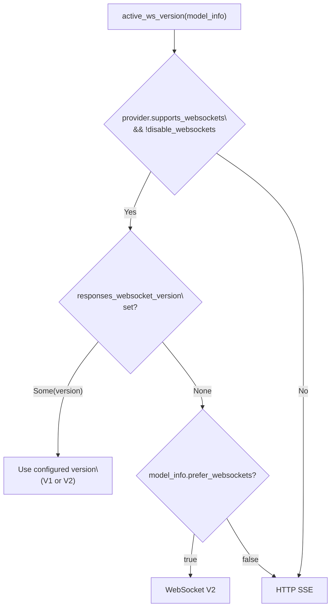
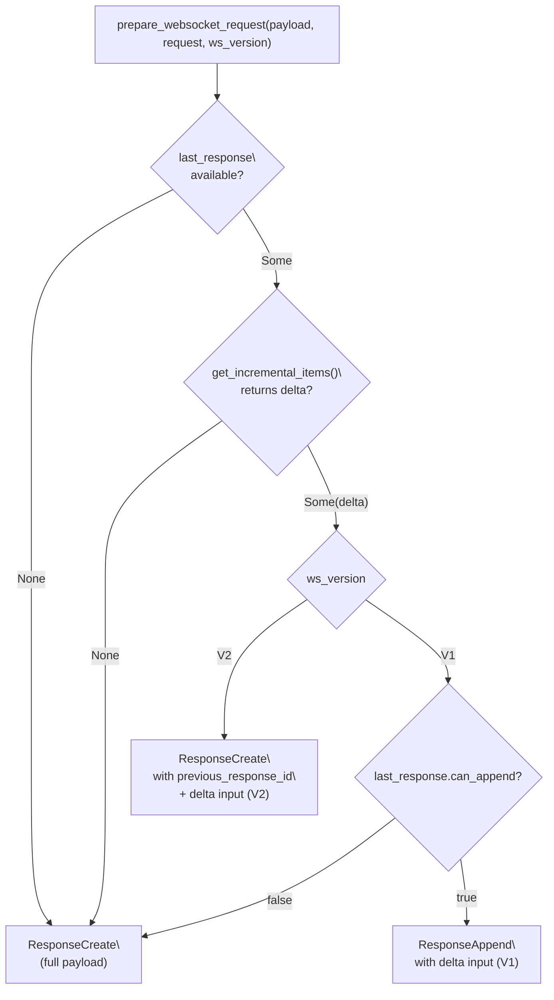
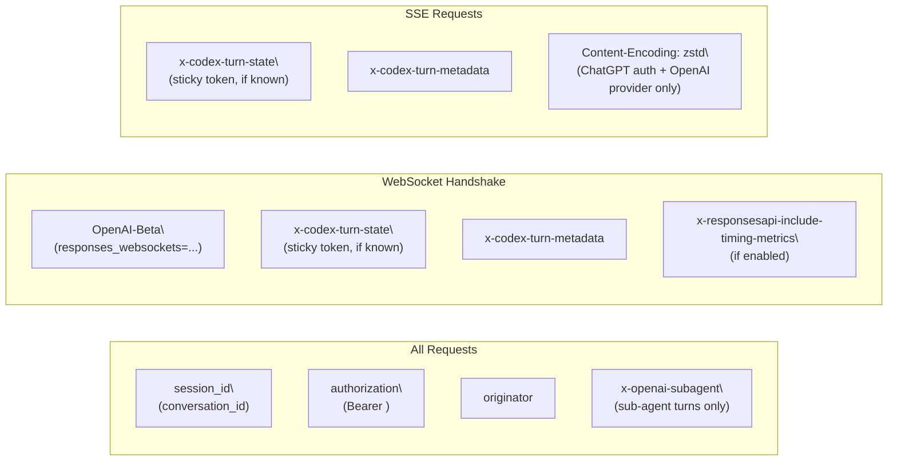

# Model Client and API Communication

<details>
<summary>Relevant source files</summary>

The following files were used as context for generating this wiki page:

- [codex-rs/codex-api/src/error.rs](codex-rs/codex-api/src/error.rs)
- [codex-rs/codex-api/src/rate_limits.rs](codex-rs/codex-api/src/rate_limits.rs)
- [codex-rs/core/src/api_bridge.rs](codex-rs/core/src/api_bridge.rs)
- [codex-rs/core/src/client.rs](codex-rs/core/src/client.rs)
- [codex-rs/core/src/client_common.rs](codex-rs/core/src/client_common.rs)
- [codex-rs/core/src/codex.rs](codex-rs/core/src/codex.rs)
- [codex-rs/core/src/error.rs](codex-rs/core/src/error.rs)
- [codex-rs/core/src/rollout/policy.rs](codex-rs/core/src/rollout/policy.rs)
- [codex-rs/core/tests/responses_headers.rs](codex-rs/core/tests/responses_headers.rs)
- [codex-rs/core/tests/suite/client.rs](codex-rs/core/tests/suite/client.rs)
- [codex-rs/core/tests/suite/prompt_caching.rs](codex-rs/core/tests/suite/prompt_caching.rs)
- [codex-rs/exec/src/event_processor.rs](codex-rs/exec/src/event_processor.rs)
- [codex-rs/exec/src/event_processor_with_human_output.rs](codex-rs/exec/src/event_processor_with_human_output.rs)
- [codex-rs/mcp-server/src/codex_tool_runner.rs](codex-rs/mcp-server/src/codex_tool_runner.rs)
- [codex-rs/protocol/src/protocol.rs](codex-rs/protocol/src/protocol.rs)

</details>

This page documents how `codex-core` constructs and sends requests to model provider APIs. It covers `ModelClient` (session-scoped) and `ModelClientSession` (turn-scoped), transport selection between WebSocket and SSE, connection reuse across turns, sticky-routing tokens, prewarm mechanics, and HTTP fallback on WebSocket failure.

For how the prompts sent to the API are assembled from conversation history, see [Turn Execution and Prompt Construction](#3.3). For how the streamed response events are converted into `EventMsg` variants, see [Event Processing and State Management](#3.4).

---

## Key Types

| Type                        | Scope           | File                        | Role                                            |
| --------------------------- | --------------- | --------------------------- | ----------------------------------------------- |
| `ModelClient`               | Session         | `core/src/client.rs`        | Shared config, auth, WS fallback state          |
| `ModelClientState`          | Session (inner) | `core/src/client.rs`        | `Arc`-shared data behind `ModelClient`          |
| `ModelClientSession`        | Turn            | `core/src/client.rs`        | WS connection, sticky token, incremental append |
| `WebsocketSession`          | Turn (inner)    | `core/src/client.rs`        | Active WS connection + last request/response    |
| `Prompt`                    | Turn            | `core/src/client_common.rs` | API request payload assembled per turn          |
| `ResponsesApiRequest`       | Wire            | `codex-api/src/common.rs`   | JSON body sent to Responses API                 |
| `ResponseEvent`             | Stream item     | `codex-api/src/common.rs`   | Parsed events from SSE/WS stream                |
| `ResponseStream`            | Stream          | `core/src/client_common.rs` | `mpsc` channel wrapper for `ResponseEvent`      |
| `ResponsesWebsocketVersion` | Config          | `core/src/client.rs`        | `V1` or `V2` WS protocol variant                |

Sources: [codex-rs/core/src/client.rs:132-220](), [codex-rs/core/src/client_common.rs:26-65](), [codex-rs/codex-api/src/common.rs:55-163]()

---

## Ownership and Lifetime Diagram

**Diagram: Type lifetimes and ownership relationships**



Sources: [codex-rs/core/src/client.rs:132-270](), [codex-rs/core/src/tasks/regular.rs:1-95]()

---

## `ModelClient`: Session-Scoped State

`ModelClient` is created once per Codex session and is cloned cheaply (it wraps `Arc<ModelClientState>`). It holds configuration that must remain stable across all turns:

- **`auth_manager`**: `Option<Arc<AuthManager>>` — resolved per request via `current_client_setup()`
- **`conversation_id`**: `ThreadId` — included in `session_id` and `x-conversation-id` headers
- **`provider`**: `ModelProviderInfo` — base URL, wire API type, retry limits
- **`session_source`**: `SessionSource` — used to set `x-openai-subagent` header for sub-agents
- **`responses_websocket_version`**: `Option<ResponsesWebsocketVersion>` — `V1`/`V2`/`None`
- **`disable_websockets`**: `AtomicBool` — once set, all subsequent turns use HTTP SSE
- **`cached_websocket_session`**: `StdMutex<WebsocketSession>` — connection pool of size 1

`ModelClient::new()` accepts all of these explicitly. `ModelClient::new_session()` creates a `ModelClientSession` for each turn, transferring the cached WS session if one is available.

Sources: [codex-rs/core/src/client.rs:132-288]()

---

## `ModelClientSession`: Turn-Scoped State

A `ModelClientSession` is created at the start of each turn and dropped when the turn completes. Its `Drop` implementation returns the `WebsocketSession` back to `ModelClientState::cached_websocket_session` so the live connection can be reused by the next turn.

**Per-turn state it holds:**

| Field               | Type                    | Purpose                                                     |
| ------------------- | ----------------------- | ----------------------------------------------------------- |
| `client`            | `ModelClient`           | Back-reference for session state                            |
| `websocket_session` | `WebsocketSession`      | Active WS connection and incremental append state           |
| `turn_state`        | `Arc<OnceLock<String>>` | Sticky-routing token (set once from server response header) |

The `WebsocketSession` struct within holds:

- `connection: Option<ApiWebSocketConnection>` — the live WS connection
- `last_request: Option<ResponsesApiRequest>` — the last full request sent (for append diffing)
- `last_response_rx: Option<oneshot::Receiver<LastResponse>>` — channel for receiving `response_id` + items after the stream completes

Sources: [codex-rs/core/src/client.rs:191-220](), [codex-rs/core/src/client.rs:499-505]()

---

## Transport Selection

The transport used for a turn is determined by `ModelClient::active_ws_version()`:

```
if provider.supports_websockets == false:
    → HTTP SSE

if disable_websockets == true (session-level fallback):
    → HTTP SSE

if Feature::ResponsesWebsocketsV2 is enabled:
    → WebSocket V2

elif Feature::ResponsesWebsockets is enabled:
    → WebSocket V1

elif model_info.prefer_websockets == true:
    → WebSocket V2 (implicit)

else:
    → HTTP SSE
```

The function `ws_version_from_features()` reads the feature flags and returns `Some(V2)`, `Some(V1)`, or `None`.

**Diagram: Transport selection logic**



Sources: [codex-rs/core/src/client.rs:401-413](), [codex-rs/core/src/client.rs:117-130]()

---

## WebSocket Connection Lifecycle

**Diagram: WebSocket connection lifecycle across turns**

```mermaid
sequenceDiagram
  participant RT as "RegularTask"
  participant MC as "ModelClient"
  participant MCS as "ModelClientSession"
  participant WS as "ApiWebSocketConnection"
  participant API as "OpenAI Responses API"

  Note over RT: "Turn N starts"
  RT->>MC: "new_session()\
(takes cached_websocket_session)"
  MC-->>MCS: "ModelClientSession"
  MCS->>WS: "preconnect_websocket()\
or prewarm_websocket()"
  WS->>API: "WebSocket handshake"
  API-->>WS: "101 Switching Protocols"
  RT->>MCS: "stream(prompt, model_info, ...)"
  MCS->>WS: "response.create (or response.append)"
  WS-->>MCS: "SSE-like events over WS"
  Note over MCS: "Turn N completes"
  Note over MCS: "Drop -> store_cached_websocket_session()"
  MC->>MC: "cached_websocket_session = session.websocket_session"

  Note over RT: "Turn N+1 starts"
  RT->>MC: "new_session()\
(takes cached connection)"
  MC-->>MCS: "ModelClientSession with live connection"
```

Sources: [codex-rs/core/src/client.rs:260-290](), [codex-rs/core/src/client.rs:499-505](), [codex-rs/core/src/client.rs:735-777]()

---

## Sticky Routing: `x-codex-turn-state`

The `turn_state` field on `ModelClientSession` is an `Arc<OnceLock<String>>`. The server sends the sticky-routing token in the `x-codex-turn-state` response header on the first response of a turn. The client:

1. Sets the value into `OnceLock` on first receipt (subsequent sets are ignored).
2. Reads the value and sends it back in `x-codex-turn-state` on all subsequent requests within the same turn (retries, tool-output appends).
3. Never carries the token across turns — each `ModelClientSession` starts with a fresh `OnceLock`.

For WebSocket connections, the token is also passed to `ApiWebSocketResponsesClient::connect()` so that reconnects within the same turn send the correct routing header.

Relevant header constants defined in `client.rs`:

| Constant                                         | Value                               |
| ------------------------------------------------ | ----------------------------------- |
| `X_CODEX_TURN_STATE_HEADER`                      | `"x-codex-turn-state"`              |
| `X_CODEX_TURN_METADATA_HEADER`                   | `"x-codex-turn-metadata"`           |
| `OPENAI_BETA_HEADER`                             | `"OpenAI-Beta"`                     |
| `OPENAI_BETA_RESPONSES_WEBSOCKETS` (V1)          | `"responses_websockets=2026-02-04"` |
| `RESPONSES_WEBSOCKETS_V2_BETA_HEADER_VALUE` (V2) | `"responses_websockets=2026-02-06"` |

Sources: [codex-rs/core/src/client.rs:103-115](), [codex-rs/core/src/client.rs:196-205](), [codex-rs/codex-api/src/endpoint/responses_websocket.rs:163-165](), [codex-rs/codex-api/src/sse/responses.rs:73-80]()

---

## Request Construction

`ModelClientSession::build_responses_request()` constructs a `ResponsesApiRequest` from a `Prompt` and per-turn parameters. Key fields:

| `ResponsesApiRequest` field | Source                                                         |
| --------------------------- | -------------------------------------------------------------- |
| `model`                     | `model_info.slug`                                              |
| `instructions`              | `prompt.base_instructions.text`                                |
| `input`                     | `prompt.get_formatted_input()` (may reserialize shell outputs) |
| `tools`                     | `create_tools_json_for_responses_api(&prompt.tools)`           |
| `reasoning`                 | `Reasoning { effort, summary }` if model supports it           |
| `include`                   | `["reasoning.encrypted_content"]` when reasoning is enabled    |
| `service_tier`              | `"priority"` when `ServiceTier::Fast`, else omitted            |
| `prompt_cache_key`          | `conversation_id.to_string()`                                  |
| `text`                      | verbosity + optional JSON output schema                        |
| `store`                     | `true` only for Azure Responses endpoint                       |

The `Prompt` struct's `get_formatted_input()` rewrites `FunctionCallOutput` bodies for Freeform `apply_patch` tools to structured plaintext format.

Sources: [codex-rs/core/src/client.rs:517-582](), [codex-rs/core/src/client_common.rs:26-65](), [codex-rs/codex-api/src/common.rs:145-163]()

---

## Prewarm Mechanics

`RegularTask` supports two prewarm strategies before the first turn request:

### Connection Prewarm (V1 and V2)

`ModelClientSession::preconnect_websocket()` opens the WebSocket handshake without sending any request body. The live connection is then available for the subsequent `stream()` call without paying handshake latency.

### Request Prewarm (V2 only)

`ModelClientSession::prewarm_websocket()` sends a `response.create` with `generate: false` and an empty tools list. The server primes its caches and returns a `response_id`. When the actual turn request arrives, it uses `previous_response_id` pointing at the prewarm response and sends only the delta `input` items, achieving zero-input payload for the first turn request.

`RegularTask::with_startup_prewarm()` runs this during session startup so the connection is ready when the first user turn arrives.

```
Prewarm flow (V2):
  send: { type: "response.create", generate: false, tools: [] }
  recv: { id: "warm-1" }
  ...turn arrives...
  send: { type: "response.create", previous_response_id: "warm-1", input: [...user items] }
```

Sources: [codex-rs/core/src/client.rs:700-734](), [codex-rs/core/src/tasks/regular.rs:33-63]()

---

## Incremental Append (`response.append` / `previous_response_id`)

Within a single turn, tool call results are returned to the model as additional input items. `ModelClientSession::prepare_websocket_request()` decides whether to send a full `response.create` or an incremental update:

- **V1 (`response.append`)**: Sends only the new `input` items since the last request, using the `ResponseAppendWsRequest` message type. Requires `last_response.can_append == true`.
- **V2 (`response.create` with `previous_response_id`)**: Always uses `response.create`, but sets `previous_response_id` to the last `response_id` and sends only the delta items in `input`.

`get_incremental_items()` computes the delta by checking that the non-input fields of both requests are identical and that the new `input` is a strict extension of the previous `input` plus any server-returned output items.

**Diagram: Incremental append decision (within a turn)**



Sources: [codex-rs/core/src/client.rs:658-698](), [codex-rs/core/src/client.rs:610-646]()

---

## HTTP SSE Fallback

WebSocket fallback is session-scoped and permanent. `ModelClientSession::activate_http_fallback()` calls `disable_websockets.swap(true, Ordering::Relaxed)` on the shared `ModelClientState`. All subsequent `new_session()` calls check this flag via `active_ws_version()` and receive `None`, switching to HTTP SSE for the remainder of the session.

Fallback is triggered when:

- The WebSocket handshake returns HTTP 426 (Upgrade Required)
- Stream retries are exhausted (as configured by `provider.stream_max_retries`)

When fallback is triggered mid-turn, the current request is replayed over HTTP SSE using the same `ResponsesApiRequest` payload.

Sources: [codex-rs/core/src/client.rs:508-515](), [codex-rs/core/src/client.rs:401-413](), [codex-rs/core/tests/suite/websocket_fallback.rs:27-121]()

---

## Retry and Error Handling

Retry behavior is governed by `ModelProviderInfo` fields:

| Field                    | Effect                                            |
| ------------------------ | ------------------------------------------------- |
| `stream_max_retries`     | Max retries for stream-level errors within a turn |
| `request_max_retries`    | Max retries for full request-level errors         |
| `stream_idle_timeout_ms` | Idle SSE stream timeout before error              |

On the WebSocket path, if the connection is found to be closed at turn start (`connection.is_closed()`), `websocket_connection()` reconnects transparently using `connect_websocket()`, replaying the sticky-routing `turn_state` token into the new handshake headers.

Sources: [codex-rs/core/src/client.rs:735-777](), [codex-rs/core/tests/suite/websocket_fallback.rs:78-120]()

---

## Unary API Calls

`ModelClient` also exposes two non-streaming (unary) calls used by background tasks:

### `compact_conversation_history()`

Called by the compaction subsystem. Uses `ApiCompactClient` over HTTP (`ReqwestTransport`). Sends a `CompactionInput` to the `/v1/compact` endpoint and returns a new list of `ResponseItem`s.

### `summarize_memories()`

Called by the memory pipeline. Uses `ApiMemoriesClient`. Sends a `MemorySummarizeInput` to `/v1/memories/trace_summarize` and returns `Vec<MemorySummarizeOutput>`.

Both calls include `build_subagent_headers()` which sets `x-openai-subagent` to classify the caller type (e.g. `"compact"`, `"memory_consolidation"`) and `build_conversation_headers()` which includes `session_id`.

Sources: [codex-rs/core/src/client.rs:289-366](), [codex-rs/core/src/client.rs:368-393]()

---

## Request Headers Summary

**Diagram: Headers sent per request type**



Sources: [codex-rs/core/src/client.rs:462-497](), [codex-rs/core/src/client.rs:584-609](), [codex-rs/core/src/client.rs:779-788]()
