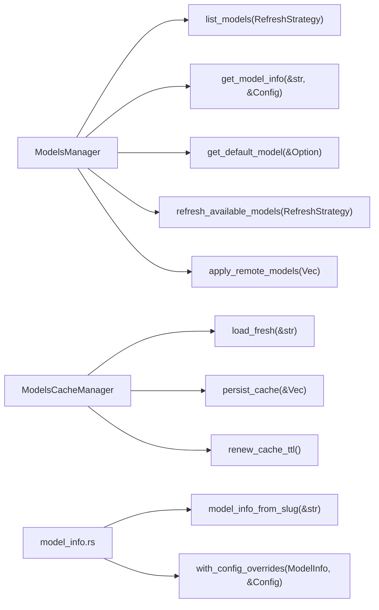
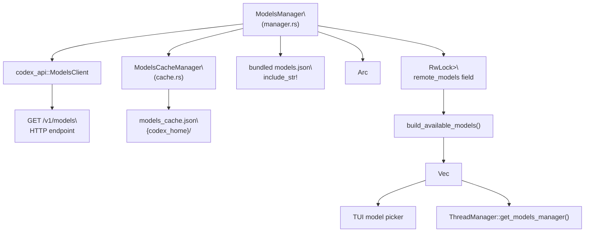
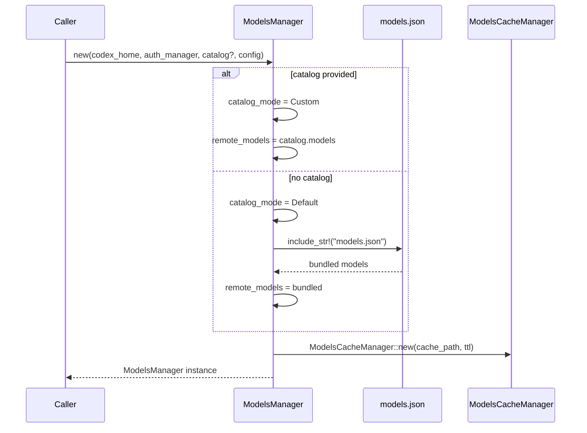
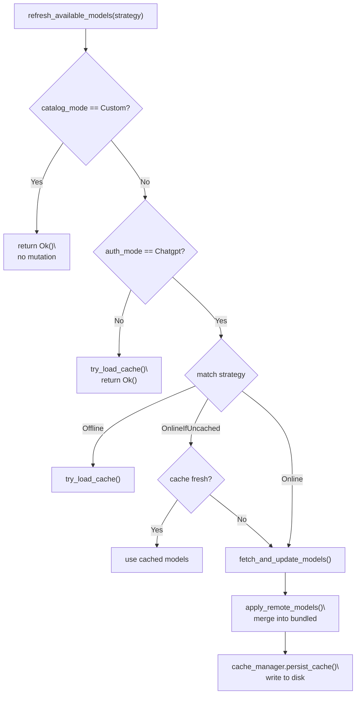
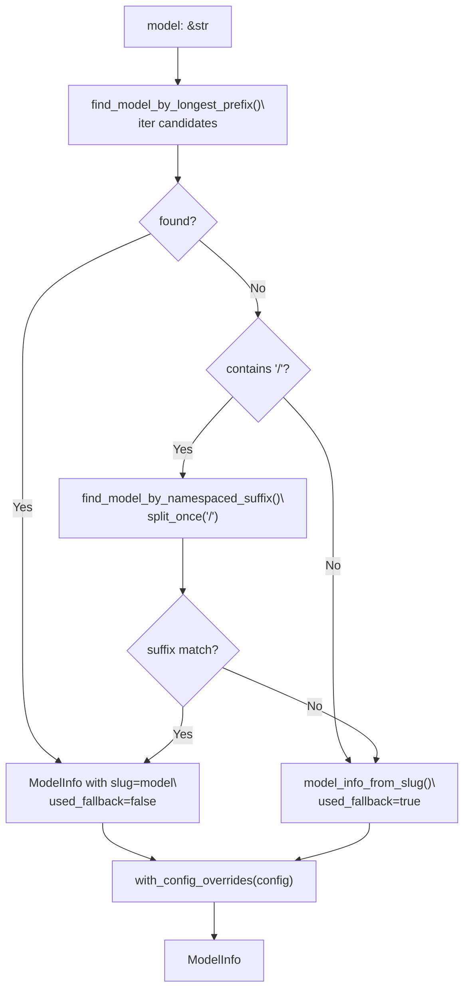
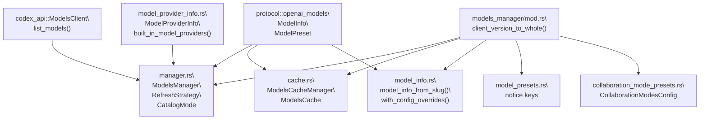

# Models Manager

<details>
<summary>Relevant source files</summary>

The following files were used as context for generating this wiki page:

- [codex-rs/app-server/tests/common/models_cache.rs](codex-rs/app-server/tests/common/models_cache.rs)
- [codex-rs/cli/src/mcp_cmd.rs](codex-rs/cli/src/mcp_cmd.rs)
- [codex-rs/cli/tests/mcp_add_remove.rs](codex-rs/cli/tests/mcp_add_remove.rs)
- [codex-rs/cli/tests/mcp_list.rs](codex-rs/cli/tests/mcp_list.rs)
- [codex-rs/codex-api/tests/models_integration.rs](codex-rs/codex-api/tests/models_integration.rs)
- [codex-rs/core/src/mcp_connection_manager.rs](codex-rs/core/src/mcp_connection_manager.rs)
- [codex-rs/core/src/models_manager/cache.rs](codex-rs/core/src/models_manager/cache.rs)
- [codex-rs/core/src/models_manager/manager.rs](codex-rs/core/src/models_manager/manager.rs)
- [codex-rs/core/src/models_manager/mod.rs](codex-rs/core/src/models_manager/mod.rs)
- [codex-rs/core/src/models_manager/model_info.rs](codex-rs/core/src/models_manager/model_info.rs)
- [codex-rs/core/src/original_image_detail.rs](codex-rs/core/src/original_image_detail.rs)
- [codex-rs/core/src/tools/handlers/view_image.rs](codex-rs/core/src/tools/handlers/view_image.rs)
- [codex-rs/core/tests/suite/model_switching.rs](codex-rs/core/tests/suite/model_switching.rs)
- [codex-rs/core/tests/suite/models_cache_ttl.rs](codex-rs/core/tests/suite/models_cache_ttl.rs)
- [codex-rs/core/tests/suite/personality.rs](codex-rs/core/tests/suite/personality.rs)
- [codex-rs/core/tests/suite/remote_models.rs](codex-rs/core/tests/suite/remote_models.rs)
- [codex-rs/core/tests/suite/rmcp_client.rs](codex-rs/core/tests/suite/rmcp_client.rs)
- [codex-rs/core/tests/suite/view_image.rs](codex-rs/core/tests/suite/view_image.rs)
- [codex-rs/protocol/src/openai_models.rs](codex-rs/protocol/src/openai_models.rs)

</details>

The Models Manager is the subsystem within `codex-core` responsible for discovering, caching, and resolving model metadata. It bridges the remote `/models` endpoint with the rest of the agent system, making model capabilities available to prompt construction, tool configuration, and UI pickers.

This page covers the `ModelsManager` struct, `ModelInfo`, `ModelPreset`, `ModelProviderInfo`, `ModelsCacheManager`, refresh strategies, slug resolution logic, and personality support. For how model parameters (effort, summary, service tier) are applied when making an API request, see [3.2](#3.2). For how tools are configured based on `ModelInfo`, see [5.1](#5.1).

---

## Core Types

**Model Metadata Types** — defined in [codex-rs/protocol/src/openai_models.rs:1-500]()

| Type                         | Purpose                                                                             |
| ---------------------------- | ----------------------------------------------------------------------------------- |
| `ModelInfo`                  | Full metadata returned by the `/models` endpoint                                    |
| `ModelPreset`                | Picker-ready summary derived from `ModelInfo`                                       |
| `ModelsResponse`             | Wire format wrapping `Vec<ModelInfo>`                                               |
| `ReasoningEffort`            | Enum: `None`, `Minimal`, `Low`, `Medium`, `High`, `XHigh`                           |
| `ReasoningEffortPreset`      | Effort level + description pair shown in UIs                                        |
| `ConfigShellToolType`        | Shell execution mode: `Default`, `Local`, `UnifiedExec`, `Disabled`, `ShellCommand` |
| `ModelVisibility`            | `List` (shown in picker), `Hide`, `None`                                            |
| `TruncationPolicyConfig`     | Truncation mode (`Bytes` or `Tokens`) and numeric limit                             |
| `ModelMessages`              | Optional instructions template with personality variable slots                      |
| `ModelInstructionsVariables` | Per-personality text for `default`, `friendly`, `pragmatic`                         |
| `ModelUpgrade`               | Recommended upgrade model and effort mapping                                        |

**Key `ModelInfo` fields:**

| Field                          | Type                     | Notes                                                  |
| ------------------------------ | ------------------------ | ------------------------------------------------------ |
| `slug`                         | `String`                 | Stable model identifier sent to the API                |
| `shell_type`                   | `ConfigShellToolType`    | Determines which shell tool handler is activated       |
| `truncation_policy`            | `TruncationPolicyConfig` | Tool output truncation limits                          |
| `base_instructions`            | `String`                 | System prompt content for this model                   |
| `model_messages`               | `Option<ModelMessages>`  | Template-based instructions enabling personality       |
| `context_window`               | `Option<i64>`            | Maximum token context accepted                         |
| `supports_reasoning_summaries` | `bool`                   | Whether summary reasoning is available                 |
| `prefer_websockets`            | `bool`                   | Forces WS transport even when global WS feature is off |
| `used_fallback_model_metadata` | `bool`                   | Internal marker; set when slug had no catalog match    |

Sources: [codex-rs/protocol/src/openai_models.rs:107-287]()

---

## Key Code Entities

**Core Classes and Methods:**



Sources: [codex-rs/core/src/models_manager/manager.rs:102-399](), [codex-rs/core/src/models_manager/cache.rs:31-116](), [codex-rs/core/src/models_manager/model_info.rs:24-95]()

---

**`ModelProviderInfo`** — defined in [codex-rs/core/src/model_provider_info.rs:57-262]()

Represents a configured API endpoint (base URL, auth mechanism, retry limits, etc.).

| Field                    | Type             | Notes                                                 |
| ------------------------ | ---------------- | ----------------------------------------------------- |
| `name`                   | `String`         | Friendly display name (e.g., `"OpenAI"`)              |
| `base_url`               | `Option<String>` | Overrides default OpenAI/ChatGPT endpoint             |
| `env_key`                | `Option<String>` | Env var holding the API key                           |
| `wire_api`               | `WireApi`        | Must be `responses`; `chat` is rejected with an error |
| `requires_openai_auth`   | `bool`           | If true, triggers the login/onboarding flow           |
| `supports_websockets`    | `bool`           | Whether WS transport is available on this provider    |
| `request_max_retries`    | `Option<u64>`    | Max HTTP retry attempts (default: 4, hard cap: 100)   |
| `stream_max_retries`     | `Option<u64>`    | Max stream reconnections (default: 5, hard cap: 100)  |
| `stream_idle_timeout_ms` | `Option<u64>`    | Idle stream timeout (default: 300 000 ms)             |

Built-in providers are returned by `built_in_model_providers()` and include `"openai"`, `"ollama"`, and `"lmstudio"`. Custom providers are defined in `config.toml` under `[model_providers]`. The `OPENAI_BASE_URL` environment variable overrides the default OpenAI base URL without a TOML change.

Sources: [codex-rs/core/src/model_provider_info.rs:218-292]()

---

## ModelsManager Architecture

**Overall data flow:**



Sources: [codex-rs/core/src/models_manager/manager.rs:54-100](), [codex-rs/core/src/models_manager/cache.rs:14-28]()

**`ModelsManager` struct fields:**

| Field                        | Type                       | Role                                         |
| ---------------------------- | -------------------------- | -------------------------------------------- |
| `remote_models`              | `RwLock<Vec<ModelInfo>>`   | Active in-memory model catalog               |
| `catalog_mode`               | `CatalogMode`              | `Default` (refreshable) or `Custom` (locked) |
| `collaboration_modes_config` | `CollaborationModesConfig` | Seeded configuration for multi-agent presets |
| `auth_manager`               | `Arc<AuthManager>`         | Supplies auth tokens and mode detection      |
| `etag`                       | `RwLock<Option<String>>`   | HTTP ETag from last `/models` response       |
| `cache_manager`              | `ModelsCacheManager`       | Reads/writes `models_cache.json`             |
| `provider`                   | `ModelProviderInfo`        | Which API endpoint to call                   |

Sources: [codex-rs/core/src/models_manager/manager.rs:55-64]()

**Construction and Initialization:**



Sources: [codex-rs/core/src/models_manager/manager.rs:72-100]()

---

## Catalog Mode and Construction

`ModelsManager::new()` accepts an optional `model_catalog: Option<ModelsResponse>`:

- If provided → `CatalogMode::Custom`: the given models are treated as authoritative; background `/models` refreshes are disabled.
- If `None` → `CatalogMode::Default`: initialized from the bundled `models.json` (compiled in with `include_str!`), then updated from cache and network as needed.

The bundled catalog lives at `codex-rs/core/models.json` and is always loaded as the baseline before any network or cache merge is applied.

Sources: [codex-rs/core/src/models_manager/manager.rs:72-100](), [codex-rs/core/src/models_manager/manager.rs:327-331]()

---

## Refresh Strategies

`RefreshStrategy` controls when the network is consulted:

| Variant            | Behavior                                             |
| ------------------ | ---------------------------------------------------- |
| `Online`           | Always fetches from the network, ignoring cache      |
| `Offline`          | Only reads from disk cache; never calls the network  |
| `OnlineIfUncached` | Uses fresh cache if available; falls back to network |

Network refreshes only occur when `auth_mode == AuthMode::Chatgpt`. API-key users use only the bundled catalog and disk cache.

**Refresh Decision Flow:**



Sources: [codex-rs/core/src/models_manager/manager.rs:242-305]()

**Network timeout:** The `/models` call is wrapped in a 5-second `tokio::time::timeout`. On timeout, the manager falls back to the bundled/cached catalog and returns the bundled default model slug.

Sources: [codex-rs/core/src/models_manager/manager.rs:32-33](), [codex-rs/core/src/models_manager/manager.rs:290-305]()

---

## Model Catalog Merge

When remote models arrive, `apply_remote_models()` merges them into the existing bundled catalog:

1. Start with the bundled `models.json` list.
2. For each incoming `ModelInfo`:
   - If a model with the same `slug` already exists, **replace** it.
   - Otherwise, **append** it.
3. Write the result back to `remote_models`.

This means remote metadata always takes precedence over bundled metadata for overlapping slugs, while models only present in the bundle are preserved when the remote response returns an empty list.

Sources: [codex-rs/core/src/models_manager/manager.rs:312-325]()

---

## Model Slug Resolution

`get_model_info(model: &str, config: &Config)` resolves the active `ModelInfo` for a given slug using two strategies in order:

**Strategy 1 – Longest Prefix Match (`find_model_by_longest_prefix`)**

Scans all catalog entries and finds the one whose `slug` is the longest prefix of the requested model string. This allows a slug like `gpt-5.3-codex-test` to match a catalog entry `gpt-5.3-codex`, inheriting its metadata while preserving the original slug in the returned `ModelInfo`.

**Strategy 2 – Namespaced Suffix Match (`find_model_by_namespaced_suffix`)**

Used as a fallback for slugs in `namespace/model-name` form. Strips exactly one leading namespace segment (validated as `[a-zA-Z0-9_]+`) and retries longest-prefix matching on the suffix. Multi-segment paths (`ns1/ns2/model`) are rejected.

**Fallback**

If neither strategy matches, `model_info_from_slug()` generates a synthetic `ModelInfo` with `used_fallback_model_metadata: true`, default shell type, and generic instructions. A warning is emitted via `tracing::warn!`.

**Slug Resolution Decision Tree:**



Sources: [codex-rs/core/src/models_manager/manager.rs:168-223](), [codex-rs/core/src/models_manager/model_info.rs:60-95]()

---

## Config Overrides on ModelInfo

After slug resolution, `with_config_overrides(model, config)` applies user configuration on top of the resolved `ModelInfo`:

| Config field                                | Effect                                                                        |
| ------------------------------------------- | ----------------------------------------------------------------------------- |
| `model_supports_reasoning_summaries = true` | Forces `supports_reasoning_summaries = true`                                  |
| `model_context_window`                      | Overrides `context_window`                                                    |
| `model_auto_compact_token_limit`            | Overrides `auto_compact_token_limit`                                          |
| `tool_output_token_limit`                   | Recalculates `truncation_policy` (bytes or tokens)                            |
| `base_instructions`                         | Replaces `base_instructions`; clears `model_messages` (disabling personality) |
| Personality feature disabled                | Clears `model_messages`                                                       |

Sources: [codex-rs/core/src/models_manager/model_info.rs:23-57]()

---

## Disk Cache

`ModelsCacheManager` manages the on-disk file `{codex_home}/models_cache.json`.

**`ModelsCache` on-disk format:**

```json
{
  "fetched_at": "<RFC3339 timestamp>",
  "etag": "<optional HTTP ETag string>",
  "client_version": "<major.minor.patch>",
  "models": [...]
}
```

**Cache validity rules:**

- `client_version` must match the running binary's `CARGO_PKG_VERSION` (major.minor.patch). A mismatch forces a network refresh.
- The cache is considered fresh if `(now - fetched_at) ≤ TTL`. Default TTL is **300 seconds** (5 minutes).
- A zero TTL always treats the cache as stale.

**ETag-based TTL renewal:** When the `/responses` API returns an `X-Models-Etag` header matching the stored ETag, `refresh_if_new_etag()` renews the cache timestamp without re-fetching `/models`, effectively resetting the TTL.

**Cache components:**

| Component            | Type   | Role                                                         |
| -------------------- | ------ | ------------------------------------------------------------ |
| `ModelsCacheManager` | struct | Async load/save of `models_cache.json`                       |
| `ModelsCache`        | struct | Serialized cache envelope (timestamp, etag, version, models) |
| `load_fresh()`       | fn     | Returns cache only when version matches and TTL is valid     |
| `persist_cache()`    | fn     | Writes current models + metadata to disk                     |
| `renew_cache_ttl()`  | fn     | Updates `fetched_at` to now without changing models          |

Sources: [codex-rs/core/src/models_manager/cache.rs:1-183]()

---

## `list_models` and `ModelPreset` Construction

`list_models(RefreshStrategy)` returns a `Vec<ModelPreset>` ready for use in the TUI model picker:

1. Refresh the catalog according to the strategy.
2. Sort models by `priority` (lower value = higher precedence).
3. Convert each `ModelInfo` to `ModelPreset` via `impl From<ModelInfo> for ModelPreset`.
4. Filter by auth mode: in API-key mode, only models with `supported_in_api = true` are included; in ChatGPT mode, all models are included.
5. Mark the default model: the first `ModelPreset` with `show_in_picker = true` is set as `is_default`; if none have picker visibility, the first model wins.

`ModelPreset` carries a subset of `ModelInfo` fields used by the picker, including `show_in_picker` (derived from `visibility == ModelVisibility::List`), `is_default`, `supports_personality`, and `upgrade`.

Sources: [codex-rs/core/src/models_manager/manager.rs:102-111](), [codex-rs/core/src/models_manager/manager.rs:357-368](), [codex-rs/protocol/src/openai_models.rs:395-452]()

---

## Personality Support

Personality is a model-level feature enabled by the `Feature::Personality` flag and supported only when `ModelInfo.model_messages` is present.

**`ModelMessages` structure:**

| Field                    | Role                                                                                         |
| ------------------------ | -------------------------------------------------------------------------------------------- |
| `instructions_template`  | Full instructions string with `{{ personality }}` placeholder                                |
| `instructions_variables` | Per-personality text: `personality_default`, `personality_friendly`, `personality_pragmatic` |

`ModelInfo::get_model_instructions(personality)` resolves the final instruction string:

1. If `model_messages` is set and `instructions_template` is present → substitute the `{{ personality }}` placeholder with the appropriate personality string.
2. If `personality` is set but `model_messages` is absent → fall back to `base_instructions` (with a tracing warning).
3. If neither → return `base_instructions` unchanged.

**Local fallback personality:** For the slugs `gpt-5.2-codex` and `exp-codex-personality`, `model_info_from_slug()` synthesizes a `ModelMessages` with hardcoded template text so personality works even when those slugs are not in the remote catalog.

Sources: [codex-rs/protocol/src/openai_models.rs:287-313](), [codex-rs/core/src/models_manager/model_info.rs:93-107]()

**Personality interaction with config:**

- If `config.base_instructions` is set, it replaces `base_instructions` and clears `model_messages`, disabling personality templates.
- If `Feature::Personality` is disabled, `model_messages` is also cleared.

Sources: [codex-rs/core/src/models_manager/model_info.rs:49-56]()

---

## Public API Surface

**Key methods on `ModelsManager`:**

| Method                     | Signature (simplified)                                             | Description                                          |
| -------------------------- | ------------------------------------------------------------------ | ---------------------------------------------------- |
| `new`                      | `(codex_home, auth_manager, model_catalog?, collab_config) → Self` | Constructs manager; custom catalog locks refresh     |
| `list_models`              | `(RefreshStrategy) → Vec<ModelPreset>`                             | Full sorted, filtered preset list                    |
| `try_list_models`          | `() → Result<Vec<ModelPreset>, TryLockError>`                      | Non-blocking version; fails if lock contended        |
| `get_default_model`        | `(&Option<String>, RefreshStrategy) → String`                      | Returns provided model or resolves default           |
| `get_model_info`           | `(&str, &Config) → ModelInfo`                                      | Resolves slug to full metadata with config overrides |
| `list_collaboration_modes` | `() → Vec<CollaborationModeMask>`                                  | Returns static collaboration presets                 |
| `refresh_if_new_etag`      | `(String)`                                                         | Renews TTL on ETag match or triggers full refresh    |

Sources: [codex-rs/core/src/models_manager/manager.rs:102-239]()

---

**Module Structure:**



Sources: [codex-rs/core/src/models_manager/mod.rs:1-15](), [codex-rs/core/src/model_provider_info.rs:218-292]()

---

## Built-in Providers

`built_in_model_providers()` returns a `HashMap<String, ModelProviderInfo>` with three entries:

| Key          | Name        | Default Port/URL                                                         | Auth Required                       |
| ------------ | ----------- | ------------------------------------------------------------------------ | ----------------------------------- |
| `"openai"`   | `"OpenAI"`  | `api.openai.com/v1` (or `chatgpt.com/backend-api/codex` in ChatGPT mode) | Yes (`requires_openai_auth = true`) |
| `"ollama"`   | `"gpt-oss"` | `localhost:11434/v1`                                                     | No                                  |
| `"lmstudio"` | `"gpt-oss"` | `localhost:1234/v1`                                                      | No                                  |

The OpenAI provider also reads `OPENAI_ORGANIZATION` and `OPENAI_PROJECT` from the environment and forwards them as HTTP headers. The base URL can be overridden via the `OPENAI_BASE_URL` environment variable.

The `wire_api = "chat"` value is explicitly rejected with a descriptive error message pointing to migration guidance.

Sources: [codex-rs/core/src/model_provider_info.rs:218-292]()

---

## Integration Points

- **`ThreadManager`** holds an `Arc<ModelsManager>` and exposes it via `get_models_manager()` to tests and the TUI.
- **`RegularTask`** (turn execution) calls `get_model_info()` before each turn to resolve shell type, instructions, truncation policy, and reasoning parameters. See [3.3](#3.3).
- **`ToolsConfig`** uses `ModelInfo.shell_type` and `experimental_supported_tools` to configure which tools are active. See [5.1](#5.1).
- **`ContextManager`** uses `ModelInfo.context_window` and `auto_compact_token_limit` for truncation decisions. See [3.5](#3.5).
- **TUI model picker** (see [4.1.5](#4.1.5)) calls `list_models(RefreshStrategy::OnlineIfUncached)` to populate its list.
- **App Server Config API** (see [4.5.4](#4.5.4)) surfaces `list_models` results to IDE clients.
