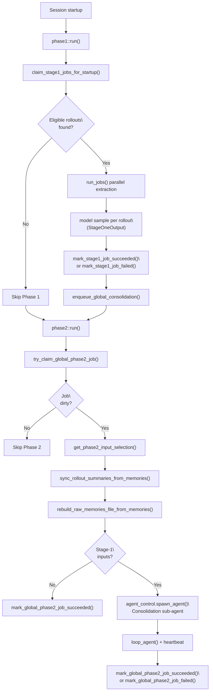
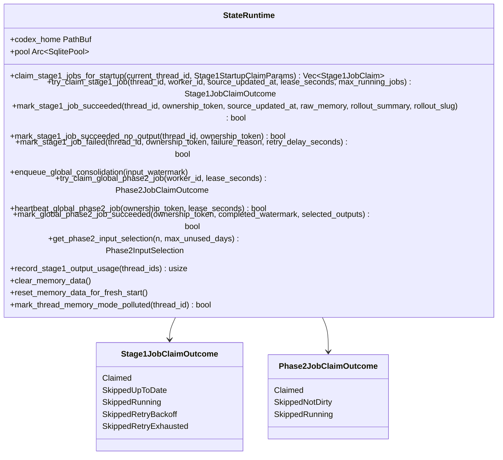
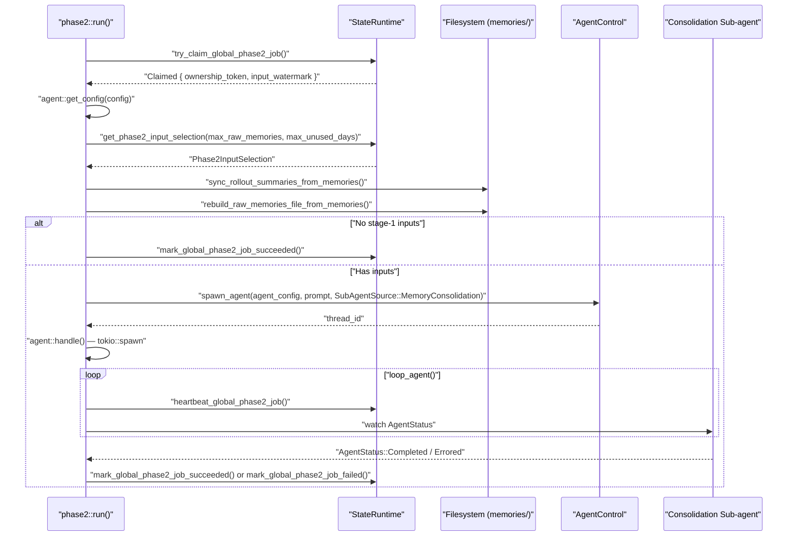

# Memory System

<details>
<summary>Relevant source files</summary>

The following files were used as context for generating this wiki page:

- [codex-rs/core/src/compact.rs](codex-rs/core/src/compact.rs)
- [codex-rs/core/src/compact_remote.rs](codex-rs/core/src/compact_remote.rs)
- [codex-rs/core/src/context_manager/history.rs](codex-rs/core/src/context_manager/history.rs)
- [codex-rs/core/src/context_manager/history_tests.rs](codex-rs/core/src/context_manager/history_tests.rs)
- [codex-rs/core/src/context_manager/mod.rs](codex-rs/core/src/context_manager/mod.rs)
- [codex-rs/core/src/context_manager/normalize.rs](codex-rs/core/src/context_manager/normalize.rs)
- [codex-rs/core/src/state/session.rs](codex-rs/core/src/state/session.rs)
- [codex-rs/core/src/state/turn.rs](codex-rs/core/src/state/turn.rs)
- [codex-rs/core/src/tasks/compact.rs](codex-rs/core/src/tasks/compact.rs)
- [codex-rs/core/src/tasks/mod.rs](codex-rs/core/src/tasks/mod.rs)
- [codex-rs/core/src/tasks/review.rs](codex-rs/core/src/tasks/review.rs)
- [codex-rs/core/src/truncate.rs](codex-rs/core/src/truncate.rs)
- [codex-rs/core/tests/suite/codex_delegate.rs](codex-rs/core/tests/suite/codex_delegate.rs)
- [codex-rs/core/tests/suite/compact.rs](codex-rs/core/tests/suite/compact.rs)
- [codex-rs/core/tests/suite/compact_remote.rs](codex-rs/core/tests/suite/compact_remote.rs)
- [codex-rs/core/tests/suite/compact_resume_fork.rs](codex-rs/core/tests/suite/compact_resume_fork.rs)
- [codex-rs/core/tests/suite/review.rs](codex-rs/core/tests/suite/review.rs)
- [codex-rs/tui/src/chatwidget/snapshots/codex_tui**chatwidget**tests\_\_image_generation_call_history_snapshot.snap](codex-rs/tui/src/chatwidget/snapshots/codex_tui__chatwidget__tests__image_generation_call_history_snapshot.snap)

</details>

This page documents the two-phase memory pipeline that runs at session startup to extract, store, and consolidate persistent agent memories. It covers `StateRuntime`'s SQLite-backed job claiming, the Phase 1 per-rollout extraction process, the Phase 2 global consolidation agent, and the on-disk file layout under the `memories/` directory.

For coverage of conversation history compaction (summarizing the in-session context window), see [History Compaction System](#3.5.1). For rollout recording and persistence, see [Rollout Persistence and Replay](#3.5.2). For the Skills system that can be populated by memory consolidation, see [Skills System](#5.9).

---

## Overview

The memory system builds a persistent, cross-session knowledge base by post-processing completed rollouts. It runs asynchronously in the background at startup. The pipeline has two sequential phases:

- **Phase 1** — For each eligible rollout, calls a model to extract a structured `raw_memory` and `rollout_summary`, then stores results in SQLite.
- **Phase 2** — Reads the latest Phase 1 outputs from SQLite, syncs local filesystem artifacts (`raw_memories.md`, `rollout_summaries/`), and spawns a dedicated consolidation sub-agent to update `MEMORY.md`, `memory_summary.md`, and `skills/`.

**Triggering conditions** (from [codex-rs/core/src/memories/README.md]()):

- The session is not ephemeral
- The memory feature is enabled
- The session is not a sub-agent session
- The state DB is available

---

## Pipeline Architecture

**Memory Pipeline — End-to-End Flow**



Sources: [codex-rs/core/src/memories/phase1.rs:84-121](), [codex-rs/core/src/memories/phase2.rs:43-161](), [codex-rs/core/src/memories/README.md]()

---

## Data Model

### Core Types

| Type                       | Location                                         | Purpose                                                              |
| -------------------------- | ------------------------------------------------ | -------------------------------------------------------------------- |
| `Stage1Output`             | [codex-rs/state/src/model/memories.rs:13-23]()   | Stored result of Phase 1 extraction for one thread                   |
| `Stage1OutputRef`          | [codex-rs/state/src/model/memories.rs:25-30]()   | Lightweight reference for removed-thread tracking                    |
| `Stage1JobClaim`           | [codex-rs/state/src/model/memories.rs:120-124]() | Claimed job + thread metadata                                        |
| `Stage1JobClaimOutcome`    | [codex-rs/state/src/model/memories.rs:106-117]() | Result of `try_claim_stage1_job`                                     |
| `Stage1StartupClaimParams` | [codex-rs/state/src/model/memories.rs:126-134]() | Parameters controlling startup claim eligibility                     |
| `Phase2InputSelection`     | [codex-rs/state/src/model/memories.rs:32-38]()   | Current + previous Phase 2 selection, retained IDs, and removed refs |
| `Phase2JobClaimOutcome`    | [codex-rs/state/src/model/memories.rs:136-149]() | Result of `try_claim_global_phase2_job`                              |

### `Stage1Output` Fields

| Field               | Type             | Meaning                                     |
| ------------------- | ---------------- | ------------------------------------------- |
| `thread_id`         | `ThreadId`       | Thread the memory was extracted from        |
| `source_updated_at` | `DateTime<Utc>`  | Timestamp of the rollout that was processed |
| `raw_memory`        | `String`         | Detailed markdown memory                    |
| `rollout_summary`   | `String`         | Compact summary line                        |
| `rollout_slug`      | `Option<String>` | Used to derive rollout summary filenames    |
| `rollout_path`      | `PathBuf`        | Path to the `.jsonl` rollout file           |
| `cwd`               | `PathBuf`        | Working directory of the original session   |
| `git_branch`        | `Option<String>` | Git branch at time of rollout               |
| `generated_at`      | `DateTime<Utc>`  | When Phase 1 produced this record           |

### `Phase2InputSelection` Fields

| Field                 | Meaning                                                       |
| --------------------- | ------------------------------------------------------------- |
| `selected`            | Current top-N stage-1 outputs for this Phase 2 run            |
| `previous_selected`   | Stage-1 outputs marked from the last successful Phase 2 run   |
| `retained_thread_ids` | Thread IDs whose snapshot exactly matches the prior selection |
| `removed`             | Previously selected outputs no longer in the current top-N    |

Sources: [codex-rs/state/src/model/memories.rs]()

---

## SQLite Schema and StateRuntime

`StateRuntime` is the central access point for all memory-related database operations. It is initialized via `StateRuntime::init` and backed by a SQLite database at `codex_home/state_<version>.sqlite`.

**StateRuntime memory methods**



Sources: [codex-rs/state/src/runtime/memories.rs](), [codex-rs/state/src/runtime.rs:66-113]()

### SQLite Tables

| Table            | Key Columns                                                                              | Role                                                |
| ---------------- | ---------------------------------------------------------------------------------------- | --------------------------------------------------- |
| `jobs`           | `kind`, `job_key`, `status`, `ownership_token`, `lease_until`, `retry_remaining`         | Tracks Phase 1 and Phase 2 job state                |
| `stage1_outputs` | `thread_id`, `source_updated_at`, `raw_memory`, `rollout_summary`, `selected_for_phase2` | Stores per-thread Phase 1 extraction results        |
| `threads`        | `id`, `memory_mode`, `updated_at`                                                        | Thread registry; `memory_mode` controls eligibility |

**Job kind constants** (from [codex-rs/state/src/runtime/memories.rs:20-22]()):

- `memory_stage1` — one row per thread; `job_key = thread_id`
- `memory_consolidate_global` — single singleton row; `job_key = "global"`

### Thread Memory Modes

| Value      | Meaning                                                                                 |
| ---------- | --------------------------------------------------------------------------------------- |
| `enabled`  | Thread is eligible for Phase 1 extraction                                               |
| `disabled` | Thread excluded (set during `reset_memory_data_for_fresh_start`)                        |
| `polluted` | Thread contaminated (e.g. web search used); excluded and may trigger Phase 2 forgetting |

Sources: [codex-rs/state/src/runtime/memories.rs:45-81](), [codex-rs/state/src/runtime/memories.rs:430-471]()

---

## Phase 1: Rollout Extraction

Phase 1 is implemented in [codex-rs/core/src/memories/phase1.rs](). It runs in strict order:

1. **Claim startup jobs** — `claim_startup_jobs` calls `state_db.claim_stage1_jobs_for_startup` with parameters from `MemoriesConfig`.
2. **Build request context** — `build_request_context` resolves the extraction model and assembles a `RequestContext`.
3. **Run jobs in parallel** — `run_jobs` executes all claimed jobs concurrently (bounded by `CONCURRENCY_LIMIT`).
4. **Emit metrics and logs**.

### Startup Claim Eligibility (`Stage1StartupClaimParams`)

| Parameter                | Config key                 | Meaning                                  |
| ------------------------ | -------------------------- | ---------------------------------------- |
| `scan_limit`             | —                          | Max threads scanned in the DB query      |
| `max_claimed`            | `max_rollouts_per_startup` | Max jobs claimed per startup             |
| `max_age_days`           | `max_rollout_age_days`     | Only rollouts updated within this window |
| `min_rollout_idle_hours` | `min_rollout_idle_hours`   | Rollout must have been idle this long    |
| `allowed_sources`        | —                          | Only `INTERACTIVE_SESSION_SOURCES`       |
| `lease_seconds`          | —                          | How long the claim is valid              |

Additionally, the query filters to `memory_mode = 'enabled'` and excludes the current thread. See [codex-rs/state/src/runtime/memories.rs:137-248]().

### Per-Job Extraction

Each `Stage1JobClaim` goes through `job::run` in [codex-rs/core/src/memories/phase1.rs:234-284]():

1. Load rollout items from the `.jsonl` file via `RolloutRecorder::load_rollout_items`.
2. Filter to memory-relevant response items via `should_persist_response_item_for_memories`.
3. Serialize filtered items and call the model with a structured output schema.
4. Redact secrets from the returned `raw_memory`, `rollout_summary`, and `rollout_slug`.
5. Call `mark_stage1_job_succeeded` (or `_no_output` / `_failed`).

The model output schema is defined by `output_schema()` [codex-rs/core/src/memories/phase1.rs:124-135]() and requires three fields:

```
{
  "raw_memory": string,
  "rollout_summary": string,
  "rollout_slug": string | null
}
```

Successful `mark_stage1_job_succeeded` calls automatically enqueue the global Phase 2 consolidation job.

Sources: [codex-rs/core/src/memories/phase1.rs]()

---

## Phase 2: Global Consolidation

Phase 2 is implemented in [codex-rs/core/src/memories/phase2.rs](). It serializes all consolidation through a singleton global job (`memory_consolidate_global`), so only one consolidation runs at a time.

### Execution Steps



Sources: [codex-rs/core/src/memories/phase2.rs:43-161](), [codex-rs/core/src/memories/phase2.rs:319-437]()

### Consolidation Sub-agent Configuration

The sub-agent spawned by Phase 2 has a tightly restricted config [codex-rs/core/src/memories/phase2.rs:261-304]():

| Setting           | Value                                                                          |
| ----------------- | ------------------------------------------------------------------------------ |
| `cwd`             | `memory_root(codex_home)`                                                      |
| `approval_policy` | `AskForApproval::Never`                                                        |
| `sandbox_policy`  | `SandboxPolicy::WorkspaceWrite` with `codex_home` as writable root, no network |
| `Feature::Collab` | Disabled (prevents recursive delegation)                                       |
| `model`           | `config.memories.consolidation_model` or default                               |
| `session_source`  | `SubAgent(SubAgentSource::MemoryConsolidation)`                                |

### Watermark Logic

The watermark prevents re-running Phase 2 when there is no new data:

- `input_watermark` — set when a Phase 1 success `enqueue_global_consolidation` is called
- `last_success_watermark` — set when Phase 2 succeeds
- Phase 2 is only dirty when `input_watermark > last_success_watermark`
- `get_watermark(claimed_watermark, latest_memories)` in [codex-rs/core/src/memories/phase2.rs:440-450]() returns `max(claimed_watermark, max(source_updated_at of inputs))`

### Input Selection and Diff

`get_phase2_input_selection` [codex-rs/state/src/runtime/memories.rs:315-426]() returns the top-N active stage-1 outputs filtered by:

- `memory_mode = 'enabled'`
- Non-empty `raw_memory` or `rollout_summary`
- `last_usage` within `max_unused_days` (or `source_updated_at` if never used)

Ranked by: `usage_count DESC`, `last_usage / generated_at DESC`, `source_updated_at DESC`.

The diff labels passed to the consolidation prompt:

- **added** — in current selection but not in previous Phase 2 baseline
- **retained** — in current selection and matches prior Phase 2 snapshot exactly
- **removed** — was in the prior Phase 2 baseline but is no longer in the current top-N

Sources: [codex-rs/state/src/runtime/memories.rs:295-426](), [codex-rs/core/src/memories/README.md:88-103]()

---

## Filesystem Layout

All memory artifacts live under `memory_root(codex_home)` which resolves to `<codex_home>/memories/`.

```
<codex_home>/memories/
├── MEMORY.md                        ← Consolidated handbook, structured by task group
├── memory_summary.md                ← Short user profile + tips; injected into system prompt
├── raw_memories.md                  ← Merged Phase 1 raw_memory fields, latest-first
├── rollout_summaries/
│   ├── <timestamp>-<hash>.md        ← Per-rollout summary (no slug)
│   └── <timestamp>-<hash>-<slug>.md ← Per-rollout summary (with slug)
└── skills/
    └── <skill-name>/
        └── SKILL.md                 ← Reusable procedure (see Skills System)
```

Filesystem helpers from [codex-rs/core/src/memories/storage.rs]():

| Function                                  | File                                                                                                         |
| ----------------------------------------- | ------------------------------------------------------------------------------------------------------------ |
| `rebuild_raw_memories_file_from_memories` | Writes `raw_memories.md` from `Stage1Output` slice                                                           |
| `sync_rollout_summaries_from_memories`    | Syncs `rollout_summaries/`, prunes stale files, removes `MEMORY.md`/`memory_summary.md`/`skills/` when empty |
| `rollout_summary_file_stem`               | Derives the filename stem from `thread_id`, `source_updated_at`, and `rollout_slug`                          |

### Rollout Summary Filename Format

[codex-rs/core/src/memories/storage.rs:179-256]()

```
<YYYY-MM-DDThh-mm-ss>-<4-char-hash>[-<sanitized-slug>].md
```

- `timestamp` — derived from the UUIDv7 thread ID timestamp, falling back to `source_updated_at`
- `4-char-hash` — base-62 hash of the lower 32 bits of the thread UUID
- `slug` — truncated to 60 chars, lowercased, non-alphanumeric chars replaced with `_`

Sources: [codex-rs/core/src/memories/storage.rs](), [codex-rs/core/templates/memories/consolidation.md:16-33]()

---

## Consolidation Prompt and Agent Behavior

The Phase 2 agent receives a prompt built from [codex-rs/core/templates/memories/consolidation.md]() with two Mustache-style variables:

| Variable                       | Content                                              |
| ------------------------------ | ---------------------------------------------------- |
| `{{ memory_root }}`            | Absolute path to `memories/` directory               |
| `{{ phase2_input_selection }}` | Diff of added/retained/removed thread IDs and counts |

The prompt instructs the agent to:

- Operate in either **INIT** (first-time build) or **INCREMENTAL UPDATE** mode
- Read `raw_memories.md`, `MEMORY.md`, `rollout_summaries/*.md`, `memory_summary.md`, and `skills/*`
- Produce `MEMORY.md` (task-grouped handbook), `memory_summary.md` (user profile + tips), and optionally `skills/<name>/SKILL.md`
- Apply forgetting: for removed thread IDs, delete only the evidence supported by that thread

Sources: [codex-rs/core/templates/memories/consolidation.md](), [codex-rs/core/src/memories/phase2.rs:306-316]()

---

## Job Lifecycle Diagrams

**Phase 1 Job State Machine**

```mermaid
stateDiagram-v2
    [*] --> "running": "try_claim_stage1_job() INSERT or UPDATE"
    "running" --> "done": "mark_stage1_job_succeeded()"
    "running" --> "done": "mark_stage1_job_succeeded_no_output()"
    "running" --> "error": "mark_stage1_job_failed()"
    "error" --> "running": "retry after retry_at (if retry_remaining > 0)"
    "error" --> "SkippedRetryExhausted": "retry_remaining <= 0"
```

**Phase 2 Global Job State Machine**

```mermaid
stateDiagram-v2
    [*] --> "pending": "enqueue_global_consolidation()"
    "pending" --> "running": "try_claim_global_phase2_job()"
    "running" --> "done": "mark_global_phase2_job_succeeded()"
    "running" --> "error": "mark_global_phase2_job_failed()"
    "error" --> "running": "retry after retry_at"
    "running" --> "running": "heartbeat_global_phase2_job()"
```

Sources: [codex-rs/state/src/runtime/memories.rs:489-661](), [codex-rs/state/src/runtime/memories.rs:876-985]()

---

## Memory Pollution

When a session uses a web search tool (or other disqualifying tool), the thread can be marked as polluted via `mark_thread_memory_mode_polluted` [codex-rs/state/src/runtime/memories.rs:430-471]():

1. Sets `threads.memory_mode = 'polluted'` for the thread.
2. If the thread had `selected_for_phase2 = 1` in `stage1_outputs`, immediately enqueues a new global Phase 2 job so the forgetting pass can remove it.

This mechanism is tested in [codex-rs/core/tests/suite/memories.rs:162-309]().

---

## Configuration (`MemoriesConfig`)

The memory pipeline is controlled by `MemoriesConfig` within the top-level `Config`. Relevant fields referenced in the code:

| Field                                | Used by | Meaning                                          |
| ------------------------------------ | ------- | ------------------------------------------------ |
| `max_rollouts_per_startup`           | Phase 1 | Max Stage 1 jobs claimed per startup             |
| `max_rollout_age_days`               | Phase 1 | Exclude rollouts older than this                 |
| `min_rollout_idle_hours`             | Phase 1 | Exclude rollouts updated more recently than this |
| `extract_model`                      | Phase 1 | Model for extraction (optional override)         |
| `max_raw_memories_for_consolidation` | Phase 2 | Top-N stage-1 outputs to feed into Phase 2       |
| `max_unused_days`                    | Phase 2 | Exclude memories not used within this window     |
| `consolidation_model`                | Phase 2 | Model for the consolidation sub-agent            |
| `no_memories_if_mcp_or_web_search`   | Session | Disable memory generation if web/MCP used        |

The constant `DEFAULT_MEMORIES_MAX_RAW_MEMORIES_FOR_CONSOLIDATION` is referenced from `crate::config::types` [codex-rs/core/src/memories/tests.rs:3]().

Sources: [codex-rs/core/src/memories/phase1.rs:154-193](), [codex-rs/core/src/memories/phase2.rs:55-56]()
