# Thread Management and Multi-Agent

<details>
<summary>Relevant source files</summary>

The following files were used as context for generating this wiki page:

- [codex-rs/codex-api/src/error.rs](codex-rs/codex-api/src/error.rs)
- [codex-rs/codex-api/src/rate_limits.rs](codex-rs/codex-api/src/rate_limits.rs)
- [codex-rs/core/src/api_bridge.rs](codex-rs/core/src/api_bridge.rs)
- [codex-rs/core/src/client.rs](codex-rs/core/src/client.rs)
- [codex-rs/core/src/client_common.rs](codex-rs/core/src/client_common.rs)
- [codex-rs/core/src/codex.rs](codex-rs/core/src/codex.rs)
- [codex-rs/core/src/compact.rs](codex-rs/core/src/compact.rs)
- [codex-rs/core/src/compact_remote.rs](codex-rs/core/src/compact_remote.rs)
- [codex-rs/core/src/context_manager/history.rs](codex-rs/core/src/context_manager/history.rs)
- [codex-rs/core/src/context_manager/history_tests.rs](codex-rs/core/src/context_manager/history_tests.rs)
- [codex-rs/core/src/context_manager/mod.rs](codex-rs/core/src/context_manager/mod.rs)
- [codex-rs/core/src/context_manager/normalize.rs](codex-rs/core/src/context_manager/normalize.rs)
- [codex-rs/core/src/error.rs](codex-rs/core/src/error.rs)
- [codex-rs/core/src/rollout/policy.rs](codex-rs/core/src/rollout/policy.rs)
- [codex-rs/core/src/state/session.rs](codex-rs/core/src/state/session.rs)
- [codex-rs/core/src/state/turn.rs](codex-rs/core/src/state/turn.rs)
- [codex-rs/core/src/tasks/compact.rs](codex-rs/core/src/tasks/compact.rs)
- [codex-rs/core/src/tasks/mod.rs](codex-rs/core/src/tasks/mod.rs)
- [codex-rs/core/src/tasks/review.rs](codex-rs/core/src/tasks/review.rs)
- [codex-rs/core/src/truncate.rs](codex-rs/core/src/truncate.rs)
- [codex-rs/core/tests/suite/codex_delegate.rs](codex-rs/core/tests/suite/codex_delegate.rs)
- [codex-rs/core/tests/suite/compact.rs](codex-rs/core/tests/suite/compact.rs)
- [codex-rs/core/tests/suite/compact_remote.rs](codex-rs/core/tests/suite/compact_remote.rs)
- [codex-rs/core/tests/suite/compact_resume_fork.rs](codex-rs/core/tests/suite/compact_resume_fork.rs)
- [codex-rs/core/tests/suite/review.rs](codex-rs/core/tests/suite/review.rs)
- [codex-rs/exec/src/event_processor.rs](codex-rs/exec/src/event_processor.rs)
- [codex-rs/exec/src/event_processor_with_human_output.rs](codex-rs/exec/src/event_processor_with_human_output.rs)
- [codex-rs/mcp-server/src/codex_tool_runner.rs](codex-rs/mcp-server/src/codex_tool_runner.rs)
- [codex-rs/protocol/src/protocol.rs](codex-rs/protocol/src/protocol.rs)
- [codex-rs/tui/src/chatwidget/snapshots/codex_tui**chatwidget**tests\_\_image_generation_call_history_snapshot.snap](codex-rs/tui/src/chatwidget/snapshots/codex_tui__chatwidget__tests__image_generation_call_history_snapshot.snap)

</details>

## Purpose and Scope

This document describes how Codex manages conversation threads and orchestrates multi-agent workflows. Thread management encompasses lifecycle operations (start, resume, fork) coordinated by `ThreadManager`, while multi-agent support enables spawning specialized sub-agents for tasks like code review, history compaction, and permission analysis. Each thread maintains independent state via event buffering (`ThreadEventStore`) that enables thread switching and state reconstruction. For session-level state and history, see [Conversation History Management](#3.5). For the overall agent lifecycle, see [Codex Interface and Session Lifecycle](#3.1).
</thinking>

---

## Thread Lifecycle and ThreadManager

The `ThreadManager` coordinates thread lifecycle operations across primary user sessions and sub-agent delegations. Each thread is identified by a unique `ThreadId` and maps to a persistent rollout file.

### Thread Operations

| Operation  | Method            | Description                                           | Result                                             |
| ---------- | ----------------- | ----------------------------------------------------- | -------------------------------------------------- |
| **Start**  | `start_thread()`  | Create new thread with fresh conversation state       | New `ThreadId`, empty history, `NewThread` wrapper |
| **Resume** | `resume_thread()` | Load existing thread from rollout file, replay events | Restored history, same `ThreadId`, event replay    |
| **Fork**   | `fork_thread()`   | Clone thread state with new identity                  | New `ThreadId`, copied history from parent         |

**Thread Lifecycle Flow**

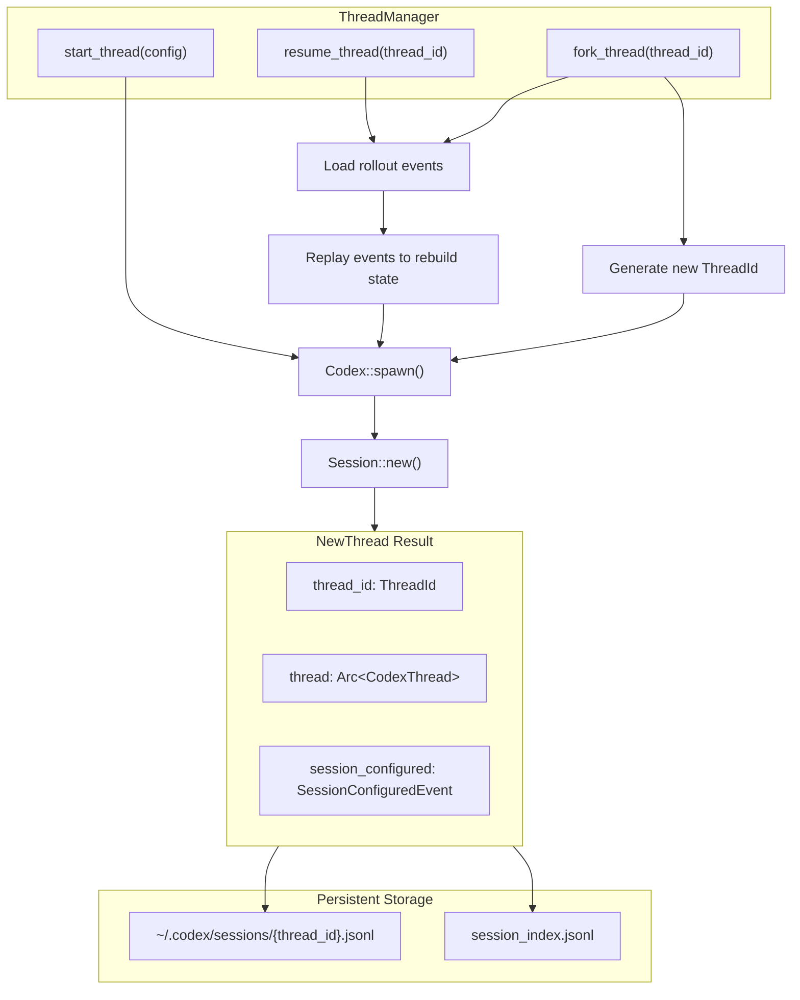

Sources: [codex-rs/core/src/codex.rs:380-633](), [codex-rs/core/src/lib.rs:84-90]()
</thinking>

---

## Multi-Agent Architecture

Codex supports spawning specialized sub-agents for focused tasks while maintaining the primary user session. Sub-agents operate as independent threads with restricted configurations and dedicated purposes.

### SessionSource and SubAgentSource

Every `Session` carries a `SessionSource` that distinguishes primary user sessions from sub-agent delegations:

```rust
pub enum SessionSource {
    Interactive,
    NonInteractive,
    SubAgent(SubAgentSource),
}

pub enum SubAgentSource {
    Review,                          // Code review sub-agent
    Compact,                         // History compaction sub-agent
    MemoryConsolidation,             // Memory summarization sub-agent
    ThreadSpawn { depth: usize, parent_thread_id: ThreadId },  // Collaborative spawned thread
    Other(String),                   // Custom labeled sub-agent
}
```

**Sub-Agent Types and Purposes**

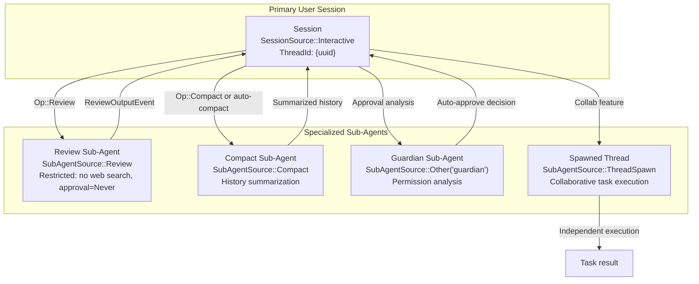

Sources: [codex-rs/core/src/codex.rs:364-371](), [codex-rs/protocol/src/protocol.rs:101-102]()

### Sub-Agent Spawning Workflow

**Review Sub-Agent Example**

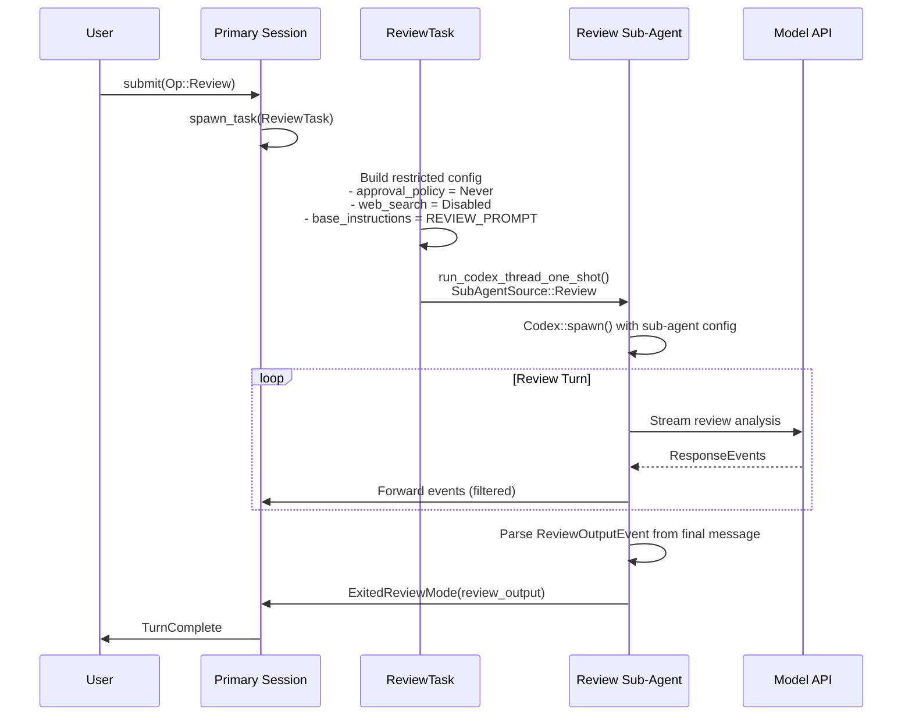

Sources: [codex-rs/core/src/tasks/review.rs:51-180]()

### Configuration Restrictions for Sub-Agents

Sub-agents inherit base configuration from the parent session but apply restrictions to prevent unsafe operations:

| Sub-Agent Type  | Config Restrictions                                                                            | Rationale                                                              |
| --------------- | ---------------------------------------------------------------------------------------------- | ---------------------------------------------------------------------- |
| **Review**      | `approval_policy = Never`<br/>`web_search = Disabled`<br/>`features.disable(SpawnCsv, Collab)` | Code review should not execute commands or spawn further agents        |
| **Compact**     | Inherits parent config                                                                         | Summarization may need same tools as primary session                   |
| **Guardian**    | Uses default `ExecPolicyManager`                                                               | Permission analysis should not be influenced by user exec-policy rules |
| **ThreadSpawn** | Decrements `agent_max_depth`<br/>Disables spawn features at max depth                          | Prevents infinite recursion of agent spawning                          |

Sources: [codex-rs/core/src/tasks/review.rs:88-129](), [codex-rs/core/src/codex.rs:436-441](), [codex-rs/core/src/codex.rs:480-489]()

---

## ThreadManager and Thread Lifecycle

The `ThreadManager` (referenced in [codex-rs/core/src/lib.rs:84-90]()) coordinates thread lifecycle operations across the system. Each thread is identified by a unique `ThreadId` (defined in `codex-protocol`) and maps to a persistent rollout file on disk.

### Thread Operations

| Operation  | Description                                     | Result                            |
| ---------- | ----------------------------------------------- | --------------------------------- |
| **Start**  | Create new thread with fresh conversation state | New `ThreadId`, empty history     |
| **Resume** | Load existing thread from rollout file          | Restored history, same `ThreadId` |
| **Fork**   | Clone thread state with new identity            | New `ThreadId`, copied history    |

### Thread Identification

Each `Session` stores its `conversation_id: ThreadId` ([codex-rs/core/src/codex.rs:526]()). The `ThreadId` serves as:

- Primary key for rollout file lookup
- Session correlation identifier in events
- Client-side thread reference

```rust
pub struct Session {
    pub(crate) conversation_id: ThreadId,
    tx_event: Sender<Event>,
    state: Mutex<SessionState>,
    // ...
}
```

**Thread Lifecycle Flow**

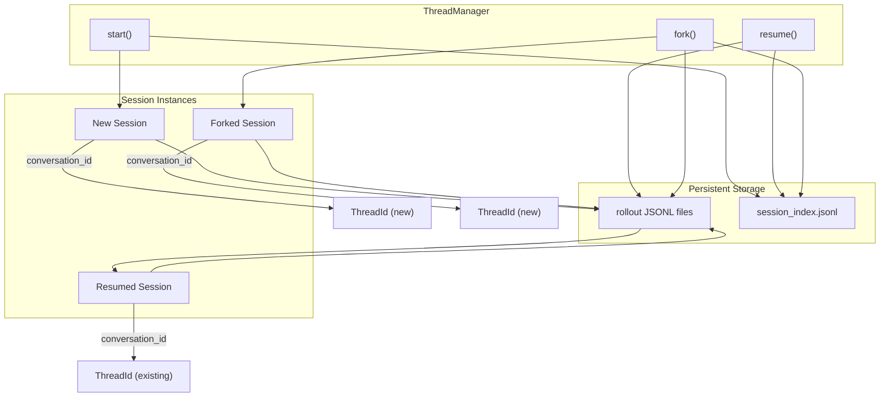

Sources: [codex-rs/core/src/codex.rs:274-539](), [codex-rs/core/src/lib.rs:84-90]()

---

## ThreadEventStore and State Preservation

The `ThreadEventStore` enables thread switching and state reconstruction by buffering events in memory. Each thread maintains its own event store with up to 32,768 buffered events.

### ThreadEventStore Architecture

**ThreadEventStore Structure**

```mermaid
graph TB
    subgraph Store["ThreadEventStore"]
        SC["session_configured: Option&lt;Event&gt;<br/>Preserved separately, never evicted"]
        BUF["buffer: VecDeque&lt;Event&gt;<br/>Ring buffer with capacity limit"]
        UIDS["user_message_ids: HashSet&lt;String&gt;<br/>Deduplication tracking"]
        CAP["capacity: usize = 32768"]
        ACT["active: bool<br/>Enable/disable buffering"]
    end

    subgraph Operations["Core Operations"]
        PUSH["push_event(event)"]
        SNAP["snapshot() → ThreadEventSnapshot"]
        DRAIN["drain_into(target_store)"]
    end

    PUSH --> DEDUP["Check user_message_ids<br/>for duplicates"]
    DEDUP --> BUF
    BUF --> CHECK{"buffer.len() > capacity?"}
    CHECK -->|Yes| EVICT["pop_front() oldest event<br/>Remove ID from tracking"]
    CHECK -->|No| DONE["Event buffered"]

    SNAP --> CLONE["Clone session_configured<br/>+ all buffered events"]
    CLONE --> SNAPSHOT["ThreadEventSnapshot"]
</thinking>
```

**ThreadEventStore Features**

| Feature                  | Implementation                                        | Purpose                                              |
| ------------------------ | ----------------------------------------------------- | ---------------------------------------------------- |
| **Capacity Management**  | Ring buffer with 32,768 event limit                   | Prevent unbounded memory growth during long sessions |
| **Deduplication**        | Track `user_message_ids` HashSet                      | Prevent duplicate `UserMessage` events during replay |
| **Session Metadata**     | `session_configured` stored separately                | Always include thread initialization in snapshots    |
| **Thread Switching**     | `snapshot()` + `drain_into()`                         | Preserve full state when switching between threads   |
| **Legacy Compatibility** | Convert `ItemCompleted(UserMessage)` to legacy format | Support older clients expecting legacy events        |

Sources: [codex-rs/tui/src/app.rs:241-320]()

### Thread Switching with Event Replay

Thread switching enables moving between multiple active threads without losing state. The TUI maintains a `ThreadEventStore` per thread and replays buffered events when switching.

**Thread Switch Workflow**

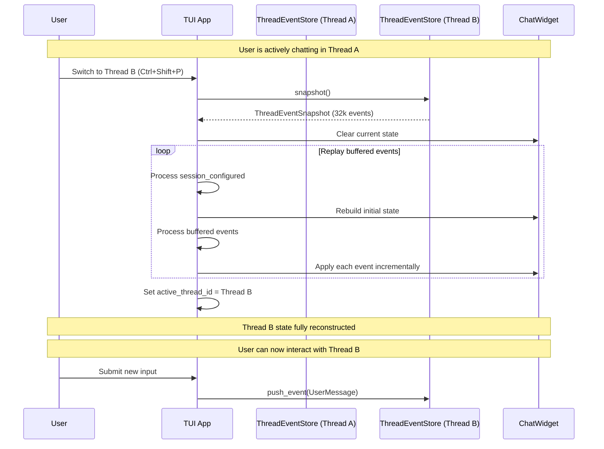

**Use Cases for Event Buffering**:

- **Thread Switching**: Reconstruct full UI state when switching between active threads
- **Connection Recovery**: Resume mid-session after network disconnection (TUI)
- **Transcript Overlay**: Display full conversation history with live tail (TUI `Ctrl+T`)
- **Fork Operations**: Copy parent thread events into forked thread's initial state

Sources: [codex-rs/tui/src/app.rs:241-349]()

### ThreadEventChannel

The `ThreadEventChannel` combines an async MPSC channel with the buffering store to enable both real-time streaming and historical replay:

```rust
struct ThreadEventChannel {
    sender: mpsc::Sender<Event>,
    receiver: Option<mpsc::Receiver<Event>>,
    store: Arc<Mutex<ThreadEventStore>>,
}
```

**Dual-Path Event Flow**

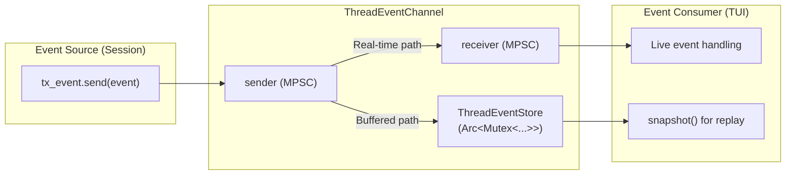

**Design Rationale**:

- **Live Path**: Low-latency streaming for real-time UI updates
- **Buffered Path**: Historical replay for thread switching and recovery
- **Arc&lt;Mutex&lt;...&gt;&gt;**: Thread-safe access to store from multiple consumers

Sources: [codex-rs/tui/src/app.rs:322-349]()

---

## Session Tasks and Sub-Agent Coordination

Each `Session` can run at most one active task at a time. Tasks implement the `SessionTask` trait and are spawned as background Tokio tasks with cancellation support.

### SessionTask Trait and Task Types

```rust
#[async_trait]
pub(crate) trait SessionTask: Send + Sync + 'static {
    fn kind(&self) -> TaskKind;
    fn span_name(&self) -> &'static str;

    async fn run(
        self: Arc<Self>,
        session: Arc<SessionTaskContext>,
        ctx: Arc<TurnContext>,
        input: Vec<UserInput>,
        cancellation_token: CancellationToken,
    ) -> Option<String>;  // Returns final agent message

    async fn abort(&self, session: Arc<SessionTaskContext>, ctx: Arc<TurnContext>) {}
}
```

**Task Type Mapping**

| TaskKind           | Implementation         | Purpose                             | Sub-Agent Spawn                 |
| ------------------ | ---------------------- | ----------------------------------- | ------------------------------- |
| `Regular`          | `RegularTask`          | Standard user turn with tool calls  | No (primary session)            |
| `Review`           | `ReviewTask`           | Code review analysis                | Yes (`SubAgentSource::Review`)  |
| `Compact`          | `CompactTask`          | History summarization               | Yes (`SubAgentSource::Compact`) |
| `GhostSnapshot`    | `GhostSnapshotTask`    | Git state capture                   | No                              |
| `UserShellCommand` | `UserShellCommandTask` | Direct shell execution (`!command`) | No                              |
| `Undo`             | `UndoTask`             | Turn rollback                       | No                              |

**Task Spawning and Lifecycle**

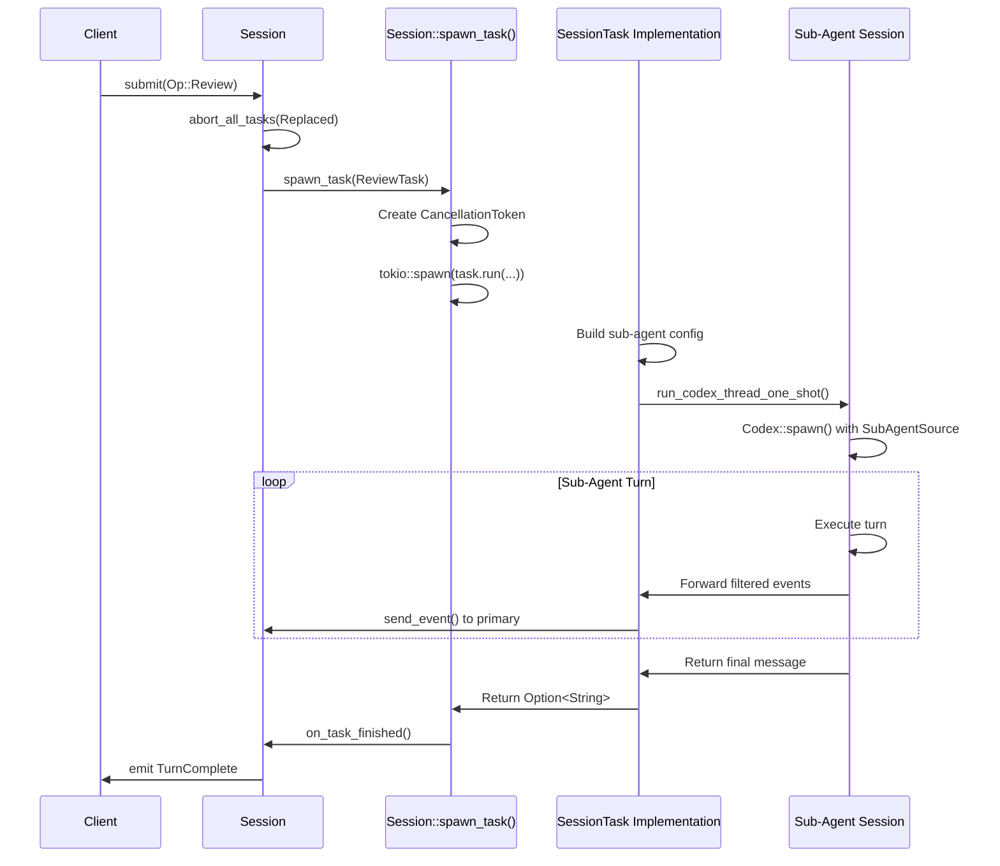

Sources: [codex-rs/core/src/tasks/mod.rs:98-219](), [codex-rs/core/src/tasks/review.rs:32-85]()

### run_codex_thread_one_shot: Sub-Agent Spawning

The `run_codex_thread_one_shot` helper spawns a sub-agent session with custom configuration and returns its event stream for processing by the parent task:

```rust
pub(crate) async fn run_codex_thread_one_shot(
    config: Config,
    auth_manager: Arc<AuthManager>,
    models_manager: Arc<ModelsManager>,
    input: Vec<UserInput>,
    parent_session: Arc<Session>,
    parent_turn_context: Arc<TurnContext>,
    cancellation_token: CancellationToken,
    session_source: SubAgentSource,
    // ...
) -> Result<CodexIo> {
    // Spawn sub-agent Codex instance
    let codex = Codex::spawn(...).await?;

    // Submit initial input
    codex.submit(Op::UserInput { items: input, ... }).await?;

    // Return event receiver for parent to consume
    Ok(CodexIo { rx_event: codex.rx_event, ... })
}
```

**Key Characteristics**:

- Sub-agent is an independent `Session` with its own `ThreadId`
- Parent task consumes sub-agent events and forwards selected events to primary session
- Sub-agent session terminates when turn completes or parent task is aborted
- Enables composition: parent task can spawn multiple sub-agents sequentially

Sources: [codex-rs/core/src/codex_delegate.rs]() (referenced from review.rs), [codex-rs/core/src/tasks/review.rs:65-130]()

---

## Primary Thread vs Sub-Agent Coordination

Primary user sessions and sub-agents coordinate through filtered event forwarding and independent lifecycle management.

### Event Filtering in Sub-Agent Tasks

Sub-agent tasks selectively forward events from the sub-agent session to the primary session. Example from `ReviewTask`:

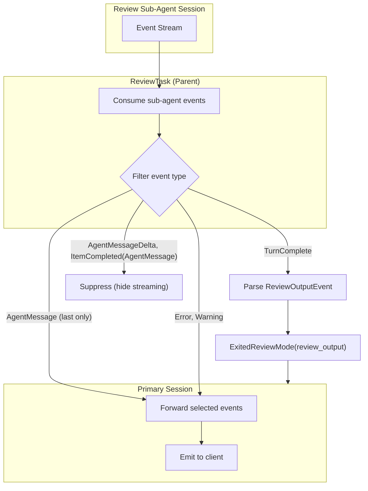

**Event Filtering Rules**:

- **Forwarded**: `Error`, `Warning`, `WebSearchBegin/End`, `ExecCommandBegin/End`
- **Transformed**: Final `AgentMessage` → `ExitedReviewMode(ReviewOutputEvent)`
- **Suppressed**: `AgentMessageDelta`, `ItemCompleted(AgentMessage)` (hides intermediate streaming)
- **Ignored**: `SessionConfigured`, `TurnStarted`, `TokenCount` (sub-agent internal)

Sources: [codex-rs/core/src/tasks/review.rs:131-180]()

### Independent ThreadId Management

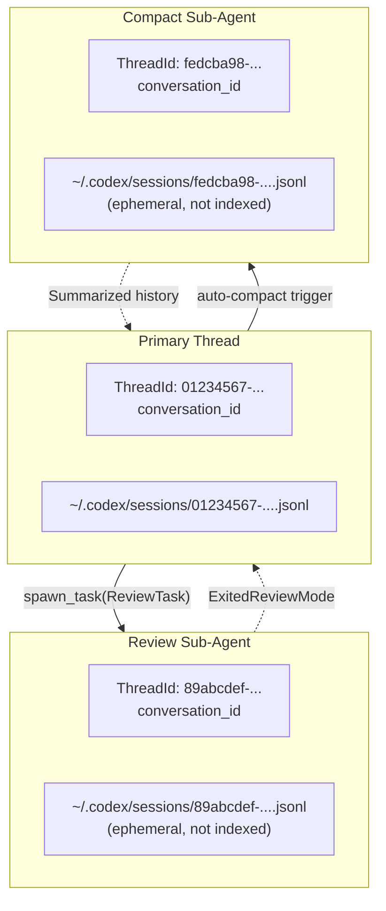

**Design Notes**:

- Sub-agents receive unique `ThreadId` values but are not user-facing threads
- Sub-agent rollout files are ephemeral (created during execution, not persisted in session index)
- Primary thread maintains continuity across sub-agent delegations
- Sub-agent state is discarded after task completion

Sources: [codex-rs/core/src/codex.rs:745-758](), [codex-rs/core/src/rollout/mod.rs]()

---

## Guardian Sub-Agent for Permission Analysis

The Guardian sub-agent is a specialized sub-agent that analyzes permission requests and auto-approves low-risk operations, reducing user interruptions.

### Guardian Invocation

Guardian is invoked during tool execution when an operation requires approval but may be safe to auto-approve:

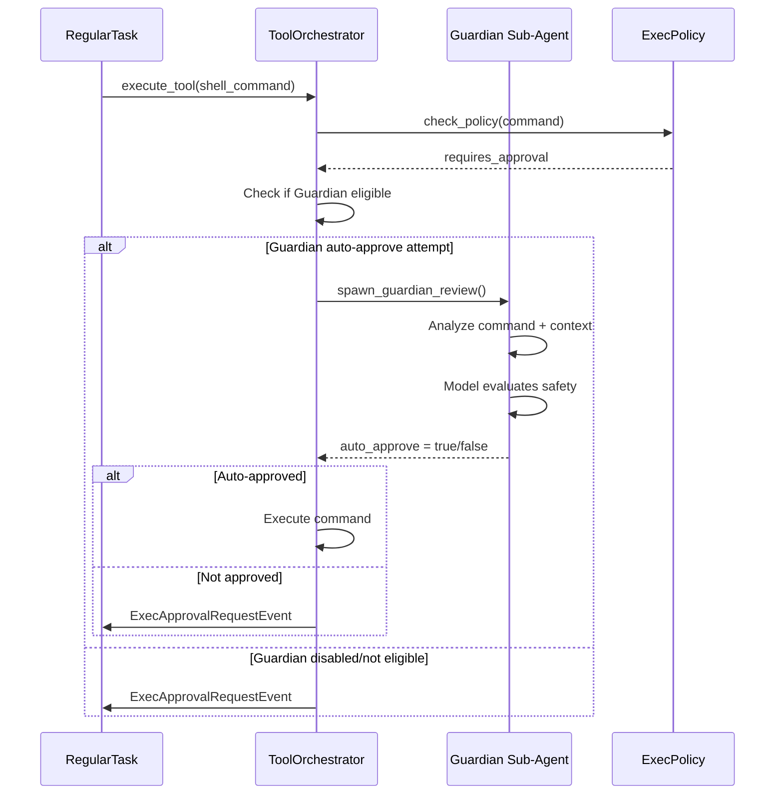

**Guardian Configuration**:

- Uses default `ExecPolicyManager` (ignores user exec-policy rules to prevent manipulation)
- Receives command, cwd, sandbox state, and approval reason as context
- Returns binary decision: auto-approve or escalate to user
- Spawned with `SubAgentSource::Other("guardian")`

Sources: [codex-rs/core/src/codex.rs:480-489](), [codex-rs/core/src/tools/sandboxing.rs]() (referenced indirectly)

---

## Thread Depth Limits and Recursion Prevention

Codex enforces a maximum depth for sub-agent spawning to prevent infinite recursion in collaborative workflows.

### Depth Tracking

`SubAgentSource::ThreadSpawn` carries depth information:

```rust
pub enum SubAgentSource {
    ThreadSpawn {
        depth: usize,           // Current nesting level
        parent_thread_id: ThreadId,
    },
    // ...
}
```

**Depth-Based Feature Restrictions**

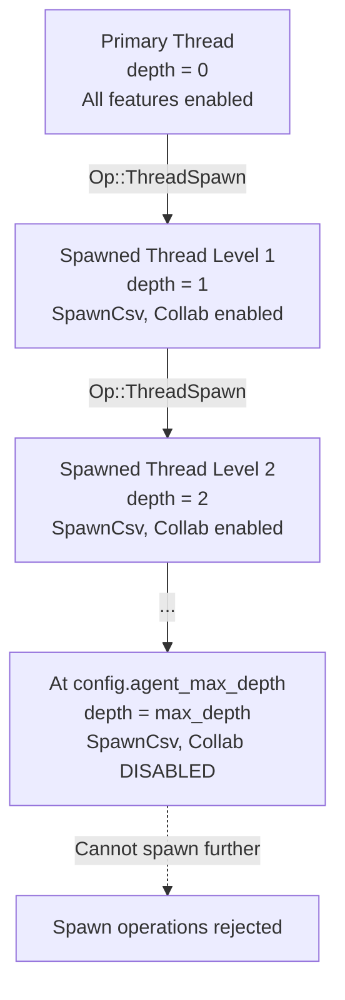

**Implementation**:

```rust
// codex-rs/core/src/codex.rs
if let SessionSource::SubAgent(SubAgentSource::ThreadSpawn { depth, .. }) = session_source
    && depth >= config.agent_max_depth
{
    // Disable recursive spawn features at max depth
    let _ = config.features.disable(Feature::SpawnCsv);
    let _ = config.features.disable(Feature::Collab);
}
```

**Configuration**:

- Default `agent_max_depth`: 3
- Prevents stack overflow in deeply nested agent chains
- Other sub-agent types (Review, Compact, Guardian) do not increment depth

Sources: [codex-rs/core/src/codex.rs:436-441]()

---

## MCP Server as Multi-Agent Host

The `codex-mcp-server` exposes Codex as an MCP tool, enabling external LLMs to spawn Codex threads for specialized tasks.

### MCP Tool Call Spawning

When an external LLM calls the `codex` MCP tool, the MCP server spawns a new Codex thread:

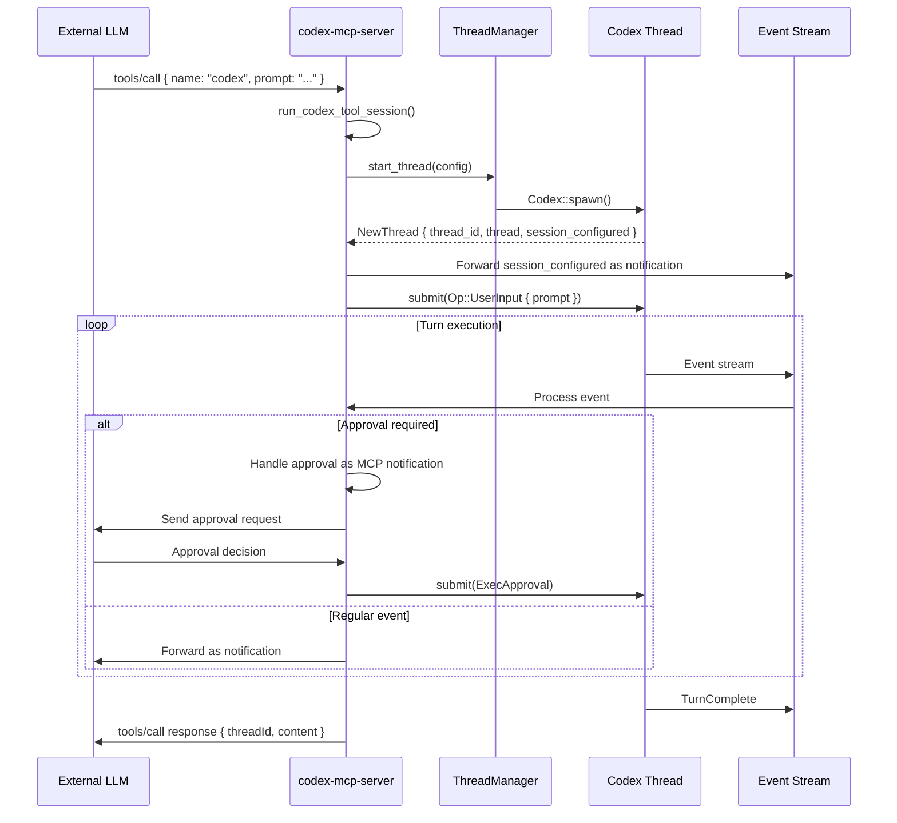

**MCP-Specific Multi-Agent Features**:

- Each `tools/call` invocation spawns an independent Codex thread
- Thread lifecycle is managed by MCP server, not user
- Approval requests are forwarded as MCP notifications to the external LLM
- Thread state persists for follow-up calls using same `threadId`

Sources: [codex-rs/mcp-server/src/codex_tool_runner.rs:59-142]()

---

## Integration with Client Layers

Different client interfaces interact with thread management and event buffering in distinct ways:

| Client         | Thread Management Usage                                  | Event Buffering Usage                                     |
| -------------- | -------------------------------------------------------- | --------------------------------------------------------- |
| **TUI**        | Direct `ThreadManager` calls, picker UIs for resume/fork | Full `ThreadEventStore` for transcript overlay, backtrack |
| **App Server** | `thread/*` JSON-RPC handlers delegate to `ThreadManager` | Minimal buffering (clients maintain own state)            |
| **Exec Mode**  | `ThreadManager::resume()` for `codex exec resume`        | No buffering (one-shot execution)                         |
| **MCP Server** | Embedded thread lifecycle in MCP protocol handlers       | N/A (tools are stateless)                                 |

### TUI-Specific Buffering

The TUI maintains a `ThreadEventChannel` per active session to support:

- **Transcript Overlay** (`Ctrl+T`): Replay all buffered events with live tail
- **Backtrack Operations**: Navigate conversation history without re-fetching from disk
- **Connection Recovery**: Resume from in-memory state on transient errors

Sources: [codex-rs/tui/src/app.rs:322-349](), [codex-rs/app-server/src/lib.rs]()
