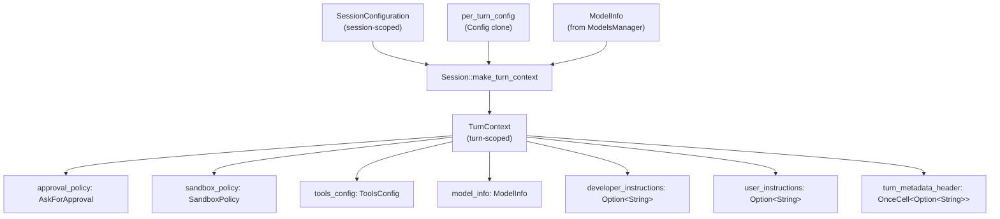
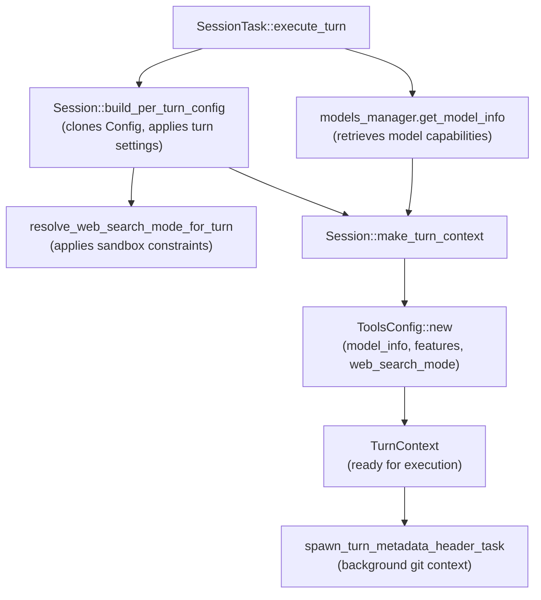
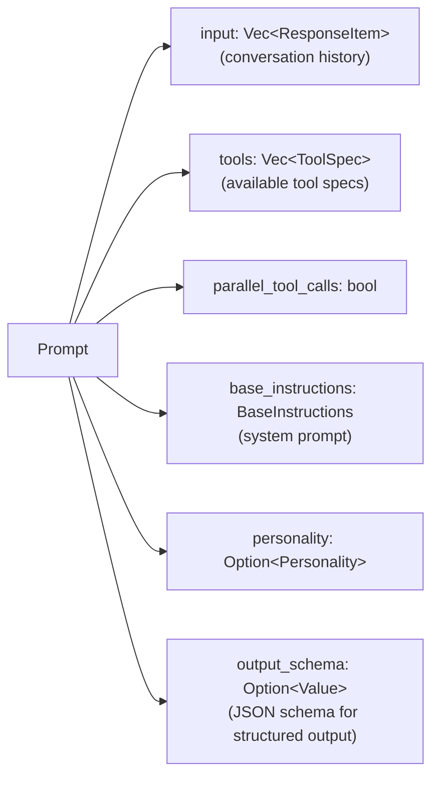
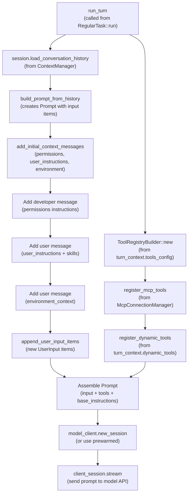
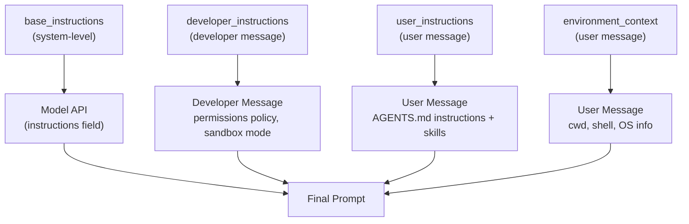
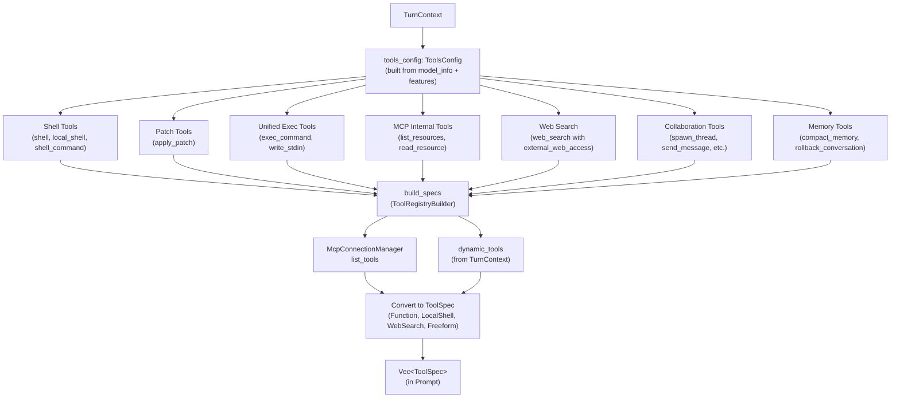
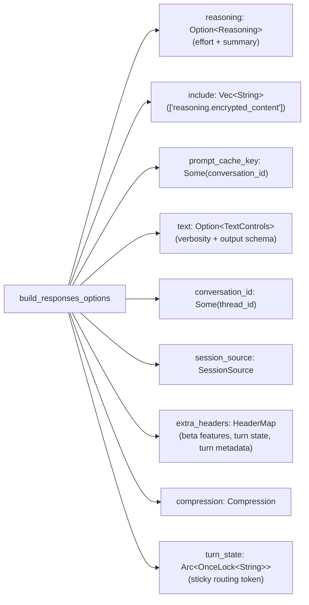
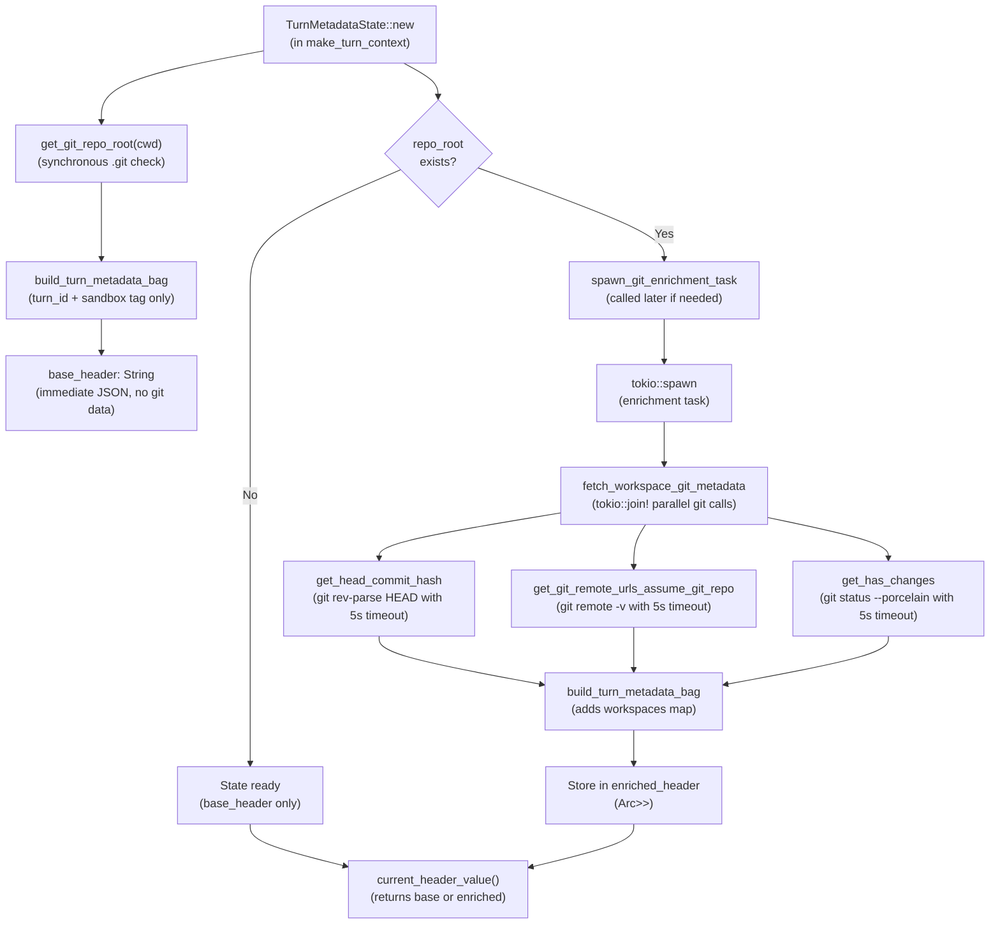

# Turn Execution and Prompt Construction

<details>
<summary>Relevant source files</summary>

The following files were used as context for generating this wiki page:

- [codex-rs/codex-api/src/error.rs](codex-rs/codex-api/src/error.rs)
- [codex-rs/codex-api/src/rate_limits.rs](codex-rs/codex-api/src/rate_limits.rs)
- [codex-rs/core/src/api_bridge.rs](codex-rs/core/src/api_bridge.rs)
- [codex-rs/core/src/client.rs](codex-rs/core/src/client.rs)
- [codex-rs/core/src/client_common.rs](codex-rs/core/src/client_common.rs)
- [codex-rs/core/src/codex.rs](codex-rs/core/src/codex.rs)
- [codex-rs/core/src/error.rs](codex-rs/core/src/error.rs)
- [codex-rs/core/src/rollout/policy.rs](codex-rs/core/src/rollout/policy.rs)
- [codex-rs/core/tests/responses_headers.rs](codex-rs/core/tests/responses_headers.rs)
- [codex-rs/core/tests/suite/client.rs](codex-rs/core/tests/suite/client.rs)
- [codex-rs/core/tests/suite/prompt_caching.rs](codex-rs/core/tests/suite/prompt_caching.rs)
- [codex-rs/exec/src/event_processor.rs](codex-rs/exec/src/event_processor.rs)
- [codex-rs/exec/src/event_processor_with_human_output.rs](codex-rs/exec/src/event_processor_with_human_output.rs)
- [codex-rs/mcp-server/src/codex_tool_runner.rs](codex-rs/mcp-server/src/codex_tool_runner.rs)
- [codex-rs/protocol/src/protocol.rs](codex-rs/protocol/src/protocol.rs)

</details>

This document describes how Codex constructs and executes a single turn. It covers the `TurnContext` structure, prompt assembly (history + tools + instructions), and request construction for the model API. For overall session lifecycle and thread management, see [Codex Interface and Session Lifecycle](#3.1). For how the model client sends requests and handles responses, see [Model Client and API Communication](#3.2). For how response events are processed and state updated, see [Event Processing and State Management](#3.4).

---

## TurnContext: Per-Turn Configuration

Each turn creates a `TurnContext` that holds all configuration, policies, and metadata needed for that specific turn. This allows per-turn overrides and ensures turn-scoped settings don't leak across turn boundaries.

**Structure and Fields**

The `TurnContext` struct contains:

| Field Category      | Key Fields                                                                                          | Purpose                                                   |
| ------------------- | --------------------------------------------------------------------------------------------------- | --------------------------------------------------------- |
| **Identity**        | `sub_id`, `session_source`                                                                          | Unique submission ID, session origin (CLI/TUI/VS Code)    |
| **Model Selection** | `model_info`, `provider`, `reasoning_effort`, `reasoning_summary`                                   | Model capabilities, provider config, reasoning controls   |
| **Policies**        | `approval_policy`, `sandbox_policy`, `windows_sandbox_level`                                        | Execution approval requirements, sandboxing strategy      |
| **Instructions**    | `base_instructions`, `developer_instructions`, `user_instructions`, `compact_prompt`, `personality` | System instructions and personality configuration         |
| **Environment**     | `cwd`, `shell_environment_policy`                                                                   | Working directory, shell environment handling             |
| **Tools**           | `tools_config`, `dynamic_tools`                                                                     | Available tool registry, custom tool specs                |
| **Metadata**        | `turn_metadata_header`, `otel_manager`                                                              | Git context, telemetry tracking                           |
| **State**           | `tool_call_gate`, `truncation_policy`, `final_output_json_schema`                                   | Tool execution readiness, truncation rules, output schema |



**Sources:** [codex-rs/core/src/codex.rs:506-592](), [codex-rs/core/src/codex.rs:785-844]()

---

## TurnContext Construction

The `Session::make_turn_context` function creates a `TurnContext` by combining session configuration with per-turn settings.

**Construction Flow**



**Key Steps:**

1. **Per-Turn Config Clone:** `Session::build_per_turn_config` creates a `Config` clone with turn-specific reasoning effort, reasoning summary, personality, and web search mode resolved against sandbox constraints.

2. **Tools Configuration:** `ToolsConfig::new` determines which tools are available based on model capabilities, enabled features, and web search mode. This registry is passed to the model in the prompt.

3. **Metadata Warmup:** `spawn_turn_metadata_header_task` starts background computation of git context (commit hash, remote URLs) for the `x-codex-turn-metadata` header. This is best-effort and times out after 250ms.

**Sources:** [codex-rs/core/src/codex.rs:729-755](), [codex-rs/core/src/codex.rs:785-844](), [codex-rs/core/src/codex.rs:584-591]()

---

## Prompt Structure

The `Prompt` struct represents the complete API request payload for a single model turn.

**Prompt Fields**



The `input` vector contains the full conversation history in chronological order:

| Item Type                | Purpose                                      | Example                                   |
| ------------------------ | -------------------------------------------- | ----------------------------------------- |
| **Developer message**    | Permissions and policy instructions          | Sandbox mode explanation, approval policy |
| **User message**         | User instructions from `AGENTS.md` or config | Custom instructions, skill definitions    |
| **User message**         | Environment context                          | CWD, shell type, OS version               |
| **User message**         | Initial user input                           | User's request text                       |
| **Assistant message**    | Prior assistant responses                    | Text output, reasoning, function calls    |
| **Function call output** | Tool execution results                       | Shell command output, patch results       |

**Sources:** [codex-rs/core/src/client_common.rs:26-45]()

---

## Prompt Construction Process

Prompt construction happens within the `run_turn` function, which is called by task implementations like `RegularTask::run`. The process assembles history, tools, and instructions into a single `Prompt`.

**High-Level Flow**



**Sources:** [codex-rs/core/src/codex.rs:1000-1500]() (run_turn implementation), [codex-rs/core/src/tasks/regular.rs:86-109]() (RegularTask::run calling run_turn), [codex-rs/core/tests/suite/client.rs:163-372]() (prompt construction in tests)

---

## Instructions Assembly

Instructions are delivered through multiple message types in the prompt input, each with a specific role.

**Instructions Hierarchy**



**Base Instructions:** Set in `SessionConfiguration.base_instructions` at session initialization. Priority order:

1. `config.base_instructions` override
2. Resumed session's `session_meta.base_instructions`
3. Model's default instructions (from `ModelInfo.get_model_instructions(personality)`)

**Developer Instructions:** Injected as the first developer-role message in the input. Contains:

- Permissions policy explanation (sandbox mode, writable paths)
- Approval requirements
- Tool usage guidelines

**User Instructions:** Injected as the second user-role message. Contains:

- `config.user_instructions` (from `~/.codex/config.toml` or `AGENTS.md`)
- Skills injections (skill summaries and metadata)

**Environment Context:** Injected as the third user-role message. Contains:

- Current working directory
- Shell type and version
- Operating system and architecture
- Writable root paths (when sandboxed)

**Sources:** [codex-rs/core/src/codex.rs:336-348]() (base_instructions resolution), [codex-rs/core/tests/suite/client.rs:605-668]() (user_instructions test), [codex-rs/core/tests/suite/client.rs:422-465]() (base_instructions override test)

---

## Tool Selection and Formatting

Tools are selected based on model capabilities and feature flags, then converted to the appropriate API format.

**Tool Selection Flow**



**Tool Spec Types:**

| ToolSpec Variant       | API Type              | Example Tools                                                                     |
| ---------------------- | --------------------- | --------------------------------------------------------------------------------- |
| `ToolSpec::Function`   | `type: "function"`    | `shell`, `apply_patch`, MCP tools (with qualified names like `mcp__server__tool`) |
| `ToolSpec::LocalShell` | `type: "local_shell"` | Native local shell execution                                                      |
| `ToolSpec::WebSearch`  | `type: "web_search"`  | Web search with `external_web_access` flag                                        |
| `ToolSpec::Freeform`   | `type: "custom"`      | Custom tools with freeform input format                                           |

**MCP Tool Qualification:** MCP tool names are qualified with the server name prefix to avoid collisions: `mcp__<server_name>__<tool_name>`. Names are sanitized to match OpenAI API requirements (`^[a-zA-Z0-9_-]+$`).

**Sources:** [codex-rs/core/src/tools/spec.rs]() (ToolsConfig and build_specs), [codex-rs/core/src/client_common.rs:161-223]() (ToolSpec variants), [codex-rs/core/src/mcp_connection_manager.rs]() (MCP tool qualification)

---

## Request Options Construction

`ModelClientSession::build_responses_options` assembles request-scoped headers and options for the Responses API.

**Request Options Fields**



**Key Options:**

- **reasoning:** Constructed only if model supports reasoning summaries. Contains `effort` (from `TurnContext.reasoning_effort` or model default) and `summary` (from `TurnContext.reasoning_summary`).

- **text:** Contains `verbosity` (if model supports it) and optional `format` with JSON schema (if `final_output_json_schema` is set). The schema uses strict mode validation.

- **extra_headers:** Includes:
  - `x-codex-beta-features`: Comma-separated list of enabled experimental features (computed at session creation)
  - `x-codex-turn-state`: Sticky routing token (replayed within the same turn, cleared between turns)
  - `x-codex-turn-metadata`: Git context (commit hash, remote URLs) computed with 250ms timeout

- **compression:** Enabled if `enable_request_compression` feature is active. Compresses request payload with zstd.

**Sources:** [codex-rs/core/src/client.rs:586-656]()

---

## Turn Metadata Header Construction

The `x-codex-turn-metadata` header provides git context to the model API. Construction uses a two-phase approach: immediate base metadata, then optional asynchronous git enrichment.

**Metadata Construction Flow**



**Usage Pattern:**

When `ModelClientSession` needs the metadata header:

1. It calls `turn_metadata_state.current_header_value()`
2. This returns the enriched header if ready, otherwise the base header
3. No blocking—git enrichment runs in background and may not complete before first API call

Each git command has a 5-second timeout (`GIT_COMMAND_TIMEOUT` in git_info.rs) to prevent hanging on large repos.

**Metadata JSON Structure:**

```json
{
  "turn_id": "abc-123",
  "sandbox": "workspace_write",
  "workspaces": {
    "/path/to/repo": {
      "associated_remote_urls": {
        "origin": "https://github.com/openai/codex.git"
      },
      "latest_git_commit_hash": "abc123...",
      "has_changes": false
    }
  }
}
```

**Sources:** [codex-rs/core/src/turn_metadata.rs:130-236]() (TurnMetadataState), [codex-rs/core/src/git_info.rs:47-261]() (git command timeouts and parallel execution)

---

## Turn Execution Flow Integration

This section shows how prompt construction integrates with the overall turn execution flow from submission through response processing.

**Complete Turn Flow**

```mermaid
graph TD
    UserInput["Op::UserInput<br/>(submitted via Codex::submit)"]

    UserInput --> SubmissionLoop["submission_loop<br/>(processes rx_sub channel)"]

    SubmissionLoop --> HandleUserTurn["handle Op::UserInput<br/>(dispatch to task)"]

    HandleUserTurn --> CreateTask["RegularTask::default<br/>(or take startup_regular_task)"]

    CreateTask --> SpawnTask["Session::spawn_task<br/>(wraps task in Arc<dyn SessionTask>)"]

    SpawnTask --> MakeTurnContext["Session::make_turn_context<br/>(combines SessionConfiguration + per_turn_config)"]

    MakeTurnContext --> TaskRun["tokio::spawn<br/>(task.run in background)"]

    TaskRun --> RegularRun["RegularTask::run<br/>(takes prewarmed_session)"]

    RegularRun --> RunTurn["run_turn<br/>(main turn execution logic)"]

    RunTurn --> BuildPrompt["build_prompt<br/>(history + tools + instructions)"]

    BuildPrompt --> CreateClientSession["model_client.new_session<br/>(or use prewarmed_session)"]

    CreateClientSession --> StreamCall["client_session.stream<br/>(sends prompt to model API)"]

    StreamCall --> BuildRequest["build_responses_request<br/>(convert to wire format)"]
    BuildRequest --> BuildOptions["build_responses_options<br/>(headers, reasoning, compression)"]

    BuildOptions --> SendRequest["HTTP POST or WebSocket send<br/>(to provider API endpoint)"]

    SendRequest --> ResponseStream["ResponseStream<br/>(iterate ResponseEvent)"]

    ResponseStream --> HandleResponse["handle_response_item<br/>(process each event)"]

    HandleResponse --> ToolRouter["ToolRouter::handle_function_call<br/>(execute tools)"]
    ToolRouter --> EmitEvent["Session::send_event<br/>(publish EventMsg)"]

    EmitEvent --> TurnComplete["EventMsg::TurnComplete<br/>(signal completion)"]
```



**Sources:** [codex-rs/core/src/codex.rs:1200-1400]() (submission_loop), [codex-rs/core/src/tasks/mod.rs:116-184]() (Session::spawn_task), [codex-rs/core/src/tasks/regular.rs:86-109]() (RegularTask::run)

---

## Key Configuration Points

**Session-Scoped (SessionConfiguration):**

- `base_instructions`: System prompt text (resolved at session init)
- `developer_instructions`: Developer message content
- `user_instructions`: User message content
- `personality`: Personality preference
- `compact_prompt`: Custom compaction instructions
- `approval_policy`: When to request approval (constrained by requirements)
- `sandbox_policy`: Sandboxing strategy (constrained by requirements)
- `cwd`: Working directory for the session
- `dynamic_tools`: Custom tool specs (persisted and restored on resume)

**Turn-Scoped (TurnContext):**

- `model_info`: Model capabilities (from ModelsManager)
- `reasoning_effort`: Reasoning level override (from collaboration_mode)
- `reasoning_summary`: Summary verbosity (Concise/Detailed/None)
- `tools_config`: Available tools (determined by model + features)
- `final_output_json_schema`: Structured output schema
- `turn_metadata_header`: Git context (computed asynchronously)

**Request-Scoped (ApiResponsesOptions):**

- `reasoning`: Effort + summary config (sent to API)
- `text`: Verbosity + output schema (sent to API)
- `extra_headers`: Beta features, turn state, turn metadata
- `compression`: Request compression (zstd)
- `turn_state`: Sticky routing token (for retry/append within turn)

**Sources:** [codex-rs/core/src/codex.rs:594-686]() (SessionConfiguration), [codex-rs/core/src/codex.rs:506-592]() (TurnContext), [codex-rs/core/src/client.rs:591-656]() (ApiResponsesOptions)
