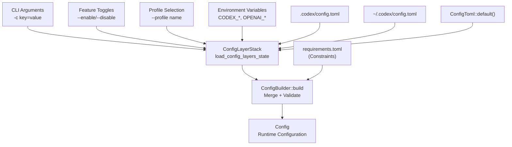
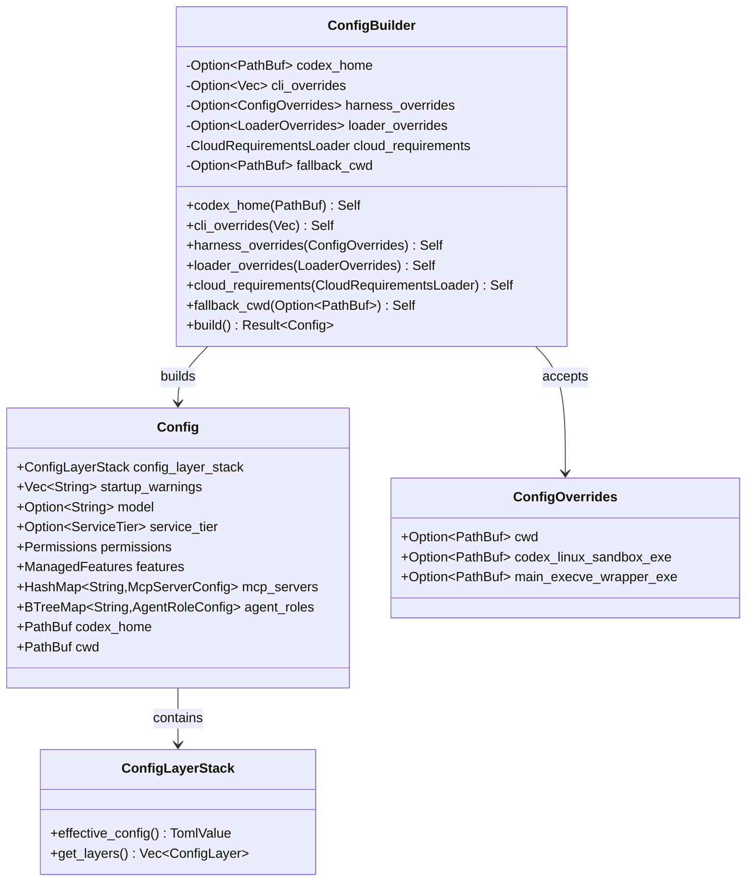
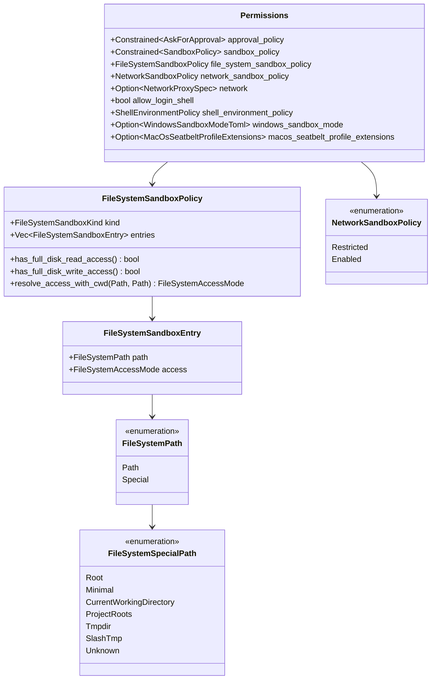
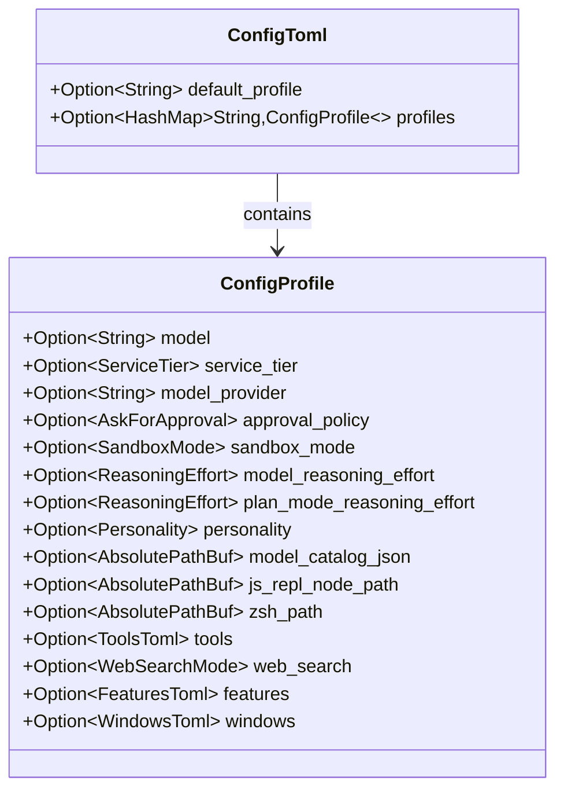
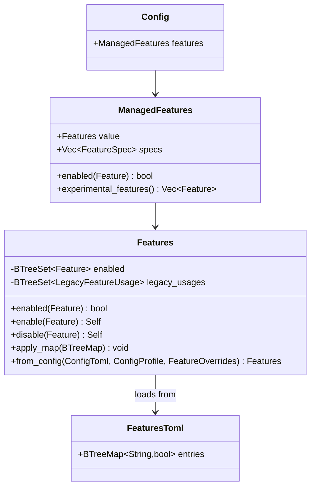
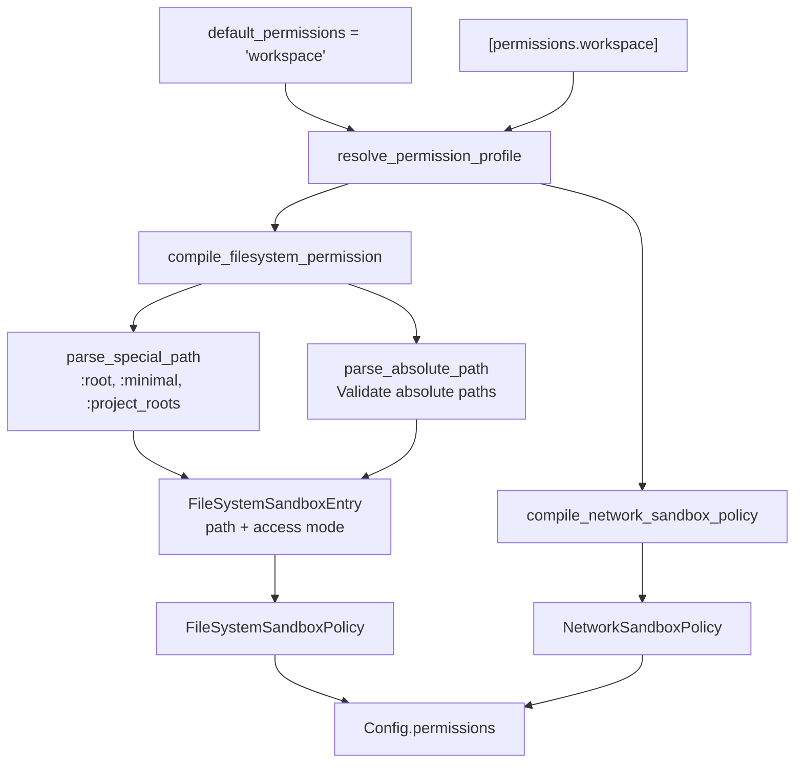
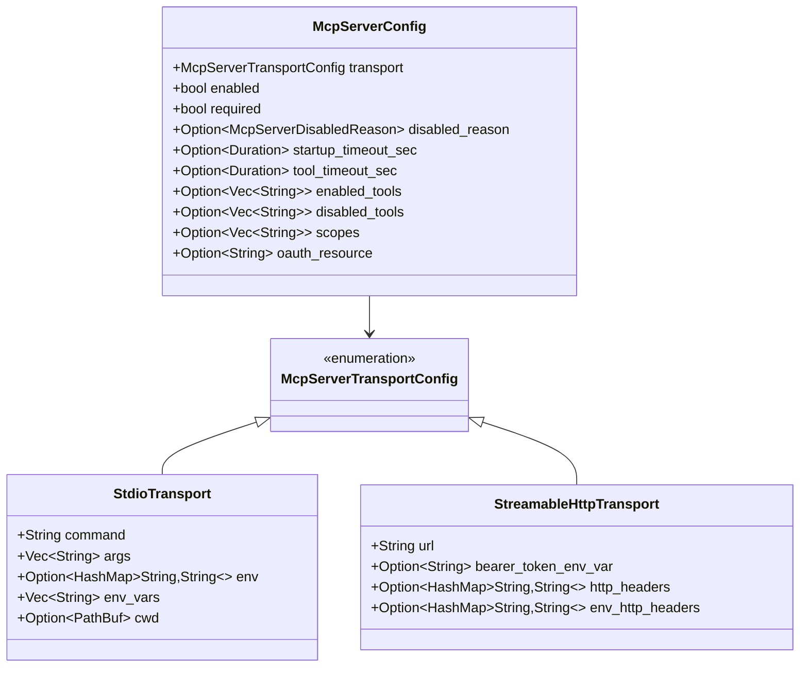
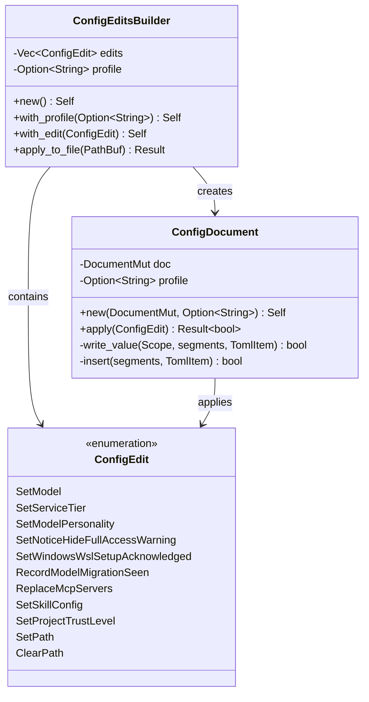
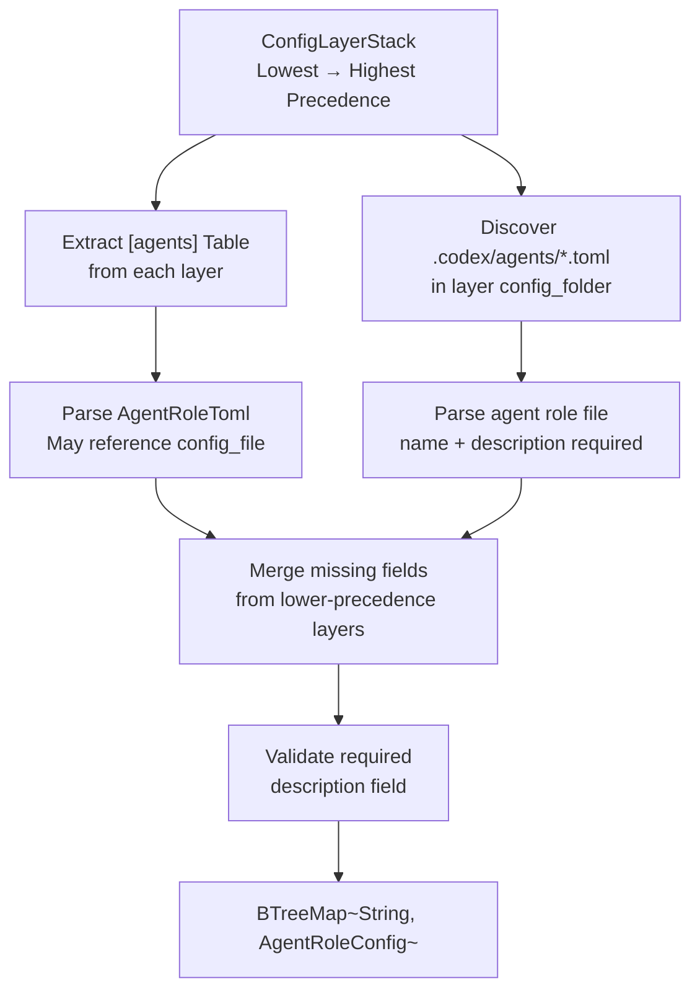
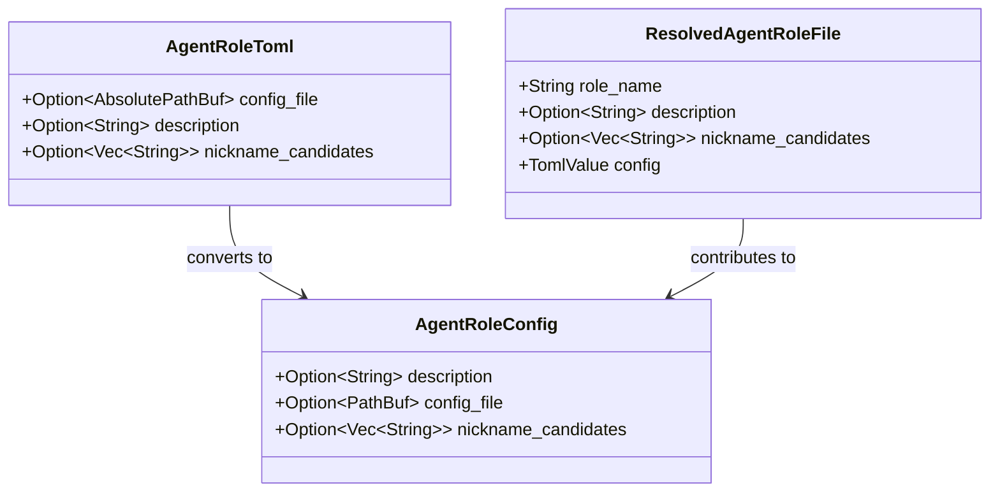

# Configuration System

<details>
<summary>Relevant source files</summary>

The following files were used as context for generating this wiki page:

- [codex-rs/core/config.schema.json](codex-rs/core/config.schema.json)
- [codex-rs/core/src/config/agent_roles.rs](codex-rs/core/src/config/agent_roles.rs)
- [codex-rs/core/src/config/config_tests.rs](codex-rs/core/src/config/config_tests.rs)
- [codex-rs/core/src/config/edit.rs](codex-rs/core/src/config/edit.rs)
- [codex-rs/core/src/config/mod.rs](codex-rs/core/src/config/mod.rs)
- [codex-rs/core/src/config/permissions.rs](codex-rs/core/src/config/permissions.rs)
- [codex-rs/core/src/config/profile.rs](codex-rs/core/src/config/profile.rs)
- [codex-rs/core/src/config/types.rs](codex-rs/core/src/config/types.rs)
- [codex-rs/core/src/features.rs](codex-rs/core/src/features.rs)
- [codex-rs/core/src/features/legacy.rs](codex-rs/core/src/features/legacy.rs)
- [codex-rs/protocol/src/permissions.rs](codex-rs/protocol/src/permissions.rs)
- [docs/config.md](docs/config.md)
- [docs/example-config.md](docs/example-config.md)
- [docs/skills.md](docs/skills.md)
- [docs/slash_commands.md](docs/slash_commands.md)

</details>

## Purpose and Scope

The Configuration System manages all runtime settings for Codex, including model selection, sandbox policies, feature flags, MCP server connections, and permission profiles. It implements a layered configuration model where settings from multiple sources (CLI arguments, environment variables, project files, global files, and built-in defaults) are merged with well-defined precedence rules.

For feature flag management specifically, see [Feature Flags](#2.3). For sandbox execution policies, see [Sandbox and Approval Policies](#2.4).

---

## Configuration Architecture

### Configuration Sources and Precedence

Configuration is assembled from 7 layers, each with decreasing precedence:

| Priority | Layer                 | Source                                       | Scope          |
| -------- | --------------------- | -------------------------------------------- | -------------- |
| 1        | CLI Arguments         | `--enable`, `-c key=value`, `--profile`      | Per-invocation |
| 2        | Feature Toggles       | Runtime experimental menu, feature overrides | Session        |
| 3        | Active Profile        | `--profile name` or `default_profile`        | Profile-scoped |
| 4        | Environment Variables | `CODEX_*`, `OPENAI_*`, `SQLITE_HOME_ENV`     | Process        |
| 5        | Project Config        | `.codex/config.toml` in project root         | Project        |
| 6        | Global Config         | `~/.codex/config.toml`                       | User           |
| 7        | Built-in Defaults     | Hardcoded in `ConfigToml::default()`         | System         |

Sources: [codex-rs/core/src/config/mod.rs:546-642]()

### Configuration Layer Merging



**Diagram: Configuration Layer Merging Flow**

The `ConfigLayerStack` merges TOML values from all sources using `merge_toml_values`, where higher-priority layers override lower-priority ones. The `ConfigBuilder` then validates the merged configuration against `requirements.toml` constraints (e.g., MCP server allowlists for enterprise deployments).

Sources: [codex-rs/core/src/config/mod.rs:587-641]()

---

## ConfigBuilder and Loading Process

### ConfigBuilder Pattern

The `ConfigBuilder` provides a fluent API for constructing validated `Config` instances:



**Diagram: ConfigBuilder and Config Relationship**

### Build Process

The `ConfigBuilder::build()` method orchestrates configuration loading:

1. **Resolve Paths**: Determine `codex_home` (via `CODEX_HOME` env or `~/.codex`) and `cwd` (from overrides or current directory)
2. **Load Layers**: Call `load_config_layers_state()` to read all configuration files and merge them into a `ConfigLayerStack`
3. **Deserialize**: Convert merged TOML into `ConfigToml` using `AbsolutePathBufGuard` to resolve relative paths against config file locations
4. **Apply Constraints**: Validate against `requirements.toml` using `apply_requirement_constrained_value()`
5. **Construct Config**: Call `Config::load_config_with_layer_stack()` to build final runtime configuration

Sources: [codex-rs/core/src/config/mod.rs:587-641](), [codex-rs/core/src/config/mod.rs:644-694]()

---

## The Config Struct

### Primary Fields

The `Config` struct contains all runtime configuration:

| Field Category  | Key Fields                                                                          | Description                                                    |
| --------------- | ----------------------------------------------------------------------------------- | -------------------------------------------------------------- |
| **Provenance**  | `config_layer_stack`, `startup_warnings`                                            | Configuration sources and load warnings                        |
| **Model**       | `model`, `service_tier`, `review_model`, `model_provider`, `model_reasoning_effort` | Model selection and behavior                                   |
| **Permissions** | `permissions`                                                                       | Sandbox policies, approval policies, filesystem/network access |
| **Features**    | `features`                                                                          | Centralized feature flag state                                 |
| **Tools**       | `mcp_servers`, `web_search_mode`, `web_search_config`                               | External tool configuration                                    |
| **Paths**       | `codex_home`, `sqlite_home`, `log_dir`, `cwd`                                       | Filesystem locations                                           |
| **Agents**      | `agent_roles`, `agent_max_threads`, `agent_max_depth`                               | Multi-agent settings                                           |
| **UI**          | `tui_alternate_screen`, `tui_theme`, `tui_status_line`                              | TUI preferences                                                |
| **Memories**    | `memories`                                                                          | Memory subsystem configuration                                 |

Sources: [codex-rs/core/src/config/mod.rs:163-544]()

### Permissions Substructure

The `Permissions` field contains all security-related settings:



**Diagram: Permissions Configuration Structure**

Sources: [codex-rs/core/src/config/mod.rs:163-195](), [codex-rs/protocol/src/permissions.rs:1-600]()

---

## Configuration Profiles

### Profile Definition

Configuration profiles group related settings that can be activated together via `--profile name` or the `default_profile` setting.



**Diagram: Configuration Profile Structure**

Profile settings take precedence over global config but are overridden by CLI arguments. Profiles enable quick switching between development and production configurations or between different model providers.

Sources: [codex-rs/core/src/config/profile.rs:1-78]()

### Profile Application Example

```toml
# ~/.codex/config.toml
default_profile = "dev"

[profiles.dev]
model = "gpt-4o"
approval_policy = "on-request"
sandbox_mode = "workspace-write"

[profiles.prod]
model = "gpt-4o-mini"
approval_policy = "never"
sandbox_mode = "read-only"
```

Activate with `codex --profile prod` or set `default_profile = "prod"`.

Sources: [codex-rs/core/src/config/profile.rs:17-63]()

---

## Feature Flag System

Feature flags control experimental and optional functionality. See [Feature Flags](#2.3) for full details on the lifecycle and management. This section covers configuration integration.

### Feature Storage in Config



**Diagram: Feature Flag Configuration Integration**

### Feature Loading Order

1. Start with `Features::with_defaults()` (built-in default states from `FEATURES` array)
2. Apply legacy toggles from `ConfigToml` (e.g., `experimental_use_unified_exec_tool`)
3. Apply `[features]` table from global config
4. Apply legacy toggles from active `ConfigProfile`
5. Apply `[features]` table from active profile
6. Apply `FeatureOverrides` from code (e.g., for `codex exec` mode)
7. Normalize dependencies (e.g., `spawn_csv` requires `collab`)

Sources: [codex-rs/core/src/features.rs:390-439]()

---

## Permissions System

### Permission Profiles

Permission profiles define filesystem and network access policies that can be referenced by name:

```toml
# ~/.codex/config.toml
default_permissions = "workspace"

[permissions.workspace.filesystem]
":minimal" = "read"

[permissions.workspace.filesystem.":project_roots"]
"." = "write"
"docs" = "read"

[permissions.workspace.network]
enabled = true
proxy_url = "http://127.0.0.1:43128"
allowed_domains = ["openai.com"]
```

Sources: [codex-rs/core/src/config/permissions.rs:21-136]()

### Permission Profile Compilation



**Diagram: Permission Profile Compilation Flow**

The `compile_permission_profile()` function resolves named profiles into concrete policies:

1. **Lookup Profile**: Find profile by name in `PermissionsToml.entries`
2. **Compile Filesystem Entries**: Parse each filesystem entry (`:special` paths or absolute paths) into `FileSystemSandboxEntry`
3. **Compile Network Policy**: Convert `NetworkToml.enabled` into `NetworkSandboxPolicy`
4. **Construct Proxy Config**: If network enabled, build `NetworkProxySpec` from proxy settings
5. **Project Legacy Policy**: Convert modern policy back to legacy `SandboxPolicy` for compatibility

Sources: [codex-rs/core/src/config/permissions.rs:147-225](), [codex-rs/core/src/config/mod.rs:1450-1585]()

### Special Filesystem Paths

Special paths provide symbolic references that resolve at runtime:

| Special Path               | Resolves To                         | Description                    |
| -------------------------- | ----------------------------------- | ------------------------------ |
| `:root`                    | `/` (Unix) or drive roots (Windows) | Full filesystem access         |
| `:minimal`                 | Platform-specific safe paths        | Shell config, common libraries |
| `:project_roots`           | Git repo roots or cwd               | Project workspace roots        |
| `:project_roots."subpath"` | `<project_root>/subpath`            | Scoped project subpath         |
| `:tmpdir`                  | `$TMPDIR` or `/tmp`                 | Temporary directory            |
| `:slash_tmp`               | `/tmp`                              | Unix temporary directory       |

Forward compatibility: Unknown special paths (`:unknown_future_path`) are preserved as `FileSystemSpecialPath::Unknown` so older Codex versions don't reject newer config files.

Sources: [codex-rs/core/src/config/permissions.rs:275-289](), [codex-rs/protocol/src/permissions.rs:74-115]()

---

## MCP Server Configuration

### MCP Server Definition

MCP servers are defined in `[mcp_servers.<name>]` tables with transport-specific fields:

```toml
# ~/.codex/config.toml
[mcp_servers.filesystem]
command = "npx"
args = ["-y", "@modelcontextprotocol/server-filesystem", "/home/user/data"]
enabled = true
startup_timeout_sec = 30.0
enabled_tools = ["read_file", "write_file"]

[mcp_servers.github]
url = "https://github-mcp.example.com/v1"
bearer_token_env_var = "GITHUB_TOKEN"
http_headers = { "X-Custom-Header" = "value" }
scopes = ["repo", "user"]
```

Sources: [codex-rs/core/src/config/types.rs:63-237]()

### MCP Transport Types



**Diagram: MCP Server Configuration Structure**

### Requirements-Based Filtering

Enterprise deployments can enforce MCP server allowlists via `requirements.toml`:

```toml
# requirements.toml
[mcp_servers.filesystem]
identity = { command = "npx" }

[mcp_servers.github]
identity = { url = "https://github-mcp.example.com/v1" }
```

The `filter_mcp_servers_by_requirements()` function disables servers not in the allowlist, setting `disabled_reason = McpServerDisabledReason::Requirements`.

Sources: [codex-rs/core/src/config/mod.rs:766-804]()

---

## Configuration Editing and Persistence

### ConfigEdit Operations

The `ConfigEdit` enum defines atomic configuration mutations:



**Diagram: Configuration Editing Architecture**

### Edit Application Process

1. **Load Document**: Read `config.toml` as `toml_edit::DocumentMut` to preserve formatting
2. **Apply Edits**: Call `ConfigDocument::apply()` for each edit
   - `SetPath` / `ClearPath`: Navigate segments, insert/remove value
   - `SetModel`: Write to profile if active, else global scope
   - `ReplaceMcpServers`: Serialize MCP configs, replace entire `[mcp_servers]` table
3. **Write Atomically**: Use `write_atomically()` to prevent corruption

Sources: [codex-rs/core/src/config/edit.rs:22-60](), [codex-rs/core/src/config/edit.rs:314-432]()

### Atomic Write Strategy

```rust
// codex-rs/core/src/config/edit.rs
pub async fn apply_blocking(edits: Vec<ConfigEdit>, config_path: PathBuf, profile: Option<String>) {
    let (final_path, temp_path) = resolve_symlink_write_paths(&config_path);
    let mut doc = load_document(&final_path)?;
    let mut config_doc = ConfigDocument::new(doc, profile);

    for edit in edits {
        config_doc.apply(&edit)?;
    }

    write_atomically(&final_path, &temp_path, config_doc.doc.to_string().as_bytes())?;
}
```

This ensures configuration changes are all-or-nothing, preventing partial updates from leaving the system in an inconsistent state.

Sources: [codex-rs/core/src/config/edit.rs:620-683]()

---

## Agent Roles Configuration

### Role Discovery and Declaration

Agent roles can be declared explicitly in `[agents.<role_name>]` tables or auto-discovered from `.codex/agents/*.toml` files:

```toml
# ~/.codex/config.toml
[agents]
max_threads = 6
max_depth = 1

[agents.researcher]
description = "Research and summarize technical topics"
config_file = "~/.codex/agents/researcher.toml"

[agents.reviewer]
description = "Code review specialist"
nickname_candidates = ["reviewer", "review-bot"]
```

```toml
# .codex/agents/researcher.toml
name = "researcher"
description = "Research and summarize technical topics"
developer_instructions = "You are a research assistant..."
model = "gpt-4o"
```

Sources: [codex-rs/core/src/config/agent_roles.rs:18-106]()

### Role Loading Process



**Diagram: Agent Role Loading and Merging**

The `load_agent_roles()` function processes configuration layers in order:

1. **Per-Layer Processing**:
   - Extract `[agents]` table and parse declared roles
   - Discover `.toml` files in `.codex/agents/` directory
   - Track `config_file` paths to avoid duplicate discovery
2. **Role Merging**:
   - If role name exists in lower-precedence layer, merge missing fields
   - Higher-precedence layers override lower ones
3. **Validation**:
   - Ensure `description` is present (required for spawn tool guidance)
   - Validate `nickname_candidates` format (ASCII alphanumeric + space/hyphen/underscore)

Sources: [codex-rs/core/src/config/agent_roles.rs:17-106](), [codex-rs/core/src/config/agent_roles.rs:212-305]()

### AgentRoleConfig Structure



**Diagram: Agent Role Configuration Types**

Agent role files combine role metadata with configuration overrides. The `config` field contains profile-like settings (model, features, permissions) that apply when spawning agents with that role.

Sources: [codex-rs/core/src/config/agent_roles.rs:194-292]()

---

## Configuration Schema and Validation

### JSON Schema Generation

The configuration schema is generated from Rust types using `schemars`:

```rust
// codex-rs/core/src/config/schema.rs
pub fn generate_config_schema() -> serde_json::Value {
    let settings = SchemaSettings::draft07().with(|s| {
        s.option_nullable = false;
        s.option_add_null_type = false;
    });
    let gen = settings.into_generator();
    gen.into_root_schema_for::<ConfigToml>()
}
```

The schema file `codex-rs/core/config.schema.json` is used by:

- IDE extensions for config.toml autocompletion
- Documentation generators for reference docs
- Validation tools to catch config errors early

Sources: [codex-rs/core/config.schema.json:1-10]()

### Constraint Validation

The `Constrained<T>` wrapper enforces requirements:

```rust
pub struct Constrained<T> {
    value: T,
    constraint: Option<ConstraintFn<T>>,
    source: Option<RequirementSource>,
}

impl<T> Constrained<T> {
    pub fn set(&mut self, value: T) -> ConstraintResult<()> {
        if let Some(constraint) = &self.constraint {
            constraint(&value)?;
        }
        self.value = value;
        Ok(())
    }
}
```

Used for fields like `approval_policy`, `sandbox_policy`, `web_search_mode`, and `mcp_servers` where enterprise requirements may restrict allowed values.

Sources: [codex-rs/core/src/config/mod.rs:806-839]()

---

## Configuration Loading Patterns

### Primary Loading Methods

| Method                                                    | Use Case                            | Applies Requirements |
| --------------------------------------------------------- | ----------------------------------- | -------------------- |
| `Config::load_with_cli_overrides()`                       | Standard TUI/CLI startup            | ✓ Yes                |
| `Config::load_with_cli_overrides_and_harness_overrides()` | Test harnesses, exec mode           | ✓ Yes                |
| `Config::load_default_with_cli_overrides()`               | Fallback when user config invalid   | ✗ No (safe defaults) |
| `ConfigBuilder::default().build()`                        | Custom loading with builder pattern | ✓ Yes                |

Sources: [codex-rs/core/src/config/mod.rs:644-694]()

### Path Resolution Strategy

Relative paths in config files are resolved against the config file's parent directory using `AbsolutePathBufGuard`:

```rust
pub(crate) fn deserialize_config_toml_with_base(
    root_value: TomlValue,
    config_base_dir: &Path,
) -> std::io::Result<ConfigToml> {
    let _guard = AbsolutePathBufGuard::new(config_base_dir);
    root_value.try_into()
        .map_err(|e| std::io::Error::new(std::io::ErrorKind::InvalidData, e))
}
```

This ensures paths like `model_instructions_file = "instructions.txt"` in `~/.codex/config.toml` resolve to `~/.codex/instructions.txt`, while the same setting in `.codex/config.toml` resolves to `.codex/instructions.txt`.

Sources: [codex-rs/core/src/config/mod.rs:723-733]()

---

## Key Configuration Utilities

### Finding Codex Home

```rust
pub fn find_codex_home() -> std::io::Result<PathBuf> {
    std::env::var_os("CODEX_HOME")
        .map(PathBuf::from)
        .or_else(|| dirs::home_dir().map(|h| h.join(".codex")))
        .ok_or_else(|| std::io::Error::new(
            std::io::ErrorKind::NotFound,
            "could not determine CODEX_HOME"
        ))
}
```

Sources: [codex-rs/core/src/config/mod.rs:138-151]()

### SQLite Home Resolution

SQLite state database location follows this precedence:

1. `CODEX_SQLITE_HOME` environment variable
2. `WorkspaceWrite` mode: temp directory (per-session isolation)
3. Other modes: `CODEX_HOME` (persistent state)

Sources: [codex-rs/core/src/config/mod.rs:139-151](), [docs/config.md:33-37]()

### Project Trust Level Management

Projects can be marked as trusted/untrusted via `[projects."<path>"]` tables:

```toml
# ~/.codex/config.toml
[projects."/home/user/work/safe-project"]
trust_level = "trusted"

[projects."/tmp/untrusted"]
trust_level = "untrusted"
```

The `set_project_trust_level_inner()` function migrates inline tables to explicit tables for better formatting.

Sources: [codex-rs/core/src/config/mod.rs:917-973]()

---

## Configuration File Locations

| File                     | Purpose                    | Schema                 |
| ------------------------ | -------------------------- | ---------------------- |
| `~/.codex/config.toml`   | Global user configuration  | Full `ConfigToml`      |
| `.codex/config.toml`     | Project-specific overrides | Full `ConfigToml`      |
| `~/.codex/agents/*.toml` | Agent role definitions     | `RawAgentRoleFileToml` |
| `.codex/agents/*.toml`   | Project agent roles        | `RawAgentRoleFileToml` |
| `requirements.toml`      | Enterprise constraints     | Cloud-provided         |

Sources: [codex-rs/core/src/config/mod.rs:137](), [docs/config.md:1-11]()
