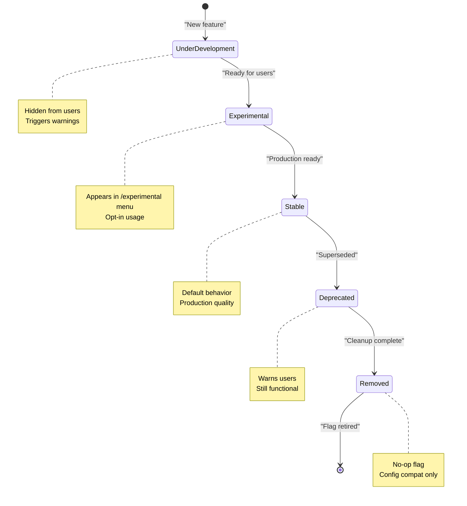
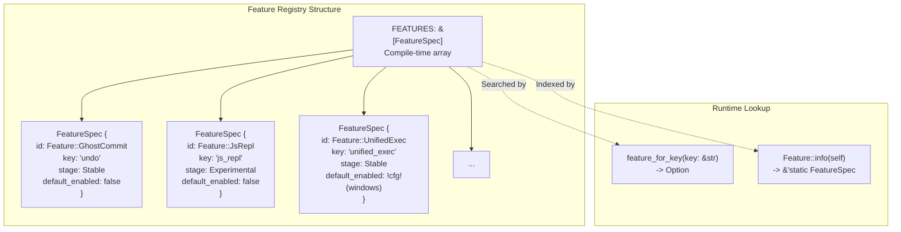
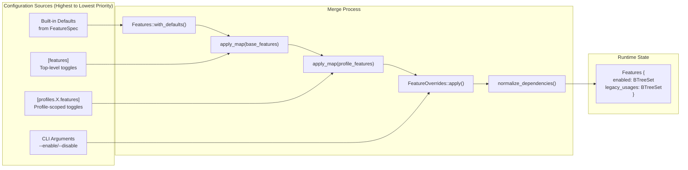
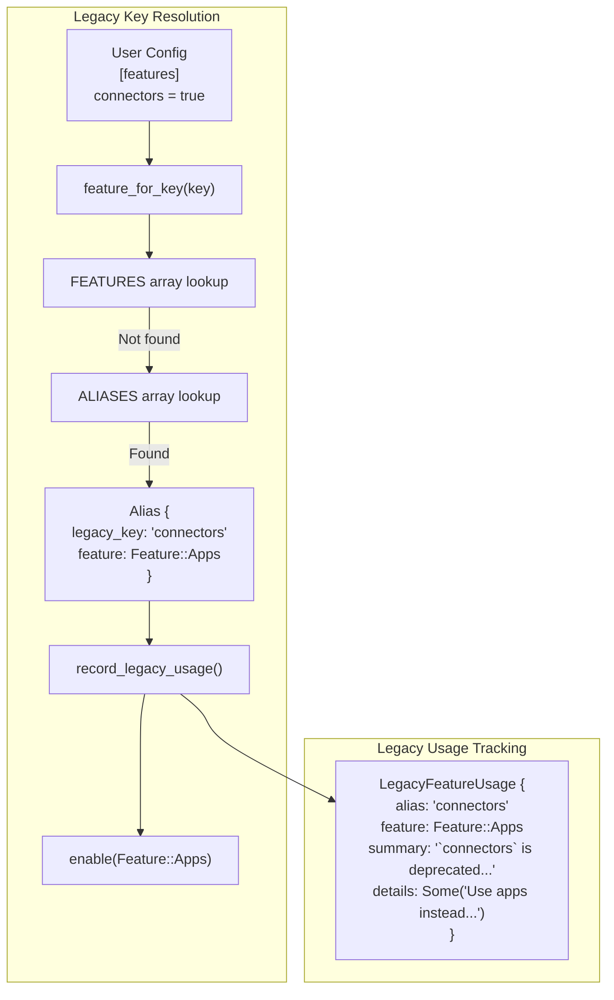
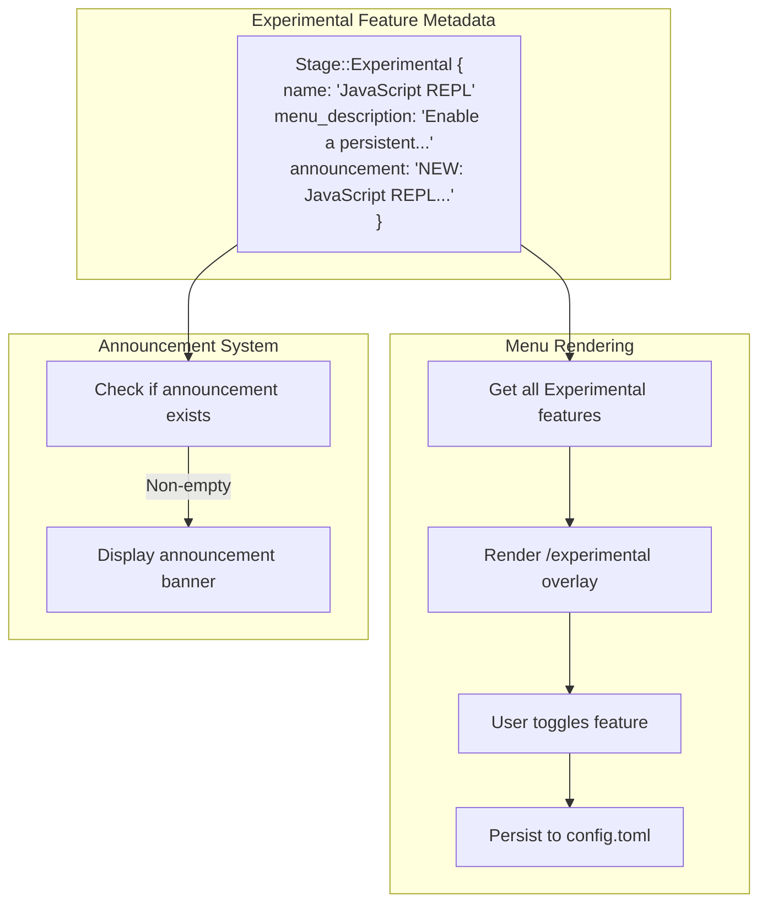

# Feature Flags

<details>
<summary>Relevant source files</summary>

The following files were used as context for generating this wiki page:

- [codex-rs/core/config.schema.json](codex-rs/core/config.schema.json)
- [codex-rs/core/src/config/agent_roles.rs](codex-rs/core/src/config/agent_roles.rs)
- [codex-rs/core/src/config/config_tests.rs](codex-rs/core/src/config/config_tests.rs)
- [codex-rs/core/src/config/edit.rs](codex-rs/core/src/config/edit.rs)
- [codex-rs/core/src/config/mod.rs](codex-rs/core/src/config/mod.rs)
- [codex-rs/core/src/config/permissions.rs](codex-rs/core/src/config/permissions.rs)
- [codex-rs/core/src/config/profile.rs](codex-rs/core/src/config/profile.rs)
- [codex-rs/core/src/config/types.rs](codex-rs/core/src/config/types.rs)
- [codex-rs/core/src/features.rs](codex-rs/core/src/features.rs)
- [codex-rs/core/src/features/legacy.rs](codex-rs/core/src/features/legacy.rs)
- [codex-rs/protocol/src/permissions.rs](codex-rs/protocol/src/permissions.rs)
- [docs/config.md](docs/config.md)
- [docs/example-config.md](docs/example-config.md)
- [docs/skills.md](docs/skills.md)
- [docs/slash_commands.md](docs/slash_commands.md)

</details>

This document describes the feature flag system used throughout Codex to gate experimental, optional, and platform-specific functionality. Feature flags enable progressive feature rollout through well-defined lifecycle stages and provide users with fine-grained control over which capabilities are active in their sessions.

For information about configuring individual features, see the configuration reference documentation. For details on how features integrate with profiles and config layers, see [Configuration System](#2.2).

---

## Overview

The feature flag system centralizes toggles for experimental and optional behavior across the codebase. Instead of scattering boolean configuration fields throughout multiple modules, Codex defines all features in a single registry (`FEATURES` array) with consistent metadata including lifecycle stage, default state, and canonical key.

Features are managed through the `Features` struct ([features.rs:223-227]()), which maintains an enabled set and tracks legacy usage patterns for deprecation warnings. The system supports multiple configuration sources with well-defined precedence, automatic dependency resolution, and graceful handling of deprecated feature keys.

**Sources:** [codex-rs/core/src/features.rs:1-920]()

---

## Feature Lifecycle Stages

Each feature progresses through a defined lifecycle, represented by the `Stage` enum. The stage determines visibility, stability guarantees, and user-facing presentation.



### Stage Definitions

| Stage              | Visibility           | Default State | Purpose                                           |
| ------------------ | -------------------- | ------------- | ------------------------------------------------- |
| `UnderDevelopment` | Internal only        | `false`       | Active development, not ready for external use    |
| `Experimental`     | `/experimental` menu | `false`       | User-facing but unstable, opt-in required         |
| `Stable`           | Standard config      | Varies        | Production-ready, may be enabled by default       |
| `Deprecated`       | Standard config      | `false`       | Superseded, warns users to migrate                |
| `Removed`          | Config compat        | `false`       | No-op retained for config backwards compatibility |

**Sources:** [codex-rs/core/src/features.rs:29-74]()

---

## Feature Registry

All features are defined in the `FEATURES` array ([features.rs:515-864]()), a compile-time registry mapping `Feature` enum variants to their metadata via `FeatureSpec` structs.



### FeatureSpec Structure

Each `FeatureSpec` contains four fields:

- **`id`**: The `Feature` enum variant
- **`key`**: Canonical string key used in config files (e.g., `"js_repl"`)
- **`stage`**: Current lifecycle stage
- **`default_enabled`**: Whether the feature is enabled by default (may use platform conditionals)

**Example registry entries:**

```rust
// Stable feature, disabled by default
FeatureSpec {
    id: Feature::GhostCommit,
    key: "undo",
    stage: Stage::Stable,
    default_enabled: false,
}

// Experimental feature with menu presentation
FeatureSpec {
    id: Feature::JsRepl,
    key: "js_repl",
    stage: Stage::Experimental {
        name: "JavaScript REPL",
        menu_description: "Enable a persistent Node-backed JavaScript REPL...",
        announcement: "NEW: JavaScript REPL is now available...",
    },
    default_enabled: false,
}

// Platform-conditional stable feature
FeatureSpec {
    id: Feature::UnifiedExec,
    key: "unified_exec",
    stage: Stage::Stable,
    default_enabled: !cfg!(windows),
}
```

**Sources:** [codex-rs/core/src/features.rs:506-864](), [codex-rs/core/src/features.rs:76-191]()

---

## Configuration Sources and Precedence

Features can be toggled through multiple configuration sources, merged with well-defined precedence. The system respects the standard config layering described in [Configuration System](#2.2).



### Configuration Examples

**Top-level features table:**

```toml
[features]
js_repl = true
unified_exec = false
```

**Profile-scoped features:**

```toml
[profiles.dev.features]
js_repl = true
guardian_approval = true
```

**CLI override:**

```bash
codex --enable js_repl --disable unified_exec
```

The final effective feature set is computed in `Features::from_config()` ([features.rs:390-424]()), which merges these layers in order, applies legacy feature compatibility, and normalizes dependencies.

**Sources:** [codex-rs/core/src/features.rs:253-266](), [codex-rs/core/src/features.rs:390-424](), [codex-rs/core/src/config/profile.rs:19-63]()

---

## Runtime Feature Detection

Code checks feature state through the `Features` struct methods. The most common pattern is `features.enabled(Feature::X)`.

### Basic Feature Checks

```rust
// Simple boolean check
if config.features.enabled(Feature::JsRepl) {
    // Enable JavaScript REPL tools
}

// Multi-feature logic
if config.features.enabled(Feature::UnifiedExec)
    && config.features.enabled(Feature::ShellTool) {
    // Register unified exec shell tools
}
```

### Conditional Feature Checks

Some features require additional runtime conditions beyond the flag state:

```rust
// Apps feature requires ChatGPT authentication
pub async fn apps_enabled(&self, auth_manager: Option<&AuthManager>) -> bool {
    if !self.enabled(Feature::Apps) {
        return false;
    }
    let auth = match auth_manager {
        Some(auth_manager) => auth_manager.auth().await,
        None => None,
    };
    self.apps_enabled_for_auth(auth.as_ref())
}

pub(crate) fn apps_enabled_for_auth(&self, auth: Option<&CodexAuth>) -> bool {
    self.enabled(Feature::Apps) && auth.is_some_and(CodexAuth::is_chatgpt_auth)
}
```

### Feature Enumeration

Code can iterate over all enabled features:

```rust
pub fn enabled_features(&self) -> Vec<Feature> {
    self.enabled.iter().copied().collect()
}
```

**Sources:** [codex-rs/core/src/features.rs:268-305](), [codex-rs/core/src/features.rs:272-291](), [codex-rs/core/src/features.rs:426-428]()

---

## Legacy Feature Support

The feature system maintains backwards compatibility for renamed or restructured feature keys through a two-layer legacy system.



### Legacy Alias Table

The `ALIASES` array ([features/legacy.rs:11-48]()) maps old keys to current features:

| Legacy Key                           | Current Feature               | Context                            |
| ------------------------------------ | ----------------------------- | ---------------------------------- |
| `connectors`                         | `Feature::Apps`               | Renamed for consistency            |
| `experimental_use_unified_exec_tool` | `Feature::UnifiedExec`        | Graduated from experimental        |
| `include_apply_patch_tool`           | `Feature::ApplyPatchFreeform` | Consolidated                       |
| `web_search`                         | `Feature::WebSearchRequest`   | Replaced by web_search_mode config |

### Legacy Toggles in ConfigToml

Some legacy fields exist directly in `ConfigToml` for broader compatibility:

```rust
pub struct ConfigToml {
    // ...
    pub experimental_use_freeform_apply_patch: Option<bool>,
    pub experimental_use_unified_exec_tool: Option<bool>,
    // ...
}
```

These are processed by `LegacyFeatureToggles::apply()` ([features/legacy.rs:64-92]()) during config loading.

### Deprecation Warnings

When legacy keys are detected, the system records usage and generates user-facing warnings:

```rust
fn legacy_usage_notice(alias: &str, feature: Feature) -> (String, Option<String>) {
    let canonical = feature.key();
    let summary = format!("`{alias}` is deprecated. Use `[features].{canonical}` instead.");
    let details = format!(
        "Enable it with `--enable {canonical}` or `[features].{canonical}` in config.toml."
    );
    (summary, Some(details))
}
```

**Sources:** [codex-rs/core/src/features/legacy.rs:1-126](), [codex-rs/core/src/features.rs:441-471]()

---

## Feature Dependencies and Normalization

The `normalize_dependencies()` method ([features.rs:430-438]()) enforces inter-feature dependencies, automatically enabling prerequisite features or disabling invalid combinations.

### Dependency Rules

```rust
pub(crate) fn normalize_dependencies(&mut self) {
    // SpawnCsv requires Collab
    if self.enabled(Feature::SpawnCsv) && !self.enabled(Feature::Collab) {
        self.enable(Feature::Collab);
    }

    // JsReplToolsOnly requires JsRepl
    if self.enabled(Feature::JsReplToolsOnly) && !self.enabled(Feature::JsRepl) {
        tracing::warn!("js_repl_tools_only requires js_repl; disabling js_repl_tools_only");
        self.disable(Feature::JsReplToolsOnly);
    }
}
```

This prevents inconsistent feature states that would cause runtime errors or unexpected behavior.

**Sources:** [codex-rs/core/src/features.rs:430-438]()

---

## Experimental Menu Integration

Features with `Stage::Experimental` are surfaced in the TUI's `/experimental` command menu, allowing users to discover and toggle experimental functionality interactively.



### Experimental Feature Example

```rust
FeatureSpec {
    id: Feature::JsRepl,
    key: "js_repl",
    stage: Stage::Experimental {
        name: "JavaScript REPL",
        menu_description: "Enable a persistent Node-backed JavaScript REPL for interactive website debugging and other inline JavaScript execution capabilities. Requires Node >= v22.22.0 installed.",
        announcement: "NEW: JavaScript REPL is now available in /experimental. Enable it, then start a new chat or restart Codex to use it.",
    },
    default_enabled: false,
}
```

The `experimental_menu_name()` and `experimental_menu_description()` methods ([features.rs:49-63]()) extract presentation metadata for the TUI menu system.

**Sources:** [codex-rs/core/src/features.rs:29-74](), [codex-rs/core/src/features.rs:550-556]()

---

## Unstable Feature Warnings

When any `Stage::UnderDevelopment` features are enabled, the system emits a warning event unless suppressed by `suppress_unstable_features_warning` config.

```rust
pub fn maybe_push_unstable_features_warning(
    config: &Config,
    post_session_configured_events: &mut Vec<Event>,
) {
    if config.suppress_unstable_features_warning {
        return;
    }

    let mut under_development_feature_keys = Vec::new();
    // Scan effective config for enabled under-development features
    if let Some(table) = config
        .config_layer_stack
        .effective_config()
        .get("features")
        .and_then(TomlValue::as_table)
    {
        for (key, value) in table {
            if value.as_bool() != Some(true) {
                continue;
            }
            let Some(spec) = FEATURES.iter().find(|spec| spec.key == key.as_str()) else {
                continue;
            };
            if !config.features.enabled(spec.id) {
                continue;
            }
            if matches!(spec.stage, Stage::UnderDevelopment) {
                under_development_feature_keys.push(spec.key.to_string());
            }
        }
    }

    if !under_development_feature_keys.is_empty() {
        let message = format!(
            "Under-development features enabled: {}. Under-development features are incomplete and may behave unpredictably. To suppress this warning, set `suppress_unstable_features_warning = true` in config.toml.",
            under_development_feature_keys.join(", ")
        );
        post_session_configured_events.push(Event {
            id: "".to_owned(),
            msg: EventMsg::Warning(WarningEvent { message }),
        });
    }
}
```

This serves as a safety mechanism to inform users when they've enabled incomplete features that may not work as expected.

**Sources:** [codex-rs/core/src/features.rs:866-915]()

---

## Telemetry Integration

The feature system emits telemetry counters for non-default feature states via the `emit_metrics()` method:

```rust
pub fn emit_metrics(&self, otel: &SessionTelemetry) {
    for feature in FEATURES {
        if matches!(feature.stage, Stage::Removed) {
            continue;
        }
        if self.enabled(feature.id) != feature.default_enabled {
            otel.counter(
                "codex.feature.state",
                1,
                &[
                    ("feature", feature.key),
                    ("value", &self.enabled(feature.id).to_string()),
                ],
            );
        }
    }
}
```

This tracks which features are actively used in non-default configurations, informing feature graduation and deprecation decisions.

**Sources:** [codex-rs/core/src/features.rs:336-352]()

---

## Common Feature Flags Reference

### Stable Features (Production)

| Feature                    | Key                          | Default    | Description                                |
| -------------------------- | ---------------------------- | ---------- | ------------------------------------------ |
| `GhostCommit`              | `undo`                       | `false`    | Create git snapshots at each turn for undo |
| `ShellTool`                | `shell_tool`                 | `true`     | Enable default shell tool                  |
| `UnifiedExec`              | `unified_exec`               | `!windows` | Use single PTY-backed exec tool            |
| `ShellSnapshot`            | `shell_snapshot`             | `true`     | Experimental shell snapshotting            |
| `PowershellUtf8`           | `powershell_utf8`            | `windows`  | Enforce UTF8 output in PowerShell          |
| `EnableRequestCompression` | `enable_request_compression` | `true`     | Compress requests to backend               |
| `Personality`              | `personality`                | `true`     | Enable personality selection               |
| `FastMode`                 | `fast_mode`                  | `true`     | Enable Fast mode selection                 |

### Experimental Features (User Opt-In)

| Feature            | Key                  | Menu Name                   | Description                                       |
| ------------------ | -------------------- | --------------------------- | ------------------------------------------------- |
| `JsRepl`           | `js_repl`            | JavaScript REPL             | Node-backed JavaScript REPL                       |
| `Collab`           | `multi_agent`        | Multi-agents                | Spawn multiple agents for parallelization         |
| `Apps`             | `apps`               | Apps                        | Use connected ChatGPT Apps                        |
| `GuardianApproval` | `guardian_approval`  | Automatic approval review   | Dispatch approvals to security reviewer sub-agent |
| `PreventIdleSleep` | `prevent_idle_sleep` | Prevent sleep while running | Keep computer awake during turns                  |

### Deprecated Features

| Feature            | Key                  | Replacement                   |
| ------------------ | -------------------- | ----------------------------- |
| `WebSearchRequest` | `web_search_request` | `web_search` top-level config |
| `WebSearchCached`  | `web_search_cached`  | `web_search` top-level config |

### Removed Features (No-Op)

| Feature                | Key                            | Status                         |
| ---------------------- | ------------------------------ | ------------------------------ |
| `SearchTool`           | `search_tool`                  | Superseded by web_search       |
| `UseLinuxSandboxBwrap` | `use_linux_sandbox_bwrap`      | Default behavior               |
| `RequestRule`          | `request_rule`                 | Removed functionality          |
| `WindowsSandbox`       | `experimental_windows_sandbox` | Now `[windows].sandbox` config |
| `Sqlite`               | `sqlite`                       | Always enabled                 |
| `RemoteModels`         | `remote_models`                | Default behavior               |
| `Steer`                | `steer`                        | Default behavior               |
| `CollaborationModes`   | `collaboration_modes`          | Default behavior               |

**Sources:** [codex-rs/core/src/features.rs:515-864]()
