# Core Concepts

<details>
<summary>Relevant source files</summary>

The following files were used as context for generating this wiki page:

- [codex-rs/codex-api/src/error.rs](codex-rs/codex-api/src/error.rs)
- [codex-rs/codex-api/src/rate_limits.rs](codex-rs/codex-api/src/rate_limits.rs)
- [codex-rs/core/src/api_bridge.rs](codex-rs/core/src/api_bridge.rs)
- [codex-rs/core/src/client.rs](codex-rs/core/src/client.rs)
- [codex-rs/core/src/client_common.rs](codex-rs/core/src/client_common.rs)
- [codex-rs/core/src/codex.rs](codex-rs/core/src/codex.rs)
- [codex-rs/core/src/error.rs](codex-rs/core/src/error.rs)
- [codex-rs/core/src/rollout/policy.rs](codex-rs/core/src/rollout/policy.rs)
- [codex-rs/exec/src/event_processor.rs](codex-rs/exec/src/event_processor.rs)
- [codex-rs/exec/src/event_processor_with_human_output.rs](codex-rs/exec/src/event_processor_with_human_output.rs)
- [codex-rs/mcp-server/src/codex_tool_runner.rs](codex-rs/mcp-server/src/codex_tool_runner.rs)
- [codex-rs/protocol/src/protocol.rs](codex-rs/protocol/src/protocol.rs)

</details>

This page documents the fundamental architectural patterns and systems that form the foundation of the Codex codebase. These concepts are invariant across all execution modes (TUI, CLI, IDE integration) and provide the core abstractions for session management, configuration, and security.

For detailed information about specific subsystems built on these concepts, see:

- Session lifecycle and threading: [#3.1](#3.1)
- Tool execution and sandboxing: [#5.5](#5.5)
- Configuration file formats and profiles: [#2.2](#2.2)

---

## The Submission/Event Protocol

Codex uses a **queue-pair pattern** to coordinate asynchronous communication between user interfaces and the agent engine. This pattern decouples request submission from response processing, enabling non-blocking operation and cancellation support.

### Architecture Overview

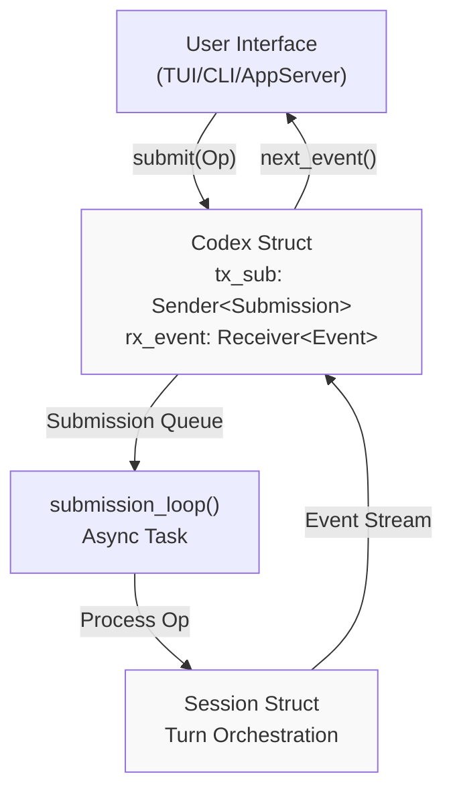

**Sources:** [codex-rs/core/src/codex.rs:330-343](), [codex-rs/protocol/src/protocol.rs:89-99]()

### Submission Types

The `Op` enum defines all possible operations that can be submitted to a Codex session. Each operation is wrapped in a `Submission` struct with a unique ID for correlation.

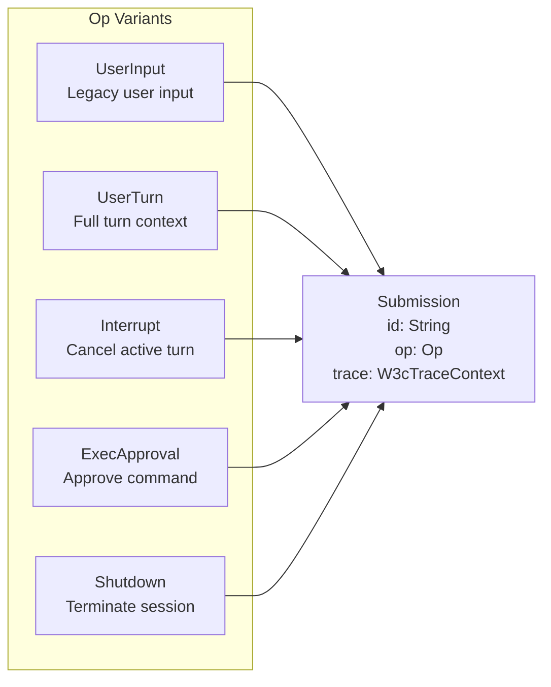

**Key submission types:**

| Op Variant      | Purpose                        | Fields                                                       |
| --------------- | ------------------------------ | ------------------------------------------------------------ |
| `UserInput`     | Legacy user input submission   | `items: Vec<UserInput>`                                      |
| `UserTurn`      | Full turn with context         | `items`, `cwd`, `model`, `approval_policy`, `sandbox_policy` |
| `Interrupt`     | Abort the current turn         | None                                                         |
| `ExecApproval`  | Approve/deny command execution | `id`, `turn_id`, `decision`                                  |
| `PatchApproval` | Approve/deny file patch        | `id`, `decision`                                             |
| `Shutdown`      | Terminate the session          | None                                                         |

**Sources:** [codex-rs/protocol/src/protocol.rs:181-479](), [codex-rs/core/src/codex.rs:636-666]()

### Event Stream

Events flow from `Session` back to the UI via the `Event` stream. Each `Event` contains a submission ID for correlation and an `EventMsg` payload.

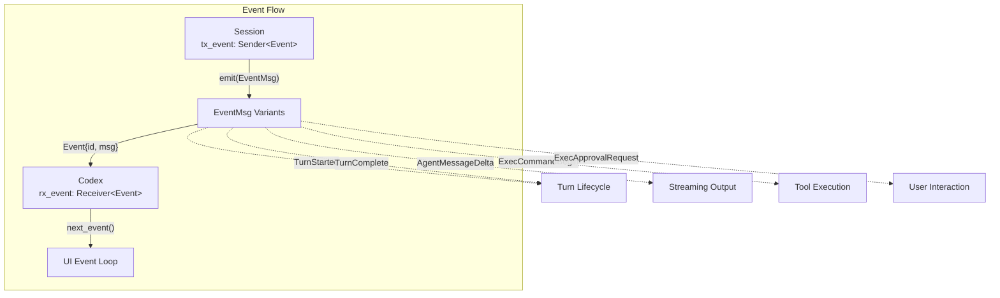

**Common event categories:**

| Category         | Events                                                          | Usage                  |
| ---------------- | --------------------------------------------------------------- | ---------------------- |
| Turn Lifecycle   | `TurnStarted`, `TurnComplete`, `TurnAborted`                    | Track turn boundaries  |
| Agent Output     | `AgentMessageDelta`, `AgentMessage`, `AgentReasoning`           | Stream agent responses |
| Tool Execution   | `ExecCommandBegin`, `ExecCommandEnd`, `McpToolCallBegin`        | Tool call lifecycle    |
| User Interaction | `ExecApprovalRequest`, `RequestUserInput`, `ElicitationRequest` | Request user decisions |
| Errors           | `Error`, `Warning`, `StreamError`                               | Error reporting        |

**Sources:** [codex-rs/protocol/src/protocol.rs:1-76](), [codex-rs/core/src/codex.rs:679-686]()

### Submission Loop Processing

The `submission_loop` runs as a background task for the lifetime of a `Codex` session, processing operations sequentially from the submission queue.

```mermaid
sequenceDiagram
    participant UI
    participant tx_sub as Submission Queue
    participant Loop as submission_loop
    participant Session
    participant rx_event as Event Stream

    UI->>tx_sub: submit(Op::UserInput)
    Loop->>tx_sub: rx_sub.recv()
    tx_sub-->>Loop: Submission

    alt Op::UserInput or Op::UserTurn
        Loop->>Session: spawn_task(RegularTask)
        Session->>rx_event: emit(TurnStarted)
        Session->>rx_event: emit(AgentMessageDelta)
        Session->>rx_event: emit(TurnComplete)
    else Op::Interrupt
        Loop->>Session: abort_active_task()
        Session->>rx_event: emit(TurnAborted)
    else Op::Shutdown
        Loop->>Session: cleanup()
        Loop->>rx_event: emit(ShutdownComplete)
        Note over Loop: Exit loop
    end

    UI->>rx_event: next_event()
    rx_event-->>UI: Event
```

**Sources:** [codex-rs/core/src/codex.rs:614-625](), [codex-rs/core/src/codex.rs:1976-2304]()

### Codex Interface

The `Codex` struct provides the primary interface for interacting with a session:

```rust
pub struct Codex {
    pub(crate) tx_sub: Sender<Submission>,
    pub(crate) rx_event: Receiver<Event>,
    pub(crate) agent_status: watch::Receiver<AgentStatus>,
    pub(crate) session: Arc<Session>,
    pub(crate) session_loop_termination: SessionLoopTermination,
}
```

**Key methods:**

- `submit(op: Op) -> String` - Submit an operation, returns submission ID
- `next_event() -> Event` - Block until next event is available
- `shutdown_and_wait()` - Graceful shutdown with loop termination await
- `steer_input(input, expected_turn_id)` - Inject input into active turn

**Sources:** [codex-rs/core/src/codex.rs:330-724]()

---

## Configuration System

Codex uses a **layered configuration system** where settings from multiple sources are merged with explicit precedence rules. This enables flexible deployment scenarios while maintaining security through constraint validation.

### Configuration Layer Hierarchy

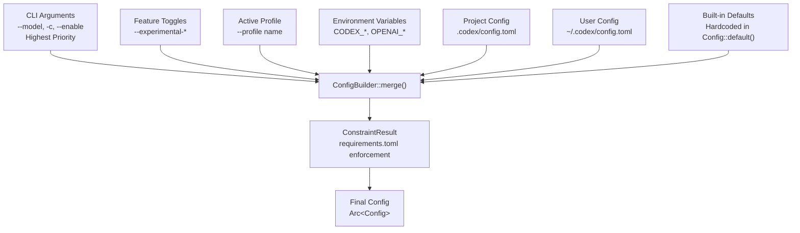

**Sources:** [codex-rs/core/src/codex.rs:404-493](), Diagram 6 from system overview

### Config Struct

The `Config` struct holds all session configuration. It is wrapped in `Arc<Config>` and shared across components:

| Field            | Type                               | Purpose                              |
| ---------------- | ---------------------------------- | ------------------------------------ |
| `model`          | `Option<String>`                   | Selected model slug                  |
| `model_provider` | `ModelProviderInfo`                | Provider endpoint configuration      |
| `permissions`    | `PermissionsConfig`                | Approval and sandbox policies        |
| `features`       | `ManagedFeatures`                  | Feature flag state                   |
| `cwd`            | `PathBuf`                          | Working directory for tool execution |
| `mcp_servers`    | `HashMap<String, McpServerConfig>` | MCP server configurations            |
| `codex_home`     | `PathBuf`                          | Codex data directory (~/.codex)      |

**Sources:** [codex-rs/core/src/codex.rs:556-581]()

### Configuration Merging

The `ConfigBuilder` merges layers using explicit precedence:

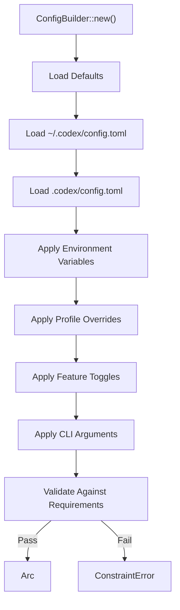

**Sources:** Diagram 6 from system overview, [codex-rs/core/src/codex.rs:486-489]()

### Constraint Validation

`requirements.toml` files enforce organizational policies. The `Constrained<T>` wrapper tracks whether a value can be overridden:

```rust
pub enum Constrained<T> {
    Pinned(T),        // Cannot be overridden by user
    Default(T),       // Can be overridden
}
```

Common constraints:

- MCP server allowlists (restrict which servers can be loaded)
- Model restrictions (limit available models)
- Feature enforcement (force-enable or force-disable features)
- Permission policy floors (minimum sandbox/approval strictness)

**Sources:** [codex-rs/core/src/codex.rs:556-581](), [codex-rs/protocol/src/protocol.rs:1-76]()

---

## Feature Flag System

Codex uses a **staged feature flag system** to manage experimental functionality and gradual rollouts. Features progress through defined lifecycle stages with runtime toggle support.

### Feature Lifecycle Stages

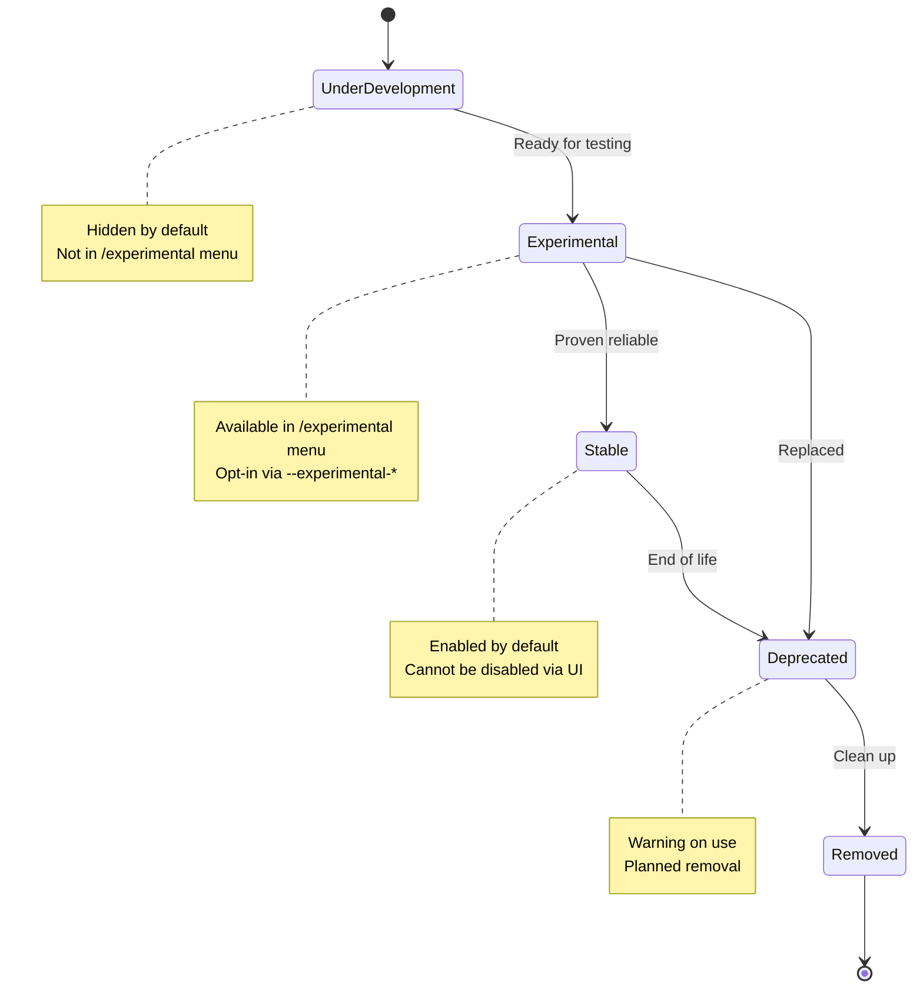

**Sources:** [codex-rs/core/src/codex.rs:29-31](), Diagram 6 from system overview

### Feature Definition

Features are defined in the `FEATURES` array with metadata:

```rust
pub struct Feature {
    pub name: &'static str,
    pub stage: FeatureStage,
    pub description: &'static str,
    pub default_enabled: bool,
}
```

**Feature stages:**

| Stage              | Visibility           | Default State | Can Toggle           |
| ------------------ | -------------------- | ------------- | -------------------- |
| `UnderDevelopment` | Hidden               | Disabled      | Force-enable via CLI |
| `Experimental`     | `/experimental` menu | Disabled      | Yes                  |
| `Stable`           | Always available     | Enabled       | No (unless pinned)   |
| `Deprecated`       | Always available     | Enabled       | Yes, with warning    |
| `Removed`          | No-op                | Disabled      | Ignored              |

**Sources:** [codex-rs/core/src/codex.rs:29-31](), Diagram 6 from system overview

### Runtime Feature Management

The `ManagedFeatures` struct wraps feature state and is immutable for a session lifetime:

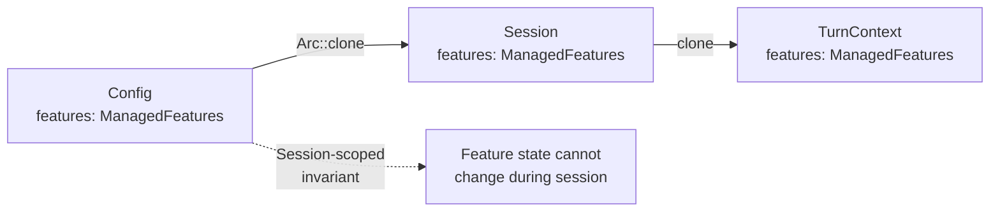

**Key methods:**

- `enabled(feature: Feature) -> bool` - Check if feature is active
- `enable(feature: Feature)` - Enable a feature (respects constraints)
- `disable(feature: Feature)` - Disable a feature (respects constraints)

**Sources:** [codex-rs/core/src/codex.rs:750-753](), [codex-rs/core/src/codex.rs:809-865]()

### Feature-Gated Behavior Example

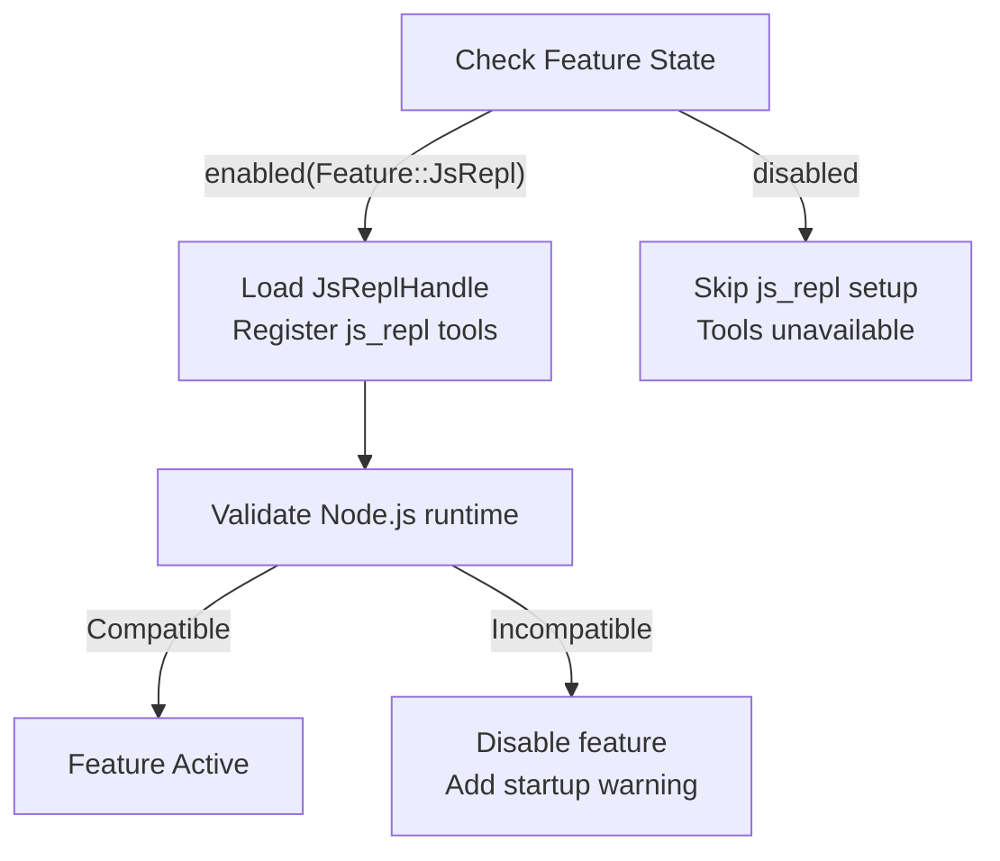

**Sources:** [codex-rs/core/src/codex.rs:443-469]()

---

## Security Policies

Codex provides **layered security controls** through approval policies, sandbox policies, and permission profiles. These policies are evaluated at tool execution time and can be constrained by organizational requirements.

### Approval Policy

The `AskForApproval` enum determines when user consent is required:

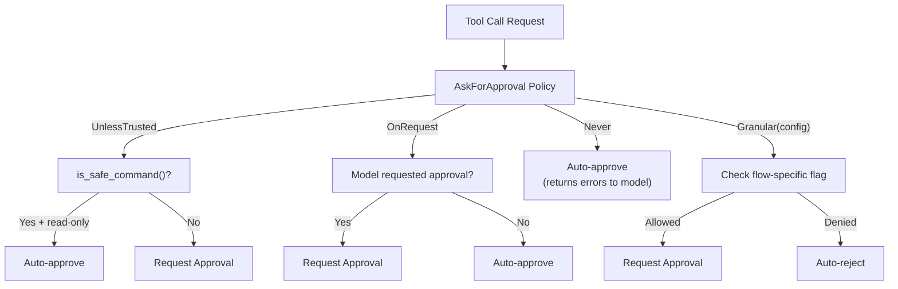

**Policy variants:**

| Variant            | Behavior                             | Use Case                                       |
| ------------------ | ------------------------------------ | ---------------------------------------------- |
| `UnlessTrusted`    | Auto-approve safe read-only commands | Interactive use with safety checks             |
| `OnRequest`        | Model decides when to ask            | Default for most scenarios                     |
| `Never`            | Never prompt user                    | Non-interactive execution                      |
| `Granular(config)` | Fine-grained per-flow control        | Enterprise with specific approval requirements |

**Sources:** [codex-rs/protocol/src/protocol.rs:483-570](), [codex-rs/core/src/codex.rs:566]()

### Sandbox Policy

The `SandboxPolicy` enum controls filesystem and network restrictions for command execution:

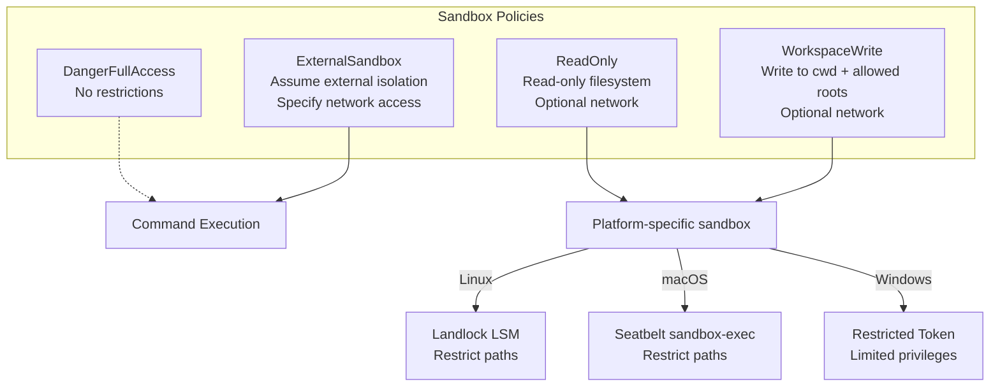

**Policy details:**

| Policy             | Filesystem Access                    | Network Access | Typical Use                        |
| ------------------ | ------------------------------------ | -------------- | ---------------------------------- |
| `DangerFullAccess` | Unrestricted                         | Unrestricted   | Trusted scripts, local development |
| `ReadOnly`         | Read-only (configurable roots)       | Optional       | Safe exploration, read operations  |
| `WorkspaceWrite`   | cwd + writable_roots                 | Optional       | Project work with write isolation  |
| `ExternalSandbox`  | Full read/write (external isolation) | Configurable   | Docker, VM, cloud sandbox          |

**Sources:** [codex-rs/protocol/src/protocol.rs:659-758](), [codex-rs/core/src/codex.rs:568-569]()

### Permission Profiles

Permission profiles define **granular filesystem access rules** that extend sandbox policies:

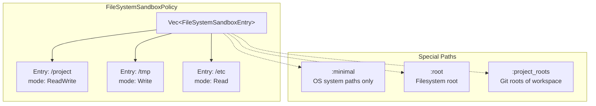

**Access modes:**

- `ReadWrite` - Read and write access
- `Read` - Read-only access
- `Write` - Write-only access (rare)
- `None` - Explicitly deny access

**Sources:** [codex-rs/protocol/src/protocol.rs:1744-1843](), [codex-rs/core/src/codex.rs:567-570]()

### Policy Evaluation Flow

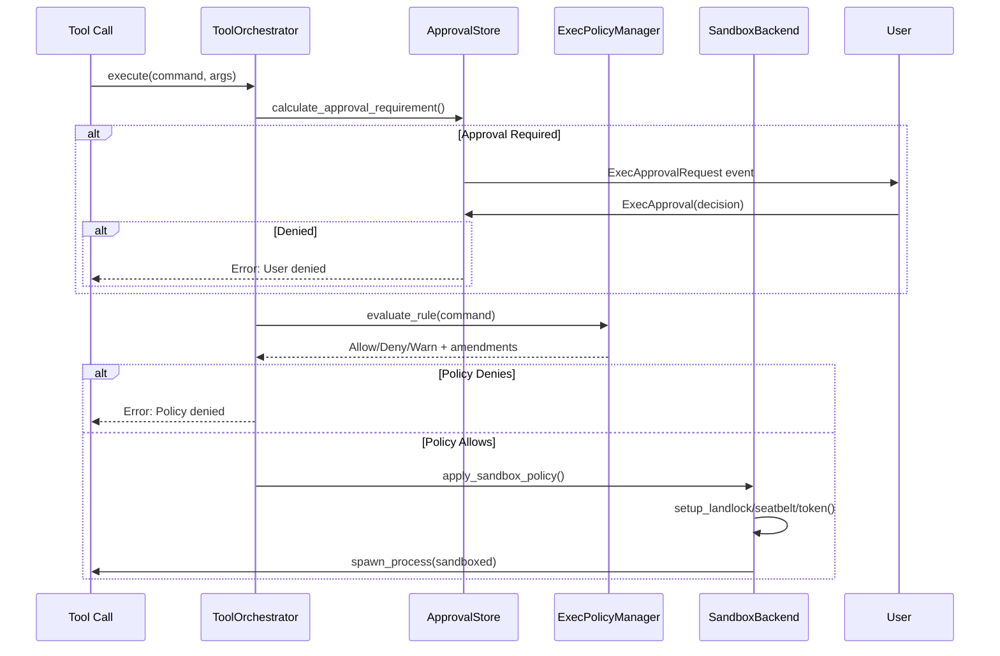

**Sources:** [codex-rs/core/src/codex.rs:480-489](), Diagram 5 from system overview

---

## Session Configuration

When a `Codex` session spawns, it builds a `SessionConfiguration` that captures all settings for the session lifetime:

```rust
pub(crate) struct SessionConfiguration {
    pub provider: ModelProviderInfo,
    pub collaboration_mode: CollaborationMode,
    pub model_reasoning_summary: ReasoningSummaryConfig,
    pub service_tier: Option<ServiceTier>,
    pub developer_instructions: Option<String>,
    pub user_instructions: Option<String>,
    pub personality: Option<Personality>,
    pub base_instructions: String,
    pub approval_policy: Constrained<AskForApproval>,
    pub sandbox_policy: Constrained<SandboxPolicy>,
    pub file_system_sandbox_policy: FileSystemSandboxPolicy,
    pub network_sandbox_policy: NetworkSandboxPolicy,
    pub windows_sandbox_level: WindowsSandboxLevel,
    pub cwd: PathBuf,
    pub codex_home: PathBuf,
    pub thread_name: Option<String>,
    pub session_source: SessionSource,
    pub dynamic_tools: Vec<DynamicToolSpec>,
    pub persist_extended_history: bool,
    // ... additional fields
}
```

This configuration is used to initialize the `Session` struct and remains invariant for the session lifetime (though some fields like `model` can be changed via `OverrideTurnContext` operations).

**Sources:** [codex-rs/core/src/codex.rs:556-581]()

---

## Error Handling

Codex uses structured error types with retry semantics:

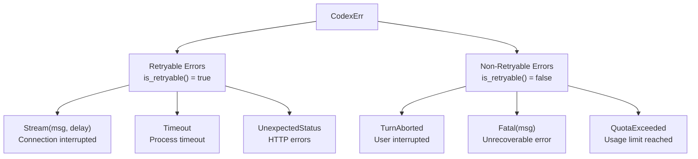

**Key error types:**

| Error                   | Retryable | Description                                 |
| ----------------------- | --------- | ------------------------------------------- |
| `Stream(msg, delay)`    | Yes       | Stream disconnected, optional backoff delay |
| `Timeout`               | Yes       | Process execution timeout                   |
| `UnexpectedStatus`      | Yes       | HTTP non-2xx status                         |
| `TurnAborted`           | No        | User pressed Ctrl+C or sent Interrupt       |
| `QuotaExceeded`         | No        | Account usage limit reached                 |
| `ContextWindowExceeded` | No        | Model context window full                   |
| `UsageLimitReached`     | No        | Rate limit or quota exceeded                |

**Sources:** [codex-rs/core/src/error.rs:64-231](), [codex-rs/codex-api/src/error.rs:1-39]()

---

## Event Persistence

Codex supports two event persistence modes for rollout files:

| Mode       | Events Persisted                                | Use Case                   |
| ---------- | ----------------------------------------------- | -------------------------- |
| `Limited`  | Turn boundaries, agent messages, token counts   | Default, minimal storage   |
| `Extended` | Adds tool execution results, errors, web search | Debugging, detailed replay |

**Persistence filter logic:**

```rust
pub enum EventPersistenceMode {
    Limited,
    Extended,
}

fn should_persist_event_msg(ev: &EventMsg, mode: EventPersistenceMode) -> bool {
    match mode {
        EventPersistenceMode::Limited => matches!(
            ev,
            EventMsg::TurnStarted(_) | EventMsg::TurnComplete(_) | EventMsg::AgentMessage(_)
        ),
        EventPersistenceMode::Extended => {
            // Limited events + ExecCommandEnd, WebSearchEnd, Error, etc.
        }
    }
}
```

**Sources:** [codex-rs/core/src/rollout/policy.rs:1-187]()

---

## Summary

The Core Concepts establish four foundational patterns:

1. **Submission/Event Protocol** - Asynchronous queue-pair communication between UI and agent
2. **Configuration System** - Layered, constrained settings with explicit precedence
3. **Feature Flags** - Staged lifecycle management for experimental functionality
4. **Security Policies** - Layered approval and sandboxing controls for tool execution

All execution modes (TUI, CLI, app-server, MCP server) build on these shared abstractions, ensuring consistent behavior and security guarantees across deployment scenarios.
