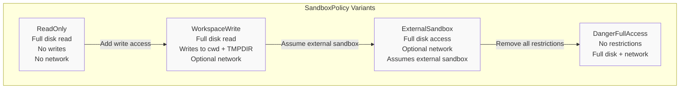
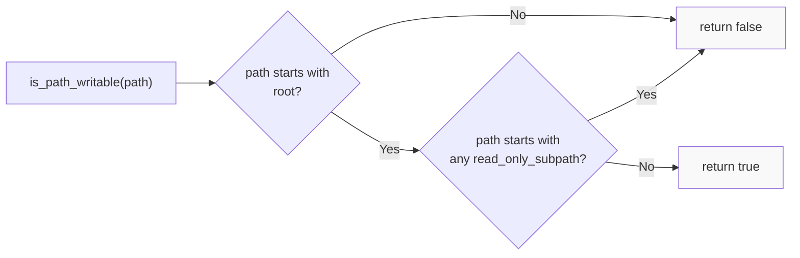
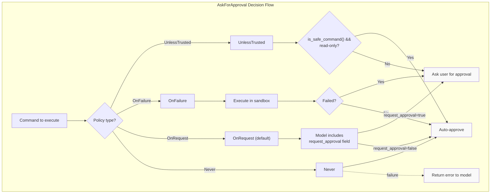
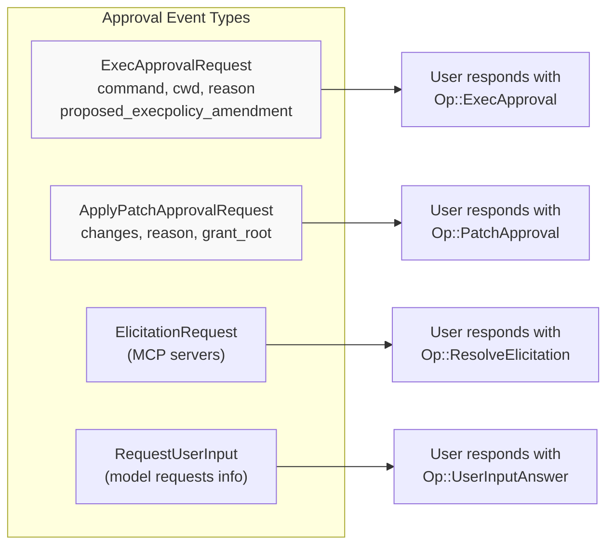
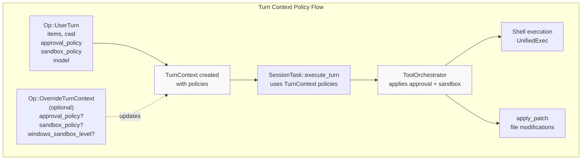
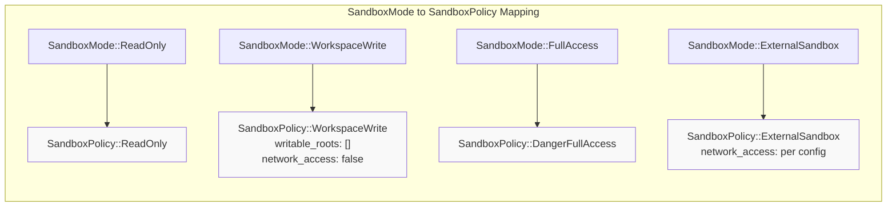
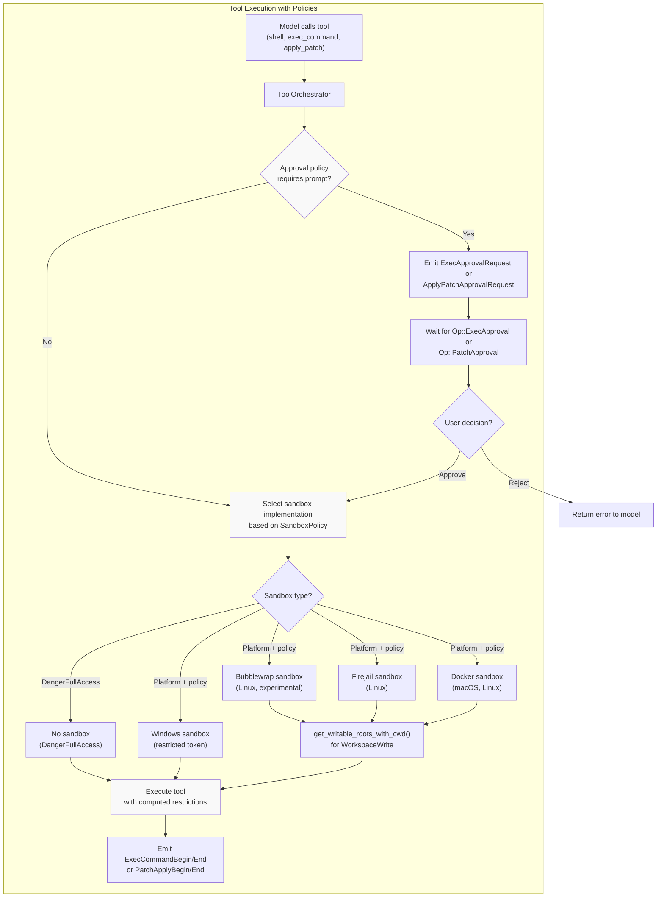
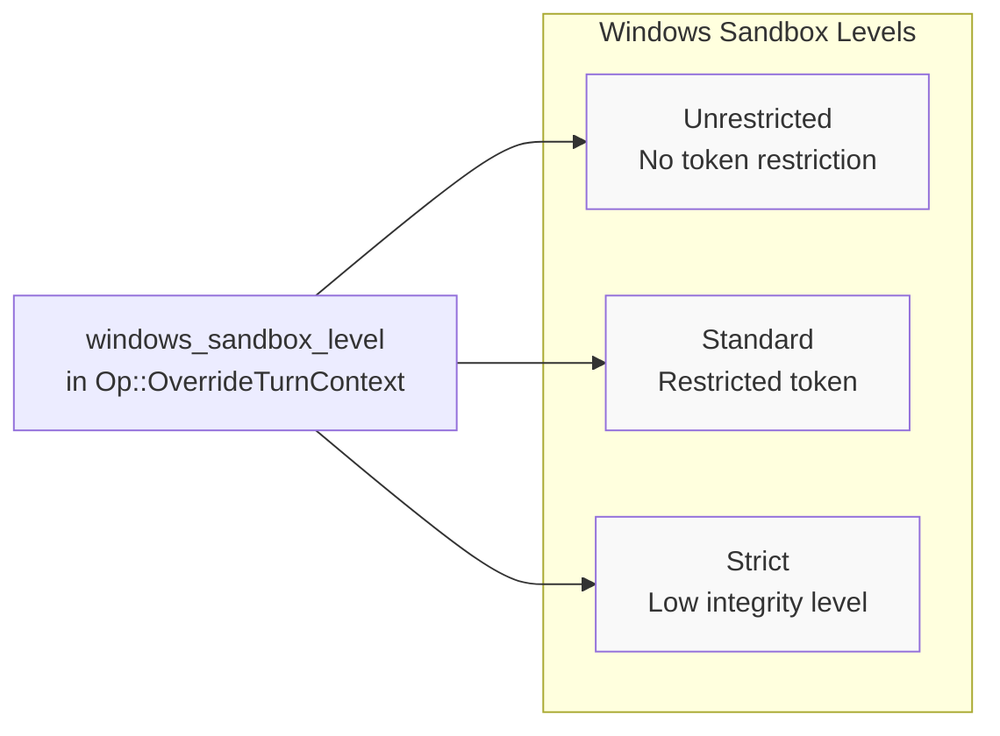

# Sandbox and Approval Policies

<details>
<summary>Relevant source files</summary>

The following files were used as context for generating this wiki page:

- [codex-rs/core/config.schema.json](codex-rs/core/config.schema.json)
- [codex-rs/core/src/codex_tests.rs](codex-rs/core/src/codex_tests.rs)
- [codex-rs/core/src/codex_tests_guardian.rs](codex-rs/core/src/codex_tests_guardian.rs)
- [codex-rs/core/src/config/agent_roles.rs](codex-rs/core/src/config/agent_roles.rs)
- [codex-rs/core/src/config/config_tests.rs](codex-rs/core/src/config/config_tests.rs)
- [codex-rs/core/src/config/edit.rs](codex-rs/core/src/config/edit.rs)
- [codex-rs/core/src/config/mod.rs](codex-rs/core/src/config/mod.rs)
- [codex-rs/core/src/config/permissions.rs](codex-rs/core/src/config/permissions.rs)
- [codex-rs/core/src/config/profile.rs](codex-rs/core/src/config/profile.rs)
- [codex-rs/core/src/config/types.rs](codex-rs/core/src/config/types.rs)
- [codex-rs/core/src/features.rs](codex-rs/core/src/features.rs)
- [codex-rs/core/src/features/legacy.rs](codex-rs/core/src/features/legacy.rs)
- [codex-rs/core/src/state/service.rs](codex-rs/core/src/state/service.rs)
- [codex-rs/core/src/tools/handlers/mod.rs](codex-rs/core/src/tools/handlers/mod.rs)
- [codex-rs/core/src/tools/spec.rs](codex-rs/core/src/tools/spec.rs)
- [codex-rs/core/tests/suite/code_mode.rs](codex-rs/core/tests/suite/code_mode.rs)
- [codex-rs/core/tests/suite/request_permissions.rs](codex-rs/core/tests/suite/request_permissions.rs)
- [codex-rs/protocol/src/permissions.rs](codex-rs/protocol/src/permissions.rs)
- [docs/config.md](docs/config.md)
- [docs/example-config.md](docs/example-config.md)
- [docs/skills.md](docs/skills.md)
- [docs/slash_commands.md](docs/slash_commands.md)

</details>

This document explains the dual security mechanisms that control tool execution in Codex: **Sandbox Policies** determine filesystem and network access restrictions for shell commands and other tools, while **Approval Policies** determine when the user must explicitly authorize an action before execution. These policies work together to provide graduated trust levels from fully sandboxed read-only access to unrestricted execution.

For information about tool execution implementation, see [Tool Orchestration and Approval](#5.5). For configuration of these policies, see [Configuration System](#2.2).

## Overview of Security Policies

Codex uses two orthogonal policy systems that are set per-turn and control different aspects of tool execution:

| Policy Type      | Purpose                                                                     | Configured Via                 |
| ---------------- | --------------------------------------------------------------------------- | ------------------------------ |
| `SandboxPolicy`  | Controls filesystem write access, network access, and execution environment | `Op::UserTurn.sandbox_policy`  |
| `AskForApproval` | Controls when user approval is required before executing commands           | `Op::UserTurn.approval_policy` |

Both policies are passed in the `Op::UserTurn` submission and can be overridden via `Op::OverrideTurnContext` for subsequent turns in a session.

**Sources:** [codex-rs/protocol/src/protocol.rs:108-143]()

## Sandbox Policy System

### Policy Variants

The `SandboxPolicy` enum defines four execution modes with increasing levels of access:



**Policy Characteristics:**

| Policy             | Disk Read | Disk Write                      | Network  | Protected Paths                  |
| ------------------ | --------- | ------------------------------- | -------- | -------------------------------- |
| `ReadOnly`         | Full      | None                            | Disabled | N/A                              |
| `WorkspaceWrite`   | Full      | cwd + TMPDIR + configured roots | Optional | .git, .codex, .agents            |
| `ExternalSandbox`  | Full      | Full                            | Optional | None (external sandbox enforces) |
| `DangerFullAccess` | Full      | Full                            | Enabled  | None                             |

**Sources:** [codex-rs/protocol/src/protocol.rs:379-426](), [codex-rs/protocol/src/protocol.rs:467-507]()

### Writable Roots Computation

For `WorkspaceWrite` policy, the system computes a set of `WritableRoot` objects that define which directories are writable and which subdirectories within those roots must remain read-only:

```mermaid
graph TB
    subgraph "get_writable_roots_with_cwd Flow"
        Input["Input:<br/>SandboxPolicy::WorkspaceWrite<br/>cwd: /home/user/project"]

        ExplicitRoots["Explicit writable_roots<br/>from policy config"]
        CwdRoot["Add cwd:<br/>/home/user/project"]
        SlashTmp["Add /tmp<br/>(Unix, unless excluded)"]
        EnvTmpdir["Add $TMPDIR<br/>(if set, unless excluded)"]

        ComputeSubpaths["For each root:<br/>Compute read_only_subpaths"]

        GitCheck{".git exists?"}
        GitFile{".git is file?"}
        ResolveGitdir["resolve_gitdir_from_file()"]

        AgentsCodex["Check .agents, .codex"]

        Output["Vec&lt;WritableRoot&gt;<br/>Each with root + read_only_subpaths"]
    end

    Input --> ExplicitRoots
    ExplicitRoots --> CwdRoot
    CwdRoot --> SlashTmp
    SlashTmp --> EnvTmpdir
    EnvTmpdir --> ComputeSubpaths

    ComputeSubpaths --> GitCheck
    GitCheck -->|Yes| GitFile
    GitFile -->|Yes| ResolveGitdir
    GitFile -->|No| AgentsCodex
    ResolveGitdir --> AgentsCodex
    GitCheck -->|No| AgentsCodex

    AgentsCodex --> Output

    style Input fill:#f9f9f9
    style Output fill:#f9f9f9
```



**Protected Subdirectories:**

The system automatically protects these subdirectories within writable roots to prevent privilege escalation:

1. **`.git` directory** - Prevents modification of git hooks, config, or repository structure
   - For git worktrees/submodules (where `.git` is a file), resolves the actual gitdir location
2. **`.codex` directory** - Prevents modification of Codex configuration
3. **`.agents` directory** - Prevents modification of agent/skill configurations

**Sources:** [codex-rs/protocol/src/protocol.rs:511-622](), [codex-rs/protocol/src/protocol.rs:433-457](), [codex-rs/protocol/src/protocol.rs:624-687]()

### WritableRoot Path Checking

The `WritableRoot` struct provides a method to determine if a specific path is writable under the policy:



**Sources:** [codex-rs/protocol/src/protocol.rs:442-456]()

## Approval Policy System

### Policy Variants

The `AskForApproval` enum defines when user intervention is required:



**Policy Descriptions:**

- **`UnlessTrusted`** (most restrictive): Only commands deemed safe by `is_safe_command()` that perform read-only operations are auto-approved. Everything else requires user approval.

- **`OnFailure`**: All commands are auto-approved for execution in a sandbox. If execution fails (non-zero exit), the user is prompted to approve re-execution without sandbox restrictions. This provides a graduated fallback mechanism.

- **`OnRequest`** (default): The model controls approval via the `request_approval` field in tool calls. When `true`, the system prompts the user; when `false`, execution proceeds automatically.

- **`Never`**: Never ask the user for approval. Commands that fail are immediately returned to the model as errors without user escalation.

**Sources:** [codex-rs/protocol/src/protocol.rs:320-359](), [codex-rs/core/config.schema.json:92-123]()

### Approval Request Events

When approval is required, the system emits one of these events:



**Sources:** [codex-rs/protocol/src/protocol.rs:52-56](), [codex-rs/protocol/src/protocol.rs:789-797](), [codex-rs/protocol/src/protocol.rs:194-227]()

## Integration with Turn Context

Both policies are part of the `Op::UserTurn` submission and can be updated via `Op::OverrideTurnContext`:



**Sources:** [codex-rs/protocol/src/protocol.rs:108-143](), [codex-rs/protocol/src/protocol.rs:151-192]()

## Configuration

Policies can be configured at multiple layers in the configuration system:

### Default Policy Configuration

| Configuration Key       | Policy Type             | Default Value    | Config Level   |
| ----------------------- | ----------------------- | ---------------- | -------------- |
| `approval_policy`       | `AskForApproval`        | `OnRequest`      | Profile        |
| `sandbox_mode`          | Maps to `SandboxPolicy` | `WorkspaceWrite` | Profile        |
| `windows_sandbox_level` | Windows-specific        | `Unrestricted`   | Global/Profile |

**Sandbox Mode Mapping:**

The `SandboxMode` configuration enum maps to `SandboxPolicy` variants:



**Sources:** [codex-rs/core/config.schema.json:319-331](), [codex-rs/protocol/src/protocol.rs:379-426]()

### Profile-Based Configuration

Policies are typically configured per-profile in `config.toml`:

```toml
[profiles.restrictive]
approval_policy = "untrusted"
sandbox_mode = "read-only"

[profiles.development]
approval_policy = "on-request"
sandbox_mode = "workspace-write"

[profiles.trusted]
approval_policy = "never"
sandbox_mode = "full-access"
```

**Sources:** [codex-rs/core/src/config/profile.rs:18-49](), [docs/config.md:1-36]()

### Runtime Policy Override

CLI and TUI interfaces can override policies at runtime:

```bash
# CLI execution with specific policies
codex exec --approval-policy never --sandbox-mode read-only "analyze the codebase"

# Resume session with different policies
codex --approval-policy on-failure --resume session-id
```

**Sources:** Configuration is loaded in [codex-rs/core/src/config/mod.rs]() and applied to turn context

## Tool Execution Flow with Policies

The following diagram shows how both policies interact during tool execution:



**Sources:** [codex-rs/core/src/tools/spec.rs]() (tool orchestration), [codex-rs/mcp-server/src/codex_tool_runner.rs:216-239]() (approval handling in MCP), [codex-rs/exec/src/event_processor_with_human_output.rs:313-345]() (approval display)

## Approval Cache and Decision Persistence

The system maintains an approval cache to avoid redundant prompts for the same command:

| Mechanism         | Purpose                                                      | Lifetime    |
| ----------------- | ------------------------------------------------------------ | ----------- |
| Approval cache    | Reuse approval decisions for identical commands in same turn | Per-turn    |
| Policy amendments | User-proposed exec policy rules stored in approval responses | Per-session |

When the user approves a command, they can optionally propose a policy amendment that allows similar commands to auto-approve in the future.

**Sources:** [codex-rs/protocol/src/protocol.rs:52-56]() (ExecPolicyAmendment), approval cache implementation in tool orchestrator

## Platform-Specific Considerations

### Windows Sandbox

Windows uses a different sandboxing mechanism based on restricted tokens:



**Sources:** [codex-rs/protocol/src/protocol.rs:165-166](), [codex-rs/core/config.schema.json:947-956]()

### External Sandbox Mode

`SandboxPolicy::ExternalSandbox` is used when Codex is already running inside a sandbox environment (e.g., Docker container, VM). This mode:

- Assumes the external environment enforces restrictions
- Allows full disk access within the container/VM
- Respects the `network_access` flag to enable/disable outbound network
- Does not apply additional sandboxing layers

**Sources:** [codex-rs/protocol/src/protocol.rs:393-399](), [codex-rs/protocol/src/protocol.rs:493-495]()

## Summary

The dual policy system provides:

1. **Graduated Trust Levels**: From fully restricted (`ReadOnly` + `UnlessTrusted`) to unrestricted (`DangerFullAccess` + `Never`)
2. **Granular Control**: Separate policies for access (sandbox) and authorization (approval)
3. **Protected Paths**: Automatic protection of `.git`, `.codex`, and `.agents` directories in writable roots
4. **Flexible Configuration**: Per-profile defaults with per-turn and per-session overrides
5. **Platform Adaptation**: Platform-specific sandbox implementations (Docker, Firejail, Windows restricted tokens)

These mechanisms balance security and usability, allowing users to control the trust level for different workflows while protecting critical system and configuration files.

**Sources:** [codex-rs/protocol/src/protocol.rs:320-622](), [codex-rs/core/src/config/profile.rs:1-64](), [codex-rs/core/config.schema.json:92-123]()
