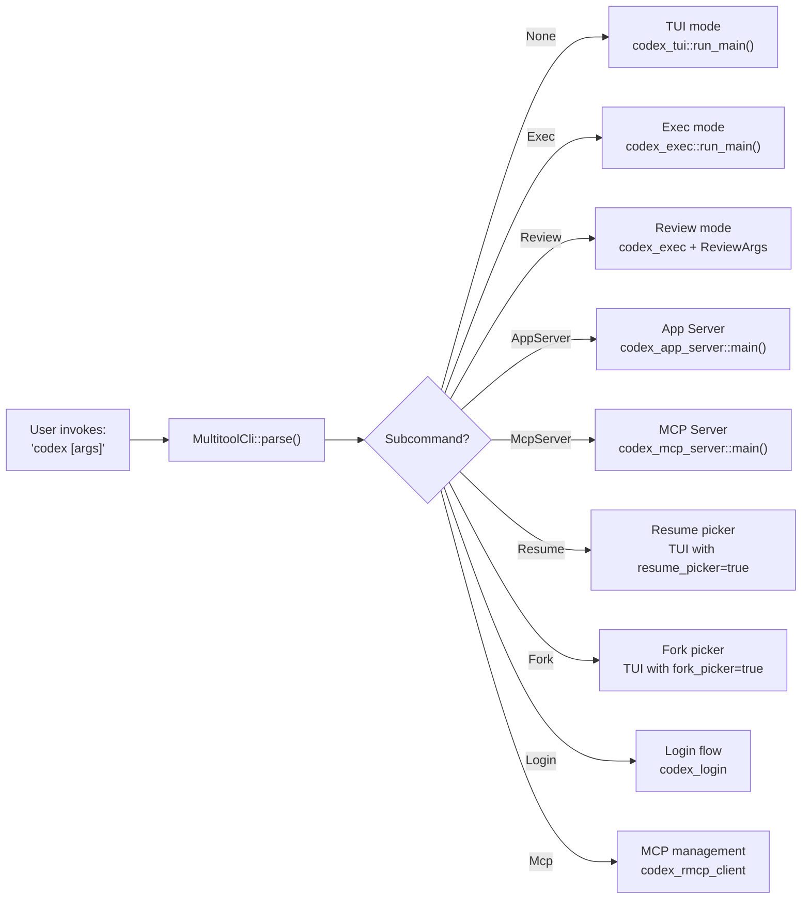
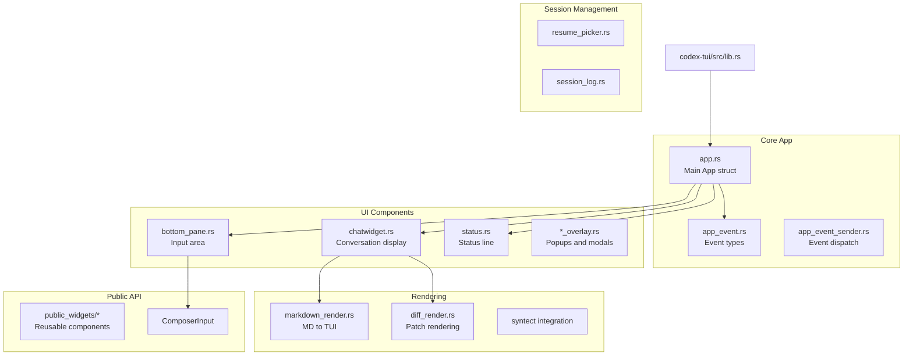
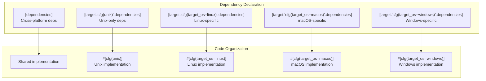
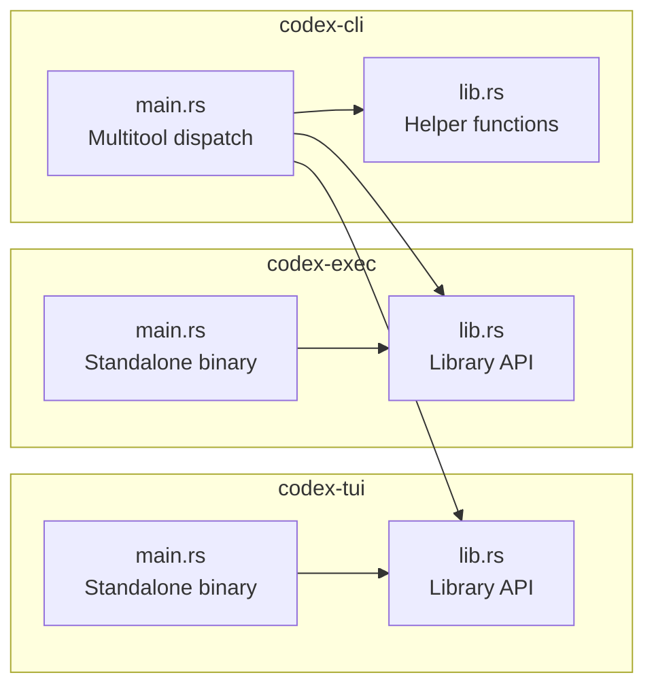
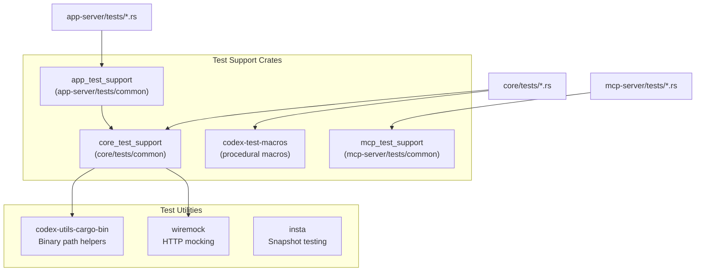
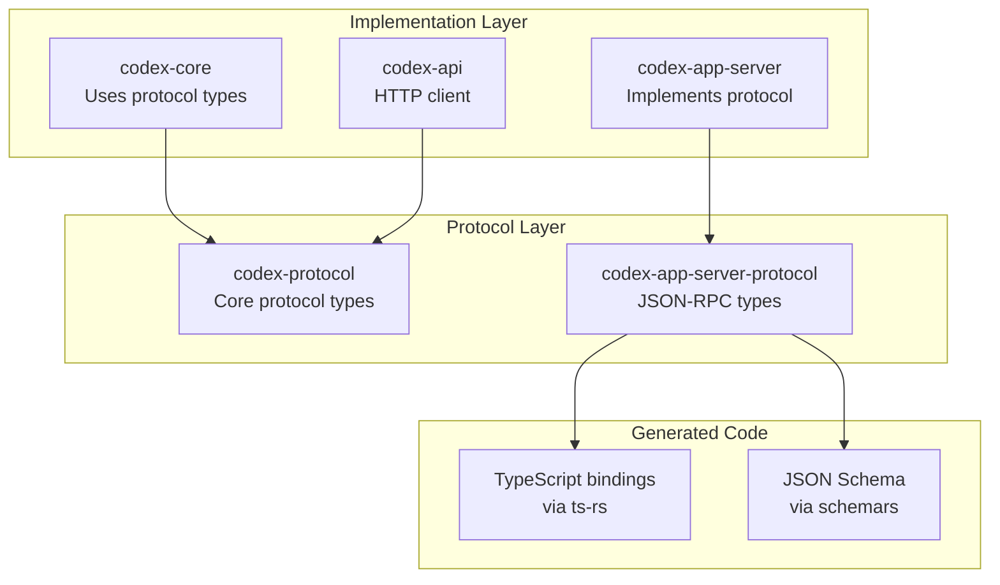

# Code Organization Patterns

<details>
<summary>Relevant source files</summary>

The following files were used as context for generating this wiki page:

- [codex-rs/Cargo.lock](codex-rs/Cargo.lock)
- [codex-rs/Cargo.toml](codex-rs/Cargo.toml)
- [codex-rs/README.md](codex-rs/README.md)
- [codex-rs/cli/Cargo.toml](codex-rs/cli/Cargo.toml)
- [codex-rs/cli/src/main.rs](codex-rs/cli/src/main.rs)
- [codex-rs/config.md](codex-rs/config.md)
- [codex-rs/core/Cargo.toml](codex-rs/core/Cargo.toml)
- [codex-rs/core/src/flags.rs](codex-rs/core/src/flags.rs)
- [codex-rs/core/src/lib.rs](codex-rs/core/src/lib.rs)
- [codex-rs/core/src/model_provider_info.rs](codex-rs/core/src/model_provider_info.rs)
- [codex-rs/exec/Cargo.toml](codex-rs/exec/Cargo.toml)
- [codex-rs/exec/src/cli.rs](codex-rs/exec/src/cli.rs)
- [codex-rs/exec/src/lib.rs](codex-rs/exec/src/lib.rs)
- [codex-rs/tui/Cargo.toml](codex-rs/tui/Cargo.toml)
- [codex-rs/tui/src/cli.rs](codex-rs/tui/src/cli.rs)
- [codex-rs/tui/src/lib.rs](codex-rs/tui/src/lib.rs)

</details>

## Purpose and Scope

This page documents the code organization patterns, conventions, and architectural guidelines used throughout the Codex Rust codebase. It covers workspace structure, crate categorization, module organization, platform-specific code handling, and code quality enforcement mechanisms.

For information about the build and release pipeline, see [Build and Distribution](#7). For testing infrastructure and practices, see [Testing Infrastructure](#8.2).

---

## Workspace Structure and Crate Categorization

The Codex codebase is organized as a Cargo workspace containing 71+ crates, each with a focused responsibility. The workspace root [codex-rs/Cargo.toml:1-395]() defines shared dependencies, lints, and build profiles.

### Crate Categories

```mermaid
graph TB
    subgraph "Entry Points"
        CLI["codex-cli<br/>Main multitool binary"]
        TUI["codex-tui<br/>Interactive TUI mode"]
        Exec["codex-exec<br/>Headless automation"]
        AppServer["codex-app-server<br/>JSON-RPC server for IDEs"]
        McpServer["codex-mcp-server<br/>MCP server mode"]
    end

    subgraph "Core Logic"
        Core["codex-core<br/>Business logic library"]
        Protocol["codex-protocol<br/>Protocol types"]
        Config["codex-config<br/>Configuration system"]
        State["codex-state<br/>Persistence layer"]
    end

    subgraph "Platform Integration"
        LinuxSandbox["codex-linux-sandbox<br/>Landlock/seccomp"]
        WindowsSandbox["codex-windows-sandbox<br/>Token restrictions"]
        Seatbelt["Seatbelt profiles<br/>(in core)"]
    end

    subgraph "External Integrations"
        RmcpClient["codex-rmcp-client<br/>MCP client"]
        Api["codex-api<br/>HTTP API layer"]
        BackendClient["codex-backend-client<br/>Cloud backend"]
        Chatgpt["codex-chatgpt<br/>ChatGPT auth"]
    end

    subgraph "Utilities"
        AbsPath["codex-utils-absolute-path"]
        Pty["codex-utils-pty"]
        Image["codex-utils-image"]
        Cache["codex-utils-cache"]
        Cli["codex-utils-cli<br/>CLI parsing helpers"]
    end

    CLI --> Core
    TUI --> Core
    Exec --> Core
    AppServer --> Core
    McpServer --> Core

    Core --> Protocol
    Core --> Config
    Core --> State
    Core --> LinuxSandbox
    Core --> WindowsSandbox
    Core --> RmcpClient
    Core --> Api
    Core --> BackendClient

    TUI --> AppServer
    Exec --> AppServer

    Core --> AbsPath
    Core --> Pty
    Core --> Image
    Core --> Cache

    CLI --> Cli
    TUI --> Cli
    Exec --> Cli
```



**Sources:** [codex-rs/Cargo.toml:1-71](), [codex-rs/README.md:93-101]()

### Workspace-Level Configuration

The workspace enforces consistency through centralized configuration:

| Configuration Type | Location                                 | Purpose                                  |
| ------------------ | ---------------------------------------- | ---------------------------------------- |
| **Edition**        | `workspace.edition = "2024"`             | Rust 2024 edition for all crates         |
| **Version**        | `workspace.version = "0.0.0"`            | Unified version across workspace         |
| **Dependencies**   | `[workspace.dependencies]`               | Single source of truth for versions      |
| **Lints**          | `[workspace.lints.clippy]`               | Strict clippy rules enforced             |
| **Build Profiles** | `[profile.release]`, `[profile.ci-test]` | Optimized release builds, fast CI builds |

**Key Build Profile Settings:**

```toml
[profile.release]
lto = "fat"                # Full link-time optimization
split-debuginfo = "off"    # No debug symbols in release
strip = "symbols"          # Minimize binary size
codegen-units = 1          # Single codegen unit for max optimization

[profile.ci-test]
debug = 1                  # Minimal debug symbols
opt-level = 0              # Fast compilation for tests
inherits = "test"
```

**Sources:** [codex-rs/Cargo.toml:74-81](), [codex-rs/Cargo.toml:367-380]()

---

## Entry Point Patterns and Dispatch

### Multitool CLI Dispatch

The main `codex` binary uses a **multitool pattern** where a single executable provides multiple subcommands that dispatch to specialized implementations.



**Sources:** [codex-rs/cli/src/main.rs:58-149](), [codex-rs/cli/src/main.rs:505-750]()

### Feature Toggle Integration

Feature flags are processed before subcommand dispatch and transformed into configuration overrides:

```rust
// Feature toggles are parsed from --enable/--disable flags
#[derive(Debug, Default, Parser, Clone)]
struct FeatureToggles {
    #[arg(long = "enable", value_name = "FEATURE", ...)]
    enable: Vec<String>,

    #[arg(long = "disable", value_name = "FEATURE", ...)]
    disable: Vec<String>,
}

// Converted to config overrides: features.<name>=true/false
impl FeatureToggles {
    fn to_overrides(&self) -> anyhow::Result<Vec<String>> {
        // Validation against known features in FEATURES array
        // Returns Vec<String> like "features.web_search=true"
    }
}
```

**Sources:** [codex-rs/cli/src/main.rs:486-517]()

---

## Module Organization Conventions

### Core Library Pattern

The `codex-core` crate follows a **flat module declaration** pattern where all modules are declared at the root level of `lib.rs` and then selectively re-exported:

```rust
// Module declarations (private by default)
mod analytics_client;
pub mod api_bridge;
mod apply_patch;
mod apps;
pub mod auth;
mod client;
mod client_common;
pub mod codex;
mod compact_remote;
pub mod config;
// ... 50+ more modules

// Selective public re-exports
pub use client::ModelClient;
pub use client::ModelClientSession;
pub use codex::SteerInputError;
pub use rollout::RolloutRecorder;
pub use thread_manager::ThreadManager;
// ... selective exports
```

**Module Visibility Rules:**

| Pattern                 | Example                                    | Purpose                               |
| ----------------------- | ------------------------------------------ | ------------------------------------- |
| `mod name;`             | `mod analytics_client;`                    | Private module, implementation detail |
| `pub mod name;`         | `pub mod config;`                          | Public module API surface             |
| `pub use module::Type;` | `pub use codex::SteerInputError;`          | Re-export specific types              |
| `pub(crate) use ...;`   | `pub(crate) use codex_protocol::protocol;` | Crate-internal sharing                |

**Sources:** [codex-rs/core/src/lib.rs:1-178]()

### TUI Module Organization

The TUI crate uses a more **domain-organized** structure with modules grouped by functionality:



**Sources:** [codex-rs/tui/src/lib.rs:60-123]()

### Exec Mode Module Organization

The exec crate uses a **processor pattern** where different output modes are implemented as separate processors:

```
codex-exec/src/
├── lib.rs                                  # Main entry point
├── cli.rs                                  # CLI argument parsing
├── event_processor.rs                      # Trait definition
├── event_processor_with_human_output.rs    # Terminal output mode
├── event_processor_with_jsonl_output.rs    # JSON Lines mode
└── exec_events.rs                          # Event type definitions
```

**Sources:** [codex-rs/exec/src/lib.rs:1-11](), [codex-rs/exec/Cargo.toml:1-72]()

---

## Code Quality Enforcement

### Clippy Lints at Workspace Level

The workspace enforces 35+ clippy lints to ensure code quality and consistency:

```toml
[workspace.lints.clippy]
expect_used = "deny"                        # No .expect() calls
unwrap_used = "deny"                        # No .unwrap() calls
manual_clamp = "deny"                       # Use .clamp() method
manual_filter = "deny"                      # Use .filter() directly
needless_borrow = "deny"                    # Avoid unnecessary borrows
redundant_clone = "deny"                    # Prevent wasteful clones
uninlined_format_args = "deny"              # Use format!("{foo}")
# ... 28 more rules
```

**Sources:** [codex-rs/Cargo.toml:319-356]()

### Library-Specific Restrictions

Library crates (core, protocol, etc.) enforce additional restrictions to prevent accidental misuse:

```rust
// In library code: prevent direct stdout/stderr writes
#![deny(clippy::print_stdout, clippy::print_stderr)]
#![deny(clippy::disallowed_methods)]
```

This ensures all output goes through proper abstractions (tracing, events, etc.) rather than direct console writes.

**Sources:** [codex-rs/core/src/lib.rs:4-6](), [codex-rs/tui/src/lib.rs:1-4]()

### Exec Mode Output Discipline

The exec mode enforces stricter output rules since it must produce machine-parseable output:

```rust
// In default mode: only final message to stdout
// In --json mode: only valid JSONL to stdout
// All other output must go to stderr
#![deny(clippy::print_stdout)]
```

**Sources:** [codex-rs/exec/src/lib.rs:1-5]()

---

## Platform-Specific Code Organization

### Conditional Compilation Pattern

Platform-specific code is organized using Cargo's target-specific dependencies and Rust's `cfg` attributes:



**Example from core/Cargo.toml:**

```toml
# Linux-specific dependencies
[target.'cfg(target_os = "linux")'.dependencies]
landlock = { workspace = true }
seccompiler = { workspace = true }
keyring = { workspace = true, features = ["linux-native-async-persistent"] }

# macOS-specific dependencies
[target.'cfg(target_os = "macos")'.dependencies]
core-foundation = "0.9"
keyring = { workspace = true, features = ["apple-native"] }

# Windows-specific dependencies
[target.'cfg(target_os = "windows")'.dependencies]
keyring = { workspace = true, features = ["windows-native"] }
windows-sys = { version = "0.52", features = ["Win32_Foundation", ...] }
```

**Sources:** [codex-rs/core/Cargo.toml:120-147]()

### Sandbox Implementation Pattern

Each platform has its own sandbox implementation with a unified interface:

| Platform    | Crate                   | Implementation                      |
| ----------- | ----------------------- | ----------------------------------- |
| **Linux**   | `codex-linux-sandbox`   | Landlock LSM + seccomp-bpf          |
| **macOS**   | Core with Seatbelt      | Sandbox profiles via `sandbox-exec` |
| **Windows** | `codex-windows-sandbox` | Restricted tokens + job objects     |

**Sources:** [codex-rs/Cargo.toml:30-33](), [codex-rs/core/src/lib.rs:69]()

---

## Binary vs Library Organization

### Dual-Purpose Crates

Several crates provide both library and binary interfaces:



**Cargo.toml Pattern:**

```toml
[lib]
name = "codex_tui"
path = "src/lib.rs"

[[bin]]
name = "codex-tui"
path = "src/main.rs"
```

This allows:

- **Direct execution:** `codex-tui` as standalone binary
- **Library reuse:** `codex` CLI imports `codex_tui::run_main()`

**Sources:** [codex-rs/tui/Cargo.toml:6-13](), [codex-rs/exec/Cargo.toml:6-13](), [codex-rs/cli/Cargo.toml:6-13]()

---

## Utility Crate Naming Convention

Utility crates follow the `codex-utils-*` naming pattern and are located under `utils/`:

```
utils/
├── absolute-path/     → codex-utils-absolute-path
├── cargo-bin/         → codex-utils-cargo-bin (test helpers)
├── cli/               → codex-utils-cli (CLI parsing)
├── cache/             → codex-utils-cache
├── elapsed/           → codex-utils-elapsed (timing)
├── fuzzy-match/       → codex-utils-fuzzy-match
├── home-dir/          → codex-utils-home-dir
├── image/             → codex-utils-image
├── json-to-toml/      → codex-utils-json-to-toml
├── oss/               → codex-utils-oss (OSS provider helpers)
├── pty/               → codex-utils-pty (pseudo-terminal)
├── readiness/         → codex-utils-readiness (health checks)
├── rustls-provider/   → codex-utils-rustls-provider
├── sandbox-summary/   → codex-utils-sandbox-summary
├── sleep-inhibitor/   → codex-utils-sleep-inhibitor
├── stream-parser/     → codex-utils-stream-parser
└── string/            → codex-utils-string
```

**Design Principle:** Each utility crate is **single-purpose** and has minimal dependencies to avoid circular dependencies and keep compilation units small.

**Sources:** [codex-rs/Cargo.toml:45-64](), [codex-rs/Cargo.toml:132-149]()

---

## Test Support Crate Pattern

Test infrastructure is organized into dedicated test support crates:



**Test Support Crate Structure:**

```toml
# In core/tests/common/Cargo.toml
[package]
name = "core_test_support"
version.workspace = true

# Not published, dev-only
publish = false

[dependencies]
# Shared test utilities
codex-utils-cargo-bin = { workspace = true }
wiremock = { workspace = true }
tempfile = { workspace = true }
# ... core dependencies for test fixtures
```

**Sources:** [codex-rs/Cargo.toml:85](), [codex-rs/Cargo.toml:151-152]()

---

## Protocol and API Separation

Protocol definitions are isolated from implementation to enable code generation and cross-language compatibility:



**Key Design Choices:**

1. **No business logic in protocol crates** - Only type definitions and serialization
2. **Derive macros for code generation** - `#[derive(Serialize, Deserialize, JsonSchema, TS)]`
3. **Version compatibility** - Protocol types can be versioned independently

**Sources:** [codex-rs/Cargo.toml:14](), [codex-rs/Cargo.toml:39](), [codex-rs/Cargo.toml:92]()

---

## Workspace Dependency Management

### Single Source of Truth Pattern

All dependency versions are defined once at workspace level and referenced in crate manifests:

```toml
# In workspace root Cargo.toml
[workspace.dependencies]
tokio = "1"
serde = "1"
anyhow = "1"
# ... 100+ shared dependencies

# In individual crate Cargo.toml
[dependencies]
tokio = { workspace = true, features = ["rt-multi-thread", "macros"] }
serde = { workspace = true, features = ["derive"] }
anyhow = { workspace = true }
```

**Benefits:**

- **Version consistency:** All crates use same dependency versions
- **Easier updates:** Update version in one place
- **Feature additivity:** Crates can add features to workspace deps

**Sources:** [codex-rs/Cargo.toml:83-318]()

### Dependency Override Pattern

For development and debugging, the workspace supports local path overrides:

```toml
[patch.crates-io]
# Uncomment to debug local changes
# ratatui = { path = "../../ratatui" }
# rmcp = { path = "../../rust-sdk/crates/rmcp" }

# Active patches for bug fixes/features
crossterm = { git = "https://github.com/nornagon/crossterm", branch = "..." }
ratatui = { git = "https://github.com/nornagon/ratatui", branch = "..." }
```

**Sources:** [codex-rs/Cargo.toml:382-394]()

---

## Feature Flag System Integration

Feature flags are managed through a centralized system in `codex-core/src/features.rs` (see [Feature Flags](#2.3)), but the CLI layer integrates them via command-line arguments:

```rust
// CLI parsing converts --enable/--disable to config overrides
// These are merged into ConfigBuilder before execution
let feature_overrides = feature_toggles.to_overrides()?;
config_overrides.raw_overrides.extend(feature_overrides);
```

**Stage-Based Visibility:**

| Stage              | CLI Visibility           | Default |
| ------------------ | ------------------------ | ------- |
| `UnderDevelopment` | Hidden                   | Off     |
| `Experimental`     | Visible with `--enable`  | Off     |
| `Stable`           | Visible with `--disable` | On      |
| `Deprecated`       | Warns when enabled       | Off     |
| `Removed`          | Error if referenced      | N/A     |

**Sources:** [codex-rs/cli/src/main.rs:486-558]()

---

## Summary

The Codex Rust codebase follows these organizational principles:

1. **Workspace-centric:** Single workspace with 71+ focused crates
2. **Category-based organization:** Entry points, core, platform, utilities
3. **Strict lint enforcement:** Workspace-level clippy rules prevent common bugs
4. **Platform isolation:** Platform-specific code in dedicated sections/crates
5. **Protocol separation:** Protocol types isolated from implementations
6. **Test infrastructure:** Dedicated test support crates for shared fixtures
7. **Dual-purpose crates:** Library + binary for maximum reusability
8. **Unified dependencies:** Single source of truth for all versions

**Key Files to Reference:**

- [codex-rs/Cargo.toml:1-395]() - Workspace configuration
- [codex-rs/core/src/lib.rs:1-178]() - Core library organization
- [codex-rs/cli/src/main.rs:58-149]() - Multitool dispatch pattern
- [codex-rs/tui/src/lib.rs:1-123]() - TUI module organization
