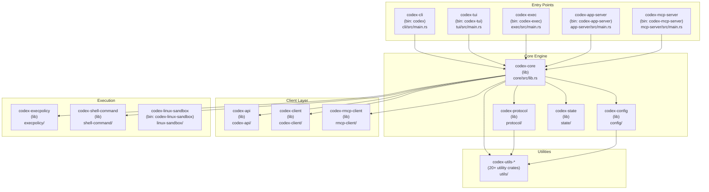
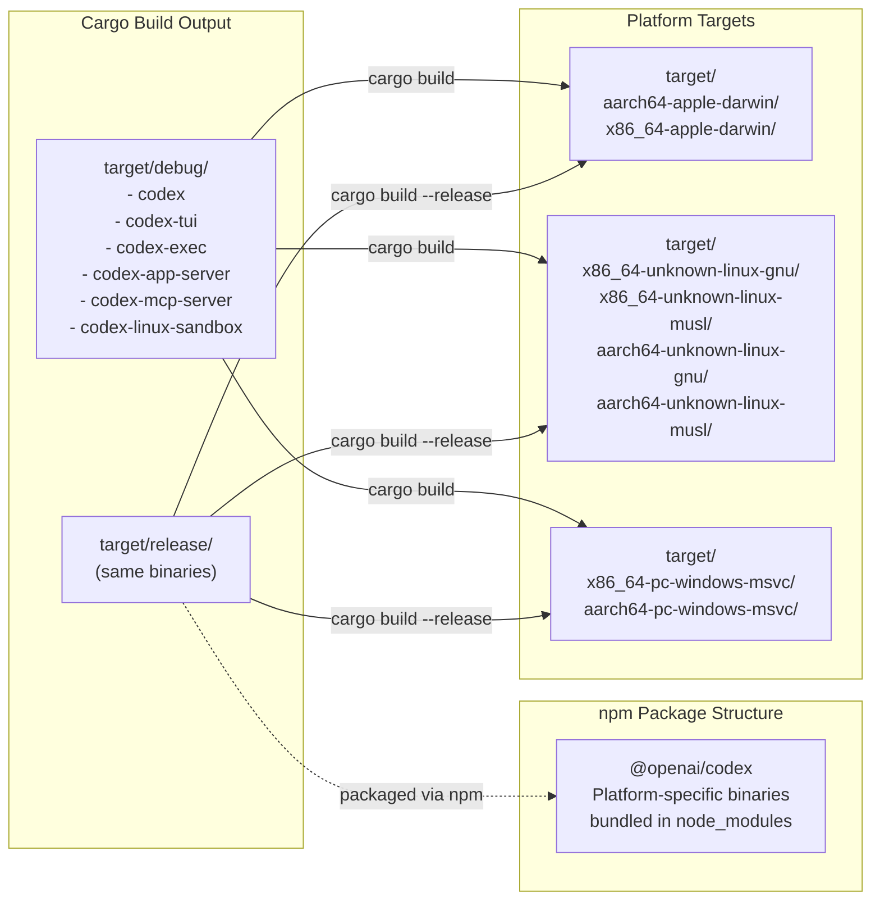
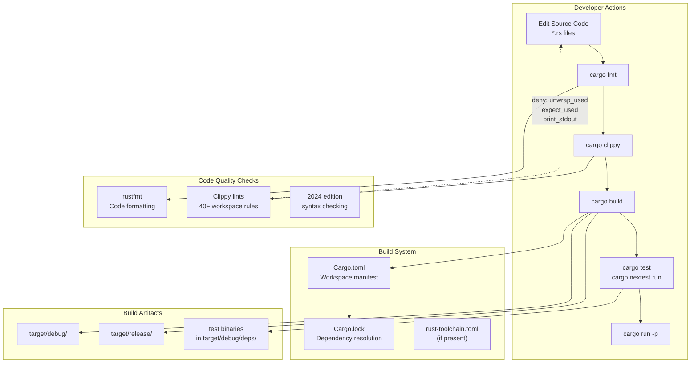

# Development Setup

<details>
<summary>Relevant source files</summary>

The following files were used as context for generating this wiki page:

- [codex-rs/Cargo.lock](codex-rs/Cargo.lock)
- [codex-rs/Cargo.toml](codex-rs/Cargo.toml)
- [codex-rs/README.md](codex-rs/README.md)
- [codex-rs/cli/Cargo.toml](codex-rs/cli/Cargo.toml)
- [codex-rs/cli/src/main.rs](codex-rs/cli/src/main.rs)
- [codex-rs/config.md](codex-rs/config.md)
- [codex-rs/core/Cargo.toml](codex-rs/core/Cargo.toml)
- [codex-rs/core/src/flags.rs](codex-rs/core/src/flags.rs)
- [codex-rs/core/src/lib.rs](codex-rs/core/src/lib.rs)
- [codex-rs/core/src/model_provider_info.rs](codex-rs/core/src/model_provider_info.rs)
- [codex-rs/exec/Cargo.toml](codex-rs/exec/Cargo.toml)
- [codex-rs/exec/src/cli.rs](codex-rs/exec/src/cli.rs)
- [codex-rs/exec/src/lib.rs](codex-rs/exec/src/lib.rs)
- [codex-rs/tui/Cargo.toml](codex-rs/tui/Cargo.toml)
- [codex-rs/tui/src/cli.rs](codex-rs/tui/src/cli.rs)
- [codex-rs/tui/src/lib.rs](codex-rs/tui/src/lib.rs)

</details>

## Purpose and Scope

This page documents the development environment setup for working on the Codex Rust codebase. It covers workspace organization, build configuration, development tooling, code formatting, and schema generation workflows. For information about testing practices and infrastructure, see [Testing Infrastructure](#8.2). For code organization conventions and review guidelines, see [Code Organization Patterns](#8.3).

---

## Prerequisites and Toolchain

The Codex Rust workspace requires a modern Rust toolchain and platform-specific build dependencies.

### Rust Toolchain

The workspace uses **Rust 2024 edition** as specified in [codex-rs/Cargo.toml:80](). All workspace members inherit this edition unless explicitly overridden.

```toml
[workspace.package]
version = "0.0.0"
edition = "2024"
license = "Apache-2.0"
```

### Platform-Specific Dependencies

Different platforms require specific native libraries:

| Platform    | Dependencies               | Purpose                             |
| ----------- | -------------------------- | ----------------------------------- |
| **Linux**   | `libssl-dev`, `pkg-config` | OpenSSL (vendored for musl targets) |
| **macOS**   | Xcode Command Line Tools   | Core Foundation, Keychain access    |
| **Windows** | MSVC Build Tools           | Windows SDK, restricted token APIs  |
| **All**     | `cmake` (optional)         | Building vendored C dependencies    |

For **Linux MUSL targets** (static binaries), OpenSSL is built from source via the `vendored` feature flag in [codex-rs/core/Cargo.toml:131-135]():

```toml
[target.x86_64-unknown-linux-musl.dependencies]
openssl-sys = { workspace = true, features = ["vendored"] }

[target.aarch64-unknown-linux-musl.dependencies]
openssl-sys = { workspace = true, features = ["vendored"] }
```

**Sources:** [codex-rs/Cargo.toml:74-80](), [codex-rs/core/Cargo.toml:120-147]()

---

## Workspace Structure and Build Organization

The Codex codebase is organized as a **Cargo workspace** with 71 member crates, divided into core functionality, user interfaces, utilities, and platform-specific implementations.

### Workspace Dependency Graph



### Key Workspace Members

The workspace defines all members in [codex-rs/Cargo.toml:2-71]():

**Primary Crates:**

- `codex-cli` — Multitool dispatcher and main entry point [codex-rs/cli/src/main.rs:1-800]()
- `codex-core` — Session management, tool orchestration, model client [codex-rs/core/src/lib.rs:1-178]()
- `codex-tui` — Terminal UI built with Ratatui [codex-rs/tui/src/lib.rs:1-531]()
- `codex-exec` — Headless non-interactive execution mode [codex-rs/exec/src/lib.rs:1-1200]()
- `codex-app-server` — JSON-RPC server for IDE integrations [app-server/]()

**Supporting Libraries:**

- `codex-protocol` — Shared types and event definitions
- `codex-config` — Configuration loading and validation
- `codex-state` — SQLite-based state management
- `codex-execpolicy` — Starlark-based execution policies
- `codex-rmcp-client` — MCP client implementation

**Utilities (20+ crates):**
Located in `utils/` subdirectory, including:

- `codex-utils-absolute-path` — Path normalization
- `codex-utils-cargo-bin` — Test binary location helpers
- `codex-utils-cli` — CLI argument parsing utilities
- `codex-utils-pty` — PTY management for interactive shells

**Sources:** [codex-rs/Cargo.toml:1-71](), [codex-rs/README.md:93-103]()

---

## Building the Project

### Standard Build Commands

Build the entire workspace or specific crates using standard Cargo commands:

```bash
# Build all workspace members in debug mode
cargo build

# Build a specific crate
cargo build -p codex-cli
cargo build -p codex-core

# Build optimized release binaries
cargo build --release

# Build for a specific target (cross-compilation)
cargo build --target x86_64-unknown-linux-musl
```

### Build Profiles

The workspace defines custom build profiles in [codex-rs/Cargo.toml:367-380]():

```toml
[profile.release]
lto = "fat"              # Full link-time optimization
split-debuginfo = "off"  # No debug info splitting
strip = "symbols"        # Strip all symbols for minimal size
codegen-units = 1        # Single codegen unit for better optimization

[profile.ci-test]
debug = 1                # Reduced debug symbols
inherits = "test"
opt-level = 0
```

**Profile Usage:**

| Profile         | Purpose                            | Command                        |
| --------------- | ---------------------------------- | ------------------------------ |
| `dev` (default) | Fast iteration, incremental builds | `cargo build`                  |
| `release`       | Production binaries, fat LTO       | `cargo build --release`        |
| `ci-test`       | CI testing with minimal debug info | `cargo test --profile ci-test` |

The `release` profile uses `codegen-units = 1` to enable maximum cross-crate optimization, addressing performance issues documented in GitHub issue #1411.

**Sources:** [codex-rs/Cargo.toml:367-380]()

---

## Development Commands and Workflows

### Schema Generation

The `codex-core` crate includes a binary for generating JSON schemas from Rust types:

```bash
# Generate config schema
cargo run --bin codex-write-config-schema
```

This binary is defined in [codex-rs/core/Cargo.toml:13-14]():

```toml
[[bin]]
name = "codex-write-config-schema"
path = "src/bin/config_schema.rs"
```

The app-server protocol also supports TypeScript and JSON schema generation via CLI commands defined in [codex-rs/cli/src/main.rs:343-377]():

```bash
# Generate TypeScript bindings
codex app-server generate-ts --out <DIR> [--prettier <PATH>] [--experimental]

# Generate JSON Schema bundle
codex app-server generate-json-schema --out <DIR> [--experimental]
```

### Running Development Binaries

Each entry point can be run directly from the workspace:

```bash
# Run the TUI interactively
cargo run -p codex-tui

# Run exec mode with a prompt
cargo run -p codex-exec -- "list files in this directory"

# Run the app server on stdio
cargo run -p codex-app-server

# Run as MCP server
cargo run -p codex-mcp-server
```

### Binary Output Locations



**Sources:** [codex-rs/core/Cargo.toml:13-14](), [codex-rs/cli/src/main.rs:343-377]()

---

## Code Formatting and Linting

### Workspace-Level Linting Rules

The workspace defines strict Clippy lints that apply to all members in [codex-rs/Cargo.toml:319-356]():

```toml
[workspace.lints.clippy]
expect_used = "deny"
identity_op = "deny"
manual_clamp = "deny"
# ... (40+ additional rules)
needless_borrow = "deny"
redundant_clone = "deny"
uninlined_format_args = "deny"
unwrap_used = "deny"
```

**Key Denied Patterns:**

| Lint                           | Reason                               | Alternative                        |
| ------------------------------ | ------------------------------------ | ---------------------------------- |
| `expect_used`                  | Prevents panic in production         | Use `?` or explicit error handling |
| `unwrap_used`                  | Same as above                        | Use pattern matching or `?`        |
| `print_stdout`, `print_stderr` | Prevents accidental I/O in libraries | Use `tracing` macros               |

Several crates explicitly deny stdout/stderr writes to prevent accidental output in library code:

```rust
// In codex-rs/tui/src/lib.rs:1-4
#![deny(clippy::print_stdout, clippy::print_stderr)]
#![deny(clippy::disallowed_methods)]

// In codex-rs/core/src/lib.rs:4-6
#![deny(clippy::print_stdout, clippy::print_stderr)]

// In codex-rs/exec/src/lib.rs:1-5
// stdout must be valid JSONL in --json mode
#![deny(clippy::print_stdout)]
```

### Formatting Commands

Standard Rust formatting via `rustfmt`:

```bash
# Format all workspace code
cargo fmt

# Check formatting without modifying files
cargo fmt -- --check

# Format a specific package
cargo fmt -p codex-core
```

### Linting Commands

```bash
# Run Clippy with workspace lints
cargo clippy --all-targets

# Deny warnings in CI
cargo clippy --all-targets -- -D warnings

# Run Clippy on a specific crate
cargo clippy -p codex-core
```

### Per-Crate Lint Inheritance

Each crate inherits workspace lints via:

```toml
[lints]
workspace = true
```

Individual crates can override or extend these defaults. For example, [codex-rs/core/Cargo.toml:16-17]() shows the standard inheritance pattern.

**Sources:** [codex-rs/Cargo.toml:319-356](), [codex-rs/tui/src/lib.rs:1-6](), [codex-rs/core/src/lib.rs:4-6](), [codex-rs/exec/src/lib.rs:1-5]()

---

## Workspace Dependencies and Version Management

### Centralized Dependency Versions

All external dependencies are defined once in [codex-rs/Cargo.toml:154-318]() and referenced via `{ workspace = true }`:

```toml
[workspace.dependencies]
# External
anyhow = "1"
tokio = "1"
serde = "1"
serde_json = "1"
tracing = "0.1.44"
clap = "4"
# ... (100+ more)

# Internal workspace crates
codex-core = { path = "core" }
codex-protocol = { path = "protocol" }
# ... (70+ workspace members)
```

Individual crates reference these via:

```toml
[dependencies]
anyhow = { workspace = true }
tokio = { workspace = true, features = ["macros", "rt-multi-thread"] }
codex-core = { workspace = true }
```

### Dependency Patches

The workspace applies patches to upstream crates in [codex-rs/Cargo.toml:382-394]():

```toml
[patch.crates-io]
crossterm = { git = "https://github.com/nornagon/crossterm", branch = "nornagon/color-query" }
ratatui = { git = "https://github.com/nornagon/ratatui", branch = "nornagon-v0.29.0-patch" }
tokio-tungstenite = { git = "https://github.com/openai-oss-forks/tokio-tungstenite", rev = "132f5b3..." }
tungstenite = { git = "https://github.com/openai-oss-forks/tungstenite-rs", rev = "9200079..." }
```

These patches override crates.io versions with custom forks that include Codex-specific fixes or features.

**Sources:** [codex-rs/Cargo.toml:154-318](), [codex-rs/Cargo.toml:382-394]()

---

## Feature Flags and Conditional Compilation

### TUI-Specific Features

The `codex-tui` crate defines optional features in [codex-rs/tui/Cargo.toml:15-21]():

```toml
[features]
default = ["voice-input"]
vt100-tests = []           # Enable vt100 emulator for tests
debug-logs = []            # Verbose debug logging
voice-input = ["dep:cpal", "dep:hound"]  # Audio capture (non-Linux only)
```

Voice input is conditionally compiled only on non-Linux platforms:

```toml
[target.'cfg(not(target_os = "linux"))'.dependencies]
cpal = { version = "0.15", optional = true }
hound = { version = "3.5", optional = true }
```

### Environment-Based Feature Flags

Runtime feature toggles are managed via the `env-flags` crate. For example, [codex-rs/core/src/flags.rs:1-7]() defines test fixtures:

```rust
use env_flags::env_flags;

env_flags! {
    /// Fixture path for offline tests (see client.rs).
    pub CODEX_RS_SSE_FIXTURE: Option<&str> = None;
}
```

This allows developers to set `CODEX_RS_SSE_FIXTURE=/path/to/fixture` to run tests against recorded API responses.

**Sources:** [codex-rs/tui/Cargo.toml:15-21](), [codex-rs/tui/Cargo.toml:111-114](), [codex-rs/core/src/flags.rs:1-7]()

---

## Development Workflow Diagram



**Sources:** [codex-rs/Cargo.toml:319-380]()

---

## Platform-Specific Build Considerations

### Target-Specific Dependencies

Dependencies vary by platform, as defined in workspace and crate-level `Cargo.toml` files:

```toml
# Linux-specific (landlock, seccompiler)
[target.'cfg(target_os = "linux")'.dependencies]
keyring = { workspace = true, features = ["linux-native-async-persistent"] }
landlock = { workspace = true }
seccompiler = { workspace = true }

# macOS-specific (Core Foundation, Keychain)
[target.'cfg(target_os = "macos")'.dependencies]
core-foundation = "0.9"
keyring = { workspace = true, features = ["apple-native"] }

# Windows-specific (windows-sys)
[target.'cfg(target_os = "windows")'.dependencies]
keyring = { workspace = true, features = ["windows-native"] }
windows-sys = { version = "0.52", features = [...] }

# Unix-specific (shell escalation)
[target.'cfg(unix)'.dependencies]
codex-shell-escalation = { workspace = true }
```

### MUSL Static Linking

For static Linux binaries, OpenSSL is vendored to avoid runtime glibc dependencies:

```toml
[target.x86_64-unknown-linux-musl.dependencies]
openssl-sys = { workspace = true, features = ["vendored"] }

[target.aarch64-unknown-linux-musl.dependencies]
openssl-sys = { workspace = true, features = ["vendored"] }
```

**Sources:** [codex-rs/core/Cargo.toml:120-147]()

---

## Common Development Tasks

### Quick Reference Table

| Task                       | Command                                     | Notes                                     |
| -------------------------- | ------------------------------------------- | ----------------------------------------- |
| **Build workspace**        | `cargo build`                               | Debug profile, all crates                 |
| **Build release**          | `cargo build --release`                     | Fat LTO, stripped symbols                 |
| **Run TUI**                | `cargo run -p codex-tui`                    | Interactive mode                          |
| **Run exec**               | `cargo run -p codex-exec -- "prompt"`       | Headless execution                        |
| **Format code**            | `cargo fmt`                                 | Applies rustfmt to workspace              |
| **Check format**           | `cargo fmt -- --check`                      | CI-friendly formatting check              |
| **Lint code**              | `cargo clippy --all-targets`                | Runs workspace Clippy rules               |
| **Run tests**              | `cargo test`                                | Standard test runner                      |
| **Run tests (nextest)**    | `cargo nextest run`                         | Parallel test executor (see [#8.2](#8.2)) |
| **Generate config schema** | `cargo run --bin codex-write-config-schema` | JSON schema output                        |
| **Generate TS bindings**   | `codex app-server generate-ts --out <dir>`  | App-server protocol types                 |
| **Check dependencies**     | `cargo tree`                                | Display dependency graph                  |
| **Update Cargo.lock**      | `cargo update`                              | Refresh dependency versions               |

### Environment Variables for Development

| Variable               | Purpose                   | Example                                    |
| ---------------------- | ------------------------- | ------------------------------------------ |
| `RUST_LOG`             | Tracing filter            | `RUST_LOG=codex_core=debug,codex_tui=info` |
| `CODEX_RS_SSE_FIXTURE` | Offline test fixture path | Used in integration tests                  |
| `OPENAI_API_KEY`       | API authentication        | Required for live API tests                |
| `OPENAI_BASE_URL`      | Override default endpoint | For testing with proxies                   |

**Sources:** [codex-rs/core/src/flags.rs:1-7](), [codex-rs/core/src/model_provider_info.rs:226-228]()

---

## Troubleshooting Build Issues

### Common Build Failures

**OpenSSL linking errors on Linux:**

```bash
# Install development headers
sudo apt-get install libssl-dev pkg-config  # Debian/Ubuntu
sudo dnf install openssl-devel              # Fedora/RHEL
```

**Keyring errors on Linux:**
The workspace uses different keyring backends per platform. On headless Linux systems without a secret service:

```bash
# Use file-based storage (less secure)
# Set in environment or use sync-secret-service feature
```

**Clippy failures:**
Workspace lints deny common patterns. If you encounter denials:

- Use `?` operator instead of `.unwrap()` or `.expect()`
- Use `tracing::info!()` instead of `println!()` in library code
- Add `#[allow(clippy::specific_lint)]` only when absolutely necessary

### Dependency Resolution

If `Cargo.lock` causes conflicts:

```bash
# Regenerate lock file
rm Cargo.lock
cargo update
```

For patch-related issues, see the `[patch.crates-io]` section in [codex-rs/Cargo.toml:382-394]() to understand which upstream crates are overridden.

**Sources:** [codex-rs/Cargo.toml:357-365](), [codex-rs/Cargo.toml:382-394](), [codex-rs/core/Cargo.toml:120-147]()
