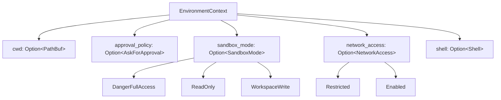
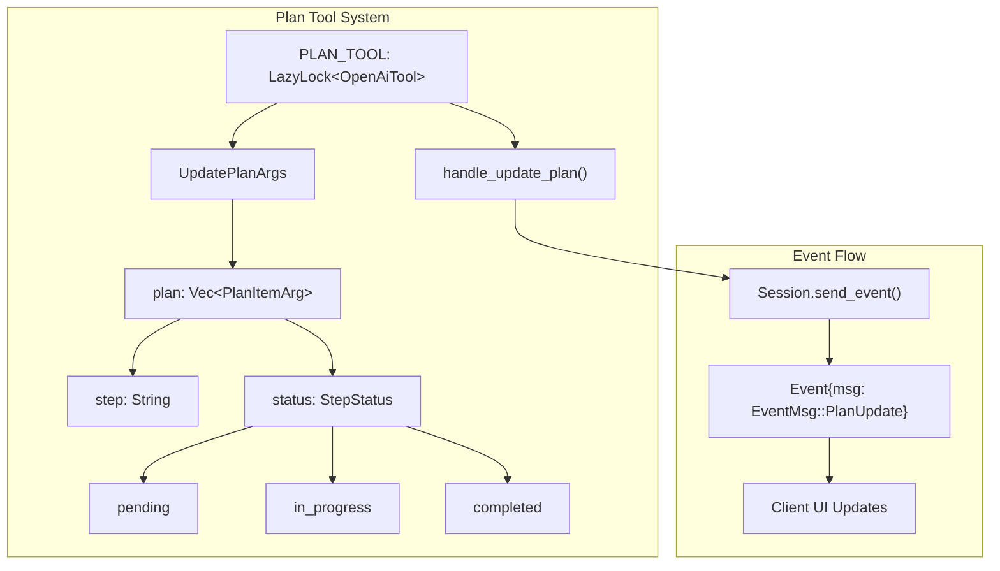
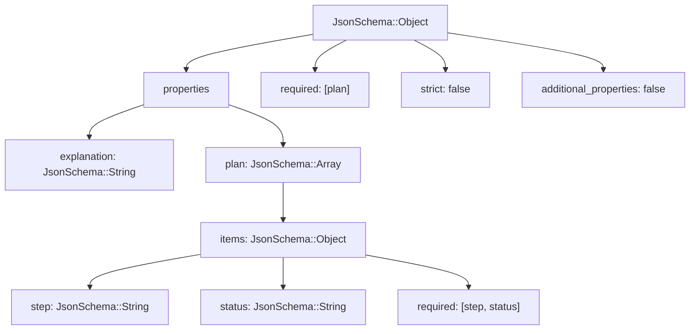
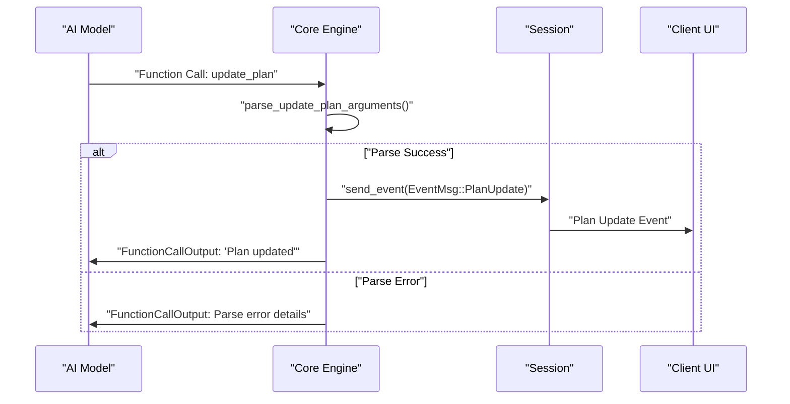
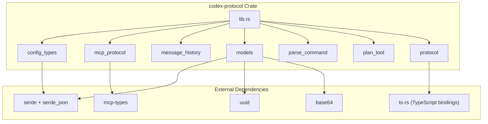
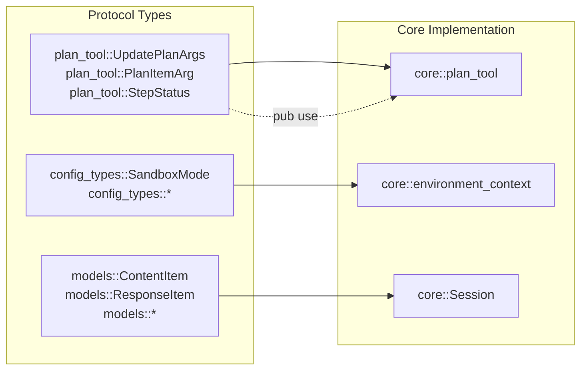

# Development Guide

<details>
<summary>Relevant source files</summary>

The following files were used as context for generating this wiki page:

- [.github/actions/windows-code-sign/action.yml](.github/actions/windows-code-sign/action.yml)
- [.github/scripts/install-musl-build-tools.sh](.github/scripts/install-musl-build-tools.sh)
- [.github/workflows/ci.yml](.github/workflows/ci.yml)
- [.github/workflows/rust-ci.yml](.github/workflows/rust-ci.yml)
- [.github/workflows/rust-release-windows.yml](.github/workflows/rust-release-windows.yml)
- [.github/workflows/rust-release.yml](.github/workflows/rust-release.yml)
- [.github/workflows/sdk.yml](.github/workflows/sdk.yml)
- [.github/workflows/shell-tool-mcp.yml](.github/workflows/shell-tool-mcp.yml)
- [.github/workflows/zstd](.github/workflows/zstd)
- [AGENTS.md](AGENTS.md)
- [codex-rs/.cargo/config.toml](codex-rs/.cargo/config.toml)
- [codex-rs/Cargo.lock](codex-rs/Cargo.lock)
- [codex-rs/Cargo.toml](codex-rs/Cargo.toml)
- [codex-rs/README.md](codex-rs/README.md)
- [codex-rs/cli/Cargo.toml](codex-rs/cli/Cargo.toml)
- [codex-rs/cli/src/main.rs](codex-rs/cli/src/main.rs)
- [codex-rs/config.md](codex-rs/config.md)
- [codex-rs/core/Cargo.toml](codex-rs/core/Cargo.toml)
- [codex-rs/core/src/flags.rs](codex-rs/core/src/flags.rs)
- [codex-rs/core/src/lib.rs](codex-rs/core/src/lib.rs)
- [codex-rs/core/src/model_provider_info.rs](codex-rs/core/src/model_provider_info.rs)
- [codex-rs/exec/Cargo.toml](codex-rs/exec/Cargo.toml)
- [codex-rs/exec/src/cli.rs](codex-rs/exec/src/cli.rs)
- [codex-rs/exec/src/lib.rs](codex-rs/exec/src/lib.rs)
- [codex-rs/rust-toolchain.toml](codex-rs/rust-toolchain.toml)
- [codex-rs/scripts/setup-windows.ps1](codex-rs/scripts/setup-windows.ps1)
- [codex-rs/shell-escalation/README.md](codex-rs/shell-escalation/README.md)
- [codex-rs/tui/Cargo.toml](codex-rs/tui/Cargo.toml)
- [codex-rs/tui/src/cli.rs](codex-rs/tui/src/cli.rs)
- [codex-rs/tui/src/lib.rs](codex-rs/tui/src/lib.rs)

</details>

This guide provides essential information for contributors to the Codex project. It covers the workspace structure, toolchain requirements, build commands, and testing strategies needed to develop and contribute to the codebase effectively.

For detailed testing workflows, see [Development Workflow and Testing](#8.1). For overall architecture, see [Architecture Overview](#1.1).

## Environment Context System

The environment context system provides AI models with structured information about the execution environment, enabling better decision-making and tool usage. The system serializes environment state into XML format that models can easily parse.

### Environment Context Structure

The `EnvironmentContext` struct centralizes key environmental parameters:



Sources: [codex-rs/core/src/environment_context.rs:24-32]()

### XML Serialization Protocol

The environment context is serialized to XML using custom serialization logic to maintain compatibility with AI models that expect structured XML input:

```mermaid
sequenceDiagram
    participant Core as "Core Engine"
    participant EC as "EnvironmentContext"
    participant Model as "AI Model"

    Core->>EC: "new(cwd, approval_policy, sandbox_policy, shell)"
    EC->>EC: "Map SandboxPolicy to SandboxMode/NetworkAccess"
    Core->>EC: "serialize_to_xml()"
    EC->>EC: "Generate XML with ENVIRONMENT_CONTEXT tags"
    EC->>Model: "XML Context in ResponseItem"

    Note over EC,Model: "&lt;environment_context&gt;<br/>&nbsp;&nbsp;&lt;cwd&gt;...&lt;/cwd&gt;<br/>&nbsp;&nbsp;&lt;sandbox_mode&gt;...&lt;/sandbox_mode&gt;<br/>&lt;/environment_context&gt;"
```

The XML format uses predefined tags `ENVIRONMENT_CONTEXT_START` and `ENVIRONMENT_CONTEXT_END` to wrap the context data, making it easily parseable by AI models.

Sources: [codex-rs/core/src/environment_context.rs:13-15](), [codex-rs/core/src/environment_context.rs:67-109]()

### Sandbox Policy Mapping

Environment context automatically maps `SandboxPolicy` configurations to appropriate `SandboxMode` and `NetworkAccess` settings:

| SandboxPolicy                           | SandboxMode        | NetworkAccess |
| --------------------------------------- | ------------------ | ------------- |
| `DangerFullAccess`                      | `DangerFullAccess` | `Enabled`     |
| `ReadOnly`                              | `ReadOnly`         | `Restricted`  |
| `WorkspaceWrite{network_access: true}`  | `WorkspaceWrite`   | `Enabled`     |
| `WorkspaceWrite{network_access: false}` | `WorkspaceWrite`   | `Restricted`  |

Sources: [codex-rs/core/src/environment_context.rs:44-62]()

## Planning and Task Management

The planning system provides AI models with structured tools to create, update, and track task execution plans. This enables better organization of complex multi-step operations.

### Plan Tool Architecture



Sources: [codex-rs/core/src/plan_tool.rs:21-61](), [codex-rs/core/src/plan_tool.rs:14-17]()

### Plan Tool JSON Schema

The plan tool uses a structured JSON schema to enforce consistency in plan updates:



The schema enforces that at most one step can be `in_progress` at any time, maintaining execution order constraints.

Sources: [codex-rs/core/src/plan_tool.rs:21-61]()

### Plan Execution Flow



Sources: [codex-rs/core/src/plan_tool.rs:66-91](), [codex-rs/core/src/plan_tool.rs:93-110]()

## Protocol Layer Architecture

The protocol layer defines the communication contracts between different components of the Codex system, ensuring type-safe message passing and consistent data formats.

### Protocol Crate Structure



Sources: [codex-rs/protocol/src/lib.rs:1-7](), [codex-rs/protocol/Cargo.toml:13-24]()

### Cross-Language Protocol Support

The protocol crate uses `ts-rs` to generate TypeScript bindings, enabling seamless communication between the Rust core and Node.js implementations:

| Feature               | Purpose                  | Implementation                                      |
| --------------------- | ------------------------ | --------------------------------------------------- |
| `serde` serialization | JSON message format      | All protocol types derive `Serialize`/`Deserialize` |
| `ts-rs` bindings      | TypeScript compatibility | Generate `.d.ts` files for Node.js client           |
| `uuid` support        | Message correlation      | Unique identifiers for events and submissions       |
| `base64` encoding     | Binary data transport    | File content and binary message payloads            |

Sources: [codex-rs/protocol/Cargo.toml:23-24]()

### Protocol Type Safety

The protocol system ensures type identity across crate boundaries by centralizing type definitions:



This design ensures that protocol message types transported via `codex_protocol` maintain type identity across the entire system.

Sources: [codex-rs/core/src/plan_tool.rs:13-17]()
