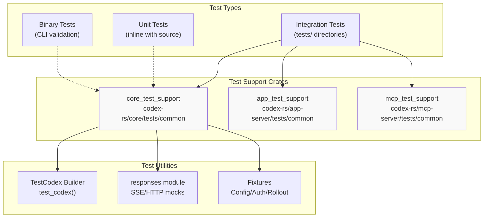
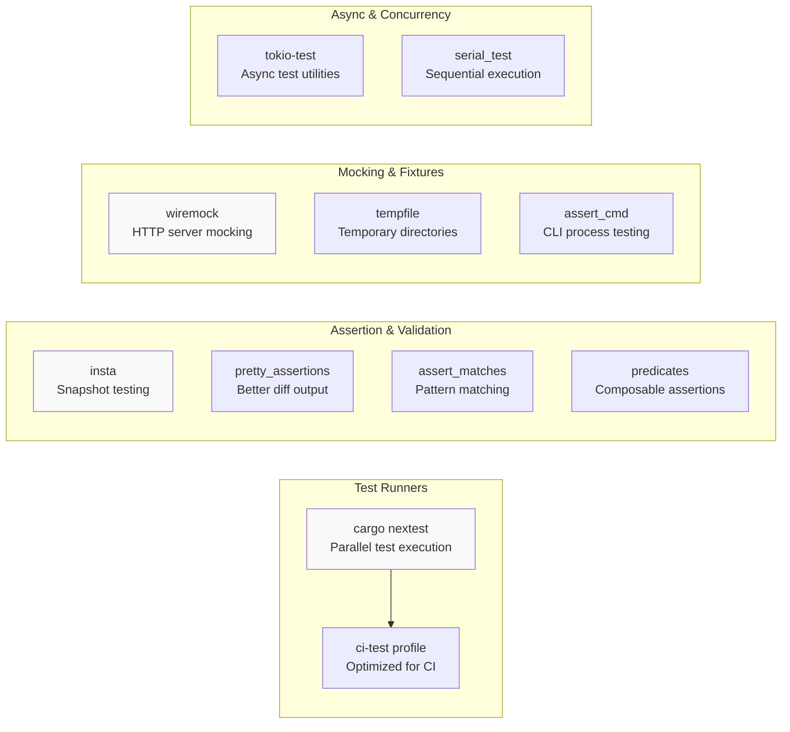
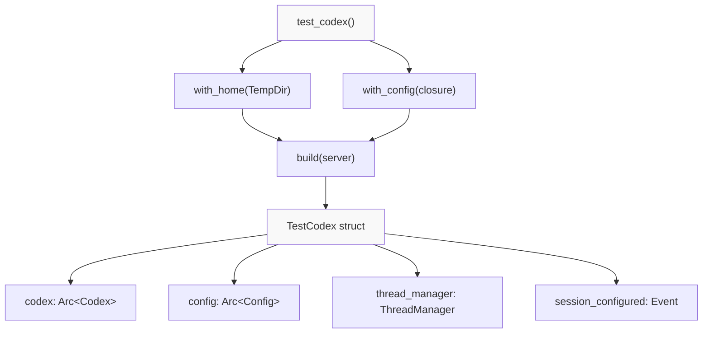

# Testing Infrastructure

<details>
<summary>Relevant source files</summary>

The following files were used as context for generating this wiki page:

- [codex-rs/Cargo.lock](codex-rs/Cargo.lock)
- [codex-rs/Cargo.toml](codex-rs/Cargo.toml)
- [codex-rs/README.md](codex-rs/README.md)
- [codex-rs/cli/Cargo.toml](codex-rs/cli/Cargo.toml)
- [codex-rs/cli/src/main.rs](codex-rs/cli/src/main.rs)
- [codex-rs/config.md](codex-rs/config.md)
- [codex-rs/core/Cargo.toml](codex-rs/core/Cargo.toml)
- [codex-rs/core/src/flags.rs](codex-rs/core/src/flags.rs)
- [codex-rs/core/src/lib.rs](codex-rs/core/src/lib.rs)
- [codex-rs/core/src/model_provider_info.rs](codex-rs/core/src/model_provider_info.rs)
- [codex-rs/core/tests/responses_headers.rs](codex-rs/core/tests/responses_headers.rs)
- [codex-rs/core/tests/suite/client.rs](codex-rs/core/tests/suite/client.rs)
- [codex-rs/core/tests/suite/prompt_caching.rs](codex-rs/core/tests/suite/prompt_caching.rs)
- [codex-rs/exec/Cargo.toml](codex-rs/exec/Cargo.toml)
- [codex-rs/exec/src/cli.rs](codex-rs/exec/src/cli.rs)
- [codex-rs/exec/src/lib.rs](codex-rs/exec/src/lib.rs)
- [codex-rs/tui/Cargo.toml](codex-rs/tui/Cargo.toml)
- [codex-rs/tui/src/cli.rs](codex-rs/tui/src/cli.rs)
- [codex-rs/tui/src/lib.rs](codex-rs/tui/src/lib.rs)

</details>

This document describes the testing infrastructure for the Codex Rust codebase, including test organization, key testing tools, support utilities, and patterns for writing tests. For development environment setup, see [8.1](#8.1). For code organization patterns and conventions, see [8.3](#8.3).

## Overview

The Codex test infrastructure is built around **cargo nextest** as the primary test runner, with **snapshot testing** (via `insta`) for output validation and **HTTP mocking** (via `wiremock`) for integration tests. Tests are organized into unit tests (inline with source files), integration tests (in `tests/` directories), and test support crates that provide reusable fixtures, mocks, and utilities.

The testing approach emphasizes:

- **Isolation**: Tests use temporary directories and mock servers to avoid external dependencies
- **Reproducibility**: Snapshot testing captures expected outputs for regression detection
- **Maintainability**: Shared test utilities reduce boilerplate across test suites
- **Speed**: Nextest parallelizes test execution and provides improved output

Sources: [codex-rs/Cargo.toml:1-395](), [codex-rs/core/Cargo.toml:1-183](), [codex-rs/tui/Cargo.toml:1-145]()

## Test Organization



**Sources**: [codex-rs/core/Cargo.toml:151-179](), [codex-rs/Cargo.toml:85-152]()

### Unit Tests

Unit tests are defined inline within source files using the `#[cfg(test)]` attribute. These tests focus on individual functions or modules in isolation.

**Location**: Inline in source files (e.g., `mod tests { ... }` blocks)

### Integration Tests

Integration tests are organized in `tests/` directories within each crate. They test interactions between components and external dependencies.

**Key integration test suites**:

- [codex-rs/core/tests/suite/client.rs:1-1458]() - Model client and session management
- [codex-rs/core/tests/suite/prompt_caching.rs:1-658]() - Prompt caching and consistency
- [codex-rs/core/tests/responses_headers.rs:1-265]() - HTTP header handling

### Test Support Crates

Three workspace-private crates provide shared test infrastructure:

| Crate               | Path                               | Purpose                                 |
| ------------------- | ---------------------------------- | --------------------------------------- |
| `core_test_support` | `codex-rs/core/tests/common`       | Core testing utilities, mocks, fixtures |
| `app_test_support`  | `codex-rs/app-server/tests/common` | App server protocol test helpers        |
| `mcp_test_support`  | `codex-rs/mcp-server/tests/common` | MCP server test utilities               |

**Sources**: [codex-rs/Cargo.toml:85-86](), [codex-rs/Cargo.toml:151-152](), [codex-rs/core/Cargo.toml:160]()

## Key Testing Dependencies



**Sources**: [codex-rs/Cargo.toml:155-318](), [codex-rs/Cargo.toml:377-381]()

### cargo nextest

The project uses `cargo nextest` as the test runner for improved parallelization and output formatting. The `ci-test` profile is optimized for continuous integration:

```toml
[profile.ci-test]
debug = 1         # Reduce debug symbol size
inherits = "test"
opt-level = 0
```

**Source**: [codex-rs/Cargo.toml:377-381]()

### Snapshot Testing (insta)

The `insta` crate provides snapshot testing for complex outputs. Snapshots are stored alongside tests and reviewed using `cargo insta review`.

**Usage pattern** (from test files):

```rust
insta::assert_snapshot!(output);
```

**Source**: [codex-rs/Cargo.toml:202]()

### HTTP Mocking (wiremock)

The `wiremock` crate mocks HTTP servers for testing API interactions without external dependencies. Test support provides utilities for mounting SSE (Server-Sent Events) responses.

**Example usage** (from test files):

```rust
let server = MockServer::start().await;
let mock = mount_sse_once(&server, sse(vec![
    ev_response_created("resp1"),
    ev_completed("resp1")
])).await;
```

**Sources**: [codex-rs/core/tests/suite/client.rs:69-77](), [codex-rs/Cargo.toml:316]()

### CLI Testing (assert_cmd)

The `assert_cmd` crate tests CLI binaries by spawning processes and validating exit codes and output.

**Source**: [codex-rs/Cargo.toml:161]()

## Test Support Infrastructure

### TestCodex Builder Pattern

The `core_test_support` crate provides a `TestCodex` builder for setting up test environments with mock servers and custom configurations.



**Example usage**:

```rust
let TestCodex { codex, config, .. } = test_codex()
    .with_config(|config| {
        config.user_instructions = Some("be helpful".to_string());
        config.model = Some("gpt-4".to_string());
    })
    .build(&server)
    .await?;
```

**Sources**: [codex-rs/core/tests/suite/client.rs:115-135](), [codex-rs/core/tests/suite/prompt_caching.rs:119-135]()

### Mock Response Utilities

The `responses` module in `core_test_support` provides utilities for creating mock HTTP responses, especially for Server-Sent Events (SSE) streams.

**Key functions**:

- `start_mock_server()` - Creates a `wiremock::MockServer`
- `mount_sse_once()` - Mounts a single-use SSE endpoint
- `mount_sse_sequence()` - Mounts multiple sequential SSE responses
- `sse()` - Formats events as SSE stream
- `ev_response_created()` - Creates a `response.created` event
- `ev_completed()` - Creates a `response.completed` event
- `ev_output_text_delta()` - Creates a text delta event

**Example**:

```rust
let server = start_mock_server().await;
let mock = mount_sse_once(&server, sse(vec![
    ev_response_created("resp-1"),
    ev_output_text_delta("resp-1", "Hello"),
    ev_completed("resp-1")
])).await;
```

**Sources**: [codex-rs/core/tests/suite/client.rs:242-246](), [codex-rs/core/tests/suite/prompt_caching.rs:24]()

### Test Fixtures and Configuration

The test support crates provide utilities for creating test configurations, temporary directories, and mock authentication:

**Configuration helpers**:

- `load_default_config_for_test()` - Loads a minimal test configuration
- `write_auth_json()` - Creates mock authentication files

**Example** (from test files):

```rust
let codex_home = TempDir::new()?;
let config = load_default_config_for_test(&codex_home).await;
```

**Sources**: [codex-rs/core/tests/suite/client.rs:93-143](), [codex-rs/core/tests/responses_headers.rs:61]()

### Event Waiting Utilities

The `wait_for_event()` utility allows tests to block until a specific event is emitted:

```rust
wait_for_event(&codex, |ev| matches!(ev, EventMsg::TurnComplete(_))).await;
```

**Source**: [codex-rs/core/tests/suite/client.rs:283]()

## Common Testing Patterns

### Conditional Test Execution

Tests that require network access use the `skip_if_no_network!()` macro to skip when offline:

```rust
#[tokio::test]
async fn test_network_feature() {
    skip_if_no_network!();
    // Test code...
}
```

**Sources**: [codex-rs/core/tests/suite/client.rs:147](), [codex-rs/core/tests/suite/prompt_caching.rs:99]()

### Session Resumption Testing

Tests for session resumption create mock rollout files and verify that history is correctly loaded:

```rust
// Create rollout session file
let session_path = tmpdir.path().join("resume-session.jsonl");
let mut f = std::fs::File::create(&session_path)?;
writeln!(f, "{}", json!({"type": "session_meta", "payload": {...}}))?;
writeln!(f, "{}", json!({"type": "response_item", "payload": {...}}))?;

// Resume from file
let test = builder.resume(&server, codex_home, session_path).await?;
```

**Source**: [codex-rs/core/tests/suite/client.rs:146-239]()

### HTTP Header Validation

Tests verify that requests include expected headers by using `wiremock` matchers:

```rust
let request_recorder = mount_sse_once_match(
    &server,
    header("x-openai-subagent", "review"),
    response_body,
).await;

let request = request_recorder.single_request();
assert_eq!(request.header("x-openai-subagent").as_deref(), Some("review"));
```

**Source**: [codex-rs/core/tests/responses_headers.rs:31-133]()

### Prompt Consistency Testing

Tests validate that prompts remain consistent across multiple turns by comparing request bodies:

```rust
codex.submit(Op::UserInput { items: vec![...], ... }).await?;
wait_for_event(&codex, |ev| matches!(ev, EventMsg::TurnComplete(_))).await;

let body0 = req1.single_request().body_json();
let body1 = req2.single_request().body_json();

assert_eq!(body0["instructions"], body1["instructions\
```
