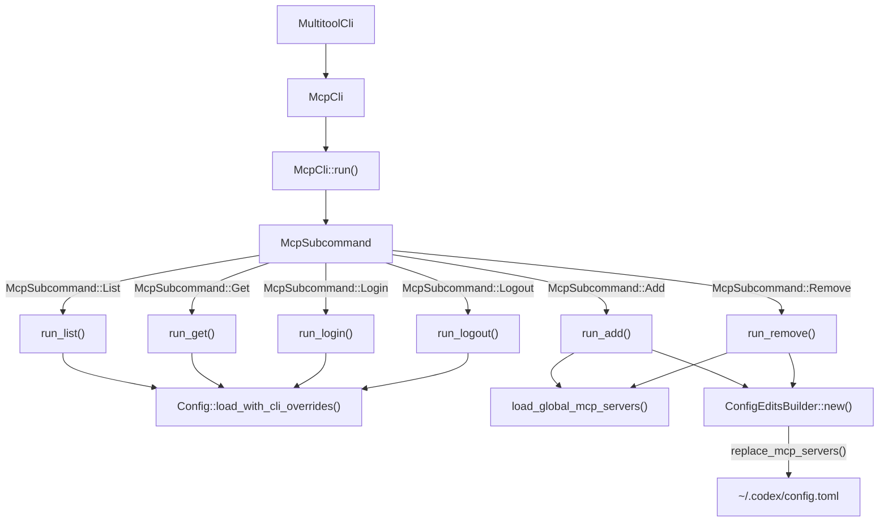
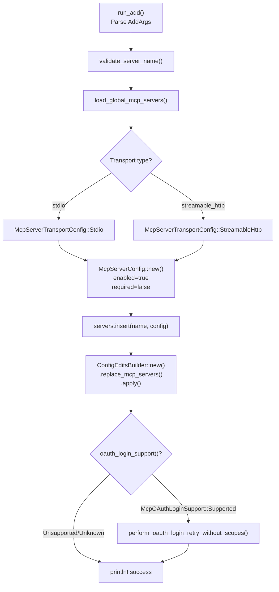
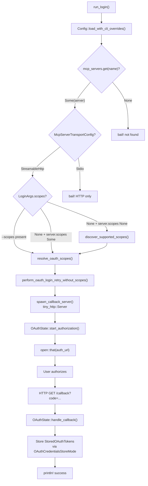
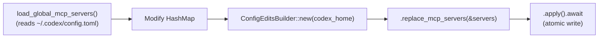

# MCP CLI Commands

<details>
<summary>Relevant source files</summary>

The following files were used as context for generating this wiki page:

- [codex-rs/app-server/tests/common/models_cache.rs](codex-rs/app-server/tests/common/models_cache.rs)
- [codex-rs/cli/src/mcp_cmd.rs](codex-rs/cli/src/mcp_cmd.rs)
- [codex-rs/cli/tests/mcp_add_remove.rs](codex-rs/cli/tests/mcp_add_remove.rs)
- [codex-rs/cli/tests/mcp_list.rs](codex-rs/cli/tests/mcp_list.rs)
- [codex-rs/codex-api/tests/models_integration.rs](codex-rs/codex-api/tests/models_integration.rs)
- [codex-rs/core/src/mcp_connection_manager.rs](codex-rs/core/src/mcp_connection_manager.rs)
- [codex-rs/core/src/models_manager/cache.rs](codex-rs/core/src/models_manager/cache.rs)
- [codex-rs/core/src/models_manager/manager.rs](codex-rs/core/src/models_manager/manager.rs)
- [codex-rs/core/src/models_manager/mod.rs](codex-rs/core/src/models_manager/mod.rs)
- [codex-rs/core/src/models_manager/model_info.rs](codex-rs/core/src/models_manager/model_info.rs)
- [codex-rs/core/src/original_image_detail.rs](codex-rs/core/src/original_image_detail.rs)
- [codex-rs/core/src/tools/handlers/view_image.rs](codex-rs/core/src/tools/handlers/view_image.rs)
- [codex-rs/core/tests/suite/model_switching.rs](codex-rs/core/tests/suite/model_switching.rs)
- [codex-rs/core/tests/suite/models_cache_ttl.rs](codex-rs/core/tests/suite/models_cache_ttl.rs)
- [codex-rs/core/tests/suite/personality.rs](codex-rs/core/tests/suite/personality.rs)
- [codex-rs/core/tests/suite/remote_models.rs](codex-rs/core/tests/suite/remote_models.rs)
- [codex-rs/core/tests/suite/rmcp_client.rs](codex-rs/core/tests/suite/rmcp_client.rs)
- [codex-rs/core/tests/suite/view_image.rs](codex-rs/core/tests/suite/view_image.rs)
- [codex-rs/protocol/src/openai_models.rs](codex-rs/protocol/src/openai_models.rs)

</details>

This page documents the `codex mcp` subcommands that allow users to manage Model Context Protocol (MCP) server configurations from the command line. These commands provide a convenient interface for adding, removing, listing, and authenticating with MCP servers without manually editing configuration files.

For information about the MCP server configuration structure and connection lifecycle, see [MCP Server Configuration](#6.1) and [MCP Connection Manager](#6.2). For details on OAuth implementation, see [OAuth Authentication for MCP](#6.5).

---

## Command Overview

The MCP CLI commands are implemented as subcommands under `codex mcp`. All commands operate on the global MCP server configuration stored in `~/.codex/config.toml` (or `$CODEX_HOME/config.toml`).

**Available Commands**:

- `list` — Display all configured MCP servers with their status
- `get <name>` — Show detailed configuration for a specific server
- `add <name>` — Add a new MCP server configuration
- `remove <name>` — Delete an MCP server configuration
- `login <name>` — Authenticate with an MCP server via OAuth
- `logout <name>` — Remove stored OAuth credentials

Sources: [codex-rs/cli/src/mcp_cmd.rs:37-54]()

---

## Command Dispatch Architecture



**Diagram: MCP Command Dispatch Flow**

The `McpCli` struct serves as the entry point, with its `run()` method delegating to dedicated handler functions for each `McpSubcommand` variant. Read operations (`list`, `get`) load the full `Config` to access merged configuration from all layers, while write operations (`add`, `remove`) directly manipulate the global MCP servers map via `ConfigEditsBuilder`.

Sources: [codex-rs/cli/src/mcp_cmd.rs:38-44](), [codex-rs/cli/src/mcp_cmd.rs:46-54](), [codex-rs/cli/src/mcp_cmd.rs:159-187]()

---

## List Command

The `list` command displays all configured MCP servers. It supports both human-readable table output and JSON format via the `--json` flag.

### Usage

```bash
codex mcp list [--json]
```

### Human-Readable Output

The command groups servers by transport type (stdio vs streamable-http) and displays them in separate tables:

**Stdio Servers Table**:
| Column | Description |
|--------|-------------|
| Name | Server identifier |
| Command | Executable or script path |
| Args | Command-line arguments |
| Env | Environment variables (inline and from `env_vars`) |
| Cwd | Working directory |
| Status | `enabled` or `disabled: <reason>` |
| Auth | OAuth status: `authenticated`, `unauthenticated`, `unsupported` |

**Streamable HTTP Servers Table**:
| Column | Description |
|--------|-------------|
| Name | Server identifier |
| Url | HTTP endpoint URL |
| Bearer Token Env Var | Environment variable containing token |
| Status | `enabled` or `disabled: <reason>` |
| Auth | OAuth status |

Environment variables are displayed with their values masked (e.g., `TOKEN=*****`) for security. Variables listed in `env_vars` are shown as `VAR_NAME=*****` even if not set, indicating they will be propagated from the parent environment if available.

Sources: [codex-rs/cli/src/mcp_cmd.rs:542-707](), [codex-rs/cli/tests/mcp_list.rs:33-119]()

### JSON Output

With `--json`, the command outputs an array of server configurations with full details:

```json
[
  {
    "name": "docs",
    "enabled": true,
    "disabled_reason": null,
    "transport": {
      "type": "stdio",
      "command": "docs-server",
      "args": ["--port", "4000"],
      "env": { "TOKEN": "secret" },
      "env_vars": ["APP_TOKEN"],
      "cwd": null
    },
    "startup_timeout_sec": 10.0,
    "tool_timeout_sec": 60.0,
    "auth_status": "unsupported"
  }
]
```

Sources: [codex-rs/cli/src/mcp_cmd.rs:478-534]()

### Authentication Status Computation

The `list` command calls `compute_auth_statuses()` to determine OAuth status for each server. This function:

1. Checks if the transport supports OAuth (streamable-http only)
2. Attempts to load stored credentials from the configured store mode
3. Returns `McpAuthStatus`:
   - `Authenticated` — Valid credentials exist
   - `Unauthenticated` — OAuth supported but no credentials
   - `Unsupported` — Transport doesn't support OAuth (stdio)

Sources: [codex-rs/cli/src/mcp_cmd.rs:475-476]()

---

## Get Command

The `get` command displays detailed configuration for a single MCP server.

### Usage

```bash
codex mcp get <name> [--json]
```

### Human-Readable Output

For enabled servers, `get` displays a detailed breakdown:

```
docs
  enabled: true
  enabled_tools: tool1, tool2
  disabled_tools: tool3
  transport: stdio
  command: docs-server
  args: --port 4000
  cwd: /path/to/workspace
  env: TOKEN=*****, APP_TOKEN=*****
  startup_timeout_sec: 10.0
  tool_timeout_sec: 60.0
  remove: codex mcp remove docs
```

For disabled servers, it shows a single line with the reason:

```
docs (disabled: org policy)
```

Sources: [codex-rs/cli/src/mcp_cmd.rs:712-802]()

### JSON Output

The JSON format mirrors the structure in the `list` command but for a single server. Environment variables and headers are shown with their actual values (not masked) in JSON output.

Sources: [codex-rs/cli/src/mcp_cmd.rs:726-770]()

---

## Add Command

The `add` command creates a new MCP server configuration. It supports two transport types: stdio (for local executables) and streamable-http (for remote HTTP servers).

### Usage

**Stdio transport**:

```bash
codex mcp add <name> [--env KEY=VALUE]... -- <command> [args...]
```

**Streamable HTTP transport**:

```bash
codex mcp add <name> --url <url> [--bearer-token-env-var <var>]
```

### Command Arguments

The `AddArgs` struct defines the argument structure:

| Argument                 | Type            | Description                                       |
| ------------------------ | --------------- | ------------------------------------------------- |
| `name`                   | String          | Server identifier (must match `^[a-zA-Z0-9_-]+$`) |
| `--env`                  | KEY=VALUE pairs | Environment variables for stdio servers           |
| `command`                | Trailing args   | Executable and arguments after `--`               |
| `--url`                  | String          | HTTP endpoint for streamable-http servers         |
| `--bearer-token-env-var` | String          | Environment variable containing auth token        |

The command uses `ArgGroup` to ensure exactly one transport type is specified.

Sources: [codex-rs/cli/src/mcp_cmd.rs:73-134]()

### Add Flow



**Diagram: Add Command Execution Flow**

Sources: [codex-rs/cli/src/mcp_cmd.rs:238-347]()

### OAuth Auto-Detection

After adding a streamable-http server, the `add` command automatically checks for OAuth support:

1. Calls `oauth_login_support()` to probe the server's `/oauth/start` endpoint
2. If OAuth is supported, immediately initiates `perform_oauth_login()`
3. If support is unknown, prints a hint: "Run `codex mcp login <name>` to login"

This eliminates the need for a separate login step in most cases.

Sources: [codex-rs/cli/src/mcp_cmd.rs:321-344]()

### Server Name Validation

Server names must conform to `^[a-zA-Z0-9_-]+$`. The `validate_server_name()` function enforces this to ensure:

- No conflicts with TOML syntax
- Names are filesystem-safe
- Compatibility with the qualified tool name format (`mcp__<server>__<tool>`)

Sources: [codex-rs/core/src/connectors.rs:59-79]()

### Environment Variable Handling

The `add` command supports two ways to pass environment variables to stdio servers:

1. **Inline env map** (`--env KEY=VALUE`): Values are stored directly in the config file
2. **env_vars whitelist**: Not configurable via CLI (requires manual TOML editing); propagates parent process environment variables

The `--env` flag uses `parse_env_pair()` to split `KEY=VALUE` strings, validating that both parts are non-empty.

Sources: [codex-rs/cli/src/mcp_cmd.rs:259-278](), [codex-rs/utils/cli/src/parse_env_pair.rs:1-18]()

---

## Remove Command

The `remove` command deletes an MCP server configuration from the global config file.

### Usage

```bash
codex mcp remove <name>
```

### Behavior

1. Validates the server name format
2. Loads the current `mcp_servers` map from `~/.codex/config.toml`
3. Removes the entry if it exists
4. Writes the updated map back via `ConfigEditsBuilder`
5. Prints confirmation or "not found" message

If the server doesn't exist, the command succeeds with a message rather than failing. This makes `remove` idempotent.

Sources: [codex-rs/cli/src/mcp_cmd.rs:349-380]()

**Note**: Removing a server does not delete stored OAuth credentials. Use `codex mcp logout <name>` first to clean up credentials.

---

## Login Command

The `login` command authenticates with an MCP server using OAuth 2.0. It only works with streamable-http servers that expose OAuth endpoints.

### Usage

```bash
codex mcp login <name> [--scopes SCOPE,SCOPE,...]
```

### Login Flow



**Diagram: OAuth Login Command Flow**

Sources: [codex-rs/cli/src/mcp_cmd.rs:382-431](), [codex-rs/rmcp-client/src/perform_oauth_login.rs:108-358]()

### Scope Specification

OAuth scopes can be specified in two ways:

1. **Command-line flag**: `--scopes read:repos,write:issues` (comma-separated)
2. **Config file**: `scopes = ["read:repos", "write:issues"]` in the server entry

If `--scopes` is provided, it overrides the config. If neither is set, an empty scope list is used (server-dependent default).

Sources: [codex-rs/cli/src/mcp_cmd.rs:408-415]()

### Callback Server

The `perform_oauth_login()` function (from `codex-rmcp-client`) spawns a temporary HTTP server to receive the OAuth callback:

1. Binds to `{bind_host}:{port}` where:
   - `bind_host` is `127.0.0.1` for localhost callbacks, `0.0.0.0` for external callbacks
   - `port` is from `mcp_oauth_callback_port` config (default: random available port via `:0`)
2. Constructs `redirect_uri` from `mcp_oauth_callback_url` config or defaults to `http://127.0.0.1:{port}/callback`
3. Calls `OAuthState::start_authorization()` with scopes and redirect URI
4. Opens browser to the authorization URL returned by the OAuth server
5. HTTP server awaits callback at the configured path (e.g., `/callback`)
6. Exchanges authorization code for access/refresh tokens via `OAuthState::handle_callback()`
7. Stores tokens according to `mcp_oauth_credentials_store_mode`

The callback server uses `tiny_http::Server` and runs in a blocking thread spawned by `spawn_callback_server()`. The OAuth flow uses the `rmcp` crate's `OAuthState` state machine to manage the authorization process.

Sources: [codex-rs/rmcp-client/src/perform_oauth_login.rs:108-358](), [codex-rs/cli/src/mcp_cmd.rs:417-428]()

---

## Logout Command

The `logout` command removes stored OAuth credentials for an MCP server.

### Usage

```bash
codex mcp logout <name>
```

### Behavior

1. Loads the config to verify the server exists
2. Checks that the server uses `streamable_http` transport
3. Calls `delete_oauth_tokens()` to remove credentials from storage
4. Prints success or "not found" message

The function returns `Ok(true)` if credentials existed and were deleted, `Ok(false)` if no credentials were found. Both cases are treated as success.

Sources: [codex-rs/cli/src/mcp_cmd.rs:433-461]()

**Storage Locations**:

- **File mode**: `~/.codex/.credentials/{server_name}.json`
- **Keychain mode**: Platform keychain (Keychain on macOS, Windows Credential Manager, Secret Service on Linux)

The storage mode is controlled by the `mcp_oauth_credentials_store_mode` config option.

Sources: [codex-rs/cli/src/mcp_cmd.rs:454](), [codex-rs/rmcp-client/src/oauth.rs:285-347]()

---

## Configuration Persistence

All write operations (`add`, `remove`) use the `ConfigEditsBuilder` API to safely modify the global configuration file.

### Edit Process



**Diagram: Configuration Update Pipeline**

The `ConfigEditsBuilder::replace_mcp_servers()` method:

1. Serializes the `mcp_servers` map to TOML
2. Parses the existing config file
3. Replaces the `[mcp_servers]` table
4. Writes atomically (temp file + rename)

This ensures that concurrent edits or parse errors don't corrupt the config.

Sources: [codex-rs/cli/src/mcp_cmd.rs:313-318](), [codex-rs/cli/src/mcp_cmd.rs:366-371]()

### Server Configuration Structure

Each server entry is a `McpServerConfig`:

| Field                 | Type                       | Description                       |
| --------------------- | -------------------------- | --------------------------------- |
| `transport`           | `McpServerTransportConfig` | stdio or streamable_http details  |
| `enabled`             | `bool`                     | Whether to load server on startup |
| `required`            | `bool`                     | Session fails if startup fails    |
| `disabled_reason`     | `Option<String>`           | Human-readable disable reason     |
| `startup_timeout_sec` | `Option<Duration>`         | Override default 10s timeout      |
| `tool_timeout_sec`    | `Option<Duration>`         | Override default 60s timeout      |
| `enabled_tools`       | `Option<Vec<String>>`      | Allowlist (none = all allowed)    |
| `disabled_tools`      | `Option<Vec<String>>`      | Blocklist                         |
| `scopes`              | `Option<Vec<String>>`      | Default OAuth scopes              |

Sources: [codex-rs/core/src/config/types.rs:464-476]()

---

## OAuth Credential Storage Modes

The `mcp_oauth_credentials_store_mode` config option controls where OAuth tokens are persisted. The implementation is in `codex-rmcp-client` crate.

### Storage Mode Enum

```rust
pub enum OAuthCredentialsStoreMode {
    Auto,     // Keyring when available; otherwise, File
    File,     // $CODEX_HOME/.credentials/{server_key}.json
    Keyring,  // Platform keychain (fails if unavailable)
}
```

The `Auto` mode (default) attempts to use the platform keyring and falls back to file storage if the keyring is unavailable or returns an error. The `Keyring` mode fails immediately if keyring access is not available.

Sources: [codex-rs/rmcp-client/src/oauth.rs:79-97]()

### File Storage

**Location**: `$CODEX_HOME/.credentials/{server_key}.json`

The `server_key` is computed as `sha256(server_name + url)` to create a unique identifier for each server configuration.

**Format** (`StoredOAuthTokens` struct):

```json
{
  "server_name": "github",
  "url": "https://example.com/mcp",
  "client_id": "...",
  "token_response": {
    "access_token": "...",
    "refresh_token": "...",
    "expires_in": 3600
  },
  "expires_at": 1234567890
}
```

**Permissions**: The file is created with `0600` (owner read/write only) for security.

Sources: [codex-rs/rmcp-client/src/oauth.rs:67-77](), [codex-rs/rmcp-client/src/oauth.rs:285-347]()

### Keychain Storage

Uses platform-specific secure storage via the `keyring` crate:

- **macOS**: Keychain Access (via `security` framework, `apple-native` feature)
- **Windows**: Windows Credential Manager (via `wincred` API, `windows-native` feature)
- **Linux**: DBus Secret Service + kernel keyutils (via `linux-native-async-persistent` feature)

**Service name**: `Codex MCP Credentials` (constant `KEYRING_SERVICE`)
**Account name**: `{server_key}` (computed from server name + URL)
**Password**: JSON-serialized `StoredOAuthTokens` object

The keyring store operations are implemented in `codex-keyring-store` crate, which wraps the `keyring` crate with async support.

Sources: [codex-rs/rmcp-client/src/oauth.rs:64](), [codex-rs/rmcp-client/src/oauth.rs:165-245](), [codex-rs/keyring-store/Cargo.toml:10-20]()

### Default Mode and Fallback

The default mode is `Auto`, which provides the best security (keyring) when available while ensuring the CLI remains functional on systems where keyring access fails. The fallback chain is:

1. **Keyring write**: If successful, also deletes any existing file storage for the same server
2. **File write**: If keyring fails, stores credentials in `~/.codex/.credentials/{server_key}.json`

During reads, `Auto` mode first checks the keyring, then falls back to file storage if keyring access fails.

Sources: [codex-rs/rmcp-client/src/oauth.rs:149-163](), [codex-rs/rmcp-client/src/oauth.rs:230-257]()

---

## Error Handling

### Common Error Cases

| Error                                                           | Command                            | Cause                                 |
| --------------------------------------------------------------- | ---------------------------------- | ------------------------------------- |
| "invalid server name"                                           | `add`, `remove`, `login`, `logout` | Name contains invalid characters      |
| "No MCP server named 'X' found"                                 | `get`, `login`, `logout`           | Server not in config                  |
| "OAuth login is only supported for streamable HTTP servers"     | `login`                            | Attempted OAuth with stdio server     |
| "Environment variable {var} for MCP server '{name}' is not set" | Runtime (not CLI)                  | Missing required env var              |
| "exactly one of --command or --url must be provided"            | `add`                              | Missing or conflicting transport args |

Sources: [codex-rs/core/src/connectors.rs:59-79](), [codex-rs/cli/src/mcp_cmd.rs:394-406]()

### Config Override Validation

All commands validate `CliConfigOverrides` (from `--config-file` or `-c` flags) before executing. This ensures that any user-provided overrides are syntactically valid, even though they're not applied during MCP command execution.

Sources: [codex-rs/cli/src/mcp_cmd.rs:240-242](), [codex-rs/cli/src/mcp_cmd.rs:350-352](), [codex-rs/cli/src/mcp_cmd.rs:383-385]()

---

## Command Output Formatting

### Table Rendering

The `list` command uses a simple ASCII table format with dynamically calculated column widths:

1. Compute max width for each column across all rows
2. Print header row with padding
3. Print data rows with consistent spacing

Sensitive values (environment variables, tokens) are masked with `*****` in human-readable output but shown in full in JSON mode.

Sources: [codex-rs/cli/src/mcp_cmd.rs:605-707]()

### Environment Display

The `format_env_display()` utility (from `codex_utils_cli`) combines inline `env` and `env_vars` into a single display string:

```
TOKEN=*****, APP_TOKEN=*****, WORKSPACE_ID=*****
```

If both are empty, displays `-` for clarity.

Sources: [codex-rs/cli/src/mcp_cmd.rs:559](), [codex-rs/utils/cli/src/format_env_display.rs:1-35]()

---

## Testing

The MCP CLI commands have comprehensive integration tests that verify:

1. **Add/Remove cycle**: Server is added to config, then removed
2. **List output**: Both human-readable and JSON formats match expected structure
3. **Get output**: Detailed display shows all fields correctly
4. **Environment handling**: Inline env and env_vars are parsed and displayed
5. **Disabled servers**: Single-line output for disabled entries
6. **Streamable HTTP**: URL and bearer token fields are handled correctly

Tests use `tempfile::TempDir` to isolate `$CODEX_HOME` and avoid polluting the user's real config.

Sources: [codex-rs/cli/tests/mcp_list.rs](), [codex-rs/cli/tests/mcp_add_remove.rs]()
