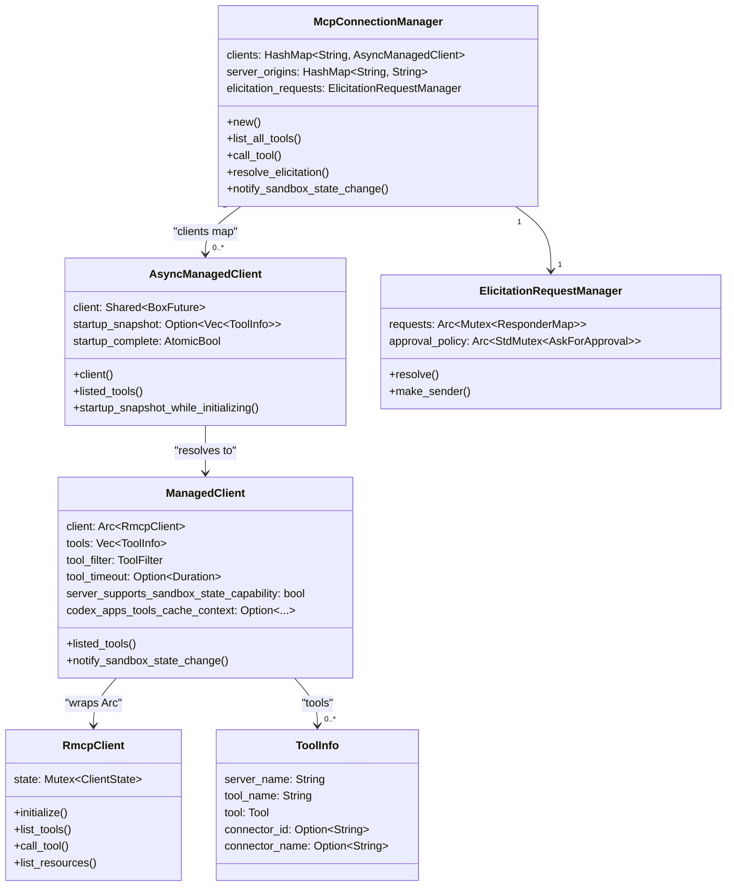
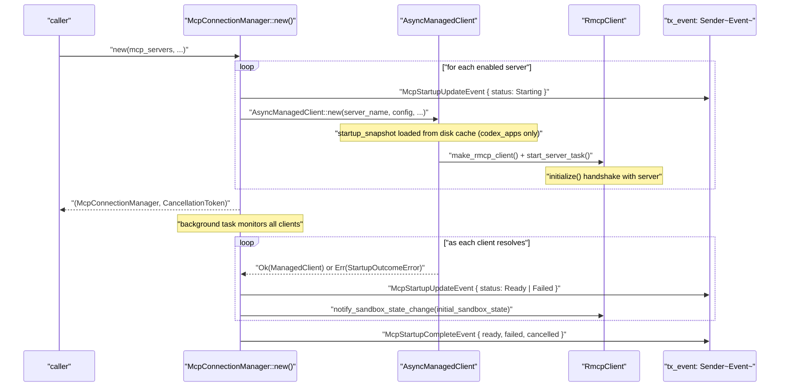
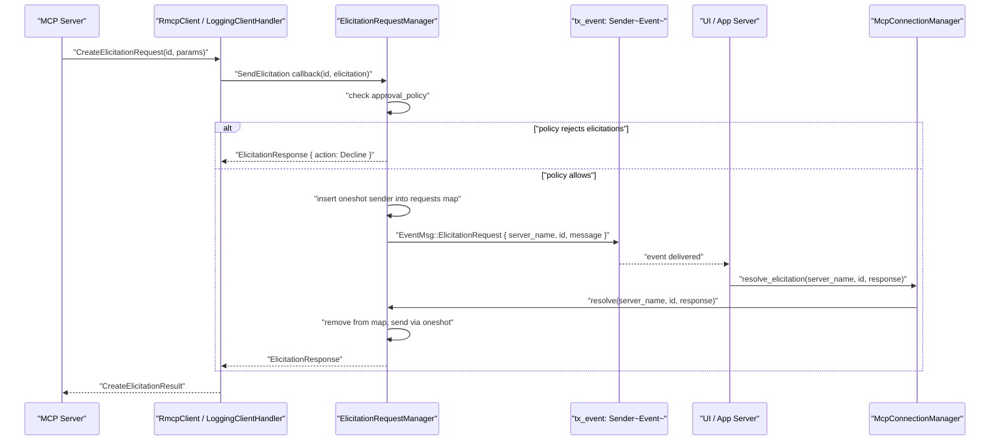
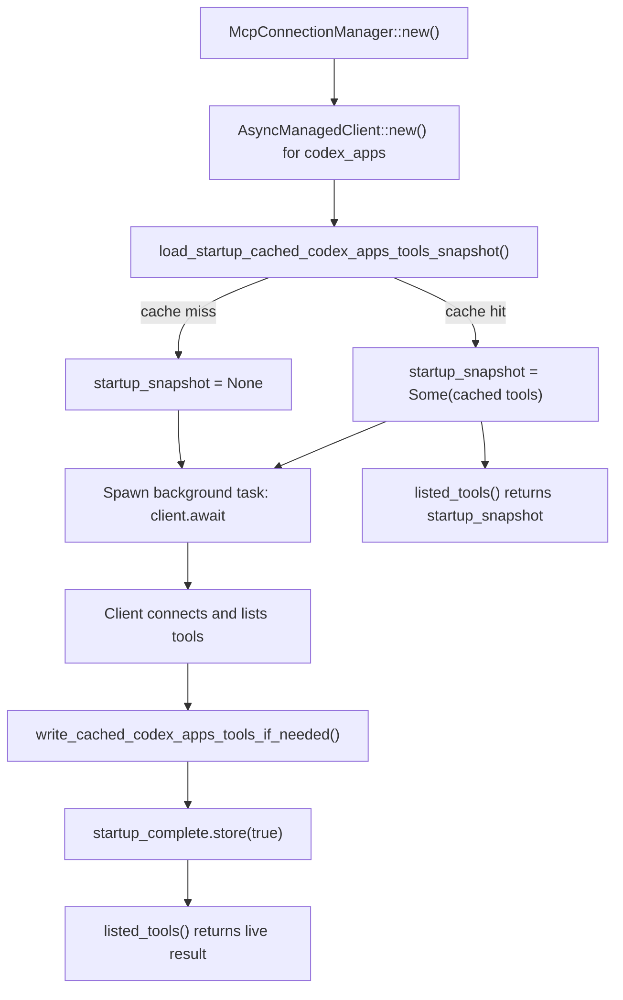

# MCP Connection Manager

<details>
<summary>Relevant source files</summary>

The following files were used as context for generating this wiki page:

- [codex-rs/app-server/tests/common/models_cache.rs](codex-rs/app-server/tests/common/models_cache.rs)
- [codex-rs/cli/src/mcp_cmd.rs](codex-rs/cli/src/mcp_cmd.rs)
- [codex-rs/cli/tests/mcp_add_remove.rs](codex-rs/cli/tests/mcp_add_remove.rs)
- [codex-rs/cli/tests/mcp_list.rs](codex-rs/cli/tests/mcp_list.rs)
- [codex-rs/codex-api/tests/models_integration.rs](codex-rs/codex-api/tests/models_integration.rs)
- [codex-rs/core/src/mcp_connection_manager.rs](codex-rs/core/src/mcp_connection_manager.rs)
- [codex-rs/core/src/models_manager/cache.rs](codex-rs/core/src/models_manager/cache.rs)
- [codex-rs/core/src/models_manager/manager.rs](codex-rs/core/src/models_manager/manager.rs)
- [codex-rs/core/src/models_manager/mod.rs](codex-rs/core/src/models_manager/mod.rs)
- [codex-rs/core/src/models_manager/model_info.rs](codex-rs/core/src/models_manager/model_info.rs)
- [codex-rs/core/src/original_image_detail.rs](codex-rs/core/src/original_image_detail.rs)
- [codex-rs/core/src/tools/handlers/view_image.rs](codex-rs/core/src/tools/handlers/view_image.rs)
- [codex-rs/core/tests/suite/model_switching.rs](codex-rs/core/tests/suite/model_switching.rs)
- [codex-rs/core/tests/suite/models_cache_ttl.rs](codex-rs/core/tests/suite/models_cache_ttl.rs)
- [codex-rs/core/tests/suite/personality.rs](codex-rs/core/tests/suite/personality.rs)
- [codex-rs/core/tests/suite/remote_models.rs](codex-rs/core/tests/suite/remote_models.rs)
- [codex-rs/core/tests/suite/rmcp_client.rs](codex-rs/core/tests/suite/rmcp_client.rs)
- [codex-rs/core/tests/suite/view_image.rs](codex-rs/core/tests/suite/view_image.rs)
- [codex-rs/protocol/src/openai_models.rs](codex-rs/protocol/src/openai_models.rs)

</details>

The MCP Connection Manager is the runtime component in `codex-core` responsible for establishing and maintaining connections to one or more external MCP (Model Context Protocol) servers. It aggregates tool, resource, and resource template listings from all connected servers into unified maps, routes tool calls to the correct server, and forwards elicitation requests to the user interface.

This page covers the internal mechanics of `McpConnectionManager` and the types that support it. For MCP server configuration (`McpServerConfig`, transport variants, `config.toml` layout) see [6.1](#6.1). For the `mcp` CLI subcommands (`add`, `remove`, `login`) see [6.3](#6.3). For OAuth credential storage see [6.5](#6.5).

---

## Structural Overview

All code for the connection manager lives in [codex-rs/core/src/mcp_connection_manager.rs]().

The underlying MCP SDK wrapper lives in the `codex-rmcp-client` crate ([codex-rs/rmcp-client/src/rmcp_client.rs]()).

**High-level type relationships:**



Sources: [codex-rs/core/src/mcp_connection_manager.rs:337-513]()

---

## Initialization and Startup Sequence

`McpConnectionManager::new()` is the primary constructor ([codex-rs/core/src/mcp_connection_manager.rs:546-664]()). It accepts a map of `McpServerConfig` entries (one per configured server) and spawns an `AsyncManagedClient` for each enabled server concurrently.

**Startup flow per server:**



Sources: [codex-rs/core/src/mcp_connection_manager.rs:546-664]()

Key constructor parameters:

| Parameter                    | Type                                  | Purpose                               |
| ---------------------------- | ------------------------------------- | ------------------------------------- |
| `mcp_servers`                | `&HashMap<String, McpServerConfig>`   | All configured servers                |
| `store_mode`                 | `OAuthCredentialsStoreMode`           | Where to read/write OAuth tokens      |
| `auth_entries`               | `HashMap<String, McpAuthStatusEntry>` | Pre-computed auth status per server   |
| `approval_policy`            | `&Constrained<AskForApproval>`        | Governs elicitation auto-decline      |
| `tx_event`                   | `Sender<Event>`                       | Channel for emitting startup events   |
| `initial_sandbox_state`      | `SandboxState`                        | Pushed to servers after handshake     |
| `codex_home`                 | `PathBuf`                             | Base directory for disk caches        |
| `codex_apps_tools_cache_key` | `CodexAppsToolsCacheKey`              | Cache key for codex_apps server tools |

`new_uninitialized()` creates an empty manager with no servers — used in tests and code paths where MCP is not configured ([codex-rs/core/src/mcp_connection_manager.rs:516-522]()).

---

## Async Client Lifecycle and Startup Snapshots

Each server entry is represented by an `AsyncManagedClient` ([codex-rs/core/src/mcp_connection_manager.rs:390-494]()), which holds a `Shared<BoxFuture<...>>`. This future:

1. Validates the server name.
2. Calls `make_rmcp_client()` to construct an `RmcpClient` (stdio or HTTP transport).
3. Calls `start_server_task()` which performs the MCP `initialize` handshake and lists tools.
4. Returns a `ManagedClient` on success.

Because the future is `Shared`, multiple callers `.await`ing `.client()` all wait on the same in-flight connection.

**Startup snapshots** allow the special `codex_apps` server to return a previously cached tool list while its connection is still initializing. `startup_snapshot_while_initializing()` returns the cached snapshot only when `startup_complete` is `false`. Once startup finishes, callers see the live result ([codex-rs/core/src/mcp_connection_manager.rs:468-484]()).

---

## Tool Name Qualification

The Responses API requires tool names to match `^[a-zA-Z0-9_-]+$`. MCP server and tool names are user-controlled, so they are qualified and sanitized before being exposed to the model.

**Qualified tool name format:**

```
mcp__{server_name}__{tool_name}
```

The delimiter constant is `MCP_TOOL_NAME_DELIMITER = "__"` ([codex-rs/core/src/mcp_connection_manager.rs:88]()).

The `qualify_tools()` function ([codex-rs/core/src/mcp_connection_manager.rs:151-191]()) performs:

1. Constructs the raw qualified name: `mcp__{server}__{tool}`.
2. Sanitizes it via `sanitize_responses_api_tool_name()` — replaces any character outside `[a-zA-Z0-9_-]` with `_`.
3. Enforces a maximum length of 64 characters (`MAX_TOOL_NAME_LENGTH`). If the sanitized name is too long, it replaces the suffix with a SHA-1 hash of the raw (unsanitized) name to keep the output stable.
4. Detects collisions (two raw names producing the same sanitized name) and logs a warning while skipping the duplicate.

**Tool name flow:**

```mermaid
flowchart LR
    A["\"server_name\" + \"tool_name\""]
    B["raw: mcp__server_name__tool_name"]
    C["sanitize_responses_api_tool_name()"]
    D["length check (MAX_TOOL_NAME_LENGTH=64)"]
    E["sha1_hex(raw) suffix if too long"]
    F["collision check (used_names HashSet)"]
    G["HashMap key -> ToolInfo"]

    A --> B --> C --> D
    D -->|"fits"| F
    D -->|"too long"| E --> F
    F -->|"unique"| G
    F -->|"duplicate"| SKIP["warn and skip"]
```

Sources: [codex-rs/core/src/mcp_connection_manager.rs:83-191]()

---

## Tool Listing

```
McpConnectionManager::list_all_tools() -> HashMap<String, ToolInfo>
```

[codex-rs/core/src/mcp_connection_manager.rs:725-734]()

Iterates over all `AsyncManagedClient` entries, calls `listed_tools()` on each (which may return a startup snapshot), and merges results through `qualify_tools()`. Failed or still-initializing clients without a snapshot contribute nothing to the map.

`ToolInfo` carries:

| Field            | Type                | Description                               |
| ---------------- | ------------------- | ----------------------------------------- |
| `server_name`    | `String`            | Server the tool belongs to                |
| `tool_name`      | `String`            | Bare tool name (unqualified)              |
| `tool`           | `rmcp::model::Tool` | Full MCP tool descriptor                  |
| `connector_id`   | `Option<String>`    | Connector ID from tool metadata           |
| `connector_name` | `Option<String>`    | Connector display name from tool metadata |

---

## Tool Calls

```
McpConnectionManager::call_tool(server, tool, arguments) -> Result<CallToolResult>
```

[codex-rs/core/src/mcp_connection_manager.rs:916-950]()

Steps:

1. Looks up `AsyncManagedClient` by `server` name via `client_by_name()`.
2. Checks `ToolFilter` — if the tool is disabled (via `enabled_tools`/`disabled_tools` in `McpServerConfig`), returns an error immediately.
3. Calls `RmcpClient::call_tool()` with `tool_timeout`.
4. Converts `rmcp::model::CallToolResult` to `codex_protocol::mcp::CallToolResult` by serializing content items to `serde_json::Value`.

`parse_tool_name()` ([codex-rs/core/src/mcp_connection_manager.rs:1001-1006]()) does the reverse: given a fully-qualified tool name, looks it up in `list_all_tools()` and returns `(server_name, tool_name)`.

---

## Tool Filtering

`ToolFilter` is derived from `McpServerConfig::enabled_tools` and `McpServerConfig::disabled_tools`. The `allows(tool_name)` method is checked in both `listed_tools()` (suppresses tools from the listing) and `call_tool()` (enforces the restriction at call time).

---

## Resource and Resource Template Listing

Two additional aggregation methods mirror `list_all_tools()` in structure:

- `list_all_resources()` → `HashMap<String, Vec<Resource>>` ([codex-rs/core/src/mcp_connection_manager.rs:781-843]())
- `list_all_resource_templates()` → `HashMap<String, Vec<ResourceTemplate>>` ([codex-rs/core/src/mcp_connection_manager.rs:847-913]())

Both use `JoinSet` to issue paginated `resources/list` and `resources/templates/list` requests to all ready clients in parallel. Pagination is followed via `next_cursor` until exhausted. Keys in the output map are server names (not qualified).

---

## Elicitation

MCP servers can request additional input from the user mid-tool-call via the elicitation protocol. The `ElicitationRequestManager` ([codex-rs/core/src/mcp_connection_manager.rs:250-334]()) handles this.

**Elicitation flow:**



Sources: [codex-rs/core/src/mcp_connection_manager.rs:239-334](), [codex-rs/core/src/mcp_connection_manager.rs:675-684]()

The pending requests map is `ResponderMap = HashMap<(String, RequestId), oneshot::Sender<ElicitationResponse>>`, keyed by `(server_name, request_id)`.

`set_approval_policy()` allows the approval policy to be updated at runtime without reconstructing the manager ([codex-rs/core/src/mcp_connection_manager.rs:539-543]()).

`elicitation_is_rejected_by_policy()` ([codex-rs/core/src/mcp_connection_manager.rs:239-247]()) returns `true` only for `AskForApproval::Never` and `AskForApproval::Reject` variants that specifically reject MCP elicitations.

---

## Sandbox State Propagation

`SandboxState` ([codex-rs/core/src/mcp_connection_manager.rs:499-506]()) carries the current sandbox configuration:

| Field                     | Type              |
| ------------------------- | ----------------- |
| `sandbox_policy`          | `SandboxPolicy`   |
| `codex_linux_sandbox_exe` | `Option<PathBuf>` |
| `sandbox_cwd`             | `PathBuf`         |
| `use_linux_sandbox_bwrap` | `bool`            |

MCP servers that advertise the `codex/sandbox-state` capability (`MCP_SANDBOX_STATE_CAPABILITY`) receive sandbox state updates via the `codex/sandbox-state/update` custom request method (`MCP_SANDBOX_STATE_METHOD`). This is sent:

- Once immediately after the server's `initialize` handshake completes.
- On any subsequent call to `McpConnectionManager::notify_sandbox_state_change()` ([codex-rs/core/src/mcp_connection_manager.rs:1008-...]()).

Servers that do not declare the capability are silently skipped ([codex-rs/core/src/mcp_connection_manager.rs:373-387]()).

---

## Codex Apps Tool Cache

The `codex_apps` server (identified by `CODEX_APPS_MCP_SERVER_NAME = "codex_apps"`) has an additional disk-backed tool cache. This allows the tool list to be returned immediately from disk on startup, before the remote HTTP connection is established.

**Cache location:** `{codex_home}/cache/codex_apps_tools/{sha1(user_key_json)}.json`

The cache key (`CodexAppsToolsCacheKey`) is derived from the authenticated user's `account_id`, `chatgpt_user_id`, and `is_workspace_account` fields ([codex-rs/core/src/mcp_connection_manager.rs:202-207]()).

`hard_refresh_codex_apps_tools_cache()` ([codex-rs/core/src/mcp_connection_manager.rs:740-777]()) bypasses the in-process cache, fetches the full tool list from the server, and writes it back to disk.



Sources: [codex-rs/core/src/mcp_connection_manager.rs:97-102](), [codex-rs/core/src/mcp_connection_manager.rs:396-490]()

---

## Timeouts

| Constant                  | Value       | Scope                                       |
| ------------------------- | ----------- | ------------------------------------------- |
| `DEFAULT_STARTUP_TIMEOUT` | 10 seconds  | `initialize` handshake + first tool list    |
| `DEFAULT_TOOL_TIMEOUT`    | 120 seconds | Individual tool calls and resource listings |

Both can be overridden per server via `McpServerConfig::startup_timeout_sec` and `McpServerConfig::tool_timeout_sec`.

Sources: [codex-rs/core/src/mcp_connection_manager.rs:92-95]()

---

## Integration with McpManager

`McpManager` ([codex-rs/core/src/mcp/mod.rs:165-185]()) is a higher-level type that determines _which_ servers should be active based on config and authentication state. It produces the `HashMap<String, McpServerConfig>` that is passed to `McpConnectionManager::new()`.

- `McpManager::configured_servers()` — servers from `config.toml` and plugins.
- `McpManager::effective_servers()` — adds the `codex_apps` server if the `Feature::Apps` feature flag is enabled and removes it if not.

The `collect_mcp_snapshot()` function ([codex-rs/core/src/mcp/mod.rs:213-263]()) is a standalone helper that creates a temporary `McpConnectionManager`, calls `list_all_tools()`, `list_all_resources()`, and `list_all_resource_templates()` on it, then cancels it. It is used to produce `McpListToolsResponseEvent` responses for the `Op::ListMcpTools` operation.

Sources: [codex-rs/core/src/mcp/mod.rs:165-263]()

---

## RmcpClient

`RmcpClient` ([codex-rs/rmcp-client/src/rmcp_client.rs:170-172]()) is the low-level MCP client built on top of the `rmcp` Rust SDK. It is always wrapped inside a `ManagedClient` and never used directly by callers of `McpConnectionManager`.

**Transport variants:**

| Variant                                     | Description                                          |
| ------------------------------------------- | ---------------------------------------------------- |
| `PendingTransport::ChildProcess`            | stdio subprocess transport (`TokioChildProcess`)     |
| `PendingTransport::StreamableHttp`          | HTTP streamable transport with optional bearer token |
| `PendingTransport::StreamableHttpWithOAuth` | HTTP transport with full OAuth + `OAuthPersistor`    |

On `initialize()`, the transport is consumed and becomes a `RunningService<RoleClient, LoggingClientHandler>` ([codex-rs/rmcp-client/src/rmcp_client.rs:322-392]()). `LoggingClientHandler` handles inbound elicitation requests from the server by invoking the `SendElicitation` callback.

For stdio servers, a background task reads stderr line-by-line and logs it at `INFO` level. On Unix, the subprocess is placed in its own process group via `process_group(0)` and the `ProcessGroupGuard` ensures the process group is terminated when the client is dropped ([codex-rs/rmcp-client/src/rmcp_client.rs:90-148]()).

Sources: [codex-rs/rmcp-client/src/rmcp_client.rs:65-172](), [codex-rs/rmcp-client/src/rmcp_client.rs:175-235]()
