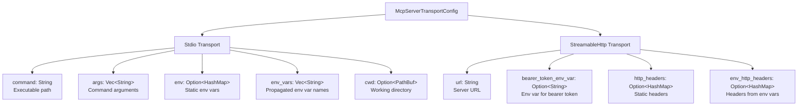
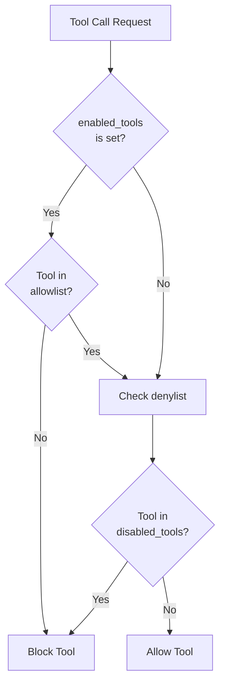
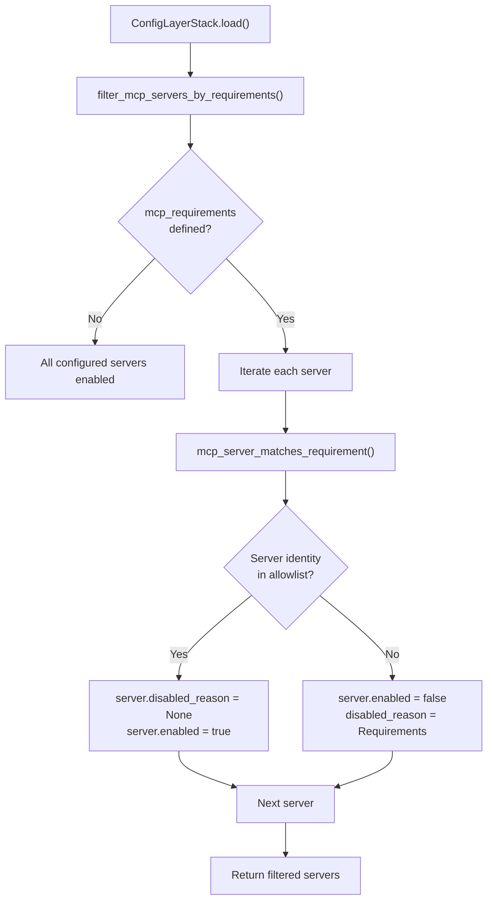
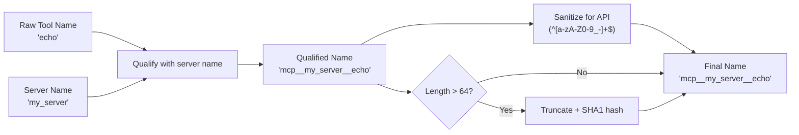
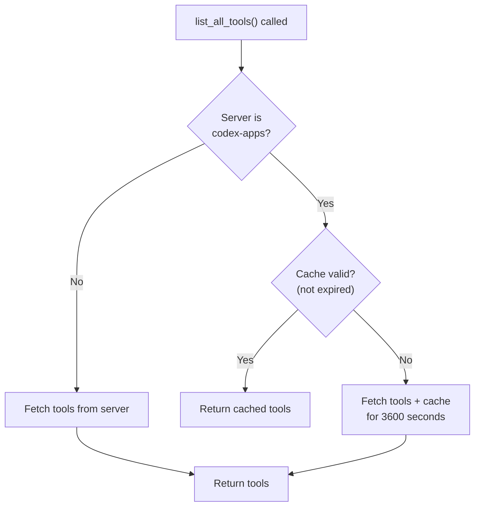

# MCP Server Configuration

<details>
<summary>Relevant source files</summary>

The following files were used as context for generating this wiki page:

- [codex-rs/app-server/tests/common/models_cache.rs](codex-rs/app-server/tests/common/models_cache.rs)
- [codex-rs/cli/src/mcp_cmd.rs](codex-rs/cli/src/mcp_cmd.rs)
- [codex-rs/cli/tests/mcp_add_remove.rs](codex-rs/cli/tests/mcp_add_remove.rs)
- [codex-rs/cli/tests/mcp_list.rs](codex-rs/cli/tests/mcp_list.rs)
- [codex-rs/codex-api/tests/models_integration.rs](codex-rs/codex-api/tests/models_integration.rs)
- [codex-rs/core/config.schema.json](codex-rs/core/config.schema.json)
- [codex-rs/core/src/config/agent_roles.rs](codex-rs/core/src/config/agent_roles.rs)
- [codex-rs/core/src/config/config_tests.rs](codex-rs/core/src/config/config_tests.rs)
- [codex-rs/core/src/config/edit.rs](codex-rs/core/src/config/edit.rs)
- [codex-rs/core/src/config/mod.rs](codex-rs/core/src/config/mod.rs)
- [codex-rs/core/src/config/permissions.rs](codex-rs/core/src/config/permissions.rs)
- [codex-rs/core/src/config/profile.rs](codex-rs/core/src/config/profile.rs)
- [codex-rs/core/src/config/types.rs](codex-rs/core/src/config/types.rs)
- [codex-rs/core/src/features.rs](codex-rs/core/src/features.rs)
- [codex-rs/core/src/features/legacy.rs](codex-rs/core/src/features/legacy.rs)
- [codex-rs/core/src/mcp_connection_manager.rs](codex-rs/core/src/mcp_connection_manager.rs)
- [codex-rs/core/src/models_manager/cache.rs](codex-rs/core/src/models_manager/cache.rs)
- [codex-rs/core/src/models_manager/manager.rs](codex-rs/core/src/models_manager/manager.rs)
- [codex-rs/core/src/models_manager/mod.rs](codex-rs/core/src/models_manager/mod.rs)
- [codex-rs/core/src/models_manager/model_info.rs](codex-rs/core/src/models_manager/model_info.rs)
- [codex-rs/core/src/original_image_detail.rs](codex-rs/core/src/original_image_detail.rs)
- [codex-rs/core/src/tools/handlers/view_image.rs](codex-rs/core/src/tools/handlers/view_image.rs)
- [codex-rs/core/tests/suite/model_switching.rs](codex-rs/core/tests/suite/model_switching.rs)
- [codex-rs/core/tests/suite/models_cache_ttl.rs](codex-rs/core/tests/suite/models_cache_ttl.rs)
- [codex-rs/core/tests/suite/personality.rs](codex-rs/core/tests/suite/personality.rs)
- [codex-rs/core/tests/suite/remote_models.rs](codex-rs/core/tests/suite/remote_models.rs)
- [codex-rs/core/tests/suite/rmcp_client.rs](codex-rs/core/tests/suite/rmcp_client.rs)
- [codex-rs/core/tests/suite/view_image.rs](codex-rs/core/tests/suite/view_image.rs)
- [codex-rs/protocol/src/openai_models.rs](codex-rs/protocol/src/openai_models.rs)
- [codex-rs/protocol/src/permissions.rs](codex-rs/protocol/src/permissions.rs)
- [docs/config.md](docs/config.md)
- [docs/example-config.md](docs/example-config.md)
- [docs/skills.md](docs/skills.md)
- [docs/slash_commands.md](docs/slash_commands.md)

</details>

This document describes how to configure MCP (Model Context Protocol) servers in Codex. MCP servers extend Codex's capabilities by providing external tools, resources, and data sources that the AI can access during conversations.

For information about how MCP servers are initialized and managed at runtime, see [MCP Connection Manager](#6.2). For CLI commands to manage MCP servers, see [MCP CLI Commands](#6.3). For OAuth authentication flows, see [OAuth Authentication for MCP](#6.5).

---

## Configuration Structure

MCP servers are configured in `config.toml` files (system, user, or project level) under the `[mcp_servers]` section. Each server is identified by a unique name and has a `McpServerConfig` structure.

### McpServerConfig Fields

| Field                 | Type                       | Description                                                        |
| --------------------- | -------------------------- | ------------------------------------------------------------------ |
| `transport`           | `McpServerTransportConfig` | Transport configuration (Stdio or StreamableHttp)                  |
| `enabled`             | `bool`                     | Whether the server is enabled                                      |
| `required`            | `bool`                     | If true, Codex fails to start if this server cannot be initialized |
| `disabled_reason`     | `Option<String>`           | Optional reason for disabling the server (for documentation)       |
| `startup_timeout_sec` | `Option<Duration>`         | Timeout for server initialization (default: 10 seconds)            |
| `tool_timeout_sec`    | `Option<Duration>`         | Timeout for individual tool calls (default: 60 seconds)            |
| `enabled_tools`       | `Option<Vec<String>>`      | Allowlist of tool names (if set, only these tools are available)   |
| `disabled_tools`      | `Option<Vec<String>>`      | Denylist of tool names (these tools are blocked)                   |
| `scopes`              | `Option<Vec<String>>`      | OAuth scopes for StreamableHttp servers                            |

**Sources:** [codex-rs/core/src/config/types.rs:62-101](), [codex-rs/core/src/mcp_connection_manager.rs:74-75]()

---

## Transport Types

MCP servers can communicate via two transport mechanisms: **Stdio** (subprocess) or **StreamableHttp** (HTTP connection).

### Transport Configuration Diagram



**Sources:** [codex-rs/core/src/config/types.rs:232-262](), [codex-rs/cli/src/mcp_cmd.rs:76-127]()

### Stdio Transport

Stdio transport launches an MCP server as a subprocess and communicates via stdin/stdout.

**Configuration Fields:**

- **`command`**: Path to the executable
- **`args`**: Command-line arguments
- **`env`**: Static environment variables (key-value pairs set for the subprocess)
- **`env_vars`**: List of environment variable names to propagate from the parent process
- **`cwd`**: Working directory for the subprocess (optional)

**Example:**

```toml
[mcp_servers.local_tools]
transport = { command = "python", args = ["server.py"], env = { API_KEY = "secret" }, env_vars = ["HOME", "PATH"] }
enabled = true
```

**Sources:** [codex-rs/core/src/config/types.rs:232-246](), [codex-rs/core/tests/suite/rmcp_client.rs:84-116](), [codex-rs/cli/tests/mcp_add_remove.rs:20-45]()

### StreamableHttp Transport

StreamableHttp transport connects to an MCP server via HTTP, supporting OAuth authentication.

**Configuration Fields:**

- **`url`**: Server endpoint URL
- **`bearer_token_env_var`**: Name of environment variable containing the bearer token
- **`http_headers`**: Static HTTP headers (key-value pairs)
- **`env_http_headers`**: HTTP headers whose values come from environment variables (key: header name, value: env var name)

**Example:**

```toml
[mcp_servers.github_mcp]
transport = { url = "https://mcp.github.com", bearer_token_env_var = "GITHUB_TOKEN" }
enabled = true
scopes = ["repo", "issues"]
```

**Sources:** [codex-rs/core/src/config/types.rs:247-261](), [codex-rs/cli/tests/mcp_add_remove.rs:108-139]()

---

## Tool Filtering

Tool filtering controls which tools from an MCP server are available to the model. Filtering is implemented via the `ToolFilter` structure.

### Tool Filter Logic



**Filter Rules:**

1. If `enabled_tools` is set (allowlist), only tools in this list are allowed
2. If `disabled_tools` is set (denylist), tools in this list are blocked
3. A tool must satisfy both conditions to be allowed

**Example:**

```toml
[mcp_servers.filesystem]
transport = { command = "mcp-server-filesystem", args = ["--root", "/workspace"] }
enabled = true
# Only allow read operations
enabled_tools = ["read_file", "list_directory", "search_files"]
# Explicitly block write operations (redundant with allowlist, but makes intent clear)
disabled_tools = ["write_file", "delete_file"]
```

**Sources:** [codex-rs/core/src/mcp_connection_manager.rs:802-839](), [codex-rs/core/src/mcp_connection_manager.rs:714-723]()

---

## Requirements-Based Filtering

Requirements-based filtering allows organizations to enforce which MCP servers are permitted in Codex installations. This is implemented through configuration constraints (typically from `requirements.toml` or MDM on macOS) and is applied during configuration loading via the `ConfigRequirements` system.

### Requirements Structure

Requirements specify an allowlist of MCP servers by their transport identity. Only servers matching a requirement entry are enabled; all others are automatically disabled.

**Requirement Matching Rules:**

- **Stdio servers**: Match by `command` field
- **StreamableHttp servers**: Match by `url` field

### Filtering Implementation



**Key Functions:**

- `filter_mcp_servers_by_requirements`: Applies requirement constraints to server map [codex-rs/core/src/config/mod.rs:598-621]()
- `mcp_server_matches_requirement`: Checks if server matches requirement identity [codex-rs/core/src/config/mod.rs:673-691]()
- `constrain_mcp_servers`: Wraps filtering in `Constrained<T>` wrapper [codex-rs/core/src/config/mod.rs:623-636]()

### Disabled Reason Tracking

When a server is filtered out by requirements, its `disabled_reason` field is set to `McpServerDisabledReason::Requirements { source }`, where `source` indicates the origin of the requirement (e.g., `requirements.toml` or MDM).

**Example Configuration:**

```toml
# requirements.toml (enforced by organization)
[mcp_servers]
[mcp_servers.approved_filesystem]
identity = { command = "mcp-server-filesystem" }

[mcp_servers.approved_api]
identity = { url = "https://api.trusted-vendor.com/mcp" }
```

If a user configures an unapproved server:

```toml
# ~/.codex/config.toml (user config)
[mcp_servers.unapproved_server]
transport = { command = "sketchy-tool" }
enabled = true
```

The server will be automatically disabled with `disabled_reason = "Requirements (requirements.toml)"`.

**Sources:** [codex-rs/core/src/config/mod.rs:598-636](), [codex-rs/core/src/config/mod.rs:673-691](), [codex-rs/core/src/config/types.rs:44-59]()

---

## Timeout Configuration

Codex configures two types of timeouts for MCP servers:

### Timeout Types

| Timeout   | Default    | Config Field          | Description                                                     |
| --------- | ---------- | --------------------- | --------------------------------------------------------------- |
| Startup   | 10 seconds | `startup_timeout_sec` | Time allowed for server initialization and initial tool listing |
| Tool Call | 60 seconds | `tool_timeout_sec`    | Time allowed for individual tool invocations                    |

**Constants:**

- `DEFAULT_STARTUP_TIMEOUT`: 10 seconds [codex-rs/core/src/mcp_connection_manager.rs:86]()
- `DEFAULT_TOOL_TIMEOUT`: 60 seconds [codex-rs/core/src/mcp_connection_manager.rs:89]()

**Example:**

```toml
[mcp_servers.slow_server]
transport = { command = "slow-mcp-server" }
enabled = true
startup_timeout_sec = 30  # Allow 30 seconds for initialization
tool_timeout_sec = 120    # Allow 2 minutes for tool calls
```

**Sources:** [codex-rs/core/src/mcp_connection_manager.rs:86](), [codex-rs/core/src/mcp_connection_manager.rs:89](), [codex-rs/core/src/config/types.rs:78-88]()

---

## Server Name Qualification and Sanitization

MCP tool names are qualified with the server name to prevent collisions and sanitized to meet API requirements.

### Tool Name Transformation



**Transformation Rules:**

1. Tool names are prefixed with `mcp__<server_name>__` [codex-rs/core/src/mcp_connection_manager.rs:126-129]()
2. Names are sanitized to match `^[a-zA-Z0-9_-]+$` (OpenAI API requirement) [codex-rs/core/src/mcp_connection_manager.rs:94-109]()
3. If length exceeds 64 characters, the name is truncated and a SHA1 hash is appended [codex-rs/core/src/mcp_connection_manager.rs:142-146]()
4. Duplicate names (after sanitization) are skipped [codex-rs/core/src/mcp_connection_manager.rs:148-151]()

**Constants:**

- `MCP_TOOL_NAME_DELIMITER`: `"__"` [codex-rs/core/src/mcp_connection_manager.rs:82]()
- `MAX_TOOL_NAME_LENGTH`: 64 [codex-rs/core/src/mcp_connection_manager.rs:83]()

**Sources:** [codex-rs/core/src/mcp_connection_manager.rs:99-163]()

---

## Configuration File Locations

MCP servers can be configured at multiple layers, following Codex's layered configuration system (see [Configuration System](#2.2)).

### Configuration Layers

| Layer   | Path                     | Precedence |
| ------- | ------------------------ | ---------- |
| System  | `/etc/codex/config.toml` | Lowest     |
| User    | `~/.codex/config.toml`   | Medium     |
| Project | `.codex/config.toml`     | High       |
| CLI     | `--config` overrides     | Highest    |

**Configuration Loading:**
The `load_global_mcp_servers` function loads MCP server configurations from the user's home directory:

```toml
# Example: ~/.codex/config.toml
[mcp_servers.filesystem]
transport = { command = "mcp-server-filesystem", args = ["--root", "."] }
enabled = true

[mcp_servers.github]
transport = { url = "https://mcp.github.com" }
enabled = true
scopes = ["repo", "issues"]
```

**Sources:** [codex-rs/core/src/config/mod.rs:693-726](), [codex-rs/cli/src/mcp_cmd.rs:199-202]()

---

## Special Server Behaviors

### codex-apps Server Caching

The `codex-apps` MCP server receives special treatment with tool list caching:

- **Cache TTL**: 3600 seconds (1 hour) [codex-rs/core/src/mcp_connection_manager.rs:91]()
- **Cache Implementation**: `CODEX_APPS_TOOLS_CACHE` static [codex-rs/core/src/mcp_connection_manager.rs:180-181]()
- **Reason**: Reduces latency for frequently-used codex-apps tools

**Caching Logic:**



**Sources:** [codex-rs/core/src/mcp_connection_manager.rs:91](), [codex-rs/core/src/mcp_connection_manager.rs:519-546](), [codex-rs/core/src/mcp_connection_manager.rs:1023-1069]()

### Required Servers

Servers marked with `required = true` will cause Codex to fail startup if they cannot be initialized:

```toml
[mcp_servers.critical_service]
transport = { command = "critical-mcp-server" }
enabled = true
required = true  # Codex will not start if this fails
```

The `required_startup_failures` method checks for failed required servers and returns failures [codex-rs/core/src/mcp_connection_manager.rs:491-514]().

**Sources:** [codex-rs/core/src/mcp_connection_manager.rs:491-514]()

---

## Environment Variable Resolution

### Stdio Transport Environment Variables

Stdio transport supports two types of environment variable configuration:

1. **`env`**: Static key-value pairs set directly in config
2. **`env_vars`**: List of variable names to propagate from parent process

**Example:**

```toml
[mcp_servers.env_example]
transport = {
  command = "python",
  args = ["server.py"],
  env = { "STATIC_KEY" = "static_value" },
  env_vars = ["HOME", "PATH", "USER"]
}
enabled = true
```

When the MCP server subprocess is spawned:

- Variables in `env` are set to their configured values
- Variables in `env_vars` are read from the current process environment and propagated

**Sources:** [codex-rs/core/tests/suite/rmcp_client.rs:84-116](), [codex-rs/cli/tests/mcp_list.rs:52-64]()

### StreamableHttp Bearer Token Resolution

For StreamableHttp transport, bearer tokens can be provided via environment variables:

```toml
[mcp_servers.api_service]
transport = {
  url = "https://api.example.com/mcp",
  bearer_token_env_var = "API_SERVICE_TOKEN"
}
enabled = true
```

The bearer token resolution happens during MCP client initialization [codex-rs/core/src/mcp_connection_manager.rs:896-922]().

**Error Handling:**

- If the environment variable is not set: Error
- If the environment variable is empty: Error
- If the environment variable contains non-Unicode: Error

**Sources:** [codex-rs/core/src/mcp_connection_manager.rs:896-922]()

---

## Complete Configuration Example

Here is a comprehensive example showing multiple MCP servers with different configurations:

```toml
# ~/.codex/config.toml

# Stdio server with environment variables
[mcp_servers.filesystem]
transport = {
  command = "mcp-server-filesystem",
  args = ["--root", "/workspace"],
  env = { "LOG_LEVEL" = "info" },
  env_vars = ["HOME", "USER"]
}
enabled = true
startup_timeout_sec = 15
tool_timeout_sec = 30
enabled_tools = ["read_file", "list_directory", "search_files"]

# StreamableHttp server with OAuth
[mcp_servers.github]
transport = {
  url = "https://mcp.github.com",
  http_headers = { "X-Client-Version" = "1.0" }
}
enabled = true
scopes = ["repo", "issues", "pull_requests"]
startup_timeout_sec = 20
tool_timeout_sec = 60

# Disabled server (for reference)
[mcp_servers.legacy_tools]
transport = { command = "old-mcp-server" }
enabled = false
disabled_reason = "Replaced by new_tools server"

# Required server (must start successfully)
[mcp_servers.core_services]
transport = { command = "core-mcp-server" }
enabled = true
required = true
startup_timeout_sec = 30

# Server with tool filtering
[mcp_servers.database]
transport = { command = "mcp-db-server", args = ["--db", "postgres://localhost"] }
enabled = true
disabled_tools = ["drop_table", "delete_database"]  # Block dangerous operations
```

**Sources:** [codex-rs/core/tests/suite/rmcp_client.rs:84-116](), [codex-rs/cli/tests/mcp_add_remove.rs:16-69]()

---

## Server Name Validation

Server names must conform to specific rules enforced by the `validate_server_name` function:

**Validation Rules:**

- Name must not be empty
- Name must contain only: `a-z`, `A-Z`, `0-9`, `-`, `_`
- Other characters are rejected

**Implementation:**

```rust
// From codex-rs/cli/src/mcp_cmd.rs:819-830
fn validate_server_name(name: &str) -> Result<()> {
    let is_valid = !name.is_empty()
        && name
            .chars()
            .all(|c| c.is_ascii_alphanumeric() || c == '-' || c == '_');

    if is_valid {
        Ok(())
    } else {
        bail!("invalid server name '{name}' (use letters, numbers, '-', '_')");
    }
}
```

**Sources:** [codex-rs/cli/src/mcp_cmd.rs:819-830](), [codex-rs/core/src/mcp_connection_manager.rs:1144-1165]()

---

## Configuration Persistence

MCP server configurations are persisted using the `ConfigEditsBuilder` API:

### Adding/Modifying Servers

```rust
// Load current servers
let mut servers = load_global_mcp_servers(&codex_home).await?;

// Add or modify server
servers.insert(
    "new_server".to_string(),
    McpServerConfig { /* ... */ }
);

// Persist changes
ConfigEditsBuilder::new(&codex_home)
    .replace_mcp_servers(&servers)
    .apply()
    .await?;
```

**Sources:** [codex-rs/cli/src/mcp_cmd.rs:257-261](), [codex-rs/core/src/config/edit.rs:43]()

### Removing Servers

```rust
let mut servers = load_global_mcp_servers(&codex_home).await?;
servers.remove(&server_name);

ConfigEditsBuilder::new(&codex_home)
    .replace_mcp_servers(&servers)
    .apply()
    .await?;
```

**Sources:** [codex-rs/cli/src/mcp_cmd.rs:306-310](), [codex-rs/cli/tests/mcp_add_remove.rs:48-54]()
