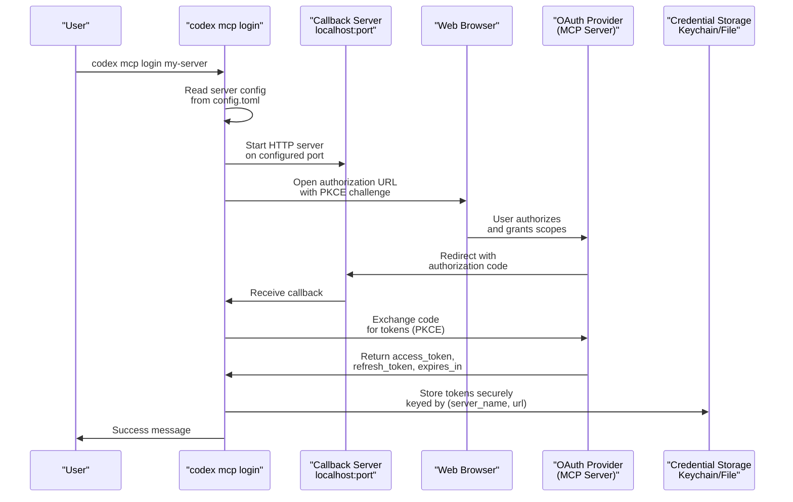
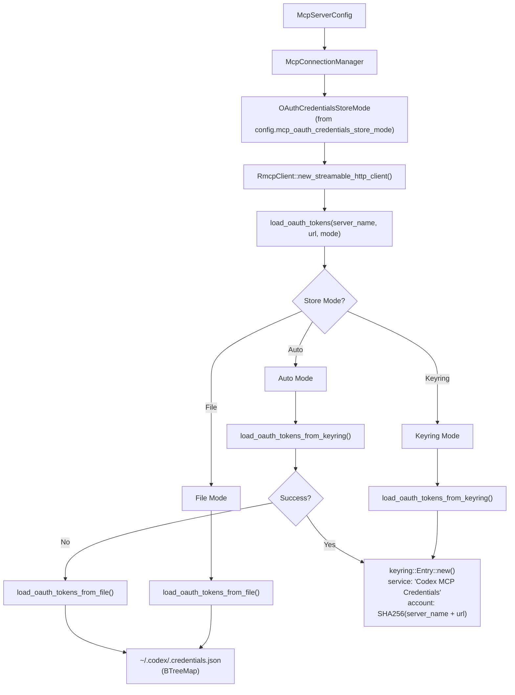
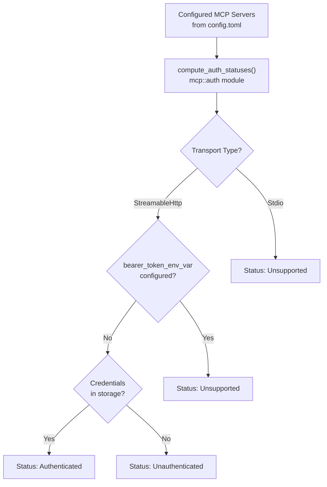

# OAuth Authentication for MCP

<details>
<summary>Relevant source files</summary>

The following files were used as context for generating this wiki page:

- [codex-rs/app-server/tests/common/models_cache.rs](codex-rs/app-server/tests/common/models_cache.rs)
- [codex-rs/cli/src/mcp_cmd.rs](codex-rs/cli/src/mcp_cmd.rs)
- [codex-rs/cli/tests/mcp_add_remove.rs](codex-rs/cli/tests/mcp_add_remove.rs)
- [codex-rs/cli/tests/mcp_list.rs](codex-rs/cli/tests/mcp_list.rs)
- [codex-rs/codex-api/tests/models_integration.rs](codex-rs/codex-api/tests/models_integration.rs)
- [codex-rs/core/src/mcp_connection_manager.rs](codex-rs/core/src/mcp_connection_manager.rs)
- [codex-rs/core/src/models_manager/cache.rs](codex-rs/core/src/models_manager/cache.rs)
- [codex-rs/core/src/models_manager/manager.rs](codex-rs/core/src/models_manager/manager.rs)
- [codex-rs/core/src/models_manager/mod.rs](codex-rs/core/src/models_manager/mod.rs)
- [codex-rs/core/src/models_manager/model_info.rs](codex-rs/core/src/models_manager/model_info.rs)
- [codex-rs/core/src/original_image_detail.rs](codex-rs/core/src/original_image_detail.rs)
- [codex-rs/core/src/tools/handlers/view_image.rs](codex-rs/core/src/tools/handlers/view_image.rs)
- [codex-rs/core/tests/suite/model_switching.rs](codex-rs/core/tests/suite/model_switching.rs)
- [codex-rs/core/tests/suite/models_cache_ttl.rs](codex-rs/core/tests/suite/models_cache_ttl.rs)
- [codex-rs/core/tests/suite/personality.rs](codex-rs/core/tests/suite/personality.rs)
- [codex-rs/core/tests/suite/remote_models.rs](codex-rs/core/tests/suite/remote_models.rs)
- [codex-rs/core/tests/suite/rmcp_client.rs](codex-rs/core/tests/suite/rmcp_client.rs)
- [codex-rs/core/tests/suite/view_image.rs](codex-rs/core/tests/suite/view_image.rs)
- [codex-rs/protocol/src/openai_models.rs](codex-rs/protocol/src/openai_models.rs)

</details>

## Overview

OAuth 2.0 authentication is supported exclusively for MCP servers using the **StreamableHttp** transport. Stdio transport servers do not support OAuth through Codex's built-in mechanisms. When configured, Codex performs an OAuth 2.0 authorization code flow with PKCE (Proof Key for Code Exchange) that opens a browser for user authorization, then stores the resulting credentials securely in the system keyring or a fallback file.

The OAuth system consists of four main components:

1. **OAuth Flow** - Browser-based authorization with local callback server (`perform_oauth_login`)
2. **Credential Storage** - Platform-specific secure storage via `keyring` crate with fallback
3. **OAuthPersistor** - Manages token lifecycle, refresh, and persistence
4. **Auth Status Tracking** - Runtime detection of authentication state

OAuth credentials are managed by the `codex_rmcp_client` crate. The `OAuthPersistor` wraps an `AuthorizationManager` from the `rmcp` SDK and handles automatic token refresh and persistence. The `McpConnectionManager` integrates these components when establishing StreamableHttp connections.

**Sources:** [codex-rs/rmcp-client/src/oauth.rs:1-17](), [codex-rs/rmcp-client/src/perform_oauth_login.rs:1-71](), [codex-rs/rmcp-client/src/rmcp_client.rs:1-64]()

---

## OAuth Flow for StreamableHttp Servers

### Flow Architecture

When a user runs `codex mcp login <server-name>`, Codex initiates an OAuth 2.0 authorization code flow with PKCE (Proof Key for Code Exchange). The flow involves starting a local HTTP server to receive the authorization callback, opening the user's browser to the authorization URL, and exchanging the authorization code for access and refresh tokens.

**OAuth Authorization Flow**



**Sources:** [codex-rs/cli/src/mcp_cmd.rs:322-363]()

### OAuth Configuration Fields

The OAuth flow is triggered when a StreamableHttp MCP server is configured without a `bearer_token_env_var`. The `McpServerConfig` supports the following fields:

| Field                  | Type                              | Required | Description                                                                              |
| ---------------------- | --------------------------------- | -------- | ---------------------------------------------------------------------------------------- |
| `url`                  | `String`                          | Yes      | MCP server endpoint URL                                                                  |
| `scopes`               | `Option<Vec<String>>`             | No       | OAuth scopes to request during authorization (can be overridden via `--scopes` CLI flag) |
| `bearer_token_env_var` | `Option<String>`                  | No       | Alternative to OAuth: read bearer token from environment variable                        |
| `http_headers`         | `Option<HashMap<String, String>>` | No       | Static HTTP headers to include in requests                                               |
| `env_http_headers`     | `Option<HashMap<String, String>>` | No       | HTTP headers read from environment variables                                             |

**OAuth vs Environment Variable Authentication:**

- If `bearer_token_env_var` is set, Codex uses that token and skips OAuth entirely
- If `bearer_token_env_var` is not set and no OAuth credentials exist, `oauth_login_support` checks if the server supports OAuth
- If OAuth is supported, the user is prompted to run `codex mcp login`

**Example Configuration:**

```toml
[mcp_servers.github]
url = "https://api.github.com/mcp/v1"
scopes = ["repo", "user:email"]

[mcp_servers.internal]
url = "https://internal.company.com/mcp"
bearer_token_env_var = "INTERNAL_MCP_TOKEN"
```

**Sources:** [codex-rs/core/src/config/types.rs:44-80](), [codex-rs/cli/src/mcp_cmd.rs:265-285](), [codex-rs/cli/src/mcp_cmd.rs:331-350]()

### OAuth Callback Server

The `OauthLoginFlow` starts a temporary `tiny_http::Server` on `localhost` to receive the OAuth callback. The server lifecycle is managed by a `CallbackServerGuard` that ensures cleanup:

**Callback Configuration:**

```toml
# Optional: specify callback port (default: random port selected by OS)
mcp_oauth_callback_port = 8080

# Optional: specify custom callback URL (default: http://127.0.0.1:{port}/callback)
mcp_oauth_callback_url = "http://localhost:8080/callback"
```

**Callback Flow:**

1. `resolve_callback_port` determines the bind port (configured or random)
2. `callback_bind_host` determines whether to bind to `127.0.0.1` or `0.0.0.0` based on callback URL
3. `Server::http(bind_addr)` starts the server
4. `spawn_callback_server` spawns a blocking task that waits for HTTP requests
5. `parse_oauth_callback` validates the callback path and extracts `code` and `state` query parameters
6. The server responds with "Authentication complete" or an error message
7. `CallbackServerGuard::drop` calls `server.unblock()` to shut down the server

The callback server runs only during the OAuth flow and is automatically cleaned up when the `OauthLoginFlow` is dropped.

**Sources:** [codex-rs/rmcp-client/src/perform_oauth_login.rs:108-146](), [codex-rs/rmcp-client/src/perform_oauth_login.rs:238-296](), [codex-rs/rmcp-client/src/perform_oauth_login.rs:32-40]()

---

## Credential Storage

### Storage Modes

Codex supports three credential storage modes via the `OAuthCredentialsStoreMode` enum:

| Mode             | Description                   | Behavior                                                                                |
| ---------------- | ----------------------------- | --------------------------------------------------------------------------------------- |
| `Auto` (default) | Try keyring, fallback to file | Attempts `keyring` crate storage; falls back to `~/.codex/.credentials.json` on failure |
| `File`           | Always use file storage       | Directly writes to `~/.codex/.credentials.json`                                         |
| `Keyring`        | Require keyring storage       | Fails if keyring is unavailable (no fallback)                                           |

**Platform-Specific Keyring Backends:**

The `keyring` crate uses platform-specific secure storage:

- **macOS**: `apple-native` feature → macOS Keychain
- **Windows**: `windows-native` feature → Windows Credential Manager
- **Linux**: `linux-native-async-persistent` feature → kernel `keyutils` + `async-secret-service` (DBus Secret Service)
- **FreeBSD/OpenBSD**: `sync-secret-service` feature → DBus Secret Service

The keyring service name is `"Codex MCP Credentials"` and the account key is `compute_store_key(server_name, url)`.

**Credential Storage Architecture**



**Sources:** [codex-rs/rmcp-client/src/oauth.rs:66-79](), [codex-rs/rmcp-client/src/oauth.rs:94-110](), [codex-rs/rmcp-client/Cargo.toml:63-73](), [codex-rs/rmcp-client/src/oauth.rs:53-54]()

### Credential Key Structure and Data Model

OAuth credentials are stored using a composite key derived from `(server_name, server_url)`. The `compute_store_key` function creates a SHA-256 hash to ensure key uniqueness and avoid special characters:

```rust
fn compute_store_key(server_name: &str, url: &str) -> Result<String> {
    let combined = format!("{server_name}::{url}");
    let mut hasher = Sha256::new();
    hasher.update(combined.as_bytes());
    Ok(format!("{:x}", hasher.finalize()))
}
```

**StoredOAuthTokens Structure:**

```rust
pub struct StoredOAuthTokens {
    pub server_name: String,
    pub url: String,
    pub client_id: String,
    pub token_response: WrappedOAuthTokenResponse,
    pub expires_at: Option<u64>,  // Unix timestamp in milliseconds
}

pub struct WrappedOAuthTokenResponse(pub OAuthTokenResponse);
```

**Example Keyring Entry:**

```
Service: "Codex MCP Credentials"
Account: "a1b2c3d4e5f6..." (SHA-256 hash)
Secret: {"server_name":"github","url":"https://api.github.com/mcp","client_id":"...","token_response":{...},"expires_at":1234567890000}
```

**Example File Entry (~/.codex/.credentials.json):**

```json
{
  "a1b2c3d4e5f6789...": {
    "server_name": "github",
    "url": "https://api.github.com/mcp/v1",
    "client_id": "codex-mcp-client",
    "token_response": {
      "access_token": "gho_xxxxxxxxxxxxx",
      "refresh_token": "ghr_yyyyyyyyyyyy",
      "token_type": "Bearer",
      "expires_in": 3600,
      "scope": "repo user:email"
    },
    "expires_at": 1234567890000
  }
}
```

**Sources:** [codex-rs/rmcp-client/src/oauth.rs:56-64](), [codex-rs/rmcp-client/src/oauth.rs:81-92](), [codex-rs/rmcp-client/src/oauth.rs:248-294]()

## OAuthPersistor and Token Refresh

### OAuthPersistor Structure

The `OAuthPersistor` class manages the OAuth token lifecycle, including automatic refresh and persistence. It wraps an `AuthorizationManager` from the `rmcp` crate's `auth` module:

```rust
pub struct OAuthPersistor {
    server_name: String,
    url: String,
    auth_manager: Arc<Mutex<AuthorizationManager>>,
    credentials_store: OAuthCredentialsStoreMode,
    initial_tokens: Option<StoredOAuthTokens>,
    last_persisted_tokens: Arc<Mutex<Option<StoredOAuthTokens>>>,
}
```

The `OAuthPersistor` is created during MCP client initialization and stored in `ClientState::Ready` within `RmcpClient`.

**Sources:** [codex-rs/rmcp-client/src/oauth.rs:295-336]()

### Automatic Token Refresh

Token refresh is triggered automatically by the `AuthClient` wrapper around `reqwest::Client`. The refresh logic uses the following parameters:

- **REFRESH_SKEW_MILLIS**: `30_000` (30 seconds) - tokens are refreshed 30 seconds before expiration
- `expires_in_from_timestamp(expires_at)` calculates remaining validity from the stored `expires_at` field
- `compute_expires_at_millis(token_response)` computes the absolute expiration timestamp from `expires_in`

**Token Refresh Flow with OAuthPersistor:**

```mermaid
sequenceDiagram
    participant Tool["Tool Call<br/>(e.g., mcp__server__tool)"]
    participant RmcpClient
    participant Persistor["OAuthPersistor"]
    participant AuthClient["AuthClient<br/>(rmcp auth module)"]
    participant Storage["Credential Storage"]
    participant McpServer["MCP Server<br/>OAuth Endpoint"]

    Tool->>RmcpClient: call_tool(name, args)
    RmcpClient->>RmcpClient: refresh_oauth_if_needed()
    RmcpClient->>Persistor: refresh_if_needed()
    Persistor->>Persistor: Check expires_at - now() < REFRESH_SKEW

    alt Token Expiring Soon
        Persistor->>AuthClient: Implicit refresh via AuthClient
        AuthClient->>McpServer: POST /token<br/>(grant_type=refresh_token)
        McpServer-->>AuthClient: New access_token + refresh_token
        AuthClient->>Persistor: Updated credentials
        Persistor->>Persistor: Mark needs_persist = true
    end

    RmcpClient->>AuthClient: Make MCP request with auth
    AuthClient->>McpServer: HTTP request with Authorization header
    McpServer-->>AuthClient: Response
    AuthClient-->>RmcpClient: Result

    RmcpClient->>RmcpClient: persist_oauth_tokens()
    RmcpClient->>Persistor: persist_if_needed()

    alt Needs Persist
        Persistor->>Persistor: Extract current credentials from AuthClient
        Persistor->>Storage: save_oauth_tokens(updated_tokens)
        Storage-->>Persistor: Success
        Persistor->>Persistor: Update last_persisted_tokens
    end

    RmcpClient-->>Tool: Tool result
```

**Sources:** [codex-rs/rmcp-client/src/oauth.rs:338-431](), [codex-rs/rmcp-client/src/rmcp_client.rs:569-583](), [codex-rs/rmcp-client/src/oauth.rs:54]()

### Token Expiration Calculation

The `compute_expires_at_millis` function converts relative `expires_in` to absolute Unix timestamp:

```rust
pub(crate) fn compute_expires_at_millis(token_response: &OAuthTokenResponse) -> Option<u64> {
    let expires_in_secs = token_response.expires_in()?.as_secs();
    let now = SystemTime::now()
        .duration_since(UNIX_EPOCH)
        .ok()?
        .as_millis() as u64;
    Some(now + (expires_in_secs * 1000))
}
```

When loading tokens from storage, `refresh_expires_in_from_timestamp` recalculates `expires_in` from the stored `expires_at` to maintain compatibility with the `rmcp` SDK's token expiration checks.

**Sources:** [codex-rs/rmcp-client/src/oauth.rs:433-445](), [codex-rs/rmcp-client/src/oauth.rs:120-134]()

---

## Auth Status Tracking

### Auth Status States

Codex tracks the authentication status of each configured MCP server and displays this information in `codex mcp list`. The `McpAuthStatus` enum defines four possible states:

| Status                | Description                                   | Displayed When                                          |
| --------------------- | --------------------------------------------- | ------------------------------------------------------- |
| `Authenticated`       | Valid OAuth credentials are stored            | Credentials exist and are not expired                   |
| `Unauthenticated`     | OAuth is supported but user has not logged in | StreamableHttp server with no stored credentials        |
| `AuthenticationError` | OAuth flow failed or credentials are invalid  | Token refresh failed or authorization was denied        |
| `Unsupported`         | Server does not support OAuth                 | Stdio transport or `bearer_token_env_var` is configured |

**Sources:** [codex-rs/cli/src/mcp_cmd.rs:395-409](), [codex-rs/cli/src/mcp_cmd.rs:499-503]()

### Auth Status Computation

The `compute_auth_statuses` function in `codex_core::mcp::auth` checks credential storage for each configured server and returns a map of authentication states. This computation happens when displaying server lists or checking server readiness.

**Auth Status Detection Flow**



**Sources:** [codex-rs/cli/src/mcp_cmd.rs:405-409](), [codex-rs/cli/src/mcp_cmd.rs:16-18]()

### Displaying Auth Status

The `codex mcp list` command computes and displays the auth status for each server via `compute_auth_statuses`:

```bash
$ codex mcp list
Name       Url                            Bearer Token Env Var  Status   Auth
github     https://api.github.com/mcp/v1  -                     enabled  Authenticated
internal   https://internal.company/mcp   -                     enabled  Unauthenticated
manual     https://manual.example.com     MANUAL_TOKEN          enabled  Unsupported
```

The auth status column indicates:

- `Authenticated`: OAuth credentials exist in storage
- `Unauthenticated`: OAuth is supported but no credentials stored
- `Unsupported`: Server uses `bearer_token_env_var` or Stdio transport

**Sources:** [codex-rs/cli/src/mcp_cmd.rs:407-411](), [codex-rs/cli/src/mcp_cmd.rs:519-535]()

---

## CLI Commands

### `codex mcp login`

Initiates the OAuth flow for a configured StreamableHttp MCP server. The command opens a browser window for user authorization and stores the resulting credentials.

**Usage:**

```bash
codex mcp login <server-name>
codex mcp login <server-name> --scopes scope1,scope2
```

**Behavior:**

1. Loads server configuration from `~/.codex/config.toml`
2. Validates that the server uses StreamableHttp transport
3. Starts a local HTTP callback server
4. Opens the browser to the OAuth authorization URL
5. Waits for the callback with authorization code
6. Exchanges code for access and refresh tokens
7. Stores credentials in Keychain or fallback file
8. Displays success or error message

**Scope Override:**

If `--scopes` is provided, it overrides the `scopes` field in the config file for this login session.

**Sources:** [codex-rs/cli/src/mcp_cmd.rs:135-143](), [codex-rs/cli/src/mcp_cmd.rs:322-363]()

### `codex mcp logout`

Removes stored OAuth credentials for an MCP server.

**Usage:**

```bash
codex mcp logout <server-name>
```

**Behavior:**

1. Loads server configuration to determine the storage key
2. Deletes credentials from Keychain or fallback file
3. Displays confirmation message

After logout, the server's auth status becomes `Unauthenticated`, and the user must run `codex mcp login` again to restore access.

**Sources:** [codex-rs/cli/src/mcp_cmd.rs:145-149](), [codex-rs/cli/src/mcp_cmd.rs:365-393]()

### Automatic OAuth Detection

When adding a new StreamableHttp server via `codex mcp add`, Codex automatically detects if the server supports OAuth and prompts the user to log in:

```bash
$ codex mcp add github --url https://api.github.com/mcp/v1
Added global MCP server 'github'.
Detected OAuth support. Starting OAuth flow…
[Browser opens for authorization]
Successfully logged in.
```

This detection is performed by the `oauth_login_support` function, which checks the transport type and determines if OAuth is likely required.

**Sources:** [codex-rs/cli/src/mcp_cmd.rs:265-284]()

---

## Integration with Connection Manager

### OAuth Credential Injection

When the `McpConnectionManager` initializes a StreamableHttp server, it passes `OAuthCredentialsStoreMode` to `make_rmcp_client`, which creates an `RmcpClient` via `RmcpClient::new_streamable_http_client`. The client loads stored credentials using `load_oauth_tokens` and creates an OAuth-enabled transport:

**Credential Resolution Flow**

```mermaid
sequenceDiagram
    participant Manager["McpConnectionManager::new()"]
    participant Factory["make_rmcp_client()"]
    participant LoadTokens["load_oauth_tokens()"]
    participant CreateTransport["create_oauth_transport_and_runtime()"]
    participant RmcpClient
    participant OAuthState["OAuthState::new()"]
    participant AuthClient["AuthClient<reqwest::Client>"]
    participant Storage["Credential Storage"]
    participant McpServer["MCP Server"]

    Manager->>Factory: server_name, McpServerTransportConfig, store_mode
    Factory->>RmcpClient: new_streamable_http_client(name, url, None, headers, None, store_mode)
    RmcpClient->>LoadTokens: load_oauth_tokens(name, url, store_mode)
    LoadTokens->>Storage: Read from keyring or file

    alt Credentials Found
        Storage-->>LoadTokens: Some(StoredOAuthTokens)
        LoadTokens-->>RmcpClient: initial_tokens
        RmcpClient->>CreateTransport: create_oauth_transport_and_runtime(name, url, tokens, store_mode, headers)
        CreateTransport->>OAuthState: OAuthState::new(url, http_client)
        OAuthState-->>CreateTransport: Unauthorized state
        CreateTransport->>CreateTransport: oauth_state.set_credentials(client_id, token_response)
        CreateTransport->>AuthClient: AuthClient::new(http_client, auth_manager)
        CreateTransport->>CreateTransport: Create OAuthPersistor
        CreateTransport-->>RmcpClient: (StreamableHttpClientTransport<AuthClient>, OAuthPersistor)
        RmcpClient->>Manager: RmcpClient in Connecting state
        Manager->>RmcpClient: initialize(params, timeout, send_elicitation)
        RmcpClient->>McpServer: MCP initialize request with Authorization header
        McpServer-->>RmcpClient: InitializeResult
        RmcpClient->>Manager: AsyncManagedClient ready
    else No Credentials
        Storage-->>LoadTokens: None
        LoadTokens-->>RmcpClient: None
        RmcpClient->>RmcpClient: Fall back to bearer_token or plain HTTP
        alt bearer_token provided
            RmcpClient->>Manager: RmcpClient with static bearer auth
        else No auth
            RmcpClient->>McpServer: Unauthenticated request
            McpServer-->>RmcpClient: 401 Unauthorized
            RmcpClient->>Manager: Error: authentication required
        end
    end
```

**Sources:** [codex-rs/core/src/mcp_connection_manager.rs:974-1016](), [codex-rs/rmcp-client/src/rmcp_client.rs:238-318](), [codex-rs/rmcp-client/src/rmcp_client.rs:586-632]()

### Bearer Token Environment Variable Alternative

If `bearer_token_env_var` is configured, Codex reads the token from the environment and skips OAuth. The `load_oauth_tokens` function returns `None` when a bearer token env var is set, and `RmcpClient::new_streamable_http_client` creates a simple authenticated transport:

```toml
[mcp_servers.simple_auth]
url = "https://api.example.com/mcp"
bearer_token_env_var = "EXAMPLE_API_TOKEN"
```

**Bearer Token Flow:**

```rust
// In new_streamable_http_client:
let bearer_token = bearer_token_env_var.and_then(|var| std::env::var(var).ok());
let initial_oauth_tokens = if bearer_token.is_none() && !headers.contains(AUTHORIZATION) {
    load_oauth_tokens(server_name, url, store_mode)?
} else {
    None  // Skip OAuth when bearer_token is set
};
```

The token is included in the `Authorization: Bearer <token>` header via `StreamableHttpClientTransportConfig::auth_header()`.

**Sources:** [codex-rs/rmcp-client/src/rmcp_client.rs:248-259](), [codex-rs/rmcp-client/src/rmcp_client.rs:302-311]()

---

## Security Considerations

### Keyring vs File Storage Security

**Keyring Storage (Preferred):**

- macOS Keychain: Encrypted, requires user authentication or app-specific entitlements to access
- Windows Credential Manager: Encrypted, per-user access control via Windows security
- Linux Secret Service: Encrypted, requires DBus authentication and user-session-scoped access

**File Storage (Fallback):**

- Location: `~/.codex/.credentials.json`
- Permissions: Codex attempts to set restrictive file permissions (0600 on Unix), but other processes running as the same user can read the file
- Format: Plain JSON (not encrypted at rest)
- When used: Keyring unavailable, `OAuthCredentialsStoreMode::File`, or keyring write failure

**Best Practices:**

| ✓ DO                                           | ✗ DON'T                                       |
| ---------------------------------------------- | --------------------------------------------- |
| Use `Auto` or `Keyring` mode when possible     | Use `File` mode in production environments    |
| Verify file permissions on `.credentials.json` | Commit `.credentials.json` to version control |
| Rotate OAuth tokens via re-login               | Share keyring access across untrusted apps    |
| Monitor credential storage location changes    | Store production tokens in dev keychain       |

**Sources:** [codex-rs/rmcp-client/src/oauth.rs:1-17](), [codex-rs/rmcp-client/src/oauth.rs:66-79]()

### Bearer Token Environment Variables

When using `bearer_token_env_var` instead of OAuth:

```toml
# Good: Descriptive and scoped
[mcp_servers.github]
bearer_token_env_var = "GITHUB_MCP_TOKEN"

[mcp_servers.internal]
bearer_token_env_var = "INTERNAL_MCP_API_KEY"

# Avoid: Generic names that conflict
[mcp_servers.server1]
bearer_token_env_var = "TOKEN"  # Too generic
```

**Best Practices:**

- Use secret management tools (`pass`, `1Password CLI`, `vault`) to populate environment variables
- Set environment variables per-process rather than system-wide
- Never commit environment variable values to version control
- Rotate tokens regularly and update environment after rotation

**Sources:** [codex-rs/rmcp-client/src/rmcp_client.rs:248-259]()

---

## Related Configuration

### Tool Filtering with OAuth Servers

OAuth-authenticated MCP servers support the same tool filtering mechanisms as unauthenticated servers. The `enabled_tools` and `disabled_tools` fields can be used to restrict which tools from an authenticated server are available to the Codex agent.

```toml
[mcp_servers.privileged_server]
url = "https://api.internal.com/mcp"
bearer_token_env_var = "INTERNAL_API_TOKEN"
scopes = ["admin"]
enabled_tools = ["safe_operation", "read_only_query"]
disabled_tools = ["dangerous_write"]
```

**Sources:** [codex-rs/core/src/config/types.rs:69-75]()

### Timeouts

OAuth authentication flows may require additional time for token validation. The `startup_timeout_sec` field can be increased to accommodate slower authentication handshakes:

```toml
[mcp_servers.slow_auth]
url = "https://slow-oauth.example.com/mcp"
bearer_token_env_var = "SLOW_AUTH_TOKEN"
startup_timeout_sec = 30.0  # Allow 30s for OAuth handshake
```

**Sources:** [codex-rs/core/src/config/types.rs:58-63]()
