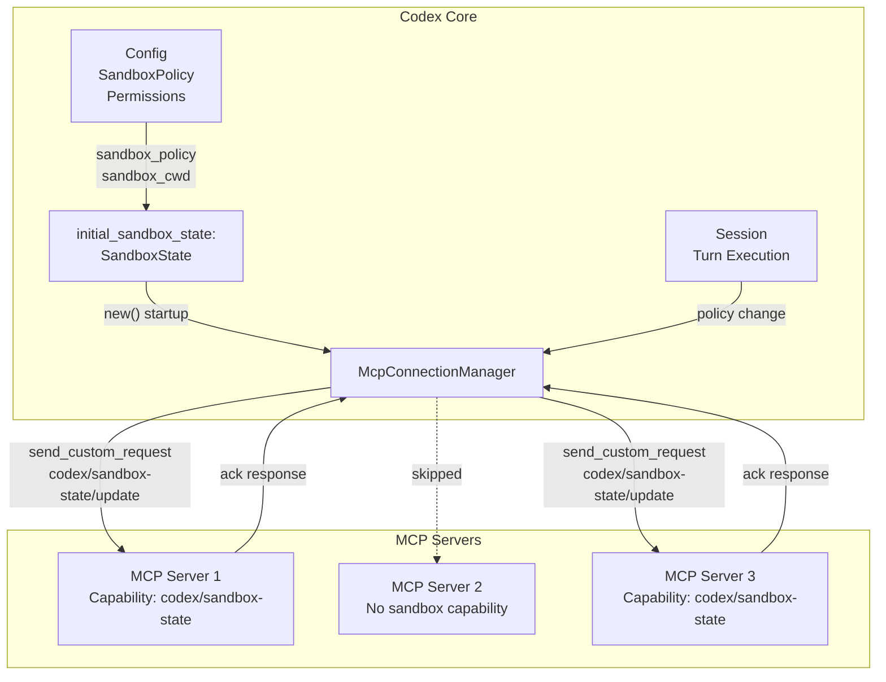
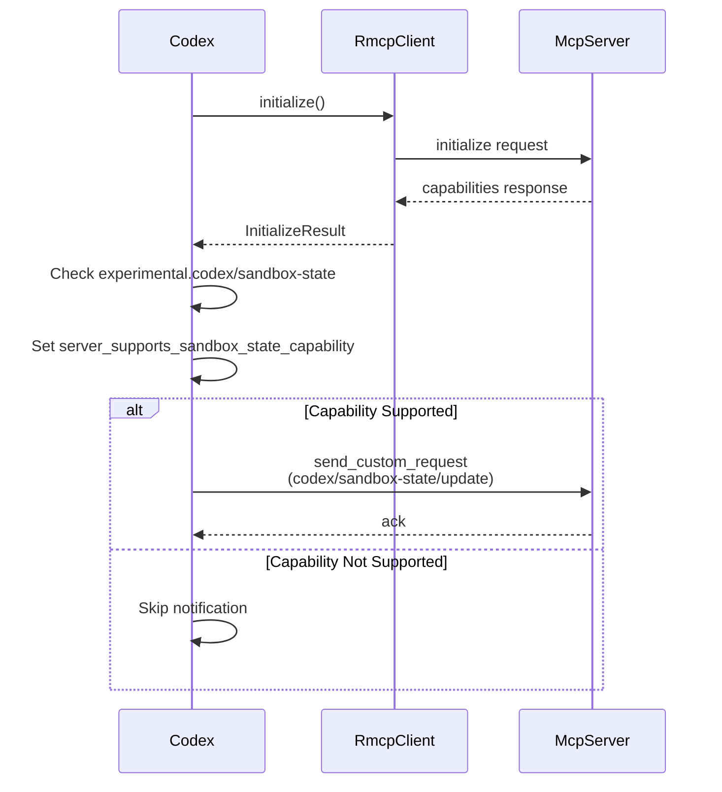
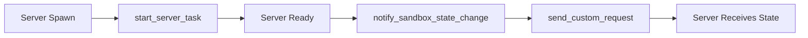
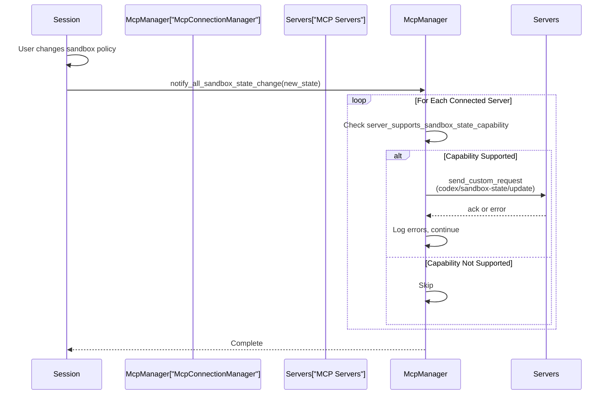

# Sandbox State Synchronization

<details>
<summary>Relevant source files</summary>

The following files were used as context for generating this wiki page:

- [codex-rs/app-server/tests/common/models_cache.rs](codex-rs/app-server/tests/common/models_cache.rs)
- [codex-rs/cli/src/mcp_cmd.rs](codex-rs/cli/src/mcp_cmd.rs)
- [codex-rs/cli/tests/mcp_add_remove.rs](codex-rs/cli/tests/mcp_add_remove.rs)
- [codex-rs/cli/tests/mcp_list.rs](codex-rs/cli/tests/mcp_list.rs)
- [codex-rs/codex-api/tests/models_integration.rs](codex-rs/codex-api/tests/models_integration.rs)
- [codex-rs/core/src/mcp_connection_manager.rs](codex-rs/core/src/mcp_connection_manager.rs)
- [codex-rs/core/src/models_manager/cache.rs](codex-rs/core/src/models_manager/cache.rs)
- [codex-rs/core/src/models_manager/manager.rs](codex-rs/core/src/models_manager/manager.rs)
- [codex-rs/core/src/models_manager/mod.rs](codex-rs/core/src/models_manager/mod.rs)
- [codex-rs/core/src/models_manager/model_info.rs](codex-rs/core/src/models_manager/model_info.rs)
- [codex-rs/core/src/original_image_detail.rs](codex-rs/core/src/original_image_detail.rs)
- [codex-rs/core/src/tools/handlers/view_image.rs](codex-rs/core/src/tools/handlers/view_image.rs)
- [codex-rs/core/tests/suite/model_switching.rs](codex-rs/core/tests/suite/model_switching.rs)
- [codex-rs/core/tests/suite/models_cache_ttl.rs](codex-rs/core/tests/suite/models_cache_ttl.rs)
- [codex-rs/core/tests/suite/personality.rs](codex-rs/core/tests/suite/personality.rs)
- [codex-rs/core/tests/suite/remote_models.rs](codex-rs/core/tests/suite/remote_models.rs)
- [codex-rs/core/tests/suite/rmcp_client.rs](codex-rs/core/tests/suite/rmcp_client.rs)
- [codex-rs/core/tests/suite/view_image.rs](codex-rs/core/tests/suite/view_image.rs)
- [codex-rs/protocol/src/openai_models.rs](codex-rs/protocol/src/openai_models.rs)

</details>

## Purpose and Scope

This document describes how Codex synchronizes sandbox execution state with MCP servers through a custom protocol extension. When Codex enforces sandbox restrictions (read-only access, workspace boundaries, specific sandboxing mechanisms), MCP servers need awareness of these constraints to adapt their tool behavior accordingly.

For general MCP server configuration and lifecycle management, see [MCP Connection Manager](#6.2). For sandbox policy configuration within Codex itself, see [Sandbox and Approval Policies](#2.4).

---

## Overview

Sandbox state synchronization is a Codex-specific extension to the Model Context Protocol that enables MCP servers to receive notifications about the current sandbox execution environment. This allows external tool servers to:

- Understand which sandbox policy is active (ReadOnly, WorkspaceWrite, DangerFullAccess)
- Know the working directory for sandboxed operations
- Receive platform-specific sandbox executor paths
- Adapt tool execution to match Codex's security constraints

The synchronization uses a custom MCP capability (`codex/sandbox-state`) and notification method (`codex/sandbox-state/update`) to propagate state changes from Codex to connected servers.

Sources: [codex-rs/core/src/mcp_connection_manager.rs:581-595]()

---

## System Architecture



**Diagram: Sandbox State Propagation Flow**

Sources: [codex-rs/core/src/mcp_connection_manager.rs:635-756](), [codex-rs/core/src/mcp_connection_manager.rs:1058-1069]()

---

## SandboxState Structure

The `SandboxState` struct contains all information MCP servers need to understand Codex's execution environment:

| Field                     | Type              | Description                                                        |
| ------------------------- | ----------------- | ------------------------------------------------------------------ |
| `sandbox_policy`          | `SandboxPolicy`   | Active policy: `ReadOnly`, `WorkspaceWrite`, or `DangerFullAccess` |
| `codex_linux_sandbox_exe` | `Option<PathBuf>` | Path to Linux sandbox wrapper executable (landlock implementation) |
| `sandbox_cwd`             | `PathBuf`         | Current working directory for sandboxed operations                 |
| `use_legacy_landlock`     | `bool`            | Whether to use legacy landlock implementation (default: false)     |

The structure is serialized as JSON when sent over MCP transport with camelCase field names:

```json
{
  "sandboxPolicy": "workspace_write",
  "codexLinuxSandboxExe": "/path/to/codex-linux-sandbox",
  "sandboxCwd": "/home/user/project",
  "useLegacyLandlock": false
}
```

Sources: [codex-rs/core/src/mcp_connection_manager.rs:587-595]()

---

## Capability Negotiation

### Server Capability Declaration

MCP servers advertise support for sandbox state notifications by including the `codex/sandbox-state` capability in their initialization response:

```json
{
  "capabilities": {
    "experimental": {
      "codex/sandbox-state": {}
    }
  }
}
```

### Client Capability Checking

During server initialization, Codex checks for capability support and stores the result in `ManagedClient`:



**Diagram: Capability Negotiation Sequence**

The capability flag is checked before sending any notifications:

```rust
// From ManagedClient::notify_sandbox_state_change
if !self.server_supports_sandbox_state_capability {
    return Ok(());
}
```

Sources: [codex-rs/core/src/mcp_connection_manager.rs:370-421](), [codex-rs/core/src/mcp_connection_manager.rs:407-420]()

---

## Notification Timing

### Initial Notification on Startup

When an MCP server transitions to `Ready` status, Codex immediately sends the current sandbox state:



**Diagram: Initial Notification Flow**

The initial state is captured when creating the `McpConnectionManager`:

| Parameter                 | Source                                                |
| ------------------------- | ----------------------------------------------------- |
| `initial_sandbox_state`   | Constructed from current `Config` and `Session` state |
| `sandbox_policy`          | From `config.permissions.sandbox_policy`              |
| `sandbox_cwd`             | From current session working directory                |
| `codex_linux_sandbox_exe` | Platform-specific sandbox executable path             |

Sources: [codex-rs/core/src/mcp_connection_manager.rs:687-703]()

### Runtime Notifications

The public API method `notify_all_sandbox_state_change` allows Codex to push updates when sandbox configuration changes during execution:



**Diagram: Runtime Notification Sequence**

Sources: [codex-rs/core/src/mcp_connection_manager.rs:1058-1069]()

---

## Protocol Details

### Custom Request Method

The notification uses the MCP custom request mechanism with a Codex-specific method name:

| Constant                       | Value                          | Usage                                    |
| ------------------------------ | ------------------------------ | ---------------------------------------- |
| `MCP_SANDBOX_STATE_CAPABILITY` | `"codex/sandbox-state"`        | Capability identifier in server metadata |
| `MCP_SANDBOX_STATE_METHOD`     | `"codex/sandbox-state/update"` | Custom request method name               |

### Request Format

The request is sent as an MCP custom request with the `SandboxState` struct serialized as the params:

```rust
self.client.send_custom_request(
    MCP_SANDBOX_STATE_METHOD,
    Some(serde_json::to_value(sandbox_state)?),
).await?;
```

The server is expected to acknowledge the request with an empty response or error status.

Sources: [codex-rs/core/src/mcp_connection_manager.rs:581-585](), [codex-rs/core/src/mcp_connection_manager.rs:412-418]()

---

## Implementation Reference

### Key Types

| Type                   | Location                                                 | Purpose                                                |
| ---------------------- | -------------------------------------------------------- | ------------------------------------------------------ |
| `SandboxState`         | [codex-rs/core/src/mcp_connection_manager.rs:587-595]()  | State payload structure                                |
| `ManagedClient`        | [codex-rs/core/src/mcp_connection_manager.rs:370-421]()  | Per-server connection wrapper with capability tracking |
| `AsyncManagedClient`   | [codex-rs/core/src/mcp_connection_manager.rs:423-579]()  | Async wrapper for startup and notifications            |
| `McpConnectionManager` | [codex-rs/core/src/mcp_connection_manager.rs:598-1095]() | Connection pool coordinator                            |

### Key Methods

```rust
// Check capability and send notification
async fn notify_sandbox_state_change(&self, sandbox_state: &SandboxState) -> Result<()>
```

Location: [codex-rs/core/src/mcp_connection_manager.rs:407-420]()

Purpose: Sends state update to a single server if it supports the capability.

```rust
// Public API for runtime updates
pub async fn notify_all_sandbox_state_change(&self, sandbox_state: &SandboxState) -> Result<()>
```

Location: [codex-rs/core/src/mcp_connection_manager.rs:1058-1069]()

Purpose: Broadcasts state update to all connected servers, logging errors but not failing on individual server errors.

Sources: [codex-rs/core/src/mcp_connection_manager.rs:407-420](), [codex-rs/core/src/mcp_connection_manager.rs:575-578](), [codex-rs/core/src/mcp_connection_manager.rs:1058-1069]()

---

## Error Handling

The synchronization mechanism is designed to be non-blocking and resilient:

- **Capability Check**: Servers without the capability are silently skipped (no error)
- **Individual Failures**: Errors from individual servers are logged but don't abort the notification loop
- **Network Errors**: Transport errors are propagated but caught at the broadcast level
- **State Mismatch**: No validation is performed on the server side - servers are expected to handle invalid or unexpected states gracefully

Example error handling from broadcast method:

```rust
for async_managed_client in self.clients.values() {
    if let Err(err) = async_managed_client.notify_sandbox_state_change(sandbox_state).await {
        warn!(
            "Failed to notify sandbox state to MCP server: {err:#}",
        );
    }
}
```

This ensures that a failing server doesn't prevent other servers from receiving updates.

Sources: [codex-rs/core/src/mcp_connection_manager.rs:1058-1069](), [codex-rs/core/src/mcp_connection_manager.rs:695-703]()

---

## Platform Considerations

### Linux Sandbox Executable

The `codex_linux_sandbox_exe` field provides the path to the Linux-specific sandboxing wrapper that uses landlock LSM. This allows MCP servers on Linux to:

- Execute tools through the same sandboxing mechanism Codex uses
- Maintain consistent security boundaries across Codex and MCP tool execution
- Support both modern landlock and legacy implementations via the `use_legacy_landlock` flag

### Cross-Platform Behavior

| Platform | Sandbox Mechanism | `codex_linux_sandbox_exe` Value      |
| -------- | ----------------- | ------------------------------------ |
| Linux    | Landlock LSM      | Path to `codex-linux-sandbox` binary |
| macOS    | Seatbelt profiles | `None` (not applicable)              |
| Windows  | Restricted tokens | `None` (not applicable)              |

MCP servers can inspect the platform-specific fields to determine which sandboxing approach to use or whether to skip sandboxing entirely on unsupported platforms.

Sources: [codex-rs/core/src/mcp_connection_manager.rs:587-595]()

---

## Testing Considerations

While no explicit integration tests for sandbox state synchronization are visible in the provided code, the mechanism can be validated by:

1. Monitoring MCP server initialization logs for capability negotiation
2. Observing custom request traffic in MCP protocol traces
3. Verifying server behavior changes when sandbox policy is modified
4. Testing graceful degradation when servers lack the capability

The startup notification is tested implicitly in any MCP server integration test that uses a server supporting the capability, as the notification is sent automatically after server ready status.

Sources: [codex-rs/core/tests/suite/rmcp_client.rs:54-194]()
