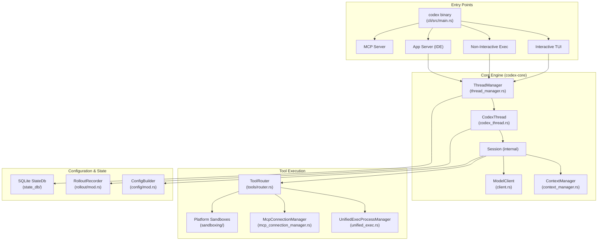
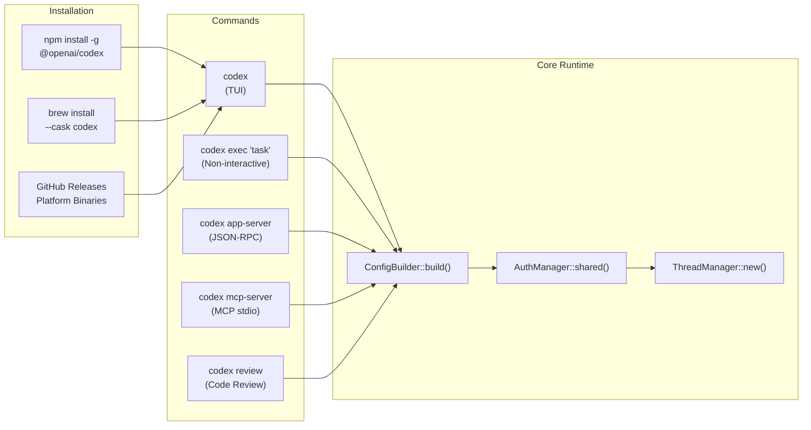
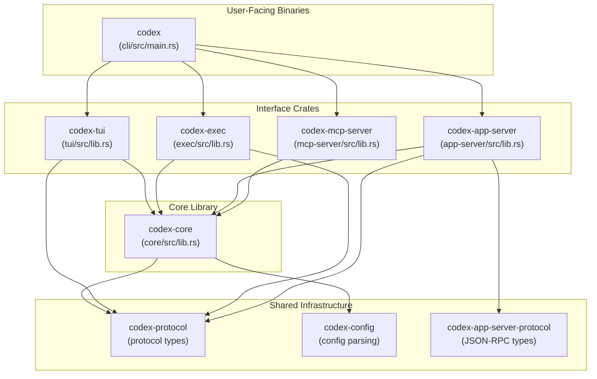
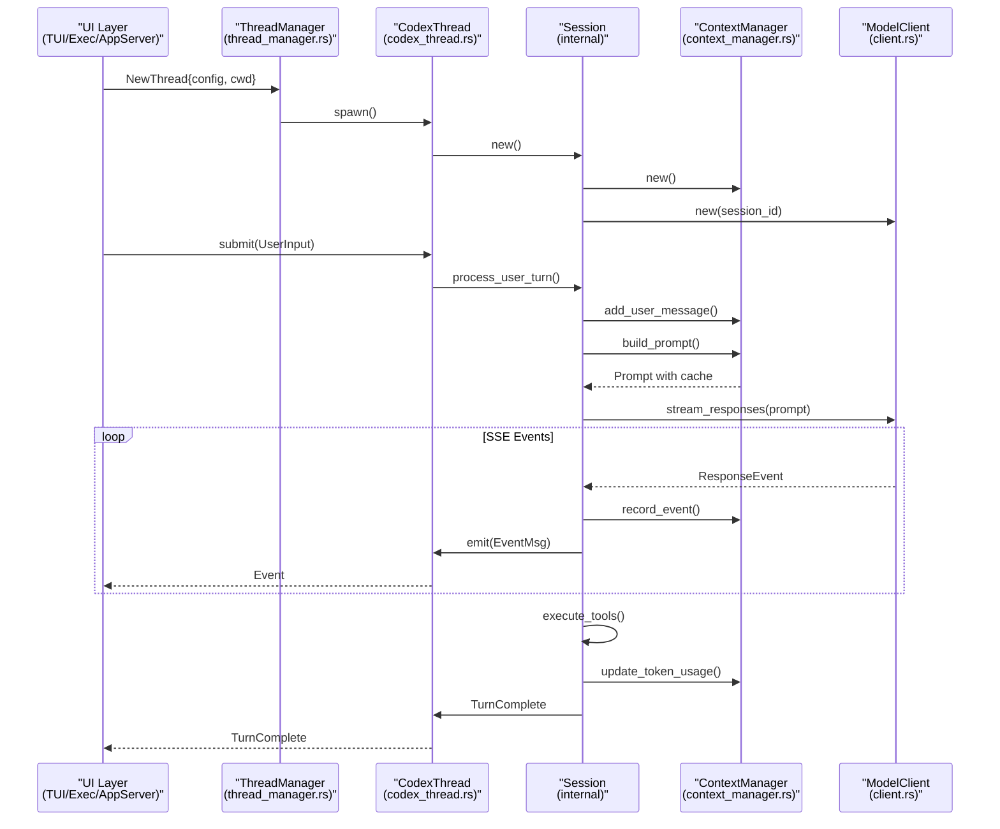
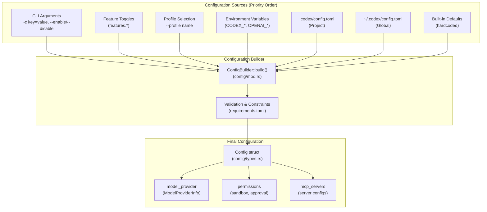
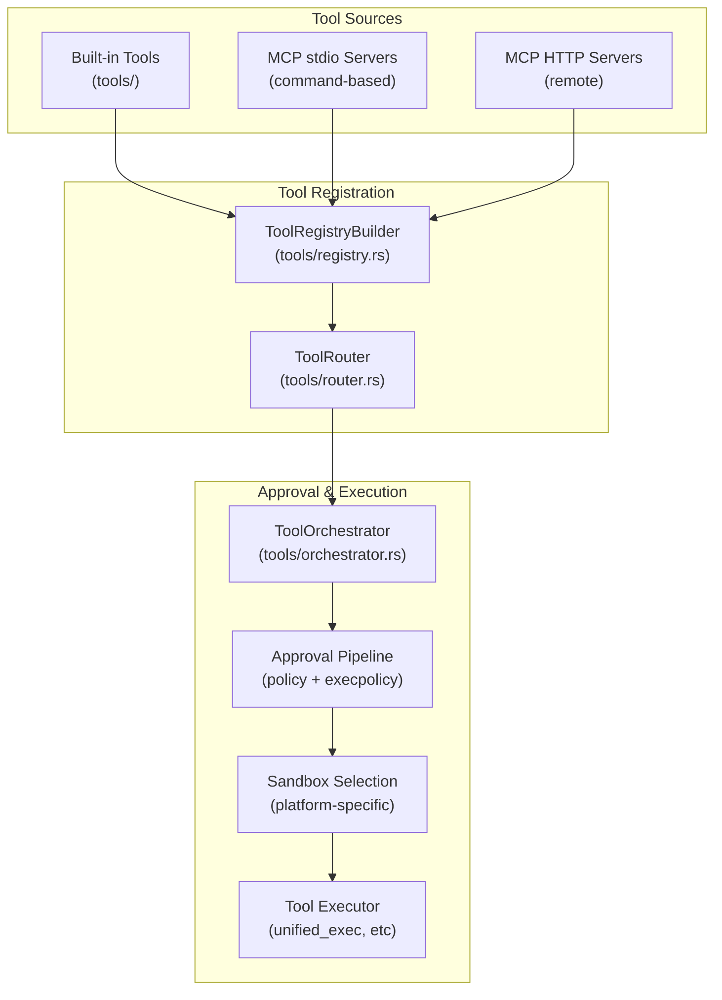
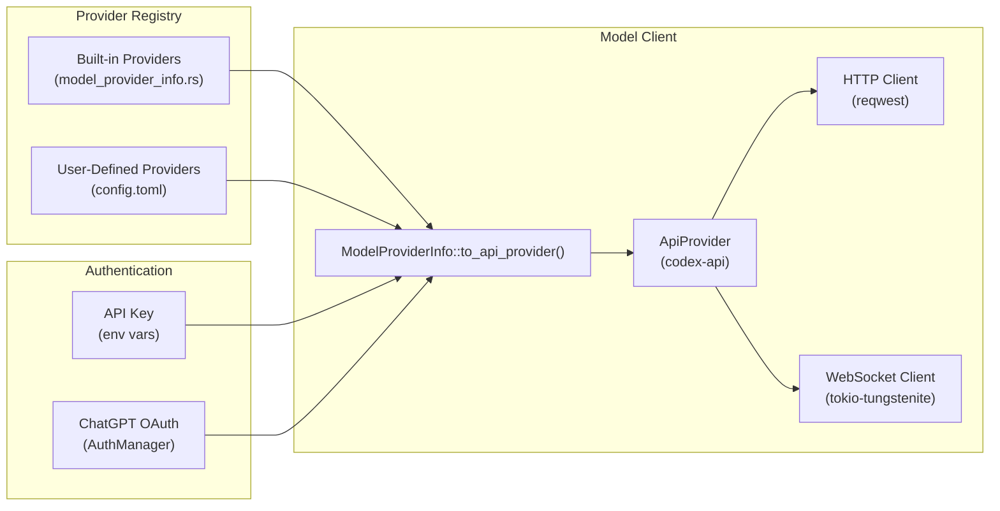
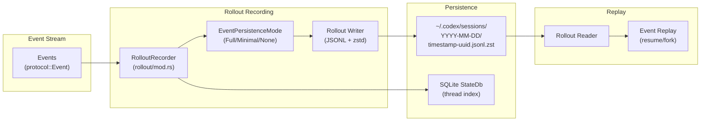

# Overview

<details>
<summary>Relevant source files</summary>

The following files were used as context for generating this wiki page:

- [README.md](README.md)
- [codex-rs/Cargo.lock](codex-rs/Cargo.lock)
- [codex-rs/Cargo.toml](codex-rs/Cargo.toml)
- [codex-rs/README.md](codex-rs/README.md)
- [codex-rs/cli/Cargo.toml](codex-rs/cli/Cargo.toml)
- [codex-rs/cli/src/main.rs](codex-rs/cli/src/main.rs)
- [codex-rs/config.md](codex-rs/config.md)
- [codex-rs/core/Cargo.toml](codex-rs/core/Cargo.toml)
- [codex-rs/core/src/flags.rs](codex-rs/core/src/flags.rs)
- [codex-rs/core/src/lib.rs](codex-rs/core/src/lib.rs)
- [codex-rs/core/src/model_provider_info.rs](codex-rs/core/src/model_provider_info.rs)
- [codex-rs/exec/Cargo.toml](codex-rs/exec/Cargo.toml)
- [codex-rs/exec/src/cli.rs](codex-rs/exec/src/cli.rs)
- [codex-rs/exec/src/lib.rs](codex-rs/exec/src/lib.rs)
- [codex-rs/tui/Cargo.toml](codex-rs/tui/Cargo.toml)
- [codex-rs/tui/src/cli.rs](codex-rs/tui/src/cli.rs)
- [codex-rs/tui/src/lib.rs](codex-rs/tui/src/lib.rs)

</details>

Codex CLI is an AI coding agent from OpenAI that runs locally on your computer. It provides an interactive terminal interface, non-interactive automation modes, and IDE integration capabilities for executing coding tasks with AI assistance. The system is implemented in Rust as a Cargo workspace and supports multiple execution modes, configurable sandboxing, tool extensibility via the Model Context Protocol (MCP), and multi-agent workflows.

For detailed information about installation procedures, see [Installation and Setup](#1.1). For configuration options, see [Configuration System](#2.2). For IDE integration details, see [App Server and IDE Integration](#4.5).

## Project Purpose and Architecture

Codex is designed as a zero-dependency native executable that coordinates AI model interactions, executes tools in sandboxed environments, and manages conversation state across multiple sessions. The codebase is organized as a Rust workspace with clear separation between core business logic, user interfaces, and integration points.



**Sources:** [codex-rs/cli/src/main.rs:1-150](), [codex-rs/core/src/lib.rs:1-178](), [codex-rs/core/src/thread_manager.rs](), [README.md:1-60]()

## Execution Modes

Codex supports four primary execution modes, each serving different use cases. All modes converge on the same core `ThreadManager` infrastructure but differ in how they present events and handle user interaction.

### Execution Mode Comparison

| Mode           | Entry Point        | Use Case                | Session Persistence        | User Interaction       |
| -------------- | ------------------ | ----------------------- | -------------------------- | ---------------------- |
| **TUI**        | `codex` (default)  | Interactive development | Yes (rollout files)        | Full interactive UI    |
| **Exec**       | `codex exec`       | Automation/CI           | Yes (unless `--ephemeral`) | None (non-interactive) |
| **App Server** | `codex app-server` | IDE integration         | Yes                        | JSON-RPC protocol      |
| **MCP Server** | `codex mcp-server` | Tool delegation         | Yes                        | MCP protocol (stdio)   |



**Sources:** [codex-rs/cli/src/main.rs:83-149](), [codex-rs/exec/src/lib.rs:161-466](), [codex-rs/tui/src/lib.rs:230-530](), [README.md:13-46]()

## Core Crate Organization

The Codex workspace is organized into focused crates with clear responsibilities. The core business logic resides in `codex-core`, while UI implementations and integration points are separate crates.

### Primary Crates

| Crate                       | Path                   | Purpose                                                                |
| --------------------------- | ---------------------- | ---------------------------------------------------------------------- |
| `codex-core`                | `core/`                | Core agent logic, session management, model client, tool orchestration |
| `codex-tui`                 | `tui/`                 | Interactive terminal UI built with Ratatui                             |
| `codex-exec`                | `exec/`                | Non-interactive headless CLI with JSONL output mode                    |
| `codex-cli`                 | `cli/`                 | Multitool dispatcher, subcommand routing, feature toggles              |
| `codex-app-server`          | `app-server/`          | JSON-RPC server for VS Code, Cursor, and other IDE clients             |
| `codex-app-server-protocol` | `app-server-protocol/` | Protocol definitions for app server communication                      |
| `codex-mcp-server`          | `mcp-server/`          | MCP server implementation exposing Codex as tools                      |
| `codex-protocol`            | `protocol/`            | Shared protocol types for events, config, tool specs                   |
| `codex-config`              | `config/`              | Configuration parsing, validation, layer merging                       |



**Sources:** [codex-rs/Cargo.toml:1-395](), [codex-rs/core/Cargo.toml:1-183](), [codex-rs/tui/Cargo.toml:1-145](), [codex-rs/cli/Cargo.toml:1-69]()

## Core Architecture Components

The core engine implements a layered architecture where the `ThreadManager` manages thread lifecycles, `CodexThread` coordinates session execution, and internal `Session` structs handle turn-by-turn model interactions.

### Thread and Session Lifecycle



**Sources:** [codex-rs/core/src/thread_manager.rs](), [codex-rs/core/src/codex_thread.rs](), [codex-rs/core/src/client.rs:1-200](), [codex-rs/core/src/context_manager.rs]()

### Key Component Responsibilities

| Component            | File                          | Primary Responsibilities                                               |
| -------------------- | ----------------------------- | ---------------------------------------------------------------------- |
| `ThreadManager`      | `core/src/thread_manager.rs`  | Thread spawning/resuming, state database interaction, thread switching |
| `CodexThread`        | `core/src/codex_thread.rs`    | Submission queue, event emission, task management, rollout recording   |
| `Session` (internal) | `core/src/codex.rs`           | Turn orchestration, prompt building, model streaming, tool routing     |
| `ContextManager`     | `core/src/context_manager.rs` | Message history, token tracking, compaction triggers, cached prefixes  |
| `ModelClient`        | `core/src/client.rs`          | HTTP/WebSocket transport, SSE parsing, retry logic, auth headers       |
| `ToolRouter`         | `core/src/tools/`             | Tool registration, approval checks, sandbox selection, execution       |
| `RolloutRecorder`    | `core/src/rollout/mod.rs`     | Session persistence, event filtering, thread indexing                  |

**Sources:** [codex-rs/core/src/lib.rs:1-178](), [codex-rs/core/src/codex.rs](), [codex-rs/core/src/client.rs]()

## Configuration System

Configuration is assembled from multiple layers with CLI arguments taking highest priority, followed by environment variables, project config, global config, and defaults. The `ConfigBuilder` merges these layers and validates against `requirements.toml` constraints.



**Sources:** [codex-rs/core/src/config/mod.rs](), [codex-rs/tui/src/lib.rs:271-310](), [codex-rs/exec/src/lib.rs:237-367]()

## Tool Ecosystem

Codex provides built-in tools for shell execution, file patching, and web search, while supporting external tools via MCP server integration. All tool calls flow through the `ToolRouter` which enforces layered approval policies and sandbox selection.

### Tool Architecture

| Tool Type   | Implementation                    | Examples                                                     |
| ----------- | --------------------------------- | ------------------------------------------------------------ |
| Built-in    | Compiled into `codex-core`        | `shell_command`, `exec_command`, `apply_patch`, `web_search` |
| MCP (stdio) | External process via stdin/stdout | User-defined MCP servers                                     |
| MCP (HTTP)  | Remote HTTP endpoints             | Cloud-based tool servers                                     |
| Code Mode   | JavaScript REPL with yield/resume | Long-running scripts                                         |



**Sources:** [codex-rs/core/src/tools/](), [codex-rs/core/src/mcp_connection_manager.rs](), [codex-rs/core/src/unified_exec.rs]()

## Model Provider System

Codex supports multiple model providers through a unified `ModelProviderInfo` registry. Providers can be OpenAI (default), ChatGPT-authenticated, or custom OSS providers (LM Studio, Ollama) with OpenAI-compatible APIs.

### Provider Configuration

| Provider Type | Authentication                    | Base URL                                | Wire Protocol |
| ------------- | --------------------------------- | --------------------------------------- | ------------- |
| OpenAI        | API Key (`OPENAI_API_KEY`)        | `https://api.openai.com/v1`             | `responses`   |
| ChatGPT       | OAuth token (stored in auth.json) | `https://chatgpt.com/backend-api/codex` | `responses`   |
| LM Studio     | None (local)                      | `http://localhost:1234/v1`              | `responses`   |
| Ollama        | None (local)                      | `http://localhost:11434/v1`             | `responses`   |
| Custom        | Configurable env var              | User-defined                            | `responses`   |



**Sources:** [codex-rs/core/src/model_provider_info.rs:1-250](), [codex-rs/core/src/auth/mod.rs](), [codex-rs/core/src/client.rs]()

## Session Persistence and Replay

Sessions are persisted as rollout files containing event streams that can be replayed to resume or fork conversations. The `RolloutRecorder` filters events based on persistence mode and writes them to timestamped files.

### Rollout File Structure

```
~/.codex/sessions/
├── 2025-01-20/
│   ├── 2025-01-20T14-30-45Z-<uuid>.jsonl.zst
│   └── 2025-01-20T15-10-22Z-<uuid>.jsonl.zst
└── archived/
    └── 2025-01-15T10-05-30Z-<uuid>.jsonl.zst
```

Each rollout file contains:

- `RolloutLine::Meta`: Session metadata (thread_id, cwd, model, etc.)
- `RolloutLine::Item`: Persisted events (user messages, agent messages, tool calls)



**Sources:** [codex-rs/core/src/rollout/mod.rs](), [codex-rs/core/src/rollout/policy.rs](), [codex-rs/core/src/state_db/mod.rs]()

## Multi-Agent Support

Codex supports spawning specialized sub-agents for tasks like code review, permission analysis (Guardian), or custom workflows. Each thread has its own `ThreadEventStore` buffering up to 32,768 events for state preservation during thread switching.

### Sub-Agent Types

| Agent Type | ThreadId Pattern      | Purpose                  | Configuration                                         |
| ---------- | --------------------- | ------------------------ | ----------------------------------------------------- |
| Primary    | User-provided or UUID | Main conversation        | User config                                           |
| Review     | `review-*`            | Code analysis            | Restricted (no web search, `approval_policy = Never`) |
| Guardian   | Internal              | Permission auto-approval | Specialized prompts                                   |
| Custom     | `task-*`              | Arbitrary sub-tasks      | Forked from primary                                   |

**Sources:** [codex-rs/core/src/thread_manager.rs](), [codex-rs/core/src/guardian.rs](), [codex-rs/core/src/review_prompts.rs]()

## Distribution and Build Pipeline

Codex is distributed through multiple channels: npm (cross-platform), Homebrew (macOS), WinGet (Windows), and direct GitHub Release downloads. The CI pipeline builds for 6 platform targets with platform-specific code signing.

### Build Targets

| Platform            | Target Triple                | Code Signing                     |
| ------------------- | ---------------------------- | -------------------------------- |
| macOS (arm64)       | `aarch64-apple-darwin`       | Apple certificate + notarization |
| macOS (x86_64)      | `x86_64-apple-darwin`        | Apple certificate + notarization |
| Linux GNU (x86_64)  | `x86_64-unknown-linux-gnu`   | Cosign (Sigstore)                |
| Linux GNU (arm64)   | `aarch64-unknown-linux-gnu`  | Cosign (Sigstore)                |
| Linux MUSL (x86_64) | `x86_64-unknown-linux-musl`  | Cosign (Sigstore)                |
| Linux MUSL (arm64)  | `aarch64-unknown-linux-musl` | Cosign (Sigstore)                |
| Windows (x86_64)    | `x86_64-pc-windows-msvc`     | Azure Trusted Signing            |
| Windows (arm64)     | `aarch64-pc-windows-msvc`    | Azure Trusted Signing            |

**Sources:** [README.md:13-60](), [codex-rs/README.md:1-103](), [Cargo.toml:367-375]()
