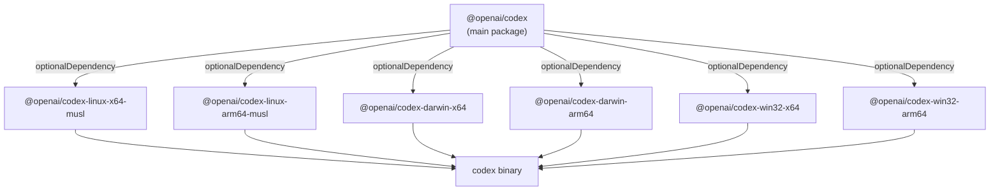
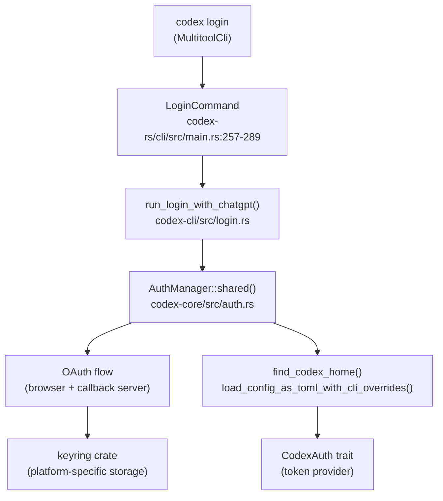
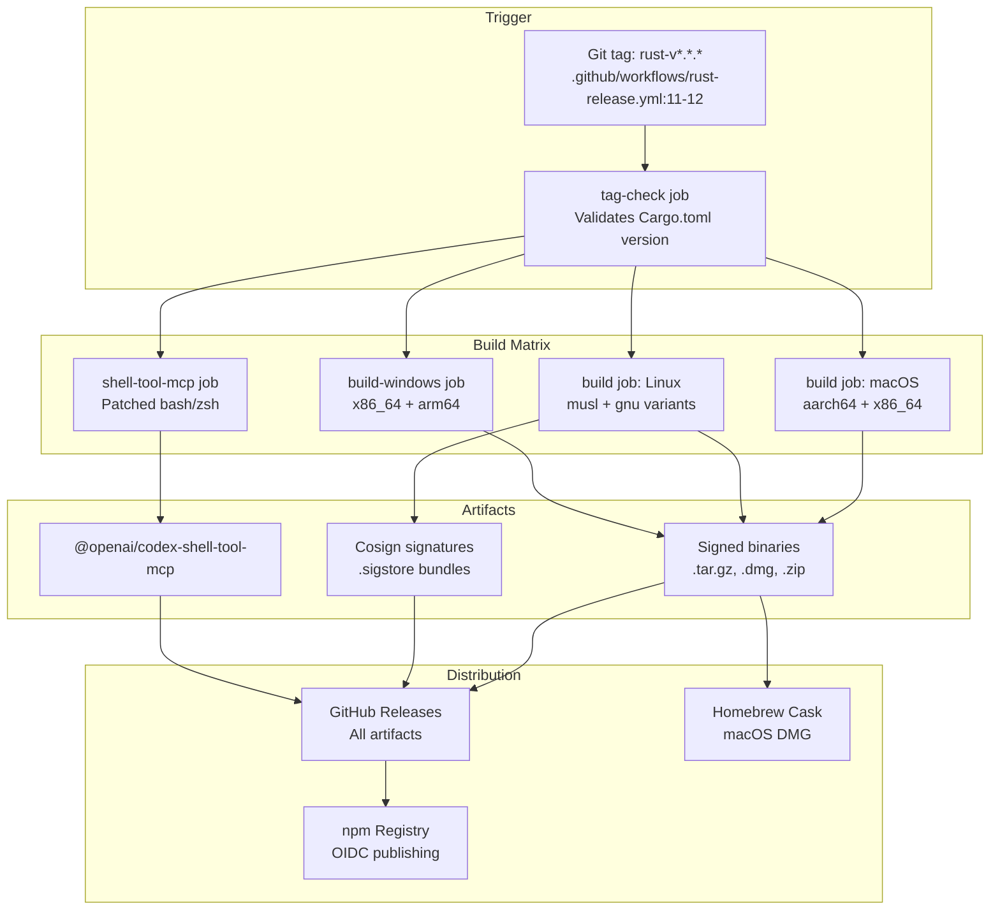

# Installation and Setup

<details>
<summary>Relevant source files</summary>

The following files were used as context for generating this wiki page:

- [.github/actions/windows-code-sign/action.yml](.github/actions/windows-code-sign/action.yml)
- [.github/scripts/install-musl-build-tools.sh](.github/scripts/install-musl-build-tools.sh)
- [.github/workflows/ci.yml](.github/workflows/ci.yml)
- [.github/workflows/rust-ci.yml](.github/workflows/rust-ci.yml)
- [.github/workflows/rust-release-windows.yml](.github/workflows/rust-release-windows.yml)
- [.github/workflows/rust-release.yml](.github/workflows/rust-release.yml)
- [.github/workflows/sdk.yml](.github/workflows/sdk.yml)
- [.github/workflows/shell-tool-mcp.yml](.github/workflows/shell-tool-mcp.yml)
- [.github/workflows/zstd](.github/workflows/zstd)
- [AGENTS.md](AGENTS.md)
- [README.md](README.md)
- [codex-rs/.cargo/config.toml](codex-rs/.cargo/config.toml)
- [codex-rs/rust-toolchain.toml](codex-rs/rust-toolchain.toml)
- [codex-rs/scripts/setup-windows.ps1](codex-rs/scripts/setup-windows.ps1)
- [codex-rs/shell-escalation/README.md](codex-rs/shell-escalation/README.md)

</details>

This page covers installing Codex CLI, authenticating, and performing initial configuration. Codex is distributed as a native binary through npm, Homebrew, or direct download. After installation, you must authenticate using either ChatGPT OAuth or an API key.

For building from source or development setup, see [Development Setup](#8.1).

## System Requirements

**Supported Platforms:**

| Operating System | Architecture                          | Notes                                                     |
| ---------------- | ------------------------------------- | --------------------------------------------------------- |
| macOS 11+        | ARM64 (Apple Silicon), x86_64 (Intel) | Code-signed and notarized                                 |
| Linux            | x86_64, ARM64                         | Statically-linked musl binaries (no runtime dependencies) |
| Windows 10+      | x86_64, ARM64                         | Signed with Azure Trusted Signing                         |

Codex binaries are self-contained native executables with no external dependencies. The Linux builds use musl libc for maximum compatibility across distributions [.github/workflows/rust-release.yml:71-77]().

Sources: [.github/workflows/rust-ci.yml:108-183](), [.github/workflows/rust-release.yml:62-77](), [README.md:36-41]()

## Installation Methods

### npm (Recommended)

Install globally using npm (requires Node.js):

```bash
npm install -g @openai/codex
```

The `@openai/codex` package automatically selects the correct binary for your platform using npm's optional dependencies mechanism. After installation, the `codex` command is available in your PATH.

**npm Package Structure:**



Sources: [README.md:19-21](), [.github/workflows/rust-release.yml:547-615]()

### Homebrew (macOS)

On macOS, install via Homebrew cask:

```bash
brew install --cask codex
```

The cask downloads the signed DMG from GitHub Releases and installs the binary. This integrates with `brew update` and `brew upgrade` for updates.

Sources: [README.md:24-26]()

### Direct Download

Download pre-compiled binaries from [GitHub Releases](https://github.com/openai/codex/releases/latest):

| Platform       | Recommended File                              |
| -------------- | --------------------------------------------- |
| macOS ARM64    | `codex-aarch64-apple-darwin.tar.gz` or `.dmg` |
| macOS x86_64   | `codex-x86_64-apple-darwin.tar.gz` or `.dmg`  |
| Linux x86_64   | `codex-x86_64-unknown-linux-musl.tar.gz`      |
| Linux ARM64    | `codex-aarch64-unknown-linux-musl.tar.gz`     |
| Windows x86_64 | `codex-x86_64-pc-windows-msvc.zip`            |
| Windows ARM64  | `codex-aarch64-pc-windows-msvc.zip`           |

After extracting:

1. Rename the binary to `codex` (or `codex.exe` on Windows)
2. Move to a directory in your PATH (e.g., `/usr/local/bin` on Unix, or add a custom directory to PATH)
3. Make executable (Unix): `chmod +x codex`

Sources: [README.md:32-44]()

## Verifying Installation

After installation, verify Codex is available:

```bash
# Check version
codex --version

# View help
codex --help
```

The `codex` binary is a multitool that dispatches to different modes based on subcommands. The main entry point is `MultitoolCli` in [codex-rs/cli/src/main.rs:56-79](), which routes to:

- **No subcommand** → Interactive TUI (launches `codex_tui::run_main` from [codex-rs/tui/src/lib.rs:131-433]())
- `exec` → Headless execution mode (launches `codex_exec::run_main` from [codex-rs/exec/src/lib.rs:91]())
- `app-server` → JSON-RPC server for IDE integration
- `mcp` → MCP server management
- `login`/`logout` → Authentication management

Sources: [codex-rs/cli/src/main.rs:55-146](), [README.md:28-29]()

## Authentication

On first run, Codex prompts you to authenticate. Two methods are supported:

### Sign in with ChatGPT (Recommended)

Authenticates using your ChatGPT account (Plus, Pro, Team, Edu, or Enterprise):

```bash
codex login
# Select "Sign in with ChatGPT"
```

The CLI launches a browser OAuth flow and stores credentials securely:

- **macOS**: System keychain via `keyring` crate with `apple-native` feature [codex-rs/core/Cargo.toml:120]()
- **Linux**: Encrypted file using `keyring` with `linux-native-async-persistent` [codex-rs/core/Cargo.toml:114]()
- **Windows**: Windows Credential Manager via `keyring` with `windows-native` [codex-rs/core/Cargo.toml:131]()

The `AuthManager` (defined in `codex_core::auth`) handles credential storage and retrieval [codex-rs/core/src/lib.rs:96]().

**Authentication Flow (Code Entities):**



Sources: [README.md:47-49](), [codex-rs/cli/src/main.rs:257-295](), [codex-rs/core/Cargo.toml:113-131](), [codex-rs/tui/src/lib.rs:222-236]()

### Sign in with API Key

For OpenAI API key authentication:

```bash
codex login --with-api-key
# Provide API key when prompted
```

The API key is stored in `~/.codex/config.toml`:

```toml
[auth]
api_key = "sk-..."
```

This method bills usage to your OpenAI API account. See [https://developers.openai.com/codex/auth#sign-in-with-an-api-key](https://developers.openai.com/codex/auth#sign-in-with-an-api-key) for additional setup steps.

The configuration is loaded by `ConfigBuilder` during initialization [codex-rs/tui/src/lib.rs:288-294](), which merges layers from multiple sources (see [Configuration System](#2.2)).

Sources: [README.md:50-51](), [codex-rs/cli/src/main.rs:262-264]()

### Checking Login Status

View current authentication status:

```bash
codex login status
```

This invokes `LoginSubcommand::Status` [codex-rs/cli/src/main.rs:293-294]() which calls `run_login_status()` to display the active authentication method and associated account.

Sources: [codex-rs/cli/src/main.rs:291-295]()

## Initial Configuration

Codex configuration is stored in `~/.codex/config.toml` (or `$CODEX_HOME/config.toml` if set). The file is created automatically on first run with defaults.

### Configuration File Location

The `find_codex_home()` function locates the configuration directory [codex-rs/tui/src/lib.rs:176-182]():

1. `$CODEX_HOME` environment variable (if set)
2. `~/.codex` (default)

Configuration is loaded hierarchically from multiple sources:

- Built-in defaults
- `~/.codex/config.toml` (user config)
- `.codex/config.toml` (project config, if present)
- Profile configs (e.g., `fast`, `slow`)
- CLI overrides (`-c key=value`)
- Cloud requirements (from ChatGPT backend)

This layering is implemented by `ConfigBuilder` [codex-rs/core/src/lib.rs:26]() and described in detail in [Configuration System](#2.2).

Sources: [codex-rs/tui/src/lib.rs:175-214](), [codex-rs/README.md:27]()

### Common Configuration Options

Create or edit `~/.codex/config.toml`:

```toml
# Model selection
model = "gpt-4o"

# Approval policy (Never, OnRequest, OnFailure, UnlessTrusted)
approval_policy = "OnRequest"

# Sandbox mode (ReadOnly, WorkspaceWrite, DangerFullAccess)
sandbox_mode = "ReadOnly"

# Working directory (default: current directory)
# cwd = "/path/to/project"
```

See [Configuration System](#2.2) for all available options and [Sandbox and Approval Policies](#2.4) for security settings.

Sources: [codex-rs/README.md:27]()

### Feature Flags

Enable or disable features via CLI flags or config:

```bash
# Enable a feature for this session
codex --enable web_search

# Disable a feature
codex --disable apply_patch
```

Or in `config.toml`:

```toml
[features]
web_search = true
apply_patch = false
```

Feature flags control tool availability and are validated against known feature keys [codex-rs/cli/src/main.rs:503-507](). See [Feature Flags and Stages](#2.3) for details.

Sources: [codex-rs/cli/src/main.rs:478-507]()

## Build and Distribution Architecture

The release pipeline orchestrates binary compilation, signing, and distribution across three channels.

**Diagram: Release Pipeline and Distribution Channels**



Sources: [.github/workflows/rust-release.yml:1-635]()

### Release Versioning

The release pipeline validates that the Git tag matches `Cargo.toml` version before proceeding [.github/workflows/rust-release.yml:24-46](). Version formats determine npm publishing behavior:

- `x.y.z` → Published to npm with default tag (stable)
- `x.y.z-alpha.N` → Published to npm with `alpha` tag
- Other formats → GitHub Release only, no npm publishing

This logic is implemented in [.github/workflows/rust-release.yml:447-464]().

### Compression and Compatibility

Each binary is distributed in multiple formats for compatibility:

- `.zst` (Zstandard) - High compression, requires `zstd` tool
- `.tar.gz` (gzip) - Universal compatibility on Unix systems
- `.zip` - Windows native format

Windows releases bundle helper binaries (`codex-command-runner.exe`, `codex-windows-sandbox-setup.exe`) in the main zip for WinGet installations [.github/workflows/rust-release-windows.yml:231-250]().

Sources: [.github/workflows/rust-release.yml:314-348](), [.github/workflows/rust-release-windows.yml:198-259]()

### Additional Components

The `shell-tool-mcp` workflow builds patched versions of Bash and Zsh that support exec interception for the MCP shell tool server. This component is distributed separately as `@openai/codex-shell-tool-mcp` on npm and includes:

- Rust binaries: `codex-exec-mcp-server`, `codex-execve-wrapper`
- Patched shells: Bash and Zsh compiled for 6 Linux distros + 2 macOS versions
- Platform detection and binary selection logic

The workflow cross-compiles across 18 container/platform combinations [.github/workflows/shell-tool-mcp.yml:192-536]().

Sources: [.github/workflows/shell-tool-mcp.yml:1-679](), [.github/workflows/rust-release.yml:365-372]()

---

**Key Installation Takeaways:**

1. **Use npm** for the simplest cross-platform installation: `npm install -g @openai/codex`
2. **ChatGPT OAuth** is recommended for authentication to leverage your existing plan
3. **All platforms** receive the same functionality; differences are only in binary format and signing
4. **Musl binaries** (Linux) are statically linked and work across all Linux distributions
5. **Multiple formats** (.tar.gz, .zst, .zip) ensure compatibility with different extraction tools

For information about the CLI's operational modes after installation, see [CLI Entry Points and Multitool Dispatch](#4.3).
