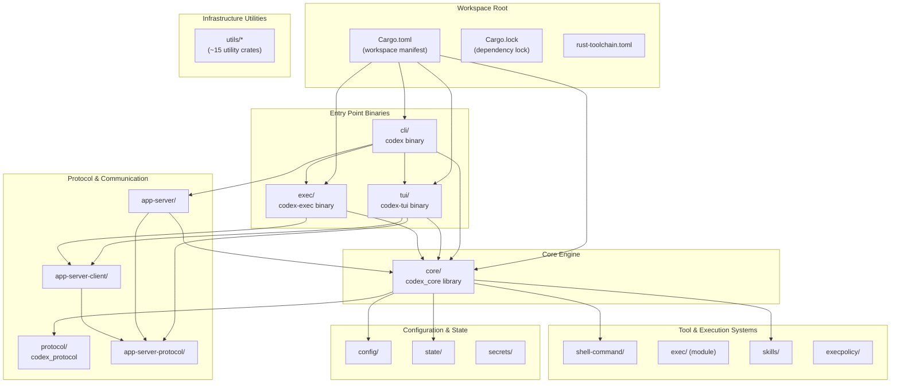
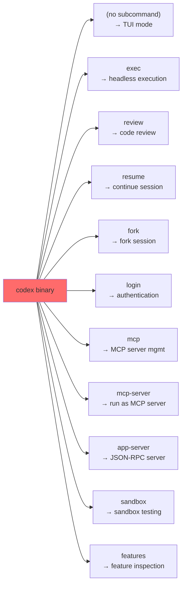
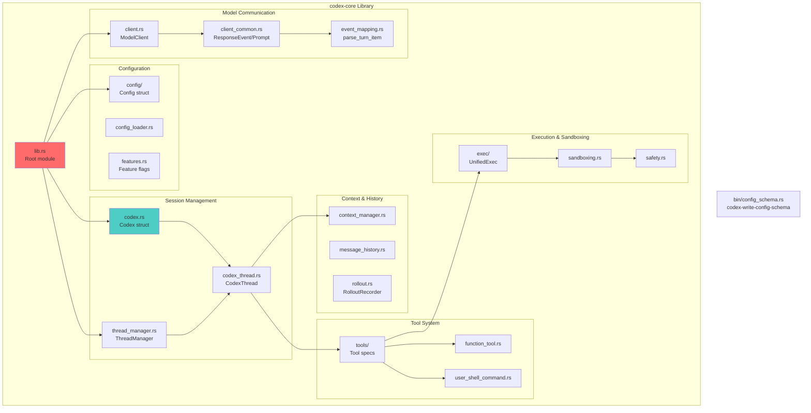
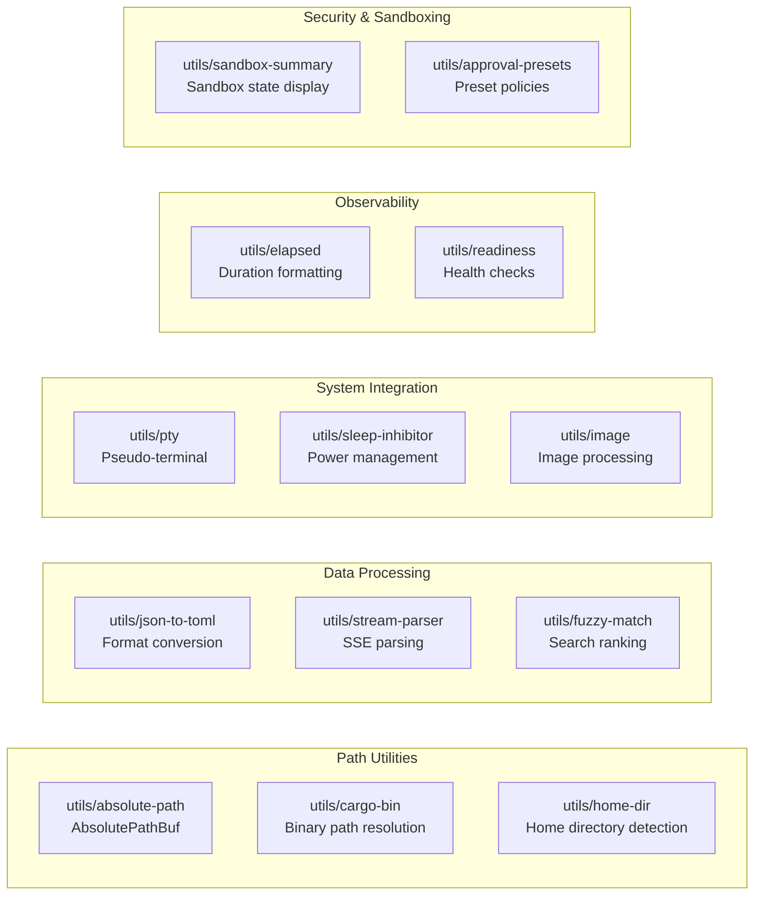
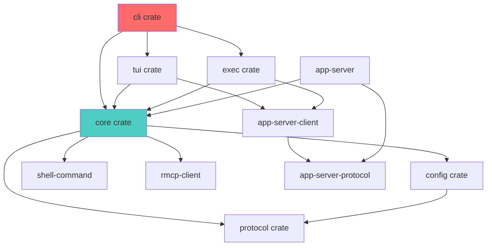

# Repository Structure

<details>
<summary>Relevant source files</summary>

The following files were used as context for generating this wiki page:

- [codex-rs/Cargo.lock](codex-rs/Cargo.lock)
- [codex-rs/Cargo.toml](codex-rs/Cargo.toml)
- [codex-rs/README.md](codex-rs/README.md)
- [codex-rs/cli/Cargo.toml](codex-rs/cli/Cargo.toml)
- [codex-rs/cli/src/main.rs](codex-rs/cli/src/main.rs)
- [codex-rs/config.md](codex-rs/config.md)
- [codex-rs/core/Cargo.toml](codex-rs/core/Cargo.toml)
- [codex-rs/core/src/flags.rs](codex-rs/core/src/flags.rs)
- [codex-rs/core/src/lib.rs](codex-rs/core/src/lib.rs)
- [codex-rs/core/src/model_provider_info.rs](codex-rs/core/src/model_provider_info.rs)
- [codex-rs/exec/Cargo.toml](codex-rs/exec/Cargo.toml)
- [codex-rs/exec/src/cli.rs](codex-rs/exec/src/cli.rs)
- [codex-rs/exec/src/lib.rs](codex-rs/exec/src/lib.rs)
- [codex-rs/tui/Cargo.toml](codex-rs/tui/Cargo.toml)
- [codex-rs/tui/src/cli.rs](codex-rs/tui/src/cli.rs)
- [codex-rs/tui/src/lib.rs](codex-rs/tui/src/lib.rs)

</details>

This page documents the Cargo workspace organization, key crates, and dependency relationships in the `codex-rs` repository. For installation and distribution mechanisms, see [1.1](#1.1). For architectural patterns and execution modes, see [1.3](#1.3).

## Scope and Organization

The `codex-rs` repository is organized as a Cargo workspace containing ~70 crates. The workspace uses a monorepo structure where all crates share common tooling, dependencies, and build configuration through the root `Cargo.toml` manifest.

**Sources:** [codex-rs/Cargo.toml:1-395](), [codex-rs/README.md:93-102]()

---

## Workspace Structure

The workspace is defined in [codex-rs/Cargo.toml:1-72]() with a `[workspace]` section listing all member crates. The workspace enforces shared configuration through `[workspace.package]`, `[workspace.dependencies]`, and `[workspace.lints]` sections.



**Sources:** [codex-rs/Cargo.toml:1-72](), [codex-rs/README.md:93-102]()

---

## Entry Point Crates

### CLI Multitool (`cli/`)

The `codex` binary serves as the unified entry point, routing to different execution modes via subcommands. The `MultitoolCli` struct in [codex-rs/cli/src/main.rs:70-82]() defines the command structure:

| Binary Name  | Crate        | Primary Function                                              |
| ------------ | ------------ | ------------------------------------------------------------- |
| `codex`      | `codex-cli`  | Multitool dispatcher with subcommand routing                  |
| `codex-tui`  | `codex-tui`  | Interactive terminal UI (launched via `codex` or `codex-tui`) |
| `codex-exec` | `codex-exec` | Non-interactive/headless execution                            |

The CLI dispatches to subcommands defined in [codex-rs/cli/src/main.rs:84-149]():



**Sources:** [codex-rs/cli/src/main.rs:70-149](), [codex-rs/cli/Cargo.toml:1-69]()

### Interactive TUI (`tui/`)

The `codex-tui` crate provides a fullscreen terminal interface built with [Ratatui](https://ratatui.rs/). Entry point is [codex-rs/tui/src/lib.rs:230-530]() with the `run_main` function:

- **Binary:** `codex-tui` ([codex-rs/tui/Cargo.toml:7-9]())
- **Library:** `codex_tui` for public API exports ([codex-rs/tui/Cargo.toml:11-13]())
- **Main loop:** `run_ratatui_app` in [codex-rs/tui/src/lib.rs:532-841]()

The crate exports key types for external integration:

- `Cli` struct for argument parsing ([codex-rs/tui/src/cli.rs:1-116]())
- `AppExitInfo` and `ExitReason` ([codex-rs/tui/src/lib.rs:8-9]())
- Public widgets like `ComposerInput` and `ComposerAction` ([codex-rs/tui/src/lib.rs:226-227]())

**Sources:** [codex-rs/tui/src/lib.rs:1-531](), [codex-rs/tui/Cargo.toml:1-145]()

### Headless Execution (`exec/`)

The `codex-exec` binary enables non-interactive operation with output to stdout/stderr or JSON. Core logic resides in [codex-rs/exec/src/lib.rs:161-466]():

- **Binary:** `codex-exec` ([codex-rs/exec/Cargo.toml:7-9]())
- **Library:** `codex_exec` ([codex-rs/exec/Cargo.toml:11-13]())
- **Entry:** `run_main` in [codex-rs/exec/src/lib.rs:161-466]()
- **Event processors:**
  - `EventProcessorWithHumanOutput` ([codex-rs/exec/src/event_processor_with_human_output.rs]())
  - `EventProcessorWithJsonOutput` ([codex-rs/exec/src/event_processor_with_jsonl_output.rs]())

CLI argument parsing is handled by the `Cli` struct in [codex-rs/exec/src/cli.rs:8-115]() with subcommands for `Resume` and `Review`.

**Sources:** [codex-rs/exec/src/lib.rs:1-466](), [codex-rs/exec/Cargo.toml:1-72](), [codex-rs/exec/src/cli.rs:1-319]()

---

## Core Engine (`core/`)

The `codex-core` crate contains the business logic for Codex sessions, model interactions, and tool orchestration. It is structured as a library with a config schema generator binary.



### Key Modules and Exports

The root module [codex-rs/core/src/lib.rs:1-178]() re-exports primary types:

| Export            | Source Module               | Purpose                      |
| ----------------- | --------------------------- | ---------------------------- |
| `Codex`           | [codex.rs:16]()             | Session lifecycle management |
| `CodexThread`     | [codex_thread.rs:22]()      | Individual thread state      |
| `ThreadManager`   | [thread_manager.rs:95-96]() | Multi-thread orchestration   |
| `ModelClient`     | [client.rs:157]()           | Model API communication      |
| `ResponseEvent`   | [client_common.rs:163]()    | Streaming event types        |
| `RolloutRecorder` | [rollout.rs:123]()          | Session persistence          |

### Binary Target

The crate includes a schema generator binary [codex-rs/core/Cargo.toml:12-14]() that outputs JSON Schema for configuration validation.

**Sources:** [codex-rs/core/src/lib.rs:1-178](), [codex-rs/core/Cargo.toml:1-183]()

---

## Protocol and Communication Layer

### Protocol Definitions (`protocol/`)

The `codex-protocol` crate defines shared types for communication between components. This includes event messages, configuration types, and API schemas.

### App Server Protocol (`app-server-protocol/`)

JSON-RPC protocol definitions for IDE integrations. Defines:

- Request/response types for `thread/*` and `turn/*` endpoints
- Notification types for streaming events
- Experimental API feature flags via `codex-experimental-api-macros`

The protocol is versioned and supports TypeScript/JSON Schema generation via [codex-rs/cli/src/main.rs:344-377]().

### App Server Implementation (`app-server/`)

WebSocket and stdio JSON-RPC server implementation. Core types:

- `CodexMessageProcessor` handles request routing
- `OutgoingMessageSender` manages bidirectional communication
- Transport abstraction supports `stdio://` and `ws://IP:PORT` endpoints

### App Server Client (`app-server-client/`)

In-process client for TUI and exec modes to reuse app-server logic. Provides `InProcessAppServerClient` with channel-based communication.

**Sources:** [codex-rs/Cargo.toml:92-93](), [codex-rs/cli/src/main.rs:311-342]()

---

## Configuration and State Management

### Configuration System (`config/`)

The `codex-config` crate implements the layered configuration system described in [2.2](#2.2). Key types:

- `Config` struct with validated settings
- `ConfigBuilder` for merging layers
- Profile system for environment-specific overrides

### State Persistence (`state/`)

SQLite-based state management via the `codex-state` crate:

- `StateRuntime` for database lifecycle
- Session metadata indexing
- Thread history storage

### Secrets Management (`secrets/`)

Encrypted credential storage using platform-specific keyrings.

**Sources:** [codex-rs/Cargo.toml:20-21,66](), [codex-rs/cli/src/main.rs:47-53]()

---

## Tool Execution and Shell Integration

### Shell Command Parsing (`shell-command/`)

Command parsing and safety analysis via `codex-shell-command`:

- `parse_command` for shell syntax parsing
- `is_safe_command` and `is_dangerous_command` classifiers
- Bash and PowerShell command structures

### Execution Policy (`execpolicy/`)

Starlark-based policy evaluation for command approval. Provides `ExecPolicyCheckCommand` for testing rules.

### Skills System (`skills/`)

Discovers and manages `.codex/skills` files for context injection.

**Sources:** [codex-rs/core/src/lib.rs:151-155](), [codex-rs/Cargo.toml:22,28-29,38]()

---

## Utility Crates

The workspace includes ~15 utility crates under `utils/*`:



Each utility is a standalone crate with focused functionality. For example:

- [codex-rs/Cargo.toml:132](): `codex-utils-absolute-path` for safe path handling
- [codex-rs/Cargo.toml:143](): `codex-utils-pty` for PTY session management
- [codex-rs/Cargo.toml:139](): `codex-utils-image` for image encoding/decoding

**Sources:** [codex-rs/Cargo.toml:45-71,132-149]()

---

## Dependency Management

### Workspace Dependencies

The workspace defines shared dependencies in [codex-rs/Cargo.toml:83-314]() with version pinning and feature flags. Key patterns:

| Dependency | Purpose       | Workspace Feature           |
| ---------- | ------------- | --------------------------- |
| `tokio`    | Async runtime | `rt-multi-thread`, `macros` |
| `serde`    | Serialization | `derive`                    |
| `clap`     | CLI parsing   | `derive`                    |
| `tracing`  | Observability | `log`                       |
| `rmcp`     | MCP protocol  | `server`, `macros`          |

### Dependency Graph



### Platform-Specific Dependencies

Platform-specific dependencies are declared via `[target.'cfg(...)'.dependencies]` sections:

- Linux: `landlock`, `seccompiler` ([codex-rs/core/Cargo.toml:120-123]())
- macOS: `core-foundation`, keyring with `apple-native` ([codex-rs/core/Cargo.toml:125-127]())
- Windows: `windows-sys` with specific feature flags ([codex-rs/core/Cargo.toml:137-143]())
- MUSL builds: vendored OpenSSL ([codex-rs/core/Cargo.toml:130-135]())

**Sources:** [codex-rs/Cargo.toml:83-318](), [codex-rs/core/Cargo.toml:120-147]()

---

## Build Configuration

### Workspace Settings

Shared build configuration in [codex-rs/Cargo.toml:74-82,367-376]():

| Setting         | Value          | Purpose                                   |
| --------------- | -------------- | ----------------------------------------- |
| `edition`       | `"2024"`       | Rust 2024 edition                         |
| `license`       | `"Apache-2.0"` | Apache 2.0 license                        |
| `lto`           | `"fat"`        | Link-time optimization for release        |
| `strip`         | `"symbols"`    | Remove debug symbols                      |
| `codegen-units` | `1`            | Single codegen unit for size optimization |

### Clippy Lints

Workspace enforces ~40 clippy lints defined in [codex-rs/Cargo.toml:322-356](). Notable denials:

- `unwrap_used` and `expect_used` to prevent panics
- Manual `*_fold`, `*_map`, `*_filter` patterns
- Redundant clones and closures
- Uninlined format args

### Cargo Patches

Development patches in [codex-rs/Cargo.toml:382-394]():

- `crossterm` with color query support
- `ratatui` with custom patches
- `tokio-tungstenite` and `tungstenite` with proxy fixes
- Optional local `rmcp` path for SDK development

**Sources:** [codex-rs/Cargo.toml:74-82,319-394](), [codex-rs/core/Cargo.toml:16-17]()

---

## Directory Layout

The physical directory structure mirrors the crate organization:

```
codex-rs/
├── Cargo.toml              # Workspace manifest
├── Cargo.lock              # Dependency lock
├── README.md               # Repository overview
├── cli/                    # codex binary (multitool)
│   ├── Cargo.toml
│   └── src/
│       ├── main.rs         # Entry point with MultitoolCli
│       └── lib.rs
├── tui/                    # Interactive TUI
│   ├── Cargo.toml
│   └── src/
│       ├── lib.rs          # run_main, TUI modules
│       ├── main.rs         # Binary wrapper
│       └── cli.rs          # Argument parsing
├── exec/                   # Headless execution
│   ├── Cargo.toml
│   └── src/
│       ├── lib.rs          # run_main, event processors
│       ├── main.rs
│       └── cli.rs
├── core/                   # Business logic
│   ├── Cargo.toml
│   └── src/
│       ├── lib.rs          # Module root with re-exports
│       ├── codex.rs        # Codex struct
│       ├── thread_manager.rs
│       ├── client.rs
│       └── ...             # ~80 modules
├── protocol/               # Shared types
├── config/                 # Configuration system
├── state/                  # State persistence
├── app-server/             # JSON-RPC server
├── app-server-client/      # In-process client
├── app-server-protocol/    # Protocol definitions
├── mcp-server/             # MCP server implementation
├── rmcp-client/            # MCP client wrapper
├── shell-command/          # Shell parsing
├── skills/                 # Skills discovery
├── execpolicy/             # Policy evaluation
└── utils/                  # Utility crates
    ├── absolute-path/
    ├── cargo-bin/
    ├── pty/
    └── ...                 # ~15 utilities
```

**Sources:** [codex-rs/Cargo.toml:1-71](), [codex-rs/README.md:93-102]()

---

## Feature Flags and Conditional Compilation

### TUI Features

The `codex-tui` crate defines optional features in [codex-rs/tui/Cargo.toml:15-22]():

- `voice-input` (default): Enables audio capture via `cpal` and `hound`
- `vt100-tests`: Enables terminal emulator-based tests
- `debug-logs`: Verbose internal logging

### Experimental API

The app-server protocol uses `codex-experimental-api-macros` to mark experimental endpoints. This allows TypeScript bindings generation with/without experimental APIs via `--experimental` flag ([codex-rs/cli/src/main.rs:364-366]()).

**Sources:** [codex-rs/tui/Cargo.toml:15-22](), [codex-rs/cli/src/main.rs:353-377]()
