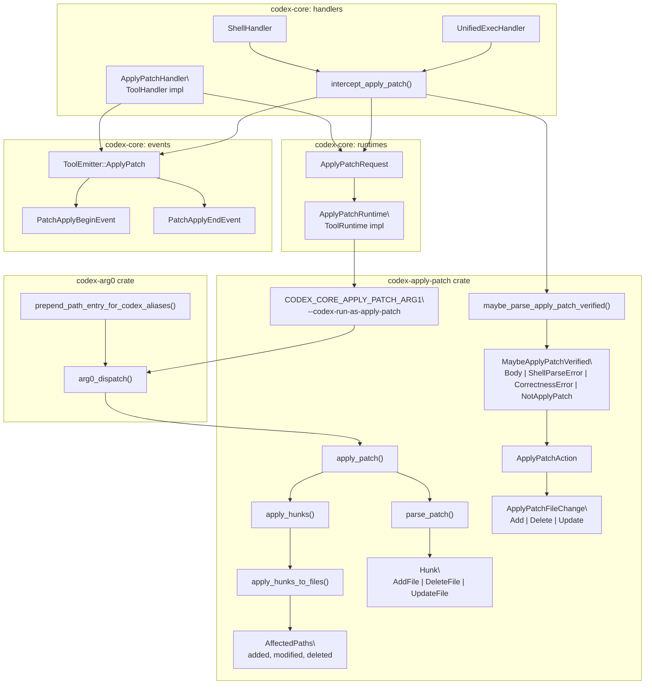
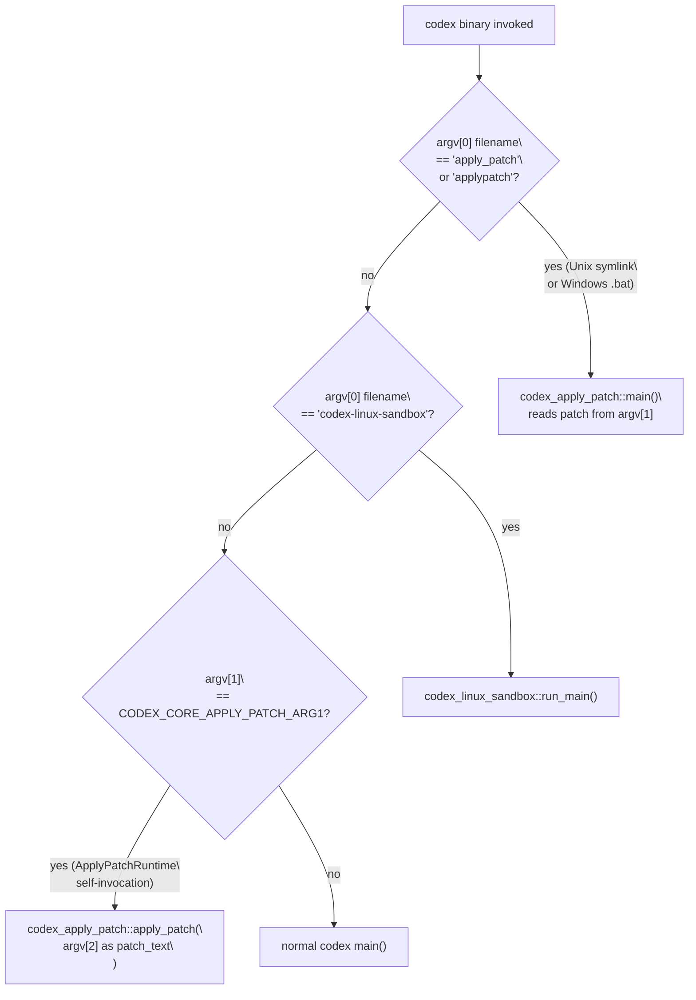

# Apply Patch System

<details>
<summary>Relevant source files</summary>

The following files were used as context for generating this wiki page:

- [codex-rs/core/src/codex_tests.rs](codex-rs/core/src/codex_tests.rs)
- [codex-rs/core/src/codex_tests_guardian.rs](codex-rs/core/src/codex_tests_guardian.rs)
- [codex-rs/core/src/state/service.rs](codex-rs/core/src/state/service.rs)
- [codex-rs/core/src/tools/handlers/mod.rs](codex-rs/core/src/tools/handlers/mod.rs)
- [codex-rs/core/src/tools/spec.rs](codex-rs/core/src/tools/spec.rs)
- [codex-rs/core/tests/suite/code_mode.rs](codex-rs/core/tests/suite/code_mode.rs)
- [codex-rs/core/tests/suite/request_permissions.rs](codex-rs/core/tests/suite/request_permissions.rs)

</details>

## Purpose and Scope

This page documents the `apply_patch` tool system: the patch format, parsing pipeline, interception mechanism, approval integration, and filesystem execution. Two invocation paths exist — a direct function tool call and a shell-level interception that detects heredoc-wrapped `apply_patch` calls before any subprocess is spawned.

For the general tool registry that registers `ApplyPatchHandler`, see [Tool Registry and Configuration](#5.1). For the shell tools that trigger interception, see [Shell Execution Tools](#5.2). For `ToolOrchestrator` and the approval flow used by both paths, see [Tool Orchestration and Approval](#5.5).

---

## Patch Format

The apply_patch system uses a custom diff-like format bounded by `*** Begin Patch` / `*** End Patch` delimiters. Three hunk types are supported:

| Hunk Keyword       | Syntax                                           | Effect                                  |
| ------------------ | ------------------------------------------------ | --------------------------------------- |
| `*** Add File:`    | Followed by `+<line>` lines                      | Creates a new file with the given lines |
| `*** Delete File:` | Path only                                        | Removes a file from the filesystem      |
| `*** Update File:` | Followed by `@@` sections with `+`/`-`/` ` lines | Applies a diff to an existing file      |
| `*** Move to:`     | Inside an Update hunk                            | Combined with Update: renames the file  |

A minimal example:

```
*** Begin Patch
*** Add File: src/hello.txt
+Hello, world!
*** Update File: src/existing.txt
@@ context anchor
 context line
-old line
+new line
*** Delete File: src/old.txt
*** End Patch
```

Sources: [codex-rs/apply-patch/src/parser.rs:1-30](), [codex-rs/apply-patch/src/lib.rs:85-108]()

---

## Architecture Overview

**Code-entity diagram: apply_patch component map**



Sources: [codex-rs/apply-patch/src/lib.rs:1-60](), [codex-rs/core/src/tools/handlers/apply_patch.rs:1-40](), [codex-rs/core/src/tools/runtimes/apply_patch.rs:1-40](), [codex-rs/core/src/tools/events.rs:90-150](), [codex-rs/arg0/src/lib.rs:1-110]()

---

## Two Invocation Paths

**Sequence diagram: direct vs. intercepted invocation**

```mermaid
sequenceDiagram
    participant Model as "Model"
    participant SH as "ShellHandler / UnifiedExecHandler"
    participant APH as "ApplyPatchHandler"
    participant intercept as "intercept_apply_patch()"
    participant maybe_parse as "maybe_parse_apply_patch_verified()"
    participant Orch as "ToolOrchestrator"
    participant APR as "ApplyPatchRuntime"
    participant Emitter as "ToolEmitter::ApplyPatch"
    participant Sub as "subprocess\
codex --codex-run-as-apply-patch"

    alt "Path 1: direct apply_patch tool call"
        Model ->> APH: "ToolPayload::Function or Custom"
        APH ->> Emitter: "PatchApplyBegin"
        APH ->> Orch: "run(ApplyPatchRequest, ApplyPatchRuntime)"
        Orch ->> APR: "attempt run"
        APR ->> Sub: "spawn self-invocation"
        Sub -->> APR: "stdout / stderr"
        APR -->> Orch: "ExecToolCallOutput"
        Orch -->> APH: "result"
        APH ->> Emitter: "PatchApplyEnd"
        APH -->> Model: "ToolOutput::Function"
    else "Path 2: shell command intercepted"
        Model ->> SH: "shell command with apply_patch heredoc"
        SH ->> intercept: "intercept_apply_patch(command, cwd, ...)"
        intercept ->> maybe_parse: "maybe_parse_apply_patch_verified(argv)"
        maybe_parse -->> intercept: "Body(ApplyPatchAction) or NotApplyPatch"
        intercept ->> Emitter: "PatchApplyBegin"
        intercept ->> Orch: "run(ApplyPatchRequest, ApplyPatchRuntime)"
        Orch ->> APR: "attempt run"
        APR ->> Sub: "spawn self-invocation"
        Sub -->> APR: "stdout / stderr"
        intercept ->> Emitter: "PatchApplyEnd"
        intercept -->> SH: "Some(ToolOutput) — shell exec skipped"
    end
```

Sources: [codex-rs/core/src/tools/handlers/shell.rs:358-374](), [codex-rs/core/src/tools/handlers/unified_exec.rs:206-219](), [codex-rs/core/src/tools/handlers/apply_patch.rs:81-200]()

---

## Patch Parsing

All parsing lives in the `codex-apply-patch` crate (`codex-rs/apply-patch/`).

### Entry Points

| Function                             | File                | Purpose                                                              |
| ------------------------------------ | ------------------- | -------------------------------------------------------------------- |
| `parse_patch()`                      | `src/parser.rs`     | Parse raw patch text into `Vec<Hunk>`                                |
| `apply_patch()`                      | `src/lib.rs`        | Parse and apply; write result to stdout/stderr writers               |
| `apply_hunks()`                      | `src/lib.rs`        | Apply pre-parsed hunks                                               |
| `apply_hunks_to_files()`             | `src/lib.rs`        | Internal: execute filesystem mutations                               |
| `maybe_parse_apply_patch_verified()` | `src/invocation.rs` | Parse a shell argv to detect an apply_patch invocation and verify it |
| `unified_diff_from_chunks()`         | `src/lib.rs`        | Compute a unified diff from update chunks (for display)              |

Sources: [codex-rs/apply-patch/src/lib.rs:182-215](), [codex-rs/apply-patch/src/invocation.rs:1-50]()

### `Hunk` Enum

Defined in `apply-patch/src/parser.rs`:

```
Hunk::AddFile   { path: PathBuf, contents: String }
Hunk::DeleteFile { path: PathBuf }
Hunk::UpdateFile { path: PathBuf, move_path: Option<PathBuf>, chunks: Vec<UpdateFileChunk> }
```

Each `UpdateFileChunk` holds:

| Field            | Type             | Description                                     |
| ---------------- | ---------------- | ----------------------------------------------- |
| `change_context` | `Option<String>` | Anchor line (`@@ <text>`) for positional search |
| `old_lines`      | `Vec<String>`    | Lines to be removed                             |
| `new_lines`      | `Vec<String>`    | Replacement lines                               |
| `is_end_of_file` | `bool`           | Whether the chunk targets the end of file       |

Sources: [codex-rs/apply-patch/src/parser.rs:1-50]()

### Context-based Matching

`compute_replacements()` in [codex-rs/apply-patch/src/lib.rs:386-474]() locates `old_lines` within the file using `seek_sequence()`. If a `change_context` anchor is present, it first jumps to that line. If a direct search fails and `old_lines` ends with an empty string (representing a trailing newline), the search retries without the trailing entry to handle end-of-file edge cases reliably.

Replacements are accumulated and applied in **descending index order** so earlier replacements do not shift the positions of later ones.

Sources: [codex-rs/apply-patch/src/lib.rs:386-502]()

---

## `MaybeApplyPatchVerified`

`maybe_parse_apply_patch_verified()` is the gateway for the interception path. It parses a shell argv (extracting the patch body from heredoc syntax using a tree-sitter Bash parser) and returns one of:

| Variant                                | Meaning                                                            |
| -------------------------------------- | ------------------------------------------------------------------ |
| `Body(ApplyPatchAction)`               | Valid apply_patch call; `action.changes` holds the file change map |
| `ShellParseError(ExtractHeredocError)` | Shell syntax could not be parsed; ambiguous                        |
| `CorrectnessError(ApplyPatchError)`    | Recognized as apply_patch but patch is malformed                   |
| `NotApplyPatch`                        | Command is definitely not an apply_patch invocation                |

The `intercept_apply_patch()` function handles each variant:

- `NotApplyPatch` → returns `Ok(None)`, shell/exec execution continues normally.
- `ShellParseError` or `CorrectnessError` → returns a `FunctionCallError::RespondToModel` with an error description.
- `Body(action)` → proceeds with patch application.

Sources: [codex-rs/apply-patch/src/lib.rs:111-123](), [codex-rs/apply-patch/src/invocation.rs:1-100]()

---

## `ApplyPatchAction` and `ApplyPatchFileChange`

`ApplyPatchAction` is the verified, post-parse representation:

| Field     | Type                                     | Description                                         |
| --------- | ---------------------------------------- | --------------------------------------------------- |
| `changes` | `HashMap<PathBuf, ApplyPatchFileChange>` | Per-file operations                                 |
| `patch`   | `String`                                 | Canonical patch text (no heredoc wrapper)           |
| `cwd`     | `PathBuf`                                | Working directory used for relative path resolution |

`ApplyPatchFileChange` describes the intended operation per file:

| Variant  | Fields                                 | Meaning                         |
| -------- | -------------------------------------- | ------------------------------- |
| `Add`    | `content: String`                      | File to create                  |
| `Delete` | `content: String`                      | File to remove                  |
| `Update` | `unified_diff, move_path, new_content` | File to modify; optionally move |

Sources: [codex-rs/apply-patch/src/lib.rs:85-180]()

---

## Shell Interception: `intercept_apply_patch()`

Defined in [codex-rs/core/src/tools/handlers/apply_patch.rs]() and called from:

- `ShellHandler::run_exec_like()` at [codex-rs/core/src/tools/handlers/shell.rs:359-373]()
- `UnifiedExecHandler::handle()` at [codex-rs/core/src/tools/handlers/unified_exec.rs:206-219]()

In the `UnifiedExecHandler` case, a process ID has already been allocated via `manager.allocate_process_id()` before interception is checked. If `intercept_apply_patch()` returns `Some(output)`, the handler releases that process ID with `manager.release_process_id()` before returning, since no PTY was ever spawned.

Sources: [codex-rs/core/src/tools/handlers/apply_patch.rs:1-200](), [codex-rs/core/src/tools/handlers/unified_exec.rs:150-220]()

---

## `ApplyPatchHandler` (Direct Tool Call)

`ApplyPatchHandler` implements `ToolHandler` and handles two payload variants:

| `ToolPayload` Variant    | Source                            | Parsing                                             |
| ------------------------ | --------------------------------- | --------------------------------------------------- |
| `Function { arguments }` | JSON function call from the model | Deserializes `ApplyPatchToolArgs { input: String }` |
| `Custom { input }`       | Internal/freeform invocation      | Uses `input` string directly                        |

After extracting the patch text, the handler:

1. Calls `maybe_parse_apply_patch_verified()` to re-verify the patch and produce an `ApplyPatchAction`.
2. Calls `file_paths_for_action()` to collect affected absolute paths as approval cache keys.
3. Constructs an `ApplyPatchRequest` containing the action, file paths, and changes.
4. Emits `PatchApplyBegin` via `ToolEmitter::ApplyPatch`.
5. Delegates to `ToolOrchestrator::run()` with `ApplyPatchRuntime`.
6. Emits `PatchApplyEnd` based on the outcome.
7. Returns `ToolOutput::Function { body: FunctionCallOutputBody::Text(content) }`.

Sources: [codex-rs/core/src/tools/handlers/apply_patch.rs:36-200]()

---

## `ApplyPatchRuntime` (Execution)

`ApplyPatchRuntime` implements `ToolRuntime<ApplyPatchRequest, ExecToolCallOutput>` in [codex-rs/core/src/tools/runtimes/apply_patch.rs]().

### Self-invocation Command

The runtime builds a command of the form:

```
[current_exe, "--codex-run-as-apply-patch", "<patch_text>"]
```

`CODEX_CORE_APPLY_PATCH_ARG1 = "--codex-run-as-apply-patch"` is the constant defined in [codex-rs/apply-patch/src/lib.rs:35]() and consumed by `arg0_dispatch()` in [codex-rs/arg0/src/lib.rs:89-107]().

### `ApplyPatchRequest` Fields

| Field             | Type                           | Purpose                            |
| ----------------- | ------------------------------ | ---------------------------------- |
| `action`          | `ApplyPatchAction`             | Parsed, verified patch             |
| `file_paths`      | `Vec<AbsolutePathBuf>`         | Approval cache keys                |
| `changes`         | `HashMap<PathBuf, FileChange>` | Protocol representation for events |
| `approval_policy` | `AskForApproval`               | Governs whether to prompt the user |
| `cwd`             | `PathBuf`                      | Working directory for subprocess   |

### Approval

`ApplyPatchRuntime` implements `Approvable<ApplyPatchRequest>`. Approval keys are the absolute paths of affected files, enabling the `ApprovalStore` to skip re-prompting when the same files are touched again in the same session.

The `Sandboxable` impl uses `SandboxablePreference::Auto`, so sandboxing applies according to the active session policy.

Sources: [codex-rs/core/src/tools/runtimes/apply_patch.rs:1-200]()

---

## Events

The apply_patch system emits two `EventMsg` variants via `ToolEmitter::ApplyPatch` defined in [codex-rs/core/src/tools/events.rs:97-109]():

### `PatchApplyBeginEvent`

Emitted before execution starts. The `SharedTurnDiffTracker` is also notified via `on_patch_begin()` to track changes for turn diff reporting.

| Field           | Type                           | Description                        |
| --------------- | ------------------------------ | ---------------------------------- |
| `call_id`       | `String`                       | Tool call identifier               |
| `turn_id`       | `String`                       | Current turn sub-ID                |
| `auto_approved` | `bool`                         | Whether user approval was bypassed |
| `changes`       | `HashMap<PathBuf, FileChange>` | Proposed file changes              |

### `PatchApplyEndEvent`

Emitted after the subprocess completes.

| Field     | Type               | Description                       |
| --------- | ------------------ | --------------------------------- |
| `call_id` | `String`           | Tool call identifier              |
| `turn_id` | `String`           | Current turn sub-ID               |
| `success` | `bool`             | Whether the patch applied cleanly |
| `stdout`  | `String`           | Subprocess stdout                 |
| `stderr`  | `String`           | Subprocess stderr                 |
| `status`  | `PatchApplyStatus` | `Completed` or `Failed`           |

Sources: [codex-rs/core/src/tools/events.rs:170-230]()

---

## Filesystem Operations

`apply_hunks_to_files()` in [codex-rs/apply-patch/src/lib.rs:278-339]() performs the actual writes:

| Hunk Type                  | Filesystem Operations                                                                             |
| -------------------------- | ------------------------------------------------------------------------------------------------- |
| `AddFile`                  | `fs::create_dir_all(parent)` + `fs::write(path, contents)`                                        |
| `DeleteFile`               | `fs::remove_file(path)`                                                                           |
| `UpdateFile`               | Read file → compute replacements → `fs::write(path, new_contents)`                                |
| `UpdateFile` + `move_path` | `fs::create_dir_all(dest_parent)` + `fs::write(dest, new_contents)` + `fs::remove_file(original)` |

On success, `print_summary()` at [codex-rs/apply-patch/src/lib.rs:537-552]() writes to the provided stdout writer:

```
Success. Updated the following files:
A src/new_file.txt
M src/modified.txt
D src/old.txt
```

This becomes the content returned to the model as the tool response.

Sources: [codex-rs/apply-patch/src/lib.rs:278-552]()

---

## Binary Dispatch

**Dispatch decision diagram: how `apply_patch` resolves to `apply_patch_fn()`**



Two mechanisms make `apply_patch` available on `PATH`:

- **Unix**: `prepend_path_entry_for_codex_aliases()` at [codex-rs/arg0/src/lib.rs:228-305]() creates a temporary directory containing an `apply_patch` symlink pointing to the current executable and prepends it to `PATH`. The arg0 check at [codex-rs/arg0/src/lib.rs:84-87]() dispatches to `codex_apply_patch::main()`.

- **Windows**: A `.bat` file is created that passes `CODEX_CORE_APPLY_PATCH_ARG1` explicitly. At [codex-rs/arg0/src/lib.rs:89-107](), `arg0_dispatch()` checks `argv[1]` for this flag, reads `argv[2]` as the patch text, and calls `codex_apply_patch::apply_patch()` directly.

Sources: [codex-rs/arg0/src/lib.rs:47-122](), [codex-rs/apply-patch/src/lib.rs:29-36]()

---

## Relationship to Other Tool Systems

- **Shell Execution Tools** ([5.2](#5.2)): Both `ShellHandler` and `ShellCommandHandler` call `intercept_apply_patch()` early in `run_exec_like()`. A successful interception means no shell subprocess is ever spawned for that call.
- **Unified Exec** ([5.3](#5.3)): `UnifiedExecHandler` calls `intercept_apply_patch()` after allocating a process ID but before spawning a PTY. On interception, the process ID is released via `manager.release_process_id()`.
- **Tool Orchestration and Approval** ([5.5](#5.5)): Both paths route through `ToolOrchestrator`, which handles approval prompts, sandbox selection, and retry-on-denial semantics. `ApplyPatchRuntime`'s file-path-based approval keys let the `ApprovalStore` cache session approvals per file.
- **Sandboxing** ([5.6](#5.6)): The self-invocation subprocess runs under the standard sandbox policy. The minimal execution environment (no inherited shell state, only the patch text as an argument) reduces the sandbox surface area.
